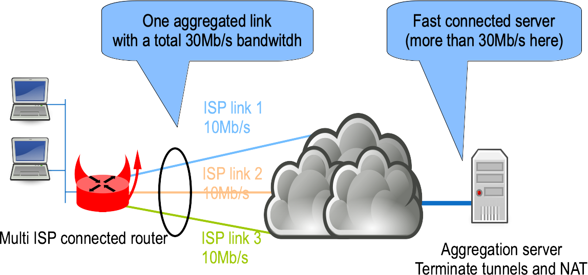
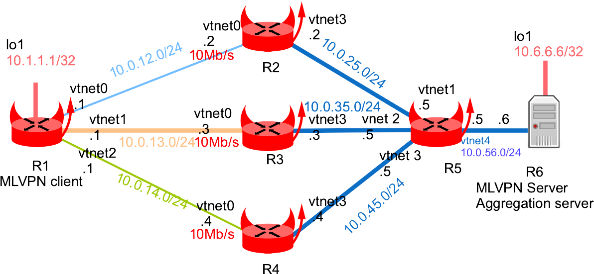

This lab shows an example of aggregating multiple independent ISP links with [MLVPN](https://zehome.github.io/MLVPN/).

## Network diagram

Here is the concept:



And here is this lab detailed diagram:



## Virtual Lab setup

This chapter will describe how to start each routers and configuring the 4 centrals routers.

More information on these BSDRP lab scripts available on [How to build a BSDRP router lab](how-to-build-a-bsdrp-router-lab.md).

Start the Virtual lab (example using bhyve):

```
# ./tools/BSDRP-lab-bhyve.sh -n 6
BSD Router Project (http://bsdrp.net) - bhyve full-meshed lab script
Setting-up a virtual lab with 6 VM(s):
- Working directory: /root/BSDRP-VMs
- Each VM has a total of 1 (1 cores and 1 threads) and 512M RAM
- Emulated NIC: virtio-net
- Switch mode: bridge + tap
- 0 LAN(s) between all VM
- Full mesh Ethernet links between each VM
VM 1 has the following NIC:
- vtnet0 connected to VM 2
- vtnet1 connected to VM 3
- vtnet2 connected to VM 4
- vtnet3 connected to VM 5
- vtnet4 connected to VM 6
VM 2 has the following NIC:
- vtnet0 connected to VM 1
- vtnet1 connected to VM 3
- vtnet2 connected to VM 4
- vtnet3 connected to VM 5
- vtnet4 connected to VM 6
VM 3 has the following NIC:
- vtnet0 connected to VM 1
- vtnet1 connected to VM 2
- vtnet2 connected to VM 4
- vtnet3 connected to VM 5
- vtnet4 connected to VM 6
VM 4 has the following NIC:
- vtnet0 connected to VM 1
- vtnet1 connected to VM 2
- vtnet2 connected to VM 3
- vtnet3 connected to VM 5
- vtnet4 connected to VM 6
VM 5 has the following NIC:
- vtnet0 connected to VM 1
- vtnet1 connected to VM 2
- vtnet2 connected to VM 3
- vtnet3 connected to VM 4
- vtnet4 connected to VM 6
VM 6 has the following NIC:
- vtnet0 connected to VM 1
- vtnet1 connected to VM 2
- vtnet2 connected to VM 3
- vtnet3 connected to VM 4
To connect VM'serial console, you can use:
- VM 1 : cu -l /dev/nmdm-BSDRP.1B
- VM 2 : cu -l /dev/nmdm-BSDRP.2B
- VM 3 : cu -l /dev/nmdm-BSDRP.3B
- VM 4 : cu -l /dev/nmdm-BSDRP.4B
- VM 5 : cu -l /dev/nmdm-BSDRP.5B
- VM 6 : cu -l /dev/nmdm-BSDRP.6B
```

### Backbone routers configuration

#### Router 2

Router 2 is configured for rate-limiting traffic at 10 Mb/s on interface to/from VM1.

```
sysrc hostname=VM2 \
        ifconfig_vtnet0="inet 10.0.12.2/24" \
        ifconfig_vtnet3="inet 10.0.25.2/24" \
        defaultrouter="10.0.25.5" \
        firewall_enable=YES \
        firewall_script="/etc/ipfw.rules"
cat > /etc/ipfw.rules <<EOF
#!/bin/sh
fwcmd="/sbin/ipfw"
kldstat -q -m dummynet || kldload dummynet
# Flush out the list before we begin.
\${fwcmd} -f flush
\${fwcmd} pipe 10 config bw 10Mbit/s
\${fwcmd} pipe 20 config bw 10Mbit/s
#Traffic getting out vtnet0 is limited to 10Mbit/s
\${fwcmd} add 1000 pipe 10 all from any to any out via vtnet0
#Traffic getting int vtnet0 is limited to 10Mbit/s
\${fwcmd} add 2000 pipe 20 all from any to any in via vtnet0
#We don't want to block traffic, only shape some
\${fwcmd} add 3000 allow ip from any to any
EOF

service netif restart
service routing restart
service ipfw start
hostname VM2
config save
```

#### Router 3

Router 3 is configured for rate-limiting traffic at 10 Mb/s on interface to/from VM1.

```
sysrc hostname=VM3 \
        ifconfig_vtnet0="inet 10.0.13.3/24" \
        ifconfig_vtnet3="inet 10.0.35.3/24" \
        defaultrouter="10.0.35.5" \
        firewall_enable=YES \
        firewall_script="/etc/ipfw.rules"

cat > /etc/ipfw.rules <<EOF
#!/bin/sh
fwcmd="/sbin/ipfw"
kldstat -q -m dummynet || kldload dummynet
# Flush out the list before we begin.
\${fwcmd} -f flush
\${fwcmd} pipe 10 config bw 10Mbit/s
\${fwcmd} pipe 20 config bw 10Mbit/s
#Traffic getting out vtnet0 is limited to 10Mbit/s
\${fwcmd} add 1000 pipe 10 all from any to any out via vtnet0
#Traffic getting int vtnet0 is limited to 10Mbit/s
\${fwcmd} add 2000 pipe 20 all from any to any in via vtnet0
#We don't want to block traffic, only shape some
\${fwcmd} add 3000 allow ip from any to any
EOF

service netif restart
service routing restart
service ipfw start
hostname VM3
config save
```

#### Router 4

Router 4 is configured for rate-limiting traffic at 10 Mb/s on interface to/from VM1.

```
sysrc hostname=VM4 \
        ifconfig_vtnet0="inet 10.0.14.4/24" \
        ifconfig_vtnet3="inet 10.0.45.4/24" \
        defaultrouter="10.0.45.5" \
        firewall_enable=YES \
        firewall_script="/etc/ipfw.rules"

cat > /etc/ipfw.rules <<EOF
#!/bin/sh
fwcmd="/sbin/ipfw"
kldstat -q -m dummynet || kldload dummynet
# Flush out the list before we begin.
\${fwcmd} -f flush
\${fwcmd} pipe 10 config bw 10Mbit/s
\${fwcmd} pipe 20 config bw 10Mbit/s
#Traffic getting out vtnet0 is limited to 10Mbit/s
\${fwcmd} add 1000 pipe 10 all from any to any out via vtnet0
#Traffic getting int vten0 is limited to 10Mbit/s
\${fwcmd} add 2000 pipe 20 all from any to any in via vtnet0
#We don't want to block traffic, only shape some
\${fwcmd} add 3000 allow ip from any to any
EOF

service netif restart
service routing restart
service ipfw start
hostname VM4
config save
```

#### Router 5

Router 5 is the aggregating server’s default gateway.

```
sysrc hostname=R5 \
        ifconfig_vtnet1="inet 10.0.25.5/24" \
        ifconfig_vtnet2="inet 10.0.35.5/24" \
        ifconfig_vtnet3="inet 10.0.45.5/24" \
        ifconfig_vtnet4="inet 10.0.56.5/24" \
        static_routes="ISP1 ISP2 ISP3" \
        route_ISP1="-host 10.0.12.1 10.0.25.2" \
        route_ISP2="-host 10.0.13.1 10.0.35.3" \
        route_ISP3="-host 10.0.14.1 10.0.45.4"
service netif restart
service routing restart
hostname VM5
config save
```

### Router 1 : MLVPN client

Router 1 is configured as a MLVPN client router connected to 3 different Internet links.

We need a default routes for each ISP links, then a minimum of 4 different routing tables.

```
sysrc hostname=VM1 \
        cloned_interfaces="lo1" \
        ifconfig_lo1="inet 10.1.1.1/32" \
        ifconfig_vtnet0="inet 10.0.12.1/24 fib 2" \
        ifconfig_vtnet1="inet 10.0.13.1/24 fib 3" \
        ifconfig_vtnet2="inet 10.0.14.1/24 fib 4" \
        static_routes="ISP1 ISP2 ISP3" \
        route_ISP1="-fib 2 default 10.0.12.2" \
        route_ISP2="-fib 3 default 10.0.13.3" \
        route_ISP3="-fib 4 default 10.0.14.4"
cat <<EOF > /usr/local/etc/mlvpn/mlvpn.conf
[general]
statuscommand = "/usr/local/etc/mlvpn/mlvpn_updown.sh"
mode = "client"
mtu = 1452
tuntap = "tun"
ip4 = "10.0.16.1/30"
ip4_gateway = "10.0.16.2"
ip4_routes = "10.6.6.6/32"
timeout = 30
password = "pleasechangeme!"
#reorder_buffer_size = 64
loss_tolerence = 10

[dsl2]
bindhost = "10.0.12.1"
bindport = 5082
bindfib = 2
remotehost = "10.0.56.6"
remoteport = 5082
[dsl3]
bindhost = "10.0.13.1"
bindport = 5083
bindfib = 3
remotehost = "10.0.56.6"
remoteport = 5083

[dsl4]
bindhost = "10.0.14.1"
bindport = 5084
bindfib = 4
remotehost = "10.0.56.6"
remoteport = 5084

EOF
service mlvpn enable
service netif restart
service routing restart
service mlvpn start
hostname VM1
config save
```

### Router 6 : MLVPN server

Router 6 is configured as a aggregating server.

```
sysrc hostname=VM6 \
        cloned_interfaces="lo1" \
        ifconfig_lo1="inet 10.6.6.6/32" \
        ifconfig_vtnet4="inet 10.0.56.6/24" \
        defaultrouter="10.0.56.5"
cat > /usr/local/etc/mlvpn/mlvpn.conf <<EOF
[general]
statuscommand = "/usr/local/etc/mlvpn/mlvpn_updown.sh"
tuntap = "tun"
mode = "server"
ip4 = "10.0.16.2/30"
ip4_gateway = "10.0.16.1"
ip4_routes = "10.1.1.1/32"
timeout = 30
password = "pleasechangeme!"
#reorder_buffer_size = 64
loss_tolerence = 10

[adsl2]
bindhost = "10.0.56.6"
bindport = 5082

[adsl3]
bindhost = "10.0.56.6"
bindport = 5083

[adsl4]
bindhost = "10.0.56.6"
bindport = 5084

EOF

service mlvpn enable
service netif restart
service routing restart
service mlvpn start
hostname VM6
config save
```

## Basic Tests

### FIB test

Start by checking that R5 is reacheable from each R1’s fib (2, 3):

```
[root@VM1]~# setfib 2 ping -c 2 10.0.56.6
PING 10.0.56.6 (10.0.56.6): 56 data bytes
64 bytes from 10.0.56.6: icmp_seq=0 ttl=62 time=16.473 ms
64 bytes from 10.0.56.6: icmp_seq=1 ttl=62 time=20.017 ms

--- 10.0.56.6 ping statistics ---
2 packets transmitted, 2 packets received, 0.0% packet loss
round-trip min/avg/max/stddev = 16.473/18.245/20.017/1.772 ms
[root@VM1]~# setfib 3 ping -c 2 10.0.56.6
PING 10.0.56.6 (10.0.56.6): 56 data bytes
64 bytes from 10.0.56.6: icmp_seq=0 ttl=62 time=18.202 ms
64 bytes from 10.0.56.6: icmp_seq=1 ttl=62 time=11.193 ms

--- 10.0.56.6 ping statistics ---
2 packets transmitted, 2 packets received, 0.0% packet loss
round-trip min/avg/max/stddev = 11.193/14.698/18.202/3.504 ms
[root@VM1]~# setfib 4 ping -c 2 10.0.56.6
PING 10.0.56.6 (10.0.56.6): 56 data bytes
64 bytes from 10.0.56.6: icmp_seq=0 ttl=62 time=10.973 ms
64 bytes from 10.0.56.6: icmp_seq=1 ttl=62 time=14.465 ms

--- 10.0.56.6 ping statistics ---
2 packets transmitted, 2 packets received, 0.0% packet loss
round-trip min/avg/max/stddev = 10.973/12.719/14.465/1.746 ms
```

### Links bandwidth

Test bandwidth of each link by starting an iperf on MLVPN server:

```
[root@VM6]# iperf3 -s
```

Then from the MLVPN client, test bandwidth for each ISP links:


```
[root@VM1]~# setfib 2 iperf3 -c 10.0.56.6
(...)
[ ID] Interval           Transfer     Bitrate         Retr
[  5]   0.00-10.00  sec  11.5 MBytes  9.62 Mbits/sec    0             sender
[  5]   0.00-10.06  sec  11.4 MBytes  9.53 Mbits/sec                  receiver

[root@VM1]~# setfib 3 iperf3 -c 10.0.56.6
(...)
[ ID] Interval           Transfer     Bitrate         Retr
[  5]   0.00-10.00  sec  11.4 MBytes  9.57 Mbits/sec    3             sender
[  5]   0.00-10.06  sec  11.4 MBytes  9.47 Mbits/sec                  receiver

[root@VM1]~# setfib 4 iperf3 -c 10.0.56.6
Connecting to host 10.0.56.6, port 5201
(...)
[ ID] Interval           Transfer     Bitrate         Retr
[  5]   0.00-10.00  sec  11.5 MBytes  9.62 Mbits/sec    0             sender
[  5]   0.00-10.06  sec  11.4 MBytes  9.53 Mbits/sec                  receiver
```

## MLVPN tests

### tunnel

MLVPN can be started in debug mode:

```
[root@VM1]~# mlvpn --debug -n mlvpn -u mlvpn --config /usr/local/etc/mlvpn/mlvpn.conf
2020-02-21T21:25:12 [INFO/config] new password set
2020-02-21T21:25:12 [INFO/config] dsl2 tunnel added
2020-02-21T21:25:12 [INFO/config] dsl3 tunnel added
2020-02-21T21:25:12 [INFO/config] dsl4 tunnel added
2020-02-21T21:25:12 [INFO] created interface `tun0'
2020-02-21T21:25:12 [INFO] dsl2 bind to 10.0.12.1
2020-02-21T21:25:12 [INFO] dsl3 bind to 10.0.13.1
2020-02-21T21:25:12 [INFO] dsl4 bind to 10.0.14.1
2020-02-21T21:25:12 [INFO/protocol] dsl2 authenticated
2020-02-21T21:25:12 [INFO/protocol] dsl3 authenticated
2020-02-21T21:25:12 [INFO/protocol] dsl4 authenticated
```

tun interface need to be check (correct IP address and non-1500 MTU):

```
[root@VM1]~# ifconfig tun0
tun0: flags=8051<UP,POINTOPOINT,RUNNING,MULTICAST> metric 0 mtu 1452
        options=80000<LINKSTATE>
        inet6 fe80::5a9c:fcff:fe01:201%tun0 prefixlen 64 scopeid 0x9
        inet 10.0.16.1 --> 10.0.16.2 netmask 0xfffffffc
        groups: tun
        nd6 options=21<PERFORMNUD,AUTO_LINKLOCAL>
        Opened by PID 92891
```

And static route(s) needs to be installed (10.5.5.5/32 in this example):

```
[root@VM1]~# route get 10.6.6.6
   route to: 10.6.6.6
destination: 10.6.6.6
       mask: 255.255.255.255
    gateway: 10.0.16.2
        fib: 0
  interface: tun0
      flags: <UP,GATEWAY,DONE,STATIC>
 recvpipe  sendpipe  ssthresh  rtt,msec    mtu        weight    expire
       0         0         0         0      1452         1         0
```

### Aggregated bandwidth

Check that aggregated bandwitdh is 10+10+10 = 30Mbit/s on this lab.

```
[root@VM1]~# iperf3 -B 10.1.1.1 -c 10.6.6.6
(...)
[ ID] Interval           Transfer     Bitrate         Retr
[  5]   0.00-10.00  sec  7.89 MBytes  6.62 Mbits/sec  428             sender
[  5]   0.00-10.01  sec  7.85 MBytes  6.58 Mbits/sec                  receiver
```

Ouch, not the expected performance :-(
