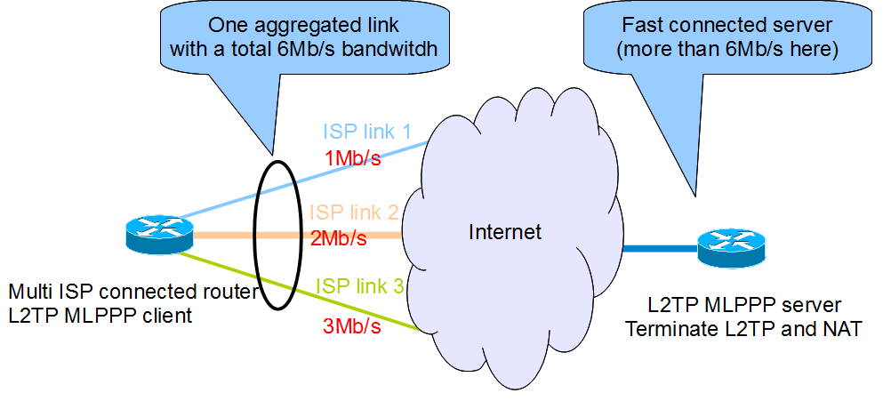
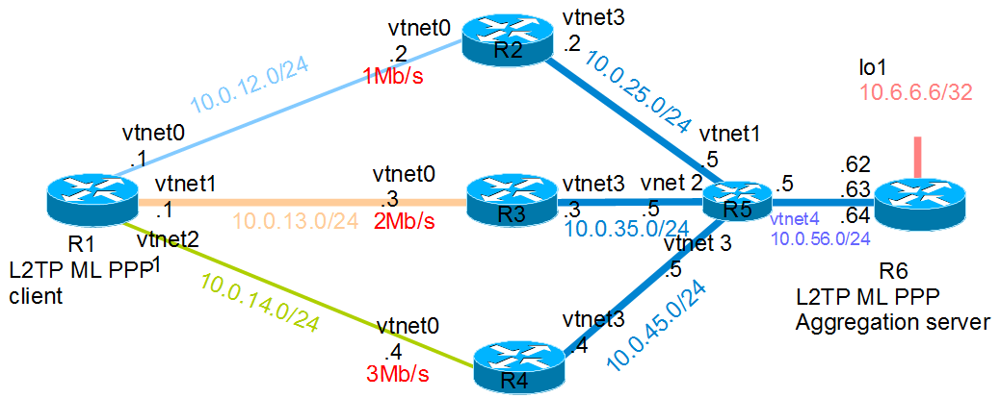
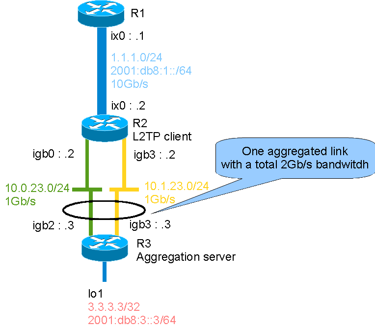

This lab shows an example of aggregating multiple independent ISP links with [MPD5](http://mpd.sourceforge.net/).

## Network diagram

Here is the concept:



And here is this lab detailed diagram:



## Virtual lab

This section describes how to start each router and configure the three central routers.

More information on the BSDRP lab scripts is available in [How to build a BSDRP router lab](how-to-build-a-bsdrp-router-lab.md).

Start the virtual lab (example using bhyve):

```
# ./tools/BSDRP-lab-bhyve.sh -n 6
Setting-up a virtual lab with 6 VM(s):
- Working directory: /tmp/BSDRP
- Each VM has 1 core(s) and 512M RAM
- Emulated NIC: virtio-net
- Switch mode: bridge + tap
- 0 LAN(s) between all VM
- Full mesh Ethernet links between each VM
VM 1 has the following NIC:
- vtnet0 connected to VM 2
- vtnet1 connected to VM 3
- vtnet2 connected to VM 4
- vtnet3 connected to VM 5
- vtnet4 connected to VM 6
VM 2 has the following NIC:
- vtnet0 connected to VM 1
- vtnet1 connected to VM 3
- vtnet2 connected to VM 4
- vtnet3 connected to VM 5
- vtnet4 connected to VM 6
VM 3 has the following NIC:
- vtnet0 connected to VM 1
- vtnet1 connected to VM 2
- vtnet2 connected to VM 4
- vtnet3 connected to VM 5
- vtnet4 connected to VM 6
VM 4 has the following NIC:
- vtnet0 connected to VM 1
- vtnet1 connected to VM 2
- vtnet2 connected to VM 3
- vtnet3 connected to VM 5
- vtnet4 connected to VM 6
VM 5 has the following NIC:
- vtnet0 connected to VM 1
- vtnet1 connected to VM 2
- vtnet2 connected to VM 3
- vtnet3 connected to VM 4
- vtnet4 connected to VM 6
VM 6 has the following NIC:
- vtnet0 connected to VM 1
- vtnet1 connected to VM 2
- vtnet2 connected to VM 3
- vtnet3 connected to VM 4
- vtnet4 connected to VM 5
For connecting to VM'serial console, you can use:
- VM 1 : cu -l /dev/nmdm1B
- VM 2 : cu -l /dev/nmdm2B
- VM 4 : cu -l /dev/nmdm4B
- VM 3 : cu -l /dev/nmdm3B
- VM 5 : cu -l /dev/nmdm5B
- VM 6 : cu -l /dev/nmdm6B
```

### Backbone routers configuration

#### Router 2

Router 2 is configured to rate-limit traffic at 1 Mb/s on the interface to/from R1.

```
sysrc hostname=R2
sysrc ifconfig_vtnet0="inet 10.0.12.2/24"
sysrc ifconfig_vtnet3="inet 10.0.25.2/24"
sysrc defaultrouter="10.0.25.5"
sysrc firewall_enable=YES
sysrc firewall_script="/etc/ipfw.rules"

cat > /etc/ipfw.rules <<EOF
#!/bin/sh
fwcmd="/sbin/ipfw"
kldstat -q -m dummynet || kldload dummynet
# Flush out the list before we begin.
${fwcmd} -f flush
${fwcmd} pipe 10 config bw 1Mbit/s
${fwcmd} pipe 20 config bw 1Mbit/s
#Traffic getting out vtnet0 is limited to 1Mbit/s
${fwcmd} add 1000 pipe 10 all from any to any out via vtnet0
#Traffic getting int vtnet0 is limited to 1Mbit/s
${fwcmd} add 2000 pipe 20 all from any to any in via vtnet0
#We don't want to block traffic, only shape some
${fwcmd} add 3000 allow ip from any to any
EOF

service netif restart
service routing restart
service ipfw start
hostname R2
config save
```

#### Router 3

Router 3 is configured to rate-limit traffic at 2 Mb/s on the interface to/from R1.

```
sysrc hostname=R3
sysrc ifconfig_vtnet0="inet 10.0.13.3/24"
sysrc ifconfig_vtnet3="inet 10.0.35.3/24"
sysrc defaultrouter="10.0.35.5"
sysrc firewall_enable=YES
sysrc firewall_script="/etc/ipfw.rules"

cat > /etc/ipfw.rules <<EOF
#!/bin/sh
fwcmd="/sbin/ipfw"
kldstat -q -m dummynet || kldload dummynet
# Flush out the list before we begin.
${fwcmd} -f flush
${fwcmd} pipe 10 config bw 2Mbit/s
${fwcmd} pipe 20 config bw 2Mbit/s
#Traffic getting out vtnet0 is limited to 2Mbit/s
${fwcmd} add 1000 pipe 10 all from any to any out via vtnet0
#Traffic getting int vtnet0 is limited to 2Mbit/s
${fwcmd} add 2000 pipe 20 all from any to any in via vtnet0
#We don't want to block traffic, only shape some
${fwcmd} add 3000 allow ip from any to any
EOF

service netif restart
service routing restart
service ipfw start
hostname R3
config save
```

#### Router 4

Router 4 is configured to rate-limit traffic at 3 Mb/s on the interface to/from R1.

```
sysrc hostname=R4
sysrc ifconfig_vtnet0="inet 10.0.14.4/24"
sysrc ifconfig_vtnet3="inet 10.0.45.4/24"
sysrc defaultrouter="10.0.45.5"
sysrc firewall_enable=YES
sysrc firewall_script="/etc/ipfw.rules"

cat > /etc/ipfw.rules <<EOF
#!/bin/sh
fwcmd="/sbin/ipfw"
kldstat -q -m dummynet || kldload dummynet
# Flush out the list before we begin.
${fwcmd} -f flush
${fwcmd} pipe 10 config bw 3Mbit/s
${fwcmd} pipe 20 config bw 3Mbit/s
#Traffic getting out vtnet0 is limited to 3Mbit/s
${fwcmd} add 1000 pipe 10 all from any to any out via vtnet0
#Traffic getting int vten0 is limited to 3Mbit/s
${fwcmd} add 2000 pipe 20 all from any to any in via vtnet0
#We don't want to block traffic, only shape some
${fwcmd} add 3000 allow ip from any to any
EOF

service netif restart
service routing restart
service ipfw start
hostname R4
config save
```

#### Router 5

Router 5 is the MLPPP server's default gateway.

```
sysrc hostname=R5
sysrc ifconfig_vtnet1="inet 10.0.25.5/24"
sysrc ifconfig_vtnet2="inet 10.0.35.5/24"
sysrc ifconfig_vtnet3="inet 10.0.45.5/24"
sysrc ifconfig_vtnet4="inet 10.0.56.5/24"
sysrc static_routes="ISP1 ISP2 ISP3"
sysrc route_ISP1="-host 10.0.12.1 10.0.25.2"
sysrc route_ISP2="-host 10.0.13.1 10.0.35.3"
sysrc route_ISP3="-host 10.0.14.1 10.0.45.4"
service netif restart
service routing restart
hostname R5
config save
```

### Router 6: L2TP MLPPP server

Router 6 is configured as an L2TP server.

```
sysrc hostname=R6
sysrc cloned_interfaces="lo1"
sysrc ifconfig_lo1="inet 10.6.6.6/32"
sysrc ifconfig_vtnet4="inet 10.0.56.62/24"
sysrc ifconfig_vtnet4_alias1="inet 10.0.56.63/32"
sysrc ifconfig_vtnet4_alias2="inet 10.0.56.64/32"
sysrc defaultrouter="10.0.56.5"
sysrc mpd_enable=YES
sysrc mpd_flags="-b -s ppp"
cat > /usr/local/etc/mpd5/mpd.conf <<EOF
default:
        load l2tp_server
l2tp_server:
        # IP Pool
        set ippool add pool1 10.0.16.10 10.0.16.100
        # Create bundle template named B
        create bundle template B
        # Enable IPv6
        set bundle enable ipv6cp
        # Configure interface
        set iface enable tcpmssfix
        # Handle IPCP configuration
        set ipcp yes vjcomp
        # Handle the IPCP configuration
        set ipcp ranges 10.0.16.1/24 ippool pool1
        # Create clonable link template named adsl1
        create link template L l2tp
        set link action bundle B
        set link enable multilink
        set link keep-alive 10 30
        set link mtu 1460
        set l2tp secret blah
        # SDSL1
        create link static sdsl1 L
        set l2tp self 10.0.56.62
        # set DOWNLOAD bandwidth of ISP1
        set link bandwidth 1000000
        set link enable incoming
        # SDSL2
        create link static sdsl2 L
        set l2tp self 10.0.56.63
        # set DOWNLOAD bandwidth of ISP2
        set link bandwidth 2000000
        set link enable incoming
        # SDSL3
        create link static sdsl3 L
        set l2tp self 10.0.56.64
        # set DOWNLOAD bandwidth of ISP3
        set link bandwidth 3000000
        set link enable incoming
EOF

service netif restart
service routing restart
service mpd5 start
hostname R6
config save
```

### Router 1: L2TP MLPPP client

Router 1 is configured as a simple L2TP MLPPP client router connected to 3 Internet links.

```
sysrc hostname=R1
sysrc ifconfig_vtnet0="inet 10.0.12.1/24"
sysrc ifconfig_vtnet1="inet 10.0.13.1/24"
sysrc ifconfig_vtnet2="inet 10.0.14.1/24"
sysrc static_routes="ISP1 ISP2 ISP3"
sysrc route_ISP1="-host 10.0.56.62 10.0.12.2"
sysrc route_ISP2="-host 10.0.56.63 10.0.13.3"
sysrc route_ISP3="-host 10.0.56.64 10.0.14.4"
sysrc mpd_enable=YES
sysrc mpd_flags="-b -s ppp"
cat > /usr/local/etc/mpd5/mpd.conf <<EOF
default:
        load l2tp_client
l2tp_client:
        # Create the bundle
        create bundle template B
        # Enable IPv6
        set bundle enable ipv6cp
        # Enable TCP MSS fix
        set iface enable tcpmssfix
        # Use this interface as default route
        set iface route default
        # Disable IPCP configuration for the iperf test
        #set ipcp yes vjcomp
        # Create clonable template link ADSL1
        create link template L l2tp
        set link action bundle B
        set link enable multilink
        set link keep-alive 10 30
        set link mtu 1460
        set l2tp secret blah
        # Retry indefinitely to redial
        set link max-redial 0
        # SDSL1
        create link static sdsl1 L
        set l2tp peer 10.0.56.62
        # Configure the UPLOAD bandwidth
        set link bandwidth 1000000
        open link
        # SDSL2
        create link static sdsl2 L
        set l2tp peer 10.0.56.63
        # Configure the UPLOAD bandwidth
        set link bandwidth 2000000
        open link
        # SDSL3
        create link static sdsl3 L
        set l2tp peer 10.0.56.64
        # Configure the UPLOAD bandwidth
        set link bandwidth 3000000
        open link
EOF

service netif restart
service routing restart
service mpd5 start
hostname R1
config save
```

## Final testing

### Each ISP link bandwidth

Start iperf in server mode on R6:

```
[root@R6]~# iperf3 -s
-----------------------------------------------------------
Server listening on 5201
-----------------------------------------------------------
```

Now check the rate limit on each link:

- Link to R6 via R2: 1 Mb/s
- Link to R6 via R3: 2 Mb/s
- Link to R6 via R4: 3 Mb/s

<!-- -->

```
[root@R1]~# iperf3 -i 0 -c 10.0.56.62
Connecting to host 10.0.56.62, port 5201
[  5] local 10.0.12.1 port 30648 connected to 10.0.56.62 port 5201
[ ID] Interval           Transfer     Bitrate         Retr  Cwnd
[  5]   0.00-10.00  sec  1.21 MBytes  1.02 Mbits/sec    0   65.1 KBytes
- - - - - - - - - - - - - - - - - - - - - - - - -
[ ID] Interval           Transfer     Bitrate         Retr
[  5]   0.00-10.00  sec  1.21 MBytes  1.02 Mbits/sec    0             sender
[  5]   0.00-10.51  sec  1.19 MBytes   953 Kbits/sec                  receiver

iperf Done.
[root@R1]~# iperf3 -i 0 -c 10.0.56.63
Connecting to host 10.0.56.63, port 5201
[  5] local 10.0.13.1 port 13090 connected to 10.0.56.63 port 5201
[ ID] Interval           Transfer     Bitrate         Retr  Cwnd
[  5]   0.00-10.00  sec  2.35 MBytes  1.97 Mbits/sec    0   65.1 KBytes
- - - - - - - - - - - - - - - - - - - - - - - - -
[ ID] Interval           Transfer     Bitrate         Retr
[  5]   0.00-10.00  sec  2.35 MBytes  1.97 Mbits/sec    0             sender
[  5]   0.00-10.26  sec  2.33 MBytes  1.91 Mbits/sec                  receiver

iperf Done.
[root@R1]~# iperf3 -i 0 -c 10.0.56.64
Connecting to host 10.0.56.64, port 5201
[  5] local 10.0.14.1 port 57319 connected to 10.0.56.64 port 5201
[ ID] Interval           Transfer     Bitrate         Retr  Cwnd
[  5]   0.00-10.00  sec  3.48 MBytes  2.92 Mbits/sec    0   65.1 KBytes
- - - - - - - - - - - - - - - - - - - - - - - - -
[ ID] Interval           Transfer     Bitrate         Retr
[  5]   0.00-10.00  sec  3.48 MBytes  2.92 Mbits/sec    0             sender
[  5]   0.00-10.16  sec  3.46 MBytes  2.86 Mbits/sec                  receiver

iperf Done.
```

### Aggregated ISP link bandwidth

The aggregated link bandwidth should be negotiated to 6 Mb/s (1+2+3):

```
[root@R1]~# grep Bundle /var/log/ppp.log
Nov 12 06:04:54 router ppp[87823]: [B-1] Bundle: Interface ng0 created
Nov 12 06:04:54 router ppp[87823]: [B-1] Bundle: Status update: up 1 link, total bandwidth 2000000 bps
Nov 12 06:04:54 router ppp[87823]: [B-1] Bundle: Status update: up 2 links, total bandwidth 3000000 bps
Nov 12 06:04:54 router ppp[87823]: [B-1] Bundle: Status update: up 3 links, total bandwidth 6000000 bps
```

and the iperf measurement is close to 6 Mb/s:

```
[root@R1]~# iperf3 -i 0 -c 10.6.6.6
Connecting to host 10.6.6.6, port 5201
[  5] local 10.0.16.10 port 51350 connected to 10.6.6.6 port 5201
[ ID] Interval           Transfer     Bitrate         Retr  Cwnd
[  5]   0.00-10.00  sec  6.42 MBytes  5.38 Mbits/sec    0   65.1 KBytes
- - - - - - - - - - - - - - - - - - - - - - - - -
[ ID] Interval           Transfer     Bitrate         Retr
[  5]   0.00-10.00  sec  6.42 MBytes  5.38 Mbits/sec    0             sender
[  5]   0.00-10.09  sec  6.40 MBytes  5.32 Mbits/sec                  receiver

iperf Done.
```

At the same time, if you start `netstat -ihw 1` on R2, R3 and R4, you should see traffic distributed between them.

## Performance lab

This lab tests mpd5 performance by aggregating two gigabit links.

Here is the concept:



This lab uses 3 [IBM System x3550 M3](ibm-system-x3550-m3.md) with **quad** cores (Intel Xeon L5630 2.13 GHz, hyper-threading disabled), a quad NIC 82580 connected to the PCI Express bus, and a dual-port Intel 10-Gigabit X540-AT2 connected to the PCI Express bus.

### Router 1

Router 1 is configured as a simple endpoint.

Set the base parameters:

```
sysrc hostname=R1
sysrc ifconfig_ix0="1.1.1.1/24"
sysrc ifconfig_ix0_ipv6="inet6 2001:db8:1::1/64"
sysrc defaultrouter="1.1.1.2"
sysrc ipv6_defaultrouter="2001:db8:1::2"
service netif restart
service routing restart
config save
```

### Router 2

Router 2 is configured as an L2TP MLPPP client router.

Configure global parameters:

```
sysrc hostname=R2
sysrc ifconfig_ix0="1.1.1.2/24"
sysrc ifconfig_ix0_ipv6="inet6 2001:db8:1::2/64"
sysrc ifconfig_igb2="10.0.23.2/24"
sysrc ifconfig_igb3="10.1.23.2/24"
sysrc mpd_enable=YES
sysrc mpd_flags="-b -s ppp"
```

Configure mpd:

```
cat > /usr/local/etc/mpd5/mpd.conf <<'EOF'
default:
        load l2tp_client
l2tp_client:
        # Create the bundle
        create bundle template B
        # Enable IPv6
        set bundle enable ipv6cp
        # Disable compression (for iperf test)
        #set bundle enable compression
        #set ccp yes deflate
        # Enable TCP MSS fix
        set iface enable tcpmssfix
        # Use this interface as default route
        set iface route default
        # Disable IPCP configuration for the iperf test
        #set ipcp yes vjcomp
        # Create clonable template link
        create link template L l2tp
        set link action bundle B
        set link enable multilink
        set link keep-alive 10 30
        set link mtu 1460
        set l2tp secret blah
        set link max-redial 0
        # LINK1
        create link static link1 L
        set l2tp peer 10.0.23.3
        open link
        # LINK2
        create link static link2 L
        set l2tp peer 10.1.23.3
        open link
'EOF'
```

And apply your changes:

```
service netif restart
service routing restart
service mpd5 start
config save
```

### Router 3

Router 3 is configured as an L2TP server.

Set the global parameters:

```
sysrc hostname=R3
sysrc cloned_interfaces="lo1"
sysrc ifconfig_lo1="inet 3.3.3.3/32"
sysrc ifconfig_lo1_ipv6="inet6 2001:db8:3::3/64"
sysrc ifconfig_igb2="10.0.23.3/24"
sysrc ifconfig_igb3="10.1.23.3/24"
sysrc mpd_enable=YES
sysrc mpd_flags="-b -s ppp"
```

Configure mpd5:

```
cat > /usr/local/etc/mpd5/mpd.conf <<'EOF'
default:
        load l2tp_server
l2tp_server:
        # IP Pool
        set ippool add pool1 10.3.23.10 10.3.23.100
        # Create bundle template named B
        create bundle template B
        # Enable compression (disabled on the client)
        set bundle enable compression
        set ccp yes deflate
        # Enable IPv6
        set bundle enable ipv6cp
        # Configure interface
        set iface enable tcpmssfix
        # Handle IPCP configuration
        set ipcp yes vjcomp
        # Handle the IPCP configuration
        set ipcp ranges 10.3.23.1/24 ippool pool1
        # Create clonable link template
        create link template L l2tp
        set link action bundle B
        set link enable multilink
        set link keep-alive 10 30
        set link mtu 1460
        set l2tp secret blah
        # LINK1
        create link static link1 L
        set l2tp self 10.0.23.3
        set link enable incoming
        # LINK2
        create link static link2 L
        set l2tp self 10.1.23.3
        set link enable incoming
'EOF'
```

if-up script (to install routes to the R1 subnet):

```
cat > /usr/local/etc/mpd5/if-up.sh <<'EOF'
#!/bin/sh
#mpd5 call script with options:
#interface proto local-ip remote-ip authname [ dns1 server-ip ] [ dns2 server-ip ] peer-address
#Examples
#command "/usr/local/etc/mpd5/if-up.sh ng0 inet 10.3.23.1/32 10.3.23.10 '-' '' '' '10.1.23.2'"
#command "/usr/local/etc/mpd5/if-up.sh ng0 inet6 fe80::5ef3:fcff:fee5:a4c0%ng0 fe80::5ef3:fcff:fee5:7338%ng0 '-' '10.1.23.2'"
#mpd5 wait for 0 as successful
set -e
logger "$0 called with parameters: $@"
remote_inet="1.1.1.0/24"
remote_inet6="2001:db8:1:: -prefixlen 64"
eval "
        if route get -net -\$2 \${remote_$2}; then
                logger \"route \${remote_$2} already present\"
                return 0
        else
                cmd=\"route add -\$2 \${remote_$2} \$4\"
        fi
"
if $cmd; then
        logger "$0: $cmd successfull"
        return 0
else
        logger "$0: $cmd failed"
        return 1
fi
'EOF'
chmod +x /usr/local/etc/mpd5/if-up.sh
```

Then the if-down script:

```
cat > /usr/local/etc/mpd5/if-down.sh <<'EOF'
#!/bin/sh
#mpd5 call script with options:
#interface proto local-ip remote-ip authname peer-address
#example:
#command "/urs/local/etc/mpd5/if-down.sh ng0 inet 10.3.23.1/32 10.3.23.10 '-' '10.0.23.2'"
logger "$0 called with parameters: $@"
remote_inet="1.1.1.0/24"
remote_net6="2001:db8:1::1 -prefixlen 64"
eval "
        if ! route get -net -\$2 ${remote_$2}; then
                logger "Route ${remote_inet} not in table"
                return 0
        else
                cmd=\"route del \${remote_$2} \$4\"
        fi
"
if $cmd; then
        logger "if-down: ${cmd} succesfull"
        return 0
else
        logger "if-down: ${cmd} failed"
        return 1
fi

'EOF'
chmod +x /usr/local/etc/mpd5/if-down.sh
```

And apply your changes:

```
service netif restart
service routing restart
service mpd5 start
config save
```

### Performance tests

#### Checking the perf tool

##### Direct tests between R1 and R2

```
[root@bsdrp1]~# iperf -c 1.1.1.2 -t 60
------------------------------------------------------------
Client connecting to 1.1.1.2, TCP port 5001
TCP window size: 32.5 KByte (default)
------------------------------------------------------------
[  3] local 1.1.1.1 port 57149 connected with 1.1.1.2 port 5001
[ ID] Interval       Transfer     Bandwidth
[  3]  0.0-60.0 sec  24.5 GBytes  3.50 Gbits/sec
```

##### Direct tests between R2 and R3

Start by testing each gigabit link between R2 and R3 to measure the iperf value on a standard gigabit link:

```
[root@R2]~# iperf -c 10.0.23.3 -t 60
------------------------------------------------------------
Client connecting to 10.0.23.3, TCP port 5001
TCP window size: 32.5 KByte (default)
------------------------------------------------------------
[  3] local 10.0.23.2 port 21046 connected with 10.0.23.3 port 5001
[ ID] Interval       Transfer     Bandwidth
[  3]  0.0-60.0 sec  6.54 GBytes   936 Mbits/sec
[root@R2]~# iperf -c 10.1.23.3 -t 60
------------------------------------------------------------
Client connecting to 10.1.23.3, TCP port 5001
TCP window size: 32.5 KByte (default)
------------------------------------------------------------
[  3] local 10.1.23.2 port 50717 connected with 10.1.23.3 port 5001
[ ID] Interval       Transfer     Bandwidth
[  3]  0.0-60.0 sec  6.55 GBytes   937 Mbits/sec
```

#### mpd5 performance

##### Between R2 and R3

iperf will use the MLPPP tunnel endpoint:

```
[root@R2]~# set DEST=`ifconfig ng0 | grep 'inet ' | cut -d ' ' -f 4`
[root@R2]~# iperf -c $DEST -t 60
------------------------------------------------------------
Client connecting to 10.3.23.1, TCP port 5001
TCP window size: 32.5 KByte (default)
------------------------------------------------------------
[  3] local 10.3.23.10 port 19383 connected with 10.3.23.1 port 5001
[ ID] Interval       Transfer     Bandwidth
[  3]  0.0-60.1 sec  6.14 GBytes   878 Mbits/sec
```

The value is almost the same as without the MLPPP aggregated link, but correctly load-balanced across each link. R2 stats during this test:

```
                    /0   /1   /2   /3   /4   /5   /6   /7   /8   /9   /10
     Load Average   ||||

      Interface           Traffic               Peak                Total
            ng0  in     17.271 Mb/s         18.694 Mb/s            3.743 GB
                 out   974.656 Mb/s       1055.503 Mb/s            7.324 GB

           igb3  in     11.405 Mb/s         12.261 Mb/s            3.456 GB
                 out   507.970 Mb/s        550.255 Mb/s           27.449 GB

           igb2  in     11.389 Mb/s         12.274 Mb/s            3.422 GB
                 out   508.061 Mb/s        550.328 Mb/s           18.673 GB
```

And the load shows:

```
[root@R2]~# top -nCHSIzs1
last pid: 14152;  load averages:  0.94,  0.48,  0.21  up 0+23:54:56    12:40:23
155 processes: 5 running, 99 sleeping, 51 waiting

Mem: 3564K Active, 26M Inact, 384M Wired, 256K Cache, 17M Buf, 15G Free
Swap:

  PID USERNAME   PRI NICE   SIZE    RES STATE   C   TIME     CPU COMMAND
 8524 root       -16    -     0K    64K sleep   0   2:04  25.68% ng_queue{ng_queue2}
 8524 root       -16    -     0K    64K sleep   1   1:47  25.49% ng_queue{ng_queue1}
 8524 root       -16    -     0K    64K sleep   3   2:03  22.36% ng_queue{ng_queue0}
14149 root        36    0 32136K  3092K sbwait  1   0:06  21.88% iperf{iperf}
 8524 root       -16    -     0K    64K sleep   2   1:56  20.26% ng_queue{ng_queue3}
   11 root       -92    -     0K   816K WAIT    3   0:20   7.57% intr{irq286: igb3:que}
   11 root       -92    -     0K   816K WAIT    1   0:17   5.96% intr{irq279: igb2:que}
   11 root       -92    -     0K   816K WAIT    3   0:09   0.78% intr{irq281: igb2:que}
   11 root       -92    -     0K   816K WAIT    2   0:05   0.59% intr{irq280: igb2:que}
   11 root       -92    -     0K   816K WAIT    0   0:06   0.39% intr{irq278: igb2:que}
    0 root       -92    0     0K   560K -       1   0:00   0.10% kernel{igb3 que}
```

For reference, using netblast (a UDP packet generator) disturbs the links:

```
netblast $DEST 9090 1470 30 `sysctl -n hw.ncpu`
```

and measure the bandwidth received on R3:

```
         0 pps    0.000 Mbps - 0 pkts in 0.522753682 ns
      2149 pps   25.277 Mbps - 1079 pkts in 0.501997052 ns
         0 pps    0.000 Mbps - 0 pkts in 0.501999569 ns
        45 pps    0.539 Mbps - 23 pkts in 0.502000238 ns
         0 pps    0.000 Mbps - 0 pkts in 0.502000362 ns
       713 pps    8.387 Mbps - 358 pkts in 0.501999604 ns
      2107 pps   24.786 Mbps - 1077 pkts in 0.511002670 ns
         0 pps    0.000 Mbps - 0 pkts in 0.501998712 ns
         0 pps    0.000 Mbps - 0 pkts in 0.501998967 ns
        21 pps    0.255 Mbps - 11 pkts in 0.508000385 ns
         0 pps    0.000 Mbps - 0 pkts in 0.501998785 ns
```

The packet generator prevents keepalives from being processed:

```
Jan 27 10:50:38 R2 ppp: [link1] LCP: no reply to 1 echo request(s)
Jan 27 10:50:38 R2 ppp: [link2] LCP: no reply to 1 echo request(s)
Jan 27 10:50:48 R2 ppp: [link2] LCP: no reply to 2 echo request(s)
Jan 27 10:50:48 R2 ppp: [link2] LCP: peer not responding to echo requests
Jan 27 10:50:48 R2 ppp: [link2] LCP: state change Opened --> Stopping
Jan 27 10:50:48 R2 ppp: [link2] Link: Leave bundle "B-1"
```
