This lab builds a BGP topology that mixes the two classic ways of avoiding a
full mesh of iBGP sessions: a **route reflector** in one AS, and a
**confederation** split into two sub-AS in the other. It also mixes the two
routing daemons shipped with BSDRP, [Bird](https://bird.network.cz/) 3 and
[FRRouting](https://frrouting.org/) 10, peering with each other, and protects
two of the sessions with TCP-MD5.

## Overview

### Network diagram

Here is the BGP and logical view:

```mermaid
flowchart LR
    subgraph AS100["AS 100"]
        R1["R1 (bird)<br/>10.0.6.1<br/>RR client"]
        R2["R2 (bird)<br/>10.0.6.2<br/>route reflector"]
        R3["R3 (bird)<br/>10.0.6.3 / 10.0.2.3<br/>RR client, border"]
    end
    subgraph AS200["AS 200 (confederation)"]
        subgraph SUB1["sub-AS 64512"]
            R4["R4 (FRR)<br/>10.0.2.4 / 10.0.3.4"]
            R5["R5 (FRR)<br/>10.0.3.5 / 10.0.4.5"]
        end
        subgraph SUB2["sub-AS 65535"]
            R6["R6 (FRR)<br/>10.0.4.6 / 10.0.5.6"]
            R7["R7 (FRR)<br/>10.0.5.7 / 10.0.7.7"]
        end
    end

    R1 ---|"iBGP<br/>reflected"| R2
    R2 ---|"iBGP<br/>reflected"| R3
    R3 ---|"eBGP 100 to 200<br/>10.0.2.0/24, TCP-MD5"| R4
    R4 ---|"intra sub-AS<br/>10.0.3.0/24"| R5
    R5 ---|"inter sub-AS<br/>10.0.4.0/24"| R6
    R6 ---|"intra sub-AS<br/>10.0.5.0/24, TCP-MD5"| R7
```



R1, R2 and R3 share a LAN (10.0.6.0/24 and 2001:db8:6::/64); every other link
is a point-to-point Ethernet segment. Each address family is configured, so
the whole lab runs dual-stack.

## Preparing the lab

### Setting up the lab

See [How to build a BSDRP router lab](how-to-build-a-bsdrp-router-lab.md).

### Starting the lab

This lab needs 7 VMs and one common LAN. The `-r bgp` flag applies the
configuration of each router automatically on first boot, through the
`labconfig` script shipped in the image:

```
# tools/BSDRP-lab-bhyve.sh -i BSDRP-2.3-full-amd64.img.xz -n 7 -l 1 -r bgp
BSD Router Project (https://bsdrp.net) - bhyve full-meshed lab script
Setting-up a virtual lab with 7 VM(s):
- Working directory: /root/BSDRP-VMs
- Each VM has a total of 1 (1 cores and 1 threads) and 1G RAM
- Emulated NIC: virtio-net
- Boot mode: UEFI
- Switch mode: bridge + tap
- 1 LAN(s) between all VM
- Full mesh Ethernet links between each VM
- Regression test lab: bgp
[...]
To connect VM'serial console, you can use:
- VM 1 : sudo cu -l /dev/nmdm-BSDRP.1B
- VM 2 : sudo cu -l /dev/nmdm-BSDRP.2B
- VM 3 : sudo cu -l /dev/nmdm-BSDRP.3B
- VM 4 : sudo cu -l /dev/nmdm-BSDRP.4B
- VM 5 : sudo cu -l /dev/nmdm-BSDRP.5B
- VM 6 : sudo cu -l /dev/nmdm-BSDRP.6B
- VM 7 : sudo cu -l /dev/nmdm-BSDRP.7B
```

## Router configuration

Each router below is exactly what `labconfig bgp_vm<N>` applies; enter it by
hand if you started the lab without `-r bgp`. Use `labconfig` only on a lab
machine, it replaces the running configuration.

```
labconfig bgp_vm[VM-NUMBER]
```

### Router 1

R1 is a plain iBGP speaker of AS 100 and a client of the route reflector. It originates the 10.0.1.0/24 and 2001:db8:1::/64 stub prefixes (the far end of that link is not configured).

```
sysrc hostname=R1 \
 ifconfig_vtnet6="10.0.6.1/24" \
 ifconfig_vtnet6_ipv6="inet6 2001:db8:6::1 prefixlen 64" \
 ifconfig_vtnet0="10.0.1.1/24" \
 ifconfig_vtnet0_ipv6="inet6 2001:db8:1::1 prefixlen 64" \
 bird_enable=YES
cat > /usr/local/etc/bird.conf <<EOF
# Configure logging
log syslog all;
log "/var/log/bird.log" all;
log stderr all;

# Override router ID
router id 0.0.0.101;

# Sync bird routing table with kernel
protocol kernel kernel4 {
    ipv4 {
        export all;
    };
```

### Router 2

R2 is the route reflector of AS 100. `rr client` on each session is the only thing that turns it into one: without it, R1 and R3 would need a direct session, because an iBGP speaker never re-advertises what it learned from another iBGP speaker.

```
sysrc hostname=R2 \
 ifconfig_vtnet6="10.0.6.2/24" \
 ifconfig_vtnet6_ipv6="inet6 2001:db8:6::2 prefixlen 64" \
 bird_enable=YES
cat > /usr/local/etc/bird.conf <<EOF
# Configure logging
log syslog all;
log "/var/log/bird.log" all;
log stderr all;

# Override router ID
router id 0.0.0.102;

# Define variable
define myas = 100;

# Sync bird routing table with kernel
protocol kernel kernel4 {
    ipv4 {
        export all;
    };
```

### Router 3

R3 is the second reflector client, and the border router of AS 100: its session with R4 is eBGP toward the confederation, protected by TCP-MD5. `next hop self` on the iBGP side is needed because the AS 100 routers have no route to the 10.0.2.0/24 transit subnet.

```
sysrc hostname=R3 \
 ifconfig_vtnet6="10.0.6.3/24" \
 ifconfig_vtnet6_ipv6="inet6 2001:db8:6::3 prefixlen 64" \
 ifconfig_vtnet2="10.0.2.3/24" \
 ifconfig_vtnet2_ipv6="inet6 2001:db8:2::3 prefixlen 64" \
 bird_enable=YES
cat > /usr/local/etc/bird.conf <<EOF
# Configure logging
log syslog all;
log "/var/log/bird.log" all;
log stderr all;

# Override router ID
router id 0.0.0.103;

# Define variable
define myas = 100;

# Sync bird routing table with kernel
protocol kernel kernel4 {
    ipv4 {
        export all;
    };
```

### Router 4

R4 belongs to sub-AS 64512 of confederation AS 200. `bgp confederation identifier 200` is the AS number the outside world sees, `bgp confederation peers 65535` declares the other sub-AS as internal. The TCP-MD5 password is the counterpart of R3's, with the security associations here written by hand in /etc/ipsec.conf.

```
sysrc hostname=R4 \
 frr_enable=YES \
 ipsec_enable=YES \
 ipsec_file="/etc/ipsec.conf"
cat <<EOF > /etc/ipsec.conf
flush ;
add 10.0.2.3 10.0.2.4 tcp 0x1000 -A tcp-md5 "abigpassword" ;
add 10.0.2.4 10.0.2.3 tcp 0x1001 -A tcp-md5 "abigpassword" ;
add -6 2001:db8:2::3 2001:db8:2::4 tcp 0x1002 -A tcp-md5 "abigpassword" ;
add -6 2001:db8:2::4 2001:db8:2::3 tcp 0x1003 -A tcp-md5 "abigpassword" ;
EOF
service ipsec start
cat > /usr/local/etc/frr/frr.conf <<EOF
interface vtnet2
 ip address 10.0.2.4/24
 ipv6 address 2001:db8:2::4/64
interface vtnet3
 ip address 10.0.3.4/24
 ipv6 address 2001:db8:3::4/64
router bgp 64512
 bgp router-id 0.0.0.204
 bgp confederation identifier 200
 bgp confederation peers 65535
 no bgp ebgp-requires-policy
 no bgp default ipv4-unicast
 neighbor 10.0.2.3 remote-as 100
 neighbor 10.0.2.3 password abigpassword
 neighbor 10.0.3.5 remote-as 64512
 neighbor 2001:db8:2::3 remote-as 100
 neighbor 2001:db8:2::3 password abigpassword
 neighbor 2001:db8:3::5 remote-as 64512
 !
 address-family ipv4 unicast
  network 10.0.3.0/24
  neighbor 10.0.2.3 activate
  neighbor 10.0.3.5 activate
  neighbor 10.0.3.5 next-hop-self
  no neighbor 2001:db8:2::3 activate
  no neighbor 2001:db8:3::5 activate
 exit-address-family
 !
 address-family ipv6 unicast
  network 2001:db8:3::/64
  neighbor 2001:db8:2::3 activate
  neighbor 2001:db8:3::5 activate
  neighbor 2001:db8:3::5 next-hop-self
 exit-address-family
!
EOF
hostname R4
service frr start
config save
```

### Router 5

R5 is the second router of sub-AS 64512, and the one that peers with the other sub-AS.

```
sysrc hostname=R5 \
 frr_enable=YES
cat <<EOF > /usr/local/etc/frr/frr.conf
log syslog
interface vtnet3
 ip address 10.0.3.5/24
 ipv6 address 2001:db8:3::5/64
!
interface vtnet4
 ip address 10.0.4.5/24
 ipv6 address 2001:db8:4::5/64
router bgp 64512
 bgp router-id 0.0.0.205
 bgp confederation identifier 200
 bgp confederation peers 65535
 no bgp ebgp-requires-policy
 no bgp default ipv4-unicast
 neighbor 10.0.3.4 remote-as 64512
 neighbor 10.0.4.6 remote-as 65535
 neighbor 2001:db8:3::4 remote-as 64512
 neighbor 2001:db8:4::6 remote-as 65535
 !
 address-family ipv4 unicast
  network 10.0.3.0/24
  network 10.0.4.0/24
  neighbor 10.0.3.4 activate
  neighbor 10.0.3.4 next-hop-self
  neighbor 10.0.4.6 activate
  neighbor 10.0.4.6 next-hop-self
  no neighbor 2001:db8:3::4 activate
  no neighbor 2001:db8:4::6 activate
 exit-address-family
 !
 address-family ipv6 unicast
  network 2001:db8:3::/64
  network 2001:db8:4::/64
  neighbor 2001:db8:3::4 activate
  neighbor 2001:db8:3::4 next-hop-self
  neighbor 2001:db8:4::6 activate
  neighbor 2001:db8:4::6 next-hop-self
 exit-address-family
EOF
hostname R5
service frr start
config save
```

### Router 6

R6 opens sub-AS 65535, peering with R5 across the confederation boundary and with R7 inside its own sub-AS, again with TCP-MD5.

```
sysrc hostname=R6 \
 ipsec_enable=YES \
 ipsec_file="/etc/ipsec.conf" \
 frr_enable=YES
cat <<EOF > /etc/ipsec.conf
flush ;
add 10.0.5.6 10.0.5.7 tcp 0x1000 -A tcp-md5 "abcdefgh" ;
add 10.0.5.7 10.0.5.6 tcp 0x1001 -A tcp-md5 "abcdefgh" ;
add -6 2001:db8:5::6 2001:db8:5::7 tcp 0x1002 -A tcp-md5 "abcdefgh" ;
add -6 2001:db8:5::7 2001:db8:5::6 tcp 0x1003 -A tcp-md5 "abcdefgh" ;
EOF
service ipsec start
cat <<EOF > /usr/local/etc/frr/frr.conf
log syslog
interface vtnet4
 ip address 10.0.4.6/24
 ipv6 address 2001:db8:4::6/64
!
interface vtnet5
 ip address 10.0.5.6/24
 ipv6 address 2001:db8:5::6/64
router bgp 65535
 bgp router-id 0.0.0.206
 bgp confederation identifier 200
 bgp confederation peers 64512
 no bgp ebgp-requires-policy
 no bgp default ipv4-unicast
 neighbor 10.0.4.5 remote-as 64512
 neighbor 10.0.5.7 remote-as 65535
 neighbor 10.0.5.7 password abcdefgh
 neighbor 2001:db8:4::5 remote-as 64512
 neighbor 2001:db8:5::7 remote-as 65535
 neighbor 2001:db8:5::7 password abcdefgh
 !
 address-family ipv4 unicast
  network 10.0.5.0/24
  neighbor 10.0.4.5 activate
  neighbor 10.0.4.5 next-hop-self
  neighbor 10.0.5.7 activate
  neighbor 10.0.5.7 next-hop-self
  no neighbor 2001:db8:4::5 activate
  no neighbor 2001:db8:5::7 activate
 exit-address-family
 !
 address-family ipv6 unicast
  network 2001:db8:5::/64
  neighbor 2001:db8:4::5 activate
  neighbor 2001:db8:4::5 next-hop-self
  neighbor 2001:db8:5::7 activate
  neighbor 2001:db8:5::7 next-hop-self
 exit-address-family
EOF
hostname R6
service frr start
config save
```

### Router 7

R7 is the far end of the lab. It originates 10.0.7.0/24 and 2001:db8:7::/64, the prefixes used to check that a route crosses the whole topology.

```
sysrc hostname=R7 \
 ipsec_enable=YES \
 ipsec_file="/etc/ipsec.conf" \
 frr_enable=YES
cat <<EOF > /etc/ipsec.conf
flush ;
add 10.0.5.6 10.0.5.7 tcp 0x1000 -A tcp-md5 "abcdefgh" ;
add 10.0.5.7 10.0.5.6 tcp 0x1001 -A tcp-md5 "abcdefgh" ;
add -6 2001:db8:5::6 2001:db8:5::7 tcp 0x1002 -A tcp-md5 "abcdefgh" ;
add -6 2001:db8:5::7 2001:db8:5::6 tcp 0x1003 -A tcp-md5 "abcdefgh" ;
EOF
service ipsec start
cat <<EOF > /usr/local/etc/frr/frr.conf
log syslog
interface vtnet0
 ip address 10.0.7.7/24
 ipv6 address 2001:db8:7::7/64
!
interface vtnet5
 ip address 10.0.5.7/24
 ipv6 address 2001:db8:5::7/64
router bgp 65535
 bgp router-id 0.0.0.207
 bgp confederation identifier 200
 bgp confederation peers 64512
 no bgp ebgp-requires-policy
 no bgp default ipv4-unicast
 neighbor 10.0.5.6 remote-as 65535
 neighbor 10.0.5.6 password abcdefgh
 neighbor 2001:db8:5::6 remote-as 65535
 neighbor 2001:db8:5::6 password abcdefgh
 !
 address-family ipv4 unicast
  network 10.0.5.0/24
  network 10.0.7.0/24
  neighbor 10.0.5.6 activate
  no neighbor 2001:db8:5::6 activate
 exit-address-family
 !
 address-family ipv6 unicast
  network 2001:db8:5::/64
  network 2001:db8:7::/64
  neighbor 2001:db8:5::6 activate
 exit-address-family
EOF
hostname R7
service frr start
config save
```

## Final testing

The output below was captured on BSDRP 2.3, with bird 3.3.2 and FRRouting 10.7.1.

### Route reflector side

All four sessions of the reflector are established, two per address family:

```
[root@R2]~# birdc show protocols
BIRD 3.3.2 ready.
Name       Proto      Table      State  Since         Info
kernel4    Kernel     master4    up     08:46:45.495
kernel6    Kernel     master6    up     08:46:45.495
device1    Device     ---        up     08:46:45.495
direct1    Direct     ---        up     08:46:45.495
R1inet4    BGP        ---        up     08:46:49.363  Established
R3inet4    BGP        ---        up     08:46:49.530  Established
R1inet6    BGP        ---        up     08:46:48.889  Established
R3inet6    BGP        ---        up     08:46:49.363  Established
```

The reflection itself is visible on a client. R3 receives R1's prefix from the
reflector (`from 10.0.6.2`) while the next hop stays R1, and the two attributes
that a reflector adds are there: the originator, R1, and a cluster list holding
the reflector's router id.

```
[root@R3]~# birdc show route 10.0.1.0/24 all
BIRD 3.3.2 ready.
Table master4:
10.0.1.0/24          unicast [R2inet4 08:46:49.556 from 10.0.6.2] * (100) [i]
        via 10.0.6.1 on vtnet6
        hostentry: via 10.0.6.1 table master4
        preference: 100
        local_metric: 0
        from: 10.0.6.2
        source: BGP
        bgp_origin: IGP
        bgp_path:
        bgp_next_hop: 10.0.6.1
        bgp_local_pref: 100
        bgp_originator_id: 0.0.0.101
        bgp_cluster_list: 0.0.0.102
```

Those two attributes are what makes the reflected route loop-free: a router
that finds its own id in the cluster list drops the update.

### Confederation side

R4 has one session with AS 100 and one inside its own sub-AS. Note that both
are plain BGP sessions: the confederation only changes how the AS path is
built.

```
[root@R4]~# vtysh -c 'show ip bgp summary'

IPv4 Unicast Summary:
BGP router identifier 0.0.0.204, local AS number 64512 VRF default vrf-id 0
BGP table version 7
RIB entries 7, using 1120 bytes of memory
Peers 2, using 46 KiB of memory

Neighbor        V         AS   MsgRcvd   MsgSent   TblVer  InQ OutQ  Up/Down State/PfxRcd   PfxSnt Desc
10.0.2.3        4        100         7        10        7    0    0 00:02:01            3        7 N/A
10.0.3.5        4      64512         7         8        7    0    0 00:02:02            4        4 N/A

Total number of neighbors 2
```

The IPv6 sessions are up too, with their own peers:

```
[root@R4]~# vtysh -c 'show bgp ipv6 summary'

IPv6 Unicast Summary:
BGP router identifier 0.0.0.204, local AS number 64512 VRF default vrf-id 0
BGP table version 7
RIB entries 7, using 1120 bytes of memory
Peers 2, using 46 KiB of memory

Neighbor        V         AS   MsgRcvd   MsgSent   TblVer  InQ OutQ  Up/Down State/PfxRcd   PfxSnt Desc
2001:db8:2::3   4        100         8        11        7    0    0 00:02:40            3        7 N/A
2001:db8:3::5   4      64512         9        10        7    0    0 00:02:41            4        4 N/A

Total number of neighbors 2
```

On R7, at the far end, the sub-AS numbers appear in the path between
parentheses, which is how a confederation marks its internal hops. They are
stripped before the route leaves AS 200, so AS 100 only ever sees `200`.

```
[root@R7]~# vtysh -c 'show ip bgp'
BGP table version is 7, local router ID is 0.0.0.207, vrf id 0
Default local pref 100, local AS 65535
Status codes:  s suppressed, d damped, h history, u unsorted, * valid, > best, = multipath,
               i internal, r RIB-failure, S Stale, R Removed
Nexthop codes: @NNN nexthop's vrf id, < announce-nh-self
Origin codes:  i - IGP, e - EGP, ? - incomplete
RPKI validation codes: V valid, I invalid, N Not found

     Network          Next Hop            Metric LocPrf Weight Path
 *>i 10.0.1.0/24      10.0.5.6                      100      0 (64512) 100 i
 *>i 10.0.2.0/24      10.0.5.6                      100      0 (64512) 100 i
 *>i 10.0.3.0/24      10.0.5.6                 0    100      0 (64512) i
 *>i 10.0.4.0/24      10.0.5.6                 0    100      0 (64512) i
 *>  10.0.5.0/24      0.0.0.0                  0         32768 i
 * i                  10.0.5.6                 0    100      0 i
 *>i 10.0.6.0/24      10.0.5.6                      100      0 (64512) 100 i
 *>  10.0.7.0/24      0.0.0.0                  0         32768 i

Displayed 7 routes and 8 total paths
```

### End to end

R1, at one end of the lab, has learned every prefix, including R7's
10.0.7.0/24 with the confederation seen as plain AS 200:

```
[root@R1]~# birdc show route
BIRD 3.3.2 ready.
Table master4:
10.0.1.0/24          unicast [direct1 08:46:44.385] ! (240)
        dev vtnet0
10.0.6.0/24          unicast [direct1 08:46:44.385] ! (240)
        dev vtnet6
                     unicast [R2inet4 08:46:49.419] (100) [i]
        via 10.0.6.2 on vtnet6
10.0.2.0/24          unicast [R2inet4 08:46:49.588 from 10.0.6.2] * (100) [i]
        via 10.0.6.3 on vtnet6
10.0.3.0/24          unicast [R2inet4 08:46:49.630 from 10.0.6.2] * (100) [AS200i]
        via 10.0.6.3 on vtnet6
10.0.4.0/24          unicast [R2inet4 08:46:49.630 from 10.0.6.2] * (100) [AS200i]
        via 10.0.6.3 on vtnet6
10.0.5.0/24          unicast [R2inet4 08:46:49.630 from 10.0.6.2] * (100) [AS200i]
        via 10.0.6.3 on vtnet6
10.0.7.0/24          unicast [R2inet4 08:46:49.630 from 10.0.6.2] * (100) [AS200i]
        via 10.0.6.3 on vtnet6
```

And the data plane follows, in both address families:

```
[root@R1]~# ping -c 3 10.0.7.7
--- 10.0.7.7 ping statistics ---
3 packets transmitted, 3 packets received, 0.0% packet loss
round-trip min/avg/max/stddev = 0.887/1.235/1.418/0.246 ms

[root@R1]~# ping6 -c 3 2001:db8:7::7
--- 2001:db8:7::7 ping statistics ---
3 packets transmitted, 3 packets received, 0.0% packet loss
round-trip min/avg/max/stddev = 1.300/1.372/1.422/0.053 ms
```

### TCP-MD5 sessions

On FreeBSD, the TCP-MD5 signature is not computed by the routing daemon but by
the kernel, from security associations in the SAD. The bird side of the R3-R4
session creates them on its own, from the `password` statement, which is why
R3 needs `source address` to know which local address to bind them to; the FRR
side has them written by hand in /etc/ipsec.conf.

```
[root@R3]~# setkey -D
2001:db8:2::4 2001:db8:2::3
        tcp mode=any spi=238945079(0x0e3e0337) reqid=0(0x00000000)
        A: tcp-md5  61626967 70617373 776f7264
        seq=0x00000000 replay=0 flags=0x00000040 state=mature
        created: Sep 21 08:46:44 2026   current: Sep 21 08:49:26 2026
        diff: 162(s)    hard: 0(s)      soft: 0(s)
        last: Sep 21 08:46:45 2026      hard: 0(s)      soft: 0(s)
        current: 2027(bytes)    hard: 0(bytes)  soft: 0(bytes)
        allocated: 14   hard: 0 soft: 0
        sadb_seq=3 pid=2853 refcnt=1
```

A session that stays in `Connect` or `Active` while the configuration looks
right is the usual symptom of a missing or mismatched SA on one of the two
ends.
