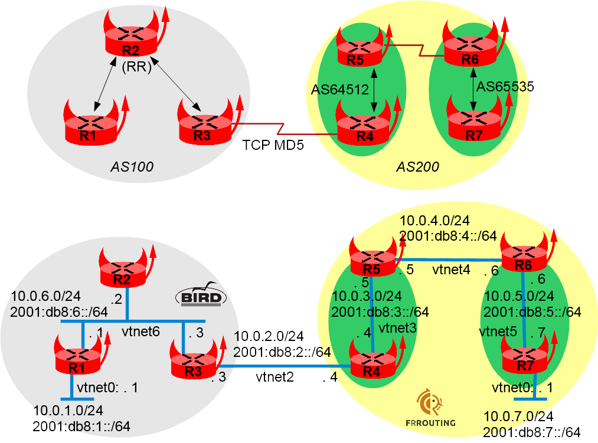

## Overview

### Network diagram

Here is the BGP and logical view:



## Preparing the lab

### Setting up the lab

See [How to build a BSDRP router lab](how-to-build-a-bsdrp-router-lab.md).

### Starting the lab

Start this lab with the script that fits your needs (VirtualBox, QEMU, or bhyve). The output should look like this:

```
root@lab:~ # BSDRP-lab-bhyve.sh -i BSDRP-1.52-full-amd64-serial.img.xz -n 7 -l 1
BSD Router Project (http://bsdrp.net) - bhyve full-meshed lab script
Setting-up a virtual envirronement with 7 VM(s):
- Working directory: /tmp/BSDRP
- Each VM have 1 core(s) and 256M RAM
- 1 LAN(s) between all VM
- Full mesh Ethernet links between each VM
VM 1 have the following NIC:
- vtnet0 connected to VM 2.
- vtnet1 connected to VM 3.
- vtnet2 connected to VM 4.
- vtnet3 connected to VM 5.
- vtnet4 connected to VM 6.
- vtnet5 connected to VM 7.
- vtnet6 connected to LAN number 1
VM 2 have the following NIC:
- vtnet0 connected to VM 1.
- vtnet1 connected to VM 3.
- vtnet2 connected to VM 4.
- vtnet3 connected to VM 5.
- vtnet4 connected to VM 6.
- vtnet5 connected to VM 7.
- vtnet6 connected to LAN number 1
VM 3 have the following NIC:
- vtnet0 connected to VM 1.
- vtnet1 connected to VM 2.
- vtnet2 connected to VM 4.
- vtnet3 connected to VM 5.
- vtnet4 connected to VM 6.
- vtnet5 connected to VM 7.
- vtnet6 connected to LAN number 1
VM 4 have the following NIC:
- vtnet0 connected to VM 1.
- vtnet1 connected to VM 2.
- vtnet2 connected to VM 3.
- vtnet3 connected to VM 5.
- vtnet4 connected to VM 6.
- vtnet5 connected to VM 7.
- vtnet6 connected to LAN number 1
VM 5 have the following NIC:
- vtnet0 connected to VM 1.
- vtnet1 connected to VM 2.
- vtnet2 connected to VM 3.
- vtnet3 connected to VM 4.
- vtnet4 connected to VM 6.
- vtnet5 connected to VM 7.
- vtnet6 connected to LAN number 1
VM 6 have the following NIC:
- vtnet0 connected to VM 1.
- vtnet1 connected to VM 2.
- vtnet2 connected to VM 3.
- vtnet3 connected to VM 4.
- vtnet4 connected to VM 5.
- vtnet5 connected to VM 7.
- vtnet6 connected to LAN number 1
VM 7 have the following NIC:
- vtnet0 connected to VM 1.
- vtnet1 connected to VM 2.
- vtnet2 connected to VM 3.
- vtnet3 connected to VM 4.
- vtnet4 connected to VM 5.
- vtnet5 connected to VM 6.
- vtnet6 connected to LAN number 1
For connecting to VM'serial console, you can use:
- VM 1 : cu -l /dev/nmdm1B
- VM 2 : cu -l /dev/nmdm2B
- VM 3 : cu -l /dev/nmdm3B
- VM 4 : cu -l /dev/nmdm4B
- VM 5 : cu -l /dev/nmdm5B
- VM 6 : cu -l /dev/nmdm6B
- VM 7 : cu -l /dev/nmdm7B
```

## Router configuration

All these routers can be configured with the labconfig tool (use it only on a lab, since it will replace your current running configuration):

```
labconfig bgp_vm[VM-NUMBER]
```

### Router 1

```
sysrc hostname=R1
sysrc ifconfig_vtnet6="10.0.6.1/24"
sysrc ifconfig_vtnet6_ipv6="inet6 2001:db8:6::1 prefixlen 64"
sysrc ifconfig_vtnet0="10.0.1.1/24"
sysrc ifconfig_vtnet0_ipv6="inet6 2001:db8:1::1 prefixlen 64"
hostname R1
service netif restart
```

Bird v1.x configuration style:

```
sysrc bird_enable=YES
sysrc bird6_enable=YES
cat > /usr/local/etc/bird.conf <<'EOF'
# Configure logging
log syslog all;
log "/var/log/bird.log" all;
log stderr all;

# Override router ID
router id 0.0.0.101;

# Sync bird routing table with kernel
protocol kernel {
        export all;
}

# Include device route (warning, a device route is a /32)
protocol device {
        scan time 10;
}

# Include directly connected networks
protocol direct {
        interface "vtnet0","vtnet6";
}

protocol bgp R2 {
        local as 100;
        neighbor 10.0.6.2 as 100;
        export all;
        import all;
}
'EOF'

cat > /usr/local/etc/bird6.conf <<'EOF'
# Configure logging
log syslog all;
log "/var/log/bird6.log" all;
log stderr all;

# Override router ID
router id 0.0.0.101;

# Sync bird routing table with kernel
protocol kernel {
        export all;
}

protocol device {
        scan time 10;
}

# Include directly connected networks
protocol direct {
        interface "vtnet0","vtnet6";
}

protocol bgp R2 {
        local as 100;
        neighbor 2001:db8:6::2 as 100;
        import all;
        export all;
}
'EOF'

service bird start
service bird6 start
```

Bird v2.x configuration style:

```
sysrc bird_enable=YES
cat > /usr/local/etc/bird.conf <<'EOF'
# Configure logging
log syslog all;
log "/var/log/bird.log" all;
log stderr all;

# Override router ID
router id 0.0.0.101;

# Sync bird routing table with kernel
protocol kernel kernel4 {
    ipv4 {
        export all;
    };
}
protocol kernel kernel6 {
    ipv6 {
        export all;
    };
}

# Include device route (warning, a device route is a /32)
protocol device {
        scan time 10;
}

# Include directly connected networks
protocol direct {
        ipv4;
        ipv6;
}

protocol bgp R2inet4 {
        local as 100;
        neighbor 10.0.6.2 as 100;
        ipv4 {
            export all;
            import all;
        };
}

protocol bgp R2inet6 {
        local as 100;
        neighbor 2001:db8:6::2 as 100;
        ipv6 {
            export all;
            import all;
        };
}
'EOF'
service bird start
```

Finally, save the configuration:

```
config save
```

### Router 2

```
sysrc hostname=R2
sysrc ifconfig_vtnet6="10.0.6.2/24"
sysrc ifconfig_vtnet6_ipv6="inet6 2001:db8:6::2 prefixlen 64"
hostname R2
service netif restart
```

Bird v1.x configuration style:

```
sysrc bird_enable=YES
sysrc bird6_enable=YES
cat > /usr/local/etc/bird.conf <<'EOF'
# Configure logging
log syslog all;
log "/var/log/bird.log" all;
log stderr all;

# Override router ID
router id 0.0.0.102;

# Define variable
define myas = 100;

# Sync bird routing table with kernel
protocol kernel {
        export all;
}

protocol device {
        scan time 10;
}

# Include directly connected networks
protocol direct {
        interface "vtnet6";
}

protocol bgp R1 {
        local as myas;
        neighbor 10.0.6.1 as myas;
        import all;
        export all;
        rr client;
}

protocol bgp R3 {
        local as myas;
        neighbor 10.0.6.3 as myas;
        import all;
        export all;
        rr client;
}
'EOF'

cat > /usr/local/etc/bird6.conf <<'EOF'
# Configure logging
log syslog all;
log "/var/log/bird6.log" all;
log stderr all;

# Override router ID
router id 0.0.0.102;

# Define variable
define myas = 100;

# Sync bird routing table with kernel
protocol kernel {
        export all;
}

protocol device {
        scan time 10;
}

# Include directly connected network
protocol direct {
        interface "vtnet6";
}

protocol bgp R1 {
        local as myas;
        neighbor 2001:db8:6::1 as myas;
        import all;
        export all;
        rr client;
}

protocol bgp R3 {
        local as myas;
        neighbor 2001:db8:6::3 as myas;
        import all;
        export all;
        rr client;
}
'EOF'

service bird start
service bird6 start
```

Bird v2.x configuration style:

```
sysrc bird_enable=YES
cat > /usr/local/etc/bird.conf <<'EOF'
# Configure logging
log syslog all;
log "/var/log/bird.log" all;
log stderr all;

# Override router ID
router id 0.0.0.102;

# Define variable
define myas = 100;

# Sync bird routing table with kernel
protocol kernel kernel4 {
    ipv4 {
        export all;
    };
}
protocol kernel kernel6 {
    ipv6 {
        export all;
    };
}

protocol device {
        scan time 10;
}

# Include directly connected networks
protocol direct {
        ipv4;
        ipv6;
}

protocol bgp R1inet4 {
        local as myas;
        neighbor 10.0.6.1 as myas;
        rr client;
        ipv4 {
            import all;
            export all;
        };
}

protocol bgp R3inet4 {
        local as myas;
        neighbor 10.0.6.3 as myas;
        ipv4 {
            import all;
            export all;
        };
        rr client;
}
protocol bgp R1inet6 {
        local as myas;
        neighbor 2001:db8:6::1 as myas;
        ipv6 {
            import all;
            export all;
        };
        rr client;
}

protocol bgp R3inet6 {
        local as myas;
        neighbor 2001:db8:6::3 as myas;
        ipv6 {
            import all;
            export all;
        };
        rr client;
}
'EOF'

service bird start
```

Save the configuration:

```
config save
```

Check that it learns the IPv4 route from R1:

```
[root@R2]~# birdc show protocols all R1inet4
BIRD 2.0.2 ready.
Name       Proto      Table      State  Since         Info
R1inet4    BGP        ---        up     10:18:57.635  Established
  BGP state:          Established
    Neighbor address: 10.0.6.1
    Neighbor AS:      100
    Neighbor ID:      0.0.0.101
    Local capabilities
      Multiprotocol
        AF announced: ipv4
      Route refresh
      Graceful restart
      4-octet AS numbers
      Enhanced refresh
    Neighbor capabilities
      Multiprotocol
        AF announced: ipv4
      Route refresh
      Graceful restart
      4-octet AS numbers
      Enhanced refresh
    Session:          internal multihop route-reflector AS4
    Source address:   10.0.6.2
    Hold timer:       227.825/240
    Keepalive timer:  26.990/80
  Channel ipv4
    State:          UP
    Table:          master4
    Preference:     100
    Input filter:   ACCEPT
    Output filter:  ACCEPT
    Routes:         2 imported, 2 exported
    Route change stats:     received   rejected   filtered    ignored   accepted
      Import updates:              2          0          0          0          2
      Import withdraws:            0          0        ---          0          0
      Export updates:              3          1          0        ---          2
      Export withdraws:            0        ---        ---        ---          0
    BGP Next hop:   10.0.6.2
    IGP IPv4 table: master4

[root@R2]~# birdc show route 10.0.1.0/24
BIRD 2.0.2 ready.
Table master4:
10.0.1.0/24          unicast [R1inet4 10:18:57.635] * (100/0) [i]
        via 10.0.6.1 on vtnet6
```

And check that it learns the IPv6 route from R1:

```
[root@R2]~# birdc show protocols all R1inet6
BIRD 2.0.2 ready.
Name       Proto      Table      State  Since         Info
R1inet6    BGP        ---        up     10:18:57.628  Established
  BGP state:          Established
    Neighbor address: 2001:db8:6::1
    Neighbor AS:      100
    Neighbor ID:      0.0.0.101
    Local capabilities
      Multiprotocol
        AF announced: ipv6
      Route refresh
      Graceful restart
      4-octet AS numbers
      Enhanced refresh
    Neighbor capabilities
      Multiprotocol
        AF announced: ipv6
      Route refresh
      Graceful restart
      4-octet AS numbers
      Enhanced refresh
    Session:          internal multihop route-reflector AS4
    Source address:   2001:db8:6::2
    Hold timer:       164.219/240
    Keepalive timer:  7.453/80
  Channel ipv6
    State:          UP
    Table:          master6
    Preference:     100
    Input filter:   ACCEPT
    Output filter:  ACCEPT
    Routes:         2 imported, 6 exported
    Route change stats:     received   rejected   filtered    ignored   accepted
      Import updates:              2          0          0          0          2
      Import withdraws:            0          0        ---          0          0
      Export updates:              7          1          0        ---          6
      Export withdraws:            0        ---        ---        ---          0
    BGP Next hop:   2001:db8:6::2
    IGP IPv6 table: master6

[root@R2]~# birdcl show route 2001:db8:1::/64
BIRD 2.0.2 ready.
Table master6:
2001:db8:1::/64      unicast [R1inet6 10:18:57.628] * (100/0) [i]
        via 2001:db8:6::1 on vtnet6
```

### Router 3

```
sysrc hostname=R3
sysrc ifconfig_vtnet6="10.0.6.3/24"
sysrc ifconfig_vtnet6_ipv6="inet6 2001:db8:6::3 prefixlen 64"
sysrc ifconfig_vtnet2="10.0.2.3/24"
sysrc ifconfig_vtnet2_ipv6="inet6 2001:db8:2::3 prefixlen 64"
hostname R3
service netif restart
```

Bird v1.x configuration style:

```
sysrc bird_enable=YES
sysrc bird6_enable=YES
cat > /usr/local/etc/bird.conf <<'EOF'
# Configure logging
log syslog all;
log "/var/log/bird.log" all;
log stderr all;

# Override router ID
router id 0.0.0.103;

# Define variable
define myas = 100;

# Sync bird routing table with kernel
protocol kernel {
        export all;
}

protocol device {
        scan time 10;
}

# Include directly connected network
protocol direct {
        interface "vtnet6","vtnet2";
}

protocol bgp R2 {
        local as myas;
        neighbor 10.0.6.2 as myas;
        import all;
        export all;
        next hop self;
}

protocol bgp R4 {
        local as myas;
        # Bird creates IPSEC SAD entry automatically but it need to know the source IP address
        # Otherwise it will use the wrong 0.0.0.0 IP as source
        source address 10.0.2.3;
        neighbor 10.0.2.4 as 200;
        password "abigpassword";
        import all;
        export all;
        next hop self;
}
'EOF'

service bird start
cat > /usr/local/etc/bird6.conf <<'EOF'
# Configure logging
log syslog all;
log "/var/log/bird6.log" all;
log stderr all;

# Override router ID
router id 0.0.0.103;

# Define variable
define myas = 100;

# Sync bird routing table with kernel
protocol kernel {
        export all;
}

protocol device {
        scan time 10;
}

# Include directly connected network
protocol direct {
        interface "vtnet6","vtnet2";
}

protocol bgp R2 {
        local as myas;
        neighbor 2001:db8:6::2 as myas;
        import all;
        export all;
        next hop self;
}

protocol bgp R4 {
        local as myas;
        # Bird creates IPSEC SAD entry automatically but it need to know the source IP address
        # Otherwise it will use the wrong :: IP as source
        source address 2001:db8:2::3;
        neighbor 2001:db8:2::4 as 200;
        password "abigpassword";
        import all;
        export all;
        next hop self;
}
'EOF'
service bird6 start
```

Bird v2.x configuration style:

```
sysrc bird_enable=YES
cat > /usr/local/etc/bird.conf <<'EOF'
# Configure logging
log syslog all;
log "/var/log/bird.log" all;
log stderr all;

# Override router ID
router id 0.0.0.103;

# Define variable
define myas = 100;

# Sync bird routing table with kernel
protocol kernel kernel4 {
    ipv4 {
        export all;
    };
}
protocol kernel kernel6 {
    ipv6 {
        export all;
    };
}

protocol device {
        scan time 10;
}

# Include directly connected networks
protocol direct {
        ipv4;
        ipv6;
}

protocol bgp R2inet4 {
        local as myas;
        neighbor 10.0.6.2 as myas;
        ipv4 {
            import all;
            export all;
            next hop self;
        };
}

protocol bgp R4inet4 {
        local as myas;
        # Bird creates IPSEC SAD entry automatically but it need to know the source IP address
        # Otherwise it will use the wrong 0.0.0.0 IP as source
        source address 10.0.2.3;
        neighbor 10.0.2.4 as 200;
        password "abigpassword";
        ipv4 {
            import all;
            export all;
            next hop self;
        };
}

protocol bgp R2inet6 {
        local as myas;
        neighbor 2001:db8:6::2 as myas;
        ipv6 {
            import all;
            export all;
            next hop self;
        };
}

protocol bgp R4inet6 {
        local as myas;
        # Bird creates IPSEC SAD entry automatically but it need to know the source IP address
        # Otherwise it will use the wrong :: IP as source
        source address 2001:db8:2::3;
        neighbor 2001:db8:2::4 as 200;
        password "abigpassword";
        ipv6 {
            import all;
            export all;
            next hop self;
        };
}
EOF
service bird start
```

Save the configuration:

```
config save
```

Check that it learns the IPv4 route:

```
[root@R3]~# birdcl show protocols all R2inet4
BIRD 2.0.2 ready.
Name       Proto      Table      State  Since         Info
R2inet4    BGP        ---        up     10:19:03.538  Established
  BGP state:          Established
    Neighbor address: 10.0.6.2
    Neighbor AS:      100
    Neighbor ID:      0.0.0.102
    Local capabilities
      Multiprotocol
        AF announced: ipv4
      Route refresh
      Graceful restart
      4-octet AS numbers
      Enhanced refresh
    Neighbor capabilities
      Multiprotocol
        AF announced: ipv4
      Route refresh
      Graceful restart
      4-octet AS numbers
      Enhanced refresh
    Session:          internal multihop AS4
    Source address:   10.0.6.3
    Hold timer:       181.078/240
    Keepalive timer:  30.892/80
  Channel ipv4
    State:          UP
    Table:          master4
    Preference:     100
    Input filter:   ACCEPT
    Output filter:  ACCEPT
    Routes:         2 imported, 2 exported
    Route change stats:     received   rejected   filtered    ignored   accepted
      Import updates:              2          0          0          0          2
      Import withdraws:            0          0        ---          0          0
      Export updates:              3          1          0        ---          2
      Export withdraws:            0        ---        ---        ---          0
    BGP Next hop:   10.0.6.3
    IGP IPv4 table: master4

[root@R3]~# birdcl show route 10.0.1.0/24
BIRD 2.0.2 ready.
Table master4:
10.0.1.0/24          unicast [R2inet4 10:19:03.538 from 10.0.6.2] * (100/0) [i]
        via 10.0.6.1 on vtnet6
```

And check that it learns the IPv6 route:

```
[root@R3]~# birdc show protocols all R2inet6
BIRD 2.0.2 ready.
Name       Proto      Table      State  Since         Info
R2inet6    BGP        ---        up     10:19:03.733  Established
  BGP state:          Established
    Neighbor address: 2001:db8:6::2
    Neighbor AS:      100
    Neighbor ID:      0.0.0.102
    Local capabilities
      Multiprotocol
        AF announced: ipv6
      Route refresh
      Graceful restart
      4-octet AS numbers
      Enhanced refresh
    Neighbor capabilities
      Multiprotocol
        AF announced: ipv6
      Route refresh
      Graceful restart
      4-octet AS numbers
      Enhanced refresh
    Session:          internal multihop AS4
    Source address:   2001:db8:6::3
    Hold timer:       170.844/240
    Keepalive timer:  61.380/80
  Channel ipv6
    State:          UP
    Table:          master6
    Preference:     100
    Input filter:   ACCEPT
    Output filter:  ACCEPT
    Routes:         2 imported, 6 exported
    Route change stats:     received   rejected   filtered    ignored   accepted
      Import updates:              2          0          0          0          2
      Import withdraws:            0          0        ---          0          0
      Export updates:              7          1          0        ---          6
      Export withdraws:            0        ---        ---        ---          0
    BGP Next hop:   2001:db8:6::3
    IGP IPv6 table: master6

[root@R3]~# birdcl show route 2001:db8:1::/64
BIRD 2.0.2 ready.
Table master6:
2001:db8:1::/64      unicast [R2inet6 10:19:03.733 from 2001:db8:6::2] * (100/0) [i]
        via 2001:db8:6::1 on vtnet6
```

### Router 4

```
sysrc hostname=R4
hostname R4
sysrc frr_enable=YES
sysrc ipsec_enable=YES
sysrc ipsec_file="/etc/ipsec.conf"
cat <<EOF > /etc/ipsec.conf
flush ;
add 10.0.2.3 10.0.2.4 tcp 0x1000 -A tcp-md5 "abigpassword" ;
add 10.0.2.4 10.0.2.3 tcp 0x1001 -A tcp-md5 "abigpassword" ;
add -6 2001:db8:2::3 2001:db8:2::4 tcp 0x1002 -A tcp-md5 "abigpassword" ;
add -6 2001:db8:2::4 2001:db8:2::3 tcp 0x1003 -A tcp-md5 "abigpassword" ;
EOF
service ipsec start
cat > /usr/local/etc/frr/frr.conf <<EOF
interface vtnet2
 ip address 10.0.2.4/24
 ipv6 address 2001:db8:2::4/64
interface vtnet3
 ip address 10.0.3.4/24
 ipv6 address 2001:db8:3::4/64
router bgp 64512
 bgp router-id 0.0.0.204
 bgp confederation identifier 200
 bgp confederation peers 65535
 no bgp ebgp-requires-policy
 no bgp default ipv4-unicast
 neighbor 10.0.2.3 remote-as 100
 neighbor 10.0.2.3 password abigpassword
 neighbor 10.0.3.5 remote-as 64512
 neighbor 2001:db8:2::3 remote-as 100
 neighbor 2001:db8:2::3 password abigpassword
 neighbor 2001:db8:3::5 remote-as 64512
 !
 address-family ipv4 unicast
  network 10.0.3.0/24
  neighbor 10.0.2.3 activate
  neighbor 10.0.3.5 activate
  neighbor 10.0.3.5 next-hop-self
  no neighbor 2001:db8:2::3 activate
  no neighbor 2001:db8:3::5 activate
 exit-address-family
 !
 address-family ipv6 unicast
  network 2001:db8:3::/64
  neighbor 2001:db8:2::3 activate
  neighbor 2001:db8:3::5 activate
  neighbor 2001:db8:3::5 next-hop-self
 exit-address-family
!
EOF
service frr start
config save
```

Check that the BGP IPv4 and IPv6 peers are up between R4 and R3:

```
[root@R4]~# cli

Hello, this is FRRouting (version 6.0).
Copyright 1996-2005 Kunihiro Ishiguro, et al.

R4# sh bgp summary

IPv4 Unicast Summary:
BGP router identifier 0.0.0.204, local AS number 64512 vrf-id 0
BGP table version 5
RIB entries 9, using 1440 bytes of memory
Peers 4, using 54 KiB of memory

Neighbor        V         AS MsgRcvd MsgSent   TblVer  InQ OutQ  Up/Down State/PfxRcd
10.0.2.3        4        100       7       8        0    0    0 00:02:59            3
10.0.3.5        4      64512       4       6        0    0    0 00:00:54            2

Total number of neighbors 2

IPv6 Unicast Summary:
BGP router identifier 0.0.0.204, local AS number 64512 vrf-id 0
BGP table version 7
RIB entries 13, using 2080 bytes of memory
Peers 4, using 54 KiB of memory

Neighbor        V         AS MsgRcvd MsgSent   TblVer  InQ OutQ  Up/Down State/PfxRcd
2001:db8:2::3   4        100      25      27        0    0    0 00:18:14            3
2001:db8:3::5   4      64512      24      23        0    0    0 00:18:10            4

Total number of neighbors 2
```

And check that R4 learns the IPv4/IPv6 routes from AS100:

```
R4# show ip route 10.0.1.0/24
Routing entry for 10.0.1.0/24
  Known via "bgp", distance 20, metric 0, best
  Last update 00:03:26 ago
  * 10.0.2.3, via vtnet2

R4# show ipv6 route 2001:db8:1::/64
Routing entry for 2001:db8:1::/64
  Known via "bgp", distance 20, metric 0, best
  Last update 00:03:34 ago
  * fe80::5a9c:fcff:fe03:403, via vtnet2
```

### Router 5

```
sysrc hostname=R5
sysrc frr_enable=YES
cat <<EOF > /usr/local/etc/frr/frr.conf
log syslog
interface vtnet3
 ip address 10.0.3.5/24
 ipv6 address 2001:db8:3::5/64
!
interface vtnet4
 ip address 10.0.4.5/24
 ipv6 address 2001:db8:4::5/64
router bgp 64512
 bgp router-id 0.0.0.205
 bgp confederation identifier 200
 bgp confederation peers 65535
 no bgp ebgp-requires-policy
 no bgp default ipv4-unicast
 neighbor 10.0.3.4 remote-as 64512
 neighbor 10.0.4.6 remote-as 65535
 neighbor 2001:db8:3::4 remote-as 64512
 neighbor 2001:db8:4::6 remote-as 65535
 !
 address-family ipv4 unicast
  network 10.0.3.0/24
  network 10.0.4.0/24
  neighbor 10.0.3.4 activate
  neighbor 10.0.3.4 next-hop-self
  neighbor 10.0.4.6 activate
  neighbor 10.0.4.6 next-hop-self
  no neighbor 2001:db8:3::4 activate
  no neighbor 2001:db8:4::6 activate
 exit-address-family
 !
 address-family ipv6 unicast
  network 2001:db8:3::/64
  network 2001:db8:4::/64
  neighbor 2001:db8:3::4 activate
  neighbor 2001:db8:3::4 next-hop-self
  neighbor 2001:db8:4::6 activate
  neighbor 2001:db8:4::6 next-hop-self
 exit-address-family
EOF
hostname R5
service frr start
config save
```

Check that the BGP IPv4 and IPv6 peers are up between R5 and R4:

```
[root@R5]~# cli

Hello, this is FRRouting (version 2.0).
Copyright 1996-2005 Kunihiro Ishiguro, et al.

R5# sh ip bgp summary
BGP router identifier 0.0.0.205, local AS number 64512 vrf-id 0
BGP table version 5
RIB entries 9, using 1080 bytes of memory
Peers 4, using 53 KiB of memory

Neighbor        V         AS MsgRcvd MsgSent   TblVer  InQ OutQ  Up/Down State/PfxRcd
10.0.3.4        4      64512       6       6        0    0    0 00:02:07            4
10.0.4.6        4      65535       0       0        0    0    0    never       Active

Total number of neighbors 2

R5# sh ipv6 bgp summary
BGP router identifier 0.0.0.205, local AS number 64512 vrf-id 0
BGP table version 2
RIB entries 9, using 1080 bytes of memory
Peers 4, using 53 KiB of memory

Neighbor        V         AS MsgRcvd MsgSent   TblVer  InQ OutQ  Up/Down State/PfxRcd
2001:db8:3::4   4      64512       6       6        0    0    0 00:02:46            4
2001:db8:4::6   4      65535       0       0        0    0    0    never       Active

Total number of neighbors 2
```

And check that R5 learns the IPv4/IPv6 routes advertised by R4 from AS100:

```
R5# show ip route 10.0.1.0/24
Routing entry for 10.0.1.0/24
  Known via "bgp", distance 200, metric 0, best
  Last update 00:01:43 ago
  * 10.0.3.4, via vtnet3

R5# show ipv6 route 2001:db8:1::/64
Routing entry for 2001:db8:1::/64
  Known via "bgp", distance 200, metric 0, best
  Last update 00:00:11 ago
  * 2001:db8:3::4, via vtnet3
```

### Router 6

```
sysrc hostname=R6
hostname R6
sysrc ipsec_enable=YES
sysrc ipsec_file="/etc/ipsec.conf"
sysrc frr_enable=YES
cat <<EOF > /etc/ipsec.conf
flush ;
add 10.0.5.6 10.0.5.7 tcp 0x1000 -A tcp-md5 "abcdefgh" ;
add 10.0.5.7 10.0.5.6 tcp 0x1001 -A tcp-md5 "abcdefgh" ;
add -6 2001:db8:5::6 2001:db8:5::7 tcp 0x1002 -A tcp-md5 "abcdefgh" ;
add -6 2001:db8:5::7 2001:db8:5::6 tcp 0x1003 -A tcp-md5 "abcdefgh" ;
EOF
service ipsec start
cat <<EOF > /usr/local/etc/frr/frr.conf
log syslog
interface vtnet4
 ip address 10.0.4.6/24
 ipv6 address 2001:db8:4::6/64
!
interface vtnet5
 ip address 10.0.5.6/24
 ipv6 address 2001:db8:5::6/64
router bgp 65535
 bgp router-id 0.0.0.206
 bgp confederation identifier 200
 bgp confederation peers 64512
 no bgp ebgp-requires-policy
 no bgp default ipv4-unicast
 neighbor 10.0.4.5 remote-as 64512
 neighbor 10.0.5.7 remote-as 65535
 neighbor 10.0.5.7 password abcdefgh
 neighbor 2001:db8:4::5 remote-as 64512
 neighbor 2001:db8:5::7 remote-as 65535
 neighbor 2001:db8:5::7 password abcdefgh
 !
 address-family ipv4 unicast
  network 10.0.5.0/24
  neighbor 10.0.4.5 activate
  neighbor 10.0.4.5 next-hop-self
  neighbor 10.0.5.7 activate
  neighbor 10.0.5.7 next-hop-self
  no neighbor 2001:db8:4::5 activate
  no neighbor 2001:db8:5::7 activate
 exit-address-family
 !
 address-family ipv6 unicast
  network 2001:db8:5::/64
  neighbor 2001:db8:4::5 activate
  neighbor 2001:db8:4::5 next-hop-self
  neighbor 2001:db8:5::7 activate
  neighbor 2001:db8:5::7 next-hop-self
 exit-address-family
EOF
service frr start
config save
```

Check that the BGP IPv4 and IPv6 peers are up between R6 and R5:

```
[root@R6]~# cli

Hello, this is FRRouting (version 6.0).
Copyright 1996-2005 Kunihiro Ishiguro, et al.

R6# sh bgp summary

IPv4 Unicast Summary:
BGP router identifier 0.0.0.206, local AS number 65535 vrf-id 0
BGP table version 7
RIB entries 13, using 2080 bytes of memory
Peers 4, using 54 KiB of memory

Neighbor        V         AS MsgRcvd MsgSent   TblVer  InQ OutQ  Up/Down State/PfxRcd
10.0.4.5        4      64512       8       8        0    0    0 00:01:23            5
10.0.5.7        4      65535       4       7        0    0    0 00:00:11            2

Total number of neighbors 2

IPv6 Unicast Summary:
BGP router identifier 0.0.0.206, local AS number 65535 vrf-id 0
BGP table version 7
RIB entries 13, using 2080 bytes of memory
Peers 4, using 54 KiB of memory

Neighbor        V         AS MsgRcvd MsgSent   TblVer  InQ OutQ  Up/Down State/PfxRcd
2001:db8:4::5   4      64512      28      28        0    0    0 00:21:31            5
2001:db8:5::7   4      65535      25      27        0    0    0 00:21:27            2

Total number of neighbors 2
```

And check that R6 learns the IPv4/IPv6 routes advertised by R5:

```
R6# sh ip route 10.0.1.0/24
Routing entry for 10.0.1.0/24
  Known via "bgp", distance 200, metric 0, best
  Last update 00:01:10 ago
  * 10.0.4.5, via vtnet4

R6# sh ipv6 route 2001:db8:1::/64
Routing entry for 2001:db8:1::/64
  Known via "bgp", distance 200, metric 0, best
  Last update 00:01:17 ago
  * 2001:db8:4::5, via vtnet4
```

### Router 7

Configure the router hostname and `ipsec.conf` for the BGP TCP-MD5 session:

```
sysrc hostname=R7
hostname R7
sysrc ipsec_enable=YES
sysrc ipsec_file="/etc/ipsec.conf"
sysrc frr_enable=YES
cat <<EOF > /etc/ipsec.conf
flush ;
add 10.0.5.6 10.0.5.7 tcp 0x1000 -A tcp-md5 "abcdefgh" ;
add 10.0.5.7 10.0.5.6 tcp 0x1001 -A tcp-md5 "abcdefgh" ;
add -6 2001:db8:5::6 2001:db8:5::7 tcp 0x1002 -A tcp-md5 "abcdefgh" ;
add -6 2001:db8:5::7 2001:db8:5::6 tcp 0x1003 -A tcp-md5 "abcdefgh" ;
EOF
service ipsec start
cat <<EOF > /usr/local/etc/frr/frr.conf
log syslog
interface vtnet0
 ip address 10.0.7.7/24
 ipv6 address 2001:db8:7::7/64
!
interface vtnet5
 ip address 10.0.5.7/24
 ipv6 address 2001:db8:5::7/64
router bgp 65535
 bgp router-id 0.0.0.207
 bgp confederation identifier 200
 bgp confederation peers 64512
 no bgp ebgp-requires-policy
 no bgp default ipv4-unicast
 neighbor 10.0.5.6 remote-as 65535
 neighbor 10.0.5.6 password abcdefgh
 neighbor 2001:db8:5::6 remote-as 65535
 neighbor 2001:db8:5::6 password abcdefgh
 !
 address-family ipv4 unicast
  network 10.0.5.0/24
  network 10.0.7.0/24
  neighbor 10.0.5.6 activate
  no neighbor 2001:db8:5::6 activate
 exit-address-family
 !
 address-family ipv6 unicast
  network 2001:db8:5::/64
  network 2001:db8:7::/64
  neighbor 2001:db8:5::6 activate
 exit-address-family
EOF
service frr start
config save
```

Check that the BGP IPv4 and IPv6 peers are up between R7 and R6:

```
[root@R7]~# cli

Hello, this is FRRouting (version 6.0).
Copyright 1996-2005 Kunihiro Ishiguro, et al.

R7# show bgp summary
R7# sh bgp summary

IPv4 Unicast Summary:
BGP router identifier 0.0.0.207, local AS number 65535 vrf-id 0
BGP table version 7
RIB entries 13, using 2080 bytes of memory
Peers 2, using 27 KiB of memory

Neighbor        V         AS MsgRcvd MsgSent   TblVer  InQ OutQ  Up/Down State/PfxRcd
10.0.5.6        4      65535       7       5        0    0    0 00:01:55            6

Total number of neighbors 1

IPv6 Unicast Summary:
BGP router identifier 0.0.0.207, local AS number 65535 vrf-id 0
BGP table version 7
RIB entries 13, using 2080 bytes of memory
Peers 2, using 27 KiB of memory

Neighbor        V         AS MsgRcvd MsgSent   TblVer  InQ OutQ  Up/Down State/PfxRcd
2001:db8:5::6   4      65535      29      27        0    0    0 00:23:11            6

Total number of neighbors 1
```

And check that R7 learns the IPv4/IPv6 routes advertised by R6:

```
R7# show ip route 10.0.1.0/24
Routing entry for 10.0.1.0/24
  Known via "bgp", distance 200, metric 0, best
  Last update 00:01:26 ago
  * 10.0.5.6, via vtnet5

R7# show ipv6 route 2001:db8:1::/64
Routing entry for 2001:db8:1::/64
  Known via "bgp", distance 200, metric 0, best
  Last update 00:01:29 ago
  * 2001:db8:5::6, via vtnet5
```

## Final testing

Verify the route from R7 to R1 using source IP 10.0.7.7 / 2001:db8:7::7:

```
R7# exit
[root@R7]~# traceroute -s 10.0.7.7 10.0.1.1
traceroute to 10.0.1.1 (10.0.1.1) from 10.0.7.7, 64 hops max, 52 byte packets
 1  10.0.5.6 (10.0.5.6)  1.412 ms  1.146 ms  0.304 ms
 2  10.0.4.5 (10.0.4.5)  1.339 ms  1.959 ms  1.241 ms
 3  10.0.3.4 (10.0.3.4)  2.064 ms  1.385 ms  0.735 ms
 4  10.0.2.3 (10.0.2.3)  2.322 ms  1.682 ms  1.004 ms
 5  10.0.1.1 (10.0.1.1)  2.695 ms  2.226 ms  1.135 ms

[root@R7]~# traceroute6 -s 2001:db8:7::7 2001:db8:1::1
traceroute6 to 2001:db8:1::1 (2001:db8:1::1) from 2001:db8:7::7, 64 hops max, 12 byte packets
 1  2001:db8:5::6  1.272 ms  0.481 ms  0.876 ms
 2  2001:db8:4::5  2.568 ms  1.389 ms  2.216 ms
 3  2001:db8:3::4  2.442 ms  2.740 ms  0.958 ms
 4  2001:db8:2::3  1.290 ms  1.055 ms  1.489 ms
 5  2001:db8:1::1  2.038 ms  2.033 ms  1.573 ms
```
