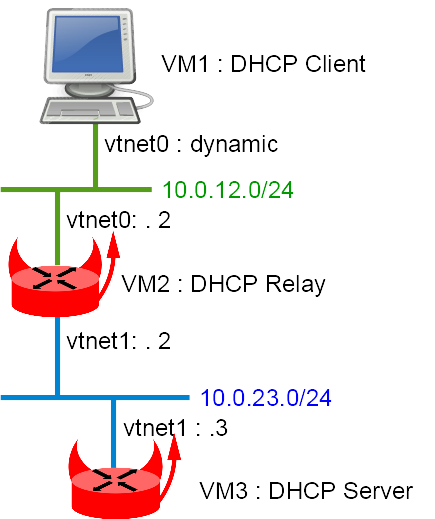

This Labs show an example of IPv4 DHCP Relay and server with BSDRP (v1.51)

## Presentation

### Network diagram

Here is the logical and physical view:



## Setting-up the lab

### Downloading BSD Router Project images

Download a BSDRP serial image (prevent to have to use an X display) on SourceForge.

### Downloading BSDRP lab scripts and starting the lab

More information on these BSDRP lab scripts available on [How to build a BSDRP router lab](how-to-build-a-bsdrp-router-lab.md).

Start a lab with 3 routers full meshed (no common LAN), example with VirtualBox script:

```
# tools/BSDRP-lab-bhyve.sh -i BSDRP-1.903-full-amd64-serial.img.xz -n 3
BSD Router Project (http://bsdrp.net) - bhyve full-meshed lab script
Setting-up a virtual lab with 3 VM(s):
- Working directory: /tmp/BSDRP
- Each VM have 1 core(s) and 256M RAM
- Emulated NIC: virtio-net
- Switch mode: bridge + tap
- 0 LAN(s) between all VM
- Full mesh Ethernet links between each VM
VM 1 have the following NIC:
- vtnet0 connected to VM 2
- vtnet1 connected to VM 3
VM 2 have the following NIC:
- vtnet0 connected to VM 1
- vtnet1 connected to VM 3
VM 3 have the following NIC:
- vtnet0 connected to VM 1
- vtnet1 connected to VM 2
For connecting to VM'serial console, you can use:
- VM 1 : cu -l /dev/nmdm1B
- VM 2 : cu -l /dev/nmdm2B
- VM 3 : cu -l /dev/nmdm3B
```

## Routers configuration

### VM3 (DHCP server)

```
sysrc hostname=VM3
sysrc gateway_enable=NO
sysrc ipv6_gateway_enable=NO
sysrc ifconfig_em1="10.0.23.3/24"
sysrc defaultrouter="10.0.23.2" 
sysrc dhcpd_enable=YES
sysrc dhcpd_flags="-q"
sysrc dhcpd_conf="/usr/local/etc/dhcpd.conf"
sysrc dhcpd_ifaces="em1"
sed -i "" 's/em/vtnet/g' /etc/rc.conf
cat > /usr/local/etc/dhcpd.conf <<'EOF'
subnet 10.0.23.0 netmask 255.255.255.0 {
}
subnet 10.0.12.0 netmask 255.255.255.0 {
  range 10.0.12.100 10.0.12.200;
  option routers 10.0.12.2;
}
'EOF'

hostname VM3
service netif restart
service routing restart
service isc-dhcpd start
config save
```

### VM2 (Router and DHCP Relay)

```
sysrc hostname=VM2
sysrc ifconfig_em0="10.0.12.2/24"
sysrc ifconfig_em1="10.0.23.2/24"
sysrc dhcprelya_enable=YES
sysrc dhcprelya_servers="10.0.23.3"
sysrc dhcprelya_ifaces="em0"
sed -i "" 's/em/vtnet/g' /etc/rc.conf
hostname VM2
service netif restart
service routing restart
service dhcprelya start
config save
```

### VM1 (DHCP client)

```
sysrc hostname=VM1
sysrc ifconfig_em0="DHCP"
sysrc gateway_enable=NO
sysrc ipv6_gateway_enable=NO
sed -i "" 's/em/vtnet/g' /etc/rc.conf
hostname VM1
service netif restart
service routing restart
config save
```

## Final testing

Check data received by DHCP client on VM1:

```
[root@VM1]~# ifconfig vtnet0
vtnet0: flags=8943<UP,BROADCAST,RUNNING,PROMISC,SIMPLEX,MULTICAST> metric 0 mtu 1500
        options=80028<VLAN_MTU,JUMBO_MTU,LINKSTATE>
        ether 58:9c:fc:01:02:01
        hwaddr 58:9c:fc:01:02:01
        inet6 fe80::5a9c:fcff:fe01:201%vtnet0 prefixlen 64 scopeid 0x1
        inet 10.0.12.100 netmask 0xffffff00 broadcast 10.0.12.255
        nd6 options=21<PERFORMNUD,AUTO_LINKLOCAL>
        media: Ethernet 10Gbase-T <full-duplex>
        status: active
[root@VM1]~# cat /var/db/dhclient.leases.vtnet0
lease {
  interface "vtnet0";
  fixed-address 10.0.12.100;
  option subnet-mask 255.255.255.0;
  option routers 10.0.12.2;
  option dhcp-lease-time 43200;
  option dhcp-message-type 5;
  option dhcp-server-identifier 10.0.23.3;
  renew 1 2017/7/10 20:14:07;
  rebind 2 2017/7/11 00:44:07;
  expire 2 2017/7/11 02:14:07;
}
```
