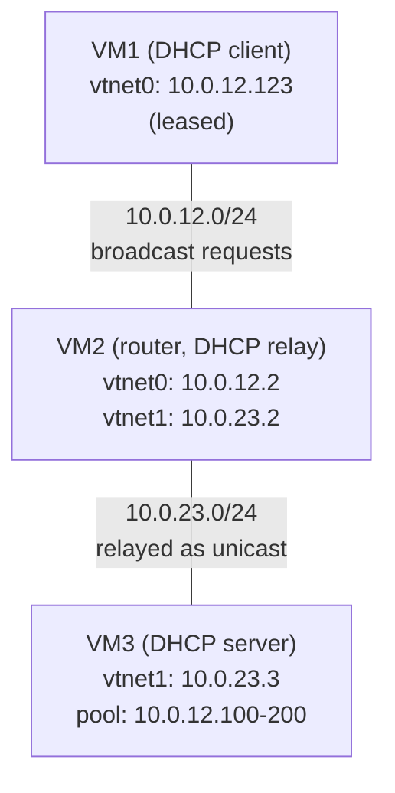

This lab shows an IPv4 DHCP server and DHCP relay example, both running
[dnsmasq](https://thekelleys.org.uk/dnsmasq/doc.html): one daemon covers the
two roles, so the whole lab uses a single configuration syntax.

The client is on a subnet where no DHCP server lives. Its broadcast requests
are picked up by the router in the middle, which relays them as unicast to the
server on the other subnet.

## Overview

### Network diagram

Here is the logical and physical view:



The server hands out addresses for 10.0.12.0/24, a subnet it has no interface
on: it only ever sees those requests through the relay.

## Setting up the lab

### Downloading BSD Router Project images

Download a BSDRP serial image (to avoid needing an X display) from SourceForge.

### Downloading BSDRP lab scripts and starting the lab

More information on the BSDRP lab scripts is available in [How to build a BSDRP router lab](how-to-build-a-bsdrp-router-lab.md).

Start a lab with 3 full-meshed routers (no common LAN). The `-r dhcp` flag
makes the lab script build per-VM cloud-init disks that apply the configuration
below automatically on first boot (through the `labconfig` script shipped in
the image):

```
# tools/BSDRP-lab-bhyve.sh -i BSDRP-2.3-full-amd64.img.xz -n 3 -r dhcp
BSD Router Project (https://bsdrp.net) - bhyve full-meshed lab script
Setting-up a virtual lab with 3 VM(s):
- Working directory: /root/BSDRP-VMs
- Each VM has a total of 1 (1 cores and 1 threads) and 1G RAM
- Emulated NIC: virtio-net
- Boot mode: UEFI
- Switch mode: bridge + tap
- 0 LAN(s) between all VM
- Full mesh Ethernet links between each VM
- Regression test lab: dhcp
VM 1 has the following NIC:
- vtnet0 connected to VM 2
- vtnet1 connected to VM 3
VM 2 has the following NIC:
- vtnet0 connected to VM 1
- vtnet1 connected to VM 3
VM 3 has the following NIC:
- vtnet0 connected to VM 1
- vtnet1 connected to VM 2
To connect VM'serial console, you can use:
- VM 1 : sudo cu -l /dev/nmdm-BSDRP.1B
- VM 2 : sudo cu -l /dev/nmdm-BSDRP.2B
- VM 3 : sudo cu -l /dev/nmdm-BSDRP.3B
```

Without `-r dhcp`, the 3 VMs boot unconfigured and you can enter the
configuration of each router by hand, as described below.

## Router configuration

### VM3 (DHCP server)

`port=0` disables the DNS side of dnsmasq, leaving only the DHCP server.

```
sysrc hostname=VM3 \
 gateway_enable=NO \
 ipv6_gateway_enable=NO \
 ifconfig_vtnet1="inet 10.0.23.3/24" \
 defaultrouter=10.0.23.2 \
 dnsmasq_enable=YES

cat > /usr/local/etc/dnsmasq.conf <<EOF
port=0
log-dhcp
dhcp-range=10.0.12.100,10.0.12.200,255.255.255.0,12h
dhcp-option=3,10.0.12.2
EOF

service hostname restart
service netif restart
service routing restart
service dnsmasq start
config save
```

!!! warning "A relayed pool needs an explicit netmask"
    For a directly connected subnet, dnsmasq reads the netmask off its own
    interface. Here 10.0.12.0/24 is only reachable through the relay, so the
    netmask has to be the third field of `dhcp-range`. Without it, dnsmasq
    refuses to serve the relayed requests.

    `dhcp-option=3,10.0.12.2` is the default router sent to the clients: the
    relay side of VM2, not the server.

### VM2 (router and DHCP relay)

The relay needs an address on the client subnet, given as the first field of
`dhcp-relay`; the second field is the server to unicast to.

```
sysrc hostname=VM2 \
 gateway_enable=YES \
 ipv6_gateway_enable=YES \
 ifconfig_vtnet0="inet 10.0.12.2/24" \
 ifconfig_vtnet1="inet 10.0.23.2/24" \
 dnsmasq_enable=YES

cat > /usr/local/etc/dnsmasq.conf <<EOF
port=0
log-dhcp
dhcp-relay=10.0.12.2,10.0.23.3
EOF

service hostname restart
service netif restart
service routing restart
service dnsmasq start
config save
```

### VM1 (DHCP client)

```
sysrc hostname=VM1 \
 gateway_enable=NO \
 ipv6_gateway_enable=NO \
 ifconfig_vtnet0=SYNCDHCP
service hostname restart
service netif restart
service routing restart
config save
```

## Final testing

The examples below were captured with dnsmasq 2.93 on BSDRP 2.3.

### Check the address received by the client

```
[root@VM1]~# ifconfig vtnet0
vtnet0: flags=1008843<UP,BROADCAST,RUNNING,SIMPLEX,MULTICAST,LOWER_UP> metric 0 mtu 1500
        options=880028<VLAN_MTU,JUMBO_MTU,LINKSTATE,HWSTATS>
        ether 58:9c:fc:01:02:01
        inet 10.0.12.123 netmask 0xffffff00 broadcast 10.0.12.255
        inet6 fe80::5a9c:fcff:fe01:201%vtnet0 prefixlen 64 scopeid 0x1
        media: Ethernet autoselect (10Gbase-T <full-duplex>)
```

The lease shows where the answer came from: the address is in the 10.0.12.0/24
pool, but the server identifier is VM3, on the other subnet.

```
[root@VM1]~# cat /var/db/dhclient.leases.vtnet0
lease {
  interface "vtnet0";
  fixed-address 10.0.12.123;
  next-server 10.0.23.3;
  option subnet-mask 255.255.255.0;
  option routers 10.0.12.2;
  option host-name "VM1";
  option broadcast-address 10.0.12.255;
  option dhcp-lease-time 43200;
  option dhcp-message-type 5;
  option dhcp-server-identifier 10.0.23.3;
  option dhcp-renewal-time 21600;
  option dhcp-rebinding-time 37800;
  renew 1 2026/9/21 14:02:54;
  rebind 1 2026/9/21 18:32:54;
  expire 1 2026/9/21 20:02:54;
}
```

### Check the relay

`log-dhcp` makes dnsmasq report the relay it set up, and the relaying itself:

```
[root@VM2]~# grep dnsmasq /var/log/daemon.log | grep -v 'compile time'
Sep 21 08:02:53 VM2 dnsmasq[91068]: started, version 2.93 DNS disabled
Sep 21 08:02:53 VM2 dnsmasq-dhcp[91068]: DHCP relay from 10.0.12.2 to 10.0.23.3
Sep 21 08:02:54 VM2 dnsmasq-dhcp[91068]: DHCP relay at 10.0.12.2 -> 10.0.23.3
```

On the wire, between the relay and the server, the broadcast requests of the
client have become a unicast conversation between the two routers:

```
[root@VM2]~# tcpdump -pni vtnet1 -c 4 port 67
tcpdump: verbose output suppressed, use -v[v]... for full protocol decode
listening on vtnet1, link-type EN10MB (Ethernet), snapshot length 262144 bytes
08:02:26.361695 IP 10.0.12.2.67 > 10.0.23.3.67: BOOTP/DHCP, Request from 58:9c:fc:01:02:01, length 300
08:02:26.362376 IP 10.0.23.3.67 > 10.0.12.2.67: BOOTP/DHCP, Reply, length 300
08:02:26.634279 IP 10.0.12.2.67 > 10.0.23.3.67: BOOTP/DHCP, Request from 58:9c:fc:01:02:01, length 300
08:02:26.635027 IP 10.0.23.3.67 > 10.0.12.2.67: BOOTP/DHCP, Reply, length 300
4 packets captured
4 packets received by filter
0 packets dropped by kernel
```

### Check the server

The server logs the full DISCOVER / OFFER / REQUEST / ACK exchange, and shows
which pool it picked the address from:

```
[root@VM3]~# grep dnsmasq-dhcp /var/log/daemon.log
Sep 21 08:02:54 VM3 dnsmasq-dhcp[69781]: 1963122818 available DHCP range: 10.0.12.100 -- 10.0.12.200
Sep 21 08:02:54 VM3 dnsmasq-dhcp[69781]: 1963122818 DHCPDISCOVER(vtnet1) 58:9c:fc:01:02:01
Sep 21 08:02:54 VM3 dnsmasq-dhcp[69781]: 1963122818 DHCPOFFER(vtnet1) 10.0.12.123 58:9c:fc:01:02:01
Sep 21 08:02:54 VM3 dnsmasq-dhcp[69781]: 1963122818 DHCPREQUEST(vtnet1) 10.0.12.123 58:9c:fc:01:02:01
Sep 21 08:02:54 VM3 dnsmasq-dhcp[69781]: 1963122818 DHCPACK(vtnet1) 10.0.12.123 58:9c:fc:01:02:01 VM1
```

Note the interface in those lines: vtnet1, the link toward the relay, not a
link on the client subnet.

Granted leases are kept in a single file, with their expiry date as a Unix
timestamp, the client MAC, the address, and the hostname it announced:

```
[root@VM3]~# cat /var/db/dnsmasq.leases
1790020974 58:9c:fc:01:02:01 10.0.12.123 VM1 01:58:9c:fc:01:02:01
```
