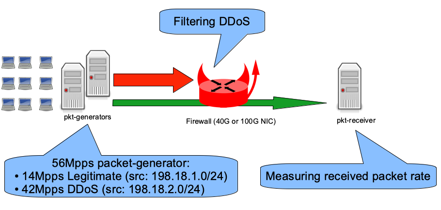

## Objective



## Using IPFW

### Standard IP-level configuration

The IPFW configuration file in standard mode:

1.  The first rule denies traffic from a blacklist table (IP addresses).
2.  The second rule allows everything else.
3.  Disable the outgoing [pfil(9)](https://www.freebsd.org/cgi/man.cgiquery=pfil&apropos=0&sektion=0&manpath=FreeBSD+12.1-RELEASE+and+Ports&arch=default&format=html) hook at the IP level because we do not need to filter outgoing traffic in this case.

<!-- -->

```
#!/bin/sh
set -eu
fwcmd="/sbin/ipfw"
${fwcmd} -f flush
${fwcmd} table blacklist destroy || true
${fwcmd} table blacklist create type addr
${fwcmd} table blacklist add 198.18.2.0/24
${fwcmd} add deny udp from table\(blacklist\) to any
${fwcmd} add pass ip from any to any
pfilctl unlink -o ipfw:default inet || true
pfilctl unlink -o ipfw:default6 inet6 || true
```

### NIC-level configuration

The [Pfil Memory Pointer Hooks](https://svnweb.freebsd.org/changeset/base/343631) feature is currently supported by the [iflib](https://svnweb.freebsd.org/changeset/base/346632), [vtnet](https://svnweb.freebsd.org/changeset/base/356613), [Mellanox](https://svnweb.freebsd.org/changeset/base/346247), and [Chelsio](https://svnweb.freebsd.org/changeset/base/357483) drivers.

The IPFW-at-NIC-level configuration file:

1.  The first rule denies traffic from a blacklist table (IP addresses).
2.  The second rule allows everything else.
3.  Enable pfil(9) at the NIC level (in only).
4.  Remove pfil(9) from the IP level (in and out).

<!-- -->

```
#!/bin/sh
set -eu
fwcmd="/sbin/ipfw"
${fwcmd} -f flush
${fwcmd} table blacklist destroy || true
${fwcmd} table blacklist create type addr
${fwcmd} table blacklist add 198.18.2.0/24
${fwcmd} add deny udp from table\(blacklist\) to any
${fwcmd} add pass ip from any to any
if pfilctl link -i ipfw:default-link cxl0; then
        pfilctl unlink -i ipfw:default inet || true
        pfilctl unlink -o ipfw:default inet || true
        pfilctl unlink -i ipfw:default6 inet6 || true
        pfilctl unlink -o ipfw:default6 inet6 || true
fi
```

### Performance benchmarks

Hardware:

- Intel Xeon CPU E5-2697A v4 @ 2.60GHz (16 cores, 32 threads)
- Input NIC (filtering): Chelsio T580-LP-CR (QSFP+ 40GBASE-SR4)
- Output NIC: Mellanox ConnectX-4 MCX416A-CCAT (QSFP28 100GBASE-SR4)
- FreeBSD 13.0-CURRENT r357572

Here is the rate of IPv4 (legitimate) packets per second forwarded while dropping 42 Mpps of denied packets using the different configurations:

```
x ipfw-standard
+ ipfw-at-nic-level
+--------------------------------------------------------------------------+
|                                                                         +|
|                                                                         +|
|                                                                         +|
| x                                                                       +|
|xx xx                                                                    +|
||MA|                                                                      |
|                                                                         A|
+--------------------------------------------------------------------------+
    N           Min           Max        Median           Avg        Stddev
x   5     9902014.5      10004945     9940500.5     9949589.9     41823.097
+   5      12013847      12018302      12015790      12015667       1720.41
Difference at 95.0% confidence
        2.06608e+06 +/- 43167.6
        20.7655% +/- 0.523817%
        (Student's t, pooled s = 29598.4)
```

Out of 14 Mpps of legitimate traffic, this generic (i.e., supported by multiple drivers) software firewall is still able to forward 12 Mpps while dropping 42 Mpps of denied packets.

## Using Chelsio's TCAM firewall

Chelsio NICs allow configuring a hardware firewall via cxgbetool(8). The [Linux user guide](https://service.chelsio.com/beta/drivers/ChelsioUwire-3.1.0.0/Chelsio-UnifiedWire-Linux-UserGuide.pdf) gives much more detail than the [FreeBSD user guide](https://service.chelsio.com/beta/drivers/ChelsioUwire-FBSD-3.3.0.1/Chelsio-UnifiedWire-FreeBSD-UserGuide.pdf).

A Chelsio NIC is identified by its family name + id and the port id (for a 4-port NIC, ports 0 to 4).

Example with only one Chelsio (t5nex0) with 2 ports (0 and 1):

```
# grep t.nex /var/run/dmesg.boot
t5nex0: <Chelsio T580-LP-CR> mem 0xf9300000-0xf937ffff,0xf8000000-0xf8ffffff,0xf9984000-0xf9985fff irq 40 at device 0.4 on pci4
cxl0: <port 0> on t5nex0
cxl1: <port 1> on t5nex0
t5nex0: PCIe gen3 x8, 2 ports, 66 MSI-X interrupts, 130 eq, 65 iq
```

Translating the firewall rule for the Chelsio:

- Add a filter to drop packets incoming on Chelsio NIC 0 (t5nex0) port 0 matching source IP range 198.18.2.0/24.

<!-- -->

```
# cxgbetool t5nex0 filter 0 iport 0 sip 198.18.2.0/24 action drop
# cxgbetool t5nex0 filter list
 Idx     Hits FCoE Port      vld:VLAN  Prot MPS Frag                  DIP                  SIP     DPORT     SPORT Action
   0        0  0/0  0/7 0:0000/0:0000 00/00 0/0  0/0    00000000/00000000    c6120200/ffffff00 0000/0000 0000/0000 Drop
```

A small script is used to check the packet drop rate:

```
#!/bin/sh
set -euf -o pipefail
if [ $# -eq 0 ]; then
        echo "Need Chelsio nexus name (examble: t5nex0)"
                echo "List of Nexus detected:"
                grep t.nex /var/run/dmesg.boot || true
        exit 1
fi
VALUE=$(cxgbetool $1 filter list  | awk '{if (NR!=1) {print $2}}')
echo "Filter hit rate"
while true; do
 sleep 1
 NEW_VALUE=$(cxgbetool $1 filter list  | awk '{if (NR!=1) {print $2}}')
 RATE=$((NEW_VALUE - VALUE))
 VALUE=${NEW_VALUE}
 echo ${RATE}
done
```

And its output during the 42 Mpps DDoS:

```
# /tmp/cxgbe-filter-rate.sh t5nex0
32361520
32365722
32368802
32492850
32494303
32434792
32398556
```

The script reports a hardware drop rate of 32 Mpps: where are the other 10 Mpps?

Read the [Chelsio default firmware configuration file for our T5-family NIC](https://cgit.freebsd.org/src/tree/sys/dev/cxgbe/firmware/t5fw_cfg_hashfilter.txt):

```
        # TCAM has 8K cells; each region must start at a multiple of 128 cell.
        # Each entry in these categories takes 4 cells each.  nhash will use the
        # TCAM iff there is room left (that is, the rest don't add up to 2048).
        nroute = 32
        nclip = 32
        nfilter = 1008
        nserver = 512
        nhash = 524288
```

We can display the currently applied values:

```
#  sysctl -n dev.t5nex.0.misc.devlog | grep -w le
        12           576921      INFO       RES  le configuration: nentries 2048 route 32 clip 32 filter 1440 server 416 active 128 hash 0 nserversram 0
        16           619796      INFO       RES  le initialization: nentries 2048 route 32 clip 32 filter 1440 server 416 active 128 hash 0 nserversram 0
```

To improve TCAM performance for filtering, all unused "regions" are disabled, keeping only route and filter (32 entries for route + 2016 for filter = 2048 total).

To do this, download the [default TCAM firmware configuration file for our T5 NIC](https://cgit.freebsd.org/src/tree/sys/dev/cxgbe/firmware/t5fw_cfg_hashfilter.txt), modify its parameters, load the modified configuration into the NIC flash, and instruct the NIC to use the file from its flash.

```
# fetch -o /etc/t5fw.txt https://cgit.freebsd.org/src/plain/sys/dev/cxgbe/firmware/t5fw_cfg_hashfilter.txt
# sed -i "" -e "s/nclip.*/nclip = 0/" /etc/t5fw.txt
# sed -i "" -e "s/nfilter.*/nfilter = 2016/" /etc/t5fw.txt
# sed -i "" -e "s/nserver.*/nserver = 0/" /etc/t5fw.txt
# sed -i "" -e "s/nhash.*/nhash = 0/" /etc/t5fw.txt
# echo 'hw.cxgbe.config_file="flash"' >> /boot/loader.conf.local
# cxgbetool t5nex0 loadcfg /etc/t5fw.txt
# reboot
```

Check the newly tuned parameters:

```
# sysctl -n dev.t5nex.0.misc.devlog | grep -w le
        12           690716      INFO       RES  le configuration: nentries 2048 route 32 clip 32 filter 1024 server 0 active 960 hash 0 nserversram 0
```

The server and hash regions are at 0 (disabled). Notice that the clip region is not disabled and filter does not have the size we requested, but the filtering performance expectations are met.

Now the packet drop rate of the TCAM firewall matches the generator's 42 Mpps:

```
# /tmp/cxgbe-filter-rate.sh t5nex0
42218564
42147194
42229442
42171263
42210128
42165602
42165483
42223090
```

And the firewall is now able to forward all packets **without being too busy** at the same time:

```
[root@firewall]~# netstat -ihw 1
           input        (Total)           output
   packets  errs idrops      bytes    packets  errs      bytes colls
       46M     0  5.0k       2.7G        14M     0       801M     0
       46M     0  2.6k       2.7G        14M     0       801M     0
       46M     0  2.1k       2.8G        14M     0       801M     0
       45M     0   515       2.7G        14M     0       801M     0
       46M     0  1.7k       2.7G        14M     0       801M     0
       46M     0   422       2.7G        14M     0       801M     0
       46M     0  3.9k       2.7G        14M     0       801M     0

[root@firewall]~# nstat -I cxl0
 InMpps  OMpps InGbs   OGbs err  TCP Est  %CPU syscalls    csw irq     GBfree
 45.60   0.00  23.35   0.00 1553      1   67.15    393 3168947 1728658 123.75
 45.56   0.00  23.33   0.00 4497      1   66.87    398 3171213 1729358 123.75
 45.53   0.00  23.31   0.00 12418     1   66.76    372 3182570 1734057 123.75
 45.52   0.00  23.31   0.00 9215      1   65.43    371 3183916 1735372 123.75
```
