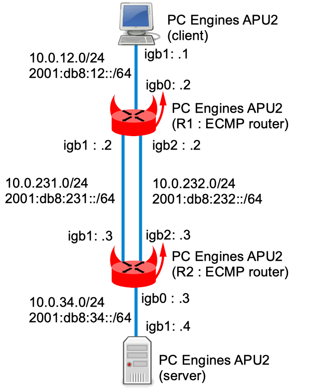

## Presentation


!!! warning
    Bhyve doesn’t support emulating multiqueue NIC, so RSS flow-id could not be tested using a bhyve based lab: Had to use physical lab


### Network diagram

Here is the logical and physical view:



## Setting-up the lab

### Downloading BSD Router Project images

Download BSDRP serial image on Sourceforge and upload them to the 2 ECMP routers.

## Static routing setup

### Client

A simple host with static routes:

```
sysrc hostname=client \
  gateway_enable=NO \
  ipv6_gateway_enable=NO \
  ifconfig_igb1="inet 10.0.12.1/24" \
  ifconfig_igb1_ipv6="inet6 2001:db8:12::3 prefixlen 64" \
  route_LAB="-net 10.0.0.0/16 10.0.12.2" \
  static_routes="LAB" \
  ipv6_static_routes="LAB" \
  ipv6_route_LAB="2001:db8:: -prefixlen 32 2001:db8:12::2"
service hostname restart
service netif restart
service routing restart
config save
```

### R1 (ECMP router)

R1 is a router with ECMP: 2 static routes toward the same destination but using 2 different next-hop.


```
sysrc hostname=R1 \
  gateway_enable=YES \
  ipv6_gateway_enable=YES \
  ifconfig_igb0="inet 10.0.12.2/24" \
  ifconfig_igb0_ipv6="inet6 2001:db8:12::2 prefixlen 64" \
  ifconfig_igb1="inet 10.0.231.2/24" \
  ifconfig_igb1_ipv6="inet6 2001:db8:231::2 prefixlen 64" \
  ifconfig_igb2="inet 10.0.232.2/24" \
  ifconfig_igb2_ipv6="inet6 2001:db8:232::2 prefixlen 64" \
  static_routes="MPATH1 MPATH2" \
  route_MPATH1="-net 10.0.0.0/16 10.0.231.3" \
  route_MPATH2="-net 10.0.0.0/16 10.0.232.3" \
  ipv6_static_routes="MPATH1 MPATH2" \
  ipv6_route_MPATH1="2001:db8:: -prefixlen 32 2001:db8:231::3" \
  ipv6_route_MPATH2="2001:db8:: -prefixlen 32 2001:db8:232::3"
service hostname restart
service netif restart
service routing restart
config save
```

Checking static route with multiple next-hop:

```
root@R1:~ # netstat -rn4 | grep 10.0.0.0/16
10.0.0.0/16        10.0.231.3         UGS        igb1
10.0.0.0/16        10.0.232.3         UGS        igb2

root@R1:~ # netstat -4onW
Nexthop data

Internet:
Idx   Type         IFA                Gateway             Flags      Use Mtu         Netif     Addrif Refcnt Prepend
1       v4/resolve 127.0.0.1          lo0/resolve        H             0  16384        lo0               2
2       v4/resolve 10.0.12.2          igb0/resolve                     0   1500       igb0               2
3       v4/resolve 127.0.0.1          lo0/resolve        HS            0  16384        lo0      igb0     2
4       v4/resolve 10.0.231.2         igb1/resolve                     0   1500       igb1               2
5       v4/resolve 127.0.0.1          lo0/resolve        HS            0  16384        lo0      igb1     2
6       v4/resolve 10.0.232.2         igb2/resolve                     0   1500       igb2               2
7       v4/resolve 127.0.0.1          lo0/resolve        HS            0  16384        lo0      igb2     2
8            v4/gw 10.0.231.2         10.0.231.3         GS            0   1500       igb1               1
9            v4/gw 10.0.232.2         10.0.232.3         GS            0   1500       igb2               1

root@R1:~ # netstat -6onW
Nexthop data

Internet6:
Idx   Type         IFA                           Gateway                        Flags      Use Mtu       Netif   Addrif Refcnt Prepend
1       v6/resolve ::1                           lo0/resolve                   HS            0  16384      lo0             2
2       v6/resolve fe80::1%lo0                   lo0/resolve                   HS            0  16384      lo0             2
3       v6/resolve fe80::1%lo0                   lo0/resolve                                 0  16384      lo0             2
4       v6/resolve ::1                           lo0/resolve                   HS            0  16384      lo0    igb0     3
5       v6/resolve fe80::20d:b9ff:fe41:ca3c%igb0 igb0/resolve                                0   1500     igb0             3
6       v6/resolve ::1                           lo0/resolve                   HS            0  16384      lo0    igb1     3
7       v6/resolve fe80::20d:b9ff:fe41:ca3d%igb1 igb1/resolve                                0   1500     igb1             3
8       v6/resolve ::1                           lo0/resolve                   HS            0  16384      lo0    igb2     3
9       v6/resolve fe80::20d:b9ff:fe41:ca3e%igb2 igb2/resolve                                0   1500     igb2             3
10           v6/gw ::1                           ::1                           GRS           0  16384      lo0             5
11           v6/gw 2001:db8:231::2               2001:db8:231::3               GS            0   1500     igb1             1
12           v6/gw 2001:db8:232::2               2001:db8:232::3               GS            0   1500     igb2             1
```

### R2 (ECMP router)

R2 is like R1, a router with ECMP: 2 static routing toward the same destination but using 2 different next-hop..

```
sysrc hostname=R2 \
  gateway_enable=YES \
  ipv6_gateway_enable=YES \
  ifconfig_igb0="inet 10.0.34.3/24" \
  ifconfig_igb0_ipv6="inet6 2001:db8:34::3 prefixlen 64" \
  ifconfig_igb1="inet 10.0.231.3/24" \
  ifconfig_igb1_ipv6="inet6 2001:db8:231::3 prefixlen 64" \
  ifconfig_igb2="inet 10.0.232.3/24" \
  ifconfig_igb2_ipv6="inet6 2001:db8:232::3 prefixlen 64" \
  static_routes="MPATH1 MPATH2" \
  route_MPATH1="-net 10.0.0.0/16 10.0.231.4" \
  route_MPATH2="-net 10.0.0.0/16 10.0.232.4" \
  ipv6_static_routes="MPATH1 MPATH2" \
  ipv6_route_MPATH1="2001:db8:: -prefixlen 32 2001:db8:231::4" \
  ipv6_route_MPATH2="2001:db8:: -prefixlen 32 2001:db8:232::4"
service hostname restart
service netif restart
service routing restart
config save
```

### Server

A simple host with some static routes:

```
sysrc hostname=server \
  gateway_enable=NO \
  ipv6_gateway_enable=NO \
  ifconfig_igb1="inet 10.0.34.4/24" \
  ifconfig_igb1_ipv6="inet6 2001:db8:34::4 prefixlen 64" \
  static_routes="LAB" \
  route_LAB="-net 10.0.0.0/16 10.0.34.3" \
  ipv6_static_routes="LAB" \
  ipv6_route_LAB="2001:db8:: -prefixlen 32 2001:db8:34::3"
service hostname restart
service netif restart
service routing restart
config save
```

## FRR Multipath setup

Replacing static routes by FRR (OSPF) compiled with MULTIPATH option.

### R1 (ECMP router)

In place of static routes, OSPF with FRR is used:

```
sysrc frr_vtysh_boot="YES" \
  frr_enable="YES" \
  frr_daemons="zebra ospfd ospf6d" \
  watchfrr_flags=" -d -r /usr/sbin/servicebBfrrbBrestartbB%s -s /usr/sbin/servicebBfrrbBstartbB%s -k /usr/sbin/servicebBfrrbBstopbB%s -b bB -t 30 zebra ospfd ospf6d" \
  watchfrr_enable="YES"

cat > /usr/local/etc/frr/frr.conf <EOF
frr version 8.4.1
frr defaults traditional
hostname R1
!
interface igb0
 ip ospf passive
 ipv6 ospf6 area 0.0.0.0
 ipv6 ospf6 passive
exit
!
interface igb1
 ipv6 ospf6 area 0.0.0.0
exit
!
interface igb2
 ipv6 ospf6 area 0.0.0.0
exit
!
router ospf
 ospf router-id 1.1.1.1
 network 10.0.12.0/24 area 0
 network 10.0.231.0/24 area 0
 network 10.0.232.0/24 area 0
exit
!
router ospf6
exit
!
EOF
service frr start
service watchfrr start
```

### R2 (ECMP router)

Same as R1 with OSPF and FRR:

```
sysrc frr_vtysh_boot="YES" \
  frr_enable="YES" \
  frr_daemons="zebra staticd ospfd ospf6d" \
  watchfrr_flags=" -d -r /usr/sbin/servicebBfrrbBrestartbB%s -s /usr/sbin/servicebBfrrbBstartbB%s -k /usr/sbin/servicebBfrrbBstopbB%s -b bB -t 30 zebra ospfd ospf6d" \
  watchfrr_enable="YES"

cat > /usr/local/etc/frr/frr.conf <EOF
frr version 8.4.1
frr defaults traditional
hostname R2
!
ip route 10.0.0.0/16 10.0.34.4
ipv6 route 2001:db8::/32 2001:db8:231::4
!
interface igb0
 ip ospf passive
 ipv6 ospf6 area 0.0.0.0
 ipv6 ospf6 passive
exit
!
interface igb1
 ipv6 ospf6 area 0.0.0.0
exit
!
interface igb2
 ipv6 ospf6 area 0.0.0.0
exit
!
router ospf
 ospf router-id 2.2.2.2
 redistribute static
 network 10.0.34.0/24 area 0
 network 10.0.231.0/24 area 0
 network 10.0.232.0/24 area 0
exit
!
router ospf6
 redistribute static
exit
!
EOF
service frr start
service watchfrr start
```

### Checking routes installed

On R1:

```
root@R1:~ # vtysh
Hello, this is FRRouting (version 8.4.1).
Copyright 1996-2005 Kunihiro Ishiguro, et al.

R1# sh ip route 10.0.0.0
Routing entry for 10.0.0.0/16
  Known via "ospf", distance 110, metric 20, best
  Last update 00:02:26 ago
  * 10.0.231.3, via igb1, weight 1
  * 10.0.232.3, via igb2, weight 1

R1# sh ipv6 route 2001:db8::
Routing entry for 2001:db8::/32
  Known via "ospf6", distance 110, metric 20, best
  Last update 00:02:39 ago
  * fe80::20d:b9ff:fe45:7ad5, via igb1, weight 1
  * fe80::20d:b9ff:fe45:7ad6, via igb2, weight 1
```

## Test Load balancing IP packets

Flows from the client to the server should be “flow-id shared” between the 2 paths. Let’s check using multiple sources and destination IP addresses using pkt-gen on client and server, then using systat on R1 and R2 to check their load-distribution.

On server:

```
root@server:~ # pkt-gen -i igb1 -f rx
```

On client:

```
root@client:~ # pkt-gen -i igb1 -f tx -n 8000000 -l 60 -d 10.0.255.1:2000-10.0.255.254 -D 00:0d:b9:41:ca:3c -s 10.0.254.1:2000-10.0.254.254 -S 00:0d:b9:45:7f:b0 -w 4 -R 20000
```

On R1:

```
systat -ifstat -match igb0,igb1,igb2 -pps

                    /0   /1   /2   /3   /4   /5   /6   /7   /8   /9   /10
     Load Average   |

      Interface           Traffic               Peak                Total
           igb2  in      0.000 Kp/s          0.000 Kp/s           71.247 Mp
                 out     9.762 Kp/s          9.777 Kp/s           76.892 Mp

           igb1  in      0.000 Kp/s          0.000 Kp/s           71.392 Mp
                 out     9.770 Kp/s          9.771 Kp/s           80.341 Mp

           igb0  in     19.533 Kp/s         19.534 Kp/s           90.007 Mp
                 out     0.000 Kp/s          0.000 Kp/s            0.243 Kp
                 
```

=\> We confirm that 20 Kps entering igb0 and are equally split by exiting by igb1 and igb2

On R2:

```
systat -ifstat -match igb0,igb1,igb2 -pps

                    /0   /1   /2   /3   /4   /5   /6   /7   /8   /9   /10
     Load Average   |

      Interface           Traffic               Peak                Total
           igb2  in      9.768 Kp/s          9.771 Kp/s          300.830 Kp
                 out     0.000 Kp/s          0.000 Kp/s            0.000 Kp

           igb1  in      9.763 Kp/s          9.768 Kp/s          300.785 Kp
                 out     0.000 Kp/s          0.000 Kp/s            0.006 Kp

           igb0  in      0.000 Kp/s          0.001 Kp/s            0.240 Kp
                 out    19.530 Kp/s         19.531 Kp/s          601.615 Kp
```

=\> R2 has no choice than receiving packets from igb1 and igb2, and forwarding them through igb0.
