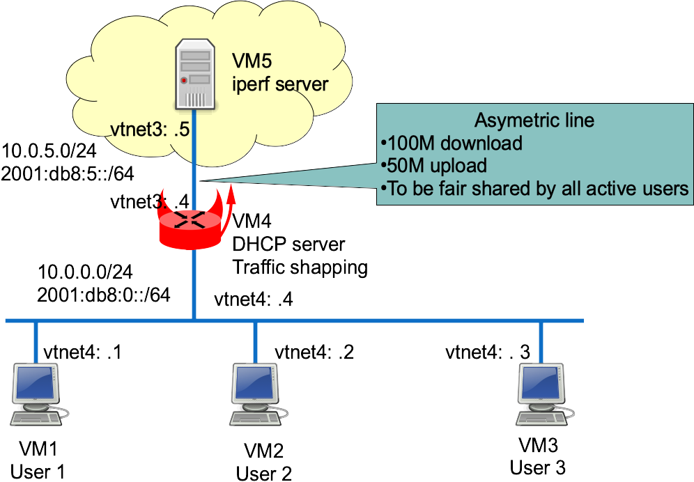

This lab shows an example of fair sharing of asymmetric Internet access between multiple users (one user = one IP address). This feature is called [User-Based Rate Limiting on some Cisco products](http://www.cisco.com/c/en/us/products/collateral/switches/catalyst-6500-series-switches/prod_white_paper0900aecd803e5017.html).

## Network diagram

Here is the detailed lab diagram:



## Virtual lab setup

This chapter describes how to start each router and configure the 4 hosts.

More information on the BSDRP lab scripts is available in [How to build a BSDRP router lab](how-to-build-a-bsdrp-router-lab.md).

Start the virtual lab (example using bhyve):

```
BSDRP-lab-bhyve.sh -i BSDRP-1.60-full-amd64-serial.img.xz -n 5 -l 1
BSD Router Project (http://bsdrp.net) - bhyve full-meshed lab script
Setting-up a virtual lab with 5 VM(s):
- Working directory: /tmp/BSDRP
- Each VM have 1 core(s) and 256M RAM
- Switch mode: bridge + tap
- 1 LAN(s) between all VM
- Full mesh Ethernet links between each VM
VM 1 have the following NIC:
- vtnet0 connected to VM 2.
- vtnet1 connected to VM 3.
- vtnet2 connected to VM 4.
- vtnet3 connected to VM 5.
- vtnet4 connected to LAN number 1
VM 2 have the following NIC:
- vtnet0 connected to VM 1.
- vtnet1 connected to VM 3.
- vtnet2 connected to VM 4.
- vtnet3 connected to VM 5.
- vtnet4 connected to LAN number 1
VM 3 have the following NIC:
- vtnet0 connected to VM 1.
- vtnet1 connected to VM 2.
- vtnet2 connected to VM 4.
- vtnet3 connected to VM 5.
- vtnet4 connected to LAN number 1
VM 4 have the following NIC:
- vtnet0 connected to VM 1.
- vtnet1 connected to VM 2.
- vtnet2 connected to VM 3.
- vtnet3 connected to VM 5.
- vtnet4 connected to LAN number 1
VM 5 have the following NIC:
- vtnet0 connected to VM 1.
- vtnet1 connected to VM 2.
- vtnet2 connected to VM 3.
- vtnet3 connected to VM 4.
- vtnet4 connected to LAN number 1
For connecting to VM'serial console, you can use:
- VM 1 : cu -l /dev/nmdm1B
- VM 2 : cu -l /dev/nmdm2B
- VM 3 : cu -l /dev/nmdm3B
- VM 4 : cu -l /dev/nmdm4B
- VM 5 : cu -l /dev/nmdm5B
```

### User PC configuration

Each user PC is configured as a simple DHCP client.

#### Router 1

```
sysrc hostname=R1 \
  gateway_enable=no \
  ipv6_gateway_enable=no \
  ifconfig_vtnet4="DHCP" \
  ifconfig_vtnet4_ipv6="inet6 accept_rtadv" \
  rtsold_enable="YES"
service hostname restart
service netif restart
service routing restart
service rtsold start
config save
```

#### Router 2

```
sysrc hostname=R2 \
   gateway_enable=no \
   ipv6_gateway_enable=no \
   ifconfig_vtnet4="DHCP" \
   ifconfig_vtnet4_ipv6="inet6 accept_rtadv" \
   rtsold_enable="YES"
service hostname restart
service netif restart
service routing restart
service rtsold start
config save
```

#### Router 3

```
sysrc hostname=R3 \
  gateway_enable=no \
  ipv6_gateway_enable=no \
  ifconfig_vtnet4="DHCP" \
  ifconfig_vtnet4_ipv6="inet6 accept_rtadv" \
  rtsold_enable="YES"
service hostname restart
service netif restart
service routing restart
service rtsold start
config save
```

### Internet server configuration

It’s a simple host with a static address.

```
sysrc hostname=R5 \
  gateway_enable=no \
  ipv6_gateway_enable=no \
  ifconfig_vtnet3="10.0.5.5/24" \
  ifconfig_vtnet3_ipv6="inet6 2001:db8:5::5/64" \
  defaultrouter="10.0.5.4" \
  ipv6_defaultrouter="2001:db8:5::4"
service hostname restart
service netif restart
service routing restart
```

### Traffic shaper configuration

It’s a DHCPv4 server and traffic shaper.

```
sysrc hostname=R4 \
  ifconfig_vtnet4="10.0.0.4/24" \
  ifconfig_vtnet4_ipv6="inet6 2001:db8::4/64" \
  ifconfig_vtnet3="10.0.5.4/24" \
  ifconfig_vtnet3_ipv6="inet6 2001:db8:5::4/64" \
  rtadvd_enable=yes \
  rtadvd_interfaces=vtnet4 \
  dhcpd_enable=YES \
  dhcpd_flags="-q" \
  dhcpd_conf="/usr/local/etc/dhcpd.conf" \
  dhcpd_ifaces="vtnet4" \
  firewall_enable=YES \
  firewall_script="/etc/ipfw.rules"

cat > /usr/local/etc/dhcpd.conf <<EOF
option domain-name "bsdrp.net";
default-lease-time 600;
max-lease-time 7200;
ddns-update-style none;
subnet 10.0.5.0 netmask 255.255.255.0 {
}
subnet 10.0.0.0 netmask 255.255.255.0 {
  range 10.0.0.1 10.0.0.3;
  option routers 10.0.0.4;
}
EOF

cat > /etc/ipfw.rules <<'EOF'
#!/bin/sh
fwcmd="/sbin/ipfw"
if ! kldstat -q -m dummynet; then
        kldload dummynet
fi
# Flush out the list before we begin.
${fwcmd} -f flush
oif=vtnet3              # Output interface
bwu=50Mbit/s    # Maximum upload speed
bwd=100Mbit/s   # Maximum download speed
# Declare hard-limit of our links (2 because bidirectional)
${fwcmd} pipe 1 config bw $bwu
${fwcmd} pipe 2 config bw $bwd
# per-ip fair queueing
${fwcmd} queue 1 config pipe 1 mask src-ip 0xffffffff
${fwcmd} queue 2 config pipe 2 mask dst-ip 0xffffffff
# Assing outgoing traffic to upload queue and incoming to download queue
${fwcmd} add queue 1 ip from any to any xmit $oif out
${fwcmd} add queue 2 ip from any to any recv $oif in
# We don't want to block traffic, only shape some
${fwcmd} add 3000 allow ip from any to any
'EOF'

service hostname restart
service netif restart
service routing restart
service isc-dhcpd start
service rtadvd start
service ipfw start
config save
```

## Shaping tests

Start 3 iperf3 servers on the “Internet server” on 3 different TCP ports (using tmux).

```
[root@R5]~# iperf3 -s -p 9091
-----------------------------------------------------------
Server listening on 9091
-----------------------------------------------------------

[root@R5]~# iperf3 -s -p 9092
-----------------------------------------------------------
Server listening on 9092
-----------------------------------------------------------

[root@R5]~# iperf3 -s -p 9093
-----------------------------------------------------------
Server listening on 9093
-----------------------------------------------------------
```

### With only one user

If there is only one user, it should get the full bandwidth. From only one client (R1, R2 or R3), start by generating traffic toward the iperf3 server to check that the maximum upload bandwidth is correctly shaped to 50 Mb/s:

```
[root@R3]~# iperf3 -c 10.0.5.5 -t 60 -i 10 -f m -p 9093
Connecting to host 10.0.5.5, port 5201
[  4] local 10.0.0.3 port 10049 connected to 10.0.5.5 port 9093
[ ID] Interval           Transfer     Bandwidth       Retr  Cwnd
[  4]   0.00-10.00  sec  57.6 MBytes  48.4 Mbits/sec   69   98.5 MBytes
[  4]  10.00-20.00  sec  57.5 MBytes  48.3 Mbits/sec   72   86.5 MBytes
[  4]  20.00-30.00  sec  57.5 MBytes  48.3 Mbits/sec   72   70.5 MBytes
[  4]  30.00-40.00  sec  57.5 MBytes  48.3 Mbits/sec   72   52.0 MBytes
[  4]  40.00-50.00  sec  57.6 MBytes  48.3 Mbits/sec   70   96.5 MBytes
[  4]  50.00-60.00  sec  57.5 MBytes  48.3 Mbits/sec   72   82.5 MBytes
- - - - - - - - - - - - - - - - - - - - - - - - -
[ ID] Interval           Transfer     Bandwidth       Retr
[  4]   0.00-60.00  sec   345 MBytes  48.3 Mbits/sec  427             sender
[  4]   0.00-60.00  sec   345 MBytes  48.3 Mbits/sec                  receiver

iperf Done.
```

=\> Upload is correctly shaped to 50 Mb/s.

Now a “reverse” bench (the server sends data to the user) to test the download shaping:

```
[root@r3]~# iperf3 -c 10.0.5.5 -t 60 -i 10 -f m -R -p 9093
Connecting to host 10.0.5.5, port 5201
Reverse mode, remote host 10.0.5.5 is sending
[  4] local 10.0.0.3 port 10280 connected to 10.0.5.5 port 9093
[ ID] Interval           Transfer     Bandwidth
[  4]   0.00-10.00  sec   115 MBytes  96.6 Mbits/sec
[  4]  10.00-20.00  sec   115 MBytes  96.5 Mbits/sec
[  4]  20.00-30.00  sec   115 MBytes  96.5 Mbits/sec
[  4]  30.00-40.00  sec   115 MBytes  96.5 Mbits/sec
[  4]  40.00-50.00  sec   115 MBytes  96.5 Mbits/sec
[  4]  50.00-60.00  sec   115 MBytes  96.5 Mbits/sec
- - - - - - - - - - - - - - - - - - - - - - - - -
[ ID] Interval           Transfer     Bandwidth       Retr
[  4]   0.00-60.00  sec   691 MBytes  96.6 Mbits/sec  858             sender
[  4]   0.00-60.00  sec   691 MBytes  96.6 Mbits/sec                  receiver
```

⇒ Download is correctly shaped to 100 Mb/s.

### With two users

Now start iperf clients at the same time on 2 clients and check that upload is equally shared (25 Mb/s each):

```
[root@R3]~# iperf3 -c 10.0.5.5 -t 60 -i 10 -f m -p 9093
Connecting to host 10.0.5.5, port 9093
[  4] local 10.0.0.3 port 36202 connected to 10.0.5.5 port 9093
[ ID] Interval           Transfer     Bandwidth       Retr  Cwnd
[  4]   0.00-10.00  sec  28.9 MBytes  24.2 Mbits/sec   28   96.5 MBytes
[  4]  10.00-20.00  sec  28.8 MBytes  24.1 Mbits/sec   29   88.0 MBytes
[  4]  20.00-30.00  sec  28.8 MBytes  24.1 Mbits/sec   28   76.0 MBytes
[  4]  30.00-40.00  sec  28.8 MBytes  24.1 Mbits/sec   28   65.2 MBytes
[  4]  40.00-50.00  sec  28.8 MBytes  24.1 Mbits/sec   27   39.2 MBytes
[  4]  50.00-60.00  sec  32.6 MBytes  27.3 Mbits/sec   32   60.5 MBytes
- - - - - - - - - - - - - - - - - - - - - - - - -
[ ID] Interval           Transfer     Bandwidth       Retr
[  4]   0.00-60.00  sec   177 MBytes  24.7 Mbits/sec  172             sender
[  4]   0.00-60.00  sec   176 MBytes  24.7 Mbits/sec                  receiver

iperf Done.

[root@R2]~# iperf3 -c 10.0.5.5 -t 60 -i 10 -f m -p 9092
Connecting to host 10.0.5.5, port 9092
[  4] local 10.0.0.1 port 25306 connected to 10.0.5.5 port 9092
[ ID] Interval           Transfer     Bandwidth       Retr  Cwnd
[  4]   0.00-10.00  sec  32.8 MBytes  27.5 Mbits/sec   35    103 MBytes
[  4]  10.00-20.00  sec  28.8 MBytes  24.1 Mbits/sec   29   97.2 MBytes
[  4]  20.00-30.00  sec  28.8 MBytes  24.1 Mbits/sec   27   90.0 MBytes
[  4]  30.00-40.00  sec  28.8 MBytes  24.1 Mbits/sec   31   68.0 MBytes
[  4]  40.00-50.00  sec  28.8 MBytes  24.1 Mbits/sec   28   2.00 MBytes
[  4]  50.00-60.00  sec  28.8 MBytes  24.2 Mbits/sec   27   98.0 MBytes
- - - - - - - - - - - - - - - - - - - - - - - - -
[ ID] Interval           Transfer     Bandwidth       Retr
[  4]   0.00-60.00  sec   177 MBytes  24.7 Mbits/sec  177             sender
[  4]   0.00-60.00  sec   177 MBytes  24.7 Mbits/sec                  receiver

iperf Done.
```

=\> Upload bandwidth is fairly shared between the two users.

Now the download speed should be 50 Mb/s each too:

```
[root@R3]~# iperf3 -c 10.0.5.5 -t 60 -i 10 -f m -p 9093 -R
Connecting to host 10.0.5.5, port 9093
Reverse mode, remote host 10.0.5.5 is sending
[  4] local 10.0.0.3 port 14377 connected to 10.0.5.5 port 9093
[ ID] Interval           Transfer     Bandwidth
[  4]   0.00-10.00  sec  69.4 MBytes  58.3 Mbits/sec
[  4]  10.00-20.00  sec  57.5 MBytes  48.3 Mbits/sec
[  4]  20.00-30.00  sec  57.5 MBytes  48.3 Mbits/sec
[  4]  30.00-40.00  sec  57.5 MBytes  48.3 Mbits/sec
[  4]  40.00-50.00  sec  57.5 MBytes  48.3 Mbits/sec
[  4]  50.00-60.00  sec  57.5 MBytes  48.3 Mbits/sec
- - - - - - - - - - - - - - - - - - - - - - - - -
[ ID] Interval           Transfer     Bandwidth       Retr
[  4]   0.00-60.00  sec   357 MBytes  49.9 Mbits/sec  430             sender
[  4]   0.00-60.00  sec   357 MBytes  49.9 Mbits/sec                  receiver

iperf Done.

[root@R2]~# iperf3 -c 10.0.5.5 -t 60 -i 10 -f m -p 9092 -R
Connecting to host 10.0.5.5, port 9092
Reverse mode, remote host 10.0.5.5 is sending
[  4] local 10.0.0.1 port 56926 connected to 10.0.5.5 port 9092
[ ID] Interval           Transfer     Bandwidth
[  4]   0.00-10.00  sec  57.6 MBytes  48.3 Mbits/sec
[  4]  10.00-20.00  sec  57.5 MBytes  48.3 Mbits/sec
[  4]  20.00-30.00  sec  57.5 MBytes  48.3 Mbits/sec
[  4]  30.00-40.00  sec  57.5 MBytes  48.3 Mbits/sec
[  4]  40.00-50.00  sec  57.5 MBytes  48.3 Mbits/sec
[  4]  50.00-60.00  sec  69.3 MBytes  58.2 Mbits/sec
- - - - - - - - - - - - - - - - - - - - - - - - -
[ ID] Interval           Transfer     Bandwidth       Retr
[  4]   0.00-60.00  sec   357 MBytes  49.9 Mbits/sec  459             sender
[  4]   0.00-60.00  sec   357 MBytes  49.9 Mbits/sec                  receiver

iperf Done.
```

=\> Same correct behavior here.

During this bench, on the router, queue 1 (upload) and queue 2 (download) status:

```
[root@R4]~# ipfw queue 1 show
q00001  50 sl. 2 flows (64 buckets) sched 1 weight 1 lmax 1500 pri 0 droptail
    mask:  0x00 0xffffffff/0x0000 -> 0x00000000/0x0000
BKT Prot ___Source IP/port____ ____Dest. IP/port____ Tot_pkt/bytes Pkt/Byte Drp
  2 ip          10.0.0.1/0             0.0.0.0/0      460    23968  0    0   0
  6 ip          10.0.0.3/0             0.0.0.0/0     8914   475448  0    0   0
[root@R4]~# ipfw queue 2 show
q00002  50 sl. 2 flows (64 buckets) sched 2 weight 1 lmax 1500 pri 0 droptail
    mask:  0x00 0x00000000/0x0000 -> 0xffffffff/0x0000
BKT Prot ___Source IP/port____ ____Dest. IP/port____ Tot_pkt/bytes Pkt/Byte Drp
  1 ip           0.0.0.0/0            10.0.0.1/0     131602 197344212 29 43500 235
  3 ip           0.0.0.0/0            10.0.0.3/0     148839 223199376 46 69000 239
```

### With three users

Same correct behavior with three users. Here is the upload bandwidth of one of the three users:

```
[root@R1]~# iperf3 -c 10.0.5.5 -t 60 -i 10 -f m -p 9091
Connecting to host 10.0.5.5, port 9091
[  4] local 10.0.0.2 port 35814 connected to 10.0.5.5 port 9091
[ ID] Interval           Transfer     Bandwidth       Retr  Cwnd
[  4]   0.00-10.00  sec  19.5 MBytes  16.3 Mbits/sec   26   64.0 MBytes
[  4]  10.00-20.00  sec  19.2 MBytes  16.1 Mbits/sec   21   71.2 MBytes
[  4]  20.00-30.00  sec  19.7 MBytes  16.6 Mbits/sec   22   85.2 MBytes
[  4]  30.00-40.00  sec  19.4 MBytes  16.2 Mbits/sec   22   86.5 MBytes
[  4]  40.00-50.00  sec  18.6 MBytes  15.6 Mbits/sec   22   72.4 MBytes
[  4]  50.00-60.00  sec  27.9 MBytes  23.4 Mbits/sec   32   94.5 MBytes
- - - - - - - - - - - - - - - - - - - - - - - - -
[ ID] Interval           Transfer     Bandwidth       Retr
[  4]   0.00-60.00  sec   124 MBytes  17.4 Mbits/sec  145             sender
[  4]   0.00-60.00  sec   124 MBytes  17.4 Mbits/sec                  receiver

iperf Done.
```

=\> Only 50M/3 = 16.66 Mb/s for each user on upload.

Queue status on the router during this three-user bench:

```
[root@R4]~# ipfw queue 1 show
q00001  50 sl. 3 flows (64 buckets) sched 1 weight 1 lmax 1500 pri 0 droptail
    mask:  0x00 0xffffffff/0x0000 -> 0x00000000/0x0000
BKT Prot ___Source IP/port____ ____Dest. IP/port____ Tot_pkt/bytes Pkt/Byte Drp
  2 ip          10.0.0.1/0             0.0.0.0/0     56973 85424308 49 73500  82
  4 ip          10.0.0.2/0             0.0.0.0/0     53684 80483232 26 39000  87
  6 ip          10.0.0.3/0             0.0.0.0/0     16313 24462252 33 49500  26
[root@R4]~# ipfw queue 2 show
q00002  50 sl. 3 flows (64 buckets) sched 2 weight 1 lmax 1500 pri 0 droptail
    mask:  0x00 0x00000000/0x0000 -> 0xffffffff/0x0000
BKT Prot ___Source IP/port____ ____Dest. IP/port____ Tot_pkt/bytes Pkt/Byte Drp
  1 ip           0.0.0.0/0            10.0.0.1/0     1149    61252  0    0   0
  2 ip           0.0.0.0/0            10.0.0.2/0     1094    58504  1   72   0
  3 ip           0.0.0.0/0            10.0.0.3/0     1060    56568  1   52   0
```
