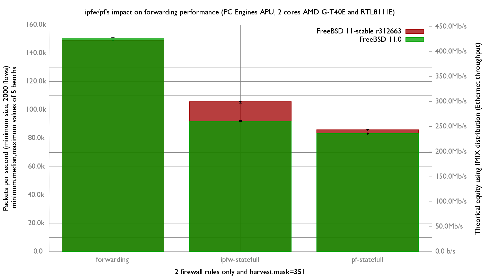

## Hardware detail

This lab tests a [PC Engines APU 1](http://www.pcengines.ch/apu.htm) ([dmesg](pc-engines-apu.md)):

- Dual-core [AMD G-T40E Processor](http://www.amd.com/us/Documents/49282_G-Series_platform_brief.pdf) (1 GHz)
- 3x Realtek RTL8111E Gigabit Ethernet ports
- 2 GB of RAM

[Forwarding performance of APU version 2 is here.](forwarding-performance-lab-of-a-pc-engines-apu2.md)

## Lab set-up

For more information about full setup of this lab: [Setting up a forwarding performance benchmark lab](setting-up-a-forwarding-performance-benchmark-lab.md) (switch configuration, etc.).

### Diagram

```
 +------------------------------------------+      +-----------------------+
 |              Device under Test           |      |       Packet gen      |
 |                                          |      |                       |
 |                     re1: 198.18.0.207/24 |<=====| igb2: 198.18.0.203/24 |
 |                           2001:2::207/64 |      |        2001:2::203/64 |
 |                        00:0d:b9:3c:dd:3d |      |     00:1b:21:c4:95:7a |
 |                                          |      |                       |
 |                     re2: 198.19.0.207/24 |=====>| igb3: 198.19.0.203/24 |
 |                      2001:2:0:8000::8/64 |      | 2001:2:0:8000::203/64 |
 |                        00:0d:b9:3c:dd:3e |      |     00:1b:21:c4:95:7b |
 |                                          |      |                       |
 |               static routes              |      |                       |
 |      198.19.0.0/16 => 198.19.0.203       |      +-----------------------+
 |      198.18.0.0/16 => 198.18.0.203       |
 | 2001:2::/49        => 2001:2::203        |
 | 2001:2:0:8000::/49 => 2001:2:0:8000::203 |
 |                                          |
 |        static arp and ndp                |
 | 198.18.0.203        => 00:1b:21:c4:95:7a |
 | 2001:2::203                              |
 |                                          |
 | 198.19.0.203        => 00:1b:21:c4:95:7b |
 | 2001:2:0:8000::203                       |
 |                                          |
 +------------------------------------------+
```

The generator **MUST** generate lots of IP flows (multiple source/destination IP addresses and/or UDP src/dst ports) with the minimum packet size (to produce the maximum packet rate) with one of these commands:

Multiple source/destination IP addresses (don't forget to specify the UDP port to avoid using port 0, which is filtered by pf):

```
pkt-gen -U -i igb3 -f tx -n 80000000 -l 60 -d 198.19.10.1:2000-198.19.10.20 -D 00:0d:b9:3c:dd:3e -s 198.18.10.1:2000-198.18.10.100 -w 4
```

The receiver will use this command:

```
pkt-gen -i igb2 -f rx -w 4
```

## Basic configuration

### Disabling Ethernet flow control

The re(4) driver does not appear to support flow control, and the switch confirms this:

```
switch#sh int Gi1/0/16 flowcontrol
Port       Send FlowControl  Receive FlowControl  RxPause TxPause
           admin    oper     admin    oper
---------  -------- -------- -------- --------    ------- -------
Gi1/0/16   Unsupp.  Unsupp.  off      off         0       0
switch#sh int Gi1/0/17 flowcontrol
Port       Send FlowControl  Receive FlowControl  RxPause TxPause
           admin    oper     admin    oper
---------  -------- -------- -------- --------    ------- -------
Gi1/0/17   Unsupp.  Unsupp.  off      off         0       0
```

### Static routes and ARP entries

Configure static routes, IP addresses, and static ARP entries. A router [should not use LRO and TSO](../technical-docs/performance.md). BSDRP disables these by default via an RC script (`disablelrotso_enable="YES"` in `/etc/rc.conf.misc`), but the re(4) driver does not support disabling them this way.

/etc/rc.conf:

```
# IPv4 router
gateway_enable="YES"
ifconfig_re1="inet 198.18.0.207/24"
ifconfig_re2="inet 198.19.0.207/24"
static_routes="generator receiver"
route_generator="-net 198.18.0.0/16 198.18.0.203"
route_receiver="-net 198.19.0.0/16 198.19.0.203"
static_arp_pairs="receiver generator"
static_arp_generator="198.18.0.203 00:1b:21:c4:95:7a"
static_arp_receiver="198.19.0.203 00:1b:21:c4:95:7b"

# IPv6 router
ipv6_gateway_enable="YES"
ipv6_activate_all_interfaces="YES"
ipv6_static_routes="generator receiver"
ipv6_route_generator="2001:2:: -prefixlen 49 2001:2::203"
ipv6_route_receiver="2001:2:0:8000:: -prefixlen 49 2001:2:0:8000::203"
ifconfig_re1_ipv6="inet6 2001:2::207 prefixlen 64"
ifconfig_re2_ipv6="inet6 2001:2:0:8000::207 prefixlen 64"
static_ndp_pairs="receiver generator"
static_ndp_generator="2001:2::203 00:1b:21:c4:95:7a"
static_ndp_receiver="2001:2:0:8000::203 00:1b:21:c4:95:7b"
```

## Default forwarding rate

We start the first test with one packet generator at gigabit line rate (1.488 Mpps) and observe:

- The APU is still responsive during this test (thanks to the dual core).
- About 154 Kpps are accepted by the re(4) Ethernet interface.

<!-- -->

```
[root@BSDRP]~# netstat -iw 1
            input        (Total)           output
   packets  errs idrops      bytes    packets  errs      bytes colls
    154273     0     0    9256386     154241     0    9256550     0
    154081     0     0    9244866     154081     0    9244982     0
    154113     0     0    9246786     154113     0    9246902     0
    154151     0     0    9249066     154177     0    9249182     0
    154139     0     0    9248346     154113     0    9248462     0
    154113     0     0    9246786     154113     0    9246902     0
    154145     0     0    9248706     154145     0    9248822     0
    154193     0     0    9251586     154209     0    9252662     0
    154135     0     0    9248106     154145     0    9247322     0
    154139     0     0    9248346     154113     0    9248402     0
    154151     0     0    9249066     154177     0    9249242     0
    154145     0     0    9248706     154145     0    9248822     0
    154147     0     0    9248826     154145     0    9248882     0
    154169     0     0    9250146     154177     0    9250262     0
    154145     0     0    9248706     154113     0    9248822     0
```

The forwarding rate is not very high: Realtek NICs are not very fast, do not support multi-queues, and this is only a 1 GHz CPU. We notice that the input error counters of re(4) are not updated: re(4) driver bug?

We can force driver stats with this command:

```
[root@BSDRP]~# sysctl dev.re.1.stats=1
dev.re.1.stats: -1 -> -1
[root@BSDRP]~# dmesg
(etc...)
re1 statistics:
Tx frames : 6
Rx frames : 16394206
Tx errors : 0
Rx errors : 0
Rx missed frames : 16421
Rx frame alignment errs : 0
Tx single collisions : 0
Tx multiple collisions : 0
Rx unicast frames : 16394204
Rx broadcast frames : 2
Rx multicast frames : 0
Tx aborts : 0
Tx underruns : 0
```

But the RX missed frame counter is still not accurate.

System load during this test:

```
[root@BSDRP]/# top -nCHSIzs1
last pid:  4067;  load averages:  0.49,  0.16,  0.04  up 0+01:04:10    18:32:04
86 processes:  3 running, 67 sleeping, 16 waiting

Mem: 6312K Active, 19M Inact, 75M Wired, 12M Buf, 1849M Free
Swap:

  PID USERNAME   PRI NICE   SIZE    RES STATE   C   TIME     CPU COMMAND
   11 root       -92    -     0K   256K WAIT    0   0:25  68.26% intr{irq260: re1}
   11 root       -92    -     0K   256K WAIT    0   0:03   8.25% intr{irq261: re2}
```

## Firewalls impact

This test generates 2000 different flows by using 2000 different UDP destination ports.

The pf and ipfw configurations used are detailed in the earlier [Forwarding performance lab of an IBM System x3550 M3 with Intel 82580](forwarding-performance-lab-of-an-ibm-system-x3550-m3-with-intel-82580.md#firewall-impact).

### Graph

Scale information about Gigabit Ethernet:

- 1.488 Mpps is the maximum packet-per-second (pps) rate with the smallest 46-byte packets.
- 81 Kpps is the minimum pps rate with the largest 1500-byte packets.



### Ministat

All benchmarks were run 5 times, with a reboot between them.

```
x forwarding
+ ipfw-statefull
* pf-statefull
+--------------------------------------------------------------------------+
|*                                                                         |
|*                            +                                           x|
|*                            +                                           x|
|*                            +                                           x|
|*                           ++                                           x|
|                                                                         A|
|                            |A                                            |
|A                                                                         |
+--------------------------------------------------------------------------+
    N           Min           Max        Median           Avg        Stddev
x   5        154144        154200        154167      154171.6     20.671236
+   5        113357        114637        114173      114152.6     486.93151
Difference at 95.0% confidence
        -40019 +/- 502.612
        -25.9574% +/- 0.326008%
        (Student's t, pooled s = 344.623)
*   5         88037         88385         88108         88169     144.98793
Difference at 95.0% confidence
        -66002.6 +/- 151.034
        -42.8111% +/- 0.0979651%
        (Student's t, pooled s = 103.559)
```

## Netmap's pkt-gen performance

re(4) has [netmap](http://info.iet.unipi.it/~luigi/netmap/) support... what about the rate with netmap's packet generator/receiver?

As a receiver (the sender is emitting at 1.48 Mpps):

```
[root@APU]~# pkt-gen -i re1 -f rx -w 4 -c 2
854.089137 main [1641] interface is re1
854.089501 extract_ip_range [275] range is 10.0.0.1:0 to 10.0.0.1:0
854.089523 extract_ip_range [275] range is 10.1.0.1:0 to 10.1.0.1:0
854.111967 main [1824] mapped 334980KB at 0x801dff000
Receiving from netmap:re1: 1 queues, 1 threads and 2 cpus.
854.112634 main [1904] Wait 4 secs for phy reset
858.123495 main [1906] Ready...
858.123756 nm_open [457] overriding ifname re1 ringid 0x0 flags 0x1
859.124355 receiver_body [1189] waiting for initial packets, poll returns 0 0
(etc...)
862.129332 main_thread [1438] 579292 pps (580438 pkts in 1001978 usec)
863.131433 main_thread [1438] 579115 pps (580332 pkts in 1002101 usec)
894.184371 main_thread [1438] 577549 pps (578725 pkts in 1002036 usec)
895.185330 main_thread [1438] 577483 pps (578037 pkts in 1000959 usec)
896.191334 main_thread [1438] 580069 pps (583552 pkts in 1006004 usec)
897.193330 main_thread [1438] 578174 pps (579328 pkts in 1001996 usec)
898.195328 main_thread [1438] 581974 pps (583137 pkts in 1001998 usec)
899.196916 main_thread [1438] 579600 pps (580520 pkts in 1001588 usec)
900.198344 main_thread [1438] 578366 pps (579191 pkts in 1001427 usec)
901.200327 main_thread [1438] 579327 pps (580476 pkts in 1001984 usec)
902.202328 main_thread [1438] 581601 pps (582765 pkts in 1002001 usec)
903.204329 main_thread [1438] 577499 pps (578655 pkts in 1002001 usec)
```

Netmap only improves the receiving packet rate to about 580 Kpps: it is strange that it does not reach the maximum Ethernet frame rate (1.48 Mpps) with netmap.

As a packet generator:

```
[root@APU]~# pkt-gen -i re1 -f tx -w 4 -c 2 -n 80000000 -l 60 -d 2.1.3.1-2.1.3.20 -D 00:1b:21:d4:3f:2a -s 1.1.3.3-1.1.3
.100 -c 2
759.415059 main [1641] interface is re1
759.415387 extract_ip_range [275] range is 1.1.3.3:0 to 1.1.3.100:0
759.415409 extract_ip_range [275] range is 2.1.3.1:0 to 2.1.3.20:0
759.922110 main [1824] mapped 334980KB at 0x801dff000
Sending on netmap:re1: 1 queues, 1 threads and 2 cpus.
1.1.3.3 -> 2.1.3.1 (00:00:00:00:00:00 -> 00:1b:21:d4:3f:2a)
759.922737 main [1880] --- SPECIAL OPTIONS: copy
759.922750 main [1902] Sending 512 packets every  0.000000000 s
759.922763 main [1904] Wait 4 secs for phy reset
763.923715 main [1906] Ready...
763.924310 nm_open [457] overriding ifname re1 ringid 0x0 flags 0x1
763.924929 sender_body [1016] start
764.926557 main_thread [1438] 407993 pps (408672 pkts in 1001665 usec)
765.928548 main_thread [1438] 408091 pps (408904 pkts in 1001991 usec)
766.929550 main_thread [1438] 407939 pps (408348 pkts in 1001002 usec)
767.931548 main_thread [1438] 407808 pps (408623 pkts in 1001998 usec)
768.933359 main_thread [1438] 407880 pps (408619 pkts in 1001811 usec)
769.934548 main_thread [1438] 408138 pps (408623 pkts in 1001189 usec)
770.936548 main_thread [1438] 407825 pps (408641 pkts in 1002000 usec)
(etc...)
792.976553 main_thread [1438] 407872 pps (408690 pkts in 1002005 usec)
793.978549 main_thread [1438] 408184 pps (408999 pkts in 1001996 usec)
794.980547 main_thread [1438] 408201 pps (409017 pkts in 1001998 usec)
795.982552 main_thread [1438] 407892 pps (408710 pkts in 1002005 usec)
796.984546 main_thread [1438] 407984 pps (408798 pkts in 1001994 usec)
797.986546 main_thread [1438] 408069 pps (408885 pkts in 1002000 usec)
798.988442 main_thread [1438] 408080 pps (408854 pkts in 1001896 usec)
799.989548 main_thread [1438] 407815 pps (408266 pkts in 1001106 usec)
^C800.990686 main_thread [1438] 183685 pps (183894 pkts in 1001137 usec)
Sent 14897486 packets, 60 bytes each, in 36.52 seconds.
Speed: 407.98 Kpps Bandwidth: 195.83 Mbps (raw 274.16 Mbps)
```

Still not able to reach the maximum Ethernet throughput with netmap. Realtek chipset limitation?
