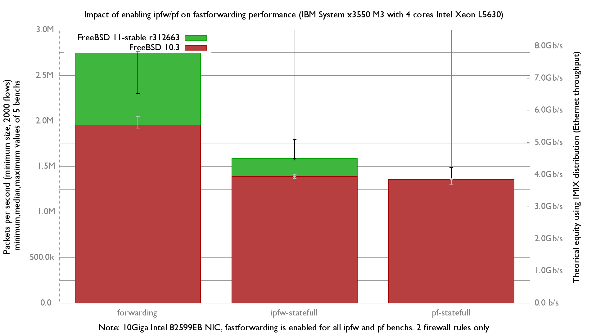
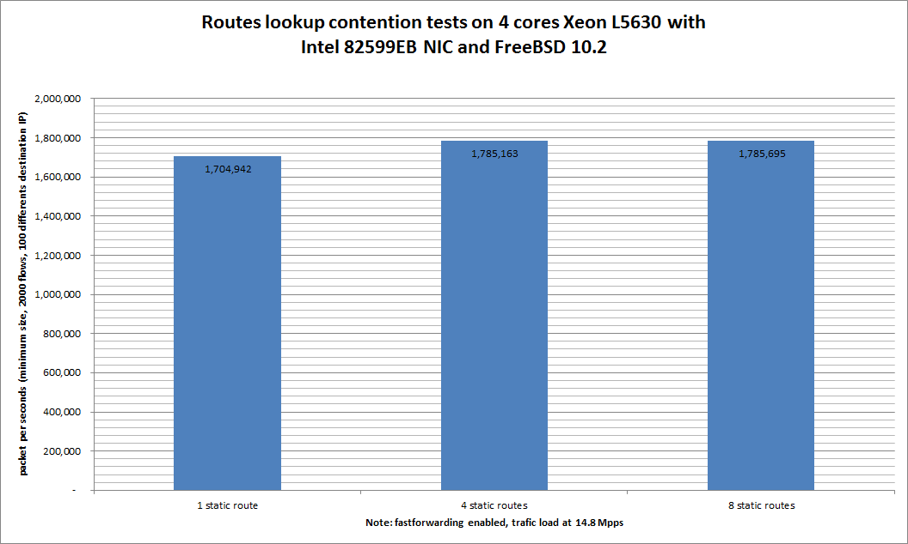

## Bench lab

### Hardware detail

This lab tests an [IBM System x3550 M3](ibm-system-x3550-m3.md) with **quad** cores (Intel Xeon L5630 2.13 GHz, hyper-threading disabled), a dual-port Intel 82599EB 10-Gigabit, and OPT SFPs (SFP-10G-LR).

NIC details:

```
ix0@pci0:21:0:0:        class=0x020000 card=0x00038086 chip=0x10fb8086 rev=0x01 hdr=0x00
    vendor     = 'Intel Corporation'
    device     = '82599EB 10-Gigabit SFI/SFP+ Network Connection'
    class      = network
    subclass   = ethernet
    bar   [10] = type Prefetchable Memory, range 64, base 0xfbe80000, size 524288, enabled
    bar   [18] = type I/O Port, range 32, base 0x2020, size 32, enabled
    bar   [20] = type Prefetchable Memory, range 64, base 0xfbf04000, size 16384, enabled
    cap 01[40] = powerspec 3  supports D0 D3  current D0
    cap 05[50] = MSI supports 1 message, 64 bit, vector masks
    cap 11[70] = MSI-X supports 64 messages, enabled
                 Table in map 0x20[0x0], PBA in map 0x20[0x2000]
    cap 10[a0] = PCI-Express 2 endpoint max data 256(512) FLR link x8(x8)
                 speed 5.0(5.0) ASPM disabled(L0s)
    ecap 0001[100] = AER 1 0 fatal 0 non-fatal 1 corrected
    ecap 0003[140] = Serial 1 90e2baffff842038
    ecap 000e[150] = ARI 1
    ecap 0010[160] = SR-IOV 1 IOV disabled, Memory Space disabled, ARI disabled
                     0 VFs configured out of 64 supported
                     First VF RID Offset 0x0180, VF RID Stride 0x0002
                     VF Device ID 0x10ed
                     Page Sizes: 4096 (enabled), 8192, 65536, 262144, 1048576, 4194304
```

### Lab set-up

The lab is detailed here: [Setting up a forwarding performance benchmark lab](setting-up-a-forwarding-performance-benchmark-lab.md).

#### Diagram

```
+------------------------------------------+ +-------+ +------------------------------+
|        Device under test                 | |Juniper| | Packet generator & receiver  |
|                                          | |  QFX  | |                              |
|                ix0: 198.18.0.1/24        |=|   <   |=| vcxl0: 198.18.0.110/24       |
|                      2001:2::1/64        | |       | |        2001:2::110/64        |
|                      (90:e2:ba:84:20:38) | |       | |        (00:07:43:2e:e4:72)   |
|                                          | |       | |                              |
|                ix1: 198.19.0.1/24        |=|   >   |=| vcxl1: 198.19.0.110/24       |
|                      2001:2:0:8000::1/64 | |       | |        2001:2:0:8000::110/64 |
|                      (90:e2:ba:84:20:39) | +-------+ |        (00:07:43:2e:e4:7a)   |
|                                          |           |                              |
|            static routes                 |           |                              |
| 192.18.0.0/16      => 198.18.0.110       |           |                              |
| 192.19.0.0/16      => 198.19.0.110       |           |                              |
| 2001:2::/49        => 2001:2::110        |           |                              |
| 2001:2:0:8000::/49 => 2001:2:0:8000::110 |           |                              |
|                                          |           |                              |
|        static arp and ndp                |           | /boot/loader.conf:           |
| 198.18.0.110        => 00:07:43:2e:e4:72 |           |      hw.cxgbe.num_vis=2      |
| 2001:2::110                              |           |                              |
|                                          |           |                              |
| 198.19.0.110        => 00:07:43:2e:e4:7a |           |                              |
| 2001:2:0:8000::110                       |           |                              |
+------------------------------------------+           +------------------------------+
```

The generator **MUST** generate lots of small IP flows (multiple source/destination IP addresses and/or UDP src/dst ports).

Here is an example for generating 2000 IPv4 flows (100 destination IP addresses x 20 source IP addresses) with a Chelsio NIC:

```
pkt-gen -i vcxl0 -f tx -n 1000000000 -l 60 -d 198.19.10.1:2000-198.19.10.100 -D 90:e2:ba:84:20:38 -s 198.18.10.1:2000-198.18.10.20 -w 4 -p 2
```

And the same with IPv6 flows (minimum frame size of 62 here):

```
pkt-gen -f tx -i vcxl0 -n 1000000000 -l 62 -6 -d "[2001:2:0:8010::1]-[2001:2:0:8010::64]" -D 90:e2:ba:84:20:38 -s "[2001:2:0:10::1]-[2001:2:0:10::14]" -S 00:07:43:2e:e4:72 -w 4 -p 2
```


!!! warning
    This version of pkt-gen has been improved with IPv6 support, software checksum, and optional unit normalization. See [BSDRP's patch to netmap pkt-gen](https://raw.githubusercontent.com/ocochard/BSDRP/master/BSDRPcur/patches/freebsd.pkt-gen.ae-ipv6.patch).

The receiver will use this command:

```
pkt-gen -i vcxl1 -f rx -w 4
```

\</code\>

### Basic configuration

#### Disabling Ethernet flow control

First, disable Ethernet flow control on both servers:

```
echo "dev.ix.0.fc=0" >> /etc/sysctl.conf
echo "dev.ix.1.fc=0" >> /etc/sysctl.conf
```

#### Enabling unsupported SFP

Because we are using a non-Intel SFP:

```
mount -uw /
echo 'hw.ix.unsupported_sfp="1"' >> /boot/loader.conf.local
mount -ur /
```

#### Disabling LRO and TSO

A router [should not use LRO and TSO](../technical-docs/performance.md). BSDRP disables them by default via an RC script (`disablelrotso_enable="YES"` in `/etc/rc.conf.misc`).

On a standard FreeBSD:

```
ifconfig ix0 -tso4 -tso6 -lro
ifconfig ix1 -tso4 -tso6 -lro
```

#### IP configuration on DUT

```
# IPv4 router
gateway_enable="YES"
static_routes="generator receiver"
route_generator="-net 198.18.0.0/16 198.18.0.110"
route_receiver="-net 198.19.0.0/16 198.19.0.110"
ifconfig_ix0="inet 198.18.0.1/24 -tso4 -tso6 -lro"
ifconfig_ix1="inet 198.19.0.1/24 -tso4 -tso6 -lro"
static_arp_pairs="HPvcxl0 HPvcxl1"
static_arp_HPvcxl0="198.18.0.110 00:07:43:2e:e4:72"
static_arp_HPvcxl1="198.19.0.110 00:07:43:2e:e4:7a"

# IPv6 router
ipv6_gateway_enable="YES"
ipv6_activate_all_interfaces="YES"
ipv6_static_routes="generator receiver"
ipv6_route_generator="2001:2:: -prefixlen 49 2001:2::110"
ipv6_route_receiver="2001:2:0:8000:: -prefixlen 49 2001:2:0:8000::110"
ifconfig_ix0_ipv6="inet6 2001:2::1 prefixlen 64"
ifconfig_ix1_ipv6="inet6 2001:2:0:8000::1 prefixlen 64"
static_ndp_pairs="HPvcxl0 HPvcxl1"
static_ndp_HPvcxl0="2001:2::110 00:07:43:2e:e4:72"
static_ndp_HPvcxl1="2001:2:0:8000::110 00:07:43:2e:e4:7a"
```

## Routing performance with default BSDRP value

### Default fast-forwarding performance in front of a line-rate generator

Behavior in front of a multi-flow traffic generator at line rate 14.8 Mpps (thanks Chelsio!), netstat on the DUT reports:

You can't enter any command on the DUT during the load: all 4 cores are overloaded.

On the receiver, only 2.8 Mpps are received (and therefore forwarded):

```
242.851700 main_thread [2277] 2870783 pps (2873654 pkts 1379353920 bps in 1001000 usec) 17.79 avg_batch 3584 min_space
243.853699 main_thread [2277] 2869423 pps (2875162 pkts 1380077760 bps in 1002000 usec) 17.77 avg_batch 1956 min_space
244.854700 main_thread [2277] 2870532 pps (2873403 pkts 1379233440 bps in 1001000 usec) 17.78 avg_batch 2022 min_space
245.855699 main_thread [2277] 2872424 pps (2875296 pkts 1380142080 bps in 1001000 usec) 17.79 avg_batch 1949 min_space
246.856699 main_thread [2277] 2871882 pps (2874754 pkts 1379881920 bps in 1001000 usec) 17.79 avg_batch 3584 min_space
247.857699 main_thread [2277] 2871047 pps (2873918 pkts 1379480640 bps in 1001000 usec) 17.78 avg_batch 3584 min_space
248.858700 main_thread [2277] 2870945 pps (2873816 pkts 1379431680 bps in 1001000 usec) 17.79 avg_batch 1792 min_space
249.859699 main_thread [2277] 2870647 pps (2873518 pkts 1379288640 bps in 1001000 usec) 17.78 avg_batch 1959 min_space
250.860699 main_thread [2277] 2870222 pps (2873092 pkts 1379084160 bps in 1001000 usec) 17.78 avg_batch 1956 min_space
251.861699 main_thread [2277] 2870311 pps (2873178 pkts 1379125440 bps in 1000999 usec) 17.78 avg_batch 1792 min_space
252.862699 main_thread [2277] 2870795 pps (2873669 pkts 1379361120 bps in 1001001 usec) 17.78 avg_batch 2024 min_space
```

The traffic is correctly load-balanced across each queue:

```
[root@DUT]~# sysctl dev.ix.0. | grep rx_packet
dev.ix.0.queue3.rx_packets: 143762837
dev.ix.0.queue2.rx_packets: 141867655
dev.ix.0.queue1.rx_packets: 140704642
dev.ix.0.queue0.rx_packets: 139301732
[root@R1]~# sysctl dev.ix.1. | grep tx_packet
dev.ix.1.queue3.tx_packets: 143762837
dev.ix.1.queue2.tx_packets: 141867655
dev.ix.1.queue1.tx_packets: 140704643
dev.ix.1.queue0.tx_packets: 139301734
```

Where does the system spend this time?

```
[root@DUT]~# kldload hwpmc
[root@DUT]~# pmcstat -TS instructions -w1

PMC: [INSTR_RETIRED_ANY] Samples: 99530 (100.0%) , 0 unresolved

%SAMP IMAGE      FUNCTION             CALLERS
  6.5 kernel     ixgbe_rxeof          ixgbe_msix_que
  5.8 kernel     bzero                m_pkthdr_init:1.7 ip_tryforward:1.5 ip_findroute:1.4 fib4_lookup_nh_basic:1.3
  5.1 kernel     ixgbe_xmit           ixgbe_mq_start_locked
  3.7 kernel     ixgbe_mq_start       ether_output
  2.8 kernel     rn_match             fib4_lookup_nh_basic
  2.7 kernel     _rw_runlock_cookie   fib4_lookup_nh_basic:2.0 arpresolve:0.8
  2.7 kernel     ip_tryforward        ip_input
  2.6 kernel     ether_nh_input       netisr_dispatch_src
  2.6 kernel     bounce_bus_dmamap_lo bus_dmamap_load_mbuf_sg
  2.6 kernel     uma_zalloc_arg       ixgbe_rxeof
  2.6 kernel     _rm_rlock            in_localip
  2.4 kernel     netisr_dispatch_src  ether_demux:1.7 ether_input:0.7
  2.3 libc.so.7  bsearch              0x63ac
  2.2 kernel     ether_output         ip_tryforward
  2.2 kernel     ip_input             netisr_dispatch_src
  2.1 kernel     uma_zfree_arg        m_freem
  2.1 kernel     fib4_lookup_nh_basic ip_findroute
  1.9 kernel     __rw_rlock           arpresolve:1.3 fib4_lookup_nh_basic:0.6
  1.8 kernel     bus_dmamap_load_mbuf ixgbe_xmit
  1.7 kernel     bcopy                arpresolve
  1.6 kernel     m_adj                ether_demux
  1.5 kernel     memcpy               ether_output
  1.5 kernel     arpresolve           ether_output
  1.5 kernel     _mtx_trylock_flags_  ixgbe_mq_start
  1.4 kernel     mb_ctor_mbuf         uma_zalloc_arg
  1.4 kernel     ixgbe_txeof          ixgbe_msix_que
  1.3 pmcstat    0x63f0               bsearch
  1.1 pmcstat    0x63e3               bsearch
  1.0 kernel     ixgbe_refresh_mbufs  ixgbe_rxeof
  1.0 kernel     in_localip           ip_tryforward
  1.0 kernel     random_harvest_queue ether_nh_input
  0.9 kernel     bcmp                 ether_nh_input
  0.8 kernel     cpu_search_lowest    cpu_search_lowest
  0.8 kernel     mac_ifnet_check_tran ether_output
  0.8 kernel     critical_exit        uma_zalloc_arg
  0.7 kernel     critical_enter
  0.7 kernel     ixgbe_mq_start_locke ixgbe_mq_start
  0.6 kernel     mac_ifnet_create_mbu ether_nh_input
  0.6 kernel     ether_demux          ether_nh_input
  0.5 kernel     m_freem              ixgbe_txeof
  0.5 kernel     ipsec4_capability    ip_input
```

###### \> Time spent in ixgbe_rxeof

### Equilibrium throughput

The previous methodology, generating 14.8 Mpps, is like testing the DUT under a denial-of-service attack. Try another methodology known as [equilibrium throughput](setting-up-a-vpn-ipsec-gre-etc-performance-benchmark-lab.md).

From the pkt-generator, start an estimation of the equilibrium throughput, starting at 4 Mpps:

```
[root@pkt-gen]~# equilibrium -d 90:e2:ba:84:20:38 -p -l 4000 -t vcxl0 -r vcxl1
Benchmark tool using equilibrium throughput method
- Benchmark mode: Throughput (pps) for Router
- UDP load = 18B, IPv4 packet size=46B, Ethernet frame size=60B
- Link rate = 4000 Kpps
- Tolerance = 0.01
Iteration 1
  - Offering load = 2000 Kpps
  - Step = 1000 Kpps
  - Measured forwarding rate = 1999 Kpps
Iteration 2
  - Offering load = 3000 Kpps
  - Step = 1000 Kpps
  - Trend = increasing
  - Measured forwarding rate = 2949 Kpps
Iteration 3
  - Offering load = 2500 Kpps
  - Step = 500 Kpps
  - Trend = decreasing
  - Measured forwarding rate = 2499 Kpps
Iteration 4
  - Offering load = 2750 Kpps
  - Step = 250 Kpps
  - Trend = increasing
  - Measured forwarding rate = 2750 Kpps
Iteration 5
  - Offering load = 2875 Kpps
  - Step = 125 Kpps
  - Trend = increasing
  - Measured forwarding rate = 2875 Kpps
Iteration 6
  - Offering load = 2937 Kpps
  - Step = 62 Kpps
  - Trend = increasing
  - Measured forwarding rate = 2933 Kpps
Iteration 7
  - Offering load = 2968 Kpps
  - Step = 31 Kpps
  - Trend = increasing
  - Measured forwarding rate = 2948 Kpps
Estimated Equilibrium Ethernet throughput= 2948 Kpps (maximum value seen: 2949 Kpps)
```

###### \> Same results with the equilibrium method: 2.9 Mpps.

### Firewall impact

One rule for each firewall and 2000 UDP "sessions"; more information is available in the [GigaEthernet performance lab](forwarding-performance-lab-of-an-ibm-system-x3550-m3-with-intel-82580.md#firewall-impact).

[Full configuration sets, scripts and results](https://github.com/ocochard/netbenchs/tree/master/Xeon_L5630-4Cores-Intel_82599EB/fastforwarding-pf-ipfw).



## Routing performance with multiple static routes

FreeBSD has a route lookup contention problem. This setup uses only one static route (192.19.0.0/8) toward the traffic receiver.

By splitting this single route into 4 or 8, we should get better results.

This benchmark method uses 100 different destination IP addresses (from 198.19.10.1 to 198.19.10.100), then repeats the benchmark with 4 static routes:

1.  198.19.10.0/27 (0 to 31)
2.  198.19.10.32/27 (32 to 63)
3.  198.19.10.64/27 (64 to 95)
4.  198.19.10.96/27 (96 to 127)

then with 8 routes:

```
-198.19.10.0/28
-198.19.10.16/28
-198.19.10.32/28
-198.19.10.48/28
-198.19.10.64/28
-198.19.10.80/28
-198.19.10.96/28
-198.19.10.112/28
```

Configuration examples:

```
sysrc static_routes="generator receiver1 receiver2 receiver3 receiver4"
sysrc route_generator="-net 198.18.0.0/16 198.18.2.2"
sysrc -x route_receiver
sysrc route_receiver1="-net 198.19.10.0/27 198.19.2.2"
sysrc route_receiver2="-net 198.19.10.32/27 198.19.2.2"
sysrc route_receiver3="-net 198.19.10.64/27 198.19.2.2"
sysrc route_receiver4="-net 198.19.10.96/27 198.19.2.2"
```

### Graphs



###### \> A small 4% increase from using 4 static routes instead of 1, and 5% with 8 routes.

### Ministat

```
x pps.one-route
+ pps.four-routes
* pps.eight-routes
+--------------------------------------------------------------------------+
|                   *                                                      |
|                   *                                                      |
|   x      x   + +  *         x           x                   +  +       **|
||_________M______A________________|                                       |
|         |_________M_______________A________________________|             |
|           |_______M____________________A_____________________________|   |
+--------------------------------------------------------------------------+
    N           Min           Max        Median           Avg        Stddev
x   5       1639912       1984116       1704942     1769454.2     154632.18
+   5       1737180       2194547       1785163     1927662.8     229585.57
No difference proven at 95.0% confidence
*   5       1782648       2273933       1785695     1978219.6     266278.12
No difference proven at 95.0% confidence
```
