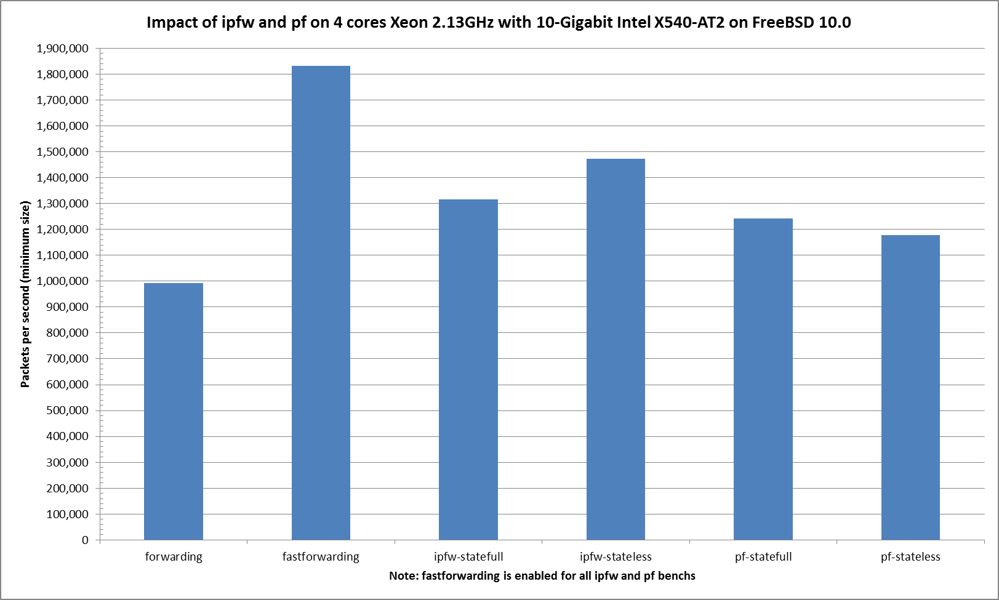

## Hardware detail

This lab will test an [IBM System x3550 M3](ibm-system-x3550-m3.md) with **quad** cores (Intel Xeon L5630 2.13GHz, hyper-threading disabled) and a dual port Intel 10-Gigabit X540-AT2 connected to the PCI-Express Bus.

## Lab set-up

The lab is detailed here: [Setting up a forwarding performance benchmark lab](setting-up-a-forwarding-performance-benchmark-lab.md).

BSDRP-amd64 v1.51 (FreeBSD 10.0-BETA2 with autotune mbuf patch) is used on the DUT.

### Diagram

```
+-----------------------------------+      +----------------------------------+
|   Packet generator and receiver   |      |         Device under Test        |
|                                   |      |                                  |
| ix0: 8.8.8.1 (a0:36:9f:1e:1e:d8)  |=====>| ix0: 8.8.8.2 (a0:36:9f:1e:28:14) |
|      2001:db8:8::1                |      |      2001:db8:8::2               |
|                                   |      |                                  |
| ix1: 9.9.9.1 (a0:36:9f:1e:1e:da)  |<=====| ix1: 9.9.9.2 (a0:36:9f:1e:28:16) |
|      2001:db8:9::1                |      |      2001:db8:9::2               |
|                                   |      |                                  |
|                                   |      |        static routes             |
|                                   |      |      8.0.0.0/8 => 8.8.8.1        |
|                                   |      |      9.0.0.0/8 => 9.9.9.1        |
|                                   |      | 2001:db8:8:://48 =>2001:db8:8::1 |
|                                   |      | 2001:db8:9:://48 =>2001:db8:9::1 |
+-----------------------------------+      +----------------------------------+
```

The generator **MUST** generate lot’s of smallest IP flows (multiple source/destination IP addresses and/or UDP src/dst port).

Here is an example for generating 2000 flows (100 different source IP * 20 different destination IP):

```
pkt-gen -i ix0 -f tx -n 1000000000 -l 60 -d 9.1.1.1:2000-9.1.1.100 -D a0:36:9f:1e:28:14 -s 8.1.1.1:2000-8.1.1.20 -w 4
```


!!! warning
    Netmap disable hardware checksum on Intel NIC, you need to use a FreeBSD -head with svn revision of 257758 minimum with the[pkt-gen software-checksum patch](https://bugs.freebsd.org/bugzilla/show_bug.cgiid=187149) for using multiple src/dst IP or port with netmap’s pkt-gen.
 Receiver will use this command:

```
pkt-gen -i ix1 -f rx -w 4
```

## Basic configuration

### Disabling Ethernet flow-control

First, disable Ethernet flow-control on both servers:

```
echo "dev.ix.0.fc=0" >> /etc/sysctl.conf
echo "dev.ix.1.fc=0" >> /etc/sysctl.conf
```

### Disabling LRO and TSO

A router [should not use LRO and TSO](../technical-docs/performance.md). BSDRP disable by default using a RC script (disablelrotso_enable=“YES” in /etc/rc.conf.misc).

But on a standard FreeBSD:

```
ifconfig ix0 -tso4 -tso6 -lro
ifconfig ix1 -tso4 -tso6 -lro
```

### Static routes and ARP entries on R2

Configure static routes:

```
sysrc static_routes="generator receiver"
sysrc route_generator="-net 8.0.0.0/8 8.8.8.1"
sysrc route_receiver="-net 9.0.0.0/8 9.9.9.1"
sysrc ipv6_static_routes="generator6 receiver6"
sysrc ipv6_route_generator6="2001:db8:8:: -prefixlen 48 2001:db8:8::1"
sysrc ipv6_route_receiver6="2001:db8:9:: -prefixlen 48 2001:db8:9::1"
```

And configure IP and static ARP:

```
sysrc ifconfig_ix0="inet 8.8.8.2/24"
sysrc ifconfig_ix0_ipv6: inet6 2001:db8:8::2/64"
sysrc ifconfig_ix1="inet 9.9.9.2/24"
sysrc ifconfig_ix1_ipv6="inet6 2001:db8:9::2/64"
sysrc static_arp_pairs="receiver generator"
sysrc static_arp_generator="8.8.8.1 a0:36:9f:1e:1e:d8"
sysrc static_arp_receiver="9.9.9.1 a0:36:9f:1e:1e:da"
```

## Default fast-forwarding speed

With the default parameters, on multi-flow traffic generated at 11.2Mpps (Still not the maximum rate for TenGigaEthernet), only 1.9Mpps are correctly fastforwarded (net.inet.ip.fastforwarding=1) :

```
[root@BSDRP]~# netstat -i -w 1
            input        (Total)           output
   packets  errs idrops      bytes    packets  errs      bytes colls
   1931633     0 9558401  735323650    1971679     0  126647094     0
   2049258     0 9516754  740226434    1965107     0  125766966     0
   1946547     0 9692656  744907458    1965995     0  124906742     0
   1913194     0 9440293  726623426    1970761     0  127045814     0
   1924563     0 9592938  737119810    1934317     0  123369462     0
   2001106     0 9424437  731234754    1996780     0  127781814     0
   1896250     0 9379690  721660098    1924252     0  123591286     0
   2038251     0 9705660  751610370    2019568     0  129251638     0
   1982645     0 9534029  737066690    1935758     0  123888758     0
   1974464     0 9391036  727392450    1934258     0  123793014     0
   2056212     0 9616053  747024962    2008803     0  128251766     0
   1884989     0 9545113  731526594    1961394     0  125841590     0
```

The traffic is correctly load-balanced between NIC-queue/CPU binding:

```
[root@BSDRP]~# vmstat -i | grep ix
irq258: ix0:que 0                9046464       3558
irq259: ix0:que 1                1923385        756
irq260: ix0:que 2                2926703       1151
irq261: ix0:que 3                2911272       1145
irq262: ix0:link                      80          0
irq263: ix1:que 0               16871267       6637
irq264: ix1:que 1               16992617       6684
irq265: ix1:que 2               16634663       6543
irq266: ix1:que 3               18708007       7359
irq267: ix1:link                    4618          1

[root@BSDRP]~# top -nCHSIzs1
last pid:  3483;  load averages:  7.77,  7.75,  6.52  up 0+00:42:45    16:33:41
156 processes: 13 running, 97 sleeping, 46 waiting

Mem: 14M Active, 10M Inact, 553M Wired, 9856K Buf, 15G Free
Swap:

  PID USERNAME PRI NICE   SIZE    RES STATE   C   TIME     CPU COMMAND
   11 root     -92    -     0K   816K WAIT    0  12:32  50.20% intr{irq258: ix0:que }
   11 root     -92    -     0K   816K CPU3    3  12:01  48.29% intr{irq261: ix0:que }
   11 root     -92    -     0K   816K WAIT    2  11:33  47.46% intr{irq260: ix0:que }
    0 root     -92    0     0K   560K CPU1    1  11:27  46.97% kernel{ix0 que}
   11 root     -92    -     0K   816K CPU1    1  11:23  46.88% intr{irq259: ix0:que }
    0 root     -92    0     0K   560K CPU0    0  11:15  46.58% kernel{ix0 que}
    0 root     -92    0     0K   560K CPU2    2  11:19  45.26% kernel{ix0 que}
    0 root     -92    0     0K   560K -       0  10:12  41.80% kernel{ix0 que}
   11 root     -92    -     0K   816K RUN     0   1:05   4.49% intr{irq263: ix1:que }
   11 root     -92    -     0K   816K WAIT    2   1:06   4.05% intr{irq265: ix1:que }
   11 root     -92    -     0K   816K RUN     3   1:07   3.76% intr{irq266: ix1:que }
   11 root     -92    -     0K   816K RUN     1   1:04   3.76% intr{irq264: ix1:que }
```

## ixgbe(4) tunning

#### rx_process_limit and tx_process_limit

What are the impact of modifying these limit on PPS?

```
x [r|t]x_process_limit=256(default)
+ [r|t]x_process_limit=512
* [r|t]x_process_limit=-1(nolimit)
+--------------------------------------------------------------------------------+
|*   ++ * x+                x                          *    * *   *             *|
||______M__A_________|                                                           |
|  |__A___|                                                                      |
|                                                      |______M__A________|      |
+--------------------------------------------------------------------------------+
    N           Min           Max        Median           Avg        Stddev
x   5       1656772       1786725       1690620     1704710.4     48677.407
+   5       1657620       1703418       1679787     1681153.8     17459.489
No difference proven at 95.0% confidence
*   5       1918159       2036665       1950208       1963257     44988.621
Difference at 95.0% confidence
        258547 +/- 68356.2
        15.1666% +/- 4.00984%
        (Student's t, pooled s = 46869.3)
```

#### hw.ix.rxd and hw.ix.txd

What are the impact of modifying these limit on PPS?

```
x hw.ix.[r|t]xd=1024
+ hw.ix.[r|t]xd=2048
* hw.ix.[r|t]xd=4096
+--------------------------------------------------------------------------------+
|+  *                         +  *        +x     ** *         *      x     *  x  |
|                                      |____________________A________M__________||
|         |______________________M__A__________________________|                 |
|                    |_____________________A______M_______________|              |
+--------------------------------------------------------------------------------+
    N           Min           Max        Median           Avg        Stddev
x   5       1937832       2018222       2002526     1985231.6     35961.532
+   5       1881470       2011917       1937898     1943572.2     46782.722
No difference proven at 95.0% confidence
*   5       1886620       1989850       1968491       1956497     40190.155
No difference proven at 95.0% confidence
```

=\> No difference

## Firewall impact

One rule for each firewall and 2000 UDP “sessions”, more information on the [GigaEthernet performance lab](forwarding-performance-lab-of-an-ibm-system-x3550-m3-with-intel-82580.md#firewall-impact).

### Graphs



Some translation of pps to throughput using [IMIX distribution](https://en.wikipedia.org/wiki/Internet_Mix):

|         |                                    |
|---------|------------------------------------|
| pps     | Estimated Ethernet IMIX throughput |
| 1817242 | 5 Gb/s                             |
| 1228265 | 3,48 Gb/s                          |

Formula used: PPS * ( 7*(40+14) + 4*(576+14) + (1500+14) )/12*8

### Ministat

```
x pps.fastforwarding
+ pps.ipfw-statefull
* pps.ipfw-stateless
% pps.pf-statefull
# pps.pf-stateless
+--------------------------------------------------------------------------------------------------+
|#       %#      #     ##%+  %%  +++    +         ** **                             x x      xx   x|
|                                                                                    |_____A_M___| |
|                            |____A____|                                                           |
|                                                 |MA_|                                            |
|              |_______A_M______|                                                                  |
|     |________A_M_______|                                                                         |
+--------------------------------------------------------------------------------------------------+
    N           Min           Max        Median           Avg        Stddev
x   5       1757512       1878484       1831427     1817242.2     50508.309
+   5       1252803       1375092       1317166     1317730.8     43593.803
Difference at 95.0% confidence
        -499511 +/- 68806.3
        -27.4873% +/- 3.7863%
        (Student's t, pooled s = 47177.9)
*   5       1459371       1499079       1472287       1475569     15847.379
Difference at 95.0% confidence
        -341673 +/- 54591.6
        -18.8017% +/- 3.00409%
        (Student's t, pooled s = 37431.5)
%   5       1102319       1287297       1243125     1228264.6     74117.825
Difference at 95.0% confidence
        -588978 +/- 92496.4
        -32.4105% +/- 5.08993%
        (Student's t, pooled s = 63421.4)
#   5       1033602       1237700       1177189     1158090.8      84687.18
Difference at 95.0% confidence
        -659151 +/- 101689
        -36.2721% +/- 5.5958%
        (Student's t, pooled s = 69724.5)
```
