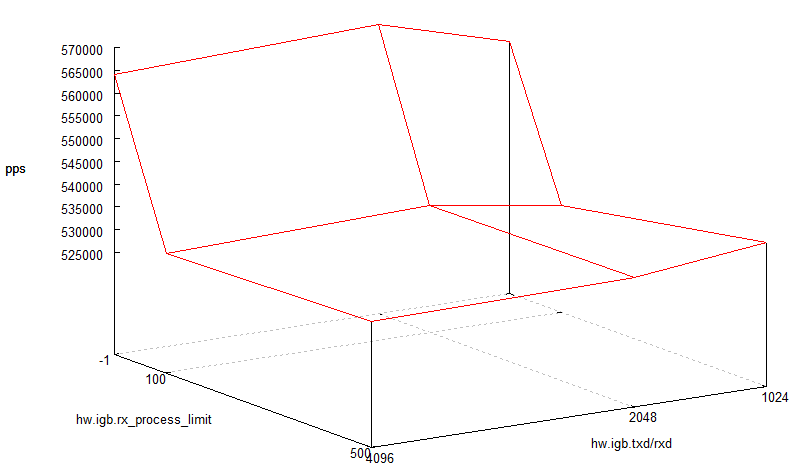
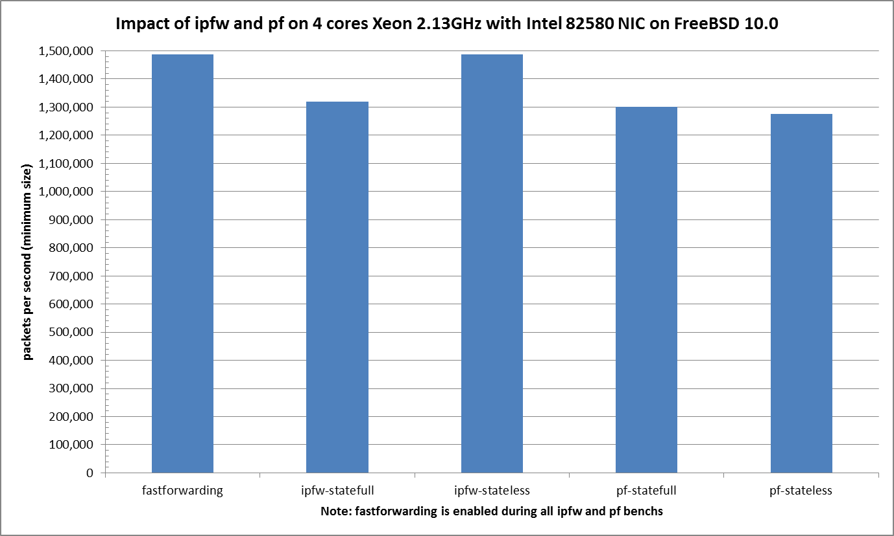

## Hardware detail

This lab will test an [IBM System x3550 M3](ibm-system-x3550-m3.md) with **quad** cores (Intel Xeon L5630 2.13GHz, hyper-threading disabled) and a quad NIC 82580 connected to the PCI-Express Bus.

## Lab set-up

The lab is detailed here: [Setting up a forwarding performance benchmark lab](setting-up-a-forwarding-performance-benchmark-lab.md).

BSDRP-amd64 v1.51 (FreeBSD 10.0-BETA2 with autotune mbuf patch) is used on the DUT.

### Diagram

```
+------------------------------------------+ +--------+ +------------------------------+
|        Device under test                 | | Cisco  | | Packet generator & receiver  |
|                                          | |Catalyst| |                              |
|                igb2: 198.18.0.203/24     |=|   <    |=| igb1:  198.18.0.201/24       |
|                      2001:2::203/64      | |        | |        2001:2::201/64        |
|                      (00:1b:21:c4:95:7a) | |        | |        (0c:c4:7a:da:3c:11)   |
|                                          | |        | |                              |
|                igb3: 198.19.0.203/24     |=|   >    |=| igb2:  198.19.0.201/24       |
|                    2001:2:0:8000::203/64 | |        | |        2001:2:0:8000::201/64 |
|                    (00:1b:21:c4:95:7b)   | +--------+ |        (0c:c4:7a:da:3c:12)   |
|                                          |            |                              |
|            static routes                 |            |                              |
| 192.18.0.0/16      => 198.18.0.208       |            |                              |
| 192.19.0.0/16      => 198.19.0.208       |            |                              |
| 2001:2::/49        => 2001:2::208        |            |                              |
| 2001:2:0:8000::/49 => 2001:2:0:8000::208 |            |                              |
|                                          |            |                              |
|        static arp and ndp                |            |                              |
| 198.18.0.208        => 0c:c4:7a:da:3c:11 |            |                              |
| 2001:2::208                              |            |                              |
|                                          |            |                              |
| 198.19.0.208        => 0c:c4:7a:da:3c:12 |            |                              |
| 2001:2:0:8000::208                       |            |                              |
+------------------------------------------+            +------------------------------+
```

The generator **MUST** generate lot’s of smallest IP flows (multiple source/destination IP addresses and/or UDP src/dst port).

Here is an example for generating about 2000 flows:

```
pkt-gen -N -f tx -i igb1 -n 1000000000 -4 -d 198.19.10.1:2000-198.19.10.100 -D 00:1b:21:c4:95:7a -s 198.18.10.1:2000-198.18.10.20 -S 0c:c4:7a:da:3c:11 -w 4 -l 60 -U
```

Receiver will use this command:

```
pkt-gen -N -f rx -i igb2 -w 4
```

## Basic configuration

### Disabling Ethernet flow-control

First, disable Ethernet flow-control:

```
echo "dev.igb.2.fc=0" >> /etc/sysctl.conf
echo "dev.igb.3.fc=0" >> /etc/sysctl.conf
sysctl dev.igb.2.fc=0
sysctl dev.igb.3.fc=0
```

### IP Configuration

Configure IP addresses, static routes and static ARP entries.

A router [should not use LRO and TSO](../technical-docs/performance.md). BSDRP disable by default using a RC script (disablelrotso_enable=“YES” in /etc/rc.conf.misc).

```
sysrc static_routes="generator receiver"
sysrc route_generator="-net 1.0.0.0/8 1.1.1.1"
sysrc route_receiver="-net 2.0.0.0/8 2.2.2.3"
sysrc ifconfig_igb2="inet 1.1.1.2/24 -tso4 -tso6 -lro"
sysrc ifconfig_igb3="inet 2.2.2.2/24 -tso4 -tso6 -lro"
sysrc static_arp_pairs="receiver generator"
sysrc static_arp_generator="1.1.1.1 00:1b:21:d4:3f:2a"
sysrc static_arp_receiver="2.2.2.3 00:1b:21:c4:95:7b"
```

## Default forwarding speed

With the default parameters, multi-flow traffic at 1.488Mpps (the maximum rate for GigaEthernet) are correctly forwarded without any loss:

```
[root@BSDRP]~# netstat -iw 1
            input        (Total)           output
   packets  errs idrops      bytes    packets  errs      bytes colls
   1511778     0     0   91524540    1508774     0   54260514     0
   1437061     0     0   87010506    1433981     0   51628556     0
   1492392     0     0   90363066    1489107     0   53551190     0
   1435098     0     0   86919666    1432911     0   51403100     0
   1486627     0     0   90015126    1483984     0   53323802     0
   1435217     0     0   86898126    1432679     0   51498188     0
   1486694     0     0   90017226    1483725     0   53324978     0
   1488248     0     0   90106326    1485331     0   53360930     0
   1437796     0     0   87084606    1435594     0   51504950     0
```

The traffic is correctly load-balanced between NIC-queue/CPU binding:

```
[root@BSDRP]# vmstat -i | grep igb
irq278: igb2:que 0            2759545998      95334
irq279: igb2:que 1            2587966938      89406
irq280: igb2:que 2            2589102074      89445
irq281: igb2:que 3            2598239184      89761
irq282: igb2:link                      2          0
irq283: igb3:que 0            3318777087     114654
irq284: igb3:que 1            3098055250     107028
irq285: igb3:que 2            3101570541     107150
irq286: igb3:que 3            3052431966     105452
irq287: igb3:link                      2          0

[root@BSDRP]/# top -nCHSIzs1
last pid:  8292;  load averages:  5.38,  1.70,  0.65  up 0+10:38:54    13:08:33
153 processes: 12 running, 97 sleeping, 44 waiting

Mem: 2212K Active, 24M Inact, 244M Wired, 18M Buf, 15G Free
Swap: 

  PID USERNAME PRI NICE   SIZE    RES STATE   C   TIME     CPU COMMAND
   11 root     -92    -     0K   816K WAIT    0 218:26  85.25% intr{irq278: igb2:que}
   11 root     -92    -     0K   816K CPU1    1 296:18  84.77% intr{irq279: igb2:que}
   11 root     -92    -     0K   816K RUN     2 298:15  84.67% intr{irq280: igb2:que}
   11 root     -92    -     0K   816K CPU3    3 294:53  84.18% intr{irq281: igb2:que}
   11 root     -92    -     0K   816K RUN     3  67:46  16.46% intr{irq286: igb3:que}
   11 root     -92    -     0K   816K RUN     2  70:27  16.06% intr{irq285: igb3:que}
   11 root     -92    -     0K   816K RUN     1  68:36  15.97% intr{irq284: igb3:que}
   11 root     -92    -     0K   816K CPU0    0  59:39  15.28% intr{irq283: igb3:que}
```

## igb(4) drivers tunning with 82546GB

### Disabling multi-queue

For disabling multi-queue (this mean without IRQ load-sharing between CPUs), there are 2 methods:

The first method is to use pkt-gen for generating a one IP flow (same src/dst IP and same src/dst port) traffic like this:

```
pkt-gen -i igb2 -f tx -n 80000000 -l 42 -d 2.3.3.2 -D 00:1b:21:d3:8f:3e -s 1.3.3.3 -w 10
```

=\> With this method, igb(4) can’t do load-balancing input traffic and will use only one queue.

The second method is to disabling the multi-queue support of igb(4) drivers by forcing the usage of one queue:

```
mount -uw /
echo 'sysctl hw.igb.num_queues="1"' >> /boot/loader.conf.local
mount -ur /
reboot
```

And check on the dmesg or with number of IRQ assigned to the NIC that no multi-queue was enabled:

```
[root@BSDRP]~# grep 'igb[2-3]' /var/run/dmesg.boot 
igb2: <Intel(R) PRO/1000 Network Connection version - 2.4.0> mem 0x97a80000-0x97afffff,0x97c04000-0x97c07fff irq 39 at device 0.2 on pci26
igb2: Using MSIX interrupts with 2 vectors
igb2: Ethernet address: 00:1b:21:d3:8f:3e
001.000011 netmap_attach [2244] success for igb2
igb3: <Intel(R) PRO/1000 Network Connection version - 2.4.0> mem 0x97a00000-0x97a7ffff,0x97c00000-0x97c03fff irq 38 at device 0.3 on pci26
igb3: Using MSIX interrupts with 2 vectors
igb3: Ethernet address: 00:1b:21:d3:8f:3f
001.000012 netmap_attach [2244] success for igb3

[root@BSDRP]~# vmstat -i | grep igb
irq272: igb2:que 0                     8          0
irq273: igb2:link                      2          0
irq274: igb3:que 0              48517905      74757
irq275: igb3:link                      2          0
```

Using any of theses method, the result will be the same: forwarding speed will decrease (to about 700Kpps) corresponding to the maximum input rate (100% CPU usage of the unique CPU bound to input NIC IRQ).

```
[root@BSDRP]~# netstat -iw 1
            input        (Total)           output
   packets  errs idrops      bytes    packets  errs      bytes colls
    690541 797962     0   41432466     690541     0   29002910     0
    704171 797906     0   42250266     704174     0   29575322     0
    676522 797770     0   40591326     676519     0   28414022     0
    707373 797878     0   42442386     707376     0   29709848     0
    672983 797962     0   40378986     672981     0   28265426     0
    705339 797899     0   42320346     705336     0   29624378     0
    684930 798049     0   41095806     684934     0   28767200     0
[root@bsdrp2]~# top -nCHSIzs1
last pid:  2930;  load averages:  1.44,  0.94,  0.50  up 0+00:08:21    13:29:11
129 processes: 8 running, 84 sleeping, 37 waiting

Mem: 13M Active, 8856K Inact, 203M Wired, 9748K Buf, 15G Free
Swap: 

  PID USERNAME PRI NICE   SIZE    RES STATE   C   TIME     CPU COMMAND
   11 root     -92    -     0K   624K CPU2    2   0:00 100.00% intr{irq272: igb2:que}
   11 root     -92    -     0K   624K CPU0    0   0:54  24.37% intr{irq274: igb3:que}
    0 root     -92    0     0K   368K CPU1    1   0:17   5.66% kernel{igb3 que}
```

### hw.igb.rx_process_limit and hw.igb.txd/rxd

What are the impact of modifying hw.igb.rx_process_limit and hw.igb.txd/rxd sysctls on the igb(4) performance ?

We need to overload this NIC for this test, this meaning using this NIC without multi-queue.

#### graphical result

Here are the results of one-flow paquet per seconds peformance with differents values:



#### Ministat graphs

##### txd/rxd fixed at 1024, rx_process_limit variable

```
x xd1024.proc_lim-1
+ xd1024.proc_lim100
* xd1024.proc_lim500
+----------------------------------------------------------------------------------------------+
|*    +        +    ++   *      +  * *      *                    x            x          x    x|
|                                                                     |_______M__A__________|  |
|        |_________AM_______|                                                                  |
|           |_______________A______M_________|                                                 |
+----------------------------------------------------------------------------------------------+
    N           Min           Max        Median           Avg        Stddev
x   5        550723        566775        558124      559487.2     6199.8641
+   5        517990        532364        526037        525182     5268.8787
Difference at 95.0% confidence
        -34305.2 +/- 8390.76
        -6.13154% +/- 1.49972%
        (Student's t, pooled s = 5753.23)
*   5        515348        539060        534270      530501.6       9292.18
Difference at 95.0% confidence
        -28985.6 +/- 11520
        -5.18074% +/- 2.05903%
        (Student's t, pooled s = 7898.83)
```

##### txd/rxd fixed at 2048, rx_process_limit variable

```
x xd2048.proc_lim-1
+ xd2048.proc_lim100
* xd2048.proc_lim500
+----------------------------------------------------------------------------------------------+
|+**    +*     +*  +      *                                                         x x   x   x|
|                                                                                    |___AM__| |
||______MA_______|                                                                             |
||_______M_A_________|                                                                         |
+----------------------------------------------------------------------------------------------+
    N           Min           Max        Median           Avg        Stddev
x   5        563660        568029        566189      565768.2     1721.5844
+   5        527496        535493        530494      531057.4     3465.0161
Difference at 95.0% confidence
        -34710.8 +/- 3990.14
        -6.13516% +/- 0.70526%
        (Student's t, pooled s = 2735.89)
*   5        527807        538259        530987      531871.8     4288.4826
Difference at 95.0% confidence
        -33896.4 +/- 4765.66
        -5.99122% +/- 0.842335%
        (Student's t, pooled s = 3267.64)
```

##### txd/rxd fixed at 4096, rx_process_limit variable

```
x xd4096.proc_lim-1
+ xd4096.proc_lim100
* xd4096.proc_lim500
+----------------------------------------------------------------------------------------------+
|                *                                                                             |
|                *                                                                             |
|+         +  + +*   **  +                                           x         x         x  x  |
|                                                                         |_________A____M____||
|    |________A_______|                                                                        |
|               |M_A_|                                                                         |
+----------------------------------------------------------------------------------------------+
    N           Min           Max        Median           Avg        Stddev
x   5        555002        565784        564089      562047.8     4646.4517
+   5        522545        533819        528932      528506.4      4088.621
Difference at 95.0% confidence
        -33541.4 +/- 6382.78
        -5.96771% +/- 1.13563%
        (Student's t, pooled s = 4376.43)
*   5        530026        532361        530327        530970     1102.3525
Difference at 95.0% confidence
        -31077.8 +/- 4924.78
        -5.52939% +/- 0.87622%
        (Student's t, pooled s = 3376.74)
```

## Firewall impact

Multi-queue is re-enabled for this test, and best value from the previous tests used:

- hw.igb.rxd=2048
- hw.igb.txd=2048
- hw.igb.rx_process_limit=-1 (disabled)
- hw.igb.num_queues=0 (automatically based on number of CPUs and max supported MSI-X messages = 4 on this lab hardware)

This test will generate 2000 different flows by using 2000 different UDP destination ports:

```
pkt-gen -i igb2 -f tx -l 42 -d 2.3.3.1:2000-2.3.3.1:4000 -D 00:1b:21:d3:8f:3e -s 1.3.3.1 -w 10
```

### IPFW

#### Stateless

Now we will test the impact of enabling simple stateless IPFW rules:

```
cat > /etc/ipfw.rules <<'EOF'
#!/bin/sh
fwcmd="/sbin/ipfw"
# Flush out the list before we begin.
${fwcmd} -f flush
${fwcmd} add 3000 allow ip from any to any
'EOF'

sysrc firewall_enable="YES"
sysrc firewall_script="/etc/ipfw.rules"
```

#### Statefull

Now we will test the impact of enabling simple statefull IPFW rules:

```
cat > /etc/ipfw.rules <<'EOF'
#!/bin/sh
fwcmd="/sbin/ipfw"
# Flush out the list before we begin.
${fwcmd} -f flush
${fwcmd} add 3000 allow ip from any to any keep-state
'EOF'

service ipfw restart
```

### PF

#### Stateless

Now we will test the impact of enabling simple stateless PF rules:

```
cat >/etc/pf.conf <<'EOF'
set skip on lo0
pass no state
'EOF'

sysrc pf_enable="YES"
```

#### Statefull

Now we will test the impact of enabling simple statefull PF rules:

```
cat >/etc/pf.conf <<'EOF'
set skip on lo0
pass
'EOF'

sysrc pf_enable="YES"
```

### Results

#### Graph

scale information: 1.488Mpps is the maximum paquet-per-second rate for GigaEthernet.



#### ministat

```
x pps.fastforwarding
+ pps.ipfw-stateless
* pps.ipfw-statefull
% pps.pf-stateless
# pps.pf-statefull
+------------------------------------------------------------------------------------------------+
|%  %%%  %  # #O   # * * #             *     *                                                  *|
|                                                                                               A|
|                                                                                               A|
|               |______M_____A___________|                                                       |
| |__A__|                                                                                        |
|           |__M_A____|                                                                          |
+------------------------------------------------------------------------------------------------+
    N           Min           Max        Median           Avg        Stddev
x   5       1488140       1488142       1488142     1488141.2     1.0955343
+   5       1488140       1488142       1488141       1488141    0.70710678
No difference proven at 95.0% confidence
*   5       1299942       1369446       1319923     1331666.2     29281.162
Difference at 95.0% confidence
        -156475 +/- 30196.9
        -10.5148% +/- 2.02917%
        (Student's t, pooled s = 20704.9)
%   5       1267869       1287061       1276235       1277154     6914.3127
Difference at 95.0% confidence
        -210987 +/- 7130.55
        -14.1779% +/- 0.479158%
        (Student's t, pooled s = 4889.16)
#   5       1294193       1324502       1300015     1304887.8     12265.529
Difference at 95.0% confidence
        -183253 +/- 12649.1
        -12.3142% +/- 0.849995%
        (Student's t, pooled s = 8673.04)
```
