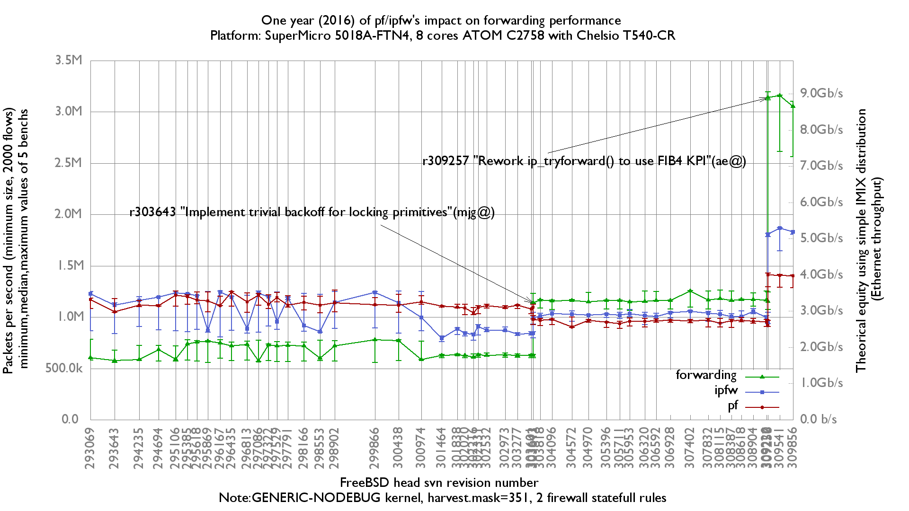

## Concepts

This article presents the method used to spot performance regressions during the evolution of FreeBSD code (across different SVN revisions).

Here is an example of a final bench graph measuring the impact on forwarding performance: 

The method follows these steps:

1.  A lab of one or more servers is set up. [In this example, two servers were used](forwarding-performance-lab-of-a-hp-proliant-dl360p-gen8-with-10-gigabit-with-10-gigabit-chelsio-t540-cr.md): one traffic generator/receiver and one device under test (DUT).
2.  A [BSDRP sub-project folder is created](https://github.com/ocochard/BSDRP/tree/master/TESTING). This project configures a minimal (for fast compilation) nanobsd image.
3.  A first [script generates many nanobsd images from a list of FreeBSD SVN revision numbers](https://github.com/ocochard/BSDRP/blob/master/tools/bisection-gen.sh).
4.  [Different configuration sets to be tested are created](https://github.com/ocochard/netbenches/tree/master/Xeon_E5-2697Av4_16Cores-Mellanox_ConnectX-4/firewalls/configs). The example uses three tests: one with forwarding, a second with a minimal ipfw configuration, and a third with a minimal pf configuration.
5.  A second [script runs the tests and collects data](https://github.com/ocochard/netbenches/blob/master/scripts/bench-lab.sh) (by sending SSH commands to the lab servers). The order is:
    1.  Upgrade the server to the nanobsd release to be tested.
    2.  Upload the configuration set to be tested (in this example: forwarding-only, ipfw, or pf) and reboot the DUT.
    3.  Start the bench test and collect the result.
    4.  Reboot the DUT.
    5.  Loop 5 times (for usable [ministat](http://www.freebsd.org/cgi/man.cgiquery=ministat) data).
    6.  Loop to the next configuration set.
    7.  Loop to the next nanobsd release.
6.  [A third script filters the raw output of each test](https://github.com/ocochard/netbenches/blob/master/scripts/bench-lab-ministat.sh) (heavily dependent on the tool used during the bench) and generates synthesis data files for each revision-number/configuration-set pair.

## Physical lab

The physical lab used by BSDRP targets forwarding network speed. It is composed of a minimum of 3 servers and 1 switch, and a maximum of 4 servers and 2 switches. Common to all these setups:

- The controller server that runs the bench script.
- The admin switch (used to send SSH commands).

Specific:

- One server with a netmap-compatible NIC, used as packet generator/receiver.
- One server as the DUT.
- For network crypto (IPsec, OpenVPN) benchmarks, a reference server.
- A dedicated switch ([configured to avoid polluting packet counters](setting-up-a-forwarding-performance-benchmark-lab.md#switch-configuration)). Useful for cross-checking NIC driver statistics against the switch statistics.

### Two-node lab examples

#### Simplest lab

This simple lab is great for benchmarking 10-Gigabit performance without needing a 10-Gigabit switch:


#### With-switch lab

This simple lab is useful for cross-checking NIC statistics counters against switch statistics counters:


### Three-node lab example

This is the setup used for a VPN benchmark:


## Generating FreeBSD nanobsd images

The goal is to generate BSDRP nanobsd images from a list of FreeBSD SVN revision numbers.

You need to [download the BSDRP source code](../technical-docs.md#getting-the-bsdrp-source-code) on a FreeBSD machine.

Then create or customize a BSDRP project to get a small image: remove as many [FreeBSD options](http://svnweb.freebsd.org/base/head/tools/build/options/) as possible and no ports, to improve image-generation speed. The BSDRP [TESTING project](https://github.com/ocochard/BSDRP/tree/master/TESTING) is a good example.

Take care with the kernel configuration file: the head branch can impose kernel configuration parameters that are incompatible between different code revisions. The best way to avoid this is to start the kernel configuration with `include GENERIC` and add or remove unwanted parts (`nooptions XXX`, `nodevice XXX`). See the [kernel configuration file used for the BSDRP regression bench lab](https://github.com/ocochard/BSDRP/blob/master/TESTING/kernels/amd64) for an example.

Once your BSDRP bench project is ready, edit the script [tools/bisection-gen.sh](https://github.com/ocochard/BSDRP/blob/master/tools/bisection-gen.sh) to adapt the project basic configuration (PROJECT name, CONSOLE type, ARCH) and fill in all SVN revision numbers (SVN_REV_LIST). Then start the image-generation script (from the top-level directory of the BSDRP source code):

```
root@dev:/usr/local/BSDRP # mkdir -p /root/benchs/nanobsd
root@dev:/usr/local/BSDRP # tools/bisection-gen.sh /root/benchs/nanobsd
Building image matching revision 257506...done
Building image matching revision 257657...done
Building image matching revision 257715...done
All images were put in /root/benchs/nanobsd
```

At the end, you will find all the nanobsd images in the chosen directory.

An example of final images generated is available here: <http://dev.bsdrp.net/benchs/265145-274745/nanobsd.images/>

## Configuration sets

Creating different configuration sets is straightforward: create a main folder and, inside it, a subfolder for each configuration set.

Each configuration-set folder holds the configuration files that override default parameters.

Here is a simple example from the [igb NIC driver tuning benchmarks](forwarding-performance-lab-of-an-ibm-system-x3550-m3-with-intel-82580.md#igb4-driver-tuning-with-82546gb) where different parameters in `/boot/loader.conf.local` were tested.

We want 3 configuration sets:

- First, called `xd1024.proc_lim-1`
- Second, called `xd2048.proc_lim-1`
- Third, called `xd4096.proc_lim-1`

<!-- -->

```
mkdir -p /root/benchs/configurations/xd1024.proc_lim-1/boot
cat > /root/benchs/configurations/xd1024.proc_lim-1/boot/loader.conf.local <<EOF
hw.igb.rxd="1024"
hw.igb.txd="1024"
hw.igb.rx_process_limit="-1"
EOF
mkdir -p /root/benchs/configurations/xd2048.proc_lim-1/boot
cat > /root/benchs/configurations/xd2048.proc_lim-1/boot/loader.conf.local <<EOF
hw.igb.rxd="2048"
hw.igb.txd="2048"
hw.igb.rx_process_limit="-1"
EOF
mkdir -p /root/benchs/configurations/xd4096.proc_lim-1/boot
cat > /root/benchs/configurations/xd4096.proc_lim-1/boot/loader.conf.local <<EOF
hw.igb.rxd="4096"
hw.igb.txd="4096"
hw.igb.rx_process_limit="-1"
EOF
```

## Testing lab

Start by configuring all servers and the DUT with the configuration parameters common to all configuration sets (remember that files in the configuration sets will completely overwrite existing files). Install your SSH public key on each server so the bench script can connect to them automatically.

There are two example bench-lab configuration files:

- [bench-lab-2nodes.config](https://github.com/ocochard/netbenches/blob/master/AMD_GX-412TC_4Cores_Intel_i210AT/bench-lab-2nodes.config)
- [bench-lab-3nodes.config](https://github.com/ocochard/netbenches/blob/master/AMD_GX-412TC_4Cores_Intel_i210AT/bench-lab-3nodes.pkt.config)

Put all the IP addresses, test command lines, etc., for your bench test into one of these files.

Then run [bench-lab.sh](https://github.com/ocochard/netbenches/blob/master/scripts/bench-lab.sh) with some parameters:

```
./bench-lab.sh -f bench-lab-parameters-file -c configuration-sets-dir -i nanobsd-images-dir -n iteration -d benchs-results-dir -r my@email.org
```

And here is an example:

```
olivier@lame4:~/netbenches/Xeon_E5-2650-8Cores-Chelsio_T540-CR % ../scripts/bench-lab.sh -f bench-lab-2nodes.config -i /root/images.2017/ -c forwarding-pf-ipfw/config
s/ -p ../pktgen.configs/dualstack-2k/ -d forwarding-pf-ipfw/results/fbsd.2017/ -r olivier@FreeBSD.org
BSDRP automatized upgrade/configuration-sets/benchs script

This script will start 210 bench tests using:
 - Multiples images to test: yes
 - Multiples configuration-sets to test: yes
 - Multiples pkt-gen configuration to test: yes
 - Number of iteration for each set: 5
 - Results dir: forwarding-pf-ipfw/results/fbsd.2017/

Do you want to continue ? (y/n): y
Testing ICMP connectivity to each devices:
  192.168.1.8...OK
  192.168.1.8...OK
  192.168.1.10...OK
Testing SSH connectivity with key to each devices:
  192.168.1.8...OK
  192.168.1.8...OK
  192.168.1.10...OK
Starting the benchs
Start firmware image set: /root/images.2017//BSDRP-311014-upgrade-amd64-serial.img.xz
Upgrading...done
Rebooting 192.168.1.10 and waiting device return online...done
Start configuration set: forwarding
Uploading cfg forwarding-pf-ipfw/configs//forwarding to 192.168.1.10
Rebooting 192.168.1.10 and waiting device return online...done
Start pkt-gen set: ../pktgen.configs/dualstack-2k//inet4
Start bench serie bench.311014.forwarding.inet4.1
Waiting for end of bench 1/210...done
Rebooting 192.168.1.10 and waiting device return online...done
Start bench serie bench.311014.forwarding.inet4.2
Waiting for end of bench 2/210...done
Rebooting 192.168.1.10 and waiting device return online...done
Start bench serie bench.311014.forwarding.inet4.3
Waiting for end of bench 3/210...done
Rebooting 192.168.1.10 and waiting device return online...done
Start bench serie bench.311014.forwarding.inet4.4
Waiting for end of bench 4/210...done
Rebooting 192.168.1.10 and waiting device return online...done
Start bench serie bench.311014.forwarding.inet4.5
Waiting for end of bench 5/210...done
Rebooting 192.168.1.10 and waiting device return online...done
Start pkt-gen set: ../pktgen.configs/dualstack-2k//inet6
Start bench serie bench.311014.forwarding.inet6.1
Waiting for end of bench 6/210...done
Rebooting 192.168.1.10 and waiting device return online...done
Start bench serie bench.311014.forwarding.inet6.2
Waiting for end of bench 7/210...done
Rebooting 192.168.1.10 and waiting device return online...done
Start bench serie bench.311014.forwarding.inet6.3
Waiting for end of bench 8/210...done
Rebooting 192.168.1.10 and waiting device return online...done
Start bench serie bench.311014.forwarding.inet6.4
Waiting for end of bench 9/210...done
Rebooting 192.168.1.10 and waiting device return online...done
Start bench serie bench.311014.forwarding.inet6.5
Waiting for end of bench 10/210...done
Rebooting 192.168.1.10 and waiting device return online...done
Start configuration set: ipfw-statefull
Uploading cfg forwarding-pf-ipfw/configs//ipfw-statefull to 192.168.1.10
Rebooting 192.168.1.10 and waiting device return online...done
...
Rebooting DUT and waiting device return online...done
Waiting for end of bench 209/210...done
Rebooting DUT and waiting device return online...done
Waiting for end of bench 210/210...done
All bench tests were done, results in forwarding-pf-ipfw/results/fbsd.2017/
```

## Results generation

Once the bench has finished, there are many raw result files named like this:

- `bench.NANOBSD-SVN.CONFIGURATION-SETS.info`: summary information about the nanobsd image and configuration-set name used.
- `bench.NANOBSD-SVN.CONFIGURATION-SETS.ITERATION.receiver`: raw output of the SSH session on the receiver.
- `bench.NANOBSD-SVN.CONFIGURATION-SETS.ITERATION.sender`: raw output of the SSH session on the sender.

Here is [an example of these raw results](https://github.com/ocochard/netbenches/blob/master/AMD_GX-412TC_4Cores_Intel_i210AT/bench-lab-2nodes.config).

These raw results, closely tied to the bench tool used, need to be filtered (and synthesized) into a usable data file.

BSDRP uses the script [bench-lab-ministat.sh](https://github.com/ocochard/netbenches/blob/master/scripts/bench-lab-ministat.sh) to filter netmap pkt-gen output with a first pass of ministat and generate a list of files named `SVN-REV.CONFIG-SETS-NAME` containing N lines of results (where N = number of test iterations) and a `gnuplot.data` file.
