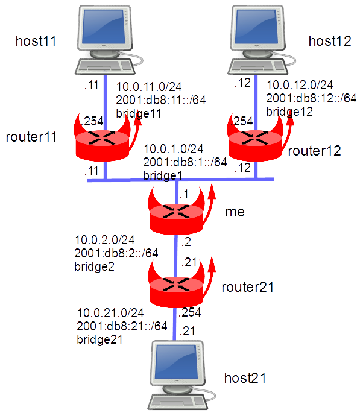

This lab show an jail/vnet based diagram used for testing BSDRP’s [graphpath](https://github.com/ocochard/graphpath).

## Presentation

[graphpath](https://github.com/ocochard/graphpath) generates an ASCII network diagram of the path, view from the host, from a source toward a destination IP address.

For testing this tools, we need to create a network with a topology allowing all graphpath use cases.

### Network diagram



## Setting-up the lab

### Downloading BSD Router Project images

Download BSDRP serial image (prevent to have to use an X display) on Sourceforge.

### Download Lab scripts

More information on these BSDRP lab scripts available on [How to build a BSDRP router lab](how-to-build-a-bsdrp-router-lab.md).

Start the lab with only one router, example with bhyve under FreeBSD:

```
user:~ # tools/BSDRP-lab-bhyve.sh -i /usr/obj/BSDRPstable.amd64/BSDRP-1.801-full-amd64-serial.img.xz
BSD Router Project (http://bsdrp.net) - bhyve full-meshed lab script
Setting-up a virtual lab with 1 VM(s):
- Working directory: /tmp/BSDRP
- Each VM has 1 core(s) and 512M RAM
- Emulated NIC: virtio-net
- Switch mode: bridge + tap
- 1 LAN(s) between all VM
- Full mesh Ethernet links between each VM
VM 1 have the following NIC:
- vtnet0 connected to LAN number 1
For connecting to VM'serial console, you can use:
- VM 1 : cu -l /dev/nmdm1B
```

## Network setup

From BSDRP, you can configure all these with only one command line:

```
labconfig graphpath
```

### Host (me)

```
sysrc hostname="me"
sysrc cloned_interfaces="bridge1 bridge2 bridge11 bridge12 bridge21"
sysrc ifconfig_bridge1="inet 10.0.1.1/24"
sysrc ifconfig_bridge1_ipv6="inet6 2001:db8:1::1 prefixlen 64"
sysrc ifconfig_bridge2="inet 10.0.2.1/24"
sysrc ifconfig_bridge2_ipv6="inet6 2001:db8:2::1 prefixlen 64"
sysrc ifconfig_bridge11="up"
sysrc ifconfig_bridge12="up"
sysrc ifconfig_bridge21="up"
sysrc static_routes="host11 host12 host21"
sysrc route_host11="-net 10.0.11.0/24 10.0.1.11"
sysrc route_host12="-net 10.0.12.0/24 10.0.1.12"
sysrc route_host21="-net 10.0.21.0/24 10.0.2.21"
sysrc ipv6_static_routes="host11 host12 host21"
sysrc ipv6_route_host11="2001:db8:11:: -prefixlen 64 2001:db8:1::11"
sysrc ipv6_route_host12="2001:db8:12:: -prefixlen 64 2001:db8:1::12"
sysrc ipv6_route_host21="2001:db8:21:: -prefixlen 64 2001:db8:2::21"
hostname me
service netif restart
service routing restart
```

### Jail host11

host11 is configured as a simple host:

```
tenant -c -j host11 -i bridge11
cat > /etc/jails/host11/rc.conf <<EOF
hostname="host11"
ifconfig_epair111b="inet 10.0.11.11/24"
ifconfig_epair111b_ipv6="inet6 2001:db8:11::11 prefixlen 64"
defaultrouter="10.0.11.254"
ipv6_defaultrouter="2001:db8:11::254"
EOF
```

### Jail host12

host12 is configured as a simple host:

```
tenant -c -j host12 -i bridge12
cat > /etc/jails/host12/rc.conf <<EOF
hostname="host12"
ifconfig_epair212b="inet 10.0.12.12/24"
ifconfig_epair212b_ipv6="inet6 2001:db8:12::12 prefixlen 64"
defaultrouter="10.0.12.254"
ipv6_defaultrouter="2001:db8:12::254"
EOF
```

### Jail router11

router11 is configured as a router:

```
tenant -c -j router11 -i bridge1,bridge11
cat > /etc/jails/router11/rc.conf <<EOF
hostname="router11"
gateway_enable=YES
ipv6_gateway_enable=YES
ifconfig_epair31b="inet 10.0.1.11/24"
ifconfig_epair31b_ipv6="inet6 2001:db8:1::11 prefixlen 64"
ifconfig_epair311b="inet 10.0.11.254/24"
ifconfig_epair311b_ipv6="inet6 2001:db8:11::254 prefixlen 64"
defaultrouter="10.0.1.1"
ipv6_defaultrouter="2001:db8:1::1"
EOF
```

### Jail router12

router12 is configured as a router:

```
tenant -c -j router12 -i bridge1,bridge12
cat > /etc/jails/router12/rc.conf <<EOF
hostname=router12
gateway_enable=YES
ipv6_gateway_enable=YES
ifconfig_epair41b="inet 10.0.1.12/24"
ifconfig_epair41b_ipv6="inet6 2001:db8:1::12 prefixlen 64"
ifconfig_epair412b="inet 10.0.12.254/24"
ifconfig_epair412b_ipv6="inet6 2001:db8:12::254 prefixlen 64"
defaultrouter="10.0.1.1"
ipv6_defaultrouter="2001:db8:1::1"
EOF
```

### Jail router21

router21 is configured as a router:

```
tenant -c -j router21 -i bridge2,bridge21
cat > /etc/jails/router21/rc.conf <<EOF
hostname="router21"
gateway_enable=YES
ipv6_gateway_enable=YES
ifconfig_epair52b="inet 10.0.2.21/24"
ifconfig_epair52b_ipv6="inet6 2001:db8:2::21 prefixlen 64"
ifconfig_epair521b="inet 10.0.21.254/24"
ifconfig_epair521b_ipv6="inet6 2001:db8:21::254 prefixlen 64"
defaultrouter="10.0.2.1"
ipv6_defaultrouter="2001:db8:2::1"
EOF
```

### Jail host21

host21 is configured as a simple host:

```
tenant -c -j host21 -i bridge21
cat > /etc/jails/host21/rc.conf <<EOF
hostname="host21"
ifconfig_epair621b="inet 10.0.21.21/24"
ifconfig_epair621b_ipv6="inet6 2001:db8:21::21 prefixlen 64"
defaultrouter="10.0.21.254"
ipv6_defaultrouter="2001:db8:21::254"
EOF
```

### Start the jails

```
[root@me]~# service jail start
Starting jails:epair111a: Ethernet address: 02:ff:c0:00:09:0a
epair111b: Ethernet address: 02:00:90:00:0a:0b
epair212a: Ethernet address: 02:ff:c0:00:0b:0a
epair212b: Ethernet address: 02:00:90:00:0c:0b
epair31a: Ethernet address: 02:ff:c0:00:0a:0a
epair31b: Ethernet address: 02:00:90:00:0d:0b
epair41a: Ethernet address: 02:ff:c0:00:0c:0a
epair41b: Ethernet address: 02:00:90:00:0e:0b
epair311a: Ethernet address: 02:ff:c0:00:0f:0a
epair311b: Ethernet address: 02:00:90:00:10:0b
epair52a: Ethernet address: 02:ff:c0:00:11:0a
epair52b: Ethernet address: 02:00:90:00:12:0b
epair412a: Ethernet address: 02:ff:c0:00:13:0a
epair412b: Ethernet address: 02:00:90:00:14:0b
epair621a: Ethernet address: 02:ff:c0:00:0d:0a
epair621b: Ethernet address: 02:00:90:00:10:0b
epair521a: Ethernet address: 02:ff:c0:00:15:0a
epair521b: Ethernet address: 02:00:90:00:16:0b
 host11 host12 host21 router21 router11 router12.
```

And test host11 can reach host21:

```
[root@me]~# jexec host11 traceroute 10.0.21.21
traceroute to 10.0.21.21 (10.0.21.21), 64 hops max, 40 byte packets
 1  10.0.11.254 (10.0.11.254)  0.055 ms  0.051 ms  0.039 ms
 2  10.0.1.1 (10.0.1.1)  0.043 ms  0.048 ms  0.041 ms
 3  10.0.2.21 (10.0.2.21)  0.044 ms  0.056 ms  0.043 ms
 4  10.0.21.21 (10.0.21.21)  0.047 ms  0.052 ms  0.045 ms
[root@me]~# jexec host11 traceroute6 2001:db8:21::21
traceroute6 to 2001:db8:21::21 (2001:db8:21::21) from 2001:db8:11::11, 64 hops max, 20 byte packets
 1  2001:db8:11::254  0.127 ms  0.103 ms  0.091 ms
 2  2001:db8:1::1  0.101 ms  0.106 ms  0.094 ms
 3  2001:db8:2::21  0.139 ms  0.108 ms  0.098 ms
 4  2001:db8:21::21  0.159 ms  0.112 ms  0.102 ms
```

## Testing graphpath

Now, from the main host, we should be able to generate some ASCII network diagrams:

### Inet4

```
[root@me]~# ping -c 1 10.0.11.11
[root@me]~# ping -c 1 10.0.12.12
[root@me]~# ping -c 1 10.0.21.21
[root@me]~# graphpath 10.0.11.11 10.0.12.12
+-----------------------------+  +-----------------------------+
| SOURCE HOST                 |  | DESTINATION HOST            |
| IP:   10.0.11.11            |  | IP:   10.0.12.12            |
+-----------------------------+  +-----------------------------+
              |                            |
+-----------------------------+  +-----------------------------+
| ROUTER TOWARDS SOURCE       |  | ROUTER TOWARDS DESTINATION  |
| IP:   10.0.1.11             |  | IP:   10.0.1.12             |
| ARP:  02:01:6c:01:b0:03     |  | ARP:  02:01:6c:01:b0:04     |
+-----------------------------+  +-----------------------------+
              |                            |
            --+---+------------------------+---
                  |
+-----------------------------+
| IF:   bridge1               |
| MAC:  02:e7:49:ed:fc:01     |
| IP:   10.0.1.1              |
| net:  10.0.11.0             |
| mask: 255.255.255.0         |
|                             |
|         THIS ROUTER         |
+-----------------------------+

[root@me]~# graphpath 10.0.11.11 10.0.21.21
+-----------------------------+
| SOURCE HOST                 |
| IP:   10.0.11.11            |
+-----------------------------+
              |
+-----------------------------+
| ROUTER TOWARDS SOURCE       |
| IP:   10.0.1.11             |
| ARP:  02:01:6c:01:b0:03     |
+-----------------------------+
              |
+-----------------------------+
| IF:   bridge1               |
| MAC:  02:e7:49:ed:fc:01     |
| IP:   10.0.1.1              |
| net:  10.0.11.0             |
| mask: 255.255.255.0         |
|                             |
|         THIS ROUTER         |
|                             |
| net:  10.0.21.0             |
| mask: 255.255.255.0         |
| IP:   10.0.2.1              |
| MAC:  02:e7:49:ed:fc:02     |
| IF:   bridge2               |
+-----------------------------+
              |
+-----------------------------+
| ROUTER TOWARDS DESTINATION  |
| IP:   10.0.2.21             |
| ARP:  02:02:6c:01:b0:05     |
+-----------------------------+
              |
+-----------------------------+
| DESTINATION HOST            |
| IP:   10.0.21.21            |
+-----------------------------+

[root@me]~# graphpath 10.0.11.11 10.0.1.12
+-----------------------------+  +-----------------------------+
| SOURCE HOST                 |  | DESTINATION HOST            |
| IP:   10.0.11.11            |  | IP:   10.0.1.12             |
|                             |  | ARP:  02:01:6c:01:b0:04     |
+-----------------------------+  +-----------------------------+
              |                            |
+-----------------------------+            |
| ROUTER TOWARDS SOURCE       |            |
| IP:   10.0.1.11             |            |
| ARP:  02:01:6c:01:b0:03     |            |
+-----------------------------+            |
              |                            |
            --+---+------------------------+---
                  |
+-----------------------------+
| IF:   bridge1               |
| MAC:  02:e7:49:ed:fc:01     |
| IP:   10.0.1.1              |
| net:  10.0.11.0             |
| mask: 255.255.255.0         |
|                             |
|         THIS ROUTER         |
+-----------------------------+

[root@me]~#  graphpath 10.0.1.12 10.0.11.11
+-----------------------------+  +-----------------------------+
| SOURCE HOST                 |  | DESTINATION HOST            |
| IP:   10.0.1.12             |  | IP:   10.0.11.11            |
| ARP:  02:01:c9:01:b0:04     |  |                             |
+-----------------------------+  +-----------------------------+
              |                            |
              |                  +-----------------------------+
              |                  | ROUTER TOWARDS DESTINATION  |
              |                  | IP:   10.0.1.11             |
              |                  | ARP:  02:01:c9:01:b0:03     |
              |                  +-----------------------------+
              |                            |
            --+---+------------------------+---
                  |
+-----------------------------+
| IF:   bridge1               |
| MAC:  02:de:f2:41:54:01     |
| IP:   10.0.1.1              |
| net:  10.0.1.0              |
| mask: 255.255.255.0         |
|                             |
|         THIS ROUTER         |
+-----------------------------+
```

### Inet6

```
[root@me]~# ping6 -c 1 2001:db8:11::11
[root@me]~# ping6 -c 1 2001:db8:12::12
[root@me]~# ping6 -c 1 2001:db8:21::21
[root@me]~# graphpath 2001:db8:11::11 2001:db8:12::12
+---------------------------------------------------+  +---------------------------------------------------+
| SOURCE HOST                                       |  | DESTINATION HOST                                  |
| IP:   2001:db8:11::11                             |  | IP:   2001:db8:12::12                             |
+---------------------------------------------------+  +---------------------------------------------------+
                         |                                                  |
+---------------------------------------------------+  +---------------------------------------------------+
| ROUTER TOWARDS SOURCE                             |  | ROUTER TOWARDS DESTINATION                        |
| IP:   2001:db8:1::11                              |  | IP:   2001:db8:1::12                              |
| NDP:  02:01:c9:01:b0:03                           |  | NDP:  02:01:c9:01:b0:04                           |
+---------------------------------------------------+  +---------------------------------------------------+
                         |                                                  |
                       --+---+----------------------------------------------+---
                             |
+---------------------------------------------------+
| IF:   bridge1                                     |
| MAC:  02:de:f2:41:54:01                           |
| IP:   2001:db8:1::1                               |
| net:  2001:db8:11::                               |
| mask: ffff:ffff:ffff:ffff::                       |
|                                                   |
|                    THIS ROUTER                    |
+---------------------------------------------------+

[root@me]~# graphpath 2001:db8:11::11 2001:db8:21::21
+---------------------------------------------------+
| SOURCE HOST                                       |
| IP:   2001:db8:11::11                             |
+---------------------------------------------------+
                         |
+---------------------------------------------------+
| ROUTER TOWARDS SOURCE                             |
| IP:   2001:db8:1::11                              |
| NDP:  02:01:c9:01:b0:03                           |
+---------------------------------------------------+
                         |
+---------------------------------------------------+
| IF:   bridge1                                     |
| MAC:  02:de:f2:41:54:01                           |
| IP:   2001:db8:1::1                               |
| net:  2001:db8:11::                               |
| mask: ffff:ffff:ffff:ffff::                       |
|                                                   |
|                    THIS ROUTER                    |
|                                                   |
| net:  2001:db8:21::                               |
| mask: ffff:ffff:ffff:ffff::                       |
| IP:   2001:db8:2::1                               |
| MAC:  02:de:f2:41:54:02                           |
| IF:   bridge2                                     |
+---------------------------------------------------+
                         |
+---------------------------------------------------+
| ROUTER TOWARDS DESTINATION                        |
| IP:   2001:db8:2::21                              |
| NDP:  02:02:c9:01:b0:05                           |
+---------------------------------------------------+

[root@me]~# graphpath 2001:db8:11::11 2001:db8:1::12
+---------------------------------------------------+  +---------------------------------------------------+
| SOURCE HOST                                       |  | DESTINATION HOST                                  |
| IP:   2001:db8:11::11                             |  | IP:   2001:db8:1::12                              |
|                                                   |  | NDP:  02:01:c9:01:b0:04                           |
+---------------------------------------------------+  +---------------------------------------------------+
                         |                                                  |
+---------------------------------------------------+                       |
| ROUTER TOWARDS SOURCE                             |                       |
| IP:   2001:db8:1::11                              |                       |
| NDP:  02:01:c9:01:b0:03                           |                       |
+---------------------------------------------------+                       |
                         |                                                  |
                       --+---+----------------------------------------------+---
                             |
+---------------------------------------------------+
| IF:   bridge1                                     |
| MAC:  02:de:f2:41:54:01                           |
| IP:   2001:db8:1::1                               |
| net:  2001:db8:11::                               |
| mask: ffff:ffff:ffff:ffff::                       |
|                                                   |
|                    THIS ROUTER                    |
+---------------------------------------------------+

[root@me]~# graphpath 2001:db8:1::12 2001:db8:11::11
+---------------------------------------------------+  +---------------------------------------------------+
| SOURCE HOST                                       |  | DESTINATION HOST                                  |
| IP:   2001:db8:1::12                              |  | IP:   2001:db8:11::11                             |
| NDP:  02:01:c9:01:b0:04                           |  |                                                   |
+---------------------------------------------------+  +---------------------------------------------------+
                         |                                                  |
                         |                             +---------------------------------------------------+
                         |                             | ROUTER TOWARDS DESTINATION                        |
                         |                             | IP:   2001:db8:1::11                              |
                         |                             | NDP:  02:01:c9:01:b0:03                           |
                         |                             +---------------------------------------------------+
                         |                                                  |
                       --+---+----------------------------------------------+---
                             |
+---------------------------------------------------+
| IF:   bridge1                                     |
| MAC:  02:de:f2:41:54:01                           |
| IP:   2001:db8:1::1                               |
| net:  2001:db8:1::                                |
| mask: ffff:ffff:ffff:ffff::                       |
|                                                   |
|                    THIS ROUTER                    |
+---------------------------------------------------+
```
