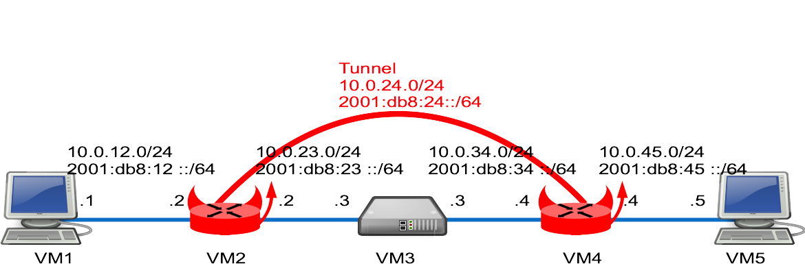

This lab shows some VPN examples with BSDRP 1.991.

## Overview

### Network diagram

Lab built following [How to build a BSDRP router lab](how-to-build-a-bsdrp-router-lab.md): 5 routers with full-meshed links.

Here is the logical and physical view:



### Download lab scripts

More information on the BSDRP lab scripts is available in [How to build a BSDRP router lab](how-to-build-a-bsdrp-router-lab.md).

Start the lab with 5 full-meshed routers. An example with bhyve on FreeBSD:

```
root@host:~ # /tools/BSDRP-lab-bhyve.sh -i BSDRP-1.8-full-amd64-serial.img.xz -n 5
vmm module not loaded. Loading it...
nmdm module not loaded. Loading it...
if_tap module not loaded. Loading it...
BSD Router Project (http://bsdrp.net) - bhyve full-meshed lab script
Setting-up a virtual lab with 5 VM(s):
- Working directory: /tmp/BSDRP
- Each VM have 1 core(s) and 256M RAM
- Emulated NIC: virtio-net
- Switch mode: bridge + tap
- 0 LAN(s) between all VM
- Full mesh Ethernet links between each VM
VM 1 have the following NIC:
- vtnet0 connected to VM 2
- vtnet1 connected to VM 3
- vtnet2 connected to VM 4
- vtnet3 connected to VM 5
VM 2 have the following NIC:
- vtnet0 connected to VM 1
- vtnet1 connected to VM 3
- vtnet2 connected to VM 4
- vtnet3 connected to VM 5
VM 3 have the following NIC:
- vtnet0 connected to VM 1
- vtnet1 connected to VM 2
- vtnet2 connected to VM 4
- vtnet3 connected to VM 5
VM 4 have the following NIC:
- vtnet0 connected to VM 1
- vtnet1 connected to VM 2
- vtnet2 connected to VM 3
- vtnet3 connected to VM 5
VM 5 have the following NIC:
- vtnet0 connected to VM 1
- vtnet1 connected to VM 2
- vtnet2 connected to VM 3
- vtnet3 connected to VM 4
For connecting to VM'serial console, you can use:
- VM 1 : cu -l /dev/nmdm1B
- VM 2 : cu -l /dev/nmdm2B
- VM 3 : cu -l /dev/nmdm3B
- VM 4 : cu -l /dev/nmdm4B
- VM 5 : cu -l /dev/nmdm5B
```

## Base router configuration

Router 1 and Router 5 are simple workstations; Router 3 is a simple router.

All these routers can be pre-configured with the labconfig tool (only use it in a lab, because it will replace your current running configuration):

```
labconfig vpn_vm[VM-NUMBER]
```

### Router 1

Router 1 is configured as a simple workstation.

```
sysrc hostname=VM1 \
 gateway_enable=NO \
 ipv6_gateway_enable=NO \
 ifconfig_em0="inet 10.0.12.1/24" \
 ifconfig_em0_ipv6="inet6 2001:db8:12::1 prefixlen 64" \
 defaultrouter=10.0.12.2 \
 ipv6_defaultrouter=2001:db8:12::2
ifconfig -l | grep -q vtnet && sed -i "" 's/em/vtnet/g' /etc/rc.conf
hostname VM1
service netif restart
service routing restart
config save
```

### Router 2

Router 2 base configuration: a simple connected-network router with a default route pointing to VM3.

```
sysrc hostname=VM2 \
  ifconfig_em0="inet 10.0.12.2/24" \
  ifconfig_em0_ipv6="inet6 2001:db8:12::2 prefixlen 64" \
  ifconfig_em1="inet 10.0.23.2/24" \
  ifconfig_em1_ipv6="inet6 2001:db8:23::2 prefixlen 64" \
  defaultrouter="10.0.23.3" \
  ipv6_defaultrouter="2001:db8:23::3"
ifconfig -l | grep -q vtnet && sed -i "" 's/em/vtnet/g' /etc/rc.conf
hostname VM2
service netif restart
service routing restart
config save
```

### Router 3

Router 3 is configured as a simple connected-interface-only router.

```
sysrc hostname=VM3 \
 ifconfig_em1="inet 10.0.23.3/24" \
 ifconfig_em1_ipv6="inet6 2001:db8:23::3 prefixlen 64" \
 ifconfig_em2="inet 10.0.34.3/24" \
 ifconfig_em2_ipv6="inet6 2001:db8:34::3 prefixlen 64"
ifconfig -l | grep -q vtnet && sed -i "" 's/em/vtnet/g' /etc/rc.conf
hostname VM3
service netif restart
config save
```

### Router 4

Router 4 base configuration, like VM2: a simple connected-network router with a default route pointing to VM3.

```
sysrc hostname=VM4 \
 ifconfig_em2="inet 10.0.34.4/24" \
 ifconfig_em2_ipv6="inet6 2001:db8:34::4 prefixlen 64" \
 ifconfig_em3="inet 10.0.45.4/24" \
 ifconfig_em3_ipv6="inet6 2001:db8:45::4 prefixlen 64" \
 defaultrouter="10.0.34.3" \
 ipv6_defaultrouter="2001:db8:34::3"
ifconfig -l | grep -q vtnet && sed -i "" 's/em/vtnet/g' /etc/rc.conf
hostname VM4
service netif restart
service routing restart
config save
```

### Router 5

Router 5 has the same workstation mode configuration as VM1.

```
sysrc hostname=VM5 \
 gateway_enable=NO \
 ipv6_gateway_enable=NO \
 ifconfig_em3="inet 10.0.45.5/24" \
 ifconfig_em3_ipv6="inet6 2001:db8:45::5 prefixlen 64" \
 defaultrouter="10.0.45.4" \
 ipv6_defaultrouter="2001:db8:45::4"
ifconfig -l | grep -q vtnet && sed -i "" 's/em/vtnet/g' /etc/rc.conf
hostname VM5
service netif restart
service routing restart
config save
```

## GRE tunnel

First example: a simple GRE tunnel.

FreeBSD [GRE](http://www.freebsd.org/cgi/man.cgiquery=gre) support has a limitation: IPv6 cannot be used as an endpoint (this limitation is lifted by using a [gif](http://www.freebsd.org/cgi/man.cgiquery=gif) tunnel).

### Router 2

Create one GRE tunnel with IPv4 endpoints.

#### Modify configuration

Here are the parameters to add:

```
sysrc cloned_interfaces=gre0 \
 ifconfig_gre0="inet 10.0.24.2/24 10.0.24.4 tunnel 10.0.23.2 10.0.34.4 up" \
 ifconfig_gre0_ipv6="inet6 2001:db8:24::2 prefixlen 64" \
 static_routes="tunnel4" \
 route_tunnel4="10.0.45.0/24 10.0.24.4" \
 ipv6_route_tunnel6="2001:db8:45:: -prefixlen 64 2001:db8:24::4" \
 ipv6_static_routes="tunnel6"
service netif restart
service routing restart
config save
```

### Router 4

Configure the GRE tunnel using VM2's IPv4 address as the endpoint.

#### Modify configuration

Here are the parameters to add:

```
sysrc cloned_interfaces=gre0 \
 ifconfig_gre0="inet 10.0.24.4/24 10.0.24.2 tunnel 10.0.34.4 10.0.23.2 up" \
 ifconfig_gre0_ipv6="inet6 2001:db8:24::4 prefixlen 64" \
 static_routes="tunnel4" \
 route_tunnel4="10.0.12.0/24 10.0.24.2" \
 ipv6_route_tunnel6="2001:db8:12:: -prefixlen 64 2001:db8:24::2" \
 ipv6_static_routes="tunnel6"
service netif restart
service routing restart
config save
```

### Testing

```
[root@VM1]~# ping -c 3 10.0.45.5
PING 10.0.45.5 (10.0.45.5): 56 data bytes
64 bytes from 10.0.45.5: icmp_seq=0 ttl=62 time=18.659 ms
64 bytes from 10.0.45.5: icmp_seq=1 ttl=62 time=1.019 ms
64 bytes from 10.0.45.5: icmp_seq=2 ttl=62 time=1.357 ms

--- 10.0.45.5 ping statistics ---
3 packets transmitted, 3 packets received, 0.0% packet loss
round-trip min/avg/max/stddev = 1.019/7.012/18.659/8.237 ms
[root@VM1]~# ping6 -c3 2001:db8:45::5
PING6(56=40+8+8 bytes) 2001:db8:12::1 --> 2001:db8:45::5
16 bytes from 2001:db8:45::5, icmp_seq=0 hlim=62 time=1.142 ms
16 bytes from 2001:db8:45::5, icmp_seq=1 hlim=62 time=2.761 ms
16 bytes from 2001:db8:45::5, icmp_seq=2 hlim=62 time=2.290 ms

--- 2001:db8:45::5 ping6 statistics ---
3 packets transmitted, 3 packets received, 0.0% packet loss
round-trip min/avg/max/std-dev = 1.142/2.064/2.761/0.680 ms
```

## GIF tunnels

This example differs slightly from the GRE example: because gif supports IPv6 endpoints, we set up two gif tunnels:

- a first one with IPv4 endpoints that tunnels IPv4 traffic;
- a second one with IPv6 endpoints that tunnels IPv6 traffic.

### Router 2

Create the gif tunnels.

If you have a previous GRE configuration from the GRE example, remove it first.

```
sysrc cloned_interfaces="gif0 gif1"
sysrc ifconfig_gif0="inet 10.0.24.2/24 10.0.24.4 tunnel 10.0.23.2 10.0.34.4 up"
sysrc ifconfig_gif1_ipv6="inet6 2001:db8:24::2 prefixlen 64 tunnel 2001:db8:23::2 2001:db8:34::4 up"
sysrc static_routes="tunnel4"
sysrc route_tunnel4="10.0.45.0/24 10.0.24.4"
sysrc ipv6_route_tunnel6="2001:db8:45:: -prefixlen 64 2001:db8:24::4"
sysrc ipv6_static_routes="tunnel6"
service netif restart
service routing restart
config save
```

To avoid fragmentation, the TCP MSS should be reduced on a gif using inet6, as in this pf.conf example:

```
set skip on lo0
scrub on gif1 inet all max-mss 1200
scrub on gif1 inet6 all max-mss 1180
pass
```

### Router 4

Configure the two gif tunnels using VM2's addresses as endpoints.

```
sysrc cloned_interfaces="gif0 gif1"
sysrc ifconfig_gif0="inet 10.0.24.4/24 10.0.24.2 tunnel 10.0.34.4 10.0.23.2 up"
sysrc ifconfig_gif1_ipv6="inet6 2001:db8:24::4 prefixlen 64 tunnel 2001:db8:34::4 2001:db8:23::2 up"
sysrc static_routes="tunnel4"
sysrc route_tunnel4="10.0.12.0/24 10.0.24.2"
sysrc ipv6_route_tunnel6="2001:db8:12:: -prefixlen 64 2001:db8:24::2"
sysrc ipv6_static_routes="tunnel6"
service netif restart
service routing restart
config save
```

### Testing

```
[root@VM1]~# ping -c 3 10.0.45.5
PING 10.0.45.5 (10.0.45.5): 56 data bytes
64 bytes from 10.0.45.5: icmp_seq=0 ttl=62 time=18.659 ms
64 bytes from 10.0.45.5: icmp_seq=1 ttl=62 time=1.019 ms
64 bytes from 10.0.45.5: icmp_seq=2 ttl=62 time=1.357 ms

--- 10.0.45.5 ping statistics ---
3 packets transmitted, 3 packets received, 0.0% packet loss
round-trip min/avg/max/stddev = 1.019/7.012/18.659/8.237 ms
[root@VM1]~# ping6 -c3 2001:db8:45::5
PING6(56=40+8+8 bytes) 2001:db8:12::1 --> 2001:db8:45::5
16 bytes from 2001:db8:45::5, icmp_seq=0 hlim=62 time=1.142 ms
16 bytes from 2001:db8:45::5, icmp_seq=1 hlim=62 time=2.761 ms
16 bytes from 2001:db8:45::5, icmp_seq=2 hlim=62 time=2.290 ms

--- 2001:db8:45::5 ping6 statistics ---
3 packets transmitted, 3 packets received, 0.0% packet loss
round-trip min/avg/max/std-dev = 1.142/2.064/2.761/0.680 ms
```

## IPsec

If you still have any gre/gif configuration from the previous examples, remove it first.

These two examples use native IPsec tunnel mode: if you need to run a routing protocol over the IPsec tunnels, you should use an IPsec VTI interface.

### Tunnel without IKE

A first simple example with a manually configured Security Policy Database (SPD) and Security Association Database (SAD).

#### Router 2

Create a file `/etc/ipsec.conf` with these lines:

```
cat > /etc/ipsec.conf <<EOF
flush;
spdflush;
spdadd 10.0.12.0/24 10.0.45.0/24 any -P out ipsec esp/tunnel/10.0.23.2-10.0.34.4/require;
spdadd 10.0.45.0/24 10.0.12.0/24 any -P in ipsec esp/tunnel/10.0.34.4-10.0.23.2/require;
add 10.0.23.2 10.0.34.4 esp 0x1000 -E aes-gcm-16 "12345678901234567890";
add 10.0.34.4 10.0.23.2 esp 0x1001 -E aes-gcm-16 "12345678901234567890";
spdadd 2001:db8:12::/64 2001:db8:45::/64 any -P out ipsec esp/tunnel/2001:db8:23::2-2001:db8:34::4/require;
spdadd 2001:db8:45::/64 2001:db8:12::/64 any -P in ipsec esp/tunnel/2001:db8:34::4-2001:db8:23::2/require;
add 2001:db8:23::2 2001:db8:34::4 esp 0x1002 -E aes-gcm-16 "12345678901234567890";
add 2001:db8:34::4 2001:db8:23::2 esp 0x1003 -E aes-gcm-16 "12345678901234567890";
EOF
```

Enable and reload IPsec SA/SP:

```
sysrc ipsec_enable=YES
service ipsec restart
```

And check it:

```
[root@VM2]~# setkey -DP
10.0.45.0/24[any] 10.0.12.0/24[any] any
        in ipsec
        esp/tunnel/10.0.34.4-10.0.23.2/require
        spid=2 seq=3 pid=66654 scope=global
        refcnt=1
2001:db8:45::/64[any] 2001:db8:12::/64[any] any
        in ipsec
        esp/tunnel/2001:db8:34::4-2001:db8:23::2/require
        spid=4 seq=2 pid=66654 scope=global
        refcnt=1
10.0.12.0/24[any] 10.0.45.0/24[any] any
        out ipsec
        esp/tunnel/10.0.23.2-10.0.34.4/require
        spid=1 seq=1 pid=66654 scope=global
        refcnt=1
2001:db8:12::/64[any] 2001:db8:45::/64[any] any
        out ipsec
        esp/tunnel/2001:db8:23::2-2001:db8:34::4/require
        spid=3 seq=0 pid=66654 scope=global
        refcnt=1
[root@VM2]~# setkey -D
2001:db8:34::4 2001:db8:23::2
        esp mode=any spi=4099(0x00001003) reqid=0(0x00000000)
        E: aes-gcm-16  31323334 35363738 39303132 33343536 37383930
        seq=0x00000000 replay=0 flags=0x00000040 state=mature
        created: Oct 30 09:52:57 2017   current: Oct 30 09:54:17 2017
        diff: 80(s)     hard: 0(s)      soft: 0(s)
        last:                           hard: 0(s)      soft: 0(s)
        current: 0(bytes)       hard: 0(bytes)  soft: 0(bytes)
        allocated: 0    hard: 0 soft: 0
        sadb_seq=3 pid=67845 refcnt=1
2001:db8:23::2 2001:db8:34::4
        esp mode=any spi=4098(0x00001002) reqid=0(0x00000000)
        E: aes-gcm-16  31323334 35363738 39303132 33343536 37383930
        seq=0x00000000 replay=0 flags=0x00000040 state=mature
        created: Oct 30 09:52:57 2017   current: Oct 30 09:54:17 2017
        diff: 80(s)     hard: 0(s)      soft: 0(s)
        last:                           hard: 0(s)      soft: 0(s)
        current: 0(bytes)       hard: 0(bytes)  soft: 0(bytes)
        allocated: 0    hard: 0 soft: 0
        sadb_seq=2 pid=67845 refcnt=1
10.0.34.4 10.0.23.2
        esp mode=any spi=4097(0x00001001) reqid=0(0x00000000)
        E: aes-gcm-16  31323334 35363738 39303132 33343536 37383930
        seq=0x00000000 replay=0 flags=0x00000040 state=mature
        created: Oct 30 09:52:57 2017   current: Oct 30 09:54:17 2017
        diff: 80(s)     hard: 0(s)      soft: 0(s)
        last:                           hard: 0(s)      soft: 0(s)
        current: 0(bytes)       hard: 0(bytes)  soft: 0(bytes)
        allocated: 0    hard: 0 soft: 0
        sadb_seq=1 pid=67845 refcnt=1
10.0.23.2 10.0.34.4
        esp mode=any spi=4096(0x00001000) reqid=0(0x00000000)
        E: aes-gcm-16  31323334 35363738 39303132 33343536 37383930
        seq=0x00000000 replay=0 flags=0x00000040 state=mature
        created: Oct 30 09:52:57 2017   current: Oct 30 09:54:17 2017
        diff: 80(s)     hard: 0(s)      soft: 0(s)
        last:                           hard: 0(s)      soft: 0(s)
        current: 0(bytes)       hard: 0(bytes)  soft: 0(bytes)
        allocated: 0    hard: 0 soft: 0
        sadb_seq=0 pid=67845 refcnt=1
```

#### Router 4

Same for the other side.

Only if BSDRP is older than 1.59, disable `net.inet.ip.fastforwarding` by editing `/etc/sysctl.conf` and commenting out this line:

```
sed -i "" "s/net.inet.ip.fastforwarding=1/net.inet.ip.fastforwarding=0/g"  /etc/sysctl.conf
sysctl net.inet.ip.fastforwarding=0
```

Create a file `/etc/ipsec.conf` with these lines (same as VM2, but invert the `in`/`out` keywords):

```
cat > /etc/ipsec.conf <<EOF
flush;
spdflush;
spdadd 10.0.12.0/24 10.0.45.0/24 any -P in ipsec esp/tunnel/10.0.23.2-10.0.34.4/require;
spdadd 10.0.45.0/24 10.0.12.0/24 any -P out ipsec esp/tunnel/10.0.34.4-10.0.23.2/require;
add 10.0.23.2 10.0.34.4 esp 0x1000 -E aes-gcm-16 "12345678901234567890";
add 10.0.34.4 10.0.23.2 esp 0x1001 -E aes-gcm-16 "12345678901234567890";
spdadd 2001:db8:12::/64 2001:db8:45::/64 any -P in ipsec esp/tunnel/2001:db8:23::2-2001:db8:34::4/require;
spdadd 2001:db8:45::/64 2001:db8:12::/64 any -P out ipsec esp/tunnel/2001:db8:34::4-2001:db8:23::2/require;
add 2001:db8:23::2 2001:db8:34::4 esp 0x1002 -E aes-gcm-16 "12345678901234567890";
add 2001:db8:34::4 2001:db8:23::2 esp 0x1003 -E aes-gcm-16 "12345678901234567890";
EOF
```

Enable and reload IPsec SA/SP:

```
sysrc ipsec_enable=YES
service ipsec restart
```

#### Testing

Start a tcpdump on VM3-em1, then ping VM5 from VM1:

```
[root@VM3]~# tcpdump -pni em1
tcpdump: verbose output suppressed, use -v or -vv for full protocol decode
listening on em1, link-type EN10MB (Ethernet), capture size 65535 bytes
18:26:41.073155 IP 10.0.23.2 > 10.0.34.4: ESP(spi=0x00001000,seq=0x1e), length 104
18:26:41.074541 IP 10.0.34.4 > 10.0.23.2: ESP(spi=0x00001001,seq=0x2), length 104
18:26:42.082287 IP 10.0.23.2 > 10.0.34.4: ESP(spi=0x00001000,seq=0x1f), length 104
18:26:42.083353 IP 10.0.34.4 > 10.0.23.2: ESP(spi=0x00001001,seq=0x3), length 104
10:03:29.934151 IP6 2001:db8:34::4 > 2001:db8:23::2: ESP(spi=0x00001003,seq=0x1), length 80
10:03:30.873515 IP6 2001:db8:23::2 > 2001:db8:34::4: ESP(spi=0x00001002,seq=0x2), length 80
10:03:30.875200 IP6 2001:db8:34::4 > 2001:db8:23::2: ESP(spi=0x00001003,seq=0x2), length 80
10:03:31.862233 IP6 2001:db8:23::2 > 2001:db8:34::4: ESP(spi=0x00001002,seq=0x3), length 80
10:03:31.862996 IP6 2001:db8:34::4 > 2001:db8:23::2: ESP(spi=0x00001003,seq=0x3), length 80
10:03:32.873263 IP6 2001:db8:23::2 > 2001:db8:34::4: ESP(spi=0x00001002,seq=0x4), length 80

[root@VM1]/etc/rc.d# ping 10.0.45.5
PING 10.0.45.5 (10.0.45.5): 56 data bytes
64 bytes from 10.0.45.5: icmp_seq=0 ttl=62 time=3.014 ms
64 bytes from 10.0.45.5: icmp_seq=1 ttl=62 time=2.851 ms
64 bytes from 10.0.45.5: icmp_seq=2 ttl=62 time=1.942 ms
[root@VM1]~# ping6 2001:db8:45::5
PING6(56=40+8+8 bytes) 2001:db8:12::1 --> 2001:db8:45::5
16 bytes from 2001:db8:45::5, icmp_seq=0 hlim=62 time=70.074 ms
16 bytes from 2001:db8:45::5, icmp_seq=1 hlim=62 time=3.086 ms
16 bytes from 2001:db8:45::5, icmp_seq=2 hlim=62 time=1.602 ms
16 bytes from 2001:db8:45::5, icmp_seq=3 hlim=62 time=3.240 ms
```

### Tunnel with IKE v1 (racoon)

When using IKE, the SP is still configured manually, but the SA is negotiated by racoon.

#### Router 2

Configure the IPsec Security Policy (SP) rules:

```
cat > /usr/local/etc/racoon/setkey.conf <<'EOF'
flush;
spdflush;
spdadd 10.0.12.0/24 10.0.45.0/24 any -P out ipsec esp/tunnel/10.0.23.2-10.0.34.4/require;
spdadd 10.0.45.0/24 10.0.12.0/24 any -P in ipsec esp/tunnel/10.0.34.4-10.0.23.2/require;
spdadd 2001:db8:12::/64 2001:db8:45::/64 any -P out ipsec esp/tunnel/2001:db8:23::2-2001:db8:34::4/require;
spdadd 2001:db8:45::/64 2001:db8:12::/64 any -P in ipsec esp/tunnel/2001:db8:34::4-2001:db8:23::2/require;
'EOF'
```

Then define the password to use for the remote site, and protect this password file (racoon will refuse to use it if the permissions are not strict enough):

```
cat > /usr/local/etc/racoon/psk.txt <<'EOF'
10.0.34.4 verylongpassword
2001:db8:34::4 ipv6password
'EOF'
chmod 600 /usr/local/etc/racoon/psk.txt
```

And define the racoon configuration file:

```
cat > /usr/local/etc/racoon/racoon.conf <<'EOF'
path    pre_shared_key  "/usr/local/etc/racoon/psk.txt";
remote anonymous
{
  exchange_mode   main;
    proposal {
      encryption_algorithm    aes;
      hash_algorithm          sha256;
      authentication_method   pre_shared_key;
      dh_group                2;
    }
}

sainfo anonymous
{
  encryption_algorithm    aes;
  authentication_algorithm        hmac_sha1;
  compression_algorithm   deflate;
}
'EOF'
```

Enable the ipsec and racoon services:

```
sysrc ipsec_enable=YES
sysrc ipsec_file="/usr/local/etc/racoon/setkey.conf"
sysrc racoon_enable="yes"
sysrc racoon_flags="-l /var/log/racoon.log"
service ipsec restart
service racoon restart
```

#### Router 4

Configure the IPsec Security Policy (SP) rules:

```
cat > /usr/local/etc/racoon/setkey.conf <<'EOF'
flush;
spdflush;
spdadd 10.0.45.0/24 10.0.12.0/24 any -P out ipsec esp/tunnel/10.0.34.4-10.0.23.2/require;
spdadd 10.0.12.0/24 10.0.45.0/24 any -P in ipsec esp/tunnel/10.0.23.2-10.0.34.4/require;
spdadd 2001:db8:45::/64 2001:db8:12::/64 any -P out ipsec esp/tunnel/2001:db8:34::4-2001:db8:23::2/require;
spdadd 2001:db8:12::/64 2001:db8:45::/64 any -P in ipsec esp/tunnel/2001:db8:23::2-2001:db8:34::4/require;
'EOF'
```

Then define the password to use for the remote site, and protect this password file (racoon will refuse to use it if the permissions are not strict enough):

```
cat > /usr/local/etc/racoon/psk.txt <<'EOF'
10.0.23.2 verylongpassword
2001:db8:23::2 ipv6password
'EOF'
chmod 600 /usr/local/etc/racoon/psk.txt
```

And the racoon configuration file:

```
cat > /usr/local/etc/racoon/racoon.conf <<'EOF'
path pre_shared_key  "/usr/local/etc/racoon/psk.txt";
remote anonymous
{
  exchange_mode   main;
    proposal {
      encryption_algorithm    aes;
      hash_algorithm          sha256;
      authentication_method   pre_shared_key;
      dh_group                2;
    }
}

sainfo anonymous
{
  encryption_algorithm    aes;
  authentication_algorithm        hmac_sha1;
  compression_algorithm   deflate;
}
'EOF'
```

Then enable and start the services:

```
sysrc ipsec_enable=YES
sysrc ipsec_file="/usr/local/etc/racoon/setkey.conf"
sysrc racoon_enable=YES
sysrc racoon_flags="-l /var/log/racoon.log"
service ipsec restart
service racoon restart
```

#### Testing

As in the previous test, ping VM5 from VM1 with tcpdump running on VM3 and the racoon log displayed on VM2.

VM3 tcpdump packets:

```
[root@VM3]~# tcpdump -pni em1
tcpdump: verbose output suppressed, use -v or -vv for full protocol decode
listening on em1, link-type EN10MB (Ethernet), capture size 65535 bytes
09:27:56.842775 ARP, Request who-has 10.0.23.2 tell 10.0.23.3, length 28
09:27:56.843381 ARP, Reply 10.0.23.2 is-at aa:aa:00:02:02:03, length 46
09:28:57.530790 IP 10.0.23.2.500 > 10.0.34.4.500: isakmp: phase 1 I ident
09:28:57.538255 IP 10.0.34.4.500 > 10.0.23.2.500: isakmp: phase 1 R ident
09:28:57.544442 IP 10.0.23.2.500 > 10.0.34.4.500: isakmp: phase 1 I ident
09:28:57.549382 IP 10.0.34.4.500 > 10.0.23.2.500: isakmp: phase 1 R ident
09:28:57.565609 IP 10.0.23.2.500 > 10.0.34.4.500: isakmp: phase 1 I ident[E]
09:28:57.566324 IP 10.0.34.4.500 > 10.0.23.2.500: isakmp: phase 1 R ident[E]
09:28:57.566346 IP 10.0.34.4.500 > 10.0.23.2.500: isakmp: phase 2/others R inf[E]
09:28:57.567003 IP 10.0.23.2.500 > 10.0.34.4.500: isakmp: phase 2/others I inf[E]
09:28:58.543435 IP 10.0.23.2.500 > 10.0.34.4.500: isakmp: phase 2/others I oakley-quick[E]
09:28:58.545394 IP 10.0.34.4.500 > 10.0.23.2.500: isakmp: phase 2/others R oakley-quick[E]
09:28:58.546192 IP 10.0.23.2.500 > 10.0.34.4.500: isakmp: phase 2/others I oakley-quick[E]
09:28:59.541899 IP 10.0.23.2 > 10.0.34.4: ESP(spi=0x04c741a8,seq=0x1), length 132
09:28:59.542527 IP 10.0.34.4 > 10.0.23.2: ESP(spi=0x070a02f0,seq=0x1), length 132
09:29:00.552791 IP 10.0.23.2 > 10.0.34.4: ESP(spi=0x04c741a8,seq=0x2), length 132
09:29:00.553733 IP 10.0.34.4 > 10.0.23.2: ESP(spi=0x070a02f0,seq=0x2), length 132
09:29:01.562456 IP 10.0.23.2 > 10.0.34.4: ESP(spi=0x04c741a8,seq=0x3), length 132
09:29:01.564044 IP 10.0.34.4 > 10.0.23.2: ESP(spi=0x070a02f0,seq=0x3), length 132
11:06:59.868049 IP6 2001:db8:23::2.500 > 2001:db8:34::4.500: isakmp: phase 1 I ident
11:06:59.872133 IP6 2001:db8:34::4.500 > 2001:db8:23::2.500: isakmp: phase 1 R ident
11:06:59.880584 IP6 2001:db8:23::2.500 > 2001:db8:34::4.500: isakmp: phase 1 I ident
11:06:59.895633 IP6 2001:db8:34::4.500 > 2001:db8:23::2.500: isakmp: phase 1 R ident
11:06:59.900949 IP6 2001:db8:23::2.500 > 2001:db8:34::4.500: isakmp: phase 1 I ident[E]
11:06:59.902179 IP6 2001:db8:34::4.500 > 2001:db8:23::2.500: isakmp: phase 1 R ident[E]
11:06:59.902731 IP6 2001:db8:34::4.500 > 2001:db8:23::2.500: isakmp: phase 2/others R inf[E]
11:06:59.903567 IP6 2001:db8:23::2.500 > 2001:db8:34::4.500: isakmp: phase 2/others I inf[E]
11:07:00.883527 IP6 2001:db8:23::2.500 > 2001:db8:34::4.500: isakmp: phase 2/others I oakley-quick[E]
11:07:00.885056 IP6 2001:db8:34::4.500 > 2001:db8:23::2.500: isakmp: phase 2/others R oakley-quick[E]
11:07:00.887556 IP6 2001:db8:23::2.500 > 2001:db8:34::4.500: isakmp: phase 2/others I oakley-quick[E]
11:07:01.873778 IP6 2001:db8:23::2 > 2001:db8:34::4: ESP(spi=0x0a9f9b7b,seq=0x1), length 100
11:07:01.875570 IP6 2001:db8:34::4 > 2001:db8:23::2: ESP(spi=0x036839b1,seq=0x1), length 100
11:07:02.863099 IP6 2001:db8:23::2 > 2001:db8:34::4: ESP(spi=0x0a9f9b7b,seq=0x2), length 100
11:07:02.865280 IP6 2001:db8:34::4 > 2001:db8:23::2: ESP(spi=0x036839b1,seq=0x2), length 100
11:07:03.872677 IP6 2001:db8:23::2 > 2001:db8:34::4: ESP(spi=0x0a9f9b7b,seq=0x3), length 100
11:07:03.874510 IP6 2001:db8:34::4 > 2001:db8:23::2: ESP(spi=0x036839b1,seq=0x3), length 100
```

Racoon log file on VM2:

```
[root@VM2]~# tail -f /var/log/racoon.log
2013-10-26 09:28:01: INFO: 2001:db8:23::2[500] used as isakmp port (fd=16)
2013-10-26 09:28:01: INFO: 2001:db8:23::2[4500] used as isakmp port (fd=17)
2013-10-26 09:28:01: INFO: ::1[500] used as isakmp port (fd=18)
2013-10-26 09:28:01: INFO: ::1[4500] used as isakmp port (fd=19)
2013-10-26 09:28:01: INFO: fe80:5::1[500] used as isakmp port (fd=20)
2013-10-26 09:28:01: INFO: fe80:5::1[4500] used as isakmp port (fd=21)
2013-10-26 09:28:01: INFO: 127.0.0.1[500] used for NAT-T
2013-10-26 09:28:01: INFO: 127.0.0.1[500] used as isakmp port (fd=22)
2013-10-26 09:28:01: INFO: 127.0.0.1[4500] used for NAT-T
2013-10-26 09:28:01: INFO: 127.0.0.1[4500] used as isakmp port (fd=23)
2013-10-26 09:28:57: INFO: IPsec-SA request for 10.0.34.4 queued due to no phase1 found.
2013-10-26 09:28:57: INFO: initiate new phase 1 negotiation: 10.0.23.2[500]<=>10.0.34.4[500]
2013-10-26 09:28:57: INFO: begin Identity Protection mode.
2013-10-26 09:28:57: INFO: received Vendor ID: DPD
2013-10-26 09:28:57: INFO: ISAKMP-SA established 10.0.23.2[500]-10.0.34.4[500] spi:1e76c8f10e489050:63b4e9b6e6ab63ab
2013-10-26 09:28:57: [10.0.34.4] INFO: received INITIAL-CONTACT
2013-10-26 09:28:58: INFO: initiate new phase 2 negotiation: 10.0.23.2[500]<=>10.0.34.4[500]
2013-10-26 09:28:58: INFO: IPsec-SA established: ESP/Tunnel 10.0.23.2[500]->10.0.34.4[500] spi=118096624(0x70a02f0)
2013-10-26 09:28:58: INFO: IPsec-SA established: ESP/Tunnel 10.0.23.2[500]->10.0.34.4[500] spi=80167336(0x4c741a8)
2013-10-26 11:06:59: INFO: initiate new phase 1 negotiation: 2001:db8:23::2[500]<=>2001:db8:34::4[500]
2013-10-26 11:06:59: INFO: begin Identity Protection mode.
2013-10-26 11:06:59: INFO: received Vendor ID: DPD
2013-10-26 11:06:59: INFO: ISAKMP-SA established 2001:db8:23::2[500]-2001:db8:34::4[500] spi:bd1997007b9e647a:5ed7fac9dd4f03f4
2013-10-26 11:06:59: [2001:db8:34::4] INFO: received INITIAL-CONTACT
2013-10-26 11:07:00: INFO: initiate new phase 2 negotiation: 2001:db8:23::2[500]<=>2001:db8:34::4[500]
2013-10-26 11:07:00: INFO: IPsec-SA established: ESP/Tunnel 2001:db8:23::2[500]->2001:db8:34::4[500] spi=57162161(0x36839b1)
2013-10-26 11:07:00: INFO: IPsec-SA established: ESP/Tunnel 2001:db8:23::2[500]->2001:db8:34::4[500] spi=178232187(0xa9f9b7b)
```

Ping result on VM1:

```
[root@VM1]# ping 10.0.45.5
PING 10.0.45.5 (10.0.45.5): 56 data bytes
64 bytes from 10.0.45.5: icmp_seq=2 ttl=62 time=2.846 ms
64 bytes from 10.0.45.5: icmp_seq=3 ttl=62 time=6.612 ms
64 bytes from 10.0.45.5: icmp_seq=4 ttl=62 time=2.987 ms
64 bytes from 10.0.45.5: icmp_seq=5 ttl=62 time=2.289 ms
[root@VM1]~# ping6 2001:db8:45::5
PING6(56=40+8+8 bytes) 2001:db8:12::1 --> 2001:db8:45::5
16 bytes from 2001:db8:45::5, icmp_seq=0 hlim=62 time=5.264 ms
16 bytes from 2001:db8:45::5, icmp_seq=1 hlim=62 time=3.744 ms
```

### Tunnel with IKEv2 (strongswan)

Using Strongswan, the SP will be installed automatically and the SA will be negotiated by strongswan.

#### Router 2

Configure strongswan on VM2 with:

- IKEv2 (version = 2)
- Preshared-key (psk)
- Disabling Mobile IP (mobike = no)
- forcing the tunnel going UP (start_action = trap)
- configuring Dead-Peer-Detection at 5 seconds

<!-- -->

```
cat > /usr/local/etc/swanctl/conf.d/vm4.conf <<EOF
connections {
  net-net {
    local_addrs = 10.0.23.2
    remote_addrs = 10.0.34.4
    local {
      auth = psk
      id = vm2
    }
    remote {
      auth = psk
      id = vm4
    }
    children {
      net-net {
        local_ts  = 10.0.12.0/24
        remote_ts = 10.0.45.0/24
        start_action = trap
      }
    }
    version = 2
    mobike = no
    dpd_delay = 5s
  }
}

secrets {
  ike-1 {
    id-1 = vm4
    secret = "This is a strong password"
  }
}
EOF
```

Enable strongswan:

```
service strongswan enable
service strongswan restart
```

And check if it correctly loaded its configuration:

```
root@VM2:~ # swanctl --list-conns
net-net: IKEv2, no reauthentication, rekeying every 14400s
  local:  10.0.23.2
  remote: 10.0.34.4
  local pre-shared key authentication:
    id: vm2
  remote pre-shared key authentication:
    id: vm4
  net-net: TUNNEL, rekeying every 3600s
    local:  10.0.12.0/24
    remote: 10.0.45.0/24
```

#### Router 4

Configure strongswan on VM4 with:

- IKEv2
- Preshared-key
- Disabling Mobile IP
- automatic traffic detection
- configuring Dead-Peer-Detection at 5 seconds

<!-- -->

```
cat > /usr/local/etc/swanctl/conf.d/vm2.conf <<EOF
connections {
  net-net {
    remote_addrs = 10.0.23.2
    local_addrs = 10.0.34.4
    remote {
      auth = psk
      id = vm2
    }
    local {
      auth = psk
      id = vm4
    }
    children {
      net-net {
        remote_ts  = 10.0.12.0/24
        local_ts = 10.0.45.0/24
        start_action = trap
      }
    }
    version = 2
    mobike = no
    dpd_delay = 5s
  }
}

secrets {
  ike-1 {
    id-1 = vm2
    secret = "This is a strong password"
  }
}
EOF
```

Enable strongswan:

```
service strongswan enable
service strongswan restart
```

And check the status:

```
root@VM4: # swanctl --list-conns
net-net: IKEv2, no reauthentication, rekeying every 14400s
  local:  10.0.34.4
  remote: 10.0.23.2
  local pre-shared key authentication:
    id: vm4
  remote pre-shared key authentication:
    id: vm2
  net-net: TUNNEL, rekeying every 3600s
    local:  10.0.45.0/24
    remote: 10.0.12.0/24

root@VM4: # grep charon /var/log/daemon.log
Jul  8 12:39:44 router charon[79963]: 00[DMN] Starting IKE charon daemon (strongSwan 5.9.6, FreeBSD 14.0-CURRENT, amd64)
Jul  8 12:39:44 router charon[79963]: 00[KNL] unable to set UDP_ENCAP: Invalid argument
Jul  8 12:39:44 router charon[79963]: 00[NET] enabling UDP decapsulation for IPv6 on port 4500 failed
Jul  8 12:39:44 router charon[79963]: 00[CFG] loading ca certificates from '/usr/local/etc/ipsec.d/cacerts'
Jul  8 12:39:44 router charon[79963]: 00[CFG] loading aa certificates from '/usr/local/etc/ipsec.d/aacerts'
Jul  8 12:39:44 router charon[79963]: 00[CFG] loading ocsp signer certificates from '/usr/local/etc/ipsec.d/ocspcerts'
Jul  8 12:39:44 router charon[79963]: 00[CFG] loading attribute certificates from '/usr/local/etc/ipsec.d/acerts'
Jul  8 12:39:44 router charon[79963]: 00[CFG] loading crls from '/usr/local/etc/ipsec.d/crls'
Jul  8 12:39:44 router charon[79963]: 00[CFG] loading secrets from '/usr/local/etc/ipsec.secrets'
Jul  8 12:39:44 router charon[79963]: 00[CFG]   loaded IKE secret for VM4 VM2
Jul  8 12:39:44 router charon[79963]: 00[LIB] loaded plugins: charon aes des blowfish rc2 sha2 sha1 md4 md5 random nonce x509 revocation co
nstraints pubkey pkcs1 pkcs7 pkcs12 pgp dnskey sshkey pem openssl pkcs8 fips-prf curve25519 xcbc cmac hmac kdf gcm drbg curl attr kernel-pf
key kernel-pfroute resolve socket-default stroke vici updown eap-identity eap-md5 eap-mschapv2 eap-tls eap-ttls eap-peap xauth-generic whit
elist addrblock counters
Jul  8 12:39:44 router charon[79963]: 00[JOB] spawning 16 worker threads
Jul  8 12:39:45 router charon[79963]: 13[CFG] loaded IKE shared key with id 'ike-1' for: 'vm2'
Jul  8 12:39:45 router charon[79963]: 12[CFG] added vici connection: net-net
Jul  8 12:39:45 router charon[79963]: 12[CFG] installing 'net-net'
```

#### Testing

As in the previous test, ping VM5 from VM1 with tcpdump running on VM3 and the strongswan log displayed on VM2.

VM3 tcpdump packets:

```
[root@VM3]~# tcpdump -pni em1
tcpdump: verbose output suppressed, use -v or -vv for full protocol decode
listening on em1, link-type EN10MB (Ethernet), capture size 65535 bytes
00:46:39.781091 IP 10.0.23.2.500 > 10.0.34.4.500: isakmp: parent_sa ikev2_init[I]
00:46:39.813159 IP 10.0.34.4.500 > 10.0.23.2.500: isakmp: parent_sa ikev2_init[R]
00:46:39.833297 IP 10.0.23.2.500 > 10.0.34.4.500: isakmp: child_sa  ikev2_auth[I]
00:46:39.836053 IP 10.0.34.4.500 > 10.0.23.2.500: isakmp: child_sa  ikev2_auth[R]
00:46:44.837323 IP 10.0.34.4.500 > 10.0.23.2.500: isakmp: parent_sa inf2
00:46:44.838157 IP 10.0.23.2.500 > 10.0.34.4.500: isakmp: parent_sa inf2[IR]
00:46:49.846951 IP 10.0.34.4.500 > 10.0.23.2.500: isakmp: child_sa  inf2
00:46:49.847896 IP 10.0.23.2.500 > 10.0.34.4.500: isakmp: child_sa  inf2[IR]
00:46:50.045601 IP 10.0.23.2 > 10.0.34.4: ESP(spi=0xcbf8bc5e,seq=0x1), length 132
00:46:50.046687 IP 10.0.34.4 > 10.0.23.2: ESP(spi=0xcf880196,seq=0x1), length 132
00:46:51.082868 IP 10.0.23.2 > 10.0.34.4: ESP(spi=0xcbf8bc5e,seq=0x2), length 132
00:46:51.083610 IP 10.0.34.4 > 10.0.23.2: ESP(spi=0xcf880196,seq=0x2), length 132
00:46:52.086036 IP 10.0.23.2 > 10.0.34.4: ESP(spi=0xcbf8bc5e,seq=0x3), length 132
00:46:52.086961 IP 10.0.34.4 > 10.0.23.2: ESP(spi=0xcf880196,seq=0x3), length 132
00:46:56.918092 IP 10.0.23.2.500 > 10.0.34.4.500: isakmp: child_sa  inf2[I]
00:46:56.919263 IP 10.0.34.4.500 > 10.0.23.2.500: isakmp: child_sa  inf2[R]
```

Ping result on VM1:

```
[root@VM1]# ping 10.0.45.5
PING 10.0.45.5 (10.0.45.5): 56 data bytes
64 bytes from 10.0.45.5: icmp_seq=2 ttl=62 time=2.846 ms
64 bytes from 10.0.45.5: icmp_seq=3 ttl=62 time=6.612 ms
64 bytes from 10.0.45.5: icmp_seq=4 ttl=62 time=2.987 ms
64 bytes from 10.0.45.5: icmp_seq=5 ttl=62 time=2.289 ms
[root@VM1]~# ping6 2001:db8:45::5
PING6(56=40+8+8 bytes) 2001:db8:12::1 --> 2001:db8:45::5
16 bytes from 2001:db8:45::5, icmp_seq=0 hlim=62 time=5.264 ms
16 bytes from 2001:db8:45::5, icmp_seq=1 hlim=62 time=3.744 ms
```

### VTI tunnel without IKE

This method presents a routing interface (like a GRE tunnel over IPsec), which is useful for running a routing protocol over IPsec tunnels.

#### Router 2

```
sysrc cloned_interfaces=ipsec0 \
 create_args_ipsec0="reqid 100" \
 ifconfig_ipsec0="inet 10.0.24.2/24 10.0.24.4 tunnel 10.0.23.2 10.0.34.4 up" \
 ifconfig_ipsec0_ipv6="inet6 2001:db8:24::2 prefixlen 64" \
 static_routes="tunnel4" \
 route_tunnel4="10.0.45.0/24 10.0.24.4" \
 ipv6_route_tunnel6="2001:db8:45:: -prefixlen 64 2001:db8:24::4" \
 ipv6_static_routes="tunnel6"
cat > /etc/ipsec.conf <<EOF
flush;
spdflush;
add 10.0.23.2 10.0.34.4 esp 0x1000 -m tunnel -u 100 -E aes-gcm-16 "12345678901234567890";
add 10.0.34.4 10.0.23.2 esp 0x1001 -m tunnel -u 100 -E aes-gcm-16 "12345678901234567890";
EOF
service netif restart
service ipsec enable
service ipsec restart
service routing restart
```

and check the status:

```
[root@VM2]~# setkey -DP
0.0.0.0/0[any] 0.0.0.0/0[any] any
        in ipsec
        esp/tunnel/10.0.34.4-10.0.23.2/unique:100
        spid=1 seq=3 pid=778 scope=ifnet ifname=ipsec0
        refcnt=1
::/0[any] ::/0[any] any
        in ipsec
        esp/tunnel/10.0.34.4-10.0.23.2/unique:100
        spid=3 seq=2 pid=778 scope=ifnet ifname=ipsec0
        refcnt=1
0.0.0.0/0[any] 0.0.0.0/0[any] any
        out ipsec
        esp/tunnel/10.0.23.2-10.0.34.4/unique:100
        spid=2 seq=1 pid=778 scope=ifnet ifname=ipsec0
        refcnt=1
::/0[any] ::/0[any] any
        out ipsec
        esp/tunnel/10.0.23.2-10.0.34.4/unique:100
        spid=4 seq=0 pid=778 scope=ifnet ifname=ipsec0
        refcnt=1
[root@VM2]~# setkey -D
10.0.34.4 10.0.23.2
        esp mode=tunnel spi=4097(0x00001001) reqid=100(0x00000064)
        E: aes-gcm-16  31323334 35363738 39303132 33343536 37383930
        seq=0x00000000 replay=0 flags=0x00000040 state=mature
        created: Dec  1 23:48:30 2017   current: Dec  1 23:50:15 2017
        diff: 105(s)    hard: 0(s)      soft: 0(s)
        last: Dec  1 23:49:50 2017      hard: 0(s)      soft: 0(s)
        current: 168(bytes)     hard: 0(bytes)  soft: 0(bytes)
        allocated: 2    hard: 0 soft: 0
        sadb_seq=1 pid=1649 refcnt=1
10.0.23.2 10.0.34.4
        esp mode=tunnel spi=4096(0x00001000) reqid=100(0x00000064)
        E: aes-gcm-16  31323334 35363738 39303132 33343536 37383930
        seq=0x00000002 replay=0 flags=0x00000040 state=mature
        created: Dec  1 23:48:30 2017   current: Dec  1 23:50:15 2017
        diff: 105(s)    hard: 0(s)      soft: 0(s)
        last: Dec  1 23:49:50 2017      hard: 0(s)      soft: 0(s)
        current: 280(bytes)     hard: 0(bytes)  soft: 0(bytes)
        allocated: 2    hard: 0 soft: 0
        sadb_seq=0 pid=1649 refcnt=1
[root@VM2]~# ifconfig ipsec0
ipsec0: flags=8051<UP,POINTOPOINT,RUNNING,MULTICAST> metric 0 mtu 1400
        tunnel inet 10.0.23.2 --> 10.0.34.4
        inet6 fe80::5a9c:fcff:fe01:202%ipsec0 prefixlen 64 scopeid 0x7
        inet6 2001:db8:24::2 prefixlen 64
        inet 10.0.24.2 --> 10.0.24.4  netmask 0xffffff00
        nd6 options=21<PERFORMNUD,AUTO_LINKLOCAL>
        reqid: 100
        groups: ipsec
```

#### Router 4

```
sysrc cloned_interfaces=ipsec0 \
 create_args_ipsec0="reqid 200" \
 ifconfig_ipsec0="inet 10.0.24.4/24 10.0.24.2 tunnel 10.0.34.4 10.0.23.2 up" \
 ifconfig_ipsec0_ipv6="inet6 2001:db8:24::4 prefixlen 64" \
 static_routes="tunnel4" \
 route_tunnel4="10.0.12.0/24 10.0.24.2" \
 ipv6_route_tunnel6="2001:db8:12:: -prefixlen 64 2001:db8:24::2" \
 ipv6_static_routes="tunnel6"
cat > /etc/ipsec.conf <<EOF
flush;
spdflush;
add 10.0.23.2 10.0.34.4 esp 0x1000 -m tunnel -u 200 -E aes-gcm-16 "12345678901234567890";
add 10.0.34.4 10.0.23.2 esp 0x1001 -m tunnel -u 200 -E aes-gcm-16 "12345678901234567890";
EOF
service netif restart
service ipsec enable
service ipsec restart
service routing restart
```

#### Testing

```
[root@VM1]~# ping -c 3 10.0.45.5
PING 10.0.45.5 (10.0.45.5): 56 data bytes
64 bytes from 10.0.45.5: icmp_seq=0 ttl=62 time=0.944 ms
64 bytes from 10.0.45.5: icmp_seq=1 ttl=62 time=0.440 ms
64 bytes from 10.0.45.5: icmp_seq=2 ttl=62 time=0.382 ms

--- 10.0.45.5 ping statistics ---
3 packets transmitted, 3 packets received, 0.0% packet loss
round-trip min/avg/max/stddev = 0.382/0.589/0.944/0.252 ms
[root@VM1]~# ping6 -c3 2001:db8:45::5
PING6(56=40+8+8 bytes) 2001:db8:12::1 --> 2001:db8:45::5
16 bytes from 2001:db8:45::5, icmp_seq=0 hlim=62 time=0.617 ms
16 bytes from 2001:db8:45::5, icmp_seq=1 hlim=62 time=0.394 ms
16 bytes from 2001:db8:45::5, icmp_seq=2 hlim=62 time=0.362 ms

--- 2001:db8:45::5 ping6 statistics ---
3 packets transmitted, 3 packets received, 0.0% packet loss
round-trip min/avg/max/std-dev = 0.362/0.458/0.617/0.113 ms
```

## OpenVPN

### CA and certificates generation

All these steps are done on VM2 (the OpenVPN server).

Start by copying the easyrsa3 configuration folder and defining the new configuration variables:

```
cp -r /usr/local/share/easy-rsa /usr/local/etc/
setenv EASYRSA /usr/local/etc/easy-rsa
setenv EASYRSA_PKI $EASYRSA/pki
```

Initialize PKI and generate a DH:

```
easyrsa init-pki
easyrsa gen-dh
```

Build a root certificate:

```
[root@VM2]~# easyrsa build-ca nopass

Note: using Easy-RSA configuration from: /usr/local/etc/easy-rsa/vars
Generating a 2048 bit RSA private key
...............................................+++
..................................................................................+++
writing new private key to '/usr/local/etc/easy-rsa/pki/private/ca.key.EvwYAl9tEs'
-----
You are about to be asked to enter information that will be incorporated
into your certificate request.
What you are about to enter is what is called a Distinguished Name or a DN.
There are quite a few fields but you can leave some blank
For some fields there will be a default value,
If you enter '.', the field will be left blank.
-----
Common Name (eg: your user, host, or server name) [Easy-RSA CA]:

CA creation complete and you may now import and sign cert requests.
Your new CA certificate file for publishing is at:
/usr/local/etc/easy-rsa/pki/ca.crt
```

Make a server certificate called VM2, and client certificate called VM4 using a locally generated root certificate:

```
easyrsa build-server-full VM2 nopass
easyrsa build-client-full VM4 nopass
```

### Standard userland mode (slow)

#### VM2: OpenVPN server

Create the openvpn configuration file for server mode as `/usr/local/etc/openvpn/openvpn.conf`:

```
mkdir /usr/local/etc/openvpn
cat > /usr/local/etc/openvpn/openvpn.conf <<'EOF'
dev tun
tun-ipv6
ca /usr/local/etc/easy-rsa/pki/ca.crt
cert /usr/local/etc/easy-rsa/pki/issued/VM2.crt
key /usr/local/etc/easy-rsa/pki/private/VM2.key
dh /usr/local/etc/easy-rsa/pki/dh.pem
server 10.0.24.0 255.255.255.0
server-ipv6 2001:db8:24::/64
ifconfig-pool-persist ipp.txt
client-config-dir ccd
push "route 10.0.12.0 255.255.255.0"
push "route-ipv6 2001:db8:12::/64"
route 10.0.45.0 255.255.255.0
route-ipv6 2001:db8:45::/64
'EOF'
```

Create the client-configuration directory and declare the volatile route to the subnet behind the client VM4:

```
mkdir /usr/local/etc/openvpn/ccd
cat > /usr/local/etc/openvpn/ccd/VM4 <<'EOF'
iroute 10.0.45.0 255.255.255.0
iroute-ipv6 2001:db8:45::/64
'EOF'
```

Enable and start openvpn and sshd (we will fetch the certificate files via SCP later):

```
service sshd enable
service openvpn enable
service openvpn start
service sshd start
```

And set a password for the root account (mandatory for the next SCP file copy):

```
passwd
```

Now generate the client configuration file with embedded certificates:

```
cat > /usr/local/etc/openvpn/VM4-openvpn.conf <<EOF
client
dev tun
remote 10.0.23.2
<ca>
EOF
cat /usr/local/etc/easy-rsa/pki/ca.crt >> /usr/local/etc/openvpn/VM4-openvpn.conf
echo '</ca>' >> /usr/local/etc/openvpn/VM4-openvpn.conf
echo '<cert>' >> /usr/local/etc/openvpn/VM4-openvpn.conf
cat /usr/local/etc/easy-rsa/pki/issued/VM4.crt >> /usr/local/etc/openvpn/VM4-openvpn.conf
echo '</cert>' >> /usr/local/etc/openvpn/VM4-openvpn.conf
echo '<key>' >> /usr/local/etc/openvpn/VM4-openvpn.conf
cat /usr/local/etc/easy-rsa/pki/private/VM4.key >> /usr/local/etc/openvpn/VM4-openvpn.conf
echo '</key>' >> /usr/local/etc/openvpn/VM4-openvpn.conf
```

#### VM4: OpenVPN client

As the OpenVPN client, VM4 needs to fetch its openvpn configuration file (which embeds the certificate and key) from VM2 and place it in `/usr/local/etc/openvpn`.

In this lab, scp can be used to fetch the file:

```
mkdir /usr/local/etc/openvpn
scp 10.0.23.2:/usr/local/etc/openvpn/VM4-openvpn.conf /usr/local/etc/openvpn/openvpn.conf
```

Enable and start openvpn:

```
service openvpn enable
service openvpn start
```

#### Testing

Pinging VM5 from VM1:

```
[root@VM1]~# ping6 2001:db8:45::5
PING6(56=40+8+8 bytes) 2001:db8:12::1 --> 2001:db8:45::5
16 bytes from 2001:db8:45::5, icmp_seq=0 hlim=62 time=5.453 ms
16 bytes from 2001:db8:45::5, icmp_seq=1 hlim=62 time=4.222 ms
16 bytes from 2001:db8:45::5, icmp_seq=2 hlim=62 time=3.652 ms
^C
--- 2001:db8:45::5 ping6 statistics ---
3 packets transmitted, 3 packets received, 0.0% packet loss
round-trip min/avg/max/std-dev = 3.652/4.442/5.453/0.752 ms

[root@VM1]~# ping 10.0.45.5
PING 10.0.45.5 (10.0.45.5): 56 data bytes
64 bytes from 10.0.45.5: icmp_seq=0 ttl=62 time=3.192 ms
64 bytes from 10.0.45.5: icmp_seq=1 ttl=62 time=2.312 ms
64 bytes from 10.0.45.5: icmp_seq=2 ttl=62 time=3.111 ms
^C
--- 10.0.45.5 ping statistics ---
3 packets transmitted, 3 packets received, 0.0% packet loss
round-trip min/avg/max/stddev = 2.312/2.872/3.192/0.397 ms
```

OpenVPN log file on VM2:

```
Oct 26 16:58:32 VM2 openvpn[2769]: OpenVPN 2.3.2 amd64-portbld-freebsd9.2 [SSL (OpenSSL)] [LZO] [eurephia] [MH] [IPv6] built on Oct 23 2013
Oct 26 16:58:32 VM2 openvpn[2769]: WARNING: --keepalive option is missing from server config
Oct 26 16:58:32 VM2 openvpn[2769]: TUN/TAP device /dev/tun0 opened
Oct 26 16:58:32 VM2 kernel: tun0: link state changed to UP
Oct 26 16:58:32 VM2 openvpn[2769]: do_ifconfig, tt->ipv6=1, tt->did_ifconfig_ipv6_setup=1
Oct 26 16:58:32 VM2 openvpn[2769]: /sbin/ifconfig tun0 10.0.24.1 10.0.24.2 mtu 1500 netmask 255.255.255.255 up
Oct 26 16:58:32 VM2 openvpn[2769]: /sbin/ifconfig tun0 inet6 2001:db8:24::1/64
Oct 26 16:58:32 VM2 openvpn[2769]: add_route_ipv6(2001:db8:45::/64 -> 2001:db8:24::2 metric -1) dev tun0
Oct 26 16:58:32 VM2 openvpn[2789]: UDPv4 link local (bound): [undef]
Oct 26 16:58:32 VM2 openvpn[2789]: UDPv4 link remote: [undef]
Oct 26 16:58:32 VM2 openvpn[2789]: ifconfig_pool_read(), in='VM4,10.0.24.4,2001:db8:24::1000', TODO: IPv6
Oct 26 16:58:32 VM2 openvpn[2789]: succeeded -> ifconfig_pool_set()
Oct 26 16:58:32 VM2 openvpn[2789]: Initialization Sequence Completed
Oct 26 16:58:33 VM2 openvpn[2789]: 10.0.34.4:1194 [VM4] Peer Connection Initiated with [AF_INET]10.0.34.4:1194
Oct 26 16:58:33 VM2 openvpn[2789]: VM4/10.0.34.4:1194 MULTI_sva: pool returned IPv4=10.0.24.6, IPv6=2001:db8:24::1000
Oct 26 16:58:35 VM2 openvpn[2789]: VM4/10.0.34.4:1194 send_push_reply(): safe_cap=940
```

OpenVPN log file on VM4:

```
Oct 26 16:58:32 VM4 openvpn[2495]: OpenVPN 2.3.2 amd64-portbld-freebsd9.2 [SSL (OpenSSL)] [LZO] [eurephia] [MH] [IPv6] built on Oct 23 2013
Oct 26 16:58:32 VM4 openvpn[2495]: WARNING: No server certificate verification method has been enabled.  See http://openvpn.net/howto.html#mitm for more info.
Oct 26 16:58:32 VM4 openvpn[2496]: UDPv4 link local (bound): [undef]
Oct 26 16:58:32 VM4 openvpn[2496]: UDPv4 link remote: [AF_INET]10.0.23.2:1194
Oct 26 16:58:32 VM4 openvpn[2496]: [VM2] Peer Connection Initiated with [AF_INET]10.0.23.2:1194
Oct 26 16:58:34 VM4 openvpn[2496]: TUN/TAP device /dev/tun0 opened
Oct 26 16:58:34 VM4 kernel: tun0: link state changed to UP
Oct 26 16:58:34 VM4 openvpn[2496]: do_ifconfig, tt->ipv6=1, tt->did_ifconfig_ipv6_setup=1
Oct 26 16:58:34 VM4 openvpn[2496]: /sbin/ifconfig tun0 10.0.24.6 10.0.24.5 mtu 1500 netmask 255.255.255.255 up
Oct 26 16:58:34 VM4 openvpn[2496]: /sbin/ifconfig tun0 inet6 2001:db8:24::1000/64
Oct 26 16:58:34 VM4 openvpn[2496]: add_route_ipv6(2001:db8:12::/64 -> 2001:db8:24::1 metric -1) dev tun0
Oct 26 16:58:34 VM4 openvpn[2496]: Initialization Sequence Completed
```

Tcpdump on VM3:

```
[root@VM3]~# tcpdump -pni em1
tcpdump: verbose output suppressed, use -v or -vv for full protocol decode
listening on em1, link-type EN10MB (Ethernet), capture size 65535 bytes
16:52:39.466155 IP 10.0.23.2.1194 > 10.0.34.4.1194: UDP, length 53
16:52:40.743892 IP 10.0.34.4.1194 > 10.0.23.2.1194: UDP, length 14
16:52:40.744319 IP 10.0.23.2.1194 > 10.0.34.4.1194: UDP, length 26
16:52:40.744659 IP 10.0.34.4.1194 > 10.0.23.2.1194: UDP, length 22
16:52:40.744771 IP 10.0.34.4.1194 > 10.0.23.2.1194: UDP, length 114
16:52:40.744786 IP 10.0.34.4.1194 > 10.0.23.2.1194: UDP, length 22
```

### Data Channel Offload (DCO), kernel mode (fast)

Start from a working userland configuration, then modify the existing configuration files as follows:

- Load the `if_ovpn` module on both sides
- Enable subnet topology on the server side

#### VM2: OpenVPN server

```
service openvpn stop
sysrc kld_list="if_ovpn"
kldload if_ovpn
echo "topology subnet" >> /usr/local/etc/openvpn/openvpn.conf
service openvpn start
```

#### VM4: OpenVPN client

```
service openvpn stop
sysrc kld_list="if_ovpn"
kldload if_ovpn
service openvpn start
```

#### Testing

Pinging VM5 from VM1:

```
root@VM1:~ # ping -c 2 10.0.45.5
PING 10.0.45.5 (10.0.45.5): 56 data bytes
64 bytes from 10.0.45.5: icmp_seq=0 ttl=62 time=1.700 ms
64 bytes from 10.0.45.5: icmp_seq=1 ttl=62 time=1.629 ms

--- 10.0.45.5 ping statistics ---
2 packets transmitted, 2 packets received, 0.0% packet loss
round-trip min/avg/max/stddev = 1.629/1.665/1.700/0.035 ms
root@VM1:~ # ping -c 2 2001:db8:45::5
PING6(56=40+8+8 bytes) 2001:db8:12::1 --> 2001:db8:45::5
16 bytes from 2001:db8:45::5, icmp_seq=0 hlim=62 time=2.699 ms
16 bytes from 2001:db8:45::5, icmp_seq=1 hlim=62 time=1.618 ms

--- 2001:db8:45::5 ping6 statistics ---
2 packets transmitted, 2 packets received, 0.0% packet loss
round-trip min/avg/max/std-dev = 1.618/2.158/2.699/0.541 ms
```

OpenVPN log file on VM2 (the route installation errors are due to DCO restrictions):

```
Oct  4 18:29:40 VM2 openvpn[89399]: OpenVPN 2.6_git [git:734de8f9aa2df56bcb45ebab7cfa799a23f36403] amd64-portbld-freebsd14.0 [SSL (OpenSSL)] [LZO] [LZ4] [MH/RECVDA] [AEAD] [DCO] built on Oct  4 2022
Oct  4 18:29:40 VM2 openvpn[89399]: library versions: OpenSSL 1.1.1q-freebsd  5 Jul 2022, LZO 2.10
Oct  4 18:29:40 VM2 openvpn[89399]: WARNING: --keepalive option is missing from server config
Oct  4 18:29:40 VM2 openvpn[89399]: DCO device tun0 opened
Oct  4 18:29:40 VM2 openvpn[89399]: /sbin/ifconfig tun0 10.0.24.1 10.0.24.2 mtu 1500 netmask 255.255.255.0 up
Oct  4 18:29:40 VM2 openvpn[89399]: /sbin/ifconfig tun0 inet6 2001:db8:24::1/64 mtu 1500 up
Oct  4 18:29:41 VM2 openvpn[89399]: /sbin/ifconfig tun0 inet6 -ifdisabled
Oct  4 18:29:41 VM2 openvpn[89399]: add_route_ipv6(2001:db8:45::/64 -> 2001:db8:24::2 metric 200) dev tun0
Oct  4 18:29:41 VM2 openvpn[89399]: Could not determine IPv4/IPv6 protocol. Using AF_INET6
Oct  4 18:29:41 VM2 openvpn[89399]: setsockopt(IPV6_V6ONLY=0)
Oct  4 18:29:41 VM2 openvpn[89399]: UDPv6 link local (bound): [AF_INET6][undef]:1194
Oct  4 18:29:41 VM2 openvpn[89399]: UDPv6 link remote: [AF_UNSPEC]
Oct  4 18:29:41 VM2 openvpn[89399]: NOTE: IPv4 pool size is 253, IPv6 pool size is 65536. IPv4 pool size limits the number of clients that can be served from the pool
Oct  4 18:29:41 VM2 openvpn[89399]: ifconfig_pool_read(), in='VM4,10.0.24.4,2001:db8:24::1002'
Oct  4 18:29:41 VM2 openvpn[89399]: succeeded -> ifconfig_pool_set(hand=2)
Oct  4 18:29:41 VM2 openvpn[89399]: Initialization Sequence Completed
Oct  4 18:30:11 VM2 openvpn[89399]: 10.0.34.4:10468 peer info: IV_VER=2.6_git
Oct  4 18:30:11 VM2 openvpn[89399]: 10.0.34.4:10468 peer info: IV_PLAT=freebsd
Oct  4 18:30:11 VM2 openvpn[89399]: 10.0.34.4:10468 peer info: IV_TCPNL=1
Oct  4 18:30:11 VM2 openvpn[89399]: 10.0.34.4:10468 peer info: IV_NCP=2
Oct  4 18:30:11 VM2 openvpn[89399]: 10.0.34.4:10468 peer info: IV_CIPHERS=AES-256-GCM:AES-128-GCM:CHACHA20-POLY1305
Oct  4 18:30:11 VM2 openvpn[89399]: 10.0.34.4:10468 peer info: IV_PROTO=94
Oct  4 18:30:11 VM2 openvpn[89399]: 10.0.34.4:10468 peer info: IV_LZO_STUB=1
Oct  4 18:30:11 VM2 openvpn[89399]: 10.0.34.4:10468 peer info: IV_COMP_STUB=1
Oct  4 18:30:11 VM2 openvpn[89399]: 10.0.34.4:10468 peer info: IV_COMP_STUBv2=1
Oct  4 18:30:11 VM2 openvpn[89399]: 10.0.34.4:10468 [VM4] Peer Connection Initiated with [AF_INET6]::ffff:10.0.34.4:10468
Oct  4 18:30:11 VM2 openvpn[89399]: VM4/10.0.34.4:10468 MULTI_sva: pool returned IPv4=10.0.24.4, IPv6=2001:db8:24::1002
Oct  4 18:30:11 VM2 openvpn[89399]: VM4/10.0.34.4:10468 /sbin/route add -net 10.0.45.0/24 10.0.24.4 -fib 0
Oct  4 18:30:11 VM2 openvpn[89399]: VM4/10.0.34.4:10468 ERROR: FreeBSD route add command failed: external program exited with error status: 1
Oct  4 18:30:11 VM2 openvpn[89399]: VM4/10.0.34.4:10468 /sbin/route -6 add -net 2001:db8:45::/64 2001:db8:24::1002 -fib 0
Oct  4 18:30:11 VM2 openvpn[89399]: VM4/10.0.34.4:10468 ERROR: FreeBSD route add command failed: external program exited with error status: 1
```

OpenVPN log file on VM4:

```
Oct  4 18:30:11 VM4 openvpn[86737]: OpenVPN 2.6_git [git:734de8f9aa2df56bcb45ebab7cfa799a23f36403] amd64-portbld-freebsd14.0 [SSL (OpenSSL)] [LZO] [LZ4] [MH/RECVDA] [AEAD] [DCO] built on Oct  4 2022
Oct  4 18:30:11 VM4 openvpn[86737]: library versions: OpenSSL 1.1.1q-freebsd  5 Jul 2022, LZO 2.10
Oct  4 18:30:11 VM4 openvpn[86737]: WARNING: No server certificate verification method has been enabled.  See http://openvpn.net/howto.html#mitm for more info.
Oct  4 18:30:11 VM4 openvpn[86737]: TCP/UDP: Preserving recently used remote address: [AF_INET]10.0.23.2:1194
Oct  4 18:30:11 VM4 openvpn[86737]: UDPv4 link local: (not bound)
Oct  4 18:30:11 VM4 openvpn[86737]: UDPv4 link remote: [AF_INET]10.0.23.2:1194
Oct  4 18:30:11 VM4 openvpn[86737]: [VM2] Peer Connection Initiated with [AF_INET]10.0.23.2:1194
Oct  4 18:30:11 VM4 openvpn[86737]: DCO device tun0 opened
Oct  4 18:30:11 VM4 openvpn[86737]: /sbin/ifconfig tun0 10.0.24.4 10.0.24.1 mtu 1500 netmask 255.255.255.0 up
Oct  4 18:30:11 VM4 openvpn[86737]: /sbin/ifconfig tun0 inet6 2001:db8:24::1002/64 mtu 1500 up
Oct  4 18:30:12 VM4 openvpn[86737]: /sbin/ifconfig tun0 inet6 -ifdisabled
Oct  4 18:30:12 VM4 openvpn[86737]: add_route_ipv6(2001:db8:12::/64 -> 2001:db8:24::1 metric 200) dev tun0
Oct  4 18:30:12 VM4 openvpn[86737]: WARNING: this configuration may cache passwords in memory -- use the auth-nocache option to prevent this
Oct  4 18:30:12 VM4 openvpn[86737]: Initialization Sequence Completed
```

## WireGuard

On current FreeBSD (14.0) only `wireguard-tools` is needed (the kernel module is included); on older releases (12 or 13) `wireguard-kmod` is also required.

### Key pair generation on VM2 and VM4

The first step is to generate a private/public key pair on each WireGuard endpoint.

The standard way to generate the keys is with this command:

```
cd /usr/local/etc/wireguard
wg genkey > private
chmod 600 private
wg pubkey < private > public
```

In this example, we use static keys for illustration.

### Router 2

Write example-only private and public keys; in real use, use the ones generated by `wg`.

```
echo "oFsqDWpgtlma4Dy3YkPd918d3Nw9xdV9MBVn4YT1N38=" > /usr/local/etc/wireguard/private
echo "z9wBhxr/K405uQeYnCoGRi6VGWu/QAhym7JgH1BguxE=" > /usr/local/etc/wireguard/public
cat > /usr/local/etc/wireguard/wg0.conf <<EOF
[Interface]
PrivateKey = oFsqDWpgtlma4Dy3YkPd918d3Nw9xdV9MBVn4YT1N38=
ListenPort = 51820

[Peer]
PublicKey = o267Qf43WlVTawLq/8nrET4GQKijrjWFKiux9iNLv04=
AllowedIPs = 10.0.45.0/24,2001:db8:45::/64
Endpoint = 10.0.34.4:51820
EOF

sysrc wireguard_interfaces=wg0
service wireguard enable
service wireguard start
```

### Router 4

Generate example-only Router 4 wg keys, and declare the two public keys.

```
echo "4HRXmxN77CVb5VykdNX6mqkzCh2ycu4hfWfYHTvkLGE=" > /usr/local/etc/wireguard/private
echo "o267Qf43WlVTawLq/8nrET4GQKijrjWFKiux9iNLv04=" > /usr/local/etc/wireguard/public
cat > /usr/local/etc/wireguard/wg0.conf <<EOF
[Interface]
PrivateKey = 4HRXmxN77CVb5VykdNX6mqkzCh2ycu4hfWfYHTvkLGE=
ListenPort = 51820

[Peer]
PublicKey = z9wBhxr/K405uQeYnCoGRi6VGWu/QAhym7JgH1BguxE=
AllowedIPs = 10.0.12.0/24,2001:db8:12::/64
Endpoint = 10.0.23.2:51820
EOF

sysrc wireguard_interfaces=wg0
service wireguard enable
service wireguard start
```

### Testing

Pinging VM5 from VM1:

```
[root@VM1]~# ping -c2 10.0.45.5
PING 10.0.45.5 (10.0.45.5): 56 data bytes
64 bytes from 10.0.45.5: icmp_seq=0 ttl=62 time=2.135 ms
64 bytes from 10.0.45.5: icmp_seq=1 ttl=62 time=0.783 ms

--- 10.0.45.5 ping statistics ---
2 packets transmitted, 2 packets received, 0.0% packet loss
round-trip min/avg/max/stddev = 0.783/1.459/2.135/0.676 ms

[root@VM1]~# ping6 -c2 2001:db8:45::5
PING6(56=40+8+8 bytes) 2001:db8:12::1 --> 2001:db8:45::5
16 bytes from 2001:db8:45::5, icmp_seq=0 hlim=62 time=1.779 ms
16 bytes from 2001:db8:45::5, icmp_seq=1 hlim=62 time=0.764 ms

--- 2001:db8:45::5 ping6 statistics ---
2 packets transmitted, 2 packets received, 0.0% packet loss
round-trip min/avg/max/std-dev = 0.764/1.272/1.779/0.507 ms
```

Are we using the kernel module?

```
root@VM2:~ # kldstat -v -n if_wg.ko
Id Refs Address                Size Name
 7    1 0xffffffff82b17000    2e550 if_wg.ko (/boot/kernel/if_wg.ko)
        Contains modules:
                 Id Name
                473 wg
```

Displaying wg status on VM2:

```
root@VM2:~ # ifconfig wg0
wg0: flags=80c1<UP,RUNNING,NOARP,MULTICAST> metric 0 mtu 1420
        options=80000<LINKSTATE>
        groups: wg
        nd6 options=101<PERFORMNUD,NO_DAD>
root@VM2:~ # netstat -rn | grep "Dest\|wg0"
Destination        Gateway            Flags     Netif Expire
10.0.45.0/24       link#7             US          wg0
Destination                       Gateway                       Flags     Netif Expire
2001:db8:45::/64                  link#7                        US          wg0
root@VM2:~ # wg show
interface: wg0
  public key: z9wBhxr/K405uQeYnCoGRi6VGWu/QAhym7JgH1BguxE=
  private key: (hidden)
  listening port: 51820

peer: o267Qf43WlVTawLq/8nrET4GQKijrjWFKiux9iNLv04=
  endpoint: 10.0.34.4:51820
  allowed ips: 2001:db8:45::/64, 10.0.45.0/24
  latest handshake: 32 seconds ago
  transfer: 356 B received, 436 B sent
```
