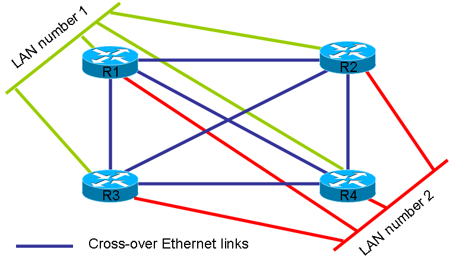
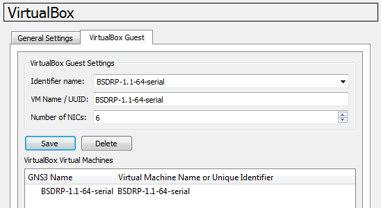
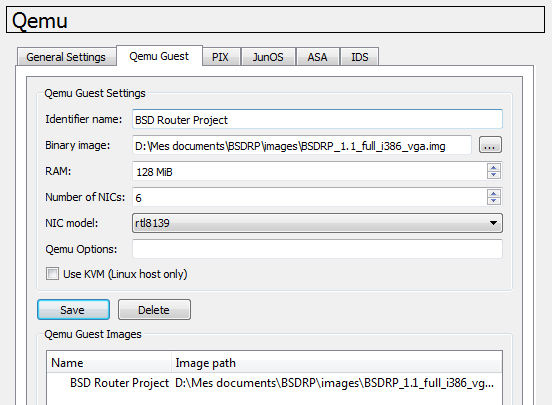

## BSDRP virtual lab scripts

BSDRP provides scripts for setting up labs with Qemu/KVM, [VirtualBox](https://www.virtualbox.org/), or [bhyve](http://bhyve.org/).

### bhyve

If you want to use bhyve, here is the [BSDRP bhyve lab shell script](https://raw.githubusercontent.com/ocochard/BSDRP/master/tools/BSDRP-lab-bhyve.sh).

```
fetch --no-verify-peer -o BSDRP-lab-bhyve.sh "https://raw.githubusercontent.com/ocochard/BSDRP/master/tools/BSDRP-lab-bhyve.sh"
chmod +x BSDRP-lab-bhyve.sh
```

Usage:

```
Usage: ./BSDRP-lab-bhyve.sh [-dhp] -i FreeBSD-disk-image.img [-n vm-number] [-l LAN-number]
 -c           Number of core per VM (default 1)
 -d           Delete All VMs, including the template
 -h           Display this help
 -i filename  FreeBSD file image
 -l X         Number of LAN common to all VM (default 0)
 -m X         RAM size (default 256M)
 -n X         Number of VM full meshed (default 1)
 -p           Patch FreeBSD disk-image for serial output
 -w dirname   Working directory (default /tmp/BSDRP)
 This script needs to be executed with superuser privileges
```

### Qemu/KVM


!!! info "Important"
    Qemu has bugs with multicast packets. If you need to build a lab that uses multicast (VRRP, CARP, OSPF, RIPv2, etc.), use a patched release of Qemu.


Patched releases of Qemu can be found:

- FreeBSD: included (GNS3 option)
- Windows: [GNS3's qemu 0.13.0](https://sourceforge.net/projects/gns-3/files/Qemu/qemu-0.13.0.patched.win32.zip/download)

#### Under FreeBSD or Linux

If you want to use Qemu or KVM, here is the [BSDRP qemu/kvm lab shell script](https://raw.githubusercontent.com/ocochard/BSDRP/master/tools/BSDRP-lab-qemu.sh).

```
fetch -o BSDRP-lab-qemu.sh "https://raw.githubusercontent.com/ocochard/BSDRP/master/tools/BSDRP-lab-qemu.sh"
chmod +x BSDRP-lab-qemu.sh
```

*Linux users should replace `fetch` with `wget`.*

This script was tested with qemu 0.11.1 on FreeBSD and with KVM on Debian GNU/Linux.

Usage:

```
Usage: ./BSDRP-lab-qemu.sh [-s] -i BSDRP-full.img [-n router-number] [-l LAN-number]
  -i filename     BSDRP file image path
  -n X            Lab mode: start X routers (between 2 and 9) full meshed
  -l Y            Number of LAN between 0 and 9 (in lab mode only)
  -s              Enable a shared LAN with Qemu host
  -h              Display this help

Note: in lab mode, the qemu processes are started in snapshot mode,
which means all disk modifications are lost after quitting the lab.
The script must be run as root for a shared LAN with the Qemu host.
```

#### Under Windows

There is a VBScript for Windows on [irom's Blog: BSDRP - QEMU VBScript](http://iromaniuk.wordpress.com/2010/08/08/bsdrp-qemu-vbscript/).

### VirtualBox


!!! info "Important"
    Even with a 64-bit OS, that is not enough to run a 64-bit guest with VirtualBox: [your 64-bit processor must also support VT-x or AMD-V technology (and have it enabled in the BIOS)](http://www.virtualbox.org/manual/ch03.html#intro-64bitguests).


#### Under Windows

If you are on MS Windows, here is a [BSDRP VirtualBox lab PowerShell script](https://raw.githubusercontent.com/ocochard/BSDRP/master/tools/BSDRP-lab-vbox.ps1) (requires PowerShell and .Net).

To start this PowerShell script, you need to:

1.  Allow unrestricted PowerShell script execution (in a PowerShell started with administrative rights, enter `Set-ExecutionPolicy unrestricted`).
2.  Unblock the BSDRP-lab script by right-clicking it, selecting Properties, and clicking Unblock.


!!! tip
    We recommend using a BSDRP serial-console image under MS Windows: it avoids potential keyboard layout problems, and serial-port redirection is well supported under MS Windows.


Prerequisites:

- [VirtualBox](http://www.virtualbox.org) 4.2
- An RDP client for labs based on the BSDRP VGA release (mstsc is included with Windows)
- A serial-terminal application that can open a pipe, like [PuTTY](http://www.chiark.greenend.org.uk/~sgtatham/putty/download.html) or [KiTTY](http://www.9bis.net/kitty/), for labs based on the BSDRP serial release

Steps:

1.  Download a BSDRP image and decompress the xz archive (using [7-zip](http://www.7-zip.org/), for example) to obtain the `.img` file.
2.  Right-click `BSDRP-lab-vbox.ps1` and select "Run with PowerShell".

After use, if you want to use a new BSDRP image for the lab, delete all VirtualBox `BSDRP_lab_*` VMs. The script generates a `BSDRP-Putty-sessions.reg` file on your desktop; import it into your registry to auto-configure PuTTY and KiTTY sessions.

#### Under FreeBSD or Linux

If you want to use VirtualBox, here is the [BSDRP VirtualBox shell lab script](https://raw.githubusercontent.com/ocochard/BSDRP/master/tools/BSDRP-lab-vbox.sh).

```
fetch "https://raw.githubusercontent.com/ocochard/BSDRP/master/tools/BSDRP-lab-vbox.sh"
chmod +x BSDRP-lab-vbox.sh
```

*Linux users should replace `fetch` with `wget`.*

Prerequisites:

- FreeBSD
- Linux
- VirtualBox (non-OSE) 4.2
- `socat` installed, for the BSDRP serial release
- A VNC/RDP client to connect to the BSDRP VGA release

<!-- -->

```
Usage: /usr/local/BSDRP/tools/BSDRP-lab-vbox.sh [-hdsv] [-a i386|amd64] [-i BSDRP_image_file.img] [-n router-number] [-l LAN-number] [-o serial|vga]
  -a ARCH    Force architecture: i386 or amd
             This disable automatic arch/console detection from the filename
             You should use -o with -a
  -c         Enable internal NIC shared with host for each routers (default: Disable)
  -d         Delete all BSDRP VM and disks
  -i filename BSDRP image file name (to be used the first time only)
  -h         Display this help
  -l Y       Number of LAN between 0 and 9 (default: 0)
  -m         RAM (in MB) for each VM (default: 192)
  -n X       Number of router (between 1 and 9) full meshed (default: 1)
  -o CONS    Force console: vga (default if -a) or serial
  -s         Stop all VM
  -v         Enable virtio drivers
```

### Example of use

Using Qemu:

```
./BSDRP-lab-qemu.sh -n 4 -l 2 -i BSDRP.i386.img
```

or with VirtualBox script:

```
./BSDRP-lab-vbox.sh -n 4 -l 2 -i BSDRP_0.36_full_amd64_serial.img

BSD Router Project (http://bsdrp.net) - VirtualBox lab script
Image file given... rebuilding BSDRP router template and deleting all routers
x86-64 image
serial image
Creating lab with 4 router(s):
- 2 LAN between all routers
- Full mesh Ethernet links between each routers

Router1 have the following NIC:
em0 connected to Router2.
em1 connected to Router3.
em2 connected to Router4.
em3 connected to LAN number 1.
em4 connected to LAN number 2.
Router2 have the following NIC:
em0 connected to Router1.
em1 connected to Router3.
em2 connected to Router4.
em3 connected to LAN number 1.
em4 connected to LAN number 2.
Router3 have the following NIC:
em0 connected to Router1.
em1 connected to Router2.
em2 connected to Router4.
em3 connected to LAN number 1.
em4 connected to LAN number 2.
Router4 have the following NIC:
em0 connected to Router1.
em1 connected to Router2.
em2 connected to Router3.
em3 connected to LAN number 1.
em4 connected to LAN number 2.
Connect to router 1: socat unix-connect:/tmp/BSDRP_lab_R1.serial STDIO,raw,echo=0
Connect to router 2: socat unix-connect:/tmp/BSDRP_lab_R2.serial STDIO,raw,echo=0
Connect to router 3: socat unix-connect:/tmp/BSDRP_lab_R3.serial STDIO,raw,echo=0
Connect to router 4: socat unix-connect:/tmp/BSDRP_lab_R4.serial STDIO,raw,echo=0
```

This starts four full-meshed routers (Ethernet cross-over cable), each connected to 2 LANs:



## GNS3

If you want to test BSDRP integration with Cisco/Juniper devices, [GNS3](http://www.gns3.net/) is a great tool.

### VirtualBox

The latest release of GNS3 supports VirtualBox guests; guest speed with VirtualBox is much better than with Qemu.

#### Preparing the BSDRP image disk for VirtualBox

Download a full i386/amd64 BSDRP serial image and un-xz it (using 7-zip); you should get a `.img` file (not a `.xz` file).

Using a serial image prevents keyboard mapping issues; we connect to the console with a virtual serial port and PuTTY.

Convert the raw BSDRP `.img` file to a `.vdi` VirtualBox hard-drive image using the command-line tool [`VBoxManage convertfromraw`](http://www.virtualbox.org/manual/ch08.html#idp14312224).

On MS Windows, open a `cmd.exe` window and enter:

```
C:\Users\Olivier>cd %VBOX_INSTALL_PATH%
C:\Program Files\Oracle\VirtualBox>VBoxManage convertfromraw D:\BSDRP_1.1_full_amd64_serial.img D:\BSDRP_1.1_full_amd64_serial.vdi
Converting from raw image file=D:\BSDRP_1.1_full_amd64_serial.img to file=D:\BSDRP_1.1_full_amd64_serial.vdi...
Creating dynamic image with size 256000000 bytes (245MB)...

C:\Program Files\Oracle\VirtualBox>
```

#### Create a BSDRP VM under VirtualBox

Now start VirtualBox and create a new VM:

- Name: as you wish
- OS: BSD
- Version: "FreeBSD" or "FreeBSD (64 bits)", matching your BSDRP image
- RAM: 128 MB minimum
- Hard Drive: use existing, and select your freshly converted `.vdi` BSDRP image file

Then, only if you are using the "serial" BSDRP image, edit your VM:

- Serial Port: Port 1
    - Enable
    - Mode: Host pipe
    - Check the box: Create pipe
    - Port path: `\\.\pipe\YOUR_VM_NAME`

You can test your settings by starting your VM and launching PuTTY with these parameters:

- Connection type: serial
- Serial port: `\\.\pipe\YOUR_VM_NAME`
- Speed: 115200

You should see the bootloader and dmesg. Now shut down your VM.

#### Declaring a VirtualBox guest

In GNS3, go to "Edit" -> "Preferences..." -> "VirtualBox" -> "VirtualBox Guest".

Then simply select the BSDRP VirtualBox VM.



### Qemu

Use Qemu only if you can use the KVM acceleration feature (GNS3 under GNU/Linux only); otherwise use the VirtualBox guest.

#### Preparing the BSDRP i386 VGA image for GNS3's Qemu

Download a full i386 BSDRP VGA image and un-xz it (using 7-zip); you should get a `.img` file (not a `.xz` file).

Do not use a 64-bit image: GNS3's Qemu is configured to run 32-bit guests only.

#### Declaring a Qemu guest

In GNS3, go to "Edit" -> "Preferences..." -> "Qemu" -> "Qemu Guest".

Then simply give the path to the BSDRP VGA image.



#### Troubleshooting

If, when you try to start your BSDRP Qemu host, you see the message:

"CPU doesn't support long mode"

then you are trying to start a 64-bit OS on a 32-bit emulated guest.
