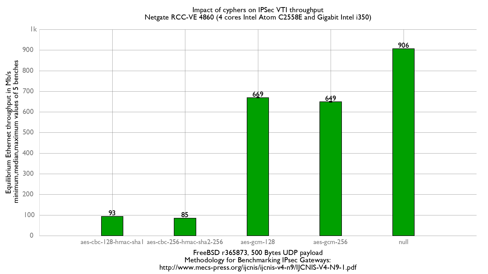

## Hardware detail

This lab will test a [Netgate RCC-VE 4860](http://store.netgate.com/ADI/RCC-VE-4860.aspx) ([dmesg](netgate-rcc-ve-4860.md)):

- Quad cores Intel Atom C2558 (2.40GHz)
  - AES-NI supporting AES-CBC,AES-XTS,AES-GCM,AES-ICM
- 2 Gigabit Intel i211
- 4 Gigabit Intel i350
- 8Gb of RAM

## Method used

The benchmarking method used here is detailed in [Setting up a VPN IPSec, GRE, etc... performance benchmark lab](setting-up-a-vpn-ipsec-gre-etc-performance-benchmark-lab.md).

### Diagram

```
+---------------------+   +-------------------------------------+   +----------------------------------------+
|          R1         |   |    Netgate RCC-VE 4860 (AES-NI)     |   |                     R3                 |
|   Packet generator  |   |           Device under Test         |   |              IPSec endpoint            |
|     and receiver    |   |                                     |   |                 (AES-NI)               |
|                     |   |                                     |   |                                        |
|igb2: 198.18.0.201/24|=>=| igb2: 198.18.0.209/24               |   |                                        |
|       2001:2::201/64|   | 2001:2::209/64                      |   |                                        |
|    00:1b:21:d4:3f:2a|   | 00:08:a2:09:33:da                   |   |                                        |
|                     |   |                                     |   |                                        |
|                     |   |               igb3: 198.18.1.209/24 |=>=| igb2: 198.18.1.203/24                  |
|                     |   |                  2001:2:0:1::209/64 |   |    2001:2:0:1::203/64                  |
|                     |   |                   00:08:a2:09:33:db |   |     00:1b:21:c4:95:7a                  |
|                     |   |                                     |   |                                        |
|                     |   |             ipsec0: 198.18.2.209/24 |...| ipsec0: 198.18.2.203/24             |
|                     |   |                  2001:2:0:2::209/64 |   |    2001:2:0:2::203/64               |
|                     |   |                                     |   |                                     |
|                     |   |              static routes          |   |             static routes              |
|                     |   |     198.19.0.0/16 => 198.18.2.203   |   |     198.19.0.0/16 => 198.19.0.201      |
|                     |   |     198.18.0.0/16 => 198.18.0.201   |   |     198.18.0.0/16 => 198.18.2.209      |
|                     |   |       2001:2::/49 => 2001:2::201    |   |       2001:2::/49 => 2001:2:0:2::209   |
|                     |   |2001:2:0:8000::/49 => 2001:2:0:2::203|   | 2001:2:0:8000::/49=>2001:2:0:8000::201 |
|                     |   |                                     |   |                                        |
|igb3: 198.19.0.201/24|   |                                     |   |         igb3: 198.19.0.203/24          |
|2001:2:0:8000::201/64|   |                                     |   |         2001:2:0:8000::203/64          |
|   00:1b:21:d4:3f:2b |   |                                     |   |          00:1b:21:c4:95:7b             |
+---------------------+   +-------------------------------------+   +----------------------------------------+
          ||                                                                          ||
      ==================================<===========================================
```

## Devices configuration

### Netgate (DUT)

/boot/loader.conf:

```
# Loading AES-NI module sooner to be sure it is loaded before IPsec keys
aesni_load="YES"
```

Configure IP address, routes and static IPSec:

```
# IPv4 router
gateway_enable="YES"
ifconfig_igb2="198.18.0.209/24 -tso4 -tso6 -lro"
ifconfig_igb3="198.18.1.209/24 -tso4 -tso6 -lro"
static_routes="generator receiver"
route_generator="-net 198.18.0.0/16 198.18.0.201"
route_receiver="-net 198.19.0.0/16 198.18.2.203"
static_arp_pairs="receiver generator"
static_arp_generator="198.18.0.201 00:1b:21:d4:3f:2a"
static_arp_receiver="198.18.1.203 00:1b:21:c4:95:7a"

# IPv6 router
ipv6_gateway_enable="YES"
ipv6_activate_all_interfaces="YES"
ifconfig_igb2_ipv6="inet6 2001:2::209 prefixlen 64"
ifconfig_igb3_ipv6="inet6 2001:2:0:1::209 prefixlen 64"
ipv6_static_routes="generator receiver"
ipv6_route_generator="2001:2:: -prefixlen 49 2001:2::201"
ipv6_route_receiver="2001:2:0:8000:: -prefixlen 49 2001:2:0:2::203"
static_ndp_pairs="receiver generator"
static_ndp_generator="2001:2::201 00:1b:21:d4:3f:2a"
static_ndp_receiver="2001:2:0:1::203 00:1b:21:c4:95:7a"
cloned_interfaces="ipsec0"
create_args_ipsec0="reqid 100"
ifconfig_ipsec0="inet 198.18.2.209/24 198.18.2.203 tunnel 198.18.1.209 198.18.1.203"
ifconfig_ipsec0_ipv6="inet6 2001:2:0:2::209 prefixlen 64"

# Enabling IPsec
ipsec_enable="YES"
```

/etc/ipsec.conf :

```
flush;
spdflush;
add 198.18.1.203 198.18.1.209 esp 10000 -m tunnel -u 100 -E aes-gcm-16 "12345678901234567890";
add 198.18.1.209 198.18.1.203 esp 10001 -m tunnel -u 100 -E aes-gcm-16 "12345678901234567890";
```

### R3 (Reference device)

/boot/loader.conf:

```
# Loading AES-NI module sooner to be sure it is loaded before IPsec keys
aesni_load="YES"
```

Configure IP address, routes and static IPSec. /etc/rc.conf:

```
# IPv4 router
gateway_enable="YES"
ifconfig_igb2="inet 198.18.1.203/24 -tso4 -tso6 -lro"
ifconfig_igb3="inet 198.19.0.203/24 -tso4 -tso6 -lro"

static_routes="generator receiver"
route_generator="-net 198.18.0.0/16 198.18.2.209"
route_receiver="-net 198.19.0.0/16 198.19.0.201"
static_arp_pairs="receiver generator"
static_arp_generator="198.18.1.209 00:08:a2:09:33:db"
static_arp_receiver="198.19.0.201 0c:c4:7a:da:3c:12"

# IPv6 router
ipv6_gateway_enable="YES"
ipv6_activate_all_interfaces="YES"
ifconfig_igb2_ipv6="inet6 2001:2:0:1::203 prefixlen 64"
ifconfig_igb3_ipv6="inet6 2001:2:0:8000::203 prefixlen 64"

ipv6_static_routes="generator receiver"
ipv6_route_generator="2001:2:: -prefixlen 49 2001:2:0:2::209"
ipv6_route_receiver="2001:2:0:8000:: -prefixlen 49 2001:2:0:8000::201"
static_ndp_pairs="receiver generator"
static_ndp_generator="2001:2:0:1::209 00:08:a2:09:33:db"
static_ndp_receiver="2001:2:0:8000::201 0c:c4:7a:da:3c:12"
cloned_interfaces="ipsec0"
create_args_ipsec0="reqid 200"
ifconfig_ipsec0="inet 198.18.2.203/24 198.18.2.209 tunnel 198.18.1.203 198.18.1.209"
ifconfig_ipsec0_ipv6="inet6 2001:2:0:2::203 prefixlen 64"

# Enabling IPsec
ipsec_enable="YES"
```

/etc/ipsec.conf:

```
flush;
spdflush;
add 198.18.1.203 198.18.1.209 esp 10000 -m tunnel -u 200 -E aes-gcm-16 "12345678901234567890";
add 198.18.1.209 198.18.1.203 esp 10001 -m tunnel -u 200 -E aes-gcm-16 "12345678901234567890";
```

## Using IPSec bench “Equilibrium throughput” method

Once done, we start using a fast method for measuring the “IPsec equilibrium throughput” of the DUT.

From the packet generator/receiver a simple script that use netmap-pktgen will do the job:

```
[root@R1]~# equilibrium -4 -u -d 00:08:a2:09:33:da -t igb1 -r igb2
Benchmark tool using equilibrium throughput method
- Benchmark mode: Bandwitdh (bps) for VPN gateway
- UDP load = 500B, IPv4 packet size=528B, Ethernet frame size=542B
- Link rate = 1000 Mb/s
- Tolerance = 0.01
Iteration 1
  - Offering load = 500 Mb/s
  - Step = 250 Mb/s
  - Measured forwarding rate = 499 Mb/s
Iteration 2
  - Offering load = 750 Mb/s
  - Step = 250 Mb/s
  - Trend = increasing
  - Measured forwarding rate = 670 Mb/s
Iteration 3
  - Offering load = 625 Mb/s
  - Step = 125 Mb/s
  - Trend = decreasing
  - Measured forwarding rate = 624 Mb/s
Iteration 4
  - Offering load = 687 Mb/s
  - Step = 62 Mb/s
  - Trend = increasing
  - Measured forwarding rate = 672 Mb/s
Iteration 5
  - Offering load = 656 Mb/s
  - Step = 31 Mb/s
  - Trend = decreasing
  - Measured forwarding rate = 655 Mb/s
Iteration 6
  - Offering load = 671 Mb/s
  - Step = 15 Mb/s
  - Trend = increasing
  - Measured forwarding rate = 670 Mb/s
Iteration 7
  - Offering load = 678 Mb/s
  - Step = 7 Mb/s
  - Trend = increasing
  - Measured forwarding rate = 670 Mb/s
Estimated Equilibrium Ethernet throughput= 670 Mb/s (maximum value seen: 672 Mb/s)
```

Using AES-GCM-128 and aesni kernel module loaded on the NetGate RCC-VE 4860, we can estimate an IPSec Equilibrium throughput of about 672Mb/s.


