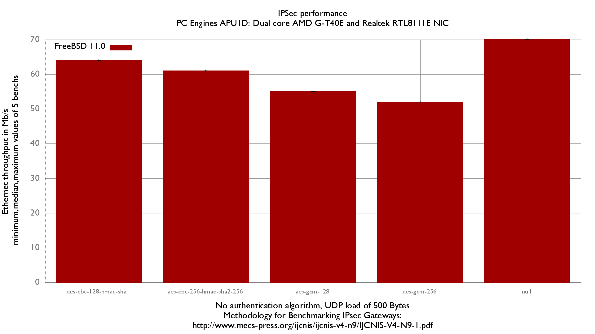

## Hardware detail

This lab will test a [PC Engines APU 1](http://www.pcengines.ch/apu.htm) ([dmesg](pc-engines-apu.md)):

- Dual core [AMD G-T40E Processor](http://www.amd.com/us/Documents/49282_G-Series_platform_brief.pdf) (1 GHz)
- 3 Realtek RTL8111E Gigabit Ethernet ports
- 2Gb of RAM

[IPSec performance of APU version 2 is here.](ipsec-performance-of-a-pc-engines-apu2.md)

## Lab set-up

For more information about full setup of this lab: [Setting up a forwarding performance benchmark lab](setting-up-a-forwarding-performance-benchmark-lab.md) (switch configuration, etc.).

A current version of [BSDRP-1.9997](https://sourceforge.net/projects/bsdrp/files/BSD_Router_Project/current/amd64/) based on FreeBSD 11-current r262847 (10-stable didn’t boot on this board) is used on the packet generator, receiver and the DUT.

### Diagram

```
+---------------------+   +-------------------------------------+    +----------------------------------------+
|          R1         |   |               PC Engines APU        |    |                     R3                 |
|   Packet generator  |   |             Device under Test       |    |              IPSec endpoint            |
|     and receiver    |   |                                     |    |                 (AES-NI)               |
|                     |   |                                     |    |                                        |
|igb2: 198.18.0.201/24|=>=| re1: 198.18.0.207/24                |    |                                        |
|       2001:2::201/64|   | 2001:2::207/64                      |    |                                        |
|    00:1b:21:d4:3f:2a|   | 00:0d:b9:3c:dd:3d                   |    |                                        |
|                     |   |                                     |    |                                        |
|                     |   |                re2: 198.18.1.207/24 |==>=| igb2: 198.18.1.203/24                  |
|                     |   |                  2001:2:0:1::207/64 |    |    2001:2:0:1::203/64                  |
|                     |   |                   00:0d:b9:3c:dd:3e |    |     00:1b:21:c4:95:7a                  |
|                     |   |                                     |    |                                        |
|                     |   |              static routes          |    |             static routes              |
|                     |   |     198.19.0.0/16 => 198.18.1.203   |    |     198.19.0.0/16 => 198.19.0.201      |
|                     |   |     198.18.0.0/16 => 198.18.0.201   |    |     198.18.0.0/16 => 198.18.1.207      |
|                     |   |       2001:2::/49 => 2001:2::201    |    |       2001:2::/49 => 2001:2:0:1::207   |
|                     |   |2001:2:0:8000::/49 => 2001:2:0:1::203|    | 2001:2:0:8000::/49=>2001:2:0:8000::201 |
|                     |   |                                     |    |                                        |
|igb3: 198.19.0.201/24|   |                                     |    |         igb3: 198.19.0.203/24          |
|2001:2:0:8000::201/64|   |                                     |    |         2001:2:0:8000::203/64          |
|   00:1b:21:d4:3f:2b |   |                                     |    |          00:1b:21:c4:95:7b             |
+---------------------+   +-------------------------------------+    +----------------------------------------+
          ||                                                                           ||
      ==================================<============================================
```

## Devices configuration

### R1 (Packet generator/receiver)

```
ifconfig igb2 up
ifconfig igb3 up
```

### APU (DUT)

Disable fastforwarding (not compliant with IPSec), configure IP address, routes and static IPSec.

/etc/rc.conf

```
# Hostname
hostname="APU"

# Disable INTERRUPT and ETHERNET from entropy sources
harvest_mask="351"

# IPv4 router
gateway_enable="YES"
ifconfig_re1="inet 198.18.0.207/24"
ifconfig_re2="inet 198.18.1.207"
static_routes="generator receiver"
route_generator="-net 198.18.0.0/16 198.18.0.201"
route_receiver="-net 198.19.0.0/16 198.18.1.203"
static_arp_pairs="receiver generator"
static_arp_generator="198.18.0.201 00:1b:21:d4:3f:2a"
static_arp_receiver="198.18.1.203 00:1b:21:c4:95:7a"

# IPv6 router
ipv6_gateway_enable="YES"
ipv6_activate_all_interfaces="YES"
ipv6_static_routes="generator receiver"
ipv6_route_generator="2001:2:: -prefixlen 49 2001:2::201"
ipv6_route_receiver="2001:2:0:8000:: -prefixlen 49 2001:2:0:1::203"
ifconfig_re1_ipv6="inet6 2001:2::207 prefixlen 64"
ifconfig_re2_ipv6="inet6 2001:2:0:1::207 prefixlen 64"
static_ndp_pairs="receiver generator"
static_ndp_generator="2001:2::201 00:1b:21:d4:3f:2a"
static_ndp_receiver="2001:2:0:1::203 00:1b:21:c4:95:7b"

# Enabling IPSec
ipsec_enable="YES"
```

/etc/ipsec.conf:

```
flush;
spdflush;
spdadd 198.18.0.0/16 198.19.0.0/16 any -P out ipsec esp/tunnel/198.18.1.207-198.18.1.203/require;
spdadd 198.19.0.0/16 198.18.0.0/16 any -P in ipsec esp/tunnel/198.18.1.203-198.18.1.207/require;
add 198.18.1.203 198.18.1.207 esp 0x1000 -E rijndael-cbc "1234567890123456";
add 198.18.1.207 198.18.1.203 esp 0x1001 -E rijndael-cbc "1234567890123456";
spdadd 2001:2::/49 2001:2:0:8000::/49 any -P out ipsec esp/tunnel/2001:2:0:1::207-2001:2:0:1::203/require;
spdadd 2001:2:0:8000::/49 2001:2::/49 any -P in ipsec esp/tunnel/2001:2:0:1::203-2001:2:0:1::207/require;
add 2001:2:0:1::203 2001:2:0:1::207 esp 0x1002 -E rijndael-cbc "1234567890123456";
add 2001:2:0:1::207 2001:2:0:1::203 esp 0x1003 -E rijndael-cbc "1234567890123456";
```

### R3 (Reference device)

Disable fastforwarding (not compliant with IPSec), configure IP address, routes and static IPSec.

/etc/rc.conf:

```
# Hostname
hostname="R3"

# Disable INTERRUPT and ETHERNET from entropy sources
harvest_mask="351"

# IPv4 router
gateway_enable="YES"
ifconfig_igb2="inet 198.18.1.203/24"
ifconfig_igb3="inet 198.19.0.203/24"

static_routes="generator receiver"
route_generator="-net 198.18.0.0/16 198.18.1.207"
route_receiver="-net 198.19.0.0/16 198.19.0.201"
static_arp_pairs="receiver generator"
static_arp_generator="198.18.1.207 00:0d:b9:3c:dd:3e"
static_arp_receiver="198.19.0.201 00:1b:21:d4:3f:2b"

# IPv6 router
ipv6_gateway_enable="YES"
ipv6_activate_all_interfaces="YES"
ifconfig_igb2_ipv6="inet6 2001:2:0:1::203 prefixlen 64"
ifconfig_igb3_ipv6="inet6 2001:2:0:8000::203 prefixlen 64"

ipv6_static_routes="generator receiver"
ipv6_route_generator="2001:2:: -prefixlen 49 2001:2:0:1::207"
ipv6_route_receiver="2001:2:0:8000:: -prefixlen 49 2001:2:0:8000::201"
static_ndp_pairs="receiver generator"
static_ndp_generator="2001:2:0:1::207 00:0d:b9:3c:dd:3e"
static_ndp_receiver="2001:2:0:8000::201 00:1b:21:d4:3f:2b"

# Enabling IPSec
kld_list="aesni"
ipsec_enable="YES"
```

/etc/ipsec.conf:

```
flush;
spdflush;
spdadd 198.18.0.0/16 198.19.0.0/16 any -P in ipsec esp/tunnel/198.18.1.207-198.18.1.203/require;
spdadd 198.19.0.0/16 198.18.0.0/16 any -P out ipsec esp/tunnel/198.18.1.203-198.18.1.207/require;
add 198.18.1.203 198.18.1.207 esp 0x1000 -E rijndael-cbc "1234567890123456";
add 198.18.1.207 198.18.1.203 esp 0x1001 -E rijndael-cbc "1234567890123456";
spdadd 2001:2::/49 2001:2:0:8000::/49 any -P in ipsec esp/tunnel/2001:2:0:1::207-2001:2:0:1::203/require;
spdadd 2001:2:0:8000::/49 2001:2::/49 any -P out ipsec esp/tunnel/2001:2:0:1::203-2001:2:0:1::207/require;
add 2001:2:0:1::203 2001:2:0:1::207 esp 0x1002 -E rijndael-cbc "1234567890123456";
add 2001:2:0:1::207 2001:2:0:1::203 esp 0x1003 -E rijndael-cbc "1234567890123456";
```

## Using IPSec bench “Equilibrium throughput” method

Once done, we start using a fast method for measuring the “IPsec equilibrium throughput” of the DUT.

Notice that the reference device (IBM x3550-M3) used in front of the PC Engines APU1 has a [equilibrium throughput of 843Mb/s](ipsec-performance-lab-of-an-ibm-system-x3550-m3-with-intel-82580.md). Then if the value measured during this bench is close to 843Mb/s we had to found a more powerful reference device.

From the packet generator/receiver a simple script that use netmap-pktgen will do the job:

```
[root@R1]# equilibrium -l 100 -d 00:0d:b9:3c:dd:3d -t igb2 -r igb3
Benchmark tool using equilibrium throughput method
- Benchmark mode: Bandwitdh (bps) for VPN gateway
- UDP load = 500B, IPv4 packet size=528B, Ethernet frame size=542B
- Link rate = 100 Mb/s
- TOLERANCE = 0.01
Iteration 1
  - offering load = 50 Mb/s
  - STEP = 25 Mb/s
  - Measured forwarding rate = 50 Mb/s
Iteration 2
  - offering load = 75 Mb/s
  - STEP = 25 Mb/s
  - TREND = increasing
  - Measured forwarding rate = 72 Mb/s
Iteration 3
  - offering load = 63 Mb/s
  - STEP = 12 Mb/s
  - TREND = decreasing
  - Measured forwarding rate = 63 Mb/s
Iteration 4
  - offering load = 69 Mb/s
  - STEP = 6 Mb/s
  - TREND = increasing
  - Measured forwarding rate = 68 Mb/s
Iteration 5
  - offering load = 66 Mb/s
  - STEP = 3 Mb/s
  - TREND = decreasing
  - Measured forwarding rate = 65 Mb/s
Estimated Equilibrium Ethernet throughput= 65 Mb/s (maximum value seen: 72 Mb/s)
```

Here is the ministat distribution:

```
root@R1:~ # ministat -s -w 74 apu-ipsec
x Equilibrium throughput with rijndael-cbc
+--------------------------------------------------------------------------+
|                                                       x                  |
|x                                   x                  x                 x|
|                |___________________________A__________M_______________|  |
+--------------------------------------------------------------------------+
    N           Min           Max        Median           Avg        Stddev
x   5            61            65            64          63.4     1.5165751
```

Using AES-CBC (rijndael-cbc) with a 128 bits key, we can estimate an IPSec Equilibrium throughput of 64Mb/s.

And same performance for IPv6:

```
[root@R1]# equilibrium -l 100 -d 00:0d:b9:3c:dd:3d -t igb2 -r igb3 -6
Benchmark tool using equilibrium throughput method
- Benchmark mode: Bandwitdh (bps) for VPN gateway
- UDP load = 500B, IPv6 packet size=548B, Ethernet frame size=562B
- Link rate = 100 Mb/s
- TOLERANCE = 0.01
Iteration 1
  - offering load = 50 Mb/s
  - STEP = 25 Mb/s
  - Measured forwarding rate = 50 Mb/s
Iteration 2
  - offering load = 75 Mb/s
  - STEP = 25 Mb/s
  - TREND = increasing
  - Measured forwarding rate = 72 Mb/s
Iteration 3
  - offering load = 63 Mb/s
  - STEP = 12 Mb/s
  - TREND = decreasing
  - Measured forwarding rate = 63 Mb/s
Iteration 4
  - offering load = 69 Mb/s
  - STEP = 6 Mb/s
  - TREND = increasing
  - Measured forwarding rate = 68 Mb/s
Iteration 5
  - offering load = 66 Mb/s
  - STEP = 3 Mb/s
  - TREND = decreasing
  - Measured forwarding rate = 66 Mb/s
Estimated Equilibrium Ethernet throughput= 66 Mb/s (maximum value seen: 72 Mb/s)
```

### Graphs


