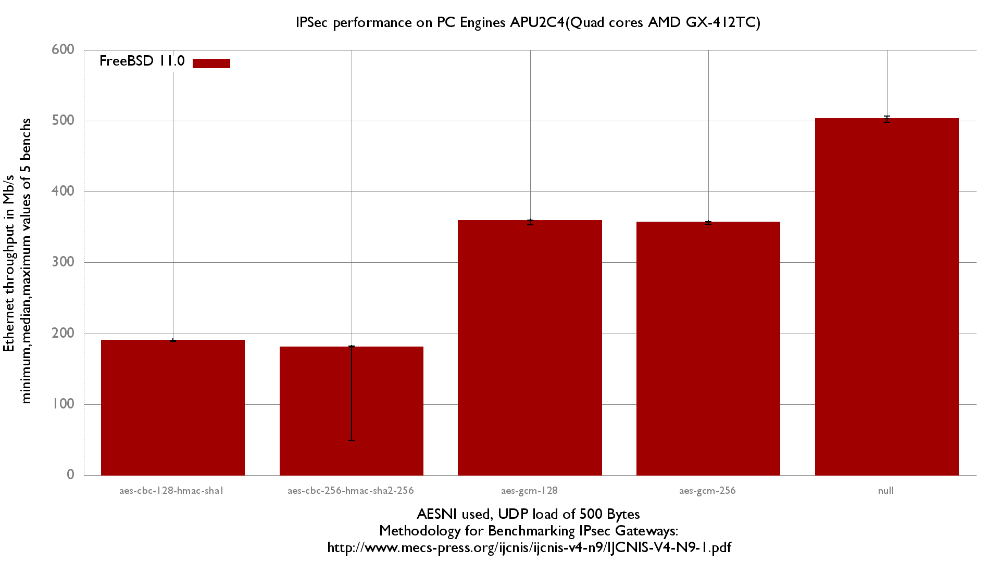

## Hardware detail

This lab tests a [PC Engines APU 2C4](http://www.pcengines.ch/apu2.htm) ([dmesg](pc-engines-apu2.md)):

- Quad-core [AMD GX-412TC Processor](https://www.amd.com/Documents/AMDGSeriesSOCProductBrief.pdf) (1 GHz with AES-NI)
- 3x Intel i210AT Gigabit ports
- 4 GB of RAM

## Lab set-up

For more information about full setup of this lab: [Setting up a forwarding performance benchmark lab](setting-up-a-forwarding-performance-benchmark-lab.md) (switch configuration, etc.).

### Diagram

```
+---------------------+   +-------------------------------------+    +----------------------------------------+
|          R1         |   |            PC Engines APU2          |    |                     R3                 |
|   Packet generator  |   |           Device under Test         |    |              IPSec endpoint            |
|     and receiver    |   |                                     |    |                 (AES-NI)               |
|                     |   |                                     |    |                                        |
|igb2: 198.18.0.201/24|=>=| igb1: 198.18.0.205/24               |    |                                        |
|       2001:2::201/64|   | 2001:2::205/64                      |    |                                        |
|    00:1b:21:d4:3f:2a|   | 00:0d:b9:41:ca:3d                   |    |                                        |
|                     |   |                                     |    |                                        |
|                     |   |               igb2: 198.18.1.205/24 |==>=| igb2: 198.18.1.203/24                  |
|                     |   |                  2001:2:0:1::205/64 |    |    2001:2:0:1::203/64                  |
|                     |   |                   00:0d:b9:41:ca:3e |    |     00:1b:21:c4:95:7a                  |
|                     |   |                                     |    |                                        |
|                     |   |               vpn:  198.18.2.205/24 |....| vpn:  198.18.2.203/24                  |
|                     |   |                  2001:2:0:2::205/64 |    |    2001:2:0:2::203/64                  |
|                     |   |                                     |    |                                        |
|                     |   |              static routes          |    |             static routes              |
|                     |   |     198.19.0.0/16 => 198.18.1.203   |    |     198.19.0.0/16 => 198.19.0.201      |
|                     |   |     198.18.0.0/16 => 198.18.0.201   |    |     198.18.0.0/16 => 198.18.1.205      |
|                     |   |       2001:2::/49 => 2001:2::201    |    |       2001:2::/49 => 2001:2:0:1::205   |
|                     |   |2001:2:0:8000::/49 => 2001:2:0:1::203|    | 2001:2:0:8000::/49=>2001:2:0:8000::201 |
|                     |   |                                     |    |                                        |
|igb3: 198.19.0.201/24|   |                                     |    |         igb3: 198.19.0.203/24          |
|2001:2:0:8000::201/64|   |                                     |    |         2001:2:0:8000::203/64          |
|   00:1b:21:d4:3f:2b |   |                                     |    |          00:1b:21:c4:95:7b             |
+---------------------+   +-------------------------------------+    +----------------------------------------+
          ||                                                                           ||
      ==================================<============================================
```

## Devices configuration

### APU2 (DUT)

Disable fastforwarding (not compatible with IPsec), then configure IP addresses, routes, and static IPsec:

/etc/rc.conf:

```
# IPv4 router
gateway_enable="YES"
ifconfig_igb1="198.18.0.205/24 -tso4 -tso6 -lro"
ifconfig_igb2="198.18.1.205/24 -tso4 -tso6 -lro"
static_routes="generator receiver"
route_generator="-net 198.18.0.0/16 198.18.0.201"
route_receiver="-net 198.19.0.0/16 198.18.1.203"
static_arp_pairs="receiver generator"
static_arp_generator="198.18.0.201 00:1b:21:d4:3f:2a"
static_arp_receiver="198.18.1.203 00:1b:21:c4:95:7a"

# IPv6 router
ipv6_gateway_enable="YES"
ipv6_activate_all_interfaces="YES"
ifconfig_igb1_ipv6="inet6 2001:2::205 prefixlen 64"
ifconfig_igb2_ipv6="inet6 2001:2:0:1::205 prefixlen 64"
ipv6_static_routes="generator receiver"
ipv6_route_generator="2001:2:: -prefixlen 49 2001:2::201"
ipv6_route_receiver="2001:2:0:8000:: -prefixlen 49 2001:2:0:1::203"
static_ndp_pairs="receiver generator"
static_ndp_generator="2001:2::201 00:1b:21:d4:3f:2a"
static_ndp_receiver="2001:2:0:1::203 00:1b:21:c4:95:7a"

# Enabling IPSec
ipsec_enable="YES"

# Enabling AES-NI
kld_list="aesni"
```

/etc/ipsec.conf

```
flush;
spdflush;
spdadd 198.18.0.0/16 198.19.0.0/16 any -P out ipsec esp/tunnel/198.18.1.205-198.18.1.203/require;
spdadd 198.19.0.0/16 198.18.0.0/16 any -P in ipsec esp/tunnel/198.18.1.203-198.18.1.205/require;
add 198.18.1.203 198.18.1.205 esp 0x1000 -E aes-gcm-16 "12345678901234567890";
add 198.18.1.205 198.18.1.203 esp 0x1001 -E aes-gcm-16 "12345678901234567890";
spdadd 2001:2::/49 2001:2:0:8000::/49 any -P out ipsec esp/tunnel/2001:2:0:1::205-2001:2:0:1::203/require;
spdadd 2001:2:0:8000::/49 2001:2::/49 any -P in ipsec esp/tunnel/2001:2:0:1::203-2001:2:0:1::205/require;
add 2001:2:0:1::203 2001:2:0:1::205 esp 0x1002 -E aes-gcm-16 "12345678901234567890";
add 2001:2:0:1::205 2001:2:0:1::203 esp 0x1003 -E aes-gcm-16 "12345678901234567890";
```

### R3 (Reference device)

Disable fastforwarding (not compatible with IPsec), then configure IP addresses, routes, and static IPsec:

```
# IPv4 router
gateway_enable="YES"
ifconfig_igb2="inet 198.18.1.203/24"
ifconfig_igb3="inet 198.19.0.203/24"

static_routes="generator receiver"
route_generator="-net 198.18.0.0/16 198.18.1.205"
route_receiver="-net 198.19.0.0/16 198.19.0.201"
static_arp_pairs="receiver generator"
static_arp_generator="198.18.1.205 00:0d:b9:41:ca:3e"
static_arp_receiver="198.19.0.201 00:1b:21:d4:3f:2b"

# IPv6 router
ipv6_gateway_enable="YES"
ipv6_activate_all_interfaces="YES"
ifconfig_igb2_ipv6="inet6 2001:2:0:1::203 prefixlen 64"
ifconfig_igb3_ipv6="inet6 2001:2:0:8000::203 prefixlen 64"

ipv6_static_routes="generator receiver"
ipv6_route_generator="2001:2:: -prefixlen 49 2001:2:0:1::205"
ipv6_route_receiver="2001:2:0:8000:: -prefixlen 49 2001:2:0:8000::201"
static_ndp_pairs="receiver generator"
static_ndp_generator="2001:2:0:1::205 00:0d:b9:41:ca:3e"
static_ndp_receiver="2001:2:0:8000::201 00:1b:21:d4:3f:2b"

# Enabling IPSec
kld_list="aesni"
ipsec_enable="YES"
```

/etc/ipsec.conf

```
flush;
spdflush;
spdadd 198.18.0.0/16 198.19.0.0/16 any -P in ipsec esp/tunnel/198.18.1.205-198.18.1.203/require;
spdadd 198.19.0.0/16 198.18.0.0/16 any -P out ipsec esp/tunnel/198.18.1.203-198.18.1.205/require;
add 198.18.1.203 198.18.1.205 esp 0x1000 -E aes-gcm-16 "12345678901234567890";
add 198.18.1.205 198.18.1.203 esp 0x1001 -E aes-gcm-16 "12345678901234567890";
spdadd 2001:2::/49 2001:2:0:8000::/49 any -P in ipsec esp/tunnel/2001:2:0:1::205-2001:2:0:1::203/require;
spdadd 2001:2:0:8000::/49 2001:2::/49 any -P out ipsec esp/tunnel/2001:2:0:1::203-2001:2:0:1::205/require;
add 2001:2:0:1::203 2001:2:0:1::205 esp 0x1002 -E aes-gcm-16 "12345678901234567890";
add 2001:2:0:1::205 2001:2:0:1::203 esp 0x1003 -E aes-gcm-16 "12345678901234567890";
```

## IPsec benchmark "equilibrium throughput" method

Once that is done, we use a fast method to measure the "IPsec equilibrium throughput" of the DUT.

Note that the reference device (IBM x3550-M3) used in front of the PC Engines APU2 has an [equilibrium throughput of 843 Mb/s](ipsec-performance-lab-of-an-ibm-system-x3550-m3-with-intel-82580.md). If the value measured during this benchmark approaches 843 Mb/s, we would need a more powerful reference device.

```
root@pkt-gen # equilibrium -4 -u -d 00:0d:b9:41:ca:3d -t igb2 -r igb3
Benchmark tool using equilibrium throughput method
- Benchmark mode: Bandwitdh (bps) for VPN gateway
- UDP load = 500B, IPv4 packet size=528B, Ethernet frame size=542B
- Link rate = 1000 Mb/s
- Tolerance = 0.01
Iteration 1
  - Offering load = 500 Mb/s
  - Step = 250 Mb/s
  - Measured forwarding rate = 359 Mb/s
Iteration 2
  - Offering load = 250 Mb/s
  - Step = 250 Mb/s
  - Trend = decreasing
  - Measured forwarding rate = 250 Mb/s
Iteration 3
  - Offering load = 375 Mb/s
  - Step = 125 Mb/s
  - Trend = increasing
  - Measured forwarding rate = 356 Mb/s
Iteration 4
  - Offering load = 313 Mb/s
  - Step = 62 Mb/s
  - Trend = decreasing
  - Measured forwarding rate = 313 Mb/s
Iteration 5
  - Offering load = 344 Mb/s
  - Step = 31 Mb/s
  - Trend = increasing
  - Measured forwarding rate = 344 Mb/s
Iteration 6
  - Offering load = 359 Mb/s
  - Step = 15 Mb/s
  - Trend = increasing
  - Measured forwarding rate = 351 Mb/s
Iteration 7
  - Offering load = 352 Mb/s
  - Step = 7 Mb/s
  - Trend = decreasing
  - Measured forwarding rate = 350 Mb/s
Estimated Equilibrium Ethernet throughput= 350 Mb/s (maximum value seen: 359 Mb/s)
```

It reaches a maximum of 359 Mb/s.

### Graph


