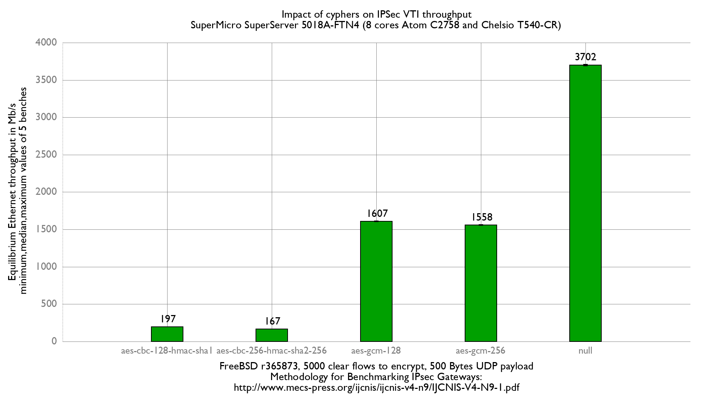

## Hardware detail

This lab tests a [SuperMicro](http://www.supermicro.com/products/system/1U/5018/SYS-5018A-FTN4.cfm) [SuperServer 5018A-FTN4](superserver-5018a-ftn4.md):

- Intel Rangeley: [Atom C2758 (8 cores) at 2.4 GHz](http://ark.intel.com/products/77988/Intel-Atom-Processor-C2758-4M-Cache-2_40-GHz)
- 8 GB of RAM
- Quad-port Chelsio 10-Gigabit T540-CR and OPT SFPs (SFP-10G-LR)

This CPU includes AES-NI: AES-CBC, AES-XTS, AES-GCM, AES-ICM.

## Method used

The benchmarking method used here is detailed in [Setting up a VPN IPsec, GRE, etc. performance benchmark lab](setting-up-a-vpn-ipsec-gre-etc-performance-benchmark-lab.md).

### Diagram

```
+--------------------+   +-------------------------------------+   +------------------------------------+
|         r630       |   |          Atom C2758-Chelsio         |   |                  HP                |
|  Packet generator  |   |           Device under Test         |   |           IPSec endpoint           |
|     and receiver   |   |                                     |   |              (AES-NI)              |
|                    |   |                                     |   |                                    |
|vcxl0: 198.18.0.2/24|=>=| cxl0: 198.18.0.208/24               |   |                                    |
|       2001:2::2/64 |   | 2001:2::208/64                      |   |                                    |
|  00:07:43:2f:fe:b2 |   | 00:07:43:2e:e5:90                   |   |                                    |
|                    |   |                                     |   |                                    |
|                    |   |               cxl1: 198.18.1.208/24 |=>=| cxl0: 198.18.1.210/24              |
|                    |   |                  2001:2:0:1::208/64 |   |    2001:2:0:1::210/64              |
|                    |   |                   00:07:43:2e:e5:98 |   |     00:07:43:2e:e4:70              |
|                    |   |                                     |   |                                    |
|                    |   |             ipsec0: 198.18.2.208/24 |...| ipsec0: 198.18.2.210/24            |
|                    |   |                  2001:2:0:2::208/64 |   |    2001:2:0:2::210/64              |
|                    |   |                                     |   |                                    |
|                    |   |              static routes          |   |            static routes           |
|                    |   |     198.19.0.0/16 => 198.18.2.210   |   |    198.19.0.0/16 => 198.19.0.2     |
|                    |   |     198.18.0.0/16 => 198.18.0.2     |   |    198.18.0.0/16 => 198.18.2.208   |
|                    |   |       2001:2::/49 => 2001:2::2      |   |      2001:2::/49 => 2001:2:0:2::208|
|                    |   |2001:2:0:8000::/49 => 2001:2:0:2::210|   |2001:2:0:8000::/49=>2001:2:0:8000::2|
|                    |   |                                     |   |                                    |
|vcxl1: 198.19.0.2/24|   |                                     |   |        cxl1: 198.19.0.210/24       |
| 2001:2:0:8000::2/64|   |                                     |   |        2001:2:0:8000::210/64       |
| 00:07:43:2f:fe:ba  |   |                                     |   |         00:07:43:2e:e4:78          |
+--------------------+   +-------------------------------------+   +------------------------------------+
          ||                                                                          ||
          ==================================<===========================================
```

## Devices configuration

Almost the same as the forwarding performance lab.

### DUT

Configure IP addresses, routes, and static IPsec.

/boot/loader.conf:

```
# Loading AES-NI module sooner to be sure it is loaded before IPsec keys
aesni_load="YES"
```

/etc/rc.conf:

```
# IPv4 router
gateway_enable="YES"
ifconfig_cxl0="inet 198.18.0.208/24 -tso4 -tso6 -lro"
ifconfig_cxl1="inet 198.18.1.208/24 -tso4 -tso6 -lro"
static_routes="generator receiver"
route_generator="-net 198.18.0.0/16 198.18.0.2"
route_receiver="-net 198.19.0.0/16 198.18.2.210"
static_arp_pairs="generator receiver"
static_arp_generator="198.18.0.2 00:07:43:2f:fe:b1"
static_arp_receiver="198.18.1.210 00:07:43:2e:e4:70"

# IPv6 router
ipv6_gateway_enable="YES"
ipv6_activate_all_interfaces="YES"
ifconfig_cxl0_ipv6="inet6 2001:2::208 prefixlen 64"
ifconfig_cxl1_ipv6="inet6 2001:2:0:1::208 prefixlen 64"
ipv6_static_routes="generator receiver"
ipv6_route_generator="2001:2:: -prefixlen 49 2001:2::2"
ipv6_route_receiver="2001:2:0:8000:: -prefixlen 49 2001:2:0:2::210"
static_ndp_pairs="generator receiver"
static_ndp_generator="2001:2::2 00:07:43:2f:fe:b1"
static_ndp_receiver="2001:2:0:1::210 00:07:43:2e:e4:70"

cloned_interfaces="ipsec0"
create_args_ipsec0="reqid 100"
ifconfig_ipsec0="inet 198.18.2.208/24 198.18.2.210 tunnel 198.18.1.208 198.18.1.210"
ifconfig_ipsec0_ipv6="inet6 2001:2:0:2::208 prefixlen 64"

# Enabling IPsec
ipsec_enable="YES"
```

/etc/ipsec.conf

```
flush;
spdflush;
add 198.18.1.208 198.18.1.210 esp 10000 -m tunnel -u 100 -E aes-gcm-16 "12345678901234567890";
add 198.18.1.210 198.18.1.208 esp 10001 -m tunnel -u 100 -E aes-gcm-16 "12345678901234567890";
```

### Reference Endpoint

/boot/loader.conf:

```
# Loading AES-NI module sooner to be sure it is loaded before IPsec keys
aesni_load="YES"
```

Configure IP addresses, routes, and static IPsec:

```
gateway_enable="YES"
ifconfig_cxl0="inet 198.18.1.210/24 -tso4 -tso6 -lro -vlanhwtso"
ifconfig_cxl1="inet 198.19.0.210/24 -tso4 -tso6 -lro -vlanhwtso"
static_routes="generator receiver"
route_generator="-net 198.18.0.0/16 198.18.2.208"
route_receiver="-net 198.19.0.0/16 198.19.0.2"
static_arp_pairs="generator receiver"
static_arp_generator="198.18.1.208 00:07:43:2e:e5:98"
static_arp_receiver="198.19.0.2 00:07:43:2f:fe:b9"

# IPv6 router
ipv6_gateway_enable="YES"
ipv6_activate_all_interfaces="YES"
ifconfig_cxl0_ipv6="inet6 2001:2:0:1::210 prefixlen 64"
ifconfig_cxl1_ipv6="inet6 2001:2:0:8000::210 prefixlen 64"
ipv6_static_routes="generator receiver"
ipv6_route_generator="2001:2:: -prefixlen 49 2001:2:0:2::208"
ipv6_route_receiver="2001:2:0:8000:: -prefixlen 49 2001:2:0:8000::2"
static_ndp_pairs="generator receiver"
static_ndp_generator="2001:2:0:1::208 00:07:43:2e:e5:98"
static_ndp_receiver="2001:2:0:8000::2 00:07:43:2f:fe:b9"
cloned_interfaces="ipsec0"
create_args_ipsec0="reqid 200"
ifconfig_ipsec0="inet 198.18.2.210/24 198.18.2.208 tunnel 198.18.1.210 198.18.1.208"
ifconfig_ipsec0_ipv6="inet6 2001:2:0:2::210 prefixlen 64"

# Enabling IPsec
ipsec_enable="YES"
```

/etc/ipsec.conf:

```
flush;
spdflush;
add 198.18.1.208 198.18.1.210 esp 10000 -m tunnel -u 200 -E aes-gcm-16 "12345678901234567890";
add 198.18.1.210 198.18.1.208 esp 10001 -m tunnel -u 200 -E aes-gcm-16 "12345678901234567890";
```

## IPsec benchmark "equilibrium throughput" method

Once that is done, we use a fast method to measure the "IPsec equilibrium throughput" of the DUT.

From the packet generator/receiver, a simple script that uses netmap-pktgen will do the job:

```
[root@pkt-gen]~# equilibrium -4 -d 00:07:43:2e:e5:90 -t vcxl0 -r vcxl1 -l 10000
Benchmark tool using equilibrium throughput method
- Benchmark mode: Bandwitdh (bps) for VPN gateway
- UDP load = 500B, IPv4 packet size=528B, Ethernet frame size=542B
- Link rate = 10000 Mb/s
- Tolerance = 0.01
Iteration 1
  - Offering load = 5000 Mb/s
  - Step = 2500 Mb/s
  - Measured forwarding rate = 1598 Mb/s
  - Forwared rate too low, forcing OLOAD=FWRATE and STEP=FWRATE/2
Iteration 2
  - Offering load = 1598 Mb/s
  - Step = 799 Mb/s
  - Trend = decreasing
  - Measured forwarding rate = 1597 Mb/s
Iteration 3
  - Offering load = 1997 Mb/s
  - Step = 399 Mb/s
  - Trend = increasing
  - Measured forwarding rate = 1602 Mb/s
Iteration 4
  - Offering load = 1798 Mb/s
  - Step = 199 Mb/s
  - Trend = decreasing
  - Measured forwarding rate = 1599 Mb/s
Iteration 5
  - Offering load = 1699 Mb/s
  - Step = 99 Mb/s
  - Trend = decreasing
  - Measured forwarding rate = 1600 Mb/s
Iteration 6
  - Offering load = 1650 Mb/s
  - Step = 49 Mb/s
  - Trend = decreasing
  - Measured forwarding rate = 1603 Mb/s
Iteration 7
  - Offering load = 1626 Mb/s
  - Step = 24 Mb/s
  - Trend = decreasing
  - Measured forwarding rate = 1604 Mb/s
Estimated Equilibrium Ethernet throughput= 1604 Mb/s (maximum value seen: 1604 Mb/s)
```

We reach about 1.604 Gb/s encrypting 5000 flows.

### Encryption algorithms


