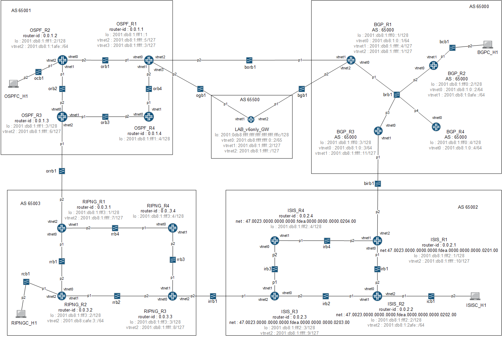

This lab has been done with BSDRP under bhyve and it show an example of BGP/ISIS/RIPNG/OSPF interactions with IPv6 only.

## Presentation

### Network diagram

Here is the logical and physical view:



### Description and limitations

This lab has been done to improve IPv6 use and routing experience. The routers have been configured int the simpliest way. No authentication or log have been configured (and this is bad !!!)

I also tried to make some “funnies” BGP interconnections. - The IGP protocol do not send routes to the EGP protocol - Inside an area, BGP border routers exchange their routes

The LAB_v6only_GW is a router used to make an interconnexion with a global lab network

The host are not described here but a simple host vith ipv6 auto-configuration is enough

## Setting-up the lab

### Downloading BSD Router Project images

Download BSDRP serial image (prevent to have to use an X display) on Sourceforge.

### Configure lab with netlab

#### Quick installation of netlab

Pull the repository <https://github.com/stardco/netlab.git> In root mode :

```
make install
```

#### Information to add on templates.conf

BSDRP-1.96-full-amd64-serial.img must be on /usr/local/etc/netlab/templates/

```
BSDRP_196:BSD:BSDRP-1.96-full-amd64-serial.img:
```

#### Information to add on areas.conf

```
LAB_v6only:LAB_v6only_GW BGP_R1 BGP_R2 BGP_R3 BGP_R4 BGPC_H1 ISIS_R1 ISIS_R2 ISIS_R3 ISIS_R4 ISISC_H1 OSPF_R1 OSPF_R2 OSPF_R3 OSPF_R4 OSPFC_H1 RIPNG_R1 RIPNG_R2 RIPNG_R3 RIPNG_R4 RIPNGC_H1:
```

#### Information to add on switches.conf

```
L2:ogb1:ogb1p1 ogb1p2
L2:bgb1:bgb1p1 bgb1p2
L2:borb1:borb1p1 borb1p2
L2:brb1:brb1p1 brb1p2 brb1p3 brb1p4
L2:bcb1:bcb1p1 bcb1p2
L2:birb1:birb1p1 birb1p2
L2:irb1:irb1p1 irb1p2
L2:irb2:irb2p1 irb2p2
L2:irb3:irb3p1 irb3p2
L2:irb4:irb4p1 irb4p2
L2:icb1:icb1p1 icb1p2
L2:irrb1:irrb1p1 irrb1p2
L2:orb1:orb1p1 orb1p2
L2:orb2:orb2p1 orb2p2
L2:orb3:orb3p1 orb3p2
L2:orb4:orb4p1 orb4p2
L2:ocb1:ocb1p1 ocb1p2
L2:orrb1:orrb1p1 orrb1p2
L2:rrb1:rrb1p1 rrb1p2
L2:rrb2:rrb2p1 rrb2p2
L2:rrb3:rrb3p1 rrb3p2
L2:rrb4:rrb4p1 rrb4p2
L2:rcb1:rcb1p1 rcb1p2
```

#### Information to add on machines.conf

```
LAB_v6only_GW:BSDRP_196:1:256:3003:bbb1p3 ogb1p1 bgb1p1:
BGP_R1:BSDRP_196:1:256:3200:brb1p1 borb1p1 bgb1p2:
BGP_R2:BSDRP_196:1:256:3201:brb1p2 bcb1p1:
BGP_R3:BSDRP_196:1:256:3202:brb1p3 birb1p1:
BGP_R4:BSDRP_196:1:256:3203:brb1p4:
BGPC_H1:BSDRP_196:1:256:3204:bcb1p2:
ISIS_R1:BSDRP_196:1:256:3205:irb1p1 irb4p2 birb1p2:
ISIS_R2:BSDRP_196:1:256:3206:irb1p2 irb2p1 icb1p1:
ISIS_R3:BSDRP_196:1:256:3207:irb2p2 irb3p1 irrb1p1:
ISIS_R4:BSDRP_196:1:256:3208:irb4p1 irb2p2:
ISISC_H1:BSDRP_196:1:256:3209:icb1p2:
OSPF_R1:BSDRP_196:1:256:3210:orb1p1 orb4p2 borb1p2 ogb1p2:
OSPF_R2:BSDRP_196:1:256:3211:orb1p2 orb2p1 ocb1p1:
OSPF_R3:BSDRP_196:1:256:3212:orb2p2 orb3p1 orrb1p1:
OSPF_R4:BSDRP_196:1:256:3213:orb3p2 orb4p1:
OSPFC_H1:BSDRP_196:1:256:3214:ocb1p2:
RIPNG_R1:BSDRP_196:1:256:3215:rrb1p1 rrb4p2 orrb1p2:
RIPNG_R2:BSDRP_196:1:256:3216:rrb1p2 rrb2p1 rcb1p1:
RIPNG_R3:BSDRP_196:1:256:3217:rrb2p2 rrb3p1 irrb1p2:
RIPNG_R4:BSDRP_196:1:256:3218:rrb4p1 rrb3p2:
RIPNGC_H1:BSDRP_196:1:256:3219:rcb1p2:
```

#### Launch the lab

In root mode !

```
netlab load -a LAB_v6only
```

## Routers configuration

### OSPF_R1

```
sysrc hostname=OSPF_R1
sysrc ifconfig_vtnet0_ipv6="up"
sysrc ifconfig_vtnet1_ipv6="up"
sysrc frr_enable=yes

cat > /usr/local/etc/frr/frr.conf <<EOF
frr version 7.2
frr defaults traditional
hostname OSPF_R1
!
interface lo0
 ipv6 address 2001:db8:1:fff1::1/128
!
interface vtnet2
 ipv6 address 2001:db8:1:ffff::5/127
!
interface vtnet3
 ipv6 address 2001:db8:1:ffff::3/127
!
router bgp 65001
 bgp router-id 0.0.1.1
 neighbor 2001:db8:1:fff1::3 remote-as 65001
 neighbor 2001:db8:1:fff1::3 interface lo0
 neighbor 2001:db8:1:ffff::2 remote-as 65500
 neighbor 2001:db8:1:ffff::4 remote-as 65000
 !
 address-family ipv4 unicast
  no neighbor 2001:db8:1:fff1::3 activate
  no neighbor 2001:db8:1:ffff::2 activate
  no neighbor 2001:db8:1:ffff::4 activate
 exit-address-family
 !
 address-family ipv6 unicast
  network 2001:db8:1:1afe::/64
  network 2001:db8:1:fff1::/64
  network 2001:db8:1:ffff::2/127
  network 2001:db8:1:ffff::4/127
  neighbor 2001:db8:1:fff1::3 activate
  neighbor 2001:db8:1:fff1::3 route-map Tag_Internal in
  neighbor 2001:db8:1:ffff::2 activate
  neighbor 2001:db8:1:ffff::2 prefix-list receive_from_65500 in
  neighbor 2001:db8:1:ffff::2 prefix-list send_to_65500 out
  neighbor 2001:db8:1:ffff::2 route-map IPv6_Set-Nexthop_65500 out
  neighbor 2001:db8:1:ffff::4 activate
  neighbor 2001:db8:1:ffff::4 prefix-list receive_from_65000 in
  neighbor 2001:db8:1:ffff::4 prefix-list send_to_65000 out
  neighbor 2001:db8:1:ffff::4 route-map IPv6_Set-Nexthop_65000 out
 exit-address-family
!
router ospf6
 ospf6 router-id 0.0.1.1
 redistribute connected
 redistribute bgp route-map Exclude_Internal
 interface vtnet0 area 0.0.0.0
 interface vtnet1 area 0.0.0.0
!
ipv6 access-list all seq 5 permit any
!
ipv6 prefix-list receive_from_65000 seq 100 permit any
ipv6 prefix-list receive_from_65500 seq 100 permit any
ipv6 prefix-list send_to_65000 seq 100 permit any
ipv6 prefix-list send_to_65500 seq 100 permit any
!
route-map Exclude_Internal deny 65001
 match tag 65001
!
route-map Exclude_Internal permit 65535
 match ipv6 address any
!
route-map IPv6_Set-Nexthop_65000 permit 65535
 match ipv6 address all
 set ipv6 next-hop peer-address
!
route-map IPv6_Set-Nexthop_65500 permit 65535
 match ipv6 address all
 set ipv6 next-hop peer-address
!
route-map Tag_Internal permit 65535
 match ipv6 address all
 set tag 65001
!
line vty
!
EOF
hostname OSPF_R1
service netif restart
service frr start
config save
```

### OSPF_R2

```
sysrc hostname=OSPF_R3
sysrc ifconfig_vtnet0_ipv6="up"
sysrc ifconfig_vtnet1_ipv6="up"
sysrc frr_enable=yes

cat > /usr/local/etc/frr/frr.conf <<EOF
frr version 7.2
frr defaults traditional
hostname OSPF_R2
!
interface lo0
 ipv6 address 2001:db8:1:fff1::2/128
!
interface vtnet2
 ipv6 address 2001:db8:1:1afe::/64
 ipv6 nd prefix 2001:db8:1:1afe::/64
 ipv6 nd ra-interval 5
 no ipv6 nd suppress-ra
!
router ospf6
 ospf6 router-id 0.0.1.2
 redistribute connected
 interface vtnet0 area 0.0.0.0
 interface vtnet1 area 0.0.0.0
!
line vty
!
EOF
hostname OSPF_R3
service netif restart
service frr start
config save
```

### OSPF_R3

```
sysrc hostname=OSPF_R3
sysrc ifconfig_vtnet0_ipv6="up"
sysrc ifconfig_vtnet1_ipv6="up"
sysrc frr_enable=yes

cat > /usr/local/etc/frr/frr.conf <<EOF
frr version 7.2
frr defaults traditional
hostname OSPF_R3
!
interface lo0
 ipv6 address 2001:db8:1:fff1::3/128
!
interface vtnet2
 ipv6 address 2001:db8:1:ffff::6/127
!
router bgp 65001
 bgp router-id 0.0.1.3
 neighbor 2001:db8:1:fff1::1 remote-as 65001
 neighbor 2001:db8:1:fff1::1 interface lo0
 neighbor 2001:db8:1:ffff::7 remote-as 65003
 !
 address-family ipv4 unicast
  no neighbor 2001:db8:1:fff1::1 activate
  no neighbor 2001:db8:1:ffff::7 activate
 exit-address-family
 !
 address-family ipv6 unicast
  network 2001:db8:1:1afe::/64
  network 2001:db8:1:fff1::/64
  network 2001:db8:1:ffff::6/127
  neighbor 2001:db8:1:fff1::1 activate
  neighbor 2001:db8:1:fff1::1 route-map Tag_Internal in
  neighbor 2001:db8:1:ffff::7 activate
  neighbor 2001:db8:1:ffff::7 prefix-list receive_from_65003 in
  neighbor 2001:db8:1:ffff::7 prefix-list send_to_65003 out
  neighbor 2001:db8:1:ffff::7 route-map IPv6_Set-Nexthop_65003 out
 exit-address-family
!
router ospf6
 ospf6 router-id 0.0.1.3
 redistribute connected
 redistribute bgp route-map Exclude_Internal
 interface vtnet0 area 0.0.0.0
 interface vtnet1 area 0.0.0.0
!
ipv6 access-list all seq 5 permit any
!
ipv6 prefix-list receive_from_65003 seq 100 permit any
ipv6 prefix-list send_to_65003 seq 100 permit any
!
route-map Exclude_Internal deny 65001
 match tag 65001
!
route-map Exclude_Internal permit 65535
 match ipv6 address any
!
route-map IPv6_Set-Nexthop_65003 permit 65535
 match ipv6 address all
 set ipv6 next-hop peer-address
!
route-map Tag_Internal permit 65535
 match ipv6 address all
 set tag 65001
!
line vty
!
EOF
hostname OSPF_R3
service netif restart
service frr start
config save
```

### OSPF_R4

```
sysrc hostname=OSPF_R4
sysrc ifconfig_vtnet0_ipv6="up"
sysrc ifconfig_vtnet1_ipv6="up"
sysrc frr_enable=yes

cat > /usr/local/etc/frr/frr.conf <<EOF
frr version 7.2
frr defaults traditional
hostname OSPF_R4
!
interface lo0
 ipv6 address 2001:db8:1:fff1::4/128
!
router ospf6
 ospf6 router-id 0.0.1.4
 redistribute connected
 interface vtnet0 area 0.0.0.0
 interface vtnet1 area 0.0.0.0
!
line vty
!
EOF
hostname OSPF_R4
service netif restart
service frr start
config save
```

### RIPNG_R1

```
sysrc hostname=RIPNG_R1
sysrc ifconfig_vtnet0_ipv6="up"
sysrc ifconfig_vtnet1_ipv6="up"
sysrc frr_enable=yes

cat > /usr/local/etc/frr/frr.conf <<EOF
frr version 7.2
frr defaults traditional
hostname RIPNG_R1
!
interface lo0
 ipv6 address 2001:db8:1:fff3::1/128
!
interface vtnet2
 ipv6 address 2001:db8:1:ffff::7/127
!
router-id 0.0.3.1
!
router ripng
 network vtnet1
 network vtnet0
 redistribute connected
 redistribute bgp route-map Exclude_Internal
!
router bgp 65003
 bgp router-id 0.0.3.1
 neighbor 2001:db8:1:fff3::3 remote-as 65003
 neighbor 2001:db8:1:fff3::3 interface lo0
 neighbor 2001:db8:1:ffff::6 remote-as 65001
 !
 address-family ipv4 unicast
  no neighbor 2001:db8:1:fff3::3 activate
  no neighbor 2001:db8:1:ffff::6 activate
 exit-address-family
 !
 address-family ipv6 unicast
  network 2001:db8:1:3afe::/64
  network 2001:db8:1:fff3::/64
  network 2001:db8:1:ffff::6/127
  neighbor 2001:db8:1:fff3::3 activate
  neighbor 2001:db8:1:fff3::3 route-map Tag_Internal in
  neighbor 2001:db8:1:ffff::6 activate
  neighbor 2001:db8:1:ffff::6 prefix-list receive_from_65001 in
  neighbor 2001:db8:1:ffff::6 prefix-list send_to_65001 out
  neighbor 2001:db8:1:ffff::6 route-map IPv6_Set-Nexthop_65001 out
 exit-address-family
!
ipv6 access-list all seq 5 permit any
!
ipv6 prefix-list receive_from_65001 seq 100 permit any
ipv6 prefix-list send_to_65001 seq 100 permit any
!
route-map Exclude_Internal deny 65003
 match tag 65003
!
route-map Exclude_Internal permit 65535
!
route-map IPv6_Set-Nexthop_65001 permit 65535
 match ipv6 address all
 set ipv6 next-hop peer-address
!
route-map Tag_Internal permit 65535
 match ipv6 address all
 set tag 65003
!
line vty
!
EOF
hostname RIPNG_R1
service netif restart
service frr start
config save
```

### RIPNG_R2

```
sysrc hostname=RIPNG_R2
sysrc ifconfig_vtnet0_ipv6="up"
sysrc ifconfig_vtnet1_ipv6="up"
sysrc frr_enable=yes

cat > /usr/local/etc/frr/frr.conf <<EOF
frr version 7.2
frr defaults traditional
hostname RIPNG_R2
!
interface lo0
 ipv6 address 2001:db8:1:fff3::2/128
!
interface vtnet2
 ipv6 address 2001:db8:1:3afe::/64
 ipv6 nd prefix 2001:db8:1:3afe::/64
 ipv6 nd ra-interval 5
 no ipv6 nd suppress-ra
!
router-id 0.0.3.2
!
router ripng
 network vtnet1
 network vtnet0
 redistribute connected
!
line vty
!
EOF
hostname RIPNG_R2
service netif restart
service frr start
config save
```

### RIPNG_R3

```
sysrc hostname=RIPNG_R3
sysrc ifconfig_vtnet0_ipv6="up"
sysrc ifconfig_vtnet1_ipv6="up"
sysrc frr_enable=yes

cat > /usr/local/etc/frr/frr.conf <<EOF
frr version 7.2
frr defaults traditional
hostname RIPNG_R3
!
interface lo0
 ipv6 address 2001:db8:1:fff3::3/128
!
interface vtnet2
 ipv6 address 2001:db8:1:ffff::8/127
!
router-id 0.0.3.3
!
router ripng
 network vtnet1
 network vtnet0
 redistribute connected
 redistribute bgp route-map Exclude_Internal
!
router bgp 65003
 bgp router-id 0.0.3.3
 neighbor 2001:db8:1:fff3::1 remote-as 65003
 neighbor 2001:db8:1:fff3::1 interface lo0
 neighbor 2001:db8:1:ffff::9 remote-as 65002
 !
 address-family ipv4 unicast
  no neighbor 2001:db8:1:fff3::1 activate
  no neighbor 2001:db8:1:ffff::9 activate
 exit-address-family
 !
 address-family ipv6 unicast
  network 2001:db8:1:3afe::/64
  network 2001:db8:1:fff3::/64
  network 2001:db8:1:ffff::8/127
  neighbor 2001:db8:1:fff3::1 activate
  neighbor 2001:db8:1:fff3::1 route-map Tag_Internal in
  neighbor 2001:db8:1:ffff::9 activate
  neighbor 2001:db8:1:ffff::9 prefix-list receive_from_65002 in
  neighbor 2001:db8:1:ffff::9 prefix-list send_to_65002 out
  neighbor 2001:db8:1:ffff::9 route-map IPv6_Set-Nexthop_65002 out
 exit-address-family
!
ipv6 access-list all seq 5 permit any
!
ipv6 prefix-list receive_from_65002 seq 100 permit any
ipv6 prefix-list send_to_65002 seq 100 permit any
!
route-map Exclude_Internal deny 65003
 match tag 65003
!
route-map Exclude_Internal permit 65535
!
route-map IPv6_Set-Nexthop_65002 permit 65535
 match ipv6 address all
 set ipv6 next-hop peer-address
!
route-map Tag_Internal permit 65535
 match ipv6 address all
 set tag 65003
!
line vty
!
EOF
hostname RIPNG_R3
service netif restart
service frr start
config save
```

### RIPNG_R4

```
sysrc hostname=RIPNG_R4
sysrc ifconfig_vtnet0_ipv6="up"
sysrc ifconfig_vtnet1_ipv6="up"
sysrc frr_enable=yes

cat > /usr/local/etc/frr/frr.conf <<EOF
frr version 7.2
frr defaults traditional
hostname RIPNG_R4
!
interface lo0
 ipv6 address 2001:db8:1:fff3::4/128
!
router-id 0.0.3.4
!
router ripng
 network vtnet1
 network vtnet0
 redistribute connected
!
line vty
!
EOF
hostname RIPNG_R4
service netif restart
service frr start
config save
```

### ISIS_R1

```
sysrc hostname=ISIS_R1
sysrc ifconfig_vtnet0_ipv6="up"
sysrc ifconfig_vtnet1_ipv6="up"
sysrc frr_enable=yes

cat > /usr/local/etc/frr/frr.conf <<EOF
frr version 7.2
frr defaults traditional
hostname ISIS_R1
!
interface lo0
 ipv6 address 2001:db8:1:fff2::1/128
!
interface vtnet0
 ipv6 router isis 65002
 isis circuit-type level-2-only
!
interface vtnet1
 ipv6 router isis 65002
 isis circuit-type level-2-only
!
interface vtnet2
 ipv6 address 2001:db8:1:ffff::10/127
!
router bgp 65002
 bgp router-id 0.0.2.1
 neighbor 2001:db8:1:ffff::11 remote-as 65000
 !
 address-family ipv4 unicast
  no neighbor 2001:db8:1:ffff::11 activate
 exit-address-family
 !
 address-family ipv6 unicast
  redistribute connected
  redistribute isis
  neighbor 2001:db8:1:ffff::11 activate
  neighbor 2001:db8:1:ffff::11 prefix-list receive_from_65000 in
  neighbor 2001:db8:1:ffff::11 prefix-list send_to_65000 out
  neighbor 2001:db8:1:ffff::11 route-map IPv6_Set-Nexthop_65000 out
 exit-address-family
!
router isis 65002
 is-type level-2-only
 net 47.0023.0000.0000.0000.fdea.0000.0000.0000.0201.00
 redistribute ipv6 connected level-2
 redistribute ipv6 bgp level-2
!
ipv6 access-list all seq 5 permit any
!
ipv6 prefix-list receive_from_65000 seq 100 permit any
ipv6 prefix-list send_to_65000 seq 100 permit any
!
route-map Exclude_Internal deny 65002
 match tag 65002
!
route-map Exclude_Internal permit 65535
!
route-map IPv6_Set-Nexthop_65000 permit 65535
 match ipv6 address all
 set ipv6 next-hop peer-address
!
route-map Tag_Internal permit 65535
 match ipv6 address all
 set tag 65002
!
line vty
!
EOF
hostname ISIS_R1
service netif restart
service frr start
config save
```

### ISIS_R2

```
sysrc hostname=ISIS_R2
sysrc ifconfig_vtnet0_ipv6="up"
sysrc ifconfig_vtnet1_ipv6="up"
sysrc frr_enable=yes

cat > /usr/local/etc/frr/frr.conf <<EOF
frr version 7.2
frr defaults traditional
hostname ISIS_R2
!
interface lo0
 ipv6 address 2001:db8:1:fff2::2/128
!
interface vtnet0
 ipv6 router isis 65002
 isis circuit-type level-2-only
!
interface vtnet1
 ipv6 router isis 65002
 isis circuit-type level-2-only
!
interface vtnet2
 ipv6 address 2001:db8:1:2afe::/64
 ipv6 nd prefix 2001:db8:1:2afe::/64
 ipv6 nd ra-interval 5
 no ipv6 nd suppress-ra
!
router isis 65002
 is-type level-2-only
 net 47.0023.0000.0000.0000.fdea.0000.0000.0000.0202.00
 redistribute ipv6 connected level-2
!
line vty
!
EOF
hostname ISIS_R2
service netif restart
service frr start
config save
```

### ISIS_R3

```
sysrc hostname=ISIS_R3
sysrc ifconfig_vtnet0_ipv6="up"
sysrc ifconfig_vtnet1_ipv6="up"
sysrc frr_enable=yes

cat > /usr/local/etc/frr/frr.conf <<EOF
frr version 7.2
frr defaults traditional
hostname ISIS_R3
!
interface lo0
 ipv6 address 2001:db8:1:fff2::3/128
!
interface vtnet0
 ipv6 router isis 65002
 isis circuit-type level-2-only
!
interface vtnet1
 ipv6 router isis 65002
 isis circuit-type level-2-only
!
interface vtnet2
 ipv6 address 2001:db8:1:ffff::9/127
 shutdown
!
router bgp 65002
 bgp router-id 0.0.2.3
 neighbor 2001:db8:1:ffff::8 remote-as 65003
 !
 address-family ipv4 unicast
  no neighbor 2001:db8:1:ffff::8 activate
 exit-address-family
 !
 address-family ipv6 unicast
  redistribute connected
  redistribute isis
  neighbor 2001:db8:1:ffff::8 activate
  neighbor 2001:db8:1:ffff::8 prefix-list receive_from_65003 in
  neighbor 2001:db8:1:ffff::8 prefix-list send_to_65003 out
  neighbor 2001:db8:1:ffff::8 route-map IPv6_Set-Nexthop_65003 out
 exit-address-family
!
router isis 65002
 is-type level-2-only
 net 47.0023.0000.0000.0000.fdea.0000.0000.0000.0203.00
 default-information originate ipv6 level-2
 redistribute ipv6 connected level-2
 redistribute ipv6 bgp level-2
!
ipv6 access-list all seq 5 permit any
!
ipv6 prefix-list receive_from_65003 seq 100 permit any
ipv6 prefix-list send_to_65003 seq 100 permit any
!
route-map Exclude_Internal deny 65002
 match tag 65002
!
route-map Exclude_Internal permit 65535
!
route-map IPv6_Set-Nexthop_65003 permit 65535
 match ipv6 address all
 set ipv6 next-hop peer-address
!
route-map Tag_Internal permit 65535
 match ipv6 address all
 set tag 65002
!
line vty
!
EOF
hostname ISIS_R3
service netif restart
service frr start
config save
```

### ISIS_R4

```
sysrc hostname=ISIS_R4
sysrc ifconfig_vtnet0_ipv6="up"
sysrc ifconfig_vtnet1_ipv6="up"
sysrc frr_enable=yes

cat > /usr/local/etc/frr/frr.conf <<EOF
frr version 7.2
frr defaults traditional
hostname ISIS_R4
!
interface lo0
 ipv6 address 2001:db8:1:fff2::4/128
!
interface vtnet0
 ipv6 router isis 65002
 isis circuit-type level-2-only
!
interface vtnet1
 ipv6 router isis 65002
 isis circuit-type level-2-only
!
router isis 65002
 is-type level-2-only
 net 47.0023.0000.0000.0000.fdea.0000.0000.0000.0204.00
 redistribute ipv6 connected level-2
!
line vty
!
EOF
hostname ISIS_R4
service netif restart
service frr start
config save
```

### BGP_R1

```
sysrc hostname=BGP_R1
sysrc frr_enable=yes

cat > /usr/local/etc/frr/frr.conf <<EOF
frr version 7.2
frr defaults traditional
hostname BGP_R1
!
interface lo0
 ipv6 address 2001:db8:1:fff0::1/128
!
interface vtnet0
 ipv6 address 2001:db8:1::1/64
!
interface vtnet1
 ipv6 address 2001:db8:1:ffff::4/127
!
interface vtnet2
 ipv6 address 2001:db8:1:ffff::1/127
!
router bgp 65000
 bgp router-id 0.0.0.1
 neighbor 2001:db8:1::2 remote-as 65000
 neighbor 2001:db8:1::3 remote-as 65000
 neighbor 2001:db8:1::4 remote-as 65000
 neighbor 2001:db8:1:ffff:: remote-as 65500
 neighbor 2001:db8:1:ffff::5 remote-as 65001
 !
 address-family ipv4 unicast
  no neighbor 2001:db8:1::2 activate
  no neighbor 2001:db8:1::3 activate
  no neighbor 2001:db8:1::4 activate
  no neighbor 2001:db8:1:ffff:: activate
  no neighbor 2001:db8:1:ffff::5 activate
 exit-address-family
 !
 address-family ipv6 unicast
  redistribute connected
  neighbor 2001:db8:1::2 activate
  neighbor 2001:db8:1::3 activate
  neighbor 2001:db8:1::4 activate
  neighbor 2001:db8:1:ffff:: activate
  neighbor 2001:db8:1:ffff:: prefix-list receive_from_65500 in
  neighbor 2001:db8:1:ffff:: prefix-list send_to_65500 out
  neighbor 2001:db8:1:ffff:: route-map IPv6_Set-Nexthop_65500 out
  neighbor 2001:db8:1:ffff::5 activate
  neighbor 2001:db8:1:ffff::5 prefix-list receive_from_65001 in
  neighbor 2001:db8:1:ffff::5 prefix-list send_to_65001 out
  neighbor 2001:db8:1:ffff::5 route-map IPv6_Set-Nexthop_65001 out
 exit-address-family
!
ipv6 access-list all seq 5 permit any
!
ipv6 prefix-list receive_from_65001 seq 100 permit any
ipv6 prefix-list receive_from_65500 seq 100 permit any
ipv6 prefix-list send_to_65001 seq 100 permit any
ipv6 prefix-list send_to_65500 seq 100 permit any
!
route-map IPv6_Set-Nexthop_65001 permit 65535
 match ipv6 address all
 set ipv6 next-hop peer-address
!
route-map IPv6_Set-Nexthop_65500 permit 65535
 match ipv6 address all
 set ipv6 next-hop peer-address
!
line vty
!
EOF
hostname BGP_R1
service netif restart
service frr start
config save
```

### BGP_R2

```
sysrc hostname=BGP_R2
sysrc frr_enable=yes

cat > /usr/local/etc/frr/frr.conf <<EOF
frr version 7.2
frr defaults traditional
hostname BGP_R2
!
interface lo0
 ipv6 address 2001:db8:1:fff0::2/128
!
interface vtnet0
 ipv6 address 2001:db8:1::2/64
!
interface vtnet1
 ipv6 address 2001:db8:1:afe::/64
 ipv6 nd prefix 2001:db8:1:afe::/64
 ipv6 nd ra-interval 5
 no ipv6 nd suppress-ra
!
router bgp 65000
 bgp router-id 0.0.0.2
 neighbor 2001:db8:1::1 remote-as 65000
 neighbor 2001:db8:1::3 remote-as 65000
 neighbor 2001:db8:1::4 remote-as 65000
 !
 address-family ipv4 unicast
  no neighbor 2001:db8:1::1 activate
  no neighbor 2001:db8:1::3 activate
  no neighbor 2001:db8:1::4 activate
 exit-address-family
 !
 address-family ipv6 unicast
  redistribute connected
  neighbor 2001:db8:1::1 activate
  neighbor 2001:db8:1::3 activate
  neighbor 2001:db8:1::4 activate
 exit-address-family
!
ipv6 access-list all seq 5 permit any
!
line vty
!
EOF
hostname BGP_R2
service netif restart
service frr start
config save
```

### BGP_R3

```
sysrc hostname=BGP_R3
sysrc frr_enable=yes

cat > /usr/local/etc/frr/frr.conf <<EOF
frr version 7.2
frr defaults traditional
hostname BGP_R3
!
interface lo0
 ipv6 address 2001:db8:1:fff0::3/128
!
interface vtnet0
 ipv6 address 2001:db8:1::3/64
!
interface vtnet1
 ipv6 address 2001:db8:1:ffff::11/127
!
router bgp 65000
 bgp router-id 0.0.0.3
 neighbor 2001:db8:1::1 remote-as 65000
 neighbor 2001:db8:1::2 remote-as 65000
 neighbor 2001:db8:1::4 remote-as 65000
 neighbor 2001:db8:1:ffff::10 remote-as 65002
 !
 address-family ipv4 unicast
  no neighbor 2001:db8:1::1 activate
  no neighbor 2001:db8:1::2 activate
  no neighbor 2001:db8:1::4 activate
  no neighbor 2001:db8:1:ffff::10 activate
 exit-address-family
 !
 address-family ipv6 unicast
  redistribute connected
  neighbor 2001:db8:1::1 activate
  neighbor 2001:db8:1::2 activate
  neighbor 2001:db8:1::4 activate
  neighbor 2001:db8:1:ffff::10 activate
  neighbor 2001:db8:1:ffff::10 prefix-list receive_from_65002 in
  neighbor 2001:db8:1:ffff::10 prefix-list send_to_65002 out
  neighbor 2001:db8:1:ffff::10 route-map IPv6_Set-Nexthop_65002 out
 exit-address-family
!
ipv6 access-list all seq 5 permit any
!
ipv6 prefix-list receive_from_65002 seq 100 permit any
ipv6 prefix-list send_to_65002 seq 100 permit any
!
route-map IPv6_Set-Nexthop_65002 permit 65535
 match ipv6 address all
 set ipv6 next-hop peer-address
!
line vty
!
EOF
hostname BGP_R3
service netif restart
service frr start
config save
```

### BGP_R4

```
sysrc hostname=BGP_R4
sysrc frr_enable=yes

cat > /usr/local/etc/frr/frr.conf <<EOF
frr version 7.2
frr defaults traditional
hostname BGP_R4
!
interface lo0
 ipv6 address 2001:db8:1:fff0::4/128
!
interface vtnet0
 ipv6 address 2001:db8:1::4/64
!
router bgp 65000
 bgp router-id 0.0.0.4
 neighbor 2001:db8:1::1 remote-as 65000
 neighbor 2001:db8:1::2 remote-as 65000
 neighbor 2001:db8:1::3 remote-as 65000
 !
 address-family ipv4 unicast
  no neighbor 2001:db8:1::1 activate
  no neighbor 2001:db8:1::2 activate
  no neighbor 2001:db8:1::3 activate
 exit-address-family
 !
 address-family ipv6 unicast
  redistribute connected
  neighbor 2001:db8:1::1 activate
  neighbor 2001:db8:1::2 activate
  neighbor 2001:db8:1::3 activate
 exit-address-family
!
ipv6 access-list all seq 5 permit any
!
line vty
!
EOF
hostname BGP_R4
service netif restart
service frr start
config save
```

### LAB_v6only_GW

```
sysrc hostname=LAB_v6only_GW
sysrc ifconfig_vtnet0_ipv6="up"
sysrc frr_enable=yes

cat > /usr/local/etc/frr/frr.conf <<EOF
frr version 7.2
frr defaults traditional
hostname LAB_v6only_GW
!
interface lo0
 ip address 172.28.0.251/32
 ipv6 address 2001:db8:ffff:ffff:ffff:ffff:ffff:fffc/128
!
interface vtnet0
 ip address 192.168.0.35/27
 ip ospf area 0.0.0.0
!
interface vtnet1
 ipv6 address 2001:db8:1:ffff::2/127
!
interface vtnet2
 ipv6 address 2001:db8:1:ffff::/127
!
router bgp 65500
 bgp router-id 0.0.6.251
 neighbor 2001:db8:1:ffff::1 remote-as 65000
 neighbor 2001:db8:1:ffff::1 interface vtnet2
 neighbor 2001:db8:1:ffff::1 update-source 2001:db8:1:ffff::
 neighbor 2001:db8:1:ffff::3 remote-as 65001
 neighbor 2001:db8:1:ffff::3 interface vtnet1
 neighbor 2001:db8:1:ffff::3 update-source 2001:db8:1:ffff::2
 !
 address-family ipv4 unicast
  no neighbor 2001:db8:1:ffff::1 activate
  no neighbor 2001:db8:1:ffff::3 activate
 exit-address-family
 !
 address-family ipv6 unicast
  network ::/0
  network 2001:db8:1:ffff::/127
  network 2001:db8:1:ffff::2/127
  network 2001:db8:ffff:ffff:ffff:ffff:ffff:fffc/128
  neighbor 2001:db8:1:ffff::1 activate
  neighbor 2001:db8:1:ffff::1 prefix-list receive_from_65000 in
  neighbor 2001:db8:1:ffff::1 prefix-list send_to_65000 out
  neighbor 2001:db8:1:ffff::1 route-map IPv6_Set-Nexthop_65000 out
  neighbor 2001:db8:1:ffff::3 activate
  neighbor 2001:db8:1:ffff::3 prefix-list receive_from_65001 in
  neighbor 2001:db8:1:ffff::3 prefix-list send_to_65001 out
  neighbor 2001:db8:1:ffff::3 route-map IPv6_Set-Nexthop_65001 out
 exit-address-family
!
router ospf
 ospf router-id 172.28.0.251
 redistribute connected
!
router ospf6
 ospf6 router-id 0.0.6.251
 redistribute connected
 redistribute bgp
 interface vtnet0 area 0.0.0.0
!
ipv6 access-list all seq 5 permit any
!
ipv6 prefix-list ipv6_all seq 5 permit any
ipv6 prefix-list receive_from_65000 seq 100 permit any
ipv6 prefix-list receive_from_65001 seq 100 permit any
ipv6 prefix-list send_to_65000 seq 100 permit any
ipv6 prefix-list send_to_65001 seq 100 permit any
!
route-map IPv6_Set-Nexthop_65000 permit 65535
 match ipv6 address all
 set ipv6 next-hop peer-address
!
route-map IPv6_Set-Nexthop_65001 permit 65535
 match ipv6 address all
 set ipv6 next-hop peer-address
!
route-map IPv6_Set-Nexthop_65500 permit 65535
 match ipv6 address all
 set ipv6 next-hop peer-address
!
line vty
!
EOF
hostname LAB_v6only_GW
service netif restart
service frr start
config save
```

## Final testing

Ping and traceroute from LAB_v6only_GW lo0 interface loopback from client interface:

```
root@RIPNGC_H1:~ # ping6 -c 5 2001:db8:ffff:ffff:ffff:ffff:ffff:fffc
PING6(56=40+8+8 bytes) 2001:db8:1:3afe:2a0:98ff:fea0:e84c --> 2001:db8:ffff:ffff:ffff:ffff:ffff:fffc
16 bytes from 2001:db8:ffff:ffff:ffff:ffff:ffff:fffc, icmp_seq=0 hlim=59 time=2.229 ms
16 bytes from 2001:db8:ffff:ffff:ffff:ffff:ffff:fffc, icmp_seq=1 hlim=59 time=2.054 ms
16 bytes from 2001:db8:ffff:ffff:ffff:ffff:ffff:fffc, icmp_seq=2 hlim=59 time=2.134 ms
16 bytes from 2001:db8:ffff:ffff:ffff:ffff:ffff:fffc, icmp_seq=3 hlim=59 time=1.872 ms
16 bytes from 2001:db8:ffff:ffff:ffff:ffff:ffff:fffc, icmp_seq=4 hlim=59 time=2.038 ms

--- 2001:db8:ffff:ffff:ffff:ffff:ffff:fffc ping6 statistics ---
5 packets transmitted, 5 packets received, 0.0% packet loss
round-trip min/avg/max/std-dev = 1.872/2.066/2.229/0.118 ms

root@RIPNGC_H1:~ # traceroute6 2001:db8:ffff:ffff:ffff:ffff:ffff:fffc
traceroute6 to 2001:db8:ffff:ffff:ffff:ffff:ffff:fffc (2001:db8:ffff:ffff:ffff:ffff:ffff:fffc) from 2001:db8:1:3afe:2a0:98ff:fea0:e84c, 64 hops max, 20 byte packets
 1  2001:db8:1:3afe::  0.533 ms  0.389 ms  0.261 ms
 2  2001:db8:1:fff3::1  0.838 ms  0.559 ms  0.444 ms
 3  2001:db8:1:ffff::6  0.815 ms  0.949 ms  0.737 ms
 4  2001:db8:1:1afe::  1.089 ms  1.100 ms  1.047 ms
 5  2001:db8:1:fff1::1  1.357 ms  1.590 ms  1.349 ms
 6  2001:db8:ffff:ffff:ffff:ffff:ffff:fffc  1.697 ms  1.775 ms  1.726 ms
root@RIPNGC_H1:~ #

root@OSPFC_H1:~ # ping6 -c 5 2001:db8:ffff:ffff:ffff:ffff:ffff:fffc
PING6(56=40+8+8 bytes) 2001:db8:1:1afe:2a0:98ff:fe25:f93e --> 2001:db8:ffff:ffff:ffff:ffff:ffff:fffc
16 bytes from 2001:db8:ffff:ffff:ffff:ffff:ffff:fffc, icmp_seq=0 hlim=62 time=1.285 ms
16 bytes from 2001:db8:ffff:ffff:ffff:ffff:ffff:fffc, icmp_seq=1 hlim=62 time=0.951 ms
16 bytes from 2001:db8:ffff:ffff:ffff:ffff:ffff:fffc, icmp_seq=2 hlim=62 time=1.101 ms
16 bytes from 2001:db8:ffff:ffff:ffff:ffff:ffff:fffc, icmp_seq=3 hlim=62 time=1.005 ms
16 bytes from 2001:db8:ffff:ffff:ffff:ffff:ffff:fffc, icmp_seq=4 hlim=62 time=0.996 ms

--- 2001:db8:ffff:ffff:ffff:ffff:ffff:fffc ping6 statistics ---
5 packets transmitted, 5 packets received, 0.0% packet loss
round-trip min/avg/max/std-dev = 0.951/1.068/1.285/0.119 ms
root@OSPFC_H1:~ # traceroute6 2001:db8:ffff:ffff:ffff:ffff:ffff:fffc
traceroute6 to 2001:db8:ffff:ffff:ffff:ffff:ffff:fffc (2001:db8:ffff:ffff:ffff:ffff:ffff:fffc) from 2001:db8:1:1afe:2a0:98ff:fe25:f93e, 64 hops max, 20 byte packets
 1  2001:db8:1:1afe::  0.419 ms  0.305 ms  0.271 ms
 2  2001:db8:1:fff1::1  0.534 ms  0.559 ms  0.514 ms
 3  2001:db8:ffff:ffff:ffff:ffff:ffff:fffc  0.720 ms  0.831 ms  0.719 ms
root@OSPFC_H1:~ #

root@ISISC_H1:~ # ping6 -c 5 2001:db8:ffff:ffff:ffff:ffff:ffff:fffc
PING6(56=40+8+8 bytes) 2001:db8:1:2afe:2a0:98ff:fecc:620c --> 2001:db8:ffff:ffff:ffff:ffff:ffff:fffc
16 bytes from 2001:db8:ffff:ffff:ffff:ffff:ffff:fffc, icmp_seq=0 hlim=60 time=1.949 ms
16 bytes from 2001:db8:ffff:ffff:ffff:ffff:ffff:fffc, icmp_seq=1 hlim=60 time=1.591 ms
16 bytes from 2001:db8:ffff:ffff:ffff:ffff:ffff:fffc, icmp_seq=2 hlim=60 time=1.603 ms
16 bytes from 2001:db8:ffff:ffff:ffff:ffff:ffff:fffc, icmp_seq=3 hlim=60 time=1.572 ms
16 bytes from 2001:db8:ffff:ffff:ffff:ffff:ffff:fffc, icmp_seq=4 hlim=60 time=1.629 ms

--- 2001:db8:ffff:ffff:ffff:ffff:ffff:fffc ping6 statistics ---
5 packets transmitted, 5 packets received, 0.0% packet loss
round-trip min/avg/max/std-dev = 1.572/1.669/1.949/0.141 ms
root@ISISC_H1:~ #  traceroute6 2001:db8:ffff:ffff:ffff:ffff:ffff:fffc
traceroute6 to 2001:db8:ffff:ffff:ffff:ffff:ffff:fffc (2001:db8:ffff:ffff:ffff:ffff:ffff:fffc) from 2001:db8:1:2afe:2a0:98ff:fecc:620c, 64 hops max, 20 byte packets
 1  2001:db8:1:2afe::  0.475 ms  0.346 ms  0.311 ms
 2  2001:db8:1:fff2::1  0.619 ms  0.541 ms  0.479 ms
 3  2001:db8:1:ffff::11  0.790 ms  0.790 ms  0.794 ms
 4  2001:db8:1::1  1.075 ms  1.037 ms  0.896 ms
 5  2001:db8:ffff:ffff:ffff:ffff:ffff:fffc  1.210 ms  1.545 ms  1.362 ms
root@ISISC_H1:~ #

root@BGPC_H1:~ # ping6 -c 5 2001:db8:ffff:ffff:ffff:ffff:ffff:fffc
PING6(56=40+8+8 bytes) 2001:db8:1:afe:2a0:98ff:feef:16da --> 2001:db8:ffff:ffff:ffff:ffff:ffff:fffc
16 bytes from 2001:db8:ffff:ffff:ffff:ffff:ffff:fffc, icmp_seq=0 hlim=62 time=1.818 ms
16 bytes from 2001:db8:ffff:ffff:ffff:ffff:ffff:fffc, icmp_seq=1 hlim=62 time=0.967 ms
16 bytes from 2001:db8:ffff:ffff:ffff:ffff:ffff:fffc, icmp_seq=2 hlim=62 time=1.060 ms
16 bytes from 2001:db8:ffff:ffff:ffff:ffff:ffff:fffc, icmp_seq=3 hlim=62 time=1.084 ms
16 bytes from 2001:db8:ffff:ffff:ffff:ffff:ffff:fffc, icmp_seq=4 hlim=62 time=1.202 ms

--- 2001:db8:ffff:ffff:ffff:ffff:ffff:fffc ping6 statistics ---
5 packets transmitted, 5 packets received, 0.0% packet loss
round-trip min/avg/max/std-dev = 0.967/1.226/1.818/0.305 ms
root@BGPC_H1:~ # traceroute6 2001:db8:ffff:ffff:ffff:ffff:ffff:fffc
traceroute6 to 2001:db8:ffff:ffff:ffff:ffff:ffff:fffc (2001:db8:ffff:ffff:ffff:ffff:ffff:fffc) from 2001:db8:1:afe:2a0:98ff:feef:16da, 64 hops max, 20 byte packets
 1  2001:db8:1:afe::  0.454 ms  0.373 ms  0.284 ms
 2  2001:db8:1::1  0.534 ms  0.564 ms  0.508 ms
 3  2001:db8:ffff:ffff:ffff:ffff:ffff:fffc  0.785 ms  0.846 ms  0.661 ms
root@BGPC_H1:~ #
```
