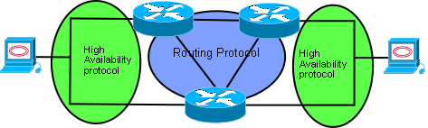
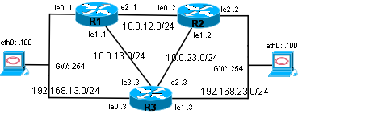

In this example, routers R1 and R3 are configured with Xorp and ucarp, while R2 is configured with Quagga and ucarp. The routing protocol is OSPF, set in a single backbone area. Two workstations are set up, one in each LAN. They use ping for a preliminary test, and then an SSH connection to verify that the session stays alive.

## Lab diagram

### Abstract diagram



### IP diagram



## Lab setup

### Network setup

| Net name | Network Address range |
|----------|----------------------:|
| LAN13    |       192.168.13.0/24 |
| LAN23    |       192.168.23.0/24 |
| WAN12    |          10.0.12.0/24 |
| WAN13    |          10.0.13.0/24 |
| WAN23    |          10.0.23.0/24 |

### Router setup

| R1:   | If name | Ip address        |
|:------|:--------|-------------------|
| LAN13 | re0     | 192.168.13.1/24   |
| LAN13 | uCarp0  | 192.168.13.254/24 |
| WAN13 | re1     | 10.0.13.1/24      |
| WAN12 | re2     | 10.0.12.1/24      |

| R2:   | If name | Ip address        |
|:------|:--------|-------------------|
| WAN12 | re0     | 10.0.12.2/24      |
| WAN13 | re1     | 10.0.23.2/24      |
| LAN23 | re2     | 192.168.23.2/24   |
| LAN23 | uCarp0  | 192.168.23.254/24 |

| R3:   | If name | Ip address        |
|:------|:--------|-------------------|
| LAN13 | re0     | 192.168.13.3/24   |
| LAN13 | uCarp0  | 192.168.13.254/24 |
| LAN23 | re1     | 192.168.23.3/24   |
| LAN23 | uCarp1  | 192.168.23.254/24 |
| WAN23 | re2     | 10.0.23.3/24      |
| WAN13 | re3     | 10.0.13.3/24      |

I used the "BSDRP_0.31_full_i386_vga.img" file and QEMU 0.11.0 to virtualize the example.

Here are the characteristics of the routers:

| Hardware spec | VirtualBox command option |
|:--------------|---------------------------|
| 128 MB of RAM | --memory 128              |

QEMU command for the routers:

```
qemu -m 128 -hda R1.qcow \
    -net nic,macaddr=08:00:27:01:31:01,vlan=31 -net socket,mcast=230.10.0.1:3131,vlan=31 \
    -net nic,macaddr=08:00:27:01:13:01,vlan=13 -net socket,mcast=230.10.0.1:1313,vlan=13 \
    -net nic,macaddr=08:00:27:01:12:01,vlan=12 -net socket,mcast=230.10.0.1:1212,vlan=12 &

qemu -m 128 -hda R2.qcow \
     -net nic,macaddr=08:00:27:02:12:02,vlan=12 -net socket,mcast=230.10.0.1:1212,vlan=12 \
     -net nic,macaddr=08:00:27:02:23:02,vlan=23 -net socket,mcast=230.10.0.1:2323,vlan=23 \
     -net nic,macaddr=08:00:27:02:32:02,vlan=32 -net socket,mcast=230.10.0.1:3232,vlan=32 &

qemu -m 128 -hda R3.qcow \
     -net nic,macaddr=08:00:27:03:31:03,vlan=31 -net socket,mcast=230.10.0.1:3131,vlan=31 \
     -net nic,macaddr=08:00:27:03:32:03,vlan=32 -net socket,mcast=230.10.0.1:3232,vlan=32 \
     -net nic,macaddr=08:00:27:03:23:03,vlan=23 -net socket,mcast=230.10.0.1:2323,vlan=23 \
     -net nic,macaddr=08:00:27:03:13:03,vlan=13 -net socket,mcast=230.10.0.1:1313,vlan=13 &
```

Set up a workstation on each LAN with this IP configuration:

| Workstation | IP address        | Gateway        |
|:------------|:------------------|----------------|
| On LAN13    | 192.168.13.100/24 | 192.168.13.254 |
| On LAN23    | 192.168.23.100/24 | 192.168.23.254 |

## R1 configuration

Two main files set up the router: `/etc/rc.conf` and `/etc/local/xorp.conf`. To modify `/etc/rc.conf` we use the `vi` editor; to modify `/etc/local/xorp.conf` we use the `xorpsh` CLI.

### R1 rc.conf

Modifications to the rc.conf:

```
# Hostname
hostname="R1XORP.lab"

# Configuration of uCARP
ucarp_enable="YES"
ucarp_if="re0"
ucarp_src="192.168.13.1"
ucarp_vhid="1"
ucarp_pass="bsdrp"
ucarp_preempt="NO"
ucarp_addr="192.168.13.254"
ucarp_shutdown="NO"
ucarp_facility="daemon"

# Do not start Quagga
quagga_enable="NO"

# starting XORP
xorp_enable="YES"
```

### R1 xorp.conf

There are two ways to enter the Xorp configuration. The first, which also applies to many other configuration files, is to use a text editor and paste the configuration into it. The second is to use a dedicated shell, launched with `xorpsh` for Xorp and `vtysh` for Quagga. Since both Xorp and Quagga provide a shell to enter new configuration and parse the commands, I recommend using the shell.

Xorp has a JunOS-like interface. All configuration is done in configuration mode, entered with the `configure` command. The configuration is highly structured, so configuring the router means setting values inside a structure. The `set` command creates and sets a value; the `edit` command navigates into the structure.

Launch the shell and enter configuration mode:

```
[root@R1XORP]~#xorpsh
Welcome to XORP on R1XORP.lab
root@R1XORP.lab> configure
Entering configuration mode.
There are no other users in configuration mode.
[edit]
root@R1XORP.lab#
```

Set an IP address on an interface:

```
root@R1XORP.lab# set interfaces interface re0 vif re0 address 192.168.13.1 prefix-length 24
```

This looks a little long at first, but we can split it into a more readable sequence of commands:

```
root@R1XORP.lab# edit interfaces interface re0
[edit interfaces interface re0]
root@R1XORP.lab#
```

At this point we are inside the `interfaces interface re0` structure. First create a virtual interface called `vif`, which in this case will hold the IP protocol and its address.

```
root@R1XORP.lab# set vif re0
[edit interfaces interface re0]
root@R1XORP.lab# set vif re0 address 192.168.13.1
```

We can go deeper in the structure to set the mask:

```
root@R1XORP.lab# edit vif re0 address 192.168.13.1
[edit interfaces interface re0 vif re0 address 192.168.13.1]
root@R1XORP.lab# set prefix-length 24
```

Or do it on a single line: `set interfaces interface re0 vif re0 address 192.168.13.1 prefix-length 24`.

The same rules apply to the rest of the configuration. Two very useful tools when building the configuration: autocompletion with the `tab` key, and contextual help with the `?` key.

Here is the target configuration:

```
    protocols {
        ospf4 {
            router-id: 1.1.1.1
            area 0.0.0.0 {
                interface re1 {
                    vif re1 {
                        address 10.0.13.1 {
                        }
                    }
                }
                interface re2 {
                    vif re2 {
                        address 10.0.12.1 {
                        }
                    }
                }
            }
            export: "redis.connect"
        }
    }
    policy {
        policy-statement "redis.connect" {
            term connect {
                from {
                    protocol: "connected"
                }
            }
        }
    }
    fea {
        unicast-forwarding4 {
        }
    }
    interfaces {
        interface re1 {
            description: "WAN13"
            vif re1 {
                address 10.0.13.1 {
                    prefix-length: 24
                }
            }
        }
        interface re2 {
            description: "WAN12"
            vif re2 {
                address 10.0.12.1 {
                    prefix-length: 24
                }
            }
        }
        interface re0 {
            description: "LAN13"
            vif re0 {
                address 192.168.13.1 {
                    prefix-length: 24
                }
            }
        }
        interface lo0 {
            vif lo0 {
                address 1.1.1.1 {
                    prefix-length: 32
                }
            }
        }
    }
```

Once this configuration is entered, it must be committed. It is only prepared, not yet applied. Use the `commit` command to push this draft configuration into the operational configuration of the router.

```
root@R1XORP.lab# commit
OK
[edit]
root@R1XORP.lab#
```

It must be saved to the default file so the configuration is loaded on the next reboot:

```
root@R1XORP.lab# save /etc/local/xorp.conf
```

Once R1 is done, save the configuration:

```
[root@R1XORP]~#config save
```

## R2 configuration

R2 is set up with Quagga and carp. To configure uCarp we edit `/etc/rc.conf`. To configure Quagga we check `/etc/rc.conf` to confirm the service is started with the correct options at boot, and we use the `vtysh` command to enter the configuration.

### R2 rc.conf

Edit `/etc/rc.conf` with the `vi` editor to change the values and check the Quagga and Xorp configuration settings.

```
# Hostname
hostname="R2Quagga.lab" # Hostname

# Configuration of uCARP
ucarp_enable="YES"
ucarp_if="re0"
ucarp_src="192.168.23.2"
ucarp_vhid="2"
ucarp_pass="passucarp"
ucarp_preempt="NO"
ucarp_addr="192.168.23.254"
ucarp_shutdown="NO"
ucarp_facility="daemon"

# Start Quagga and all routings daemons
quagga_enable="YES"
quagga_flags="-d"
quagga_daemons="zebra ripd ripngd ospfd ospf6d bgpd isisd"

# Uncomment for starting XORP
#xorp_enable="YES"
```

### R2 Quagga

To introduce the configuration into Quagga, it is highly recommended to use the shell provided by `vtysh`. It parses the initial configuration and saves it to a file that can then be copied, saved, and restored.

To enter the configuration, switch to configuration mode, navigate to the right structure, and enter the configuration commands. Here is an example to set an interface IP address:

```
[root@R2Quagga]~#vtysh

Hello, this is Quagga (version 0.99.14).
Copyright 1996-2005 Kunihiro Ishiguro, et al.

R2Quagga.lab# configure terminal
R2Quagga.lab(config)# interface re1
R2Quagga.lab(config-if)# ip address 10.0.23.2/24
R2Quagga.lab(config-if)#
```

The same rules apply to the rest of the configuration. Two very useful tools when building the configuration: autocompletion with the `tab` key, and contextual help with the `?` key.

Here is the target configuration:

```
!
debug ospf6 lsa unknown
!
interface carp1
!
interface re0
 ip address 10.0.12.2/24
 ipv6 nd suppress-ra
!
interface re1
 ip address 10.0.23.2/24
 ipv6 nd suppress-ra
!
interface re2
 ip address 192.168.23.2/24
 ipv6 nd suppress-ra
!
interface lo0
!
interface pflog0
 ipv6 nd suppress-ra
!
interface pfsync0
 ipv6 nd suppress-ra
!
router ospf
 ospf router-id 2.2.2.2
 redistribute connected
 network 10.0.12.0/24 area 0.0.0.0
 network 10.0.13.0/24 area 0.0.0.0
!
ip forwarding
ipv6 forwarding
!
line vty
!
end
```

Once the configuration is entered it is active; there is no commit step like in Xorp, but it must be saved.

```
R2Quagga.lab# write memory
Building Configuration...
Configuration saved to /usr/local/etc/quagga/zebra.conf
Configuration saved to /usr/local/etc/quagga/ripd.conf
Configuration saved to /usr/local/etc/quagga/ripngd.conf
Configuration saved to /usr/local/etc/quagga/ospfd.conf
Configuration saved to /usr/local/etc/quagga/ospf6d.conf
Configuration saved to /usr/local/etc/quagga/bgpd.conf
Configuration saved to /usr/local/etc/quagga/isisd.conf
[OK]
R2Quagga.lab#
```

Then save the full configuration of the router:

```
[root@R2Quagga]~#config save
```

## R3 configuration

R3 is set up like R1, with Xorp and carp. The main difference is that it has two carp interfaces. We might also want to make it the preferred router for traffic between the two LANs by setting a better `advskew` value for carp, and enabling preemption so it resumes its master role after a failure. Preemption is optional.

### R3 rc.conf

Here are the rc.conf modifications that should be present:

```
# Hostname
hostname="R3XORP.lab" # Hostname

ifconfig_re0="192.168.13.3/24"
ifconfig_re1="192.168.23.3/24"

# Configuration of uCARP
ucarp_enable="YES"
ucarp_if="re0"
ucarp_src="192.168.13.3"
ucarp_vhid="1"
ucarp_pass="bsdrp"
ucarp_preempt="NO"
ucarp_addr="192.168.13.254"
ucarp_shutdown="NO"
ucarp_facility="daemon"

/usr/local/sbin/ucarp -i re1 -v 2 -p passucarp -f daemon -B -s 192.168.23.3 -a 192.168.23.254

# Do not start Quagga 
quagga_enable="NO"

# starting XORP
xorp_enable="YES"
```

### R3 xorp.conf

As with R1, we configure R3 using `xorpsh`, then save the configuration to `/etc/local/xorp.conf`. Here is the final configuration:

```
    protocols {
        ospf4 {
            router-id: 3.3.3.3
            area 0.0.0.0 {
                interface re2 {
                    vif re2 {
                        address 10.0.23.3 {
                        }
                    }
                }
                interface re3 {
                    vif re3 {
                        address 10.0.13.3 {
                        }
                    }
                }
            }
            export: "redis_connect"
        }
    }
    policy {
        policy-statement "redis_connect" {
            term connect {
                from {
                    protocol: "connected"
                }
            }
        }
    }
    fea {
        unicast-forwarding4 {
        }
    }
    interfaces {
        interface re0 {
            vif re0 {
                address 192.168.13.3 {
                    prefix-length: 24
                }
            }
        }
        interface re1 {
            vif re1 {
                address 192.168.23.3 {
                    prefix-length: 24
                }
            }
        }
        interface re2 {
            vif re2 {
                address 10.0.23.3 {
                    prefix-length: 24
                }
            }
        }
        interface re3 {
            vif re3 {
                address 10.0.13.3 {
                    prefix-length: 24
                }
            }
        }
    }
```

## Validation

Check the interface status at the system level with the `ifconfig` command. Verify that the IP address is correct, and look at the MAC address for troubleshooting. Make sure the status is active for the physical interface, and that ucarp is either Master or Backup.

### Example at R3XORP

```
[root@R3XORP]~#ifconfig re0
re0: flags=8943<UP,BROADCAST,RUNNING,PROMISC,SIMPLEX,MULTICAST> metric 0 mtu 1500
        options=8<VLAN_MTU>
        ether 08:00:27:04:85:5a
        inet6 fe80::a00:27ff:fe04:855a%re0 prefixlen 64 scopeid 0x1
        inet 192.168.13.3 netmask 0xffffff00 broadcast 192.168.13.255
        media: Ethernet autoselect
        status: active
[root@R3XORP]~#ifconfig re1
re1: flags=8943<UP,BROADCAST,RUNNING,PROMISC,SIMPLEX,MULTICAST> metric 0 mtu 1500
        options=8<VLAN_MTU>
        ether 08:00:27:b3:54:6c
        inet6 fe80::a00:27ff:feb3:546c%re1 prefixlen 64 scopeid 0x2
        inet 192.168.23.3 netmask 0xffffff00 broadcast 192.168.23.255
        media: Ethernet autoselect
        status: active
[root@R3XORP]~#ifconfig re2
re2: flags=8843<UP,BROADCAST,RUNNING,SIMPLEX,MULTICAST> metric 0 mtu 1500
        options=8<VLAN_MTU>
        ether 08:00:27:d3:92:96
        inet 10.0.23.3 netmask 0xffffff00 broadcast 10.0.23.255
        inet6 fe80::a00:27ff:fed3:9296%re2 prefixlen 64 scopeid 0x3
        media: Ethernet autoselect
        status: active
[root@R3XORP]~#ifconfig re3
re3: flags=8843<UP,BROADCAST,RUNNING,SIMPLEX,MULTICAST> metric 0 mtu 1500
        options=8<VLAN_MTU>
        ether 08:00:27:0a:cc:24
        inet 10.0.13.3 netmask 0xffffff00 broadcast 10.0.13.255
        inet6 fe80::a00:27ff:fe0a:cc24%re3 prefixlen 64 scopeid 0x4
        media: Ethernet autoselect
        status: active
[root@R3XORP]~#cat /var/log/messages | grep ucarp
Mar 20 14:02:24 R3XORP ucarp[891]: [WARNING] Warning: no script called when going up
Mar 20 14:02:24 R3XORP ucarp[891]: [WARNING] Warning: no script called when going down
Mar 20 14:02:24 R3XORP ucarp[892]: [WARNING] Switching to state: BACKUP 
Mar 20 14:02:25 R3XORP ucarp[1310]: [WARNING] Warning: no script called when going up
Mar 20 14:02:25 R3XORP ucarp[1311]: [WARNING] Warning: no script called when going down
Mar 20 14:02:25 R3XORP ucarp[1311]: [WARNING] Switching to state: BACKUP
[root@R3XORP]~#
```

On R3XORP, Xorp is running, so we check the OSPF configuration and the routing table at the Xorp level. The `show ospf4 neighbor` command displays the neighbor adjacencies of R3. We have R2 with ID 2.2.2.2 connected through interface re2 (vif re2) at address 10.0.23.2, and R1 with ID 1.1.1.1 connected through interface re3 (vif re3) at address 10.0.13.1.

```
[root@R3XORP]~#xorpsh
Welcome to XORP on R3XORP.lab
root@R3XORP.lab> show ospf4 neighbor
  Address         Interface             State      ID              Pri  Dead
10.0.23.2        re2/re2                Full      2.2.2.2            1    37
10.0.13.1        re3/re3                Full      1.1.1.1          128    33
```

Then check the routing table:

```
root@R3XORP.lab> show route table ipv4  unicast final
10.0.12.0/24    [ospf(110)/2]
                > to 10.0.13.1 via re3/re3
10.0.13.0/24    [connected(0)/0]
                > via re3/re3
10.0.23.0/24    [connected(0)/0]
                > via re2/re2
192.168.13.0/24 [connected(0)/0]
                > via re0/re0
192.168.23.0/24 [connected(0)/0]
                > via re1/re1
```

Then check the routes learned by the OSPF process:

```
root@R3XORP.lab> show route table ipv4  unicast ospf
10.0.12.0/24    [ospf(110)/2]
                > to 10.0.13.1 via re3/re3
192.168.13.0/24 [ospf(110)/1]
                > to 10.0.13.1 via re3/re3
192.168.23.0/24 [ospf(110)/1]
                > to 10.0.23.2 via re2/re2
```

Also check that these routes are correctly redistributed into the system:

```
[root@R3XORP]~#netstat -r
Routing tables

Internet:
Destination        Gateway            Flags    Refs      Use  Netif Expire
10.0.12.0          10.0.13.1          UG1         0        0    re3
10.0.13.0          link#4             UC          0        0    re3
10.0.23.0          link#3             UC          0        0    re2
10.0.23.2          08:00:27:f1:fb:92  UHLW        1        4    re2    741
localhost          localhost          UH          0   156211    lo0
192.168.13.0       link#1             UC          0        0    re0
192.168.13.100     08:00:27:00:4c:ea  UHLW        1      357    re0   1177
192.168.23.0       link#2             UC          0        0    re1
192.168.23.254     192.168.23.254     UH          0        0  carp1
```

The same routing check on R1XORP:

```
[root@R1XORP]~#netstat -r
Routing tables

Internet:
Destination        Gateway            Flags    Refs      Use  Netif Expire
10.0.12.0          link#3             UC          0        0    re2
10.0.12.2          08:00:27:23:7e:12  UHLW        1        0    re2    699
10.0.13.0          link#2             UC          0        0    re1
10.0.23.0          10.0.13.3          UG1         0        0    re1
localhost          localhost          UH          0   378733    lo0
192.168.13.0       link#1             UC          0        0    re0
192.168.13.100     08:00:27:00:4c:ea  UHLW        1       42    re0   1189
192.168.13.254     192.168.13.254     UH          0        0  carp0
192.168.23.0       10.0.13.3          UG1         0        0    re1

[root@R1XORP]~#xorpsh
Welcome to XORP on R1XORP.lab
root@R1XORP.lab> show ospf4 neighbor
  Address         Interface             State      ID              Pri  Dead
10.0.13.3        re1/re1                Full      3.3.3.3          128    38
10.0.12.2        re2/re2                Full      2.2.2.2            1    31
root@R1XORP.lab> show route table ipv4 unicast final
10.0.12.0/24    [connected(0)/0]
                > via re2/re2
10.0.13.0/24    [connected(0)/0]
                > via re1/re1
10.0.23.0/24    [ospf(110)/2]
                > to 10.0.13.3 via re1/re1
192.168.13.0/24 [connected(0)/0]
                > via re0/re0
192.168.23.0/24 [ospf(110)/1]
                > to 10.0.13.3 via re1/re1
root@R1XORP.lab> show route table ipv4 unicast ospf
10.0.23.0/24    [ospf(110)/2]
                > to 10.0.13.3 via re1/re1
192.168.13.0/24 [ospf(110)/1]
                > to 10.0.13.3 via re1/re1
192.168.23.0/24 [ospf(110)/1]
                > to 10.0.13.3 via re1/re1
```

Run the same checks on R2Quagga, using the Quagga routing interface to extract the same information.

Check the OSPF neighbors:

```
[root@R2Quagga]~#vtysh

Hello, this is Quagga (version 0.99.14).
Copyright 1996-2005 Kunihiro Ishiguro, et al.

R2Quagga.lab# sh ip ospf neighbor

    Neighbor ID Pri State           Dead Time Address         Interface            RXmtL RqstL DBsmL
1.1.1.1         128 Full/DR           34.894s 10.0.12.1       re0:10.0.12.2            0     0     0
3.3.3.3         128 Full/DR           35.119s 10.0.23.3       re1:10.0.23.2            0     0     0
R2Quagga.lab#
```

Check the IP routing table:

```
R2Quagga.lab# sh ip route
Codes: K - kernel route, C - connected, S - static, R - RIP, O - OSPF,
       I - ISIS, B - BGP, > - selected route, * - FIB route

O   10.0.12.0/24 [110/10] is directly connected, re0, 00:54:08
C>* 10.0.12.0/24 is directly connected, re0
O>* 10.0.13.0/24 [110/11] via 10.0.12.1, re0, 00:28:41
                          via 10.0.23.3, re1, 00:28:41
O   10.0.23.0/24 [110/10] is directly connected, re1, 00:28:41
C>* 10.0.23.0/24 is directly connected, re1
C>* 127.0.0.0/8 is directly connected, lo0
O>* 192.168.13.0/24 [110/0] via 10.0.12.1, re0, 00:28:41
                            via 10.0.23.3, re1, 00:28:41
O   192.168.23.0/24 [110/0] via 10.0.23.3, re1, 00:28:40
C * 192.168.23.0/24 is directly connected, carp1
C>* 192.168.23.0/24 is directly connected, re2
```

Check the OSPF routes learned:

```
R2Quagga.lab# sh ip route  ospf
Codes: K - kernel route, C - connected, S - static, R - RIP, O - OSPF,
       I - ISIS, B - BGP, > - selected route, * - FIB route

O   10.0.12.0/24 [110/10] is directly connected, re0, 01:53:53
O>* 10.0.13.0/24 [110/11] via 10.0.12.1, re0, 01:28:26
                          via 10.0.23.3, re1, 01:28:26
O   10.0.23.0/24 [110/10] is directly connected, re1, 01:28:26
O>* 192.168.13.0/24 [110/0] via 10.0.12.1, re0, 01:28:26
                            via 10.0.23.3, re1, 01:28:26
O   192.168.23.0/24 [110/0] via 10.0.23.3, re1, 01:28:25
```

Check the system routing table:

```
[root@R2Quagga]~#netstat -nr
Routing tables

Internet:
Destination        Gateway            Flags    Refs      Use  Netif Expire
10.0.12.0/24       link#1             UC          0        0    re0
10.0.12.1          08:00:27:16:44:59  UHLW        2        0    re0   1175
10.0.13.0/24       10.0.12.1          UG1         0        0    re0
10.0.23.0/24       link#2             UC          0        0    re1
127.0.0.1          127.0.0.1          UH          0       87    lo0
192.168.13.0/24    10.0.12.1          UG1         0       50    re0
192.168.23.0/24    link#3             UC          0        0    re2
```

### DR and BDR

Check the DR and BDR with the following command:

```
root@R3XORP.lab> show ospf4 neighbor detail
  Address         Interface             State      ID              Pri  Dead
10.0.23.2        re2/re2                Full      2.2.2.2            1    36
  Area 0.0.0.0, opt 0x2, DR 10.0.23.3, BDR 10.0.23.2
  Up 00:25:18, adjacent 00:25:11
10.0.13.1        re3/re3                Full      1.1.1.1          128    37
  Area 0.0.0.0, opt 0x2, DR 10.0.13.1, BDR 10.0.13.3
  Up 00:52:52, adjacent 00:52:47

root@R1XORP.lab> show ospf4 neighbor detail
  Address         Interface             State      ID              Pri  Dead
10.0.13.3        re1/re1                Full      3.3.3.3          128    33
  Area 0.0.0.0, opt 0x2, DR 10.0.13.1, BDR 10.0.13.3
  Up 01:53:05, adjacent 00:54:17
10.0.12.2        re2/re2                Full      2.2.2.2            1    39
  Area 0.0.0.0, opt 0x2, DR 10.0.12.1, BDR 10.0.12.2
  Up 01:53:03, adjacent 00:51:57
```

By default, we might assume that the DR between R2Quagga and R3XORP would be R2Quagga, but R3XORP is the DR. The default priority value is not the same in Quagga and Xorp.

#### Priority default value

One difference between the Xorp and Quagga implementations shows up at the OSPF level. The neighbor command displays different priority settings, even though we did not set the priority during configuration.

```
root@R3XORP.lab> show ospf4 neighbor
  Address         Interface             State      ID              Pri  Dead
10.0.23.2        re2/re2                Full      2.2.2.2            1    37
10.0.13.1        re3/re3                Full      1.1.1.1          128    33
```

By default, Xorp sets the OSPF interface priority to 128, as we can see in the extract below from R1XORP:

```
root@R1XORP.lab# show -all
    protocols {
        ospf4 {
            router-id: 1.1.1.1
            rfc1583-compatibility: false
            ip-router-alert: false
            area 0.0.0.0 {
                area-type: "normal"
                interface re1 {
                    link-type: "broadcast"
                    vif re1 {
                        address 10.0.13.1 {
                            priority: 128
                            hello-interval: 10
                            router-dead-interval: 40
                            interface-cost: 1
                            retransmit-interval: 5
                            transit-delay: 1
                            disable: false
                        }
                    }
                }
                interface re2 {
                    link-type: "broadcast"
                    vif re2 {
                        address 10.0.12.1 {
                            priority: 128
                            hello-interval: 10
                            router-dead-interval: 40
                            interface-cost: 1
                            retransmit-interval: 5
                            transit-delay: 1
                            disable: false
                        }
                    }
                }
            }
            export: "redis.connect"
        }
    }
```

In contrast, the interface on the Quagga router has a priority of 1. So R2 will not become DR against the Xorp default (higher priority wins).

```
R2Quagga.lab# sh ip ospf interface re0
re0 is up
  ifindex 1, MTU 1500 bytes, BW 0 Kbit <UP,BROADCAST,RUNNING,SIMPLEX,MULTICAST>
  Internet Address 10.0.12.2/24, Broadcast 10.0.12.255, Area 0.0.0.0
  MTU mismatch detection:enabled
  Router ID 2.2.2.2, Network Type BROADCAST, Cost: 10
  Transmit Delay is 1 sec, State Backup, Priority 1
  Designated Router (ID) 1.1.1.1, Interface Address 10.0.12.1
  Backup Designated Router (ID) 2.2.2.2, Interface Address 10.0.12.2
  Multicast group memberships: OSPFAllRouters OSPFDesignatedRouters
  Timer intervals configured, Hello 10s, Dead 40s, Wait 40s, Retransmit 5
    Hello due in 9.406s
  Neighbor Count is 1, Adjacent neighbor count is 1
```

## Failover and behavior

By default the lab is set to use the best path, so traffic from LAN13 to LAN23 should go through R3 as the shortest path. To make that happen, either start R3 first or enable preemption.

Check from the workstation (Windows) on LAN13:

```
E:\BSDRP>tracert -d 192.168.23.100

Détermination de l'itinéraire vers 192.168.23.100 avec un maximum de 30 sauts.

  1     5 ms    35 ms    <1 ms  192.168.13.3
  2    24 ms     2 ms     1 ms  192.168.23.100

Itinéraire déterminé.

E:\BSDRP>ping 192.168.23.100

Envoi d'une requête 'ping' sur 192.168.23.100 avec 32 octets de données :

Réponse de 192.168.23.100 : octets=32 temps=40 ms TTL=63
Réponse de 192.168.23.100 : octets=32 temps=4 ms TTL=63
Réponse de 192.168.23.100 : octets=32 temps=15 ms TTL=63
Réponse de 192.168.23.100 : octets=32 temps=5 ms TTL=63

Statistiques Ping pour 192.168.23.100:
    Paquets : envoyés = 4, reçus = 4, perdus = 0 (perte 0%),
Durée approximative des boucles en millisecondes :
    Minimum = 4ms, Maximum = 40ms, Moyenne = 16ms

E:\BSDRP>
```

Run the same command on the workstation on LAN23 to confirm the path is the same.

We can now try bringing the interfaces down and back up with the following commands.

Disconnect interface 1 (re0) on R3XORP and bring it back up:

```
[root@R3XORP]~# ifconfig re0 down
[root@R3XORP]~# ifconfig re0 up
```

Disconnect interface 2 (re1) on R3XORP and bring it back up:

```
[root@R3XORP]~# ifconfig re1 down
[root@R3XORP]~# ifconfig re1 up
```

To test the failover, run a ping command (Windows):

```
E:\BSDRP>ping -t 192.168.23.100

Envoi d'une requête 'ping' sur 192.168.23.100 avec 32 octets de données :

Réponse de 192.168.23.100 : octets=32 temps=46 ms TTL=63
Réponse de 192.168.23.100 : octets=32 temps=2 ms TTL=63
Réponse de 192.168.23.100 : octets=32 temps=12 ms TTL=63
Réponse de 192.168.23.100 : octets=32 temps=4 ms TTL=63
Réponse de 192.168.23.100 : octets=32 temps=4 ms TTL=63
Réponse de 192.168.23.100 : octets=32 temps=15 ms TTL=63
Réponse de 192.168.23.100 : octets=32 temps=4 ms TTL=63
Réponse de 192.168.23.100 : octets=32 temps=4 ms TTL=63
Réponse de 192.168.23.100 : octets=32 temps=4 ms TTL=63
Réponse de 192.168.23.100 : octets=32 temps=4 ms TTL=63
Réponse de 192.168.23.100 : octets=32 temps=15 ms TTL=63
Réponse de 192.168.23.100 : octets=32 temps=2 ms TTL=63
Réponse de 192.168.23.100 : octets=32 temps=13 ms TTL=63
Réponse de 192.168.23.100 : octets=32 temps=5 ms TTL=63
Réponse de 192.168.23.100 : octets=32 temps=4 ms TTL=63
Réponse de 192.168.23.100 : octets=32 temps=15 ms TTL=63
Réponse de 192.168.23.100 : octets=32 temps=5 ms TTL=63
Réponse de 192.168.23.100 : octets=32 temps=4 ms TTL=63
Réponse de 192.168.23.100 : octets=32 temps=2 ms TTL=63
Délai d'attente de la demande dépassé.
Réponse de 192.168.23.100 : octets=32 temps=6 ms TTL=62
Réponse de 192.168.23.100 : octets=32 temps=5 ms TTL=62
Réponse de 192.168.23.100 : octets=32 temps=3 ms TTL=62
Réponse de 192.168.23.100 : octets=32 temps=14 ms TTL=62
Réponse de 192.168.23.100 : octets=32 temps=5 ms TTL=62
Réponse de 192.168.23.100 : octets=32 temps=4 ms TTL=62
Réponse de 192.168.23.100 : octets=32 temps=5 ms TTL=62
Réponse de 192.168.23.100 : octets=32 temps=5 ms TTL=62
Réponse de 192.168.23.100 : octets=32 temps=4 ms TTL=62
Réponse de 192.168.23.100 : octets=32 temps=15 ms TTL=62
Réponse de 192.168.23.100 : octets=32 temps=5 ms TTL=62
Réponse de 192.168.23.100 : octets=32 temps=3 ms TTL=62
Réponse de 192.168.23.100 : octets=32 temps=14 ms TTL=62
```

In this run we lose one packet. In the simulated environment extra latency can be added, and some other runs show no packet loss.

If we enable ucarp preemption on R3XORP, then when we bring the interface back up, R3XORP reclaims its master role and we return to the initial state.
