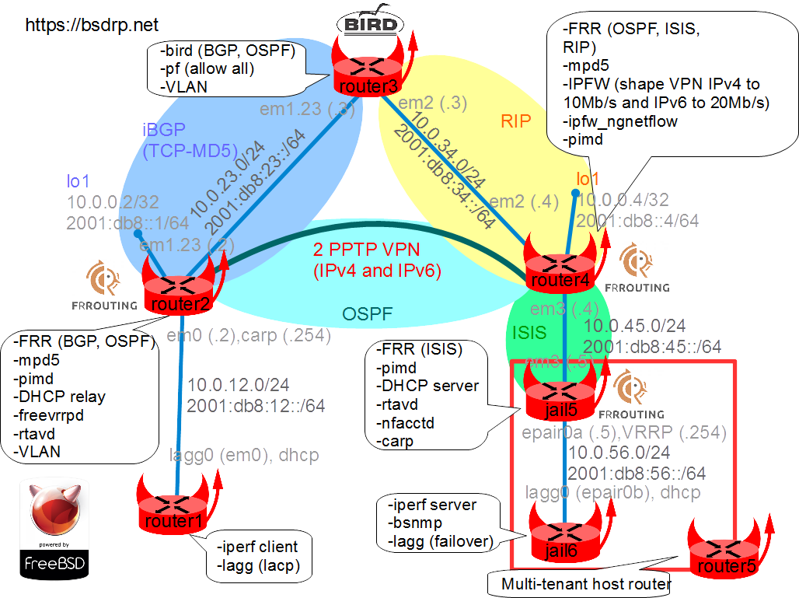

This lab is used to test BSDRP before each new release.

## Overview

### Network diagram

Here is the logical and physical view:



## Setting up the lab

### Downloading BSD Router Project images

[Download the BSDRP serial image](../../downloads.md) (which avoids the need for an X display).

### Download lab scripts

More information on the BSDRP lab scripts is available in [How to build a BSDRP router lab](how-to-build-a-bsdrp-router-lab.md).

Start the lab with full-meshed 6 routers.

An example with bhyve under FreeBSD:

```
tools/BSDRP-lab-bhyve.sh -i /usr/obj/BSDRP.amd64/BSDRP-1.80-full-amd64-serial.img.xz -n 5
Setting-up a virtual lab with 5 VM(s):
- Working directory: /tmp/BSDRP
- Each VM have 1 core(s) and 256M RAM
- Emulated NIC: e1000
- Switch mode: bridge + tap
- 0 LAN(s) between all VM
- Full mesh Ethernet links between each VM
VM 1 have the following NIC:
- em0 connected to VM 2
- em1 connected to VM 3
- em2 connected to VM 4
- em3 connected to VM 5
VM 2 have the following NIC:
- em0 connected to VM 1
- em1 connected to VM 3
- em2 connected to VM 4
- em3 connected to VM 5
VM 3 have the following NIC:
- em0 connected to VM 1
- em1 connected to VM 2
- em2 connected to VM 4
- em3 connected to VM 5
VM 4 have the following NIC:
- em0 connected to VM 1
- em1 connected to VM 2
- em2 connected to VM 3
- em3 connected to VM 5
VM 5 have the following NIC:
- em0 connected to VM 1
- em1 connected to VM 2
- em2 connected to VM 3
- em3 connected to VM 4
To connect VM'serial console, you can use:
- VM 1 : cu -l /dev/nmdm-BSDRP.1B
- VM 2 : cu -l /dev/nmdm-BSDRP.2B
- VM 3 : cu -l /dev/nmdm-BSDRP.3B
- VM 4 : cu -l /dev/nmdm-BSDRP.4B
- VM 5 : cu -l /dev/nmdm-BSDRP.5B
```

## Router configuration

Configure the routers in this order to avoid DHCP client timeout problems.

All these routers can be configured with the labconfig tool (use it only in a lab, because it will replace your current running configuration):

```
labconfig full_vm[VM-NUMBER]
```

### Router 5 (including jail5 and jail6)

You can use the script `labconfig vm5` to push the full configuration automatically:

```
sysrc hostname=R5 \
 ifconfig_em3=up \
 cloned_interfaces=epair0 \
 ifconfig_epair0a=up \
 kld_list+=" if_lagg carp"
ifconfig -l | grep -q vtnet && sed -i "" 's/em/vtnet/g' /etc/rc.conf
cat > /etc/devfs.rules <<EOF
[devfsrules_jailpf=4]
add include \$devfsrules_hide_all
add include \$devfsrules_unhide_basic
add include \$devfsrules_unhide_login
add path 'bpf*' unhide
EOF

hostname R5
service devfs restart
service netif restart
service kld start
if ifconfig -l | grep -q vtnet; then
    tenant -c -j jail5 -i vtnet3,epair0a
else
    tenant -c -j jail5 -i em3,epair0a
fi
tenant -c -j jail6 -i epair0b
sysrc -f /etc/jails/jail5/rc.conf hostname=jail5 \
 ifconfig_em3="inet 10.0.45.5/24" \
 ifconfig_em3_ipv6="inet6 2001:db8:45::5 prefixlen 64" \
 ifconfig_epair0a="10.0.56.5/24" \
 ifconfig_epair0a_ipv6="inet6 2001:db8:56::5 prefixlen 64" \
 ifconfig_epair0a_alias0="inet 10.0.56.254/32 vhid 1 pass testpass" \
 ifconfig_epair0a_alias1="inet6 2001:db8:56::fe prefixlen 128 vhid 1 pass testpass" \
 rtadvd_enable=YES \
 rtadvd_interfaces=epair0a \
 dhcpd_enable=YES \
 dhcpd_flags="-q" \
 dhcpd_conf="/usr/local/etc/dhcpd.conf" \
 frr_enable=YES \
 frr_vtysh_boot=YES \
 nfacctd_enable=YES \
 pimd_enable=YES
ifconfig -l | grep -q vtnet && sed -i "" 's/em/vtnet/g' /etc/jails/jail5/rc.conf
mkdir -p /etc/jails/jail5/local/frr
cat > /etc/jails/jail5/local/dhcpd.conf <<EOF
option domain-name "bsdrp.net";
default-lease-time 600;
max-lease-time 7200;
ddns-update-style none;
#Declare useless network
subnet 10.0.45.0 netmask 255.255.255.0 {
}

#Declare R1 LAN and gateway
subnet 10.0.12.0 netmask 255.255.255.0 {
  range 10.0.12.1 10.0.12.1;
  option routers 10.0.12.254;
}
#Declare R6 subnet and gateway
subnet 10.0.56.0 netmask 255.255.255.0 {
  range 10.0.56.6 10.0.56.6;
  option routers 10.0.56.254;
}
EOF

cat > /etc/jails/jail5/local/frr/frr.conf <<EOF
frr version 7.0
frr defaults traditional
hostname jail5
log syslog
!
interface em3
 ip router isis BSDRP
 ipv6 router isis BSDRP
!
interface epair0a
 ip router isis BSDRP
 ipv6 router isis BSDRP
 isis passive
!
interface vtnet3
 ip router isis BSDRP
 ipv6 router isis BSDRP
!
router isis BSDRP
 is-type level-1-2
 net 49.0001.1720.1600.5005.00
!
line vty
!
bfd
!
EOF

ifconfig -l | grep -q vtnet && sed -i "" 's/em/vtnet/g' /etc/jails/jail5/local/frr/frr.conf
chown frr:frr /etc/jails/jail5/local/frr

cat > /etc/jails/jail5/local/nfacctd.conf<<EOF
daemonize: true
syslog: daemon
!
! interested in in and outbound traffic
aggregate: src_host,dst_host
nfacctd_ip: 10.0.45.5
nfacctd_port: 2055
aggregate[ip]: src_host, dst_host, timestamp_start, timestamp_end, src_port, dst_port, proto, src_as, dst_as, peer_src_ip
plugins: print[ip]
print_output: csv
print_refresh_time: 300
print_history: 5m
print_output_file[ip]: /tmp/file-%Y%m%d-%H%M.txt
print_history_roundoff: m
print_output_file_append: true
files_umask: 022
EOF

sysrc -f /etc/jails/jail6/rc.conf hostname=jail6 \
 ifconfig_epair0b="up" \
 cloned_interfaces="lagg0" \
 ifconfig_lagg0="laggproto failover laggport epair0b SYNCDHCP" \
 ifconfig_lagg0_ipv6="inet6 accept_rtadv" \
 rtsold_enable=YES \
 bsnmpd_enable=YES \
 gateway_enable=NO \
 ipv6_gateway_enable=NO
service jail start
```

### Router 2

You can use the script `labconfig vm2` to push the full configuration automatically:

```
sysrc hostname=R2
sysrc rtadvd_enable=YES
sysrc rtadvd_interfaces="em0"
sysrc vlans_em1="23"
sysrc ifconfig_em1="up mtu 1528"
sysrc ifconfig_em0="inet 10.0.12.2/24"
sysrc ifconfig_em0_ipv6="inet6 2001:db8:12::2 prefixlen 64"
sysrc ifconfig_em1_23="inet 10.0.23.2/24"
sysrc ifconfig_em1_23_ipv6="inet6 2001:db8:23::2 prefixlen 64"
sysrc cloned_interfaces="lo1"
sysrc ifconfig_lo1="inet 10.0.0.2/32"
sysrc ifconfig_lo1_ipv6="inet6 2001:db8::2 prefixlen 128"
sysrc frr_enable=YES
sysrc frr_vtysh_boot=YES
sysrc dhcprelya_enable=YES
sysrc dhcprelya_servers="10.0.45.5"
sysrc dhcprelya_ifaces=em0
sysrc mpd_enable=YES
sysrc mpd_flags="-b -s ppp"
sysrc ipsec_enable=YES
sysrc ipsec_file="/etc/ipsec.conf"
sysrc pimd_enable=YES
sysrc freevrrpd_enable=YES
ifconfig -l | grep -q vtnet && sed -i "" 's/em/vtnet/g' /etc/rc.conf

cat > /usr/local/etc/freevrrpd.conf <<EOF
[VRID]
serverid = 1
interface = em0
# We want that this router is the master
priority = 101
addr = 10.0.12.254/24
password = vrid1
EOF

ifconfig -l | grep -q vtnet && sed -i "" 's/em/vtnet/g' /usr/local/etc/freevrrpd.conf

cat > /usr/local/etc/mpd5/if-up.sh <<EOF
#!/bin/sh
set -e
logger "\$0 called with parameters: \$@"
if [ "\$2" == "inet6" ]; then
        if ifconfig \$1 \$2 2001:db8:24::2; then
        logger "\$0: \$cmd successfull"
        return 0
        else
        logger "\$0: \$cmd failed"
        return 1
        fi
else
        return 0
fi
EOF

chmod +x /usr/local/etc/mpd5/if-up.sh

cat > /usr/local/etc/mpd5/mpd.conf <<EOF
# Configuring a server PPTP VPN with tunnels to R4
default:
        load vpnipv4
        load vpnipv6
vpnipv4:
        # Create bundle called vpnipv4
        create bundle static vpnipv4
        # IP of client and server, on another subnet for avoiding problems
        set ipcp ranges 10.4.24.2/32 10.4.24.4/32
        # Remote LAN subnet: Learned by routing protocol
        #set iface route 10.0.45.0/24
        # Enable Microsoft Point-to-Point encryption (MPPE)
        set bundle enable compression
        set ccp yes mppc
        set mppc yes e40
        set mppc yes e128
        set bundle enable crypt-reqd
        set mppc yes stateless
        # Create a static pptp link called lvpnipv4
        create link static lvpnipv4 pptp
        # Attach this link to vpnipv4
        set link action bundle vpnipv4
        # Set somes link settings
        set link no pap
        set link yes chap
        set auth authname "VpnLogin4"
        # Reduce the size of the outgoing packet for avoiding fragmentation
        set link mtu 1460
        set link keep-alive 10 75
        # max-redial:
        # Server side, need to be "-1"
        # Client side, need to be positive (0 for allways)
        set link max-redial -1
        # Local WAN IP addresse
        set pptp self 10.0.0.2
        # Remote WAN IP addresse
        set pptp peer 10.0.0.4
        # Allow incoming call
        set link enable incoming
vpnipv6:
        # Create bundle called vpnipv6
        create bundle static vpnipv6
        # Don't know how to disable IPv4 ipcp
        set ipcp ranges 10.6.24.2/32 10.6.24.4/32
        # Enable IPv6
        set bundle enable ipv6cp
        # Remote LAN subnet: Learned by routing protocol
        #set iface route 2001:db8:45::/64
        # Need to statically set inet6 address
        set iface up-script /usr/local/etc/mpd5/if-up.sh
        # Enable Microsoft Point-to-Point encryption (MPPE)
        set bundle enable compression
        set ccp yes mppc
        set mppc yes e40
        set mppc yes e128
        set bundle enable crypt-reqd
        set mppc yes stateless
        # Create a static pptp link called lvpnipv4
        create link static lvpnipv6 pptp
        # Attach this link to vpnipv6
        set link action bundle vpnipv6
        # Set somes link settings
        set link no pap
        set link yes chap
        set auth authname "VpnLogin6"
        # Reduce the size of the outgoing packet for avoiding fragmentation
        set link mtu 1460
        set link keep-alive 10 75
        # max-redial:
        # Server side, need to be "-1"
        # Client side, need to be positive (0 for allways)
        set link max-redial -1
        # Local WAN IP addresse
        set pptp self 2001:db8::2
        # Remote WAN IP addresse
        set pptp peer 2001:db8::4
        # Allow incoming call
        set link enable incoming
EOF

cat > /usr/local/etc/mpd5/mpd.secret <<EOF
VpnLogin4       VpnPassword4
VpnLogin6       VpnPassword6
EOF

cat > /etc/ipsec.conf <<EOF
flush ;
add 10.0.23.2 10.0.23.3 tcp 0x1000 -A tcp-md5 "abigpassword" ;
add 10.0.23.3 10.0.23.2 tcp 0x1001 -A tcp-md5 "abigpassword" ;
add -6 2001:db8:23::2 2001:db8:23::3 tcp 0x1002 -A tcp-md5 "abigpassword" ;
add -6 2001:db8:23::3 2001:db8:23::2 tcp 0x1003 -A tcp-md5 "abigpassword" ;
EOF

cat > /usr/local/etc/frr/frr.conf <<EOF
frr version 7.0
frr defaults traditional
hostname R2
log syslog
!
interface ng0
 ip ospf message-digest-key 1 md5 superpass
 ip ospf network point-to-point
 ipv6 ospf6 passive
!
interface ng1
 ipv6 ospf6 network point-to-point
!
router-id 0.0.0.2
!
router bgp 100
 neighbor 10.0.23.3 remote-as 100
 neighbor 10.0.23.3 password abigpassword
 neighbor 2001:db8:23::3 remote-as 100
 neighbor 2001:db8:23::3 password abigpassword
 !
 address-family ipv4 unicast
  network 10.0.0.2/32
  neighbor 10.0.23.3 soft-reconfiguration inbound
  no neighbor 2001:db8:23::3 activate
 exit-address-family
 !
 address-family ipv6 unicast
  network 2001:db8::2/128
  neighbor 2001:db8:23::3 activate
  neighbor 2001:db8:23::3 soft-reconfiguration inbound
 exit-address-family
!
router ospf
 ospf router-id 0.0.0.2
 network 10.0.12.0/24 area 0.0.0.0
 network 10.4.24.0/24 area 0.0.0.0
 area 0.0.0.0 authentication message-digest
!
router ospf6
 interface ng1 area 0.0.0.0
 interface em0 area 0.0.0.0
 interface vtnet0 area 0.0.0.0
!
line vty
!
bfd
!
EOF

config save
hostname R2
service netif restart
service ipsec start
service rtadvd start
service freevrrpd start
service frr start
service dhcprelya start
service mpd5 start
service pimd start
```

### Router 3

You can use the script `labconfig vm3` to push the full configuration automatically:

```
sysrc hostname=R3
sysrc vlans_em1="23"
sysrc ifconfig_em1="up mtu 1528"
sysrc ifconfig_em1_23="inet 10.0.23.3/24"
sysrc ifconfig_em1_23_ipv6="inet6 2001:db8:23::3 prefixlen 64"
sysrc ifconfig_em2="inet 10.0.34.3/24 mtu 1528"
sysrc ifconfig_em2_ipv6="inet6 2001:db8:34::3 prefixlen 64"
sysrc bird_enable=YES
sysrc pf_enable=YES
sysrc pf_rules="/etc/pf.conf"
ifconfig -l | grep -q vtnet && sed -i "" 's/em/vtnet/g' /etc/rc.conf

cat > /etc/pf.conf <<EOF
#Variables definitions
#TO_R2_if = "{" vtnet1.23 em1.23 "}"
#TO_R4_if = "{" vtnet2 em2 "}"
#R2 = "10.0.0.2/32"
#R4 = "10.0.0.4/32"

## ALTQ rules
# Queue outgoing from \$TO_R4_if (R2 => R4)
# Rate-limit inet 4 VPN traffic to 10Mb
#altq on \$TO_R4_if hfsc bandwidth 100Mb queue { VPN4_TO_R4, OTHER_TO_R4 }
#queue VPN4_TO_R4 bandwidth 10Mb hfsc(upperlimit 10Mb)
#queue OTHER_TO_R4 bandwidth 90Mb hfsc(default)

# Queue for outgoing traffic from \$TO_R2_if (R4 => R2)
#altq on \$TO_R2_if hfsc bandwidth 100Mb queue { VPN4_TO_R2, OTHER_TO_R2 }
#queue VPN4_TO_R2 bandwidth 10Mb hfsc(upperlimit 10Mb)
#queue OTHER_TO_R2 bandwidth 90Mb hfsc(default)

## PF rules

# R2 => R4
# Shapping works on outgoing traffic only, but need to 'mark' traffic
# entering the interface for putting returning traffic in the good queue
#pass in quick on \$TO_R2_if proto gre from \$R2 to \$R4 queue VPN4_TO_R2
# Apply ALTQ to traffic that get out from \$TO_R4_if
#pass out quick on \$TO_R4_if proto gre from \$R2 to \$R4 queue VPN4_TO_R4

# PF rules R4 => R2
#pass in quick on \$TO_R4_if proto gre from \$R4 to \$R2 queue VPN4_TO_R4
#pass out quick on \$TO_R2_if proto gre from \$R4 to \$R2 queue VPN4_TO_R2

# ALTQ is disabled since BSDRP 1.81 (too much performance impact)
pass all
EOF

cat > /usr/local/etc/bird.conf <<EOF
# Configure logging
log syslog all;
log "/var/log/bird.log" all;
log stderr all;

# Override router ID
router id 0.0.0.3;

# Sync bird routing table with kernel
protocol kernel kernel4 {
    ipv4 {
        export all;
    };
}
protocol kernel kernel6 {
    ipv6 {
        export all;
    };
}

# Include device route (warning, a device route is a /32)
protocol device {
        scan time 10;
}

# Include directly connected networks
protocol direct {
        ipv4;
        ipv6;
}

protocol rip R4inet4 {
    interface "vtnet2","em2" {
        version 2;
    };
    ipv4 {
         export all;
    };
}

protocol rip ng R4inet6 {
    interface "vtnet2","em2" ;
    ipv6 {
        export all;
    };
}

protocol bgp R2inet4 {
    local as 100;
    # Bird creates IPSEC SAD entry automatically but it need to know the source IP address
    # Otherwise it will use the wrong 0.0.0.0 IP as source
    source address 10.0.23.3;
    neighbor 10.0.23.2 as 100;
    password "abigpassword";
    ipv4 {
        import all;
        export all;
    };
}

protocol bgp R2inet6 {
    local as 100;
    # Bird creates IPSEC SAD entry automatically but it need to know the source IP address
    # Otherwise it will use the wrong :: IP as source
    source address 2001:db8:23::3;
    neighbor 2001:db8:23::2 as 100;
    password "abigpassword";
    ipv6 {
        import all;
        export all;
    };
}
EOF

config save
hostname R3
service netif restart
service pf start
service bird start
```

### Router 4

You can use the script `labconfig vm4` to push the full configuration automatically:

```
sysrc hostname=R4
sysrc ifconfig_em3="inet 10.0.45.4/24"
sysrc ifconfig_em3_ipv6="inet6 2001:db8:45::4 prefixlen 64"
sysrc ifconfig_em2="10.0.34.4/24 mtu 1528"
sysrc ifconfig_em2_ipv6="inet6 2001:db8:34::4 prefixlen 64"
sysrc cloned_interfaces="lo1"
sysrc ifconfig_lo1="inet 10.0.0.4/32"
sysrc ifconfig_lo1_ipv6="inet6 2001:db8::4 prefixlen 128"
sysrc frr_enable=YES
sysrc frr_vtysh_boot=YES
sysrc mpd_enable=YES
sysrc mpd_flags="-b -s ppp"
sysrc firewall_enable=YES
sysrc firewall_script="/etc/ipfw.rules"
sysrc ipfw_netflow_enable=YES
sysrc ipfw_netflow_ip=10.0.45.5
sysrc ipfw_netflow_port=2055
sysrc ipfw_netflow_version=9
sysrc pimd_enable=YES
ifconfig -l | grep -q vtnet && sed -i "" 's/em/vtnet/g' /etc/rc.conf

cat > /usr/local/etc/frr/frr.conf <<EOF
frr version 7.0
frr defaults traditional
hostname R4
log syslog
!
interface em3
 ip router isis BSDRP
 ipv6 ospf6 passive
 ipv6 router isis BSDRP
!
interface ng0
 ip ospf message-digest-key 1 md5 superpass
 ip ospf network point-to-point
 ipv6 ospf6 passive
!
interface ng1
 ipv6 ospf6 network point-to-point
!
!
interface vtnet3
 ip router isis BSDRP
 ipv6 ospf6 passive
 ipv6 router isis BSDRP
!
router-id 0.0.0.4
!
router rip
 network lo1
 network em2
 network vtnet2
 version 2
!
router ripng
 network lo1
 network em2
 network vtnet2
!
router ospf
 ospf router-id 0.0.0.4
 redistribute isis
 passive-interface em3
 passive-interface vtnet3
 network 10.0.4.0/24 area 0.0.0.0
 network 10.0.45.0/24 area 0.0.0.0
 network 10.4.24.0/24 area 0.0.0.0
 area 0.0.0.0 authentication message-digest
!
router ospf6
 redistribute isis
 interface ng1 area 0.0.0.0
 interface vtnet3 area 0.0.0.0
!
router isis BSDRP
 is-type level-1-2
 net 49.0001.1720.1600.4004.00
 redistribute ipv4 ospf level-1
 redistribute ipv4 connected level-1
 redistribute ipv6 ospf6 level-1
 redistribute ipv6 connected level-1
!
line vty
!
bfd
!
EOF

cat > /usr/local/etc/mpd5/if-up.sh <<EOF
#!/bin/sh
set -e
logger "\$0 called with parameters: \$@"
if [ "\$2" == "inet6" ]; then
        if ifconfig \$1 \$2 2001:db8:24::4; then
        logger "\$0: \$cmd successfull"
        return 0
        else
        logger "\$0: \$cmd failed"
        return 1
        fi
else
        return 0
fi
EOF

chmod +x /usr/local/etc/mpd5/if-up.sh

cat > /usr/local/etc/mpd5/mpd.conf <<EOF
default:
        load vpnipv4
        load vpnipv6
vpnipv4:
        # Create bundle called vpnipv4
        create bundle static vpnipv4
        # Getting IP from the server
        set ipcp ranges 0.0.0.0/0
        # Remote LAN subnet: Learned by ISIS
        #set iface route 10.0.12.0/24
        # Enable Microsoft Point-to-Point encryption (MPPE)
        set bundle enable compression
        set ccp yes mppc
        set mppc yes e40
        set mppc yes e128
        set bundle enable crypt-reqd
        set mppc yes stateless
        # Create a static pptp link called lvpnipv4
        create link static lvpnipv4 pptp
        # Attach this link to vpnipv4
        set link action bundle vpnipv4
        # Set somes link settings
        set link no pap
        set link yes chap
        set auth authname VpnLogin4
        # Reduce the size of the outgoing packet for avoiding fragmentation
        set link mtu 1460
        set link keep-alive 10 75
        # max-redial:
        # Server side, need to be "-1"
        # Client side, need to be positive (0 for allways)
        set link max-redial 0
        # Local WAN IP addresse
        set pptp self 10.0.0.4
        # Remote WAN IP addresse
        set pptp peer 10.0.0.2
        # Open (initiate) the link to the server
        open
vpnipv6:
        # Create bundle called vpnipv6
        create bundle static vpnipv6
        # Getting IP from the server
        set ipcp ranges 0.0.0.0/0
        # Enable IPv6
        set bundle enable ipv6cp
        # Remote LAN subnet: Learned by ISIS
        #set iface route 2001:db8:12::/64
        # Need to statically configure inet6 adress
        set iface up-script /usr/local/etc/mpd5/if-up.sh
        # Create a static pptp link called lvpnipv6
        create link static lvpnipv6 pptp
        # Attach this link to vpnipv6
        set link action bundle vpnipv6
        # Set somes link settings
        set link no pap
        set link yes chap
        set auth authname VpnLogin6
        # Reduce the size of the outgoing packet for avoiding fragmentation
        set link mtu 1460
        set link keep-alive 10 75
        # max-redial:
        # Server side, need to be "-1"
        # Client side, need to be positive (0 for allways)
        set link max-redial 0
        # Local WAN IP addresse
        set pptp self 2001:db8::4
        # Remote WAN IP addresse
        set pptp peer 2001:db8::2
        # Open (initiate) the link to the server
        open
EOF

cat > /usr/local/etc/mpd5/mpd.secret <<EOF
VpnLogin4       VpnPassword4
VpnLogin6       VpnPassword6
EOF

echo "# IPFW we need to let it to pass IPv6 Unknown Extension Header for IPv6 PPTP" >> /etc/sysctl.conf
echo "net.inet6.ip6.fw.deny_unknown_exthdrs=0" >> /etc/sysctl.conf

cat > /etc/ipfw.rules <<EOF
#!/bin/sh
fwcmd="/sbin/ipfw"
if ! kldstat -q -m dummynet; then
        kldload dummynet
fi

# Flush out the list before we begin.
\${fwcmd} -f flush
# Create hard-limited pipes: One for each direction
\${fwcmd} pipe 60 config bw 20Mbit/s
\${fwcmd} pipe 61 config bw 20Mbit/s
\${fwcmd} pipe 40 config bw 10Mbit/s
\${fwcmd} pipe 41 config bw 10Mbit/s
# Put PPTP Traffic into pipes
\${fwcmd} add pipe 40 all from 10.0.0.4 to 10.0.0.2 out via any
\${fwcmd} add pipe 41 all from 10.0.0.2 to 10.0.0.4 in via any
\${fwcmd} add pipe 60 all from 2001:db8::4 to 2001:db8::2 out via any
\${fwcmd} add pipe 61 all from 2001:db8::2 to 2001:db8::4 in via any
# We don't want to block traffic, only shape some
\${fwcmd} add 65000 allow ip from any to any
EOF

config save
hostname R4
service netif restart
service frr start
service mpd5 start
service ipfw start
service sysctl reload
service ipfw_netflow start
service pimd start
```

### Router 1

This router will be used to back up the configuration files from all the other routers, so it needs a root password to allow SSH access. We will use the password "root" for this lab.

```
sysrc hostname=R1 \
 gateway_enable=NO \
 ipv6_gateway_enable=NO \
 ifconfig_em0=up \
 cloned_interfaces=lagg0 \
 ifconfig_lagg0="laggproto loadbalance laggport em0 SYNCDHCP" \
 ifconfig_lagg0_ipv6="inet6 accept_rtadv" \
 sshd_enable=yes
ifconfig -l | grep -q vtnet && sed -i "" 's/em/vtnet/g' /etc/rc.conf
config save
hostname R1
service routing restart
service netif restart
service sshd start
```

## Final testing

### IPv4 traffic shaping

From R5, enter jail6 console and launch iperf in IPv4 (default) mode:

```
[root@R5]~# service jail console jail6
Last login: Sun Jul  2 16:44:12 on ttyu0
BSD Router project (BSDRP) (c) 2009-2017, The BSDRP Development Team
All rights reserved.
BSDRP is under the Simplified BSD license.

Documentation: http://bsdrp.net

Discover BSDRP tools with "help" command

Keyboard layout can be changed with this command:
kbdcontrol -l keymap_file (<TAB> for list available maps)
root has logged on ttyu0 from local.

[root@jail6]~# iperf3 -s
-----------------------------------------------------------
Server listening on 5201
-----------------------------------------------------------
```

Start an iperf3 client on R1, and check that the available bandwidth is about 10 Mb/s:

```
[root@R1]~#  iperf3 -c 10.0.56.6
Connecting to host 10.0.56.6, port 5201
[  5] local 10.0.12.1 port 20434 connected to 10.0.56.6 port 5201
[ ID] Interval           Transfer     Bitrate         Retr  Cwnd
[  5]   0.00-1.00   sec  1.04 MBytes  8.73 Mbits/sec    0   56.7 KBytes
[  5]   1.00-2.00   sec  1.15 MBytes  9.65 Mbits/sec    1   52.3 KBytes
[  5]   2.00-3.00   sec  1.14 MBytes  9.55 Mbits/sec    2   49.6 KBytes
[  5]   3.00-4.00   sec  1.13 MBytes  9.51 Mbits/sec    1   43.8 KBytes
[  5]   4.00-5.00   sec  1.13 MBytes  9.46 Mbits/sec    1   38.1 KBytes
[  5]   5.00-6.00   sec  1.15 MBytes  9.66 Mbits/sec    1   35.3 KBytes
[  5]   6.00-7.00   sec  1.15 MBytes  9.61 Mbits/sec    1   1.41 KBytes
[  5]   7.00-8.00   sec  1.14 MBytes  9.59 Mbits/sec    0   65.1 KBytes
[  5]   8.00-9.00   sec  1.14 MBytes  9.57 Mbits/sec    1   60.9 KBytes
[  5]   9.00-10.00  sec  1.14 MBytes  9.54 Mbits/sec    1   58.0 KBytes
- - - - - - - - - - - - - - - - - - - - - - - - -
[ ID] Interval           Transfer     Bitrate         Retr
[  5]   0.00-10.00  sec  11.3 MBytes  9.49 Mbits/sec    9             sender
[  5]   0.00-10.04  sec  11.3 MBytes  9.41 Mbits/sec                  receiver

iperf Done.
```

### IPv6 traffic shaping

On jail6, display its autoconfigured inet6 address:

```
[root@jail6]~# ifconfig lagg0 inet6 | grep autoconf
        inet6 2001:db8:56:0:ff:ff:fe00:80b prefixlen 64 autoconf
```

Start an iperf3 IPv6 client on R1, and check that the available bandwidth is about 20 Mb/s:

```
[root@R1]~# iperf3 -c 2001:db8:56:0:cf:8fff:fea9:490b
Connecting to host 2001:db8:56:0:cf:8fff:fea9:490b, port 5201
[  5] local 2001:db8:12:0:5a9c:fcff:fe01:201 port 62845 connected to 2001:db8:56:0:cf:8fff:fea9:490b port 5201
[ ID] Interval           Transfer     Bitrate         Retr  Cwnd
[  5]   0.00-1.00   sec  1.74 MBytes  14.6 Mbits/sec    0   68.2 KBytes
[  5]   1.00-2.00   sec  2.23 MBytes  18.7 Mbits/sec    3   65.2 KBytes
[  5]   2.00-3.00   sec  2.19 MBytes  18.3 Mbits/sec    2   77.6 KBytes
[  5]   3.00-4.00   sec  2.19 MBytes  18.3 Mbits/sec    8   57.1 KBytes
[  5]   4.00-5.00   sec  2.19 MBytes  18.3 Mbits/sec    2   38.0 KBytes
[  5]   5.00-6.00   sec  2.19 MBytes  18.3 Mbits/sec    1   61.2 KBytes
[  5]   6.00-7.00   sec  2.19 MBytes  18.4 Mbits/sec    2   42.1 KBytes
[  5]   7.00-8.00   sec  2.19 MBytes  18.3 Mbits/sec    1   61.2 KBytes
[  5]   8.00-9.00   sec  2.19 MBytes  18.3 Mbits/sec    2   44.8 KBytes
[  5]   9.00-10.00  sec  2.18 MBytes  18.3 Mbits/sec    1   65.3 KBytes
- - - - - - - - - - - - - - - - - - - - - - - - -
[ ID] Interval           Transfer     Bitrate         Retr
[  5]   0.00-10.00  sec  21.5 MBytes  18.0 Mbits/sec   22             sender
[  5]   0.00-10.03  sec  21.3 MBytes  17.8 Mbits/sec                  receiver

iperf Done.
[root@R1]~#
```

And during the iperf run, the R4 ipfw pipes show some activity:

```
root@R4:~ # ipfw pipe show
00040:  10.000 Mbit/s    0 ms burst 0
q131112  50 sl. 0 flows (1 buckets) sched 65576 weight 0 lmax 0 pri 0 droptail
 sched 65576 type FIFO flags 0x0 0 buckets 0 active
00041:  10.000 Mbit/s    0 ms burst 0
q131113  50 sl. 0 flows (1 buckets) sched 65577 weight 0 lmax 0 pri 0 droptail
 sched 65577 type FIFO flags 0x0 0 buckets 0 active
00061:  20.000 Mbit/s    0 ms burst 0
q131133  50 sl. 0 flows (1 buckets) sched 65597 weight 0 lmax 0 pri 0 droptail
 sched 65597 type FIFO flags 0x0 0 buckets 1 active
BKT Prot ___Source IP/port____ ____Dest. IP/port____ Tot_pkt/bytes Pkt/Byte Drp
  0 ip           0.0.0.0/0             0.0.0.0/0      483   378358  9 6349   0
00060:  20.000 Mbit/s    0 ms burst 0
q131132  50 sl. 0 flows (1 buckets) sched 65596 weight 0 lmax 0 pri 0 droptail
 sched 65596 type FIFO flags 0x0 0 buckets 1 active
  0 ip           0.0.0.0/0             0.0.0.0/0      125    15881  0    0   0
```

### NetFlow

Check that NetFlow records are collected on jail5 (`/tmp/file-date-hour.txt`):

```
[root@jail5]~# ls /tmp/file-*
/tmp/file-20170630-0000.txt     /tmp/file-20170630-0025.txt
/tmp/file-20170630-0005.txt     /tmp/file-20170630-0030.txt
/tmp/file-20170630-0010.txt     /tmp/file-20170630-0035.txt
/tmp/file-20170630-0015.txt     /tmp/file-20170630-0040.txt
/tmp/file-20170630-0020.txt
```

### SNMP

From R1, get two SNMP values from R6:

- The basic sysname
- The UCD module version

<!-- -->

```
[root@R1]~# bsnmpget -s 10.0.56.6 sysName.0
sysName.0 = jail6
[root@R1]~# bsnmpwalk -s 10.0.56.6 1.3.6.1.4.1.2021.100.2.0
1.3.6.1.4.1.2021.100.2.0 = $Name: bsnmp-ucd-0-4-3 $
```

### Configuration files network backup

R1 will be used as a backup repository for configuration files.

#### Mounting the data partition on R1 and configuring the root password

```
[root@R1]~# mount /data/
[root@R1]~# passwd
Changing local password for root
New Password:
Retype New Password:
```

#### Sending the configuration archive file to R1

From all the other routers, send the configuration file to the `/data` partition of R1:

```
[root@R2]/# config put scp root@10.0.12.1:/data/R2.tar.xz
Send saved configuration by SCP to root@10.0.12.1:/data/R2.tar.xz
The authenticity of host '10.0.12.1 (10.0.12.1)' can't be established.
RSA key fingerprint is 4d:e9:ce:26:d4:2f:92:15:5e:06:97:a8:83:78:0c:e5.
Are you sure you want to continue connecting (yes/no)? yes
Warning: Permanently added '10.0.12.1' (RSA) to the list of known hosts.
Password:
config.3803.tar.xz                            100% 7100     6.9KB/s   00:00
```

### System integrity check

Download the mtree reference file corresponding to your BSDRP release and start a system integrity check. In this lab, we put the reference file in the `/tmp` folder of R1:

```
[root@R1]~# system integrity /tmp/BSDRP-1.4-amd64-serial.mtree.xz
Here is the modified files comparing to the reference mtree file:
dev extra
etc extra
tmp extra
var extra
```

Extra files and folders are expected after the previous tests.
