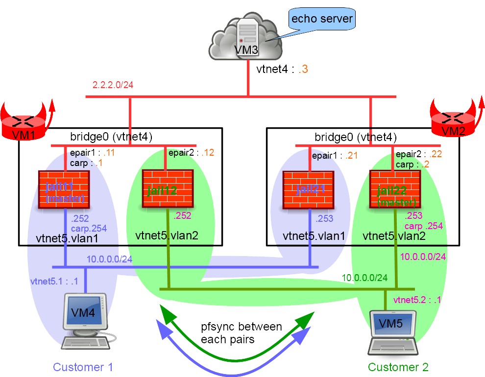

## Network diagram



## Starting the lab

More information on the BSDRP lab scripts is available in [How to build a BSDRP router lab](how-to-build-a-bsdrp-router-lab.md).

Example with the bhyve lab script:

```
# tools/BSDRP-lab-bhyve.sh -i BSDRP.amd64/BSDRP-1.80-full-amd64-serial.img.xz -n 5 -l 2
BSD Router Project (http://bsdrp.net) - bhyve full-meshed lab script
Setting-up a virtual lab with 5 VM(s):
- Working directory: /tmp/BSDRP
- Each VM have 1 core(s) and 256M RAM
- Emulated NIC: virtio-net
- Switch mode: bridge + tap
- 3 LAN(s) between all VM
- Full mesh Ethernet links between each VM
VM 1 have the following NIC:
- vtnet0 connected to VM 2
- vtnet1 connected to VM 3
- vtnet2 connected to VM 4
- vtnet3 connected to VM 5
- vtnet4 connected to LAN number 1
- vtnet5 connected to LAN number 2
VM 2 have the following NIC:
- vtnet0 connected to VM 1
- vtnet1 connected to VM 3
- vtnet2 connected to VM 4
- vtnet3 connected to VM 5
- vtnet4 connected to LAN number 1
- vtnet5 connected to LAN number 2
VM 3 have the following NIC:
- vtnet0 connected to VM 1
- vtnet1 connected to VM 2
- vtnet2 connected to VM 4
- vtnet3 connected to VM 5
- vtnet4 connected to LAN number 1
- vtnet5 connected to LAN number 2
VM 4 have the following NIC:
- vtnet0 connected to VM 1
- vtnet1 connected to VM 2
- vtnet2 connected to VM 3
- vtnet3 connected to VM 5
- vtnet4 connected to LAN number 1
- vtnet5 connected to LAN number 2
VM 5 have the following NIC:
- vtnet0 connected to VM 1
- vtnet1 connected to VM 2
- vtnet2 connected to VM 3
- vtnet3 connected to VM 4
- vtnet4 connected to LAN number 1
- vtnet5 connected to LAN number 2
For connecting to VM'serial console, you can use:
- VM 1 : cu -l /dev/nmdm-BSDRP.1B
- VM 2 : cu -l /dev/nmdm-BSDRP.2B
- VM 3 : cu -l /dev/nmdm-BSDRP.3B
- VM 4 : cu -l /dev/nmdm-BSDRP.4B
- VM 5 : cu -l /dev/nmdm-BSDRP.5B
```

## Configuring routers

### With BSDRP's labconfig

All these routers can be quickly configured with [BSDRP's labconfig tool](https://github.com/ocochard/BSDRP/blob/master/BSDRP/Files/usr/local/sbin/labconfig) (only use it in a lab, because it will replace your current running configuration). This example uses [another BSDRP shell script](https://github.com/ocochard/BSDRP/blob/master/BSDRP/Files/usr/local/sbin/tenant) to simplify nullfs jail creation on BSDRP's read-only root.

```
labconfig jailpf_vm[VM-NUMBER]
```

Or you can do it step by step as described below.

### Public server (VM3)

```
sysrc hostname=VM3
hostname VM3
sysrc ifconfig_vtnet4="inet 2.2.2.3/24"
sysrc -x gateway_enable
sysrc -x ipv6_gateway_enable
sysrc inetd_enable=YES
sed -i -e 's/#echo/echo/g' /etc/inetd.conf
service netif restart
service routing restart
service inetd start
config save
```

### Customer 1 workstation (VM4)

```
sysrc hostname=VM4
hostname VM4
sysrc ifconfig_vtnet5="up"
sysrc vlans_vtnet5="1"
sysrc ifconfig_vtnet5_1="inet 10.0.0.4/24"
sysrc defaultrouter="10.0.0.254"
sysrc -x gateway_enable
sysrc -x ipv6_gateway_enable
service netif restart
service routing restart
config save
```

### Customer 2 workstation (VM5)

```
sysrc hostname=VM5
hostname VM5
sysrc ifconfig_vtnet5="up"
sysrc vlans_vtnet5="2"
sysrc ifconfig_vtnet5_2="inet 10.0.0.5/24"
sysrc defaultrouter="10.0.0.254"
sysrc -x gateway_enable
sysrc -x ipv6_gateway_enable
service netif restart
service routing restart
config save
```

### First multi-tenant firewall (VM1)

```
sysrc hostname=VM1
sysrc cloned_interfaces="bridge0"
sysrc ifconfig_bridge0="addm vtnet4"
sysrc ifconfig_vtnet4="up"
sysrc ifconfig_vtnet5="up"
sysrc vlans_vtnet5="1 2"
sysrc ifconfig_vtnet5_1="up"
sysrc ifconfig_vtnet5_2="up"
sysrc kld_list+=" carp pf pflog pfsync"

cat > /etc/devfs.rules <<'EOF'
[devfsrules_jailpf=4]
add include $devfsrules_hide_all
add include $devfsrules_unhide_basic
add include $devfsrules_unhide_login
add path 'pf' unhide
add path 'pflog*' unhide
add path 'bpf*' unhide
'EOF'

hostname VM1
service devfs restart
service netif restart
service kld start
```


!!! note
    Jails must use different CARP vhids on the public shared LAN to avoid CARP MAC address conflicts.


#### Customer 1 Firewall1 (jail11)

```
tenant -c -j jail11 -i bridge0,vtnet5.1

cat > /etc/jails/jail11/rc.conf <<EOF
hostname="jail11"
sshd_enable=YES
gateway_enable=YES
ipv6_gateway_enable=YES
ifconfig_vtnet5_1="inet 10.0.0.252/24"
ifconfig_vtnet5_1_alias0="inet 10.0.0.254/32 vhid 1 advskew 100 pass customer1i"
ifconfig_epair10b="inet 2.2.2.11/24"
ifconfig_epair10b_alias0="inet 2.2.2.1/32 vhid 2 advskew 100 pass customer1e"
pf_enable=YES
pflog_enable=YES
pfsync_enable=YES
pfsync_syncdev=vtnet5.1
EOF

echo "net.inet.carp.preempt=1" >> /etc/jails/jail11/sysctl.conf
cat > /etc/jails/jail11/pf.conf <<EOF
nat on epair10b from vtnet5.1:network to any -> 2.2.2.1
block
pass quick on vtnet5.1 proto pfsync keep state (no-sync)
pass quick on epair10b  proto carp keep state (no-sync)
pass quick on vtnet5.1 proto carp keep state (no-sync)
pass log from vtnet5.1:network to epair10b:network
pass log from self to any
EOF
```

#### Customer 2 Firewall1 (jail12)

```
tenant -c -j jail12 -i bridge0,vtnet5.2

cat > /etc/jails/jail12/rc.conf <<EOF
hostname=jail12
sshd_enable=YES
gateway_enable=YES
ipv6_gateway_enable=YES
ifconfig_vtnet5_2="inet 10.0.0.252/24"
ifconfig_vtnet5_2_alias0="inet 10.0.0.254/32 vhid 3 advskew 200 pass customer2i"
ifconfig_epair20b="inet 2.2.2.12/24"
ifconfig_epair20b_alias0="inet 2.2.2.2/32 vhid 4 advskew 200 pass customer2e"
pf_enable=YES
pflog_enable=YES
pfsync_enable=YES
pfsync_syncdev=vtnet5.2
EOF

echo "net.inet.carp.preempt=1" >> /etc/jails/jail12/sysctl.conf
cat > /etc/jails/jail12/pf.conf <<EOF
nat on epair20b from vtnet5.2:network to any -> 2.2.2.2
block
pass quick on vtnet5.2 proto pfsync keep state (no-sync)
pass quick on epair20b  proto carp keep state (no-sync)
pass quick on vtnet5.2 proto carp keep state (no-sync)
pass log from vtnet5.2:network to epair20b:network
pass log from self to any
EOF
```

#### Starting customer firewall

```
service jail start
```

### Second multi-tenant firewall (VM2)

```
sysrc hostname=VM2
sysrc cloned_interfaces="bridge0"
sysrc ifconfig_bridge0="addm vtnet4"
sysrc ifconfig_vtnet4="up"
sysrc ifconfig_vtnet5="up"
sysrc vlans_vtnet5="1 2"
sysrc ifconfig_vtnet5_1="up"
sysrc ifconfig_vtnet5_2="up"
sysrc kld_list+=" carp pf pflog pfsync"
cat > /etc/devfs.rules <<'EOF'
[devfsrules_jailpf=4]
add include $devfsrules_hide_all
add include $devfsrules_unhide_basic
add include $devfsrules_unhide_login
add path 'pf' unhide
add path 'pflog*' unhide
add path 'bpf*' unhide
'EOF'

hostname VM2
service devfs restart
service netif restart
service kld start
```


!!! note
    Jails must use different CARP vhids on the public shared LAN to avoid CARP MAC address conflicts.


#### Customer 1 Firewall2 (jail21)

```
tenant -c -j jail21 -i bridge0,vtnet5.1

cat > /etc/jails/jail21/rc.conf <<EOF
hostname=jail21
sshd_enable=YES
gateway_enable=YES
ipv6_gateway_enable=YES
ifconfig_vtnet5_1="inet 10.0.0.253/24"
ifconfig_vtnet5_1_alias0="inet 10.0.0.254/32 vhid 1 advskew 200 pass customer1i"
ifconfig_epair10b="inet 2.2.2.21/24"
ifconfig_epair10b_alias0="inet 2.2.2.1/32 vhid 2 advskew 200 pass customer1e"
pf_enable=YES
pflog_enable=YES
pfsync_enable=YES
pfsync_syncdev=vtnet5.1
EOF

echo "net.inet.carp.preempt=1" >> /etc/jails/jail21/sysctl.conf
cat > /etc/jails/jail21/pf.conf <<EOF
nat on epair10b from vtnet5.1:network to any -> 2.2.2.1
block
pass quick on vtnet5.1 proto pfsync keep state (no-sync)
pass quick on epair10b proto carp keep state (no-sync)
pass quick on vtnet5.1 proto carp keep state (no-sync)
pass log from vtnet5.1:network to epair10b:network
pass log from self to any
EOF
```

#### Customer 2 Firewall2 (jail22)

```
tenant -c -j jail22 -i bridge0,vtnet5.2

cat > /etc/jails/jail22/rc.conf <<EOF
hostname=jail22
sshd_enable=YES
gateway_enable=YES
ipv6_gateway_enable=YES
ifconfig_vtnet5_2="inet 10.0.0.253/24"
ifconfig_vtnet5_2_alias0="inet 10.0.0.254/32 vhid 3 advskew 100 pass customer2i"
ifconfig_epair20b="inet 2.2.2.22/24"
ifconfig_epair20b_alias0="inet 2.2.2.2/32 vhid 4 advskew 100 pass customer2e"
pf_enable=YES
pflog_enable=YES
pfsync_enable=YES
pfsync_syncdev=vtnet5.2
EOF

echo "net.inet.carp.preempt=1" >> /etc/jails/jail22/sysctl.conf
cat > /etc/jails/jail22/pf.conf <<EOF
nat on epair20b from vtnet5.2:network to any -> 2.2.2.2
block
pass quick on vtnet5.2 proto pfsync keep state (no-sync)
pass quick on epair20b  proto carp keep state (no-sync)
pass quick on vtnet5.2  proto carp keep state (no-sync)
pass log from vtnet5.2:network to epair20b:network
pass log from self to any
EOF
```

#### Starting customer firewall

```
service jail start
```

## Checking firewalls status

### CARP state

#### Customer 1

Check that on VM1, jail11 is in CARP master state:

```
[root@VM1]~# jexec jail11 ifconfig | grep carp
        carp: MASTER vhid 2 advbase 1 advskew 100
        carp: MASTER vhid 1 advbase 1 advskew 100
```

And on VM2, jail21 is in backup state:

```
[root@VM2]~# jexec jail21 ifconfig | grep carp
        carp: BACKUP vhid 2 advbase 1 advskew 200
        carp: BACKUP vhid 1 advbase 1 advskew 200
```

#### Customer 2

Check that on VM1, jail12 is in CARP backup state:

```
[root@VM1]~# jexec jail12 ifconfig | grep carp
        carp: BACKUP vhid 2 advbase 1 advskew 200
        carp: BACKUP vhid 1 advbase 1 advskew 200
```

And on VM2, jail22 is in master state:

```
[root@VM2]~# jexec jail22 ifconfig | grep carp
        carp: MASTER vhid 2 advbase 1 advskew 100
        carp: MASTER vhid 1 advbase 1 advskew 100
```

### pfsync

#### Customer 1

Generate a flow from VM4 (customer 1 workstation) to VM3 (Internet server):

```
[root@VM4]~# telnet 2.2.2.3 7
Trying 2.2.2.3...
Connected to 2.2.2.3.
Escape character is '^]'.
echo
echo
```

While still connected, check the state tables on jail11:

```
[root@VM1]~# jexec jail11 pfctl -ss
all carp 10.0.0.252 -> 224.0.0.18       SINGLE:NO_TRAFFIC
all carp 2.2.2.11 -> 224.0.0.18       SINGLE:NO_TRAFFIC
all carp 224.0.0.18 <- 2.2.2.22       NO_TRAFFIC:SINGLE
all tcp 2.2.2.3:7 <- 10.0.0.4:22829       ESTABLISHED:ESTABLISHED
all tcp 2.2.2.1:64414 (10.0.0.4:22829) -> 2.2.2.3:7       ESTABLISHED:ESTABLISHED
```

The state table should also be synced on jail21:

```
[root@VM2]~# jexec jail21 pfctl -ss
all tcp 2.2.2.3:7 <- 10.0.0.4:22829       ESTABLISHED:ESTABLISHED
all tcp 2.2.2.1:64414 (10.0.0.4:22829) -> 2.2.2.3:7       ESTABLISHED:ESTABLISHED
all carp 224.0.0.18 <- 10.0.0.252       NO_TRAFFIC:SINGLE
all carp 224.0.0.18 <- 2.2.2.11       NO_TRAFFIC:SINGLE
all carp 224.0.0.18 <- 2.2.2.22       NO_TRAFFIC:SINGLE
```

#### Customer 2

Generate a flow from VM5 (customer 2 workstation) to VM3 (Internet server):

```
[root@VM5]~# telnet 2.2.2.3 7
Trying 2.2.2.3...
Connected to 2.2.2.3.
Escape character is '^]'.
echo
echo
```

While still connected, check the state tables on VM2/jail22:

```
[root@VM2]~# jexec jail22 pfctl -ss
all carp 224.0.0.18 <- 2.2.2.11       NO_TRAFFIC:SINGLE
all carp 10.0.0.253 -> 224.0.0.18       SINGLE:NO_TRAFFIC
all carp 2.2.2.22 -> 224.0.0.18       SINGLE:NO_TRAFFIC
all tcp 2.2.2.3:7 <- 10.0.0.5:48257       ESTABLISHED:ESTABLISHED
all tcp 2.2.2.2:55134 (10.0.0.5:48257) -> 2.2.2.3:7       ESTABLISHED:ESTABLISHED
```

The state table should also be synced on VM1/jail12:

```
[root@VM1]~# jexec jail12 pfctl -ss
all carp 224.0.0.18 <- 2.2.2.11       NO_TRAFFIC:SINGLE
all carp 224.0.0.18 <- 10.0.0.253       NO_TRAFFIC:SINGLE
all carp 224.0.0.18 <- 2.2.2.22       NO_TRAFFIC:SINGLE
all pfsync 224.0.0.240 <- 10.0.0.253       NO_TRAFFIC:SINGLE
all tcp 2.2.2.3:7 <- 10.0.0.5:29481       ESTABLISHED:ESTABLISHED
all tcp 2.2.2.2:58530 (10.0.0.5:29481) -> 2.2.2.3:7       ESTABLISHED:ESTABLISHED
```

### pflog

#### Customer 1

Check the log file on the customer 1 master firewall (after the default 60-second flush timer):

```
[root@jail11]~# tcpdump -n -e -ttt -i pflog0
tcpdump: verbose output suppressed, use -v or -vv for full protocol decode
listening on pflog0, link-type PFLOG (OpenBSD pflog file), capture size 262144 bytes
 00:00:00.000000 rule 4/0(match): pass in on vtnet5.1: 10.0.0.4 > 2.2.2.3: ICMP echo request, id 59656, seq 0, length 64
 00:00:00.000016 rule 7/0(match): pass out on epair1b: 2.2.2.1 > 2.2.2.3: ICMP echo request, id 59599, seq 0, length 64
 00:00:03.602014 rule 4/0(match): pass in on vtnet5.1: 10.0.0.4.40843 > 2.2.2.3.7: Flags [S], seq 3135529453, win 65535, options [mss 1460,nop,wscale 6,sackOK,TS val 24986171 ecr 0], length 0
 00:00:00.000009 rule 7/0(match): pass out on epair1b: 2.2.2.1.53035 > 2.2.2.3.7: Flags [S], seq 3135529453, win 65535, options [mss 1460,nop,wscale 6,sackOK,TS val 24986171 ecr 0], length 0
^C
4 packets captured
4 packets received by filter
0 packets dropped by kernel
```

#### Customer 2

```
[root@jail22]~# tcpdump -n -e -ttt -i pflog0
tcpdump: verbose output suppressed, use -v or -vv for full protocol decode
listening on pflog0, link-type PFLOG (OpenBSD pflog file), capture size 262144 bytes
 00:00:00.000000 rule 4/0(match): pass in on vtnet5.2: 10.0.0.5 > 2.2.2.3: ICMP echo request, id 64776, seq 0, length 64
 00:00:00.000008 rule 7/0(match): pass out on epair2b: 2.2.2.2 > 2.2.2.3: ICMP echo request, id 11316, seq 0, length 64
 00:00:02.654863 rule 4/0(match): pass in on vtnet5.2: 10.0.0.5.20739 > 2.2.2.3.7: Flags [S], seq 2458333239, win 65535, options [mss 1460,nop,wscale 6,sackOK,TS val 24913037 ecr 0], length 0
 00:00:00.000008 rule 7/0(match): pass out on epair2b: 2.2.2.2.56545 > 2.2.2.3.7: Flags [S], seq 2458333239, win 65535, options [mss 1460,nop,wscale 6,sackOK,TS val 24913037 ecr 0], length 0
^C
4 packets captured
4 packets received by filter
0 packets dropped by kernel
```

### pflogd

#### Customer 1

Check the log file on the customer 1 master firewall jail11 (after the default 60-second flush timer):

```
[root@jail11]~# tcpdump -r /var/log/pflog
reading from file /var/log/pflog, link-type PFLOG (OpenBSD pflog file)
```

Nothing??

```
[root@jail11]~# service pflogd status
pflogd does not exist in /etc/rc.d or the local startup
directories (/usr/local/etc/rc.d), or is not executable
[root@jail11]~# service pflog status
pflog is running as pid 2267.
```

#### Customer 2

Check the log file on the customer 2 master firewall jail22 (after the default 60-second flush timer):

```
[root@jail22]~# tcpdump -r /var/log/pflog
reading from file /var/log/pflog, link-type PFLOG (OpenBSD pflog file)
[root@jail22]~# service pflog status
pflog is running as pid 2261.
```


!!! note
    pflogd seems to have a problem running inside a jail.


Trying to stop pflogd to force a flush, but it cannot be stopped:

```
[root@jail11]~# ps -auxww | grep pflogd
_pflogd 2269 49.6  1.3 12304 2872  -  RJ   09:13   10:06.89 pflogd: [running] -s 116 -i pflog0 -f /var/log/pflog (pflogd)
root    2267  0.0  1.3 12236 2868  -  IsJ  09:13    0:00.00 pflogd: [priv] (pflogd)
root    3020  0.0  0.1   420  300  0  R+J  09:33    0:00.00 grep pflogd
[root@jail11]~# service pflog stop
Stopping pflog.
Waiting for PIDS: 2267
load: 2.00  cmd: pwait 3032 [kqread] 28.06r 0.00u 0.00s 0% 1488k
```
