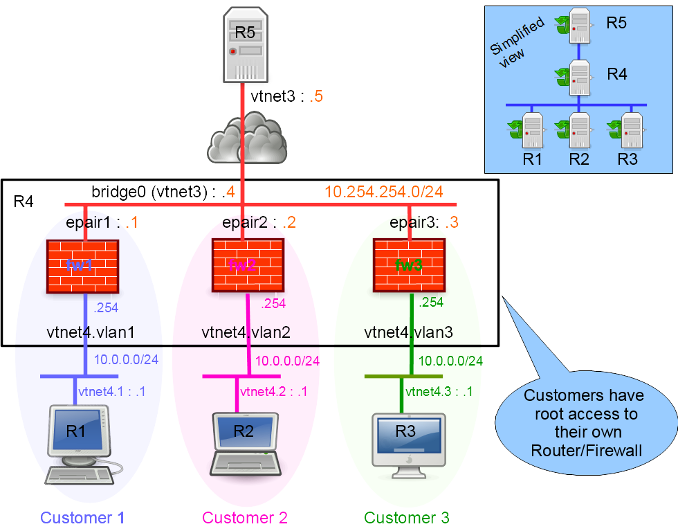

This lab shows how to create a multi-tenant router or firewall using jail/vnet (available since BSDRP 1.80).

## Overview

### Network diagram

The lab is built following [How to build a BSDRP router lab](how-to-build-a-bsdrp-router-lab.md): 5 routers with full-meshed links and one shared LAN.

Here is the logical and physical view:



### Setting up a virtual lab

#### Downloading BSD Router Project images

Download the BSDRP serial image (which avoids needing an X display) from SourceForge.

#### Download lab scripts

More information on the BSDRP lab scripts is available in [How to build a BSDRP router lab](how-to-build-a-bsdrp-router-lab.md).

Start the lab with five full-meshed routers and one shared LAN. This example uses the bhyve lab script on FreeBSD:

```
[root@FreeBSD]~# tools/BSDRP-lab-bhyve.sh -i BSDRP-1.71-full-amd64-serial.img.xz -n 5 -l 1
BSD Router Project (http://bsdrp.net) - bhyve full-meshed lab script
Setting-up a virtual lab with 5 VM(s):
- Working directory: /tmp/BSDRP
- Each VM have 1 core(s) and 256M RAM
- Switch mode: bridge + tap
- 1 LAN(s) between all VM
- Full mesh Ethernet links between each VM
VM 1 have the following NIC:
- vtnet0 connected to VM 2
- vtnet1 connected to VM 3
- vtnet2 connected to VM 4
- vtnet3 connected to VM 5
- vtnet4 connected to LAN number 1
VM 2 have the following NIC:
- vtnet0 connected to VM 1
- vtnet1 connected to VM 3
- vtnet2 connected to VM 4
- vtnet3 connected to VM 5
- vtnet4 connected to LAN number 1
VM 3 have the following NIC:
- vtnet0 connected to VM 1
- vtnet1 connected to VM 2
- vtnet2 connected to VM 4
- vtnet3 connected to VM 5
- vtnet4 connected to LAN number 1
VM 4 have the following NIC:
- vtnet0 connected to VM 1
- vtnet1 connected to VM 2
- vtnet2 connected to VM 3
- vtnet3 connected to VM 5
- vtnet4 connected to LAN number 1
VM 5 have the following NIC:
- vtnet0 connected to VM 1
- vtnet1 connected to VM 2
- vtnet2 connected to VM 3
- vtnet3 connected to VM 4
- vtnet4 connected to LAN number 1
For connecting to VM'serial console, you can use:
- VM 1 : cu -l /dev/nmdm1B
- VM 2 : cu -l /dev/nmdm2B
- VM 3 : cu -l /dev/nmdm3B
- VM 4 : cu -l /dev/nmdm4B
- VM 5 : cu -l /dev/nmdm5B
```

## Configuration

- Router 4 (R4) hosts the three routers/firewalls, one for each of three customers.
- Router 1 (R1) belongs to customer 1, router 2 (R2) to customer 2, and router 3 (R3) to customer 3.
- Router 5 (R5) simulates a simple Internet host.

### Router 5: simple Internet host

R5 simulates a simple Internet host:

```
sysrc hostname=R5
hostname R5
sysrc ifconfig_vtnet3="inet 10.254.254.5/24"
sysrc -x gateway_enable
sysrc -x ipv6_gateway_enable
service netif restart
service routing restart
config save
```

### Router 1: customer 1 workstation

R1 simulates customer 1’s workstation. Generate customer 1’s SSH keys:

```
sysrc hostname=R1
hostname R1
sysrc ifconfig_vtnet4="up"
sysrc vlans_vtnet4="1"
sysrc ifconfig_vtnet4_1="inet 10.0.0.1/24"
sysrc defaultrouter="10.0.0.254"
sysrc -x gateway_enable
sysrc -x ipv6_gateway_enable
service netif restart
service routing restart
ssh-keygen -f /root/.ssh/id_rsa -N ''
config save
```

Then display the public SSH key (it must be declared on customer 1’s firewall):

```
cat .ssh/id_rsa.pub
ssh-rsa (...) root@R1
```

### Router 2: customer 2 workstation

R2 simulates customer 2’s workstation and also holds customer 2’s SSH keys.

```
sysrc hostname=R2
hostname R2
sysrc ifconfig_vtnet4="up"
sysrc vlans_vtnet4="2"
sysrc ifconfig_vtnet4_2="inet 10.0.0.1/24"
sysrc defaultrouter="10.0.0.254"
sysrc -x gateway_enable
sysrc -x ipv6_gateway_enable
service netif restart
service routing restart
ssh-keygen -f /root/.ssh/id_rsa -N ''
config save
```

Then display the public SSH key (it must be declared on customer 2’s firewall):

```
cat .ssh/id_rsa.pub
ssh-rsa (...) root@R2
```

### Router 3: customer 3 workstation

R3 simulates customer 3’s workstation and also holds customer 3’s SSH keys.

```
sysrc hostname=R3
hostname R3
sysrc ifconfig_vtnet4="up"
sysrc vlans_vtnet4="3"
sysrc ifconfig_vtnet4_3="inet 10.0.0.1/24"
sysrc defaultrouter="10.0.0.254"
sysrc -x gateway_enable
sysrc -x ipv6_gateway_enable
service netif restart
service routing restart
ssh-keygen -f /root/.ssh/id_rsa -N ''
config save
```

Then display the public SSH key (it must be declared on customer 3’s firewall):

```
cat .ssh/id_rsa.pub
ssh-rsa (...) root@R3
```

### Router 4: multi-tenant ipfw firewall

Router 4 is a multi-tenant ipfw firewall: it hosts one firewall for each of the three customers.

We will configure:

- Bridge and VLAN interfaces
- ipfw enabled (firewall modules must be loaded on the host so they are available inside jails)

<!-- -->

```
sysrc hostname=R4
sysrc cloned_interfaces="bridge0"
sysrc ifconfig_bridge0="inet 10.254.254.4/24 addm vtnet3"
sysrc ifconfig_vtnet3="up"
sysrc ifconfig_vtnet4="up"
sysrc vlans_vtnet4="1 2 3"
sysrc ifconfig_vtnet4_1="up"
sysrc ifconfig_vtnet4_2="up"
sysrc ifconfig_vtnet4_3="up"
sysrc firewall_enable="YES"
sysrc firewall_nat_enable="YES"
sysrc firewall_type="open"
service netif restart
hostname R4
service ipfw start
config save
```

Then install the customers’ SSH public keys:

```
echo "ssh-rsa AAAAB3NzaC1yc2EAAAADAQABAAABA... root@R1" > /tmp/cust1.ssh.pub
echo "ssh-rsa AAAAB3NzaC1yc2EAAAADAQABAAABA... root@R2" > /tmp/cust2.ssh.pub
echo "ssh-rsa AAAAB3NzaC1yc2EAAAADAQABAAABA... root@R3" > /tmp/cust3.ssh.pub
```

Create three jailed firewalls, one per customer:

```
tenant -c -j customer1 -f /tmp/cust1.ssh.pub -i bridge0/10.254.254.1/24,vtnet4.1/10.0.0.254/24 -g 10.254.254.5
tenant -c -j customer2 -f /tmp/cust2.ssh.pub -i bridge0/10.254.254.2/24,vtnet4.2/10.0.0.254/24 -g 10.254.254.5
tenant -c -j customer3 -f /tmp/cust3.ssh.pub -i bridge0/10.254.254.3/24,vtnet4.3/10.0.0.254/24 -g 10.254.254.5
```

As a final step, because these are virtual firewalls and not simple routers, enable the firewall in open mode in each jail’s internal `rc.conf` so customers can SSH into them:

```
sysrc -f /etc/jails/customer1/rc.conf firewall_enable="YES" 
sysrc -f /etc/jails/customer1/rc.conf firewall_nat_enable="YES"
sysrc -f /etc/jails/customer1/rc.conf firewall_type="open"
sysrc -f /etc/jails/customer2/rc.conf firewall_enable="YES" 
sysrc -f /etc/jails/customer2/rc.conf firewall_nat_enable="YES"
sysrc -f /etc/jails/customer2/rc.conf firewall_type="open"
sysrc -f /etc/jails/customer3/rc.conf firewall_enable="YES" 
sysrc -f /etc/jails/customer3/rc.conf firewall_nat_enable="YES"
sysrc -f /etc/jails/customer3/rc.conf firewall_type="open"
```

Configuration is now saved automatically whenever changes are detected in `/etc`, so you no longer need to run `config save` on the host once a jail has been created.

Start the jails:

```
service jail start
```

## Customer firewall configuration

Each customer should be able to SSH into their new firewall using their SSH keys.

### Customer 1

From customer 1’s workstation R1:

```
[root@R1]~# ssh 10.0.0.254
The authenticity of host '10.0.0.254 (10.0.0.254)' can't be established.
ECDSA key fingerprint is SHA256:extHiTI3L94Ks1TPnMI66zq+4t+frkAnvRVSkYk3qak.
No matching host key fingerprint found in DNS.
Are you sure you want to continue connecting (yes/no)? yes
Warning: Permanently added '10.0.0.254' (ECDSA) to the list of known hosts.
BSD Router project (BSDRP) (c) 2009-2017, The BSDRP Development Team
All rights reserved.
BSDRP is under the Simplified BSD license.

Documentation: http://bsdrp.net

Discover BSDRP tools with "help" command

Keyboard layout can be changed with this command:
kbdcontrol -l keymap_file (<TAB> for list available maps)
root has logged on pts/0 from 10.0.0.1.
[root@customer1]~#
```

Now connected to his firewall, the customer can configure his own firewall rules:

```
sysrc -x firewall_type
sysrc firewall_script="/etc/ipfw.rules"

cat > /etc/ipfw.rules <<'EOF'
#!/bin/sh
fwcmd="/sbin/ipfw -q"
ext_if="epair1b"
int_if="vtnet4.1"
${fwcmd} -f flush
${fwcmd} nat 1 config if ${ext_if} same_ports deny_in unreg_only reset
${fwcmd} add pass ip from any to any via lo0
${fwcmd} add pass ip from any to any via ${int_if}
${fwcmd} add nat 1 ip from any to any via ${ext_if}
'EOF'
service ipfw restart
config save
```

Check firewall rules:

```
[root@customer1]~# ipfw show
00100  0    0 allow ip from any to any via lo0
00200 91 7756 allow ip from any to any via vtnet4.1
00300  0    0 nat 1 ip from any to any via epair1b
65535  0    0 deny ip from any to any
```

From R1, try to reach the public Internet server R5:

```
[root@R1]~# ping -c 3 10.254.254.5
PING 10.254.254.5 (10.254.254.5): 56 data bytes
64 bytes from 10.254.254.5: icmp_seq=0 ttl=63 time=0.211 ms
64 bytes from 10.254.254.5: icmp_seq=1 ttl=63 time=0.186 ms
64 bytes from 10.254.254.5: icmp_seq=2 ttl=63 time=0.181 ms

--- 10.254.254.5 ping statistics ---
3 packets transmitted, 3 packets received, 0.0% packet loss
round-trip min/avg/max/stddev = 0.181/0.193/0.211/0.013 ms
```

### Customer 2

From customer 2’s workstation R2:

```
[root@R2]~# ssh 10.0.0.254
The authenticity of host '10.0.0.254 (10.0.0.254)' can't be established.
ECDSA key fingerprint is SHA256:zC+ryVAd9v1lTvSb+THFj5i8aYfFi2I6VvayF1TIhVo.
No matching host key fingerprint found in DNS.
Are you sure you want to continue connecting (yes/no)? yes
Warning: Permanently added '10.0.0.254' (ECDSA) to the list of known hosts.
BSD Router project (BSDRP) (c) 2009-2017, The BSDRP Development Team
All rights reserved.
BSDRP is under the Simplified BSD license.

Documentation: http://bsdrp.net

Discover BSDRP tools with "help" command

Keyboard layout can be changed with this command:
kbdcontrol -l keymap_file (<TAB> for list available maps)
root has logged on pts/0 from 10.0.0.1.
[root@customer2]~#
```

Now connected to his firewall, the customer can configure his own firewall rules:

```
sysrc -x firewall_type
sysrc firewall_script="/etc/ipfw.rules"

cat > /etc/ipfw.rules <<'EOF'
#!/bin/sh
fwcmd="/sbin/ipfw -q"
ext_if="epair2b"
int_if="vtnet4.2"
${fwcmd} -f flush
${fwcmd} nat 1 config if ${ext_if} same_ports deny_in unreg_only reset
${fwcmd} add pass ip from any to any via lo0
${fwcmd} add pass ip from any to any via ${int_if}
${fwcmd} add nat 1 ip from any to any via ${ext_if}
'EOF'
service ipfw restart
config save
```

Check firewall rules:

```
[root@customer2]~# ipfw show
00100  0    0 allow ip from any to any via lo0
00200 91 7756 allow ip from any to any via vtnet4.2
00300  0    0 nat 1 ip from any to any via epair2b
65535  0    0 deny ip from any to any
```

From R2, try to reach the public Internet server R5:

```
[root@R2]~# ping -c 3 10.254.254.5
PING 10.254.254.5 (10.254.254.5): 56 data bytes
64 bytes from 10.254.254.5: icmp_seq=0 ttl=63 time=0.211 ms
64 bytes from 10.254.254.5: icmp_seq=1 ttl=63 time=0.186 ms
64 bytes from 10.254.254.5: icmp_seq=2 ttl=63 time=0.181 ms

--- 10.254.254.5 ping statistics ---
3 packets transmitted, 3 packets received, 0.0% packet loss
round-trip min/avg/max/stddev = 0.181/0.193/0.211/0.013 ms
```

### Customer 3

From customer 3’s workstation R3:

```
[root@R3]~# ssh 10.0.0.254
The authenticity of host '10.0.0.254 (10.0.0.254)' can't be established.
ECDSA key fingerprint is SHA256:iCkc1w5zzeQL+X3qyEwovuEAGNvD+rfftsitMAlK+Xk.
No matching host key fingerprint found in DNS.
Are you sure you want to continue connecting (yes/no)? yes
Warning: Permanently added '10.0.0.254' (ECDSA) to the list of known hosts.
BSD Router project (BSDRP) (c) 2009-2017, The BSDRP Development Team
All rights reserved.
BSDRP is under the Simplified BSD license.

Documentation: http://bsdrp.net

Discover BSDRP tools with "help" command

Keyboard layout can be changed with this command:
kbdcontrol -l keymap_file (<TAB> for list available maps)
root has logged on pts/0 from 10.0.0.1.
[root@customer3]~#
```

Now connected to his firewall, this customer can configure its own firewall rules:

```
sysrc -x firewall_type
sysrc firewall_script="/etc/ipfw.rules"

cat > /etc/ipfw.rules <<'EOF'
#!/bin/sh
fwcmd="/sbin/ipfw -q"
ext_if="epair3b"
int_if="vtnet4.3"
${fwcmd} -f flush
${fwcmd} nat 1 config if ${ext_if} same_ports deny_in unreg_only reset
${fwcmd} add pass ip from any to any via lo0
${fwcmd} add pass ip from any to any via ${int_if}
${fwcmd} add nat 1 ip from any to any via ${ext_if}
'EOF'
service ipfw restart
config save
```

Check firewall rules:

```
[root@customer3]~# ipfw show
00100  0    0 allow ip from any to any via lo0
00200 91 7756 allow ip from any to any via vtnet4.3
00300  0    0 nat 1 ip from any to any via epair3b
65535  0    0 deny ip from any to any
```

Now, from R3, try to public Internet server R5:

```
[root@R3]~# ping -c 3 10.254.254.5
PING 10.254.254.5 (10.254.254.5): 56 data bytes
64 bytes from 10.254.254.5: icmp_seq=0 ttl=63 time=0.211 ms
64 bytes from 10.254.254.5: icmp_seq=1 ttl=63 time=0.186 ms
64 bytes from 10.254.254.5: icmp_seq=2 ttl=63 time=0.181 ms

--- 10.254.254.5 ping statistics ---
3 packets transmitted, 3 packets received, 0.0% packet loss
round-trip min/avg/max/stddev = 0.181/0.193/0.211/0.013 ms
```

## Using pf instead of ipfw

pf requires a little more configuration because, by default, `/dev/pf` is hidden from jails.

On the host we need to:

1.  Load the `pf` module instead of the `ipfw`/`ipfw-nat` modules (while still keeping pf disabled on the host for this example).
2.  Modify the default devfs rules to let jails see `/dev/pf` (and the `bpf` device too, if you want to use tcpdump inside the jail).
3.  Replace the `nojail` tag with `nojailvnet` in `/etc/rc.d/pf` ([already done in BSDRP](https://github.com/ocochard/BSDRP/blob/master/BSDRP/patches/freebsd.rc.jailvnet.patch) and in [FreeBSD -head](https://svnweb.freebsd.org/baseview=revision&revision=320802)).

Preparing configuration:

```
cat > /etc/devfs.rules <<'EOF'
[devfsrules_jailpf=4]
add include $devfsrules_hide_all
add include $devfsrules_unhide_basic
add include $devfsrules_unhide_login
add path 'pf' unhide
'EOF'
pf_enable="YES"
pf_flags="-d" 
echo "set skip on {lo1 vtnet4}" > /etc/pf.conf
```

Reload devfs and load the pf module:

```
service pf start
service devfs restart
```

You can now declare pf instead of ipfw in each jail’s `rc.conf`:

```
sysrc -f /etc/jails/customer1/rc.conf pf_enable="YES"
echo "pass all" > /etc/jails/customer1/pf.conf
sysrc -f /etc/jails/customer2/rc.conf pf_enable="YES"
echo "pass all" > /etc/jails/customer2/pf.conf
sysrc -f /etc/jails/customer3/rc.conf pf_enable="YES"
echo "pass all" > /etc/jails/customer3/pf.conf
```

You can now start the customer jails and let customers SSH into their firewalls and configure their own rules:

```
[root@customer2]~# pfctl -s rules
pass all flags S/SA keep state
```

## Under the hood: jails on a read-only-root host

[BSDRP’s tenant shell script](https://github.com/ocochard/BSDRP/blob/master/BSDRP/Files/usr/local/sbin/tenant) creates jail configurations compatible with a BSDRP host (which runs on a read-only root filesystem).

These jails must be set up accordingly:

1.  Use nullfs so they can run on a read-only root filesystem.
2.  Mount `/etc` and `/var` on tmpfs (which means we have to populate these directories before each start).
3.  Configuration changes must be saved using BSDRP's configuration tools, such as `config save`.

And on the host:

1.  The [autosave daemon](https://github.com/ocochard/BSDRP/blob/master/BSDRP/Files/usr/local/sbin/autosave) must be enabled: each time a customer runs `config save` inside a jail, the configuration diff is saved to the host’s `/etc/jails/` directory. Since that directory is also a RAM disk, host configuration must be saved automatically whenever it changes.

Here are examples of the generated configuration files.

Host `jail.conf`:

```
customer1 {
    jid = 1;
    path          = "/var/jails/customer1";
    # Because we are using jails on a read-only-root host, the jail directories are volatile (mounted into /var/jails)
    # They didn't exist after a reboot, then we need to create jail directories with exec.prestart
    # But mount.* instructions are called before exec.prestart, then we need to call mount manually
    # into the exec.prestart
    #mount.devfs;
    #mount.fstab   = "/etc/fstab.customer1";
    #devfs_ruleset = 4;
    host.hostname = "customer1";
    vnet new;
    allow.chflags = 1;
    exec.start    = "/bin/sh /etc/rc";
    exec.stop     = "/bin/sh /etc/rc.shutdown";
    exec.clean;
    exec.consolelog = "/var/log/jail.customer1";
    exec.poststop  = "logger poststop jail customer1";
    # Commands to run on host before jail is created
    exec.prestart  = "logger pre-starting jail customer1";
    exec.prestart  += "mkdir -p /var/jails/customer1/dev";
    exec.prestart  += "mkdir -p /var/jails/customer1/etc";
    exec.prestart  += "mkdir -p /var/jails/customer1/var";
    exec.prestart  += "mkdir -p /var/jails/customer1/cfg";
    exec.prestart  += "mkdir -p /var/jails/customer1/root";
    exec.prestart  += "mkdir -p /var/jails/customer1/bin";
    exec.prestart  += "mkdir -p /var/jails/customer1/sbin";
    exec.prestart  += "mkdir -p /var/jails/customer1/lib";
    exec.prestart  += "mkdir -p /var/jails/customer1/libexec";
    exec.prestart  += "mkdir -p /var/jails/customer1/usr";
    exec.prestart  += "mkdir -p /var/jails/customer1/conf/base";
    exec.prestart  += "test -L /var/jails/customer1/tmp || ln -s /var/tmp /var/jails/customer1/tmp";
    exec.prestart  += "mount -F /etc/fstab.customer1 -a";
    exec.prestart  += "mount -t devfs -o rw,ruleset=4 devfs /var/jails/customer1/dev";

    # Copy reference and backuped files to /etc
    exec.prestart  += "cp -a /conf/base/ /var/jails/customer1";
    exec.prestart  += "cp -a /etc/jails/customer1/ /var/jails/customer1/etc/";
    # Prevent diskless
    exec.prestart  += "test -f /var/jails/customer1/etc/diskless && rm /var/jails/customer1/etc/diskless
|| true";
    vnet.interface  += "epair1b";
    exec.prestart  += "ifconfig epair1 create up";
    exec.prestart  += "ifconfig epair1a up";
    exec.prestart  += "ifconfig bridge0 addm epair1a up";
    # fix bug that assing same MAC to all epairXb interface
    # TO DO: convert this id into hexa
    exec.prestart  += "ifconfig epair1b ether 02:ff:00:00:ff:1";
    exec.poststop  += "ifconfig bridge0 deletem epair1a";
    exec.poststop  += "ifconfig epair1a destroy";
    vnet.interface  += "vtnet4.1";
    exec.poststop  += "ifconfig vtnet4.1 -vnet 1";
    exec.prestart  += "logger jail customer1 pre-started";
    exec.poststop  += "umount /var/jails/customer1/dev";
    exec.poststop  += "umount -a -F /etc/fstab.customer1";
    exec.poststop  += "logger jail customer1 post-stopped";
}
```

`/etc/fstab.customer1`:

```
tmpfs /var/jails/customer1/etc tmpfs rw,size=16000000 0 0
tmpfs /var/jails/customer1/var tmpfs rw,size=16000000 0 0
/root /var/jails/customer1/root nullfs ro 0 0
/bin /var/jails/customer1/bin nullfs ro 0 0
/sbin /var/jails/customer1/sbin nullfs ro 0 0
/lib /var/jails/customer1/lib nullfs ro 0 0
/libexec /var/jails/customer1/libexec nullfs ro 0 0
/usr /var/jails/customer1/usr nullfs ro 0 0
/conf/base /var/jails/customer1/conf/base nullfs ro 0 0
/etc/jails/customer1 /var/jails/customer1/cfg nullfs rw,noatime 0 0
```
