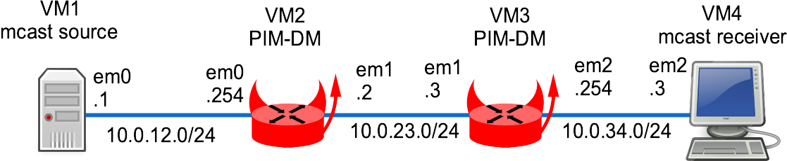

This lab shows a multicast routing example using PIM Dense Mode.


!!! warning
    pimdd is broken and needs to be debugged.


## Overview

### Network diagram

Here is the logical and physical view:



## Setting up the lab

### Downloading BSD Router Project images

Download the BSDRP serial image (to avoid needing an X display) from SourceForge.

### Download lab scripts

More information on the BSDRP lab scripts is available in [How to build a BSDRP router lab](how-to-build-a-bsdrp-router-lab.md).

Start the lab with 4 routers using emulated e1000 NICs (vtnet interfaces do not support multicast routing on FreeBSD):

```
tools/BSDRP-lab-bhyve.sh -i /usr/obj/BSDRP.amd64/BSDRP-1.702-full-amd64-serial.img.xz -n 4 -e
BSD Router Project (http://bsdrp.net) - bhyve full-meshed lab script
Setting-up a virtual lab with 4 VM(s):
- Working directory: /tmp/BSDRP
- Each VM have 1 core(s) and 256M RAM
- Emulated NIC: e1000
- Switch mode: bridge + tap
- 0 LAN(s) between all VM
- Full mesh Ethernet links between each VM
VM 1 have the following NIC:
- em0 connected to VM 2
- em1 connected to VM 3
- em2 connected to VM 4
VM 2 have the following NIC:
- em0 connected to VM 1
- em1 connected to VM 3
- em2 connected to VM 4
VM 3 have the following NIC:
- em0 connected to VM 1
- em1 connected to VM 2
- em2 connected to VM 4
VM 4 have the following NIC:
- em0 connected to VM 1
- em1 connected to VM 2
- em2 connected to VM 3
For connecting to VM'serial console, you can use:
- VM 1 : cu -l /dev/nmdm1B
- VM 2 : cu -l /dev/nmdm2B
- VM 3 : cu -l /dev/nmdm3B
- VM 4 : cu -l /dev/nmdm4B
```

## Router configuration

### Router 1

Configure, apply changes, and save the configuration:

```
sysrc hostname=VM1 \
 gateway_enable=no \
 ipv6_gateway_enable=no \
 ifconfig_em0="inet 10.0.12.1/24" \
 defaultrouter=10.0.12.254
hostname VM1
service netif restart
service routing restart
config save
```

### Router 2

```
sysrc hostname=VM2 \
 ifconfig_em0="inet 10.0.12.254/24" \
 ifconfig_em1="inet 10.0.23.2/24" \
 defaultrouter=10.0.23.3 \
 pimdd_enable=yes
cp /usr/local/etc/pimdd.conf.sample /usr/local/etc/pimd.conf
hostname VM2
service netif restart
service routing restart
service pimdd start
config save
```

### Router 3

```
sysrc hostname=VM3 \
 ifconfig_em1="inet 10.0.23.3/24" \
 ifconfig_em2="inet 10.0.34.254/24" \
 defaultrouter=10.0.23.2 \
 pimdd_enable=yes
cp /usr/local/etc/pimdd.conf.sample /usr/local/etc/pimd.conf
hostname VM3
service netif restart
service routing restart
service pimdd start
config save
```

### Router 4

```
sysrc hostname=VM4 \
 gateway_enable=no \
 ipv6_gateway_enable=no \
 ifconfig_em2="inet 10.0.34.4/24" \
 defaultrouter=10.0.34.254
hostname VM4
service netif restart
service routing restart
config save
```

## Checking pimdd behavior

### VIF generation

Did pimdd correctly generate the VIFs?

```
[root@R2]~# netstat -g

IPv4 Virtual Interface Table
 Vif   Thresh   Local-Address   Remote-Address    Pkts-In   Pkts-Out
  0         1   10.0.12.2                               0          0
  1         1   10.0.23.2                               0          0

IPv4 Multicast Forwarding Table is empty

IPv6 Multicast Interface Table is empty

IPv6 Multicast Forwarding Table is empty

[root@R3]~# netstat -g

IPv4 Virtual Interface Table
 Vif   Thresh   Local-Address   Remote-Address    Pkts-In   Pkts-Out
  0         1   10.0.23.3                               0          0
  1         1   10.0.34.3                               0          0

IPv4 Multicast Forwarding Table is empty

IPv6 Multicast Interface Table is empty

IPv6 Multicast Forwarding Table is empty
```

A VIF exists for every PIM-DM-enabled interface.

### Does the PIM daemon register to the PIM multicast group?

A PIM router must register to the 224.0.0.13 multicast group. Check that all PIM routers list this group on their enabled interfaces:

```
[root@R2]~# ifmcstat
em0:
        inet 10.0.12.2
        igmpv2
                group 224.0.0.2 mode exclude
                        mcast-macaddr 01:00:5e:00:00:02
                group 224.0.0.13 mode exclude
                        mcast-macaddr 01:00:5e:00:00:0d
        inet6 fe80::a8aa:ff:fe00:212%em0 scopeid 0x1
        mldv2 flags=2<USEALLOW> rv 2 qi 125 qri 10 uri 3
                group ff01::1%em0 scopeid 0x1 mode exclude
                        mcast-macaddr 33:33:00:00:00:01
                group ff02::2:1124:9296%em0 scopeid 0x1 mode exclude
                        mcast-macaddr 33:33:11:24:92:96
                group ff02::2:ff11:2492%em0 scopeid 0x1 mode exclude
                        mcast-macaddr 33:33:ff:11:24:92
                group ff02::1%em0 scopeid 0x1 mode exclude
                        mcast-macaddr 33:33:00:00:00:01
                group ff02::1:ff00:212%em0 scopeid 0x1 mode exclude
                        mcast-macaddr 33:33:ff:00:02:12
        inet 10.0.12.2
        igmpv2
                group 224.0.0.1 mode exclude
                        mcast-macaddr 01:00:5e:00:00:01
em1:
        inet 10.0.23.2
        igmpv2
                group 224.0.0.2 mode exclude
                        mcast-macaddr 01:00:5e:00:00:02
                group 224.0.0.13 mode exclude
                        mcast-macaddr 01:00:5e:00:00:0d
        inet6 fe80::a8aa:ff:fe02:202%em1 scopeid 0x2
        mldv2 flags=2<USEALLOW> rv 2 qi 125 qri 10 uri 3
                group ff01::1%em1 scopeid 0x2 mode exclude
                        mcast-macaddr 33:33:00:00:00:01
                group ff02::2:1124:9296%em1 scopeid 0x2 mode exclude
                        mcast-macaddr 33:33:11:24:92:96
                group ff02::2:ff11:2492%em1 scopeid 0x2 mode exclude
                        mcast-macaddr 33:33:ff:11:24:92
                group ff02::1%em1 scopeid 0x2 mode exclude
                        mcast-macaddr 33:33:00:00:00:01
                group ff02::1:ff02:202%em1 scopeid 0x2 mode exclude
                        mcast-macaddr 33:33:ff:02:02:02
        inet 10.0.23.2
        igmpv2
                group 224.0.0.1 mode exclude
                        mcast-macaddr 01:00:5e:00:00:01

[root@R3]~# ifmcstat
em1:
        inet 10.0.23.3
        igmpv2
                group 224.0.0.2 mode exclude
                        mcast-macaddr 01:00:5e:00:00:02
                group 224.0.0.13 mode exclude
                        mcast-macaddr 01:00:5e:00:00:0d
        inet6 fe80::a8aa:ff:fe00:323%em1 scopeid 0x2
        mldv2 flags=2<USEALLOW> rv 2 qi 125 qri 10 uri 3
                group ff01::1%em1 scopeid 0x2 mode exclude
                        mcast-macaddr 33:33:00:00:00:01
                group ff02::2:1124:9296%em1 scopeid 0x2 mode exclude
                        mcast-macaddr 33:33:11:24:92:96
                group ff02::2:ff11:2492%em1 scopeid 0x2 mode exclude
                        mcast-macaddr 33:33:ff:11:24:92
                group ff02::1%em1 scopeid 0x2 mode exclude
                        mcast-macaddr 33:33:00:00:00:01
                group ff02::1:ff00:323%em1 scopeid 0x2 mode exclude
                        mcast-macaddr 33:33:ff:00:03:23
        inet 10.0.23.3
        igmpv2
                group 224.0.0.1 mode exclude
                        mcast-macaddr 01:00:5e:00:00:01
em2:
        inet 10.0.34.3
        igmpv2
                group 224.0.0.2 mode exclude
                        mcast-macaddr 01:00:5e:00:00:02
                group 224.0.0.13 mode exclude
                        mcast-macaddr 01:00:5e:00:00:0d
        inet6 fe80::a8aa:ff:fe03:303%em2 scopeid 0x3
        mldv2 flags=2<USEALLOW> rv 2 qi 125 qri 10 uri 3
                group ff01::1%em2 scopeid 0x3 mode exclude
                        mcast-macaddr 33:33:00:00:00:01
                group ff02::2:1124:9296%em2 scopeid 0x3 mode exclude
                        mcast-macaddr 33:33:11:24:92:96
                group ff02::2:ff11:2492%em2 scopeid 0x3 mode exclude
                        mcast-macaddr 33:33:ff:11:24:92
                group ff02::1%em2 scopeid 0x3 mode exclude
                        mcast-macaddr 33:33:00:00:00:01
                group ff02::1:ff03:303%em2 scopeid 0x3 mode exclude
                        mcast-macaddr 33:33:ff:03:03:03
        inet 10.0.34.3
        igmpv2
                group 224.0.0.1 mode exclude
                        mcast-macaddr 01:00:5e:00:00:01
```

The multicast group 224.0.0.13 is correctly subscribed on PIM-enabled interfaces.

## Testing

### Enable iperf server on R4 (multicast receiver)

This iperf server listens on multicast group 239.1.1.1:

```
[root@R4]~# iperf -s -u -B 239.1.1.1 -i 1
------------------------------------------------------------
Server listening on UDP port 5001
Binding to local address 239.1.1.1
Joining multicast group  239.1.1.1
Receiving 1470 byte datagrams
UDP buffer size: 41.1 KByte (default)
------------------------------------------------------------
```

### iperf client on R1 (multicast sender)

Start an iperf client toward 239.1.1.1:

```
[root@R1]~# iperf -c 239.1.1.1 -u -T 32 -t 300 -i 1
------------------------------------------------------------
Client connecting to 239.1.1.1, UDP port 5001
Sending 1470 byte datagrams
Setting multicast TTL to 32
UDP buffer size: 9.00 KByte (default)
------------------------------------------------------------
[  3] local 10.0.12.1 port 34390 connected with 239.1.1.1 port 5001
[ ID] Interval       Transfer     Bandwidth
[  3]  0.0- 1.0 sec   128 KBytes  1.05 Mbits/sec
[  3]  1.0- 2.0 sec   128 KBytes  1.05 Mbits/sec
[  3]  2.0- 3.0 sec   128 KBytes  1.05 Mbits/sec
[  3]  0.0- 3.0 sec   385 KBytes  1.05 Mbits/sec
[  3] Sent 268 datagrams
```

Now check whether R4 receives the iperf traffic sent by R1:

```
Nothing !?
```

### Troubleshooting

#### Multicast table on R2

Check the multicast table of the first router:

```
[root@router]~# netstat -g

IPv4 Virtual Interface Table
 Vif   Thresh   Local-Address   Remote-Address    Pkts-In   Pkts-Out
  0         1   10.0.12.2                            2799          0
  1         1   10.0.23.2                               0          0

IPv4 Multicast Forwarding Table
 Origin          Group             Packets In-Vif  Out-Vifs:Ttls
 10.0.12.1       239.1.1.1            2799    0

IPv6 Multicast Interface Table is empty

IPv6 Multicast Forwarding Table is empty
```

R2 correctly detects a multicast source on VIF 0 (em0), but does not forward the packet toward R3. Why?

#### Using R3 as a subscriber

Start an iperf receiver on R3 and check if it receives multicast traffic by restarting iperf on R1.

Status of the multicast routing table on R2:

```
[root@R2]~# netstat -g

IPv4 Virtual Interface Table
 Vif   Thresh   Local-Address   Remote-Address    Pkts-In   Pkts-Out
  0         1   10.0.12.2                            5516          0
  1         1   10.0.23.2                               0        162

IPv4 Multicast Forwarding Table
 Origin          Group             Packets In-Vif  Out-Vifs:Ttls
 10.0.12.1       239.1.1.1             162    0    1:1

IPv6 Multicast Interface Table is empty

IPv6 Multicast Forwarding Table is empty
```

R2 correctly receives and forwards multicast traffic from VIF 0 (em0) to VIF 1 (em1).

R3 correctly receives the multicast traffic:

```
------------------------------------------------------------
[  3] local 239.1.1.1 port 5001 connected with 10.0.12.1 port 11166
[ ID] Interval       Transfer     Bandwidth        Jitter   Lost/Total Datagrams
[  3]  0.0- 1.0 sec   128 KBytes  1.05 Mbits/sec   0.175 ms    0/   89 (0%)
[  3]  1.0- 2.0 sec   128 KBytes  1.05 Mbits/sec   0.251 ms    0/   89 (0%)
[  3]  2.0- 3.0 sec   128 KBytes  1.05 Mbits/sec   0.189 ms    0/   89 (0%)
[  3]  3.0- 4.0 sec   128 KBytes  1.05 Mbits/sec   0.165 ms    0/   89 (0%)
[  3]  4.0- 5.0 sec   128 KBytes  1.05 Mbits/sec   0.268 ms    0/   89 (0%)
[  3]  5.0- 6.0 sec   128 KBytes  1.05 Mbits/sec   0.243 ms    0/   89 (0%)
[  3]  6.0- 7.0 sec   129 KBytes  1.06 Mbits/sec   0.199 ms    0/   90 (0%)
[  3]  7.0- 8.0 sec   128 KBytes  1.05 Mbits/sec   0.187 ms    0/   89 (0%)
```

We still need to find out why R2 does not forward traffic to a next-hop PIM router.

Errors logged by the R2 pimd daemon:

```
Jun  7 09:22:48 router pimdd[1483]: warning - sendto from 10.0.12.2 to 224.0.0.13: Invalid argument
Jun  7 09:22:48 router pimdd[1483]: warning - sendto from 10.0.23.2 to 224.0.0.13: Invalid argument
Jun  7 09:23:07 router pimdd[1483]: warning - received packet from 10.0.23.3 shorter (48 bytes) than hdr+data length (24+12264)
Jun  7 09:23:07 router pimdd[1483]: warning - received packet from 10.0.23.3 shorter (48 bytes) than hdr+data length (24+12264)
Jun  7 09:23:17 router pimdd[1483]: warning - sendto from 10.0.12.2 to 224.0.0.13: Invalid argument
Jun  7 09:23:17 router pimdd[1483]: warning - sendto from 10.0.23.2 to 224.0.0.13: Invalid argument
```

This problem is linked to the recent [FreeBSD SOCK_RAW changes](https://wiki.freebsd.org/SOCK_RAW).
