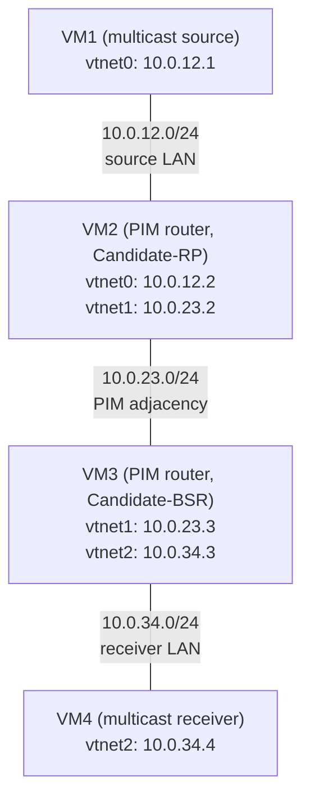

This lab shows a multicast routing example using PIM in Sparse Mode, with
[pimd](https://github.com/troglobit/pimd).

## Overview

### Network diagram

Here is the logical and physical view:



VM2 is the Rendezvous Point (RP) for the whole `224.0.0.0/4` range and VM3 is
the Bootstrap Router (BSR) that floods the RP set. VM1 and VM4 are plain hosts:
VM1 sends the multicast flow, VM4 joins the group with IGMP.

## Setting up the lab

### Downloading BSD Router Project images

Download the BSDRP serial image (to avoid needing an X display) from SourceForge.

### Download lab scripts

More information on the BSDRP lab scripts is available in [How to build a BSDRP router lab](how-to-build-a-bsdrp-router-lab.md).

Start the lab with 4 routers. The `-r pimsm` flag makes the lab script build
per-VM cloud-init disks that apply the configuration below automatically on
first boot (through the `labconfig` script shipped in the image):

```
tools/BSDRP-lab-bhyve.sh -i BSDRP-2.3-full-amd64.img.xz -n 4 -r pimsm
```

Without `-r pimsm` the 4 VMs boot unconfigured and you can enter the
configuration of each router by hand, as described below.

## Router configuration

### VM1 (multicast source)

A plain host, no PIM:

```
sysrc hostname=VM1 \
 gateway_enable=no \
 ipv6_gateway_enable=no \
 ifconfig_vtnet0="inet 10.0.12.1/24" \
 defaultrouter=10.0.12.2
service hostname restart
service netif restart
service routing restart
config save
```

### VM2 (Candidate Rendezvous Point)

VM2 is a PIM router that announces itself (10.0.23.2) as Candidate-RP with an
advertisement period of 10 seconds and high priority: it will become the
rendezvous point.

```
sysrc hostname=VM2 \
 gateway_enable=yes \
 ipv6_gateway_enable=yes \
 ifconfig_vtnet0="inet 10.0.12.2/24" \
 ifconfig_vtnet1="inet 10.0.23.2/24" \
 defaultrouter=10.0.23.3 \
 pimd_enable=yes

cat > /usr/local/etc/pimd.conf <<EOF
rp-candidate 10.0.23.2 time 10 priority 1
#rp-address 10.0.23.2
EOF

service hostname restart
service netif restart
service routing restart
service pimd start
config save
```

### VM3 (Candidate Bootstrap Router)

VM3 announces itself (10.0.23.3) as a Candidate-BSR with high priority.

```
sysrc hostname=VM3 \
 gateway_enable=yes \
 ipv6_gateway_enable=yes \
 ifconfig_vtnet1="inet 10.0.23.3/24" \
 ifconfig_vtnet2="inet 10.0.34.3/24" \
 defaultrouter=10.0.23.2 \
 pimd_enable=yes

cat > /usr/local/etc/pimd.conf <<EOF
bsr-candidate 10.0.23.3 priority 1
#rp-address 10.0.23.2
EOF

service hostname restart
service netif restart
service routing restart
service pimd start
config save
```

### VM4 (multicast receiver)

Another plain host, no PIM:

```
sysrc hostname=VM4 \
 gateway_enable=no \
 ipv6_gateway_enable=no \
 ifconfig_vtnet2="inet 10.0.34.4/24" \
 defaultrouter=10.0.34.3
service hostname restart
service netif restart
service routing restart
config save
```

## Checking NIC drivers and bhyve compatibility with multicast

Before moving to the advanced routing setup, test simple multicast between two directly connected hosts. Some NICs (such as vtnet) or hypervisor network setups do not handle even basic multicast correctly.

On VM1, start a multicast generator (an iperf client emitting multicast):

```
[root@VM1]~# iperf -c 239.1.1.1 -u -T 32 -t 300 -i 1
------------------------------------------------------------
Client connecting to 239.1.1.1, UDP port 5001
Sending 1470 byte datagrams, IPG target: 0.00 us (kalman adjust)
UDP buffer size: 9.00 KByte (default)
------------------------------------------------------------
[  1] local 10.0.12.1 port 46504 connected with 239.1.1.1 port 5001
[ ID] Interval       Transfer     Bandwidth
[  1] 0.00-1.00 sec   129 KBytes  1.06 Mbits/sec
[  1] 1.00-2.00 sec   128 KBytes  1.05 Mbits/sec
[  1] 2.00-3.00 sec   128 KBytes  1.05 Mbits/sec
(...)
```

On the directly connected VM2, check whether it sees multicast packets in non-promiscuous mode:

```
[root@VM2]~# tcpdump -pni vtnet0 -c 2
tcpdump: verbose output suppressed, use -v[v]... for full protocol decode
listening on vtnet0, link-type EN10MB (Ethernet), snapshot length 262144 bytes
23:29:32.800991 IP 10.0.12.1.46504 > 239.1.1.1.5001: UDP, length 1470
23:29:32.812784 IP 10.0.12.1.46504 > 239.1.1.1.5001: UDP, length 1470
2 packets captured
9 packets received by filter
0 packets dropped by kernel
```

VM2 receives multicast packets from 10.0.12.1 to multicast group 239.1.1.1. Now start a multicast listener on VM2 (an iperf server); it should receive the multicast flow:

```
[root@VM2]~# iperf -s -u -B 239.1.1.1%vtnet0 -i 1
------------------------------------------------------------
Server listening on UDP port 5001
Joining multicast (*,G)=*,239.1.1.1 w/iface vtnet0
Server set to single client traffic mode (per multicast receive)
UDP buffer size: 41.1 KByte (default)
------------------------------------------------------------
[  1] local 239.1.1.1 port 5001 connected with 10.0.12.1 port 46504
[ ID] Interval       Transfer     Bandwidth        Jitter   Lost/Total Datagrams
[  1] 0.00-1.00 sec   129 KBytes  1.06 Mbits/sec   0.028 ms 15995/16085 (99%)
[  1] 1.00-2.00 sec   128 KBytes  1.05 Mbits/sec   0.049 ms 0/89 (0%)
[  1] 2.00-3.00 sec   128 KBytes  1.05 Mbits/sec   0.044 ms 0/89 (0%)
(...)
```

The multicast receiver is correctly receiving at 1 Mb/s (the loss reported on
the first line just counts the datagrams sent before the listener started).

!!! warning "Always bind the listener to an interface"
    If the source interface is not given (`iperf -s -u -B 239.1.1.1 -i 1`),
    iperf joins the group on the wrong interface and the server stays in
    "waiting" mode forever.

## Checking pimd behavior

The examples below were captured with pimd 3.1.0 on BSDRP 2.3. The `-p` flag of
`pimctl` disables the terminal control characters used to highlight table
headings, which keeps the output copy-pasteable:

```
[root@VM2]~# pimctl -p version
pimd version 3.1.0
```

### PIM neighbors

Do the PIM routers see each other?

```
[root@VM2]~# pimctl -p show
_______________________________________________________________________________
PIM Interface Table
=================================================================================================
Interface         State     Address            Priority  Hello  Nbr  DR Address      DR Priority
=================================================================================================
vtnet0            Up        10.0.12.2                 1     30    0  10.0.12.2                 1
vtnet1            Up        10.0.23.2                 1     30    1  10.0.23.3                 1
_______________________________________________________________________________
PIM Neighbor Table
==================================================================================
Interface         Address            Priority  Mode  Uptime/Expires
==================================================================================
vtnet1            10.0.23.3                 1  DR    0h11m31s/0h1m40s
_______________________________________________________________________________
Multicast Routing Table
===============================================================================
Source            Group            RP Address       Flags
===============================================================================

Number of Groups        : 0
Number of Cache MIRRORs : 0
_______________________________________________________________________________
PIM Candidate Rendez-Vous Point Table
===============================================================================
Group Address     RP Address       Prio  Holdtime  Expires
===============================================================================
232.0.0.0/8       169.254.0.1         1   Forever  Never
224.0.0.0/4       10.0.23.2           1       150  0h2m10s

Current BSR address: 10.0.23.3
_______________________________________________________________________________
PIM Rendez-Vous Point Set Table
===============================================================================
Group Address     RP Address       Prio  Holdtime  Type
===============================================================================
232.0.0.0/8       169.254.0.1         1   Forever  Static
224.0.0.0/4       10.0.23.2           1       130  Dynamic
```

VM2 sees VM3 as a PIM neighbor (and as the Designated Router of the
10.0.23.0/24 link). It also learned, through the BSR 10.0.23.3, that itself
(10.0.23.2) is the RP for 224.0.0.0/4.

VM3 has the symmetric view:

```
[root@VM3]~# pimctl -p show neighbor
_______________________________________________________________________________
PIM Neighbor Table
==================================================================================
Interface         Address            Priority  Mode  Uptime/Expires
==================================================================================
vtnet1            10.0.23.2                 1        0h11m32s/0h1m40s
```

### Does the PIM daemon register to the PIM multicast group?

A PIM router must register to the 224.0.0.13 multicast group. Check that all PIM routers list this group on their enabled interfaces:

```
[root@VM2]~# ifmcstat -f inet
vtnet0:
        inet 10.0.12.2
        igmpv3 rv 2 qi 125 qri 100 uri 3
                group 224.0.0.22 mode exclude
                group 224.0.0.2 mode exclude
                group 224.0.0.13 mode exclude
                group 224.0.0.1 mode exclude
vtnet1:
        inet 10.0.23.2
        igmpv3 rv 2 qi 125 qri 100 uri 3
                group 224.0.0.22 mode exclude
                group 224.0.0.2 mode exclude
                group 224.0.0.13 mode exclude
                group 224.0.0.1 mode exclude
lo0:
        inet 127.0.0.1
        igmpv3 rv 2 qi 125 qri 10 uri 3
                group 224.0.0.1 mode exclude
```

The multicast group 224.0.0.13 is correctly subscribed on PIM-enabled interfaces.

## Testing

### 1. Start a multicast receiver (iperf server) on VM4

Start the receiver first: the IGMP report it sends makes VM3 build the shared
tree toward the RP before any traffic exists.

```
[root@VM4]~# iperf -s -u -B 239.1.1.1%vtnet2 -i 1
------------------------------------------------------------
Server listening on UDP port 5001
Joining multicast (*,G)=*,239.1.1.1 w/iface vtnet2
Server set to single client traffic mode (per multicast receive)
UDP buffer size: 41.1 KByte (default)
------------------------------------------------------------
```

### 2. Check that VM3 notices the subscriber

VM3 records the IGMP membership of 10.0.34.4 and creates the (*,G) entry
pointing to the RP, even though no source is active yet:

```
[root@VM3]~# pimctl -p show igmp groups
_______________________________________________________________________________
IGMP Group Membership Table
===============================================================================
Interface         Group            Source           Last Reported    Timeout
===============================================================================
vtnet2            239.1.1.1        ANY              10.0.34.4            385

[root@VM3]~# pimctl -p show mrt
_______________________________________________________________________________
Multicast Routing Table
===============================================================================
Source            Group            RP Address       Flags
===============================================================================
ANY               239.1.1.1        10.0.23.2        WC RP

Number of Groups        : 1
Number of Cache MIRRORs : 0
```

### 3. Start the multicast generator (iperf client) on VM1

```
[root@VM1]~# iperf -c 239.1.1.1 -u -T 32 -t 300 -i 1
------------------------------------------------------------
Client connecting to 239.1.1.1, UDP port 5001
Sending 1470 byte datagrams, IPG target: 0.00 us (kalman adjust)
UDP buffer size: 9.00 KByte (default)
------------------------------------------------------------
[  1] local 10.0.12.1 port 46504 connected with 239.1.1.1 port 5001
[ ID] Interval       Transfer     Bandwidth
[  1] 0.00-1.00 sec   129 KBytes  1.06 Mbits/sec
[  1] 1.00-2.00 sec   128 KBytes  1.05 Mbits/sec
[  1] 2.00-3.00 sec   128 KBytes  1.05 Mbits/sec
```

### 4. Check that VM2 switched to the shortest-path tree

VM2, the RP and the Designated Router of the source LAN, registers the source
and then switches the flow to the (S,G) shortest-path tree:

```
[root@VM2]~# pimctl -p show mrt
_______________________________________________________________________________
Multicast Routing Table
===============================================================================
Source            Group            RP Address       Flags
===============================================================================
ANY               239.1.1.1        10.0.23.2        WC RP
10.0.12.1         239.1.1.1        10.0.23.2        SPT CACHE ASSERTED SG

Number of Groups        : 1
Number of Cache MIRRORs : 1
```

The kernel multicast forwarding table confirms the traffic is forwarded from
the source LAN (vif 1) to the VM3 link (vif 2):

```
[root@VM2]~# netstat -g

IPv4 Virtual Interface Table
 Vif   Thresh   Local-Address   Remote-Address    Pkts-In   Pkts-Out
  0         1   10.0.12.2                               0          0
  1         1   10.0.12.2                            1117          0
  2         1   10.0.23.2                               0       1117

IPv4 Multicast Forwarding Table
 Origin          Group             Packets In-Vif  Out-Vifs:Ttls
 10.0.12.1       239.1.1.1            1117    1    2:1

IPv6 Multicast Interface Table is empty

IPv6 Multicast Forwarding Table is empty
```

### 5. Check that VM3 forwards the flow to the receiver

```
[root@VM3]~# pimctl -p show mrt
_______________________________________________________________________________
Multicast Routing Table
===============================================================================
Source            Group            RP Address       Flags
===============================================================================
ANY               239.1.1.1        10.0.23.2        WC RP CACHE ASSERTED

Number of Groups        : 1
Number of Cache MIRRORs : 1

[root@VM3]~# netstat -g

IPv4 Virtual Interface Table
 Vif   Thresh   Local-Address   Remote-Address    Pkts-In   Pkts-Out
  0         1   10.0.23.3                               0          0
  1         1   10.0.23.3                            2042          0
  2         1   10.0.34.3                               0       2042

IPv4 Multicast Forwarding Table
 Origin          Group             Packets In-Vif  Out-Vifs:Ttls
 10.0.12.1       239.1.1.1            2042    1    2:1

IPv6 Multicast Interface Table is empty

IPv6 Multicast Forwarding Table is empty
```

VM3 correctly learns that the source is reached through vif 1 (toward VM2) and
that the subscriber is on vif 2 (toward VM4).

### 6. Check the receiver

Back on VM4, the iperf server receives the full 1 Mb/s flow without loss:

```
[  1] local 239.1.1.1 port 5001 connected with 10.0.12.1 port 46504
[ ID] Interval       Transfer     Bandwidth        Jitter   Lost/Total Datagrams
[  1] 0.00-1.00 sec   129 KBytes  1.06 Mbits/sec   0.075 ms 0/90 (0%)
[  1] 1.00-2.00 sec   128 KBytes  1.05 Mbits/sec   0.089 ms 0/89 (0%)
[  1] 2.00-3.00 sec   128 KBytes  1.05 Mbits/sec   0.024 ms 0/89 (0%)
[  1] 3.00-4.00 sec   128 KBytes  1.05 Mbits/sec   0.032 ms 0/89 (0%)
```

The multicast flow crosses the two PIM-SM routers end to end.
