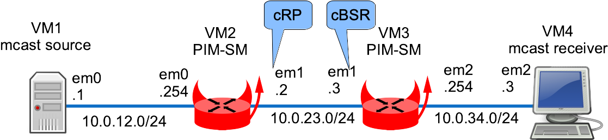

This lab shows a multicast routing example using PIM in Sparse Mode.

## Overview

### Network diagram

Here is the logical and physical view:



## Setting up the lab

### Downloading BSD Router Project images

Download the BSDRP serial image (to avoid needing an X display) from SourceForge.

### Download lab scripts

More information on the BSDRP lab scripts is available in [How to build a BSDRP router lab](how-to-build-a-bsdrp-router-lab.md).

Start the lab with 4 routers:

```
tools/BSDRP-lab-bhyve.sh -n 4 -i BSDRP-2.0-full-amd64.img.xz
BSD Router Project (https://bsdrp.net) - bhyve full-meshed lab script
Setting-up a virtual lab with 4 VM(s):
- Working directory: /home/olivier/BSDRP-VMs
- Each VM has a total of 1 (1 cores and 1 threads) and 1G RAM
- Emulated NIC: virtio-net
- Boot mode: UEFI
- Switch mode: bridge + tap
- 0 LAN(s) between all VM
- Full mesh Ethernet links between each VM
VM 1 has the following NIC:
- vtnet0 connected to VM 2
- vtnet1 connected to VM 3
- vtnet2 connected to VM 4
VM 2 has the following NIC:
- vtnet0 connected to VM 1
- vtnet1 connected to VM 3
- vtnet2 connected to VM 4
VM 3 has the following NIC:
- vtnet0 connected to VM 1
- vtnet1 connected to VM 2
- vtnet2 connected to VM 4
VM 4 has the following NIC:
- vtnet0 connected to VM 1
- vtnet1 connected to VM 2
- vtnet2 connected to VM 3
To connect VM'serial console, you can use:
- VM 1 : sudo cu -l /dev/nmdm-BSDRP.1B
- VM 2 : sudo cu -l /dev/nmdm-BSDRP.2B
- VM 3 : sudo cu -l /dev/nmdm-BSDRP.3B
- VM 4 : sudo cu -l /dev/nmdm-BSDRP.4B
```

## Router configuration

### Router 1

Configuration:

```
sysrc hostname=VM1 \
 gateway_enable=no \
 ipv6_gateway_enable=no \
 ifconfig_vtnet0="inet 10.0.12.1/24" \
 defaultrouter=10.0.12.254
service hostname restart
service netif restart
service routing restart
config save
```

### Router 2

VM2 is a PIM router that announces itself (10.0.23.2) as Candidate RP with an advertisement period of 10 seconds and high priority (it will be the rendezvous point).

```
sysrc hostname=VM2 \
 ifconfig_vtnet0="inet 10.0.12.254/24" \
 ifconfig_vtnet1="inet 10.0.23.2/24" \
 defaultrouter=10.0.23.3 \
 pimd_enable=yes

cat > /usr/local/etc/pimd.conf <<EOF
rp-candidate 10.0.23.2 time 10 priority 1
#rp-address 10.0.23.2

EOF

service hostname restart
service netif restart
service routing restart
service pimd start
config save
```

### Router 3

VM3 announces itself (10.0.23.3) as a Candidate Bootstrap Router with high priority.

```
sysrc hostname=VM3 \
 ifconfig_vtnet1="inet 10.0.23.3/24" \
 ifconfig_vtnet2="inet 10.0.34.254/24" \
 defaultrouter=10.0.23.2 \
 pimd_enable=yes

cat > /usr/local/etc/pimd.conf <<EOF
bsr-candidate 10.0.23.3 priority 1
#rp-address 10.0.23.2
EOF

service hostname restart
service netif restart
service routing restart
service pimd start
config save
```

### Router 4

```
sysrc hostname=VM4 \
 gateway_enable=no \
 ipv6_gateway_enable=no \
 ifconfig_vnet2="inet 10.0.34.4/24" \
 defaultrouter=10.0.34.254
service hostname restart
service netif restart
service routing restart
config save
```

## Checking NIC drivers and bhyve compatibility with multicast

Before moving to the advanced routing setup, test simple multicast between two directly connected hosts. Some NICs (such as vtnet) or hypervisor network setups do not handle even basic multicast correctly.

On VM1, start a multicast generator (an iperf client emitting multicast):

```
[root@VM1]~# iperf -c 239.1.1.1 -u -T 32 -t 3000 -i 1
------------------------------------------------------------
Client connecting to 239.1.1.1, UDP port 5001
Sending 1470 byte datagrams, IPG target: 11215.21 us (kalman adjust)
Setting multicast TTL to 32
UDP buffer size: 9.00 KByte (default)
------------------------------------------------------------
[  3] local 10.0.12.1 port 46636 connected with 239.1.1.1 port 5001
[ ID] Interval       Transfer     Bandwidth
[  3]  0.0- 1.0 sec   131 KBytes  1.07 Mbits/sec
[  3]  1.0- 2.0 sec   128 KBytes  1.05 Mbits/sec
[  3]  2.0- 3.0 sec   128 KBytes  1.05 Mbits/sec
[  3]  0.0- 3.5 sec   446 KBytes  1.05 Mbits/sec
[  3] Sent 311 datagrams
(...)
```

On the directly connected VM2, check whether it sees multicast packets in non-promiscuous mode:

```
[root@VM2]~# tcpdump -pni vtnet0 -c 2
tcpdump: verbose output suppressed, use -v or -vv for full protocol decode
listening on vtnet0, link-type EN10MB (Ethernet), capture size 262144 bytes
15:22:32.517270 IP 10.0.12.1.33482 > 239.1.1.1.5001: UDP, length 1470
15:22:32.528668 IP 10.0.12.1.33482 > 239.1.1.1.5001: UDP, length 1470
2 packets captured
2 packets received by filter
0 packets dropped by kernel
```

VM2 receives multicast packets from 10.0.12.1 to multicast group 239.1.1.1. Now start a multicast listener on VM2 (an iperf server); it should receive the multicast flow:

```
[root@VM2]~# iperf -s -u -B 239.1.1.1%vtnet0 -i 1
------------------------------------------------------------
Server listening on UDP port 5001
Binding to local address 239.1.1.1
Joining multicast group  239.1.1.1
Receiving 1470 byte datagrams
UDP buffer size: 41.1 KByte (default)
------------------------------------------------------------
[  3] local 239.1.1.1 port 5001 connected with 192.168.100.149 port 35181
[ ID] Interval       Transfer     Bandwidth        Jitter   Lost/Total Datagrams
[  3]  0.0- 1.0 sec   129 KBytes  1.06 Mbits/sec   0.038 ms  107/  197 (54%)
[  3]  1.0- 2.0 sec   128 KBytes  1.05 Mbits/sec   0.054 ms    0/   89 (0%)
[  3]  2.0- 3.0 sec   128 KBytes  1.05 Mbits/sec   0.021 ms    0/   89 (0%)
[  3]  3.0- 4.0 sec   128 KBytes  1.05 Mbits/sec   0.025 ms    0/   89 (0%)
[  3]  4.0- 5.0 sec   128 KBytes  1.05 Mbits/sec   0.024 ms    0/   89 (0%)
[  3]  5.0- 6.0 sec   129 KBytes  1.06 Mbits/sec   0.024 ms    0/   90 (0%)
[  3]  6.0- 7.0 sec   128 KBytes  1.05 Mbits/sec   0.024 ms    0/   89 (0%)
(...)
```

The multicast receiver is correctly receiving at 1 Mb/s.

Here is a non-working example (the source interface is not given, so iperf binds to the other one):

```
[root@VM2]~# iperf -s -u -B 239.1.1.1 -i 1
------------------------------------------------------------
Server listening on UDP port 5001
Binding to local address 239.1.1.1
Joining multicast group  239.1.1.1
Receiving 1470 byte datagrams
UDP buffer size: 41.1 KByte (default)
------------------------------------------------------------
(...)
```

No traffic is received and the server stays in “waiting” mode forever.

## Checking pimd behavior

### PIM neighbors

Do the PIM routers see each other?


```
root@VM2:~ # pimctl show

PIM Interface Table
Interface         State     Address            Priority  Hello  Nbr  DR Address      DR Priority
vtnet0               Up        10.0.12.2                 1     30    0  10.0.12.2      1
vtnet1               Up        10.0.23.2                 1     30    1  10.0.23.3      1

PIM Neighbor Table
Interface         Address            Priority  Mode  Uptime/Expires
vtnet1               10.0.23.3                 1  DR    0h2m51s/0h1m25s

Multicast Routing Table
Source            Group            RP Address       Flags
10.0.12.1         239.1.1.1        10.0.23.2        SG

Number of Groups        : 1
Number of Cache MIRRORs : 0

PIM Candidate Rendez-Vous Point Table
Group Address     RP Address       Prio  Holdtime  Expires
232.0.0.0/8       169.254.0.1         1   Forever  Never
224.0.0.0/4       10.0.23.2           1       150  0h1m45s

Current BSR address: 10.0.23.3

PIM Rendez-Vous Point Set Table
Group Address     RP Address       Prio  Holdtime  Type
232.0.0.0/8       169.254.0.1         1   Forever  Static
224.0.0.0/4       10.0.23.2           1       105  Dynamic
```

VM2 sees VM3 as a PIM neighbor.

```
root@VM3:~ # pimctl show

PIM Interface Table
Interface         State     Address            Priority  Hello  Nbr  DR Address      DR Priority
vtnet1               Up        10.0.23.3                 1     30    1  10.0.23.3       1
vtnet2               Up        10.0.34.3                 1     30    0  10.0.34.3       1

PIM Neighbor Table
Interface         Address            Priority  Mode  Uptime/Expires
vtnet1               10.0.23.2                 1        0h3m55s/0h1m15s

Multicast Routing Table
Source            Group            RP Address       Flags

Number of Groups        : 0
Number of Cache MIRRORs : 0

PIM Candidate Rendez-Vous Point Table
Group Address     RP Address       Prio  Holdtime  Expires
232.0.0.0/8       169.254.0.1         1   Forever  Never
224.0.0.0/4       10.0.23.2           1       150  0h2m25s

Current BSR address: 10.0.23.3

PIM Rendez-Vous Point Set Table
Group Address     RP Address       Prio  Holdtime  Type
232.0.0.0/8       169.254.0.1         1   Forever  Static
224.0.0.0/4       10.0.23.2           1       145  Dynamic
```

VM3 sees VM2 as a PIM Designated Router neighbor.

### Does the PIM daemon register to the PIM multicast group?

A PIM router must register to the 224.0.0.13 multicast group. Check that all PIM routers list this group on their enabled interfaces:

```
[root@VM2]~# ifmcstat
vtnet0:
        inet 10.0.12.2
        igmpv2
                group 224.0.0.22 refcnt 1 state lazy mode exclude
                        mcast-macaddr 01:00:5e:00:00:16 refcnt 1
                group 224.0.0.2 refcnt 1 state lazy mode exclude
                        mcast-macaddr 01:00:5e:00:00:02 refcnt 1
                group 224.0.0.13 refcnt 1 state lazy mode exclude
                        mcast-macaddr 01:00:5e:00:00:0d refcnt 1
                group 224.0.0.1 refcnt 1 state silent mode exclude
                        mcast-macaddr 01:00:5e:00:00:01 refcnt 1
        inet6 fe80:1::a8aa:ff:fe00:212
        mldv2 flags=2<USEALLOW> rv 2 qi 125 qri 10 uri 3
                group ff01:1::1 refcnt 1
                        mcast-macaddr 33:33:00:00:00:01 refcnt 1
                group ff02:1::2:54c6:805c refcnt 1
                        mcast-macaddr 33:33:54:c6:80:5c refcnt 1
                group ff02:1::2:ff54:c680 refcnt 1
                        mcast-macaddr 33:33:ff:54:c6:80 refcnt 1
                group ff02:1::1 refcnt 1
                        mcast-macaddr 33:33:00:00:00:01 refcnt 1
                group ff02:1::1:ff00:212 refcnt 1
                        mcast-macaddr 33:33:ff:00:02:12 refcnt 1
vtnet1:
        inet 10.0.23.2
        igmpv2
                group 224.0.0.22 refcnt 1 state sleeping mode exclude
                        mcast-macaddr 01:00:5e:00:00:16 refcnt 1
                group 224.0.0.2 refcnt 1 state lazy mode exclude
                        mcast-macaddr 01:00:5e:00:00:02 refcnt 1
                group 224.0.0.13 refcnt 1 state lazy mode exclude
                        mcast-macaddr 01:00:5e:00:00:0d refcnt 1
                group 224.0.0.1 refcnt 1 state silent mode exclude
                        mcast-macaddr 01:00:5e:00:00:01 refcnt 1
        inet6 fe80:2::a8aa:ff:fe02:202
        mldv2 flags=2<USEALLOW> rv 2 qi 125 qri 10 uri 3
                group ff01:2::1 refcnt 1
                        mcast-macaddr 33:33:00:00:00:01 refcnt 1
                group ff02:2::2:54c6:805c refcnt 1
                        mcast-macaddr 33:33:54:c6:80:5c refcnt 1
                group ff02:2::2:ff54:c680 refcnt 1
                        mcast-macaddr 33:33:ff:54:c6:80 refcnt 1
                group ff02:2::1 refcnt 1
                        mcast-macaddr 33:33:00:00:00:01 refcnt 1
                group ff02:2::1:ff02:202 refcnt 1
                        mcast-macaddr 33:33:ff:02:02:02 refcnt 1

[root@VM3]~# ifmcstat
em0:
em1:
        inet 10.0.23.3
        igmpv2
                group 224.0.0.22 refcnt 1 state sleeping mode exclude
                        mcast-macaddr 01:00:5e:00:00:16 refcnt 1
                group 224.0.0.2 refcnt 1 state sleeping mode exclude
                        mcast-macaddr 01:00:5e:00:00:02 refcnt 1
                group 224.0.0.13 refcnt 1 state lazy mode exclude
                        mcast-macaddr 01:00:5e:00:00:0d refcnt 1
                group 224.0.0.1 refcnt 1 state silent mode exclude
                        mcast-macaddr 01:00:5e:00:00:01 refcnt 1
        inet6 fe80:2::a8aa:ff:fe00:323
        mldv2 flags=2<USEALLOW> rv 2 qi 125 qri 10 uri 3
                group ff01:2::1 refcnt 1
                        mcast-macaddr 33:33:00:00:00:01 refcnt 1
                group ff02:2::2:1124:9296 refcnt 1
                        mcast-macaddr 33:33:11:24:92:96 refcnt 1
                group ff02:2::2:ff11:2492 refcnt 1
                        mcast-macaddr 33:33:ff:11:24:92 refcnt 1
                group ff02:2::1 refcnt 1
                        mcast-macaddr 33:33:00:00:00:01 refcnt 1
                group ff02:2::1:ff00:323 refcnt 1
                        mcast-macaddr 33:33:ff:00:03:23 refcnt 1
em2:
        inet 10.0.34.3
        igmpv2
                group 224.0.0.22 refcnt 1 state lazy mode exclude
                        mcast-macaddr 01:00:5e:00:00:16 refcnt 1
                group 224.0.0.2 refcnt 1 state lazy mode exclude
                        mcast-macaddr 01:00:5e:00:00:02 refcnt 1
                group 224.0.0.13 refcnt 1 state lazy mode exclude
                        mcast-macaddr 01:00:5e:00:00:0d refcnt 1
                group 224.0.0.1 refcnt 1 state silent mode exclude
                        mcast-macaddr 01:00:5e:00:00:01 refcnt 1
        inet6 fe80:3::a8aa:ff:fe03:303
        mldv2 flags=2<USEALLOW> rv 2 qi 125 qri 10 uri 3
                group ff01:3::1 refcnt 1
                        mcast-macaddr 33:33:00:00:00:01 refcnt 1
                group ff02:3::2:1124:9296 refcnt 1
                        mcast-macaddr 33:33:11:24:92:96 refcnt 1
                group ff02:3::2:ff11:2492 refcnt 1
                        mcast-macaddr 33:33:ff:11:24:92 refcnt 1
                group ff02:3::1 refcnt 1
                        mcast-macaddr 33:33:00:00:00:01 refcnt 1
                group ff02:3::1:ff03:303 refcnt 1
                        mcast-macaddr 33:33:ff:03:03:03 refcnt 1
```

The multicast group 224.0.0.13 is correctly subscribed on PIM-enabled interfaces.

## Testing

### 1. Start a multicast generator (iperf client) on VM1

Start an iperf client toward 239.1.1.1:

```
[root@VM1]~# iperf -c 239.1.1.1 -u -T 32 -t 3000 -i 1
------------------------------------------------------------
Client connecting to 239.1.1.1, UDP port 5001
Sending 1470 byte datagrams
Setting multicast TTL to 32
UDP buffer size: 9.00 KByte (default)
------------------------------------------------------------
[  3] local 10.0.12.1 port 41484 connected with 239.1.1.1 port 5001
[ ID] Interval       Transfer     Bandwidth
[  3]  0.0- 1.0 sec   129 KBytes  1.06 Mbits/sec
[  3]  1.0- 2.0 sec   128 KBytes  1.05 Mbits/sec
[  3]  2.0- 3.0 sec   128 KBytes  1.05 Mbits/sec
[  3]  3.0- 4.0 sec   128 KBytes  1.05 Mbits/sec
```

### 2. Check that VM2 updates its mroute table with the discovered multicast source

The PIM daemon should be updated:

```
[root@VM2]~# pimctl -r
pimctl: Sending cmd show: No error: 0

PIM Interface Table
Interface         State     Address            Priority  Hello  Nbr  DR Address      DR Priority
vtnet0            Up        10.0.12.2                 1     30    0  10.0.12.2                 1
vtnet1            Up        10.0.23.2                 1     30    1  10.0.23.3                 1

PIM Neighbor Table
Interface         Address            Priority  Mode  Uptime/Expires
vtnet1            10.0.23.3                 1  DR    0h8m36s/0h1m40s

Multicast Routing Table
Source            Group            RP Address       Flags
10.0.12.1         239.1.1.1        10.0.23.2        SPT SG

Number of Groups        : 1
Number of Cache MIRRORs : 0

PIM Candidate Rendez-Vous Point Table
Group Address     RP Address       Prio  Holdtime  Expires
232.0.0.0/8       169.254.0.1         1   Forever  Never
224.0.0.0/4       10.0.23.2           1       150  0h2m0s

Current BSR address: 10.0.23.3

PIM Rendez-Vous Point Set Table
Group Address     RP Address       Prio  Holdtime  Type
232.0.0.0/8       169.254.0.1         1   Forever  Static
224.0.0.0/4       10.0.23.2           1       120  Dynamic
```

And the multicast routing table too:

```
[root@VM2]~# netstat -g

IPv4 Virtual Interface Table
 Vif   Thresh   Local-Address   Remote-Address    Pkts-In   Pkts-Out
  0         1   10.0.12.2                               0          0
  1         1   10.0.12.2                           18267          0
  2         1   10.0.23.2                               0      18267

IPv4 Multicast Forwarding Table
 Origin          Group             Packets In-Vif  Out-Vifs:Ttls
 10.0.12.1       239.1.1.1               0  65535

IPv6 Multicast Interface Table is empty

IPv6 Multicast Forwarding Table is empty
```

VM2 has updated its mroute table to add a source for group 239.1.1.1 coming from ‘65535’ (?).

### 3. Start a multicast receiver (iperf server) on VM4

The iperf server subscribes to multicast group 239.1.1.1 and receives the multicast traffic:

```
[root@VM4]~# iperf -s -u -B 239.1.1.1 -i 1
------------------------------------------------------------
Server listening on UDP port 5001
Binding to local address 239.1.1.1
Joining multicast group  239.1.1.1
Receiving 1470 byte datagrams
UDP buffer size: 41.1 KByte (default)
------------------------------------------------------------
[  3] local 239.1.1.1 port 5001 connected with 10.0.12.1 port 41484
[ ID] Interval       Transfer     Bandwidth        Jitter   Lost/Total Datagrams
[  3]  0.0- 1.0 sec   128 KBytes  1.05 Mbits/sec   0.313 ms 16336/16425 (99%)
[  3]  1.0- 2.0 sec   128 KBytes  1.05 Mbits/sec   0.250 ms    0/   89 (0%)
[  3]  2.0- 3.0 sec   128 KBytes  1.05 Mbits/sec   0.307 ms    0/   89 (0%)
[  3]  3.0- 4.0 sec   128 KBytes  1.05 Mbits/sec   0.262 ms    0/   89 (0%)
[  3]  4.0- 5.0 sec   128 KBytes  1.05 Mbits/sec   0.188 ms    0/   89 (0%)
[  3]  5.0- 6.0 sec   129 KBytes  1.06 Mbits/sec   0.347 ms    0/   90 (0%)
[  3]  6.0- 7.0 sec   128 KBytes  1.05 Mbits/sec   0.238 ms    0/   89 (0%)
[  3]  7.0- 8.0 sec   128 KBytes  1.05 Mbits/sec   0.234 ms    0/   89 (0%)
[  3]  8.0- 9.0 sec   128 KBytes  1.05 Mbits/sec   0.241 ms    0/   89 (0%)
[  3]  9.0-10.0 sec   128 KBytes  1.05 Mbits/sec   0.210 ms    0/   89 (0%)
[  3] 10.0-11.0 sec   128 KBytes  1.05 Mbits/sec   0.289 ms    0/   89 (0%)
[  3] 11.0-12.0 sec   129 KBytes  1.06 Mbits/sec   0.309 ms    0/   90 (0%)
```

### 4. Check that VM3 correctly notices this multicast subscriber

VM3’s mroute table is updated and knows it has a customer:

```
[root@VM3]~# pimctl -d
pimctl: Sending cmd show: No error: 0

PIM Interface Table
Interface         State     Address            Priority  Hello  Nbr  DR Address      DR Priority
vtnet1            Up        10.0.23.3                 1     30    1  10.0.23.3                 1
vtnet2            Up        10.0.34.3                 1     30    0  10.0.34.3                 1

PIM Neighbor Table
Interface         Address            Priority  Mode  Uptime/Expires
vtnet1            10.0.23.2                 1        0h14m40s/0h1m35s

Multicast Routing Table
Source            Group            RP Address       Flags
ANY               239.1.1.1        10.0.23.2        WC RP
10.0.12.1         239.1.1.1        10.0.23.2        CACHE SG

Number of Groups        : 1
Number of Cache MIRRORs : 1

PIM Candidate Rendez-Vous Point Table
Group Address     RP Address       Prio  Holdtime  Expires
232.0.0.0/8       169.254.0.1         1   Forever  Never
224.0.0.0/4       10.0.23.2           1       150  0h2m25s

Current BSR address: 10.0.23.3

PIM Rendez-Vous Point Set Table
Group Address     RP Address       Prio  Holdtime  Type
232.0.0.0/8       169.254.0.1         1   Forever  Static
224.0.0.0/4       10.0.23.2           1       145  Dynamic                                                                                                               
```

And its multicast routing table is updated too:

```
[root@VM3]~# netstat -g
IPv4 Virtual Interface Table
 Vif   Thresh   Local-Address   Remote-Address    Pkts-In   Pkts-Out
  0         1   10.0.23.3                               0          0
  1         1   10.0.23.3                           30739          0
  2         1   10.0.34.3                               0      29215

IPv4 Multicast Forwarding Table
 Origin          Group             Packets In-Vif  Out-Vifs:Ttls
 10.0.12.1       239.1.1.1           29215    1    2:1

IPv6 Multicast Interface Table is empty

IPv6 Multicast Forwarding Table is empty
```

VM3 correctly learns that there is a subscriber to group 239.1.1.1 on vif1 (toward VM4) and that the source is on vif0 (toward VM2).
