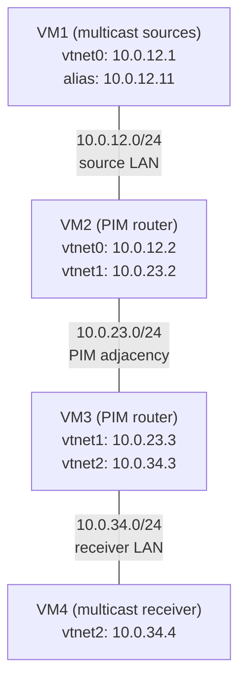

This lab shows a multicast routing example using PIM in Source Specific
Multicast mode, with [pimd](https://github.com/troglobit/pimd).

PIM-SSM is a simplification of [PIM-SM](multicast-with-pim-sm.md): a receiver
does not ask for "everything sent to group G"; it asks for "what source S sends
to group G". Because the source is known from the start, the router builds the
(S,G) shortest-path tree immediately. There is no shared tree, so the lab needs
**neither a Rendezvous Point nor a Bootstrap Router**.

The trade-off is that receivers must use IGMPv3 (FreeBSD does by default) and
the group must belong to the SSM range, 232.0.0.0/8 per RFC 4607.

## Overview

### Network diagram

Here is the logical and physical view:



VM1 carries two addresses and will emit the same group 232.1.1.1 from both:
10.0.12.1 is the source the receiver subscribes to, 10.0.12.11 is a decoy used
to show that SSM filters on the source.

## Setting up the lab

### Downloading BSD Router Project images

Download the BSDRP serial image (to avoid needing an X display) from SourceForge.

### Download lab scripts

More information on the BSDRP lab scripts is available in [How to build a BSDRP router lab](how-to-build-a-bsdrp-router-lab.md).

Start the lab with 4 routers. The `-r pimssm` flag makes the lab script build
per-VM cloud-init disks that apply the configuration below automatically on
first boot (through the `labconfig` script shipped in the image):

```
tools/BSDRP-lab-bhyve.sh -i BSDRP-2.3-full-amd64.img.xz -n 4 -r pimssm
```

Without `-r pimssm`, the 4 VMs boot unconfigured and you can enter the
configuration of each router by hand, as described below.

## Router configuration

### VM1 (multicast sources)

A plain host, no PIM. The `/32` alias is the decoy source:

```
sysrc hostname=VM1 \
 gateway_enable=no \
 ipv6_gateway_enable=no \
 ifconfig_vtnet0="inet 10.0.12.1/24" \
 ifconfig_vtnet0_alias0="inet 10.0.12.11/32" \
 defaultrouter=10.0.12.2
service hostname restart
service netif restart
service routing restart
config save
```

### VM2 (PIM router, source side)

No `rp-candidate`, no `bsr-candidate`: the only thing to declare is the group
range handled as source-specific. `ssm-range default` is 232.0.0.0/8, which is
also what pimd uses when nothing is configured, but writing it down documents
the range for whoever reads the router configuration:

```
sysrc hostname=VM2 \
 gateway_enable=yes \
 ipv6_gateway_enable=yes \
 ifconfig_vtnet0="inet 10.0.12.2/24" \
 ifconfig_vtnet1="inet 10.0.23.2/24" \
 defaultrouter=10.0.23.3 \
 pimd_enable=yes

cat > /usr/local/etc/pimd.conf <<EOF
ssm-range default
EOF

service hostname restart
service netif restart
service routing restart
service pimd start
config save
```

### VM3 (PIM router, receiver side)

Same configuration, mirrored:

```
sysrc hostname=VM3 \
 gateway_enable=yes \
 ipv6_gateway_enable=yes \
 ifconfig_vtnet1="inet 10.0.23.3/24" \
 ifconfig_vtnet2="inet 10.0.34.3/24" \
 defaultrouter=10.0.23.2 \
 pimd_enable=yes

cat > /usr/local/etc/pimd.conf <<EOF
ssm-range default
EOF

service hostname restart
service netif restart
service routing restart
service pimd start
config save
```

!!! warning "All routers must agree on the SSM range"
    Nothing in PIM advertises the SSM range: it is local configuration on every
    router, like Cisco's `ip pim ssm range`. A group inside the range on one
    router and outside it on the next will not work. Note also that configuring
    any `ssm-range` line *replaces* the default range instead of adding to it,
    so keeping 232.0.0.0/8 alongside a range of your own needs an explicit
    `ssm-range default` line.

### VM4 (multicast receiver)

Another plain host, no PIM:

```
sysrc hostname=VM4 \
 gateway_enable=no \
 ipv6_gateway_enable=no \
 ifconfig_vtnet2="inet 10.0.34.4/24" \
 defaultrouter=10.0.34.3
service hostname restart
service netif restart
service routing restart
config save
```

## Checking pimd behavior

The examples below were captured with pimd 3.1.0 on BSDRP 2.3. The `-p` flag of
`pimctl` disables the terminal control characters used to highlight table
headings, which keeps the output copy-pasteable.

### No Rendezvous Point, no Bootstrap Router

This is the visible difference from the PIM-SM lab: the RP set holds only the
static SSM entry (169.254.0.1 is the placeholder pimd uses for "no RP needed"),
and there is no BSR line at all.

```
[root@VM2]~# pimctl -p show rp
_______________________________________________________________________________
PIM Rendez-Vous Point Set Table
===============================================================================
Group Address     RP Address       Prio  Holdtime  Type
===============================================================================
232.0.0.0/8       169.254.0.1         1   Forever  Static
```

The PIM adjacency between the two routers is built exactly as in sparse mode:

```
[root@VM2]~# pimctl -p show neighbor
_______________________________________________________________________________
PIM Neighbor Table
==================================================================================
Interface         Address            Priority  Mode  Uptime/Expires
==================================================================================
vtnet1            10.0.23.3                 1  DR    0h0m7s/0h1m40s
```

## Testing

### 1. Start the receiver on VM4

iperf joins a source-specific group with `-H` (`--ssm-host`), which makes it
send an IGMPv3 include-mode report instead of a plain any-source join:

```
[root@VM4]~# iperf -s -u -B 232.1.1.1%vtnet2 -H 10.0.12.1 -i 1
------------------------------------------------------------
Server listening on UDP port 5001
Joining multicast (S,G)=10.0.12.1,232.1.1.1 w/iface vtnet2
Server set to single client traffic mode (per multicast receive)
UDP buffer size: 41.1 KByte (default)
------------------------------------------------------------
```

The kernel confirms the membership is in include mode, that is, restricted to a
source list:

```
[root@VM4]~# ifmcstat -i vtnet2 -f inet
                group 232.1.1.1 mode include
                        mcast-macaddr 01:00:5e:01:01:01
```

### 2. Check that VM3 learns the (S,G) request

VM3 records which source the receiver asked for, and creates the (S,G) route
immediately, before any traffic exists. There is no `WC RP` entry at any point:

```
[root@VM3]~# pimctl -p show igmp groups
_______________________________________________________________________________
IGMP Group Membership Table
===============================================================================
Interface         Group            Source           Last Reported    Timeout
===============================================================================
vtnet2            232.1.1.1        10.0.12.1        10.0.34.4            385

[root@VM3]~# pimctl -p show mrt
_______________________________________________________________________________
Multicast Routing Table
===============================================================================
Source            Group            RP Address       Flags
===============================================================================
10.0.12.1         232.1.1.1        SSM              KAT SG

Number of Groups        : 1
Number of Cache MIRRORs : 0
```

The `RP Address` column reads `SSM` instead of an address: the tree is rooted at
the source, not at a rendezvous point.

### 3. Start the multicast generator on VM1

`-B` on the client selects which of the two VM1 addresses is used as source:

```
[root@VM1]~# iperf -c 232.1.1.1 -u -T 32 -t 600 -i 1 -B 10.0.12.1
------------------------------------------------------------
Client connecting to 232.1.1.1, UDP port 5001
Sending 1470 byte datagrams, IPG target: 0.00 us (kalman adjust)
UDP buffer size: 9.00 KByte (default)
------------------------------------------------------------
[  1] local 10.0.12.1 port 58083 connected with 232.1.1.1 port 5001
[ ID] Interval       Transfer     Bandwidth
[  1] 0.00-1.00 sec   129 KBytes  1.06 Mbits/sec
[  1] 1.00-2.00 sec   128 KBytes  1.05 Mbits/sec
```

The receiver gets the flow without loss:

```
[  1] local 232.1.1.1 port 5001 connected with 10.0.12.1 port 58083
[ ID] Interval       Transfer     Bandwidth        Jitter   Lost/Total Datagrams
[  1] 0.00-1.00 sec   129 KBytes  1.06 Mbits/sec   0.051 ms 0/90 (0%)
[  1] 1.00-2.00 sec   128 KBytes  1.05 Mbits/sec   0.067 ms 0/89 (0%)
[  1] 2.00-3.00 sec   128 KBytes  1.05 Mbits/sec   0.064 ms 0/89 (0%)
[  1] 3.00-4.00 sec   128 KBytes  1.05 Mbits/sec   0.033 ms 0/89 (0%)
```

Both routers forward on the shortest-path tree:

```
[root@VM2]~# pimctl -p show mrt
_______________________________________________________________________________
Multicast Routing Table
===============================================================================
Source            Group            RP Address       Flags
===============================================================================
10.0.12.1         232.1.1.1        SSM              SPT CACHE ASSERTED SG

Number of Groups        : 1
Number of Cache MIRRORs : 1

[root@VM3]~# netstat -g

IPv4 Virtual Interface Table
 Vif   Thresh   Local-Address   Remote-Address    Pkts-In   Pkts-Out
  0         1   10.0.23.3                               0          0
  1         1   10.0.23.3                            1368          0
  2         1   10.0.34.3                               0       1368

IPv4 Multicast Forwarding Table
 Origin          Group             Packets In-Vif  Out-Vifs:Ttls
 10.0.12.1       232.1.1.1            1368    1    2:1
```

Compared to the PIM-SM lab, there is no registration step and no switchover: the
traffic takes the source tree from the first packet.

### 4. An any-source join in the SSM range receives nothing

Start the same listener without `-H`, so it sends a plain any-source report,
and start the source. Nothing arrives:

```
[root@VM4]~# iperf -s -u -B 232.1.1.1%vtnet2 -i 1
------------------------------------------------------------
Server listening on UDP port 5001
Joining multicast (*,G)=*,232.1.1.1 w/iface vtnet2
Server set to single client traffic mode (per multicast receive)
UDP buffer size: 41.1 KByte (default)
------------------------------------------------------------
```

VM3 ignores the report, as required by RFC 4604, so no route is created and
nothing is pulled from the source:

```
[root@VM3]~# pimctl -p show igmp groups
_______________________________________________________________________________
IGMP Group Membership Table
===============================================================================
Interface         Group            Source           Last Reported    Timeout
===============================================================================

[root@VM3]~# pimctl -p show mrt
_______________________________________________________________________________
Multicast Routing Table
===============================================================================
Source            Group            RP Address       Flags
===============================================================================

Number of Groups        : 0
Number of Cache MIRRORs : 0
```

!!! note "Check this test from a clean state"
    An (S,G) entry created by a previous source-specific join survives the
    receiver leaving, for the duration of its keepalive timer (the `KAT` flag),
    and keeps the traffic flowing to the receiver LAN in the meantime. Restart
    pimd on both routers, or wait for the entry to disappear from `pimctl show
    mrt`, before concluding that the any-source join is what delivered traffic.

### 5. Only the requested source is forwarded

With the receiver joined to (10.0.12.1, 232.1.1.1), start a second generator on
VM1 using the decoy address, toward the same group:

```
[root@VM1]~# iperf -c 232.1.1.1 -u -T 32 -t 600 -i 1 -B 10.0.12.11
[  1] local 10.0.12.11 port 34059 connected with 232.1.1.1 port 5001
```

VM2, which is on the source LAN, sees both sources but only forwards the one a
receiver asked for. The decoy has no outgoing interface (`In-Vif 65535`, zero
packets forwarded):

```
[root@VM2]~# pimctl -p show mrt
_______________________________________________________________________________
Multicast Routing Table
===============================================================================
Source            Group            RP Address       Flags
===============================================================================
10.0.12.1         232.1.1.1        SSM              SPT CACHE ASSERTED SG
10.0.12.11        232.1.1.1        SSM              SG

Number of Groups        : 1
Number of Cache MIRRORs : 1

[root@VM2]~# netstat -g
IPv4 Virtual Interface Table
 Vif   Thresh   Local-Address   Remote-Address    Pkts-In   Pkts-Out
  0         1   10.0.12.2                               0          0
  1         1   10.0.12.2                            3969          0
  2         1   10.0.23.2                               0       3969

IPv4 Multicast Forwarding Table
 Origin          Group             Packets In-Vif  Out-Vifs:Ttls
 10.0.12.11      232.1.1.1               0  65535
 10.0.12.1       232.1.1.1            3969    1    2:1
```

On the receiver LAN, only the subscribed source is seen on the wire:

```
[root@VM4]~# tcpdump -pni vtnet2 -c 4 host 232.1.1.1
tcpdump: verbose output suppressed, use -v[v]... for full protocol decode
listening on vtnet2, link-type EN10MB (Ethernet), snapshot length 262144 bytes
01:11:05.205695 IP 10.0.12.1.16264 > 232.1.1.1.5001: UDP, length 1470
01:11:05.216791 IP 10.0.12.1.16264 > 232.1.1.1.5001: UDP, length 1470
01:11:05.227738 IP 10.0.12.1.16264 > 232.1.1.1.5001: UDP, length 1470
01:11:05.238751 IP 10.0.12.1.16264 > 232.1.1.1.5001: UDP, length 1470
4 packets captured
10 packets received by filter
0 packets dropped by kernel
```

The decoy traffic never leaves the source LAN: with SSM, a source that nobody
subscribed to costs the rest of the network nothing.
