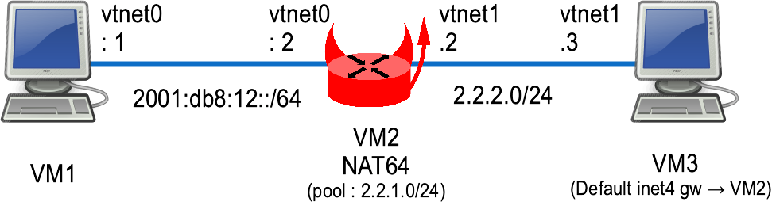

This lab shows a NAT64 example using BSDRP with tayga (user space) and ipfw (kernel space).

## Overview

### Network diagram

Here is the logical and physical view:



## Setting up the lab

### Downloading BSD Router Project images

[Download the BSDRP serial image](../../downloads.md) (which avoids the need for an X display).

### Download lab scripts

More information on the BSDRP lab scripts is available in [How to build a BSDRP router lab](how-to-build-a-bsdrp-router-lab.md).

Start the lab with 3 routers, using bhyve on FreeBSD:

```
user:~ # tools/BSDRP-lab-bhyve.sh -i BSDRP-1.93-full-amd64-serial.img.xz -n 3
BSD Router Project (http://bsdrp.net) - bhyve full-meshed lab script
Setting-up a virtual lab with 3 VM(s):
- Working directory: /tmp/BSDRP
- Each VM has 1 core and 512M RAM
- Emulated NIC: virtio-net
- Switch mode: bridge + tap
- 0 LAN(s) between all VM
- Full mesh Ethernet links between each VM
VM 1 has the following NIC:
- vtnet0 connected to VM 2
- vtnet1 connected to VM 3
VM 2 has the following NIC:
- vtnet0 connected to VM 1
- vtnet1 connected to VM 3
VM 3 has the following NIC:
- vtnet0 connected to VM 1
- vtnet1 connected to VM 2
To connect VM'serial console, you can use:
- VM 1 : cu -l /dev/nmdm-BSDRP.1B
- VM 2 : cu -l /dev/nmdm-BSDRP.2B
- VM 3 : cu -l /dev/nmdm-BSDRP.3B
```

## Generic configuration

### VM 1 (client)

VM1 is configured as a simple IPv6-only host:

```
sysrc hostname=VM1 \
 gateway_enable=NO \
 ipv6_gateway_enable=NO \
 ifconfig_vtnet0_ipv6="inet6 2001:db8:12::1 prefixlen 64" \
 ipv6_defaultrouter="2001:db8:12::2"
service hostname restart
service netif restart
service routing restart
config save
```

### Router 2

VM2 is a router with one interface toward the IPv6 network and another toward the IPv4 network.

```
sysrc hostname=VM2 \
 ifconfig_vtnet1="inet 2.2.2.2/24" \
 ifconfig_vtnet0_ipv6="inet6 2001:db8:12::2 prefixlen 64"
service hostname restart
service netif restart
service routing restart
config save
```

### VM 3 (client)

VM3 is configured as a simple IPv4-only host:

```
sysrc hostname=VM3 \
 gateway_enable=NO \
 ipv6_gateway_enable=NO \
 ifconfig_vtnet1="inet 2.2.2.3/24" \
 defaultrouter="2.2.2.2"
service hostname restart
service netif restart
service routing restart
config save
```

## Tayga (user space stateless NAT64)

### VM2

Modify the default tayga configuration file and enable the service:

```
service tayga enable
sed -i "" 's/192.168.255./2.2.1./g' /usr/local/etc/tayga.conf
sed -i "" 's/2001:db8:1:ffff::/64:ff9b::/g' /usr/local/etc/tayga.conf
service tayga start
```

Quick test from VM2 by pinging its IPv4 address from its IPv6 one, then targeting VM3:

```
[root@VM2]~# ping6 -c 3 64:ff9b::2.2.2.2
PING6(56=40+8+8 bytes) 2001:db8:12::2 --> 64:ff9b::202:202
16 bytes from 64:ff9b::202:202, icmp_seq=0 hlim=63 time=0.128 ms
16 bytes from 64:ff9b::202:202, icmp_seq=1 hlim=63 time=0.082 ms
16 bytes from 64:ff9b::202:202, icmp_seq=2 hlim=63 time=0.069 ms

--- 64:ff9b::2.2.2.2 ping6 statistics ---
3 packets transmitted, 3 packets received, 0.0% packet loss
round-trip min/avg/max/std-dev = 0.069/0.093/0.128/0.025 ms
[root@VM2]~# ping6 -c 3 64:ff9b::2.2.2.3
PING6(56=40+8+8 bytes) 2001:db8:12::2 --> 64:ff9b::202:203
16 bytes from 64:ff9b::202:203, icmp_seq=0 hlim=62 time=0.228 ms
16 bytes from 64:ff9b::202:203, icmp_seq=1 hlim=62 time=0.164 ms
16 bytes from 64:ff9b::202:203, icmp_seq=2 hlim=62 time=0.157 ms

--- 64:ff9b::2.2.2.3 ping6 statistics ---
3 packets transmitted, 3 packets received, 0.0% packet loss
round-trip min/avg/max/std-dev = 0.157/0.183/0.228/0.032 ms
```

### Testing

From VM3, start a tcpdump to check the IPv4 source address seen by VM3:

```
[root@VM3]~# tcpdump -c 2 -pni vtnet1
tcpdump: verbose output suppressed, use -v or -vv for full protocol decode
listening on vtnet1, link-type EN10MB (Ethernet), capture size 262144 bytes
...
```

From VM1 (the IPv6-only host), ping the NAT64 IPv6 address corresponding to VM3's IPv4 address:

```
[root@VM1]~# ping6 -c 3 64:ff9b::2.2.2.3
PING6(56=40+8+8 bytes) 2001:db8:12::1 --> 64:ff9b::202:203
16 bytes from 64:ff9b::202:203, icmp_seq=0 hlim=61 time=0.298 ms
16 bytes from 64:ff9b::202:203, icmp_seq=1 hlim=61 time=0.257 ms
16 bytes from 64:ff9b::202:203, icmp_seq=2 hlim=61 time=0.261 ms

--- 64:ff9b::2.2.2.3 ping6 statistics ---
3 packets transmitted, 3 packets received, 0.0% packet loss
round-trip min/avg/max/std-dev = 0.257/0.272/0.298/0.018 ms
```

On VM3, check the source IP addresses of the ICMP packets:

```
...
17:43:03.094975 IP 2.2.1.249 > 2.2.2.3: ICMP echo request, id 6575, seq 0, length 16
17:43:03.094983 IP 2.2.2.3 > 2.2.1.249: ICMP echo reply, id 6575, seq 0, length 16
2 packets captured
2 packets received by filter
0 packets dropped by kernel
```

## IPFW NAT64 (kernel space)

The IPFW NAT64 module supports both stateful (lsn) and stateless (stl) NAT64.

### Stateful (lsn)

#### VM2

Configure a stateful NAT64 with ipfw:

```
service ipfw enable
sysrc firewall_script="/etc/ipfw.rules"
echo "# Temporary fix to avoid panicking a 12-stable:" >> /etc/sysctl.conf
echo "net.inet.ip.fw.nat64_direct_output=1" >> /etc/sysctl.conf
cat > /etc/ipfw.rules <<'EOF'
#!/bin/sh
fwcmd="/sbin/ipfw"
kldstat -q -m ipfw_nat64 || kldload ipfw_nat64
${fwcmd} -f flush
${fwcmd} nat64lsn NAT64 create prefix4 2.2.1.0/24
${fwcmd} add allow icmp6 from any to any icmp6types 135,136
${fwcmd} add nat64lsn NAT64 ip from 2001:db8:12::/64 to 64:ff9b::/96 in
${fwcmd} add nat64lsn NAT64 ip from any to 2.2.1.0/24 in
${fwcmd} add allow ip from any to any
'EOF'

service ipfw start
sysctl net.inet.ip.fw.nat64_direct_output=1
```

#### Testing

From the IPv6-only host, ping the NAT64 IPv6 address corresponding to VM3's IPv4 address:

```
[root@VM1]~# ping6 -c 3 64:ff9b::2.2.2.3
PING6(56=40+8+8 bytes) 2001:db8:12::1 --> 64:ff9b::202:203
16 bytes from 64:ff9b::202:203, icmp_seq=0 hlim=63 time=0.369 ms
16 bytes from 64:ff9b::202:203, icmp_seq=1 hlim=63 time=0.259 ms
16 bytes from 64:ff9b::202:203, icmp_seq=2 hlim=63 time=0.248 ms

--- 64:ff9b::2.2.2.3 ping6 statistics ---
3 packets transmitted, 3 packets received, 0.0% packet loss
round-trip min/avg/max/std-dev = 0.248/0.292/0.369/0.055 ms
```

Check the status on the NAT64 router:

```
[root@VM2]~# ipfw nat64lsn NAT64 show states
2001:db8:12::1  2.2.1.210       ICMPv6          0       2.2.2.3
[root@VM2]~# ipfw show
00100 12 824 allow ipv6-icmp from any to any icmp6types 135,136
00200 12 672 nat64lsn NAT64 ip from 2001:db8:12::/64 to 64:ff9b::/96 in
00300 12 432 nat64lsn NAT64 ip from any to 2.2.1.0/24 in
65535  0   0 deny ip from any to any
```

### Stateless (stl)

#### VM2

Configure a stateless NAT64 with ipfw and enable logging:

```
service ipfw enable
sysrc firewall_script="/etc/ipfw.rules"

cat > /etc/ipfw.rules <<'EOF'
#!/bin/sh
fwcmd="/sbin/ipfw"
kldstat -q -m ipfw_nat64 || kldload ipfw_nat64
${fwcmd} -f flush
${fwcmd} table T46 create type addr valtype ipv6
${fwcmd} table T64 create type addr valtype ipv4
${fwcmd} table T46 add 2.2.1.1 2001:db8:12::1
${fwcmd} table T64 add 2001:db8:12::1 2.2.1.1
${fwcmd} nat64stl NAT64 create table4 T46 table6 T64
${fwcmd} add allow icmp6 from any to any icmp6types 135,136
${fwcmd} add nat64stl NAT64 ip from any to table\(T46\)
${fwcmd} add nat64stl NAT64 ip6 from table\(T64\) to 64:ff9b::/96
${fwcmd} add allow log ip from any to any
'EOF'

service ipfw start
```

#### Testing

From the IPv6-only host, ping the NAT64 IPv6 address corresponding to VM3's IPv4 address:

```
[root@VM1]~# ping6 -c 3 64:ff9b::2.2.2.3
PING6(56=40+8+8 bytes) 2001:db8:12::1 --> 64:ff9b::202:203
16 bytes from 64:ff9b::202:203, icmp_seq=0 hlim=63 time=1.037 ms
16 bytes from 64:ff9b::202:203, icmp_seq=1 hlim=63 time=1.048 ms
16 bytes from 64:ff9b::202:203, icmp_seq=2 hlim=63 time=1.560 ms

--- 64:ff9b::2.2.2.3 ping6 statistics ---
3 packets transmitted, 3 packets received, 0.0% packet loss
round-trip min/avg/max/std-dev = 1.037/1.215/1.560/0.244 ms
```

From the IPv4-only host, ping the NAT64 IPv4 address corresponding to VM3's IPv6 address:

```
[root@VM3]~# ping -c 3 2.2.1.1
PING 2.2.1.1 (2.2.1.1): 56 data bytes
64 bytes from 2.2.1.1: icmp_seq=0 ttl=63 time=17.147 ms
64 bytes from 2.2.1.1: icmp_seq=1 ttl=63 time=1.409 ms
64 bytes from 2.2.1.1: icmp_seq=2 ttl=63 time=5.017 ms

--- 2.2.1.1 ping statistics ---
3 packets transmitted, 3 packets received, 0.0% packet loss
round-trip min/avg/max/stddev = 1.409/7.858/17.147/6.732 ms
```

And check some stats on the NAT router VM2:

```
[root@VM2]~# ipfw nat64stl NAT64 stats
nat64stl NAT64
        6 packets translated from IPv6 to IPv4
        6 packets translated from IPv4 to IPv6
        0 IPv6 fragments created
        0 IPv4 fragments received
        0 output packets dropped due to no bufs, etc.
        0 output packets discarded due to no IPv4 route
        0 output packets discarded due to no IPv6 route
        0 packets discarded due to unsupported protocol
        0 packets discarded due to memory allocation problems
        0 packets discarded due to some errors
```
