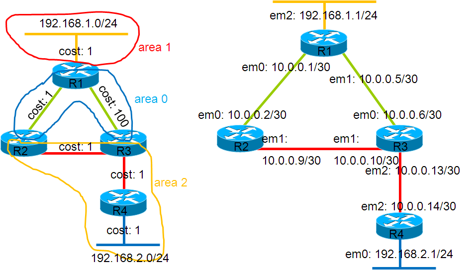

## Overview

This lab shows a non-optimal route selection caused by OSPF’s inter-area loop-prevention feature.

### Network diagram

Here is the OSPF logical view:



## Preparing the lab

This chapter describes how to start the lab.

### Downloading BSD Router Project images

[Download a BSDRP image](../../downloads.md).

### Download QEMU/KVM/VirtualBox lab scripts

More information on the BSDRP lab scripts is available in [How to build a BSDRP router lab](how-to-build-a-bsdrp-router-lab.md).

### Starting the lab

If you want to use VirtualBox, start this lab with:

```
virtualbox.sh -i BSDRP_1.93_full_amd64_vga.img -n 4 -c
```

The output should be like that:

```
~>/usr/src/tools/tools/nanobsd/BSDRP/virtualbox.sh -n 4 -c
BSD Router Project: VirtualBox lab script
Creating lab with 4 router(s):
- 0 LAN between all routers
- Full mesh ethernet point-to-point link between each routers
- One NIC connected to the shared LAN with the host

Router1 have the following NIC:
em0 connected to Router2.
em1 connected to Router3.
em2 connected to Router4.
em3 connected to shared-with-host LAN.
Router2 have the following NIC:
em0 connected to Router1.
em1 connected to Router3.
em2 connected to Router4.
em3 connected to shared-with-host LAN.
Router3 have the following NIC:
em0 connected to Router1.
em1 connected to Router2.
em2 connected to Router4.
em3 connected to shared-with-host LAN.
Router4 have the following NIC:
em0 connected to Router1.
em1 connected to Router2.
em2 connected to Router3.
em3 connected to shared-with-host LAN.
Connect to the router 1 by vnc client on port 5901
Connect to the router 2 by vnc client on port 5902
Connect to the router 3 by vnc client on port 5903
Connect to the router 4 by vnc client on port 5904
You need to configure an IP address in these range for communicating with the host:
        inet 192.168.56.1 netmask 0xffffff00 broadcast 192.168.56.255
        inet6 fe80::800:27ff:fe00:0%vboxnet0 prefixlen 64 scopeid 0x5
```

## Routers configuration

### Router 1

```
sysrc hostname=R1
sysrc frr_enable=yes
hostname R1
service frr start
vtysh
conf t
int em2
 ip address 192.168.1.1/24
 ip ospf cost 1
int em0
 ip address 10.0.0.1/30
 ip ospf cost 1
int em1
 ip address 10.0.0.5/30
 ip ospf cost 100
router ospf
 router-id 1.1.1.1
 network 192.168.1.0/24 area 1
 network 10.0.0.0/30 area 0
 network 10.0.0.4/30 area 0
 exit
wr
exit
config save
```

### Router 2

Configure hostname:

```
sysrc hostname=R2
sysrc frr_enable=YES
hostname R2
service frr start
vtysh
conf t
int em0
 ip address 10.0.0.2/30
 ip ospf cost 1
int em1
 ip address 10.0.0.9/30
 ip ospf cost 1
router ospf
 router-id 2.2.2.2
 network 10.0.0.0/30 area 0
 network 10.0.0.8/30 area 2
 exit
exit
wr
exit
config save
```

### Router 3

```
sysrc hostname=R3
hostname R3
sysrc frr_enable=YES
service frr start
vtysh
conf t
int em0
 ip address 10.0.0.6/30
 ip ospf cost 100
int em1
 ip address 10.0.0.10/30
 ip ospf cost 1
int em2
 ip address 10.0.0.13/30
 ip ospf cost 1
router ospf
 router-id 3.3.3.3
 network 10.0.0.4/30 area 0
 network 10.0.0.8/30 area 2
 network 10.0.0.12/30 area 2
 exit
exit
wr
exit
config save
```

### Router 4

```
sysrc hostname=R4
hostname R4
sysrc frr_enable=YES
service frr start
vtysh
conf t
int em2
 ip address 10.0.0.14/30
 ip ospf cost 1
int em0
 ip address 192.168.2.1/24
 ip ospf cost 1
router ospf
 router-id 4.4.4.4
 network 10.0.0.12/30 area 2
 network 192.168.2.0/24 area 2
 exit
exit
wr
exit
config save
```

## The problem

Which route does R4 take to reach network 192.168.1.0/24?

```
R4.bsdrp.net# sh ip route 192.168.1.0/24
Routing entry for 192.168.1.0/24
  Known via "ospf", distance 110, metric 4, best
  Last update 00:02:12 ago
  * 10.0.0.13, via em2
```

Notice the OSPF metric for this route: 4. This means the route should be R4 -\> R3 -\> R2 -\> R1.

Now check with a traceroute:

```
R4.bsdrp.net# traceroute ip 192.168.1.1
traceroute to 192.168.1.1 (192.168.1.1), 64 hops max, 52 byte packets
 1  10.0.0.13 (10.0.0.13)  0.668 ms  0.317 ms  0.209 ms
 2  192.168.1.1 (192.168.1.1)  1.169 ms  0.574 ms  0.742 ms
```

**Where is the R2 hop?**

Verify the 192.168.1.0/24 route on R3:

```
R3.bsdrp.net# sh ip route 192.168.1.0
Routing entry for 192.168.1.0/24
  Known via "ospf", distance 110, metric 101, best
  Last update 00:32:13 ago
  * 10.0.0.5, via em0
```

**R3 didn’t choose the “best” path** to reach 192.168.1.0/24: the installed route has a metric of 101. Check its OSPF database state:

```
R3.bsdrp.net# sh ip ospf database summary 192.168.1.0

       OSPF Router with ID (3.3.3.3)

                Summary Link States (Area 0.0.0.0)

  LS age: 1345
  Options: 0x2  : *|-|-|-|-|-|E|*
  LS Flags: 0x6
  LS Type: summary-LSA
  Link State ID: 192.168.1.0 (summary Network Number)
  Advertising Router: 1.1.1.1
  LS Seq Number: 80000004
  Checksum: 0x9456
  Length: 28
  Network Mask: /24
        TOS: 0  Metric: 1

                Summary Link States (Area 0.0.0.2)

  LS age: 2456
  Options: 0x2  : *|-|-|-|-|-|E|*
  LS Flags: 0x6
  LS Type: summary-LSA
  Link State ID: 192.168.1.0 (summary Network Number)
  Advertising Router: 2.2.2.2
  LS Seq Number: 80000001
  Checksum: 0x8662
  Length: 28
  Network Mask: /24
        TOS: 0  Metric: 2

  LS age: 1087
  Options: 0x2  : *|-|-|-|-|-|E|*
  LS Flags: 0x3
  LS Type: summary-LSA
  Link State ID: 192.168.1.0 (summary Network Number)
  Advertising Router: 3.3.3.3
  LS Seq Number: 80000002
  Checksum: 0x4838
  Length: 28
  Network Mask: /24
        TOS: 0  Metric: 101
```


!!! info "Important"
    The ABR (R3) expects summary LSAs from Area 0 only, so R3 ignores the summary LSA received from R2 (area 2).
