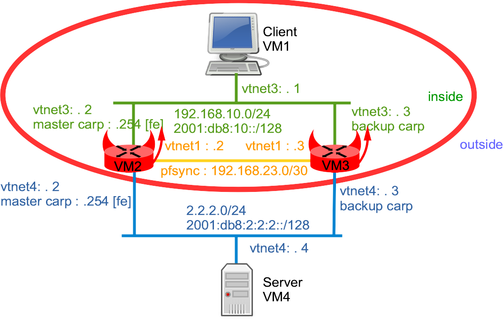

## Network diagram



## Starting the lab

More information on the BSDRP lab scripts is available in [How to build a BSDRP router lab](how-to-build-a-bsdrp-router-lab.md).

Example with the bhyve lab script (note that FreeBSD 10.1 virtio drivers had a bug with carp):

```
# ./BSDRP-lab-bhyve.sh -i /usr/obj/BSDRP.amd64/BSDRP-1.54-full-amd64-vga.img -n 4 -l 2
BSD Router Project (http://bsdrp.net) - bhyve full-meshed lab script
Setting-up a virtual lab with 4 VM(s):
- Working directory: /root/BSDRP-VMs
- Each VM has a total of 1 (1 cores and 1 threads) and 512M RAM
- Emulated NIC: virtio-net
- Switch mode: bridge + tap
- 2 LAN(s) between all VM
- Full mesh Ethernet links between each VM
VM 1 has the following NIC:
- vtnet0 connected to VM 2
- vtnet1 connected to VM 3
- vtnet2 connected to VM 4
- vtnet3 connected to LAN number 1
- vtnet4 connected to LAN number 2
VM 2 has the following NIC:
- vtnet0 connected to VM 1
- vtnet1 connected to VM 3
- vtnet2 connected to VM 4
- vtnet3 connected to LAN number 1
- vtnet4 connected to LAN number 2
VM 3 has the following NIC:
- vtnet0 connected to VM 1
- vtnet1 connected to VM 2
- vtnet2 connected to VM 4
- vtnet3 connected to LAN number 1
- vtnet4 connected to LAN number 2
VM 4 has the following NIC:
- vtnet0 connected to VM 1
- vtnet1 connected to VM 2
- vtnet2 connected to VM 3
- vtnet3 connected to LAN number 1
- vtnet4 connected to LAN number 2
To connect VM'serial console, you can use:
- VM 1 : cu -l /dev/nmdm-BSDRP.1B
- VM 2 : cu -l /dev/nmdm-BSDRP.2B
- VM 3 : cu -l /dev/nmdm-BSDRP.3B
- VM 4 : cu -l /dev/nmdm-BSDRP.4B
```

## Configuring routers

### Inside host (VM1)

```
sysrc hostname=VM1
sysrc ifconfig_vtnet3="inet 192.168.10.1/24"
sysrc ifconfig_vtnet3_ipv6="inet6 2001:db8:10::1 prefixlen 64"
sysrc defaultrouter="192.168.10.254"
sysrc ipv6_defaultrouter="2001:db8:10::fe"
sysrc gateway_enable=NO
sysrc ipv6_gateway_enable=NO
config save
hostname VM1
service netif restart
service routing restart
```

### Master firewall (VM2)

```
sysrc hostname=VM2
sysrc ifconfig_vtnet1="inet 192.168.23.2/24"
sysrc ifconfig_vtnet3="inet 192.168.10.2/30"
sysrc ifconfig_vtnet3_ipv6="inet6 2001:db8:10::2 prefixlen 64"
sysrc ifconfig_vtnet3_alias0="inet 192.168.10.254/32 vhid 1 advskew 100 pass testpass41"
sysrc ifconfig_vtnet3_alias1="inet6 2001:db8:10::fe prefixlen 128 vhid 2 advskew 100 pass testpass61"
sysrc ifconfig_vtnet4="inet 2.2.2.2/24"
sysrc ifconfig_vtnet4_ipv6="inet6 2001:db8:2:2:2::2 prefixlen 64"
sysrc ifconfig_vtnet4_alias0="inet 2.2.2.254/32 vhid 3 advskew 100 pass testpass42"
sysrc ifconfig_vtnet4_alias1="inet6 2001:db8:2:2:2::fe prefixlen 128 vhid 4 advskew 100 pass testpass62"
sysrc pf_enable=YES
sysrc pfsync_enable=YES
sysrc pflog_enable=YES
sysrc pfsync_syncdev=vtnet1
sysrc kld_list="carp"
echo "net.inet.carp.preempt=1" >> /etc/sysctl.conf

cat > /etc/pf.conf <<EOF
ExtIf="vtnet4"
IntIf="vtnet3"
SyncIf="vtnet1"
# Default block all
block
# Don't filter on loopback
set skip on lo0
# Don't sync carp and pfsync
pass quick on \$SyncIf proto pfsync keep state (no-sync)
pass quick on \$ExtIf  proto carp   keep state (no-sync)
pass quick on \$IntIf  proto carp   keep state (no-sync)
# Don't block icmpv6 (don't use this large rule in production!)
pass proto ipv6-icmp from any to any
# Allow traffic from inside to outside
pass log from \$IntIf:network to any
# Allow traffic from self to any
pass log from self to any
EOF

config save
hostname VM2
kldload carp
sysctl net.inet.carp.preempt=1
service netif restart
service pf start
service pfsync start
service pflog start
```

### Backup firewall (VM3)

```
sysrc hostname=VM3
sysrc ifconfig_vtnet1="inet 192.168.23.3/24"
sysrc ifconfig_vtnet3="inet 192.168.10.3/30"
sysrc ifconfig_vtnet3_ipv6="inet6 2001:db8:10::3 prefixlen 64"
sysrc ifconfig_vtnet3_alias0="inet 192.168.10.254/32 vhid 1 advskew 200 pass testpass41"
sysrc ifconfig_vtnet3_alias1="inet6 2001:db8:10::fe prefixlen 128 vhid 2 advskew 200 pass testpass61"
sysrc ifconfig_vtnet4="inet 2.2.2.3/24"
sysrc ifconfig_vtnet4_ipv6="inet6 2001:db8:2:2:2::3 prefixlen 64"
sysrc ifconfig_vtnet4_alias0="inet 2.2.2.254/32 vhid 3 advskew 200 pass testpass42"
sysrc ifconfig_vtnet4_alias1="inet6 2001:db8:2:2:2::fe prefixlen 128 vhid 4 advskew 200 pass testpass62"
sysrc pf_enable=YES
sysrc pfsync_enable=YES
sysrc pflog_enable=YES
sysrc pfsync_syncdev=vtnet1
sysrc kld_list="carp"
echo "net.inet.carp.preempt=1" >> /etc/sysctl.conf

cat > /etc/pf.conf <<EOF
ExtIf="vtnet4"
IntIf="vtnet3"
SyncIf="vtnet1"
# Default block all
block
# Don't filter on loopback
set skip on lo0
# Don't sync carp and pfsync
pass quick on \$SyncIf proto pfsync keep state (no-sync)
pass quick on \$ExtIf  proto carp   keep state (no-sync)
pass quick on \$IntIf  proto carp   keep state (no-sync)
# Don't block icmpv6 (don't use this large rule in production!)
pass proto ipv6-icmp from any to any
# Allow traffic from inside to outside
pass log from \$IntIf:network to any
# Allow traffic from self to any
pass log from self to any
EOF

config save
hostname VM3
kldload carp
sysctl net.inet.carp.preempt=1
service netif restart
service pf start
service pfsync start
service pflog start
```

### Outside host (VM4)

```
sysrc hostname=VM4
sysrc ifconfig_vtnet4="inet 2.2.2.4/24"
sysrc ifconfig_vtnet4_ipv6="inet6 2001:db8:2:2:2::4 prefixlen 64"
sysrc defaultrouter="2.2.2.254"
sysrc ipv6_defaultrouter="2001:db8:2:2:2::fe"
sysrc gateway_enable=NO
sysrc ipv6_gateway_enable=NO
sysrc inetd_enable=YES
sed -i -e 's/#echo/echo/g' /etc/inetd.conf
hostname VM4
service netif restart
service routing restart
service inetd start
config save
```

## Checking configuration

### CARP state

Check that VM2 is in CARP master state:

```
[root@VM2]~# ifconfig vtnet3
vtnet3: flags=8863<UP,BROADCAST,RUNNING,SIMPLEX,MULTICAST> metric 0 mtu 1500
        options=80028<VLAN_MTU,JUMBO_MTU,LINKSTATE>
        ether 58:9c:fc:02:00:02
        inet 192.168.10.2 netmask 0xfffffffc broadcast 192.168.10.3
        inet 192.168.10.254 netmask 0xffffffff broadcast 192.168.10.254 vhid 1
        inet6 fe80::5a9c:fcff:fe02:2%vtnet3 prefixlen 64 scopeid 0x4
        inet6 2001:db8:10::2 prefixlen 64
        inet6 2001:db8:10::fe prefixlen 128 vhid 2
        carp: MASTER vhid 1 advbase 1 advskew 100
        carp: MASTER vhid 2 advbase 1 advskew 100
        media: Ethernet autoselect (10Gbase-T <full-duplex>)
        status: active
        nd6 options=21<PERFORMNUD,AUTO_LINKLOCAL>
[root@VM2]~# ifconfig vtnet4
vtnet4: flags=8863<UP,BROADCAST,RUNNING,SIMPLEX,MULTICAST> metric 0 mtu 1500
        options=80028<VLAN_MTU,JUMBO_MTU,LINKSTATE>
        ether 58:9c:fc:02:00:02
        inet 2.2.2.2 netmask 0xffffff00 broadcast 2.2.2.255
        inet 2.2.2.254 netmask 0xffffffff broadcast 2.2.2.254 vhid 3
        inet6 fe80::5a9c:fcff:fe02:2%vtnet4 prefixlen 64 scopeid 0x5
        inet6 2001:db8:2:2:2::2 prefixlen 64
        inet6 2001:db8:2:2:2::fe prefixlen 128 vhid 4
        carp: MASTER vhid 3 advbase 1 advskew 100
        carp: MASTER vhid 4 advbase 1 advskew 100
        media: Ethernet autoselect (10Gbase-T <full-duplex>)
        status: active
        nd6 options=21<PERFORMNUD,AUTO_LINKLOCAL>
```

And VM3 is in backup state:

```
[root@VM3]~# ifconfig vtnet3
vtnet3: flags=8863<UP,BROADCAST,RUNNING,SIMPLEX,MULTICAST> metric 0 mtu 1500
        options=80028<VLAN_MTU,JUMBO_MTU,LINKSTATE>
        ether 58:9c:fc:03:00:03
        inet 192.168.10.3 netmask 0xfffffffc broadcast 192.168.10.3
        inet 192.168.10.254 netmask 0xffffffff broadcast 192.168.10.254 vhid 1
        inet6 fe80::5a9c:fcff:fe03:3%vtnet3 prefixlen 64 scopeid 0x4
        inet6 2001:db8:10::3 prefixlen 64
        inet6 2001:db8:10::fe prefixlen 128 vhid 2
        carp: BACKUP vhid 1 advbase 1 advskew 200
        carp: BACKUP vhid 2 advbase 1 advskew 200
        media: Ethernet autoselect (10Gbase-T <full-duplex>)
        status: active
        nd6 options=21<PERFORMNUD,AUTO_LINKLOCAL>
[root@VM3]~# ifconfig vtnet4
vtnet4: flags=8863<UP,BROADCAST,RUNNING,SIMPLEX,MULTICAST> metric 0 mtu 1500
        options=80028<VLAN_MTU,JUMBO_MTU,LINKSTATE>
        ether 58:9c:fc:03:00:03
        inet 2.2.2.3 netmask 0xffffff00 broadcast 2.2.2.255
        inet 2.2.2.254 netmask 0xffffffff broadcast 2.2.2.254 vhid 3
        inet6 fe80::5a9c:fcff:fe03:3%vtnet4 prefixlen 64 scopeid 0x5
        inet6 2001:db8:2:2:2::3 prefixlen 64
        inet6 2001:db8:2:2:2::fe prefixlen 128 vhid 4
        carp: BACKUP vhid 3 advbase 1 advskew 200
        carp: BACKUP vhid 4 advbase 1 advskew 200
        media: Ethernet autoselect (10Gbase-T <full-duplex>)
        status: active
        nd6 options=21<PERFORMNUD,AUTO_LINKLOCAL>
```

### pf state

Check the rules currently applied:

```
[root@VM2]~# pfctl -sr
block drop all
pass quick on vtnet4 proto carp all keep state (no-sync)
pass quick on vtnet3 proto carp all keep state (no-sync)
pass quick on vtnet1 proto pfsync all keep state (no-sync)
pass proto ipv6-icmp all keep state
pass log on vtnet3 inet6 from fe80::5a9c:fcff:fe02:2 to any flags S/SA keep state
pass log on vtnet4 inet6 from fe80::5a9c:fcff:fe02:2 to any flags S/SA keep state
pass log inet6 from 2001:db8:10::/64 to any flags S/SA keep state
pass log on vtnet1 inet6 from fe80::5a9c:fcff:fe02:302 to any flags S/SA keep state
pass log inet6 from 2001:db8:2:2:2::2 to any flags S/SA keep state
pass log inet6 from 2001:db8:2:2:2::fe to any flags S/SA keep state
pass log inet6 from ::1 to any flags S/SA keep state
pass log on lo0 inet6 from fe80::1 to any flags S/SA keep state
pass log inet from <__automatic_8a1ff95a_0> to any flags S/SA keep state
```

## Creating two flows from VM1 to VM4

Open a tmux session on R1 and generate two flows:

1.   A continuous ping: `ping 2.2.2.4`
2.   An echo session: `telnet 2.2.2.4 7`

### pf synchronisation

Check that there are four new states (one per direction) on the master firewall:

```
[root@VM2]~# pfctl -ss
all carp fe80::5a9c:fcff:fe02:2 -> ff02::12       SINGLE:NO_TRAFFIC
all carp 2.2.2.2 -> 224.0.0.18       SINGLE:NO_TRAFFIC
all carp 192.168.10.2 -> 224.0.0.18       SINGLE:NO_TRAFFIC
all pfsync 192.168.23.2 -> 224.0.0.240       SINGLE:NO_TRAFFIC
all icmp 2.2.2.4:13399 <- 192.168.10.1:13399       0:0
all icmp 192.168.10.1:13399 -> 2.2.2.4:13399       0:0
all tcp 2.2.2.4:7 <- 192.168.10.1:11636       ESTABLISHED:ESTABLISHED
all tcp 192.168.10.1:11636 -> 2.2.2.4:7       ESTABLISHED:ESTABLISHED
```

And these entries are synced to the backup firewall:

```
[root@VM3]~# pfctl -ss
all carp 224.0.0.18 <- 192.168.10.2       NO_TRAFFIC:SINGLE
all carp 224.0.0.18 <- 2.2.2.2       NO_TRAFFIC:SINGLE
all carp ff02::12 <- fe80::5a9c:fcff:fe02:2       NO_TRAFFIC:SINGLE
all pfsync 192.168.23.3 -> 224.0.0.240       SINGLE:NO_TRAFFIC
all pfsync 224.0.0.240 <- 192.168.23.2       NO_TRAFFIC:SINGLE
all icmp 2.2.2.4:13399 <- 192.168.10.1:13399       0:0
all icmp 192.168.10.1:13399 -> 2.2.2.4:13399       0:0
all tcp 2.2.2.4:7 <- 192.168.10.1:11636       ESTABLISHED:ESTABLISHED
all tcp 192.168.10.1:11636 -> 2.2.2.4:7       ESTABLISHED:ESTABLISHED
```

### pf log

Wait for the default 60-second flush timer of pflogd on the MASTER CARP firewall, then check the log file:

```
[root@VM2]~# tcpdump -r /var/log/pflog
reading from file /var/log/pflog, link-type PFLOG (OpenBSD pflog file)
17:22:44.851364 IP6 2001:db8:10::1 > 2001:db8:2:2:2::4: ICMP6, echo request, seq 0, length 16
17:22:44.851373 IP6 2001:db8:10::1 > 2001:db8:2:2:2::4: ICMP6, echo request, seq 0, length 16
17:22:44.851385 IP6 fe80::5a9c:fcff:fe02:2 > ff02::1:ff00:4: ICMP6, neighbor solicitation[|icmp6]
17:22:44.851577 IP6 fe80::5a9c:fcff:fe02:2 > ff02::1:ff00:1: ICMP6, neighbor solicitation[|icmp6]
```

### Testing failover

Halt the master firewall and check:

1.  On VM1: no lost pings, and the TCP echo session is preserved.
2.  On VM3: it has become the CARP master.
