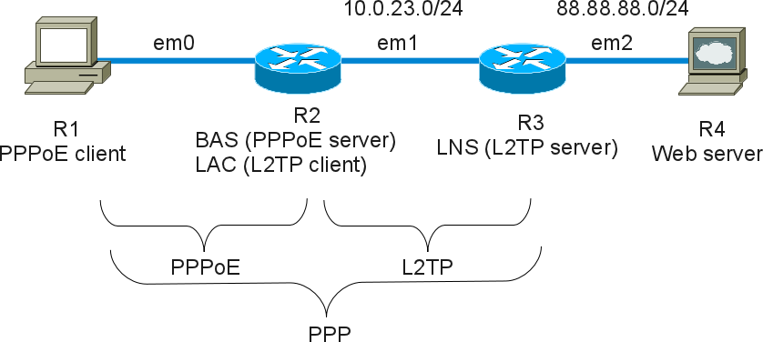

This lab shows an example with [MPD](http://mpd.sourceforge.net/).

## Presentation

### Network diagram

Here is the logical and physical view:



### Setting-up a virtual lab

#### Downloading BSD Router Project images

Download BSDRP serial image (prevent to have to use an X display) on Sourceforge.

#### Download Lab scripts

More information on these BSDRP lab scripts available on [How to build a BSDRP router lab](how-to-build-a-bsdrp-router-lab.md).

Start the lab with full-meshed 5 routers and one shared LAN, on this example using bhyve lab script on FreeBSD:

```
# tools/BSDRP-lab-bhyve.sh -i workdir/BSDRP.amd64/BSDRP-n257626-full-amd64-serial.img.xz -n 4
BSD Router Project (http://bsdrp.net) - bhyve full-meshed lab script
Setting-up a virtual lab with 4 VM(s):
- Working directory: /root/BSDRP-VMs
- Each VM has a total of 1 (1 cores and 1 threads) and 512M RAM
- Emulated NIC: virtio-net
- Switch mode: bridge + tap
- 0 LAN(s) between all VM
- Full mesh Ethernet links between each VM
VM 1 has the following NIC:
- vtnet0 connected to VM 2
- vtnet1 connected to VM 3
- vtnet2 connected to VM 4
VM 2 has the following NIC:
- vtnet0 connected to VM 1
- vtnet1 connected to VM 3
- vtnet2 connected to VM 4
VM 3 has the following NIC:
- vtnet0 connected to VM 1
- vtnet1 connected to VM 2
- vtnet2 connected to VM 4
VM 4 has the following NIC:
- vtnet0 connected to VM 1
- vtnet1 connected to VM 2
- vtnet2 connected to VM 3
To connect VM'serial console, you can use:
- VM 1 : cu -l /dev/nmdm-BSDRP.1B
- VM 2 : cu -l /dev/nmdm-BSDRP.2B
- VM 3 : cu -l /dev/nmdm-BSDRP.3B
- VM 4 : cu -l /dev/nmdm-BSDRP.4B
```

## Routers configuration

### Router 2 : BAS and LAC

Router 2 forwards PPP between PPPoE and L2TP.

```
sysrc hostname=R2
sysrc ifconfig_vtnet1="10.0.23.2/24"
sysrc mpd_enable=YES
sysrc mpd_flags="-b -s ppp"
cat > /usr/local/etc/mpd5/mpd.conf <<'EOF'
default:
        create link template L1 pppoe
        set pppoe iface vtnet0
        set link action forward L2
        set link enable incoming
        create link template L2 l2tp
        set l2tp peer 10.0.23.3
'EOF'
service netif restart
service routing restart
service mpd5 start
config save
```

### Router 3 : LNS (L2TP server)

```
sysrc hostname=R3
sysrc ifconfig_vtnet1="10.0.23.3/24"
sysrc ifconfig_vtnet2="88.88.88.4/24"
sysrc mpd_enable=YES
sysrc mpd_flags="-b -s ppp"
cat > /usr/local/etc/mpd5/mpd.conf <<'EOF'
default:
        set ippool add pool1 88.88.0.1 88.88.0.99
        create bundle template B
        set ipcp ranges 88.88.0.254/32 ippool pool1
        set ipcp dns 8.8.8.8
        set bundle enable ipv6cp
        create link template L l2tp
        set l2tp enable length
        set link action bundle B
        set link enable chap
        set auth authname Olivier
        set l2tp self 10.0.23.3
        set link enable incoming
'EOF'
cat > /usr/local/etc/mpd5/mpd.secret <<'EOF'
olivier         secret
'EOF'
service netif restart
service routing restart
service mpd5 start
config save
```

### Router 1 : PPPoE client

```
sysrc hostname=R1
sysrc gateway_enable=NO
sysrc ipv6_gateway_enable=NO
sysrc mpd_enable=YES
sysrc mpd_flags="-b -s ppp"
cat > /usr/local/etc/mpd5/mpd.conf <<'EOF'
default:
        create bundle static B1
        set bundle enable ipv6cp
        set ipcp enable req-pri-dns  
        set ipcp enable req-sec-dns  
        set iface route default
        create link static L1 pppoe
        set link action bundle B1
        set auth authname olivier
        set auth password secret
        set pppoe iface vtnet0
        open
'EOF'
service netif restart
service routing restart
service mpd5 start
config save
```

### Router 4 : Remote host

Router 4 is configured as simple host, and be used an Internet server too for testing connectivity with the PC.

```
sysrc hostname=R4
sysrc defaultrouter="88.88.88.4"
sysrc ifconfig_vtnet2="88.88.88.5/24"
sysrc gateway_enable=NO
sysrc ipv6_gateway_enable=NO
service netif restart
service routing restart
config save
```

## Final testing

From R1, ping the server R4 (88.88.88.4):

```
[root@R1]~#ping 88.88.88.4
PING 88.88.88.4 (88.88.88.4): 56 data bytes
64 bytes from 88.88.88.4: icmp_seq=0 ttl=64 time=0.815 ms
64 bytes from 88.88.88.4: icmp_seq=1 ttl=64 time=1.497 ms
64 bytes from 88.88.88.4: icmp_seq=2 ttl=64 time=0.822 ms
```

From R1, ping the link-local remote IPv6 address on the PPP link (R3):

```
[root@R1]~#ping6 -I ng0 fe80::a8aa:00ff:fe00:0323
PING6(56=40+8+8 bytes) fe80::2bb:bbff:fe00:1%ng0 --> fe80::a8aa:ff:fe00:323
16 bytes from fe80::a8aa:ff:fe00:323%ng0, icmp_seq=0 hlim=64 time=0.890 ms
16 bytes from fe80::a8aa:ff:fe00:323%ng0, icmp_seq=1 hlim=64 time=1.376 ms
16 bytes from fe80::a8aa:ff:fe00:323%ng0, icmp_seq=2 hlim=64 time=1.290 ms
16 bytes from fe80::a8aa:ff:fe00:323%ng0, icmp_seq=3 hlim=64 time=0.901 ms
```

## Full Logs

### PPPoE client (R1)

```
[root@R1]~# cat /var/log/ppp.log
Apr  1 11:47:11 R1 newsyslog[13844]: logfile first created
Apr  1 11:47:13 R1 ppp[52259]: [L1] LCP: SendConfigReq #2
Apr  1 11:47:13 R1 ppp[52259]: [L1]   PROTOCOMP
Apr  1 11:47:13 R1 ppp[52259]: [L1]   MRU 1492
Apr  1 11:47:13 R1 ppp[52259]: [L1]   MAGICNUM 0x02bbf517
Apr  1 11:47:13 R1 ppp[52259]: [L1] LCP: rec'd Configure Ack #2 (Ack-Sent)
Apr  1 11:47:13 R1 ppp[52259]: [L1]   PROTOCOMP
Apr  1 11:47:13 R1 ppp[52259]: [L1]   MRU 1492
Apr  1 11:47:13 R1 ppp[52259]: [L1]   MAGICNUM 0x02bbf517
Apr  1 11:47:13 R1 ppp[52259]: [L1] LCP: state change Ack-Sent --> Opened
Apr  1 11:47:13 R1 ppp[52259]: [L1] LCP: auth: peer wants CHAP, I want nothing
Apr  1 11:47:13 R1 ppp[52259]: [L1] LCP: LayerUp
Apr  1 11:47:13 R1 ppp[52259]: [L1] CHAP: rec'd CHALLENGE #1 len: 28
Apr  1 11:47:13 R1 ppp[52259]: [L1]   Name: "Olivier"
Apr  1 11:47:13 R1 ppp[52259]: [L1] CHAP: Using authname "olivier"
Apr  1 11:47:13 R1 ppp[52259]: [L1] CHAP: sending RESPONSE #1 len: 61
Apr  1 11:47:13 R1 ppp[52259]: [L1] CHAP: rec'd SUCCESS #1 len: 46
Apr  1 11:47:13 R1 ppp[52259]: [L1]   MESG: S=CA8CD828AB29C8A4F16908FE2067C0280CD5D468
Apr  1 11:47:13 R1 ppp[52259]: [L1] LCP: authorization successful
Apr  1 11:47:13 R1 ppp[52259]: [L1] Link: Matched action 'bundle "B1" ""'
Apr  1 11:47:13 R1 ppp[52259]: [L1] Link: Join bundle "B1"
Apr  1 11:47:13 R1 ppp[52259]: [B1] Bundle: Status update: up 1 link, total bandwidth 64000 bps
Apr  1 11:47:13 R1 ppp[52259]: [B1] IPCP: Open event
Apr  1 11:47:13 R1 ppp[52259]: [B1] IPCP: state change Initial --> Starting
Apr  1 11:47:13 R1 ppp[52259]: [B1] IPCP: LayerStart
Apr  1 11:47:13 R1 ppp[52259]: [B1] IPV6CP: Open event
Apr  1 11:47:13 R1 ppp[52259]: [B1] IPV6CP: state change Initial --> Starting
Apr  1 11:47:13 R1 ppp[52259]: [B1] IPV6CP: LayerStart
Apr  1 11:47:13 R1 ppp[52259]: [B1] IPCP: Up event
Apr  1 11:47:13 R1 ppp[52259]: [B1] IPCP: state change Starting --> Req-Sent
Apr  1 11:47:13 R1 ppp[52259]: [B1] IPCP: SendConfigReq #1
Apr  1 11:47:13 R1 ppp[52259]: [B1]   IPADDR 0.0.0.0
Apr  1 11:47:13 R1 ppp[52259]: [B1]   COMPPROTO VJCOMP, 16 comp. channels, no comp-cid
Apr  1 11:47:13 R1 ppp[52259]: [B1]   PRIDNS 0.0.0.0
Apr  1 11:47:13 R1 ppp[52259]: [B1]   SECDNS 0.0.0.0
Apr  1 11:47:13 R1 ppp[52259]: [B1] IPV6CP: Up event
Apr  1 11:47:13 R1 ppp[52259]: [B1] IPV6CP: state change Starting --> Req-Sent
Apr  1 11:47:13 R1 ppp[52259]: [B1] IPV6CP: SendConfigReq #1
Apr  1 11:47:13 R1 ppp[52259]: [B1] IPCP: rec'd Configure Request #1 (Req-Sent)
Apr  1 11:47:13 R1 ppp[52259]: [B1]   IPADDR 88.88.0.254
Apr  1 11:47:13 R1 ppp[52259]: [B1]     88.88.0.254 is OK
Apr  1 11:47:13 R1 ppp[52259]: [B1]   COMPPROTO VJCOMP, 16 comp. channels, no comp-cid
Apr  1 11:47:13 R1 ppp[52259]: [B1] IPCP: SendConfigAck #1
Apr  1 11:47:13 R1 ppp[52259]: [B1]   IPADDR 88.88.0.254
Apr  1 11:47:13 R1 ppp[52259]: [B1]   COMPPROTO VJCOMP, 16 comp. channels, no comp-cid
Apr  1 11:47:13 R1 ppp[52259]: [B1] IPCP: state change Req-Sent --> Ack-Sent
Apr  1 11:47:13 R1 ppp[52259]: [B1] IPV6CP: rec'd Configure Request #1 (Req-Sent)
Apr  1 11:47:13 R1 ppp[52259]: [B1] IPV6CP: SendConfigAck #1
Apr  1 11:47:13 R1 ppp[52259]: [B1] IPV6CP: state change Req-Sent --> Ack-Sent
Apr  1 11:47:13 R1 ppp[52259]: [B1] IPCP: rec'd Configure Reject #1 (Ack-Sent)
Apr  1 11:47:13 R1 ppp[52259]: [B1]   SECDNS 0.0.0.0
Apr  1 11:47:13 R1 ppp[52259]: [B1] IPCP: SendConfigReq #2
Apr  1 11:47:13 R1 ppp[52259]: [B1]   IPADDR 0.0.0.0
Apr  1 11:47:13 R1 ppp[52259]: [B1]   COMPPROTO VJCOMP, 16 comp. channels, no comp-cid
Apr  1 11:47:13 R1 ppp[52259]: [B1]   PRIDNS 0.0.0.0
Apr  1 11:47:13 R1 ppp[52259]: [B1] IPV6CP: rec'd Configure Ack #1 (Ack-Sent)
Apr  1 11:47:13 R1 ppp[52259]: [B1] IPV6CP: state change Ack-Sent --> Opened
Apr  1 11:47:13 R1 ppp[52259]: [B1] IPV6CP: LayerUp
Apr  1 11:47:13 R1 ppp[52259]: [B1]   38e6:ca33:e647:ac51 -> 5a9c:fcff:fe02:0303
Apr  1 11:47:13 R1 ppp[52259]: [B1] IFACE: Up event
Apr  1 11:47:13 R1 ppp[52259]: [B1] IPCP: rec'd Configure Nak #2 (Ack-Sent)
Apr  1 11:47:13 R1 ppp[52259]: [B1]   IPADDR 88.88.0.1
Apr  1 11:47:13 R1 ppp[52259]: [B1]     88.88.0.1 is OK
Apr  1 11:47:13 R1 ppp[52259]: [B1]   PRIDNS 8.8.8.8
Apr  1 11:47:13 R1 ppp[52259]: [B1] IPCP: SendConfigReq #3
Apr  1 11:47:13 R1 ppp[52259]: [B1]   IPADDR 88.88.0.1
Apr  1 11:47:13 R1 ppp[52259]: [B1]   COMPPROTO VJCOMP, 16 comp. channels, no comp-cid
Apr  1 11:47:13 R1 ppp[52259]: [B1]   PRIDNS 8.8.8.8
Apr  1 11:47:13 R1 ppp[52259]: [B1] IPCP: rec'd Configure Ack #3 (Ack-Sent)
Apr  1 11:47:13 R1 ppp[52259]: [B1]   IPADDR 88.88.0.1
Apr  1 11:47:13 R1 ppp[52259]: [B1]   COMPPROTO VJCOMP, 16 comp. channels, no comp-cid
Apr  1 11:47:13 R1 ppp[52259]: [B1]   PRIDNS 8.8.8.8
Apr  1 11:47:13 R1 ppp[52259]: [B1] IPCP: state change Ack-Sent --> Opened
Apr  1 11:47:13 R1 ppp[52259]: [B1] IPCP: LayerUp
Apr  1 11:47:13 R1 ppp[52259]: [B1]   88.88.0.1 -> 88.88.0.254
```

### LAC (R2)

```
cat /var/log/ppp.log                                                                                                                          
Apr  1 11:47:11 R2 ppp[54126]: Incoming PPPoE connection request via vtnet0: for service "*" from 58:9c:fc:01:02:01
Apr  1 11:47:11 R2 ppp[54126]: [L1-2] Accepting PPPoE connection
Apr  1 11:47:11 R2 ppp[54126]: [L1-2] Link: Matched action 'forward "L2"'
Apr  1 11:47:11 R2 ppp[54126]: [R-L1-2] Rep: INCOMING event from L1-2 (0)
Apr  1 11:47:11 R2 ppp[54126]: L2TP: Initiating control connection 0x801e2d610 0.0.0.0 0 <-> 10.0.23.3 1701
Apr  1 11:47:11 R2 ppp[54126]: [L1-2] PPPoE: connection successful
Apr  1 11:47:11 R2 ppp[54126]: L2TP: Control connection 0x801e2d610 10.0.23.2 31124 <-> 10.0.23.3 1701 connected
Apr  1 11:47:11 R2 ppp[54126]: [L2-3] L2TP: Incoming call #1650000 via control connection 0x801e2d610 initiated
Apr  1 11:47:11 R2 ppp[54126]: [L2-3] L2TP: Call #1650000 connected
Apr  1 11:47:11 R2 ppp[54126]: [R-L1-2] Rep: UP event from L2-3 (1)
Apr  1 11:47:11 R2 ppp[54126]: [R-L1-2] Rep: UP event from L1-2 (0)
```

### LNS (R3)

```
[root@R3]~# cat /var/log/ppp.log
Apr  1 11:46:58 R3 newsyslog[12978]: logfile first created
Apr  1 11:47:11 R3 ppp[58548]: Incoming L2TP packet from 10.0.23.2 31124
Apr  1 11:47:11 R3 ppp[58548]: L2TP: Control connection 0x801e86310 10.0.23.3 1701 <-> 10.0.23.2 31124 connected
Apr  1 11:47:11 R3 ppp[58548]: L2TP: Incoming call #1650000 via connection 0x801e86310 received
Apr  1 11:47:11 R3 ppp[58548]: [L-1] L2TP: Incoming call #1650000 via control connection 0x801e86310 accepted
Apr  1 11:47:11 R3 ppp[58548]: [L-1] Link: OPEN event
Apr  1 11:47:11 R3 ppp[58548]: [L-1] LCP: Open event
Apr  1 11:47:11 R3 ppp[58548]: [L-1] LCP: state change Initial --> Starting
Apr  1 11:47:11 R3 ppp[58548]: [L-1] LCP: LayerStart
Apr  1 11:47:11 R3 ppp[58548]: [L-1] L2TP: Call #1650000 connected
Apr  1 11:47:11 R3 ppp[58548]: [L-1] Link: UP event
Apr  1 11:47:11 R3 ppp[58548]: [L-1] LCP: Up event
Apr  1 11:47:11 R3 ppp[58548]: [L-1] LCP: state change Starting --> Req-Sent
Apr  1 11:47:11 R3 ppp[58548]: [L-1] LCP: SendConfigReq #1
Apr  1 11:47:11 R3 ppp[58548]: [L-1]   ACFCOMP
Apr  1 11:47:11 R3 ppp[58548]: [L-1]   PROTOCOMP
Apr  1 11:47:11 R3 ppp[58548]: [L-1]   MRU 1500
Apr  1 11:47:11 R3 ppp[58548]: [L-1]   MAGICNUM 0x0753b73c
Apr  1 11:47:11 R3 ppp[58548]: [L-1]   AUTHPROTO CHAP MSOFTv2
Apr  1 11:47:11 R3 ppp[58548]: [L-1] LCP: rec'd Configure Reject #1 (Req-Sent)
Apr  1 11:47:11 R3 ppp[58548]: [L-1]   ACFCOMP
Apr  1 11:47:11 R3 ppp[58548]: [L-1] LCP: SendConfigReq #2
Apr  1 11:47:11 R3 ppp[58548]: [L-1]   PROTOCOMP
Apr  1 11:47:11 R3 ppp[58548]: [L-1]   MRU 1500
Apr  1 11:47:11 R3 ppp[58548]: [L-1]   MAGICNUM 0x0753b73c
Apr  1 11:47:11 R3 ppp[58548]: [L-1]   AUTHPROTO CHAP MSOFTv2
Apr  1 11:47:11 R3 ppp[58548]: [L-1] LCP: rec'd Configure Ack #2 (Req-Sent)
Apr  1 11:47:11 R3 ppp[58548]: [L-1]   PROTOCOMP
Apr  1 11:47:11 R3 ppp[58548]: [L-1]   MRU 1500
Apr  1 11:47:11 R3 ppp[58548]: [L-1]   MAGICNUM 0x0753b73c
Apr  1 11:47:11 R3 ppp[58548]: [L-1]   AUTHPROTO CHAP MSOFTv2
Apr  1 11:47:11 R3 ppp[58548]: [L-1] LCP: state change Req-Sent --> Ack-Rcvd
Apr  1 11:47:13 R3 ppp[58548]: [L-1] LCP: rec'd Configure Request #2 (Ack-Rcvd)
Apr  1 11:47:13 R3 ppp[58548]: [L-1]   PROTOCOMP
Apr  1 11:47:13 R3 ppp[58548]: [L-1]   MRU 1492
Apr  1 11:47:13 R3 ppp[58548]: [L-1]   MAGICNUM 0x02bbf517
Apr  1 11:47:13 R3 ppp[58548]: [L-1] LCP: SendConfigAck #2
Apr  1 11:47:13 R3 ppp[58548]: [L-1]   PROTOCOMP
Apr  1 11:47:13 R3 ppp[58548]: [L-1]   MRU 1492
Apr  1 11:47:13 R3 ppp[58548]: [L-1]   MAGICNUM 0x02bbf517
Apr  1 11:47:13 R3 ppp[58548]: [L-1] LCP: state change Ack-Rcvd --> Opened
Apr  1 11:47:13 R3 ppp[58548]: [L-1] LCP: auth: peer wants nothing, I want CHAP
Apr  1 11:47:13 R3 ppp[58548]: [L-1] CHAP: sending CHALLENGE #1 len: 28
Apr  1 11:47:13 R3 ppp[58548]: [L-1] LCP: LayerUp
Apr  1 11:47:13 R3 ppp[58548]: [L-1] CHAP: rec'd RESPONSE #1 len: 61
Apr  1 11:47:13 R3 ppp[58548]: [L-1]   Name: "olivier"
Apr  1 11:47:13 R3 ppp[58548]: [L-1] AUTH: Trying INTERNAL
Apr  1 11:47:13 R3 ppp[58548]: [L-1] AUTH: INTERNAL returned: undefined
Apr  1 11:47:13 R3 ppp[58548]: [L-1] CHAP: Auth return status: undefined
Apr  1 11:47:13 R3 ppp[58548]: [L-1] CHAP: Response is valid
Apr  1 11:47:13 R3 ppp[58548]: [L-1] CHAP: Reply message: S=CA8CD828AB29C8A4F16908FE2067C0280CD5D468
Apr  1 11:47:13 R3 ppp[58548]: [L-1] CHAP: sending SUCCESS #1 len: 46
Apr  1 11:47:13 R3 ppp[58548]: [L-1] LCP: authorization successful
Apr  1 11:47:13 R3 ppp[58548]: [L-1] Link: Matched action 'bundle "B" ""'
Apr  1 11:47:13 R3 ppp[58548]: [L-1] Creating new bundle using template "B".
Apr  1 11:47:13 R3 ppp[58548]: [B-1] Bundle: Interface ng0 created
Apr  1 11:47:13 R3 ppp[58548]: [L-1] Link: Join bundle "B-1"
Apr  1 11:47:13 R3 ppp[58548]: [B-1] Bundle: Status update: up 1 link, total bandwidth 64000 bps
Apr  1 11:47:13 R3 ppp[58548]: [B-1] IPCP: Open event
Apr  1 11:47:13 R3 ppp[58548]: [B-1] IPCP: state change Initial --> Starting
Apr  1 11:47:13 R3 ppp[58548]: [B-1] IPCP: LayerStart
Apr  1 11:47:13 R3 ppp[58548]: [B-1] IPV6CP: Open event
Apr  1 11:47:13 R3 ppp[58548]: [B-1] IPV6CP: state change Initial --> Starting
Apr  1 11:47:13 R3 ppp[58548]: [B-1] IPV6CP: LayerStart
Apr  1 11:47:13 R3 ppp[58548]: [B-1] IPCP: Up event
Apr  1 11:47:13 R3 ppp[58548]: [B-1] IPCP: Got IP 88.88.0.1 from pool "pool1" for peer
Apr  1 11:47:13 R3 ppp[58548]: [B-1] IPCP: state change Starting --> Req-Sent
Apr  1 11:47:13 R3 ppp[58548]: [B-1] IPCP: SendConfigReq #1
Apr  1 11:47:13 R3 ppp[58548]: [B-1]   IPADDR 88.88.0.254
Apr  1 11:47:13 R3 ppp[58548]: [B-1]   COMPPROTO VJCOMP, 16 comp. channels, no comp-cid
Apr  1 11:47:13 R3 ppp[58548]: [B-1] IPV6CP: Up event
Apr  1 11:47:13 R3 ppp[58548]: [B-1] IPV6CP: state change Starting --> Req-Sent
Apr  1 11:47:13 R3 ppp[58548]: [B-1] IPV6CP: SendConfigReq #1
Apr  1 11:47:13 R3 ppp[58548]: [B-1] IPCP: rec'd Configure Request #1 (Req-Sent)
Apr  1 11:47:13 R3 ppp[58548]: [B-1]   IPADDR 0.0.0.0
Apr  1 11:47:13 R3 ppp[58548]: [B-1]     NAKing with 88.88.0.1
Apr  1 11:47:13 R3 ppp[58548]: [B-1]   COMPPROTO VJCOMP, 16 comp. channels, no comp-cid
Apr  1 11:47:13 R3 ppp[58548]: [B-1]   PRIDNS 0.0.0.0
Apr  1 11:47:13 R3 ppp[58548]: [B-1]     NAKing with 8.8.8.8
Apr  1 11:47:13 R3 ppp[58548]: [B-1]   SECDNS 0.0.0.0
Apr  1 11:47:13 R3 ppp[58548]: [B-1] IPCP: SendConfigRej #1
Apr  1 11:47:13 R3 ppp[58548]: [B-1]   SECDNS 0.0.0.0
Apr  1 11:47:13 R3 ppp[58548]: [B-1] IPV6CP: rec'd Configure Request #1 (Req-Sent)
Apr  1 11:47:13 R3 ppp[58548]: [B-1] IPV6CP: SendConfigAck #1
Apr  1 11:47:13 R3 ppp[58548]: [B-1] IPV6CP: state change Req-Sent --> Ack-Sent
Apr  1 11:47:13 R3 ppp[58548]: [B-1] IPCP: rec'd Configure Ack #1 (Req-Sent)
Apr  1 11:47:13 R3 ppp[58548]: [B-1]   IPADDR 88.88.0.254
Apr  1 11:47:13 R3 ppp[58548]: [B-1]   COMPPROTO VJCOMP, 16 comp. channels, no comp-cid
Apr  1 11:47:13 R3 ppp[58548]: [B-1] IPCP: state change Req-Sent --> Ack-Rcvd
Apr  1 11:47:13 R3 ppp[58548]: [B-1] IPV6CP: rec'd Configure Ack #1 (Ack-Sent)
Apr  1 11:47:13 R3 ppp[58548]: [B-1] IPV6CP: state change Ack-Sent --> Opened
Apr  1 11:47:13 R3 ppp[58548]: [B-1] IPV6CP: LayerUp
Apr  1 11:47:13 R3 ppp[58548]: [B-1]   5a9c:fcff:fe02:0303 -> 38e6:ca33:e647:ac51
Apr  1 11:47:13 R3 ppp[58548]: [B-1] IFACE: Up event
Apr  1 11:47:13 R3 ppp[58548]: [B-1] IPCP: rec'd Configure Request #2 (Ack-Rcvd)
Apr  1 11:47:13 R3 ppp[58548]: [B-1]   IPADDR 0.0.0.0
Apr  1 11:47:13 R3 ppp[58548]: [B-1]     NAKing with 88.88.0.1
Apr  1 11:47:13 R3 ppp[58548]: [B-1]   COMPPROTO VJCOMP, 16 comp. channels, no comp-cid
Apr  1 11:47:13 R3 ppp[58548]: [B-1]   PRIDNS 0.0.0.0
Apr  1 11:47:13 R3 ppp[58548]: [B-1]     NAKing with 8.8.8.8
Apr  1 11:47:13 R3 ppp[58548]: [B-1] IPCP: SendConfigNak #2
Apr  1 11:47:13 R3 ppp[58548]: [B-1]   IPADDR 88.88.0.1
Apr  1 11:47:13 R3 ppp[58548]: [B-1]   PRIDNS 8.8.8.8
Apr  1 11:47:13 R3 ppp[58548]: [B-1] IPCP: rec'd Configure Request #3 (Ack-Rcvd)
Apr  1 11:47:13 R3 ppp[58548]: [B-1]   IPADDR 88.88.0.1
Apr  1 11:47:13 R3 ppp[58548]: [B-1]     88.88.0.1 is OK
Apr  1 11:47:13 R3 ppp[58548]: [B-1]   COMPPROTO VJCOMP, 16 comp. channels, no comp-cid
Apr  1 11:47:13 R3 ppp[58548]: [B-1]   PRIDNS 8.8.8.8
Apr  1 11:47:13 R3 ppp[58548]: [B-1] IPCP: SendConfigAck #3
Apr  1 11:47:13 R3 ppp[58548]: [B-1]   IPADDR 88.88.0.1
Apr  1 11:47:13 R3 ppp[58548]: [B-1]   COMPPROTO VJCOMP, 16 comp. channels, no comp-cid
Apr  1 11:47:13 R3 ppp[58548]: [B-1]   PRIDNS 8.8.8.8
Apr  1 11:47:13 R3 ppp[58548]: [B-1] IPCP: state change Ack-Rcvd --> Opened
Apr  1 11:47:13 R3 ppp[58548]: [B-1] IPCP: LayerUp
Apr  1 11:47:13 R3 ppp[58548]: [B-1]   88.88.0.254 -> 88.88.0.1
```
