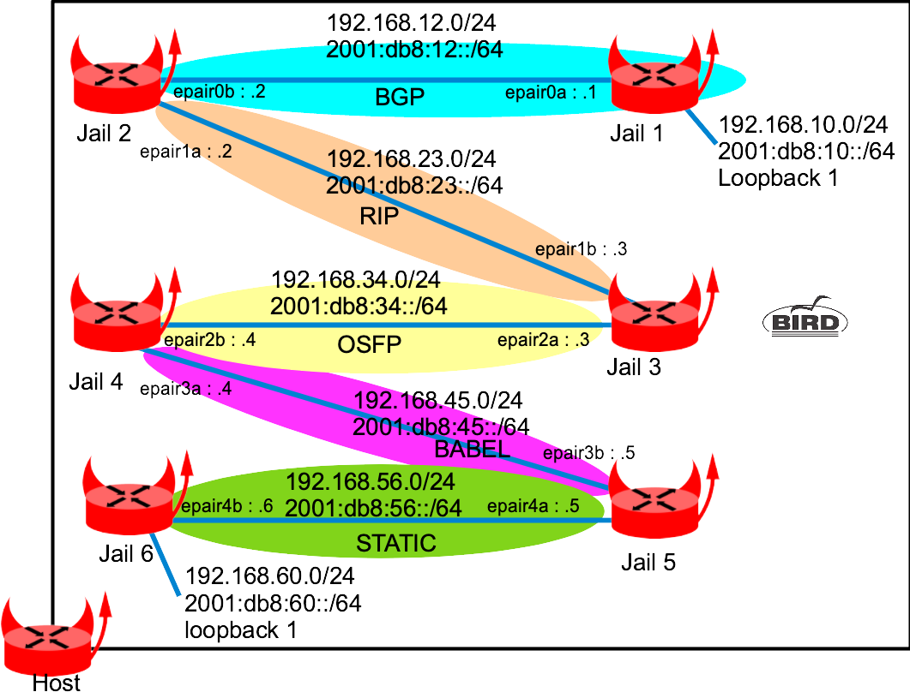

This Labs is done from one BSDRP VM and it explains how to use BSDRP using bird 2.

## Presentation

### Network diagram

Here is the logical and physical view:



## Router configuration

All the configurations details here could be generated by the BSDRP lab script embedded that will creates 5 jails and configure them:

```
labconfig bird_jails
```

### Host

Unhide bpf interface to jails to be able to use tcpdump inside them.

```
sysrc hostname=host \
  cloned_interfaces="epair0 epair1 epair2 epair3 epair4" \
  kld_list="ipsec"
cat > /etc/devfs.rules <<'EOF'
[devfsrules_jailbpf=4]
add include \$devfsrules_hide_all
add include \$devfsrules_unhide_basic
add include \$devfsrules_unhide_login
add path 'bpf*' unhide
'EOF'
service devfs restart
service netif restart
service hostname restart
service kld start
tenant -c -j jail1 -i epair0a
tenant -c -j jail2 -i epair0b,epair1a
tenant -c -j jail3 -i epair1b,epair2a
tenant -c -j jail4 -i epair2b,epair3a
tenant -c -j jail5 -i epair3b,epair4a
tenant -c -j jail6 -i epair4b
```

### Jail 1

```
cat > /etc/jails/jail1/rc.conf <<EOF
hostname="jail1"
gateway_enable=YES
ipv6_gateway_enable=YES
sysrc cloned_interfaces=lo1
ifconfig_lo1="inet 192.168.10.1/24"
ifconfig_lo1_ipv6="inet6 2001:db8:10::1/64"
ifconfig_epair0a="inet 192.168.12.1/24"
ifconfig_epair0a_ipv6="inet6 2001:db8:12::1/64"
bird_enable=yes
EOF

cat > /etc/jails/jail1/local/bird.conf <<EOF
# Configure logging
log syslog all;
log "/var/log/bird.log" all;
log stderr all;

# Override router ID
router id 192.168.10.1;

# Sync bird routing table with kernel
protocol kernel kernel4 {
    ipv4 {
        export all;
    };
}
protocol kernel kernel6 {
    ipv6 {
        export all;
    };
}

protocol device {
        scan time 10;
}

# Include directly connected networks
protocol direct {
        ipv4;
        ipv6;
}
protocol bgp bgp4 {
        local as 12;
        # Bird creates IPSEC SAD entry automatically but it need to know the source IP address
        # Otherwise it will use the wrong 0.0.0.0 IP as source
        source address 192.168.12.1;
        neighbor 192.168.12.2 as 12;
        password "abigpassword";
        ipv4 {
            import all;
            export all;
        };
}

protocol bgp bgp6 {
        local as 12;
        # Bird creates IPSEC SAD entry automatically but it need to know the source IP address
        # Otherwise it will use the wrong :: IP as source
        source address 2001:db8:12::1;
        neighbor 2001:db8:12::2 as 12;
        password "abigpassword";
        ipv6 {
            import all;
            export all;
        };
}

protocol bfd {}
EOF
```

### Jail 2

```
cat > /etc/jails/jail2/rc.conf <<EOF
hostname="jail2"
gateway_enable=YES
ipv6_gateway_enable=YES
ifconfig_epair0b="inet 192.168.12.2/24"
ifconfig_epair0b_ipv6="inet6 2001:db8:12::2/64"
ifconfig_epair1a="inet 192.168.23.2/24"
ifconfig_epair1a_ipv6="inet6 2001:db8:23::2/64"
bird_enable=yes
EOF

cat > /etc/jails/jail2/local/bird.conf <<EOF
# Configure logging
log syslog all;
log "/var/log/bird.log" all;
log stderr all;

# Override router ID
router id 192.168.10.2;

# Sync bird routing table with kernel
protocol kernel kernel4 {
    ipv4 {
        export all;
    };
}
protocol kernel kernel6 {
    ipv6 {
        export all;
    };
}

protocol device {
        scan time 10;
}

# Include directly connected networks
protocol direct {
        ipv4;
        ipv6;
}
protocol bgp bgp4 {
        local as 12;
        # Bird creates IPSEC SAD entry automatically but it need to know the source IP address
        # Otherwise it will use the wrong 0.0.0.0 IP as source
        source address 192.168.12.2;
        neighbor 192.168.12.1 as 12;
        password "abigpassword";
        ipv4 {
            import all;
            export all;
            next hop self;
        };
}

protocol bgp bgp6 {
        local as 12;
        # Bird creates IPSEC SAD entry automatically but it need to know the source IP address
        # Otherwise it will use the wrong :: IP as source
        source address 2001:db8:12::2;
        neighbor 2001:db8:12::1 as 12;
        password "abigpassword";
        ipv6 {
            import all;
            export all;
            next hop self;
        };
}

protocol bfd {}

protocol rip rip4 {
  ipv4 { import all; export all;};
  interface "epair1a" {};
}

protocol rip ng rip6 {
  ipv6 { import all; export all;};
  interface "epair1a" {};
}
EOF
```

### Jail 3

```
cat > /etc/jails/jail3/rc.conf <<EOF
hostname="jail3"
gateway_enable=YES
ipv6_gateway_enable=YES
ifconfig_epair1b="inet 192.168.23.3/24"
ifconfig_epair1b_ipv6="inet6 2001:db8:23::3/64"
ifconfig_epair2a="inet 192.168.34.3/24"
ifconfig_epair2a_ipv6="inet6 2001:db8:34::3/64"
bird_enable=yes
EOF

cat > /etc/jails/jail3/local/bird.conf <<EOF
# Configure logging
log syslog all;
log "/var/log/bird.log" all;
log stderr all;

# Override router ID
router id 192.168.10.3;

# Sync bird routing table with kernel
protocol kernel kernel4 {
    ipv4 {
        export all;
    };
}
protocol kernel kernel6 {
    ipv6 {
        export all;
    };
}

protocol device {
        scan time 10;
}

# Include directly connected networks
protocol direct {
        ipv4;
        ipv6;
}

protocol bfd {}

protocol rip rip4 {
  ipv4 { import all; export all;};
  interface "epair1b" {};
}

protocol rip ng rip6 {
  ipv6 { import all; export all;};
  interface "epair1b" {};
}

protocol ospf v2 opsf4 {
  ipv4 { import all; export all;};
  area 0 {
    interface "epair2a" {};
    };
}

protocol ospf v3 ospf6 {
  ipv6 { import all; export all;};
  area 0 {
    interface "epair2a" {};
    };
}
EOF
```

### Jail 4

```
cat > /etc/jails/jail4/rc.conf <<EOF
hostname="jail4"
gateway_enable=YES
ipv6_gateway_enable=YES
ifconfig_epair2b="inet 192.168.34.4/24"
ifconfig_epair2b_ipv6="inet6 2001:db8:34::4/64"
ifconfig_epair3a="inet 192.168.45.4/24"
ifconfig_epair3a_ipv6="inet6 2001:db8:45::4/64"
bird_enable=yes
EOF

cat > /etc/jails/jail4/local/bird.conf <<EOF
# Configure logging
log syslog all;
log "/var/log/bird.log" all;
log stderr all;

# Override router ID
router id 192.168.10.4;

# Sync bird routing table with kernel
protocol kernel kernel4 {
    ipv4 {
        export all;
    };
}
protocol kernel kernel6 {
    ipv6 {
        export all;
    };
}

protocol device {
        scan time 10;
}

# Include directly connected networks
protocol direct {
        ipv4;
        ipv6;
}

protocol bfd {}
protocol ospf v2 ospf4 {
  ipv4 { import all; export all;};
  area 0 {
    interface "epair2b" {};
    };
}

protocol ospf v3 ospf6 {
  ipv6 { import all; export all;};
  area 0 {
    interface "epair2b" {};
    };
}

protocol babel {
  interface "epair3a" { type wired; };
  ipv4 { import all; export all;};
  ipv6 { import all; export all;};
}

EOF
```

### Jail 5

```
cat > /etc/jails/jail5/rc.conf <<EOF
hostname="jail5"
gateway_enable=YES
ipv6_gateway_enable=YES
ifconfig_epair3b="inet 192.168.45.5/24"
ifconfig_epair3b_ipv6="inet6 2001:db8:45::5/64"
ifconfig_epair4a="inet 192.168.56.5/24"
ifconfig_epair4a_ipv6="inet6 2001:db8:56::5/64"
bird_enable=yes
EOF

cat > /etc/jails/jail5/local/bird.conf <<EOF
# Configure logging
log syslog all;
log "/var/log/bird.log" all;
log stderr all;

# Override router ID
router id 192.168.10.5;

# Sync bird routing table with kernel
protocol kernel kernel4 {
    ipv4 {
        export all;
    };
}
protocol kernel kernel6 {
    ipv6 {
        export all;
    };
}

protocol device {
        scan time 10;
}

# Include directly connected networks
protocol direct {
        ipv4;
        ipv6;
}

protocol babel {
  interface "epair3b" { type wired; };
  ipv4 { import all; export all;};
  ipv6 { import all; export all;};
}

protocol static static4 {
    ipv4;
    route 192.168.60.0/24 via 192.168.56.6;
}

protocol static static6 {
    ipv6;
    route 2001:db8:60::/64 via 2001:db8:56::6;
}

EOF
```

### Jail 6

```
cat > /etc/jails/jail6/rc.conf <<EOF
hostname="jail6"
gateway_enable=YES
ipv6_gateway_enable=YES
cloned_interfaces=lo1
ifconfig_epair4b="inet 192.168.56.6/24"
ifconfig_epair4b_ipv6="inet6 2001:db8:56::6/64"
ifconfig_lo1="inet 192.168.60.6/24"
ifconfig_lo1_ipv6="inet6 2001:db8:60::6/64"
bird_enable=yes
EOF

cat > /etc/jails/jail6/local/bird.conf <<EOF
# Configure logging
log syslog all;
log "/var/log/bird.log" all;
log stderr all;

# Override router ID
router id 192.168.10.6;

# Sync bird routing table with kernel
protocol kernel kernel4 {
    ipv4 {
        export all;
    };
}
protocol kernel kernel6 {
    ipv6 {
        export all;
    };
}

protocol device {
        scan time 10;
}

# Include directly connected networks
protocol direct {
        ipv4;
        ipv6;
}
protocol static static4 {
        ipv4;
        route 0.0.0.0/0 via 192.168.56.5;
}
protocol static static6 {
        ipv6;
        route ::/0 via 2001:db8:56::5;
}

EOF
```

## Testing

Jail 1 routing table:

```
root@host:~ # jexec jail1 netstat -rn
Routing tables

Internet:
Destination        Gateway            Flags     Netif Expire
127.0.0.1          link#16            UH          lo0
192.168.10.0/24    link#26            U1          lo1
192.168.10.1       link#26            UH          lo1
192.168.12.0/24    link#4             U       epair0a
192.168.12.1       link#4             UHS         lo0
192.168.23.0/24    192.168.12.2       UG1     epair0a
192.168.34.0/24    192.168.12.2       UG1     epair0a
192.168.45.0/24    192.168.12.2       UG1     epair0a
192.168.56.0/24    192.168.12.2       UG1     epair0a
192.168.60.0/24    192.168.12.2       UG1     epair0a

Internet6:
Destination                       Gateway                       Flags     Netif Expire
::/96                             ::1                           UGRS        lo0
::1                               link#16                       UHS         lo0
::ffff:0.0.0.0/96                 ::1                           UGRS        lo0
2001:db8:10::/64                  link#26                       U           lo1
2001:db8:10::1                    link#26                       UHS         lo0
2001:db8:12::/64                  link#4                        U       epair0a
2001:db8:12::1                    link#4                        UHS         lo0
2001:db8:23::/64                  2001:db8:12::2                UG1     epair0a
2001:db8:34::/64                  2001:db8:12::2                UG1     epair0a
2001:db8:45::/64                  2001:db8:12::2                UG1     epair0a
2001:db8:56::/64                  2001:db8:12::2                UG1     epair0a
2001:db8:60::/64                  2001:db8:12::2                UG1     epair0a
fe80::/10                         ::1                           UGRS        lo0
fe80::%epair0a/64                 link#4                        U       epair0a
fe80::99:d6ff:fe95:710a%epair0a   link#4                        UHS         lo0
fe80::%lo0/64                     link#16                       U           lo0
fe80::1%lo0                       link#16                       UHS         lo0
fe80::%lo1/64                     link#26                       U           lo1
fe80::1%lo1                       link#26                       UHS         lo0
ff02::/16                         ::1                           UGRS        lo0
```

And traceroute from jail1 to jail6:

```
root@host:~ # jexec jail1 traceroute 192.168.60.6
traceroute to 192.168.60.6 (192.168.60.6), 64 hops max, 40 byte packets
 1  192.168.12.2 (192.168.12.2)  0.038 ms  0.030 ms  0.014 ms
 2  192.168.23.3 (192.168.23.3)  0.020 ms  0.025 ms  0.014 ms
 3  192.168.34.4 (192.168.34.4)  0.020 ms  0.026 ms  0.016 ms
 4  192.168.45.5 (192.168.45.5)  0.033 ms  0.027 ms  0.020 ms
 5  192.168.60.6 (192.168.60.6)  0.031 ms  0.030 ms  0.020 ms

root@host:~ # jexec jail1 ping -c 2 2001:db8:60::6
PING6(56=40+8+8 bytes) 2001:db8:12::1 --> 2001:db8:60::6
16 bytes from 2001:db8:60::6, icmp_seq=0 hlim=60 time=0.091 ms
16 bytes from 2001:db8:60::6, icmp_seq=1 hlim=60 time=0.056 ms

--- 2001:db8:60::6 ping6 statistics ---
2 packets transmitted, 2 packets received, 0.0% packet loss
round-trip min/avg/max/std-dev = 0.056/0.073/0.091/0.018 ms
```
