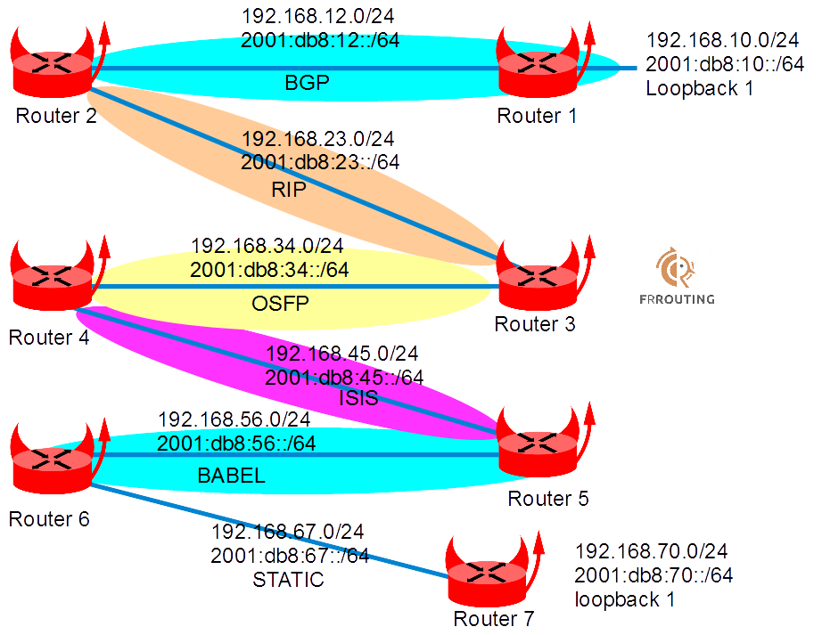

This lab is run with BSDRP under QEMU and shows how to use BSDRP with FRRouting (a fork of Quagga).

## Overview

### Network diagram

Here is the logical and physical view:



## Setting up the lab

### Downloading BSD Router Project images

Download the BSDRP serial image (which avoids needing an X display) from SourceForge.

### Download lab scripts

More information on the BSDRP lab scripts is available in [How to build a BSDRP router lab](how-to-build-a-bsdrp-router-lab.md).

## Router configuration

#### VM mode: 7 VMs

All these routers can be configured with the `labconfig` tool (use it only on a lab, since it replaces the current running configuration):

Start the lab with 7 routers. Here is an example with VirtualBox:

```
./BSDRP-lab-vbox.sh -i BSDRP-1.97-full-amd64-serial.img.xz -n 7
```

Then on each:

```
labconfig frr_vm[VM-NUMBER]
```

#### Jail mode: 1 VM running 7 jails

Or, using just one router:

```
./BSDRP-lab-vbox.sh -i BSDRP-1.97-full-amd64-serial.img.xz -n 1
```

Then use the jail/vnet version with:

```
labconfig frr_jails
```

### Router 1

```
sysrc hostname=router1 \
  cloned_interfaces=lo1 \
  ipsec_enable=YES \
  ipsec_file="/etc/ipsec.conf" \
  frr_vtysh_boot=YES \
  frr_enable=yes
cat <<EOF > /etc/ipsec.conf
flush ;
add 192.168.12.1 192.168.12.2 tcp 0x1000 -A tcp-md5 "abigpassword" ;
add 192.168.12.2 192.168.12.1 tcp 0x1001 -A tcp-md5 "abigpassword" ;
add -6 2001:db8:12::1 2001:db8:12::2 tcp 0x1002 -A tcp-md5 "abigpassword" ;
add -6 2001:db8:12::2 2001:db8:12::1 tcp 0x1003 -A tcp-md5 "abigpassword" ;
EOF

cat > /usr/local/etc/frr/frr.conf <<EOF
log syslog
!
interface lo1
 ip address 192.168.10.1/24
 ipv6 address 2001:db8:10::1/64
!
interface vtnet0
 ip address 192.168.12.1/24
 ipv6 address 2001:db8:12::1/64
!
router bgp 12
 bgp router-id 192.168.10.1
 neighbor 192.168.12.2 remote-as 12
 neighbor 192.168.12.2 bfd
 neighbor 192.168.12.2 password abigpassword
 neighbor 2001:db8:12::2 remote-as 12
 neighbor 2001:db8:12::2 bfd
 neighbor 2001:db8:12::2 password abigpassword
 !
 address-family ipv4 unicast
  network 192.168.10.0/24
  neighbor 192.168.12.2 soft-reconfiguration inbound
  no neighbor 2001:db8:12::2 activate
 exit-address-family
 !
 address-family ipv6 unicast
  network 2001:db8:10::/64
  neighbor 2001:db8:12::2 activate
  neighbor 2001:db8:12::2 soft-reconfiguration inbound
 exit-address-family
!
bfd
 peer 2001:db8:12::2 local-address 2001:db8:12::1
  no shutdown
 !
 peer 192.168.12.2
  no shutdown
 !
!
EOF
hostname router1
service netif restart
service ipsec start
service frr start
config save
```

### Router 2

```
sysrc hostname=router2
sysrc ipsec_enable=YES
sysrc ipsec_file="/etc/ipsec.conf"
sysrc frr_enable=YES
cat <<EOF > /etc/ipsec.conf
flush ;
add 192.168.12.1 192.168.12.2 tcp 0x1000 -A tcp-md5 "abigpassword" ;
add 192.168.12.2 192.168.12.1 tcp 0x1001 -A tcp-md5 "abigpassword" ;
add -6 2001:db8:12::1 2001:db8:12::2 tcp 0x1002 -A tcp-md5 "abigpassword" ;
add -6 2001:db8:12::2 2001:db8:12::1 tcp 0x1003 -A tcp-md5 "abigpassword" ;
EOF
cat > /usr/local/etc/frr/frr.conf <<EOF
log syslog
!
key chain rippass
 key 1
  key-string rippassword
 key 1
  key-string rippassword
!
interface vtnet0
 ip address 192.168.12.2/24
 ipv6 address 2001:db8:12::2/64
!
interface vtnet1
 ip address 192.168.23.2/24
 ip rip authentication key-chain rippass
 ip rip authentication mode md5
 ipv6 address 2001:db8:23::2/64
!
router rip
 network vtnet1
 redistribute bgp
 redistribute connected
 version 2
!
router ripng
 network vtnet1
 redistribute bgp
 redistribute connected
!
router bgp 12
 bgp router-id 192.168.10.2
 neighbor 192.168.12.1 remote-as 12
 neighbor 192.168.12.1 bfd
 neighbor 192.168.12.1 password abigpassword
 neighbor 2001:db8:12::1 remote-as 12
 neighbor 2001:db8:12::1 bfd
 neighbor 2001:db8:12::1 password abigpassword
 !
 address-family ipv4 unicast
  network 192.168.12.0/24
  redistribute rip
  neighbor 192.168.12.1 next-hop-self
  neighbor 192.168.12.1 soft-reconfiguration inbound
  no neighbor 2001:db8:12::1 activate
 exit-address-family
 !
 address-family ipv6 unicast
  network 2001:db8:12::/64
  redistribute ripng
  neighbor 2001:db8:12::1 activate
  neighbor 2001:db8:12::1 soft-reconfiguration inbound
 exit-address-family
!
bfd
 peer 192.168.12.1
  no shutdown
 !
 peer 2001:db8:12::1 local-address 2001:db8:12::2
  no shutdown
 !
!
EOF

hostname router2
service ipsec start
service frr start
config save
```

### Router 3

```
sysrc hostname=router3
sysrc frr_enable=YES
cat > /usr/local/etc/frr/frr.conf <<EOF
log syslog
!
key chain rippass
 key 1
  key-string rippassword
 key 1
  key-string rippassword
!
interface vtnet1
 ip address 192.168.23.3/24
 ip rip authentication key-chain rippass
 ip rip authentication mode md5
 ipv6 address 2001:db8:23::3/64
!
interface vtnet2
 ip address 192.168.34.3/24
 ip ospf bfd
 ip ospf message-digest-key 1 md5 superpass
 ipv6 address 2001:db8:34::3/64
 ipv6 ospf6 bfd
!
router rip
 network vtnet1
 redistribute connected
 redistribute ospf
 version 2
!
router ripng
 network vtnet1
 redistribute connected
 redistribute ospf6
!
router ospf
 ospf router-id 3.3.3.3
 redistribute connected
 redistribute rip
 network 192.168.34.0/24 area 0.0.0.0
 area 0.0.0.0 authentication message-digest
!
router ospf6
 redistribute connected
 redistribute ripng
 interface vtnet2 area 0.0.0.0
!
bfd
 peer 2001:db8:34::4 local-address 2001:db8:34::3
  no shutdown
 !
 peer 192.168.34.4
  no shutdown
 !
!
EOF

hostname router3
service frr start
config save
```

### Router 4

```
sysrc hostname=router4
sysrc frr_enable=YES
cat > /usr/local/etc/frr/frr.conf <<EOF
log syslog
!
interface vtnet2
 ip address 192.168.34.4/24
 ip ospf bfd
 ip ospf message-digest-key 1 md5 superpass
 ipv6 address 2001:db8:34::4/64
 ipv6 ospf6 bfd
!
interface vtnet3
 ip address 192.168.45.4/24
 ip router isis BSDRP
 ipv6 address 2001:db8:45::4/64
 ipv6 router isis BSDRP
 isis circuit-type level-2-only
!
router ospf
 ospf router-id 4.4.4.4
 redistribute connected
 redistribute isis
 network 192.168.34.0/24 area 0.0.0.0
 area 0.0.0.0 authentication message-digest
!
router ospf6
 redistribute connected
 redistribute isis
 interface vtnet2 area 0.0.0.0
!
router isis BSDRP
 is-type level-1-2
 net 49.0000.0000.0004.00
 redistribute ipv4 ospf level-2
 redistribute ipv4 connected level-2
 redistribute ipv6 ospf6 level-2
 redistribute ipv6 connected level-2
!
bfd
 peer 2001:db8:34::3 local-address 2001:db8:34::4
  no shutdown
 !
 peer 192.168.34.3
  no shutdown
 !
!
EOF

hostname router4
service frr start
config save
```

### Router 5

```
sysrc hostname=router5
sysrc frr_enable=YES
cat > /usr/local/etc/frr/frr.conf <<EOF
log syslog
!
interface vtnet3
 ip address 192.168.45.5/24
 ip router isis BSDRP
 ipv6 address 2001:db8:45::5/64
 ipv6 router isis BSDRP
 isis circuit-type level-2-only
!
interface vtnet4
 ip address 192.168.56.5/24
 ip router isis BSDRP
 ipv6 address 2001:db8:56::5/64
 ipv6 router isis BSDRP
 isis circuit-type level-2-only
 isis passive
!
router babel
 network vtnet3
 network vtnet4
 redistribute ipv4 isis
 redistribute ipv6 isis
!
router isis BSDRP
 is-type level-1-2
 net 49.0000.0000.0005.00
 redistribute ipv4 babel level-2
 redistribute ipv6 babel level-2
!
EOF
hostname router5
service netif restart
service frr start
config save
```

### Router 6

```
sysrc hostname=router6
sysrc frr_enable=YES
cat > /usr/local/etc/frr/frr.conf <<EOF
log syslog
!
ip route 192.168.70.0/24 192.168.67.7
ipv6 route 2001:db8:70::/64 2001:db8:67::7
!
interface vtnet4
 ip address 192.168.56.6/24
 ipv6 address 2001:db8:56::6/64
!
interface vtnet5
 ip address 192.168.67.6/24
 ipv6 address 2001:db8:67::6/64
!
router babel
 network vtnet4
 redistribute ipv4 connected
 redistribute ipv4 static
 redistribute ipv6 connected
 redistribute ipv6 static
!
EOF
hostname router6
service netif restart
service frr start
config save
```

### Router 7

```
sysrc hostname=router7
sysrc cloned_interfaces=lo1
sysrc frr_enable=YES
cat > /usr/local/etc/frr/frr.conf <<EOF
log syslog
!
ip route 0.0.0.0/0 192.168.67.6
ipv6 route ::/0 2001:db8:67::6
!
interface lo1
 ip address 192.168.70.7/24
 ipv6 address 2001:db8:70::7/64
!
interface vtnet5
 ip address 192.168.67.7/24
 ipv6 address 2001:db8:67::7/64
!
EOF
hostname router7
service netif restart
service frr start
config save
```

## Final testing

Ping router7 loopback from router1 loopback:

```
[root@router1]~# ping -c 4 -S 192.168.10.1 192.168.70.7
PING 192.168.70.7 (192.168.70.7) from 192.168.10.1: 56 data bytes
64 bytes from 192.168.70.7: icmp_seq=0 ttl=59 time=0.580 ms
64 bytes from 192.168.70.7: icmp_seq=1 ttl=59 time=0.559 ms
64 bytes from 192.168.70.7: icmp_seq=2 ttl=59 time=0.542 ms
64 bytes from 192.168.70.7: icmp_seq=3 ttl=59 time=0.541 ms

--- 192.168.70.7 ping statistics ---
4 packets transmitted, 4 packets received, 0.0% packet loss
round-trip min/avg/max/stddev = 0.541/0.555/0.580/0.016 ms

[root@router1]~# ping -c 4 -S 2001:db8:10::1 2001:db8:70::7
PING6(56=40+8+8 bytes) 2001:db8:10::1 --> 2001:db8:70::7
16 bytes from 2001:db8:70::7, icmp_seq=0 hlim=59 time=0.607 ms
16 bytes from 2001:db8:70::7, icmp_seq=1 hlim=59 time=0.570 ms
16 bytes from 2001:db8:70::7, icmp_seq=2 hlim=59 time=0.526 ms
16 bytes from 2001:db8:70::7, icmp_seq=3 hlim=59 time=0.555 ms

--- 2001:db8:70::7 ping6 statistics ---
4 packets transmitted, 4 packets received, 0.0% packet loss
round-trip min/avg/max/std-dev = 0.526/0.565/0.607/0.029 ms
```

Don’t forget to "force" the source IP address to use the loopback; otherwise, router1 will use the outgoing NIC’s IP address as the source.
