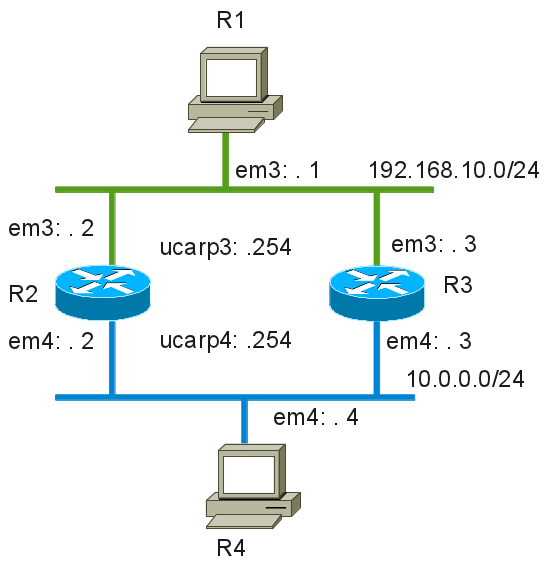

This lab uses the fixed ucarp rc script (introduced in BSDRP 0.34).

## Network diagram



## Creating the lab with VirtualBox

Start a lab using the [VirtualBox lab script](how-to-build-a-bsdrp-router-lab.md):

```
[root@d630]./virtualbox.sh -i BSDRP_0.34_full_i386_serial.img.bz2 -n 4 -l 2
Bzipped image detected, unzip it...
filename guests a i386 image
filename guests a serial image
Image file given… rebuilding BSDRP router template
Creating lab with 4 router(s):
- 2 LAN between all routers
- Full mesh ethernet point-to-point link between each routers

Router1 have the following NIC:
em0 connected to Router2.
em1 connected to Router3.
em2 connected to Router4.
em3 connected to LAN number 1.
em4 connected to LAN number 2.
Router2 have the following NIC:
em0 connected to Router1.
em1 connected to Router3.
em2 connected to Router4.
em3 connected to LAN number 1.
em4 connected to LAN number 2.
Router3 have the following NIC:
em0 connected to Router1.
em1 connected to Router2.
em2 connected to Router4.
em3 connected to LAN number 1.
em4 connected to LAN number 2.
Router4 have the following NIC:
em0 connected to Router1.
em1 connected to Router2.
em2 connected to Router3.
em3 connected to LAN number 1.
em4 connected to LAN number 2.
Connect to the router 1 by telneting to localhost on port 8001
Connect to the router 2 by telneting to localhost on port 8002
Connect to the router 3 by telneting to localhost on port 8003
Connect to the router 4 by telneting to localhost on port 8004
Connect to the router 4 by telneting to localhost on port 8005
Here is how to use a serial terminal software for connecting to the routers:
1. Create a bridge between the socat port and a local PTY link
   socat TCP-CONNECT:localhost:8001 PTY,link=/tmp/router1 &
2. Open your serial terminal software using the local PTY link just created
   Using screen/byobu:
       screen /tmp/router1 38400
   Or using tip (FreeBSD):
       echo "router1:dv=/tmp/router1:br#38400:pa=none:" >> /etc/remote
       tip router1
Warning: Closing your session will close socat on both end
```

## Configuring routers

### Router 1 (R1)

```
sysrc hostname=R1
sysrc gateway_enable=NO
sysrc ipv6_gateway_enable=NO
sysrc defaultrouter="192.168.10.254"
sysrc ifconfig_em3="192.168.10.1/24"
service netif restart
service routing restart
```

### Router 2 (R2)

```
sysrc hostname=R2
sysrc ifconfig_em3="192.168.10.2/24"
sysrc ifconfig_em4="10.0.0.2/24"
sysrc ucarp_enable=YES
sysrc ucarp_3_if="em3"
sysrc ucarp_3_src="192.168.10.2"
sysrc ucarp_3_pass="passcarp3"
sysrc ucarp_3_preempt="NO"
sysrc ucarp_3_addr="192.168.10.254"
sysrc ucarp_4_if="em4"
sysrc ucarp_4_src="10.0.0.2"
sysrc ucarp_4_pass="passcarp4"
sysrc ucarp_4_preempt="NO"
sysrc ucarp_4_addr="10.0.0.254"
service netif restart
service routing restart
service ucarp start
```

### Router 3 (R3)

```
sysrc hostname=R3
sysrc ifconfig_em3="192.168.10.3/24"
sysrc ifconfig_em4="10.0.0.3/24"
sysrc ucarp_enable="YES"
sysrc ucarp_3_if="em3"
sysrc ucarp_3_src="192.168.10.3"
sysrc ucarp_3_pass="passcarp3"
sysrc ucarp_3_preempt="NO"
sysrc ucarp_3_addr="192.168.10.254"
sysrc ucarp_3_advskew="100"
sysrc ucarp_4_if="em4"
sysrc ucarp_4_src="10.0.0.3"
sysrc ucarp_4_pass="passcarp4"
sysrc ucarp_4_preempt="NO"
sysrc ucarp_4_addr="10.0.0.254"
sysrc ucarp_4_advskew="100"
service netif restart
service routing restart
service ucarp start
```

### Router 4 (R4)

```
sysrc hostname=R4
sysrc gateway_enable=NO
sysrc defaultrouter="10.0.0.254"
sysrc ifconfig_em4="10.0.0.4/24"
service netif restart
service routing restart
config save
```

## Checking configuration

### uCarp state

On R2:

```
[root@R2]~#cat /var/log/messages | grep ucarp
Jul 27 17:54:02 R2 ucarp[1815]: [WARNING] Switching to state: MASTER
Jul 27 17:54:02 R2 ucarp[1815]: [WARNING] Spawning [/usr/local/sbin/ucarp-up em3 192.168.10.254]
Jul 27 17:54:02 R2 ucarp[1819]: [WARNING] Switching to state: MASTER
Jul 27 17:54:02 R2 ucarp[1819]: [WARNING] Spawning [/usr/local/sbin/ucarp-up em4 10.0.0.254]
```

*R2 is the uCarp master for vrid 3 and 4.*

On R3:

```
[root@R3]~#cat /var/log/messages | grep ucarp
Jul 29 01:03:11 R3 ucarp[1228]: [WARNING] Switching to state: BACKUP
Jul 29 01:03:11 R3 ucarp[1228]: [WARNING] Spawning [/usr/local/sbin/ucarp-down em4 10.0.0.254]
k to BACKUP state
Jul 29 01:03:11 R3 ucarp[1225]: [WARNING] Switching to state: BACKUP
Jul 29 01:03:11 R3 ucarp[1225]: [WARNING] Spawning [/usr/local/sbin/ucarp-down em3 192.168.10.254]
Jul 29 01:03:11 R3 ucarp[1225]: [WARNING] Preferred master advertised: going back to BACKUP state
```

*R3 is the uCarp backup for vrid 3 and 4.*

### Forwarding and ARP state

Ping R4 from R1:

```
[root@R1]~#ping 10.0.0.4
PING 10.0.0.4 (10.0.0.4): 56 data bytes
64 bytes from 10.0.0.4: icmp_seq=0 ttl=63 time=2.932 ms
64 bytes from 10.0.0.4: icmp_seq=1 ttl=63 time=2.360 ms
```

And check the ARP cache:

```
[root@R1]~#arp -a | grep 192.168.10.254
? (192.168.10.254) at cc:cc:00:00:01:02 on em3 expires in 1186 seconds [ethernet]
```


!!! note
    The MAC address of the virtual CARP IP is the real MAC of the interface in MASTER state (not a virtual MAC address), because of the IP alias creation on the MASTER node. A gratuitous ARP is needed when switching CARP state between two nodes.


### Testing uCarp failover

Disable one interface on R2 to change the uCARP states:

```
[root@R2]~#ifconfig em3 down
[root@R2]~#cat /var/log/messages | grep ucarp
Jul 27 17:53:59 R2 ucarp[1815]: [WARNING] Switching to state: BACKUP
Jul 27 17:53:59 R2 ucarp[1815]: [WARNING] Spawning [/usr/local/sbin/ucarp-down e
Jul 29 01:03:11 R2 ucarp[1815]: [WARNING] Non-preferred master advertising: reasserting control of VIP with another gratuitous arp
Jul 29 01:03:12 R2 ucarp[1819]: [WARNING] Non-preferred master advertising: reasserting control of VIP with another gratuitous arp
Jul 29 01:03:12 R2 ucarp[1815]: [WARNING] Non-preferred master advertising: reasserting control of VIP with another gratuitous arp
```

And check that R3 has become the master:

```
[root@R3]~#tail -f /var/log/messages
Jul 29 00:56:37 R3 ucarp[1225]: [WARNING] Switching to state: MASTER
Jul 29 00:56:37 R3 ucarp[1225]: [WARNING] Spawning [/usr/local/sbin/ucarp-up em3 192.168.10.254]
```

And check that R1 can still reach R4:

```
[root@R1]~#ping 10.0.0.4
PING 10.0.0.4 (10.0.0.4): 56 data bytes
64 bytes from 10.0.0.4: icmp_seq=0 ttl=63 time=2.321 ms
64 bytes from 10.0.0.4: icmp_seq=1 ttl=63 time=2.450 ms
```
