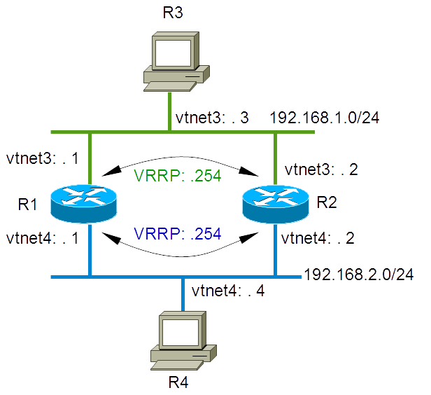

## Network Diagram



## Starting the lab

More information on these BSDRP lab scripts available on [How to build a BSDRP router lab](how-to-build-a-bsdrp-router-lab.md).

Example with the bhyve lab script:

```
# ./BSDRP-lab-bhyve.sh -i /usr/obj/BSDRP.amd64/BSDRP-2.1-full-amd64.img -n 4 -l 2
Setting-up a virtual lab with 4 VM(s):
- Working directory: /home/olivier/BSDRP-VMs
- Each VM has a total of 1 (1 cores and 1 threads) and 1G RAM
- Emulated NIC: virtio-net
- Boot mode: UEFI
- Switch mode: bridge + tap
- 2 LAN(s) between all VM
- Full mesh Ethernet links between each VM
VM 1 has the following NIC:
- vtnet0 connected to VM 2
- vtnet1 connected to VM 3
- vtnet2 connected to VM 4
- vtnet3 connected to LAN number 1
- vtnet4 connected to LAN number 2
VM 2 has the following NIC:
- vtnet0 connected to VM 1
- vtnet1 connected to VM 3
- vtnet2 connected to VM 4
- vtnet3 connected to LAN number 1
- vtnet4 connected to LAN number 2
VM 3 has the following NIC:
- vtnet0 connected to VM 1
- vtnet1 connected to VM 2
- vtnet2 connected to VM 4
- vtnet3 connected to LAN number 1
- vtnet4 connected to LAN number 2
VM 4 has the following NIC:
- vtnet0 connected to VM 1
- vtnet1 connected to VM 2
- vtnet2 connected to VM 3
- vtnet3 connected to LAN number 1
- vtnet4 connected to LAN number 2
To connect VM'serial console, you can use:
- VM 1 : sudo cu -l /dev/nmdm-BSDRP.1B
- VM 2 : sudo cu -l /dev/nmdm-BSDRP.2B
- VM 4 : sudo cu -l /dev/nmdm-BSDRP.4B
- VM 3 : sudo cu -l /dev/nmdm-BSDRP.3B
```

## Configuring Routers

### Router 1 (R1)

```
sysrc hostname=R1 \
  kld_list+="carp" \
  ifconfig_vtnet3="inet 192.168.1.1/24" \
  ifconfig_vtnet4="inet 192.168.2.1/24" \
  ifconfig_vtnet3_alias0="inet 192.168.1.254/32 vhid 1 vrrpprio 101 pass vrid1 carpver 3" \
  ifconfig_vtnet4_alias0="inet 192.168.2.254/32 vhid 2 vrrpprio 101 pass vrid2 carpver 3"
echo 'net.inet.carp.preempt=1' >> /etc/sysctl.conf
kldload carp
service hostname restart
service netif restart
sysctl net.inet.carp.preempt=1
config save
```

### Router 2 (R2)

```
sysrc hostname=R2 \
  kld_list+="carp" \
  ifconfig_vtnet3="inet 192.168.1.2/24" \
  ifconfig_vtnet4="inet 192.168.2.2/24" \
  ifconfig_vtnet3_alias0="inet 192.168.1.254/32 vhid 1 vrrpprio 100 pass vrid1 carpver 3" \
  ifconfig_vtnet4_alias0="inet 192.168.2.254/32 vhid 2 vrrpprio 100 pass vrid2 carpver 3"
echo 'net.inet.carp.preempt=1' >> /etc/sysctl.conf
kldload carp
service hostname restart
service netif restart
sysctl net.inet.carp.preempt=1
config save
```

### Router 3 (R3)

```
sysrc hostname=R3 \
  ifconfig_vtnet3="inet 192.168.1.3/24" \
  defaultrouter="192.168.1.254" \
  gateway_enable=NO \
  ipv6_gateway_enable=NO
service netif restart
service routing restart
config save
```

### Router 4 (R4)

```
sysrc hostname=R4 \
  ifconfig_vtnet4="inet 192.168.2.4/24" \
  defaultrouter="192.168.2.254" \
  gateway_enable=NO \
  ipv6_gateway_enable=NO
service netif restart
service routing restart
config save
```

## Checking configuration

### VRRP state

On R1:

```
root@R1:~ # grep carp /var/log/messages
Feb 27 01:41:27 R1 kernel: carp: 1@vtnet3: INIT -> BACKUP (initialization complete)
Feb 27 01:41:27 R1 kernel: carp: 2@vtnet4: INIT -> BACKUP (initialization complete)
Feb 27 01:41:29 R1 kernel: carp: 1@vtnet3: BACKUP -> MASTER (preempting a slower master)
Feb 27 01:41:29 R1 kernel: carp: 2@vtnet4: BACKUP -> MASTER (preempting a slower master)
```

*R1 is VRRP master for vrid 1 and 2.*

On R2:

```
root@R2:~ # grep carp /var/log/messages
Feb 27 01:41:26 R2 kernel: carp: 1@vtnet3: INIT -> BACKUP (initialization complete)
Feb 27 01:41:26 R2 kernel: carp: 2@vtnet4: INIT -> BACKUP (initialization complete)
Feb 27 01:41:29 R2 kernel: carp: 1@vtnet3: BACKUP -> MASTER (master timed out)
Feb 27 01:41:29 R2 kernel: carp: 2@vtnet4: BACKUP -> MASTER (master timed out)
Feb 27 01:41:29 R2 kernel: carp: 1@vtnet3: MASTER -> BACKUP (more frequent advertisement received)
Feb 27 01:41:29 R2 kernel: carp: 2@vtnet4: MASTER -> BACKUP (more frequent advertisement received)
```

*R2 is the VRRP backup for vrid 1 and 2.*

### Forwarding and ARP entry

Pinging R4 from R3:

```
[root@R3]~# ping 192.168.2.4
PING 192.168.2.4 (192.168.2.4): 56 data bytes
64 bytes from 192.168.2.4: icmp_seq=0 ttl=63 time=0.669 ms
64 bytes from 192.168.2.4: icmp_seq=1 ttl=63 time=0.749 ms
64 bytes from 192.168.2.4: icmp_seq=2 ttl=63 time=0.718 ms
```

And checking ARP cache for a VRRP MAC address (00:00:5e:00:01:xx)

```
root@R3:~ # arp -na | grep 192.168.1.254
? (192.168.1.254) at 00:00:5e:00:01:01 on vtnet3 expires in 1191 seconds [ethernet]
```

### Testing VRRP swap

Disable one interface on R1 for changing the VRRP states:

```
root@R1:~ # ifconfig vtnet3 down
root@R1:~ # grep carp /var/log/messages
Feb 27 09:19:11 router kernel: carp: 1@vtnet3: MASTER -> INIT (hardware interface down)
Feb 27 09:19:11 router kernel: carp: demoted by 240 to 240 (interface down)
Feb 27 09:19:11 router kernel: carp: 2@vtnet4: MASTER -> BACKUP (more frequent advertisement received)
```

And check that R2 became the master:

```
root@R2:~ # grep carp /var/log/messages
Feb 27 09:19:11 router kernel: carp: 2@vtnet4: BACKUP -> MASTER (preempting a slower master)
Feb 27 09:19:15 router kernel: carp: 1@vtnet3: BACKUP -> MASTER (master timed out)
```

And check that R3 still can reach R4:

```
[root@R3]~#ping 192.168.2.4
PING 192.168.2.4 (192.168.2.4): 56 data bytes
64 bytes from 192.168.2.4: icmp_seq=0 ttl=63 time=0.571 ms
64 bytes from 192.168.2.4: icmp_seq=1 ttl=63 time=0.795 ms
```
