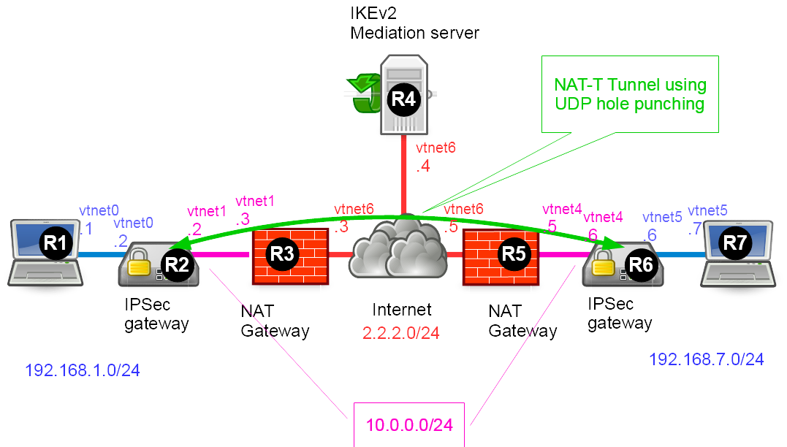

This lab shows an interesting feature of Strongswan: IPSec tunnel between devices, both behind NAT gateways.

## Presentation

### Network diagram

Lab build following [How to build a BSDRP router lab](how-to-build-a-bsdrp-router-lab.md): 7 routers with full-meshed link and one shared LAN.

Here is the logical and physical view:



### Setting-up the lab

#### Downloading BSD Router Project images

Download BSDRP serial image (prevent to have to use an X display) on Sourceforge.

#### Download Lab scripts

More information on these BSDRP lab scripts available on [How to build a BSDRP router lab](how-to-build-a-bsdrp-router-lab.md).

Start the lab with full-meshed 7 routers and one shared LAN, on this example using bhyve lab script on FreeBSD:

```
[root@FreeBSD]~# BSDRP-lab-bhyve.sh -i BSDRP-1.903-full-amd64-serial.img.xz -n 7 -l 1

VM 1 have the following NIC:
- vtnet0 connected to VM 2
- vtnet1 connected to VM 3
- vtnet2 connected to VM 4
- vtnet3 connected to VM 5
- vtnet4 connected to VM 6
- vtnet5 connected to VM 7
- vtnet6 connected to LAN number 1
VM 2 have the following NIC:
- vtnet0 connected to VM 1
- vtnet1 connected to VM 3
- vtnet2 connected to VM 4
- vtnet3 connected to VM 5
- vtnet4 connected to VM 6
- vtnet5 connected to VM 7
- vtnet6 connected to LAN number 1
VM 3 have the following NIC:
- vtnet0 connected to VM 1
- vtnet1 connected to VM 2
- vtnet2 connected to VM 4
- vtnet3 connected to VM 5
- vtnet4 connected to VM 6
- vtnet5 connected to VM 7
- vtnet6 connected to LAN number 1
VM 4 have the following NIC:
- vtnet0 connected to VM 1
- vtnet1 connected to VM 2
- vtnet2 connected to VM 3
- vtnet3 connected to VM 5
- vtnet4 connected to VM 6
- vtnet5 connected to VM 7
- vtnet6 connected to LAN number 1
VM 5 have the following NIC:
- vtnet0 connected to VM 1
- vtnet1 connected to VM 2
- vtnet2 connected to VM 3
- vtnet3 connected to VM 4
- vtnet4 connected to VM 6
- vtnet5 connected to VM 7
- vtnet6 connected to LAN number 1
VM 6 have the following NIC:
- vtnet0 connected to VM 1
- vtnet1 connected to VM 2
- vtnet2 connected to VM 3
- vtnet3 connected to VM 4
- vtnet4 connected to VM 5
- vtnet5 connected to VM 7
- vtnet6 connected to LAN number 1
VM 7 have the following NIC:
- vtnet0 connected to VM 1
- vtnet1 connected to VM 2
- vtnet2 connected to VM 3
- vtnet3 connected to VM 4
- vtnet4 connected to VM 5
- vtnet5 connected to VM 6
- vtnet6 connected to LAN number 1
For connecting to VM'serial console, you can use:
- VM 1 : cu -l /dev/nmdm1B
- VM 2 : cu -l /dev/nmdm2B
- VM 3 : cu -l /dev/nmdm3B
- VM 4 : cu -l /dev/nmdm4B
- VM 5 : cu -l /dev/nmdm5B
- VM 6 : cu -l /dev/nmdm6B
- VM 7 : cu -l /dev/nmdm7B
```

## Configuration

Router 1 and Router 7 as a simple workstation, Router 2 and 6 as IPSec gateway, Router 4 as IPSec mediation, Router 4 and 5 as NAT gateway.

### Router 1: Workstation

Router 1 is configured as a simple workstation.

```
sysrc hostname=R1
sysrc gateway_enable=NO
sysrc ipv6_gateway_enable=NO
sysrc ifconfig_vtnet0="inet 192.168.1.1/24"
sysrc defaultrouter="192.168.1.2"
service hostname restart
service netif restart
service routing restart
config save
```

### Router 2: IPSec gateway

Router 2 is an IPSec gateway behind a NAT gateway that need to be directly reachable from Router 6 (then need to use a mediation server).

Enable debug mode for IKEv2 into file /var/log/charon.log.

```
sysrc hostname=R2
sysrc ifconfig_vtnet0="inet 192.168.1.2/24"
sysrc ifconfig_vtnet1="inet 10.0.0.2/24"
sysrc defaultrouter=10.0.0.3
sysrc strongswan_enable="yes"
service hostname restart
service netif restart
service routing restart

cat > /usr/local/etc/ipsec.conf <<'EOF'
conn %default
        ikelifetime=60m
        keylife=20m
        rekeymargin=3m
        keyingtries=1
        authby=secret
        keyexchange=ikev2
        dpdaction=restart
        dpddelay=60s
        left=%defaultroute

conn medsrv
        leftid=r2@medsrv.org
        leftauth=psk
        right=2.2.2.4
        rightid=r4@medsrv.org
        rightauth=psk
        mediation=yes
        auto=add

conn peer
        leftsubnet=192.168.1.0/24
        leftid=r2@bsdrp.net
        right=%any
        rightid=r6@bsdrp.net
        rightsubnet=192.168.7.0/24
        mediated_by=medsrv
        me_peerid=r6@medsrv.org
        auto=start
'EOF'

cat > /usr/local/etc/ipsec.secrets <<'EOF'
r2@medsrv.org : PSK "MediaServerPassword"
r2@bsdrp.net r6@bsdrp.net : PSK "IPsecPassword"
'EOF'

cat > /usr/local/etc/strongswan.d/charon-logging.conf <<'EOF'
charon {
  filelog {
    /var/log/charon.log {
      default = 2
    }
  }
}
'EOF'
service strongswan start
config save
```

### Router 3: NAT gateway

Router 3 is configured as a NAT gateway (pf with NAT using static-port option).

Option static-port is important with pf: Without this option, NAT UDP hole will not work.

```
sysrc hostname=R3
sysrc ifconfig_vtnet1="inet 10.0.0.3/24"
sysrc ifconfig_vtnet6="inet 2.2.2.3/24"
sysrc pf_enable="YES"
service hostname restart
service netif restart
service routing restart

cat > /etc/pf.conf <<'EOF'
ext_if = "vtnet6"
int_if = "vtnet1"
localnet = $int_if:network
nat on $ext_if from $localnet to any -> ($ext_if) static-port
pass from { lo0, $localnet } to any keep state
'EOF'

service pf start
config save
```

### Router 4: IPSec mediation server

Router 4 is an IPSec mediation server (and debug log enabled).

```
sysrc hostname=R4
sysrc ifconfig_vtnet6="inet 2.2.2.4/24"
sysrc strongswan_enable="yes"
service hostname restart
service netif restart
service routing restart

cat > /usr/local/etc/ipsec.conf <<'EOF'
config setup

conn %default
        ikelifetime=60m
        keylife=20m
        rekeymargin=3m
        keyingtries=1
        authby=secret
        keyexchange=ikev2
        mobike=no
        dpdaction=clear
        dpddelay=60s

conn medsrv
        left=2.2.2.4
        leftid=r4@medsrv.org
        leftauth=psk
        right=%any
        rightauth=psk
        mediation=yes
        auto=add
'EOF'

cat > /usr/local/etc/ipsec.secrets <<'EOF'
r2@medsrv.org : PSK "MediaServerPassword"
r6@medsrv.org : PSK "MediaServerPassword"
'EOF'

cat > /usr/local/etc/strongswan.d/charon-logging.conf <<'EOF'
charon {
  filelog {
    /var/log/charon.log {
      default = 2
    }
  }
}
'EOF'

service strongswan start
config save
```

### Router 5: NAT gateway

Router 5 has the same workstation mode configuration as R3.

```
sysrc hostname=R5
sysrc ifconfig_vtnet6="inet 2.2.2.5/24"
sysrc ifconfig_vtnet4="inet 10.0.0.5/24"
sysrc pf_enable="YES"

cat > /etc/pf.conf <<'EOF'
ext_if = "vtnet6"
int_if = "vtnet4"
localnet = $int_if:network
# ext_if IP address could be dynamic, hence ($ext_if)
nat on $ext_if from $localnet to any -> ($ext_if) static-port
pass from { lo0, $localnet } to any keep state
'EOF'

hostname R5
service netif restart
service routing restart
service pf start
config save
```

### Router 6: IPSec gateway

Router 6 is like R2, an IPSec gateway using a mediation server (and debug log enabled).

```
sysrc hostname=R6
sysrc defaultrouter="10.0.0.5"
sysrc ifconfig_vtnet5="inet 192.168.7.6/24"
sysrc ifconfig_vtnet4="inet 10.0.0.6/24"
sysrc strongswan_enable="yes"
service hostname restart
service netif restart
service routing restart

cat > /usr/local/etc/ipsec.conf <<'EOF'
conn %default
        ikelifetime=60m
        keylife=20m
        rekeymargin=3m
        keyingtries=1
        authby=secret
        keyexchange=ikev2
        dpdaction=restart
        dpddelay=60s
        left=%defaultroute

conn medsrv
        leftid=r6@medsrv.org
        leftauth=psk
        right=2.2.2.4
        rightid=r4@medsrv.org
        rightauth=psk
        mediation=yes
        auto=add

conn peer
        leftsubnet=192.168.7.0/24
        leftid=r6@bsdrp.net
        right=%any
        rightid=r2@bsdrp.net
        rightsubnet=192.168.1.0/24
        mediated_by=medsrv
        me_peerid=r2@medsrv.org
        auto=start
'EOF'

cat > /usr/local/etc/ipsec.secrets <<'EOF'
r6@medsrv.org : PSK "MediaServerPassword"
r2@bsdrp.net r6@bsdrp.net : PSK "IPsecPassword"
'EOF'

cat > /usr/local/etc/strongswan.d/charon-logging.conf <<'EOF'
charon {
  filelog {
    /var/log/charon.log {
      default = 2
    }
  }
}
'EOF'

service strongswan start
config save
```

### Router 7: Workstation

Router 7 is, like R1, configured as a simple workstation.

```
sysrc hostname=R7
sysrc gateway_enable=NO
sysrc ipv6_gateway_enable=NO
sysrc ifconfig_vtnet5="inet 192.168.7.7/24"
sysrc defaultrouter="192.168.7.6"
sysrc ifconfig_vtnet5="inet 192.168.7.7/24"
service hostname restart
service netif restart
service routing restart
config save
```

## Testing

Status of IPSec tunnel:

```
[root@R2]~# ipsec statusall
Status of IKE charon daemon (strongSwan 5.5.1, FreeBSD 12.0-CURRENT, amd64):
  uptime: 4 minutes, since Apr 28 00:13:06 2017
  worker threads: 11 of 16 idle, 5/0/0/0 working, job queue: 0/0/0/0, scheduled: 12
  loaded plugins: charon aes des blowfish rc2 sha2 sha1 md4 md5 random nonce x509 revocation constraints pubkey pkcs1 pkcs7 pkcs8 pkcs12 pgp dnskey sshkey pem openssl f$
ps-prf xcbc cmac hmac attr kernel-pfkey kernel-pfroute resolve socket-default stroke vici updown eap-identity eap-md5 eap-mschapv2 eap-tls eap-ttls eap-peap xauth-gener$
c whitelist addrblock
Listening IP addresses:
  192.168.1.2
  10.0.0.2
Connections:
      medsrv:  %any...2.2.2.4  IKEv2, dpddelay=60s
      medsrv:   local:  [r2@medsrv.org] uses pre-shared key authentication
      medsrv:   remote: [r4@medsrv.org] uses pre-shared key authentication
      medsrv:   child:  dynamic === dynamic TUNNEL, dpdaction=restart
        peer:  %any...%any  IKEv2, dpddelay=60s
        peer:   local:  [r2@bsdrp.net] uses pre-shared key authentication
        peer:   remote: [r6@bsdrp.net] uses pre-shared key authentication
        peer:   child:  192.168.1.0/24 === 192.168.7.0/24 TUNNEL, dpdaction=restart
Security Associations (2 up, 0 connecting):
        peer[3]: ESTABLISHED 4 minutes ago, 10.0.0.2[r2@bsdrp.net]...2.2.2.5[r6@bsdrp.net]
        peer[3]: IKEv2 SPIs: da048fcc6b5080bd_i 474b56c815483bcf_r*, pre-shared key reauthentication in 49 minutes
        peer[3]: IKE proposal: AES_CBC_128/HMAC_SHA2_256_128/PRF_HMAC_SHA2_256/MODP_3072
        peer{2}:  INSTALLED, TUNNEL, reqid 1, ESP in UDP SPIs: cdec034c_i ced4f737_o
        peer{2}:  AES_CBC_128/HMAC_SHA2_256_128, 0 bytes_i (0 pkts, 284s ago), 0 bytes_o (0 pkts, 284s ago), rekeying in 11 minutes
        peer{2}:   192.168.1.0/24 === 192.168.7.0/24
      medsrv[2]: ESTABLISHED 4 minutes ago, 10.0.0.2[r2@medsrv.org]...2.2.2.4[r4@medsrv.org]
      medsrv[2]: IKEv2 SPIs: f7878154750454f8_i* 2077002ffa7ceaf9_r, pre-shared key reauthentication in 46 minutes
      medsrv[2]: IKE proposal: AES_CBC_128/HMAC_SHA2_256_128/PRF_HMAC_SHA2_256/MODP_3072
```

Ping:

```
[root@R1]~# ping -c 3 192.168.7.7
PING 192.168.7.7 (192.168.7.7): 56 data bytes
64 bytes from 192.168.7.7: icmp_seq=0 ttl=62 time=0.627 ms
64 bytes from 192.168.7.7: icmp_seq=1 ttl=62 time=0.457 ms
64 bytes from 192.168.7.7: icmp_seq=2 ttl=62 time=0.594 ms

--- 192.168.7.7 ping statistics ---
3 packets transmitted, 3 packets received, 0.0% packet loss
round-trip min/avg/max/stddev = 0.457/0.559/0.627/0.074 ms
```

## Limitations

This mediation service works only if the NAT gateways try to preserve source UDP ports: Removing option “static-port” on pf configuration as example prevent to use this feature.

## Testing others NAT engines

### FreeBSD ipfw (libalias)

Replacing pf nat by ipfw kernel-in-nat.

R3 modification:

```
sysrc pf_enable=no
sysrc firewall_enable=yes
sysrc firewall_nat_enable=yes
sysrc firewall_script="/etc/ipfw.rules"

cat > /etc/ipfw.rules <<'EOF'
#!/bin/sh
fwcmd="/sbin/ipfw -q"
int_if="vtnet1"
ext_if="vtnet6"
${fwcmd} -f flush
${fwcmd} nat 1 config if ${ext_if} same_ports deny_in unreg_only reset
${fwcmd} add pass ip from any to any via lo0
${fwcmd} add pass ip from any to any via ${int_if}
${fwcmd} add nat 1 ip from any to any via ${ext_if}
'EOF'
service pf onestop
service ipfw start
```

R5 modification:

```
sysrc pf_enable=no
sysrc firewall_enable=yes
sysrc firewall_nat_enable=yes
sysrc firewall_script="/etc/ipfw.rules"

cat > /etc/ipfw.rules <<'EOF'
#!/bin/sh
fwcmd="/sbin/ipfw -q"
int_if="vtnet4"
ext_if="vtnet6"
${fwcmd} -f flush
${fwcmd} nat 1 config if ${ext_if} same_ports unreg_only reset
${fwcmd} add pass ip from any to any via lo0
${fwcmd} add pass ip from any to any via ${int_if}
${fwcmd} add nat 1 ip from any to any via ${ext_if}
'EOF'
service pf onestop
service ipfw start
```

ipfw is not able to display NAT session table, then we will check strongswan log on mediation server:

```
[root@R4]~# tail -f /var/log/charon.log | grep ME_ENDPOINT
13[IKE] received HOST ME_ENDPOINT 192.168.1.2[4500]
13[IKE] received HOST ME_ENDPOINT 10.0.0.2[4500]
13[IKE] received SERVER_REFLEXIVE ME_ENDPOINT 2.2.2.3[4500]
13[IKE] received HOST ME_ENDPOINT 10.0.0.6[4500]
13[IKE] received HOST ME_ENDPOINT 192.168.7.6[4500]
13[IKE] received SERVER_REFLEXIVE ME_ENDPOINT 2.2.2.5[4500]
```

All peers reach to connect to mediation server using their original UDP source port 4500: ipfw seems to correctly keep original source port.

But IPSec tunnel is down:

```
[root@R2]~# ipsec status peer
Security Associations (2 up, 0 connecting):
        peer[1]: CREATED, %any[%any]...%any[%any]
```

Checking with tcpdump on one Internet interface:

```
[root@R3]~# tcpdump -pni vtnet6 host 2.2.2.5 and not icmp
tcpdump: verbose output suppressed, use -v or -vv for full protocol decode
listening on vtnet6, link-type EN10MB (Ethernet), capture size 262144 bytes
21:37:23.724744 IP 2.2.2.3.59172 > 2.2.2.5.4500: NONESP-encap: isakmp: child_sa  inf2[I]
21:37:23.749477 IP 2.2.2.5.4500 > 2.2.2.3.4500: NONESP-encap: isakmp: child_sa  inf2[I]
21:37:23.775475 IP 2.2.2.5.4500 > 2.2.2.3.4500: NONESP-encap: isakmp: child_sa  inf2[I]
21:37:23.821481 IP 2.2.2.5.4500 > 2.2.2.3.4500: NONESP-encap: isakmp: child_sa  inf2[I]
```

ipfw nat engine is correctly keeping source port for packet going from:

- R6 to R4
- R6 to R2
- R2 to R4

But it change source port for packet going from R2 to R6, and this broke mediation feature. 
!!! note
    There is a problem here: ipfw didn’t reach to keept the “same_ports” because. The only cause it’s because it’s already used, but by what???


Digging further we found that Strongswan is generating IPSec packets using all addresses configured on R2, and the first try is using the :

1.  The first packet generated by Strongswan is using source IP 192.168.1.2/24 (first interface, vtnet0), then consume on R3 the first NAT entry (R2, source port 4500 toward R6, destination port 4500)
2.  The second packet generated by Strongswan is using source IP 10.0.0.2/24 (second interface, vnet1), then when R3 can’t keept the same source port

On R6, the first interface it tried is vtnet4 (with IP 10.0.0.6/24) before vtnet6 (192.168.7.6/24), then there is no problem of “already an entry into the NAT table”.

For fixing this problem we need to accept only local network address to ipfw configuration on R3 (same behavior as line “nat … from \$localnet” on pf configuration:

```
cat > /etc/ipfw.rules <<'EOF'
#!/bin/sh
fwcmd="/sbin/ipfw -q"
int_if="vtnet1"
ext_if="vtnet6"
${fwcmd} -f flush
${fwcmd} nat 1 config if ${ext_if} same_ports deny_in reset
${fwcmd} add pass ip from any to any via lo0
${fwcmd} add pass ip from any to any via ${int_if}
${fwcmd} add nat 1 ip from 10.0.0.0/24 to any xmit ${ext_if}
${fwcmd} add nat 1 ip from any to any recv ${ext_if}
'EOF'
```

And this fix this Strongswan bug:

```
[root@R2]~# ipsec status peer
Security Associations (2 up, 0 connecting):
        peer[1]: ESTABLISHED 61 seconds ago, 10.0.0.2[r2@bsdrp.net]...2.2.2.5[r6@bsdrp.net]
        peer{1}:  INSTALLED, TUNNEL, reqid 1, ESP in UDP SPIs: c76f1a74_i c01aa5a4_o
        peer{1}:   192.168.1.0/24 === 192.168.7.0/24
```

### Cisco IOS

For this test:

1.  we insert 2 new Cisco router (named C3 and C5, emulated by dynamips) in parrallel of existing R3 and R5.
2.  We modify R2 and R6 to uses the new C3 and C5 as default gateway

Example if we are using the bhyve lab script (then on a FreeBSD hypervisor).

First, need to found bridge interface used for the shared LAN (Internet):

```
# ifconfig -a | egrep -B 1 'LAN_1$'
bridge6: flags=8843<UP,BROADCAST,RUNNING,SIMPLEX,MULTICAST> metric 0 mtu 1500
        description: LAN_1
```

=\> We need to create 2 new TAP interfaces and add them it to this bridge6: They will be used on C3 and C5 as “Internet facing” interface

Second, need to found LAN between R2 and R3. BSDRP lab script policy uses descrition name with “MESH_lower-router-id - higher-router-id”. Then we need to found bridge with description “MESH_2-3”:

```
# ifconfig -a | grep -B 1 'MESH_2-3$'
bridge7: flags=8843<UP,BROADCAST,RUNNING,SIMPLEX,MULTICAST> metric 0 mtu 1500
        description: MESH_2-3
```

=\> We need to create a new TAP interface and add it to bridge7: It will be used on C3 as “Internal” interface.

And same for R5-R6 bridge:

```
# ifconfig -a | grep -B 1 'MESH_5-6$'
bridge19: flags=8843<UP,BROADCAST,RUNNING,SIMPLEX,MULTICAST> metric 0 mtu 1500
        description: MESH_5-6
```

=\> We need to create the last TAP interface and add it to bridge19: It will be used on C5 as “Internal” interface.

Once done we start 2 dynamips instance (version 0.2.16 minimum for a working tap interface) emulating Cisco 3725 routers. Start dynamips on different tmux console.

```
set C3_INT=`ifconfig tap create`
set C3_EXT=`ifconfig tap create`
set C5_INT=`ifconfig tap create`
set C5_EXT=`ifconfig tap create`
ifconfig bridge6 addm $C3_EXT
ifconfig bridge6 addm $C5_EXT
ifconfig bridge7 addm $C3_INT
ifconfig bridge19 addm $C3_INT
dynamips -P 3725 --idle-pc 0x602467a4 -r 256 -j -i 1 -s 0:0:tap:$C3_INT -s 0:1:tap:$C3_EXT c3725-adventerprisek9-mz.124-25d.bin
dynamips -P 3725 --idle-pc 0x602467a4 -r 256 -j -i 2 -s 0:0:tap:$C5_INT -s 0:1:tap:$C5_EXT c3725-adventerprisek9-mz.124-25d.bin
```

Configuring dynamips instance 1 (C3):

```
en
conf t
hostname C3
access-list 1 permit 10.0.0.0 0.0.0.255
ip nat inside source list 1 interface fastEthernet 0/1 overload
int fastEthernet 0/0
 ip address 10.0.0.30 255.255.255.0
 ip nat inside
 no shutdown
int fastEthernet 0/1
 ip address 2.2.2.30 255.255.255.0
 ip nat outside
 no shutdown
```

Configuring dynamips instance 2 (C5):

```
en
conf t
hostname C5
access-list 1 permit 10.0.0.0 0.0.0.255
ip nat inside source list 1 interface fastEthernet 0/1 overload
int fastEthernet 0/0
 ip address 10.0.0.50 255.255.255.0
 ip nat inside
 no shutdown
int fastEthernet 0/1
 ip address 2.2.2.50 255.255.255.0
 ip nat outside
 no shutdown
```

Change R2 default route for using C3:

```
service strongswan stop
sysrc defaultrouter="10.0.0.30"
service routing restart
service strongswan start
```

Change R6 default route for using C5:

```
service strongswan stop
sysrc defaultrouter="10.0.0.50"
service routing restart
service strongswan start
```

And testing:

```
[root@R2]~# ipsec status peer
Security Associations (3 up, 0 connecting):
        peer[3]: ESTABLISHED 40 seconds ago, 10.0.0.2[r2@bsdrp.net]...2.2.2.5[r6@bsdrp.net]
        peer{2}:  INSTALLED, TUNNEL, reqid 1, ESP in UDP SPIs: cd81f3e1_i c209fd2f_o
        peer{2}:   192.168.1.0/24 === 192.168.7.0/24
        peer[1]: ESTABLISHED 40 seconds ago, 10.0.0.2[r2@bsdrp.net]...2.2.2.5[r6@bsdrp.net]
        peer{1}:  INSTALLED, TUNNEL, reqid 1, ESP in UDP SPIs: cd43f0d6_i ccc64d56_o
        peer{1}:   192.168.1.0/24 === 192.168.7.0/24
```

**It’s working: The Cisco IOS nat engine try to preserve packet original source port.**

And NAT translations table of C3 and C5 confirm it:

```
C3#sh ip nat translations
Pro Inside global      Inside local       Outside local      Outside global
udp 2.2.2.30:500       10.0.0.2:500       2.2.2.4:500        2.2.2.4:500
udp 2.2.2.30:4500      10.0.0.2:4500      2.2.2.4:4500       2.2.2.4:4500
udp 2.2.2.30:4500      10.0.0.2:4500      2.2.2.5:4500       2.2.2.5:4500

C5#sh ip nat translations
Pro Inside global      Inside local       Outside local      Outside global
udp 2.2.2.50:500       10.0.0.6:500       2.2.2.4:500        2.2.2.4:500
udp 2.2.2.50:4500      10.0.0.6:4500      2.2.2.4:4500       2.2.2.4:4500
udp 2.2.2.50:4500      10.0.0.6:4500      2.2.2.30:4500      2.2.2.30:4500
```
