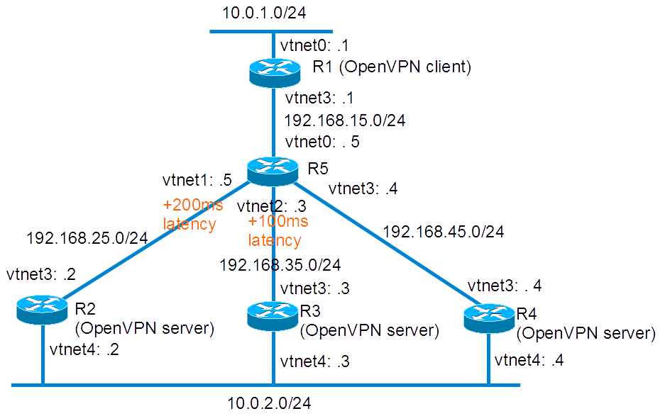

This lab test a [cool OpenVPN's patch: lowest-latency-server](https://github.com/paulgarnier/openvpn/commit/259d94029595c80076eef2282fd24d1961cf7d2d). This mean when multiple remote servers are configured, we measure their latency and connect in priority to the lowest latency.

## Presentation

### Network diagram

Lab build following [How to build a BSDRP router lab](how-to-build-a-bsdrp-router-lab.md): 5 routers with full-meshed link.

Here is the logical and physical view:



## Base routers configuration

We start a 5 routers full-mesh lab with one shared LAN:

```
root@lab:~ # /tools/BSDRP-lab-bhyve.sh -i BSDRP-1.591-full-amd64-vga.img.xz -n 5 -l 1
BSD Router Project (http://bsdrp.net) - bhyve full-meshed lab script
Setting-up a virtual lab with 5 VM(s):
- Working directory: /root/BSDRP-VMs
- Each VM has a total of 1 (1 cores and 1 threads) and 512M RAM
- Emulated NIC: virtio-net
- Switch mode: bridge + tap
- 1 LAN(s) between all VM
- Full mesh Ethernet links between each VM
VM 1 have the following NIC:
- vtnet0 connected to VM 2.
- vtnet1 connected to VM 3.
- vtnet2 connected to VM 4.
- vtnet3 connected to VM 5.
- vtnet4 connected to LAN number 1
VM 2 have the following NIC:
- vtnet0 connected to VM 1.
- vtnet1 connected to VM 3.
- vtnet2 connected to VM 4.
- vtnet3 connected to VM 5.
- vtnet4 connected to LAN number 1
VM 3 have the following NIC:
- vtnet0 connected to VM 1.
- vtnet1 connected to VM 2.
- vtnet2 connected to VM 4.
- vtnet3 connected to VM 5.
- vtnet4 connected to LAN number 1
VM 4 have the following NIC:
- vtnet0 connected to VM 1.
- vtnet1 connected to VM 2.
- vtnet2 connected to VM 3.
- vtnet3 connected to VM 5.
- vtnet4 connected to LAN number 1
VM 5 have the following NIC:
- vtnet0 connected to VM 1.
- vtnet1 connected to VM 2.
- vtnet2 connected to VM 3.
- vtnet3 connected to VM 4.
- vtnet4 connected to LAN number 1
For connecting to VM'serial console, you can use:
- VM 1 : cu -l /dev/nmdm1B
- VM 2 : cu -l /dev/nmdm2B
- VM 3 : cu -l /dev/nmdm3B
- VM 4 : cu -l /dev/nmdm4B
- VM 5 : cu -l /dev/nmdm5B
```

### Router 1

```
sysrc hostname=R1 \
  ifconfig_vtnet0="inet 10.0.1.1/24" \
  ifconfig_vnet0_ipv6="inet6 2001:db8:1::1 prefixlen 64" \
  ifconfig_vtnet3="inet 192.168.15.1/24" \
  ifconfig_vtnet3_ipv6="inet6 2001:db8:15::1 prefixlen 64" \
  defaultrouter=192.168.15.5 \
  ipv6_defaultrouter=2001:db8:15::5
service hostname restart
service netif restart
service routing restart
config save
```

### Router 2

```
sysrc hostname=R2 \
  ifconfig_vtnet4="inet 10.0.2.2/24" \
  ifconfig_vtnet4_ipv6="inet6 2001:db8:2::2 prefixlen 64" \
  ifconfig_vtnet3="inet 192.168.25.2/24" \
  ifconfig_vtnet3_ipv6="inet6 2001:db8:25::2 prefixlen 64" \
  defaultrouter="192.168.25.5" \
  ipv6_defaultrouter="2001:db8:25::5"
service hostname restart
service netif restart
service routing restart
config save
```

### Router 3

```
sysrc hostname=R3 \
  ifconfig_vtnet4="inet 10.0.2.3/24" \
  ifconfig_vtnet4_ipv6="inet6 2001:db8:2::3 prefixlen 64" \
  ifconfig_vtnet3="inet 192.168.35.3/24" \
  ifconfig_vtnet3_ipv6="inet6 2001:db8:35::3 prefixlen 64" \
  defaultrouter="192.168.35.5" \
  ipv6_defaultrouter="2001:db8:35::5"
service hostname restart
service netif restart
service routing restart
config save
```

### Router 4

Router 4 base configuration, like R2: A simple connected-network router with a default route pointing to R3.

```
sysrc hostname=R4 \
  ifconfig_vtnet4="inet 10.0.2.4/24" \
  ifconfig_vtnet4_ipv6="inet6 2001:db8:2::4 prefixlen 64" \
  ifconfig_vtnet3="inet 192.168.45.4/24" \
  ifconfig_vtnet3_ipv6="inet6 2001:db8:45::4 prefixlen 64" \
  defaultrouter="192.168.45.5" \
  ipv6_defaultrouter="2001:db8:45::5"
service hostname restart
service netif restart
service routing restart
config save
```

### Router 5

Router 5 is the central router simulating Internet and low latency link.

```
sysrc hostname=R5 \
  ifconfig_vtnet0="inet 192.168.15.5/24" \
  ifconfig_vtnet1="inet 192.168.25.5/24" \
  ifconfig_vtnet2="inet 192.168.35.5/24" \
  ifconfig_vtnet3="inet 192.168.45.5/24" \
  ifconfig_vtnet0_ipv6="inet6 2001:db8:15::5 prefixlen 64" \
  ifconfig_vtnet1_ipv6="inet6 2001:db8:25::5 prefixlen 64" \
  ifconfig_vtnet2_ipv6="inet6 2001:db8:35::5 prefixlen 64" \
  ifconfig_vtnet3_ipv6="inet6 2001:db8:45::5 prefixlen 64" \
  firewall_enable=YES \
  firewall_script="/etc/ipfw.rules"
cat > /etc/ipfw.rules <<EOF
#!/bin/sh
fwcmd="/sbin/ipfw"
kldstat -q -m dummynet || kldload dummynet
# Flush out the list before we begin.
\${fwcmd} -f flush
#Create pipes (one for each direction)
\${fwcmd} pipe 52 config delay 100ms
\${fwcmd} pipe 25 config delay 100ms
\${fwcmd} pipe 53 config delay 50ms
\${fwcmd} pipe 35 config delay 50ms
\${fwcmd} add pipe 25 all from any to any in via vtnet1
\${fwcmd} add pipe 52 all from any to any out via vtnet1
\${fwcmd} add pipe 35 all from any to any in via vtnet2
\${fwcmd} add pipe 53 all from any to any out via vtnet2
#We don't want to block traffic, only shape some
\${fwcmd} add allow ip from any to any
EOF
service hostname restart
service netif restart
service routing restart
service ipfw start
config save
```

## OpenVPN

### CA and certificates generation

All these step will be done on R2 (OpenVPN server & CA)

Start by copying easyrsa3 configuration folder and define new configuration file:

```
cp -r /usr/local/share/easy-rsa /usr/local/etc/
setenv EASYRSA /usr/local/etc/easy-rsa
```

Initialize PKI and generate a DH:

```
cd /usr/local/etc/easy-rsa
easyrsa init-pki
easyrsa gen-dh
```

Build a root certificate:

```
[root@R2]~# easyrsa build-ca nopass

Note: using Easy-RSA configuration from: /usr/local/etc/easy-rsa/vars
Generating a 2048 bit RSA private key
...............................................+++
..................................................................................+++
writing new private key to '/usr/local/etc/easy-rsa/pki/private/ca.key.EvwYAl9tEs'
-----
You are about to be asked to enter information that will be incorporated
into your certificate request.
What you are about to enter is what is called a Distinguished Name or a DN.
There are quite a few fields but you can leave some blank
For some fields there will be a default value,
If you enter '.', the field will be left blank.
-----
Common Name (eg: your user, host, or server name) [Easy-RSA CA]:

CA creation complete and you may now import and sign cert requests.
Your new CA certificate file for publishing is at:
/usr/local/etc/easy-rsa/pki/ca.crt
```

Make a server certificate called R2, R3 and R4. Then client certificate called R1:

```
easyrsa build-server-full R2 nopass
easyrsa build-server-full R3 nopass
easyrsa build-server-full R4 nopass
easyrsa build-client-full R1 nopass
config save
```

### R2: First OpenVPN server and cert generator

Create the openvpn configuration file for server mode as /usr/local/etc/openvpn/openvpn.conf:

```
mkdir /usr/local/etc/openvpn
cat > /usr/local/etc/openvpn/openvpn.conf <<'EOF'
dev tun
tun-ipv6
ca /usr/local/etc/easy-rsa/pki/ca.crt
cert /usr/local/etc/easy-rsa/pki/issued/R2.crt
key /usr/local/etc/easy-rsa/pki/private/R2.key
dh /usr/local/etc/easy-rsa/pki/dh.pem
server 10.0.21.0 255.255.255.0
server-ipv6 2001:db8:21::/64
keepalive 5 60
ifconfig-pool-persist ipp.txt
client-config-dir ccd
push "route 10.0.2.0 255.255.255.0"
push "route-ipv6 2001:db8:2::/64"
route 10.0.1.0 255.255.255.0
route-ipv6 2001:db8:1::/64
'EOF'
```

Create the Client-Configuration-dir and declare the volatile route to the subnet behind the client R1:

```
mkdir /usr/local/etc/openvpn/ccd
cat > /usr/local/etc/openvpn/ccd/R1 <<'EOF'
iroute 10.0.1.0 255.255.255.0
iroute-ipv6 2001:db8:1::/64
'EOF'
```

Enable and start openvpn and sshd (we will get certificates files by SCP later):

```
service openvpn enable
service openvpn start
service sshd enable
service sshd start
```

And set a password for root account (mandatory for next SCP file copy):

```
passwd
```

### R3: Second OpenVPN server

Create the openvpn configuration file for server mode as /usr/local/etc/openvpn/openvpn.conf:

```
mkdir /usr/local/etc/openvpn
cat > /usr/local/etc/openvpn/openvpn.conf <<'EOF'
dev tun
tun-ipv6
ca ca.crt
cert R3.crt
key R3.key
dh dh.pem
server 10.0.31.0 255.255.255.0
server-ipv6 2001:db8:31::/64
keepalive 5 60
ifconfig-pool-persist ipp.txt
client-config-dir ccd
push "route 10.0.2.0 255.255.255.0"
push "route-ipv6 2001:db8:2::/64"
route 10.0.1.0 255.255.255.0
route-ipv6 2001:db8:1::/64
'EOF'
```

Create the Client-Configuration-dir and declare the volatile route to the subnet behind the client R1:

```
mkdir /usr/local/etc/openvpn/ccd
cat > /usr/local/etc/openvpn/ccd/R1 <<'EOF'
iroute 10.0.1.0 255.255.255.0
iroute-ipv6 2001:db8:1::/64
'EOF'
```

Then get CA and your own certificate from R2

```
scp 192.168.25.2:/usr/local/etc/easy-rsa/pki/ca.crt /usr/local/etc/openvpn
scp 192.168.25.2:/usr/local/etc/easy-rsa/pki/dh.pem /usr/local/etc/openvpn
scp 192.168.25.2:/usr/local/etc/easy-rsa/pki/issued/R3.crt /usr/local/etc/openvpn
scp 192.168.25.2:/usr/local/etc/easy-rsa/pki/private/R3.key /usr/local/etc/openvpn
```

Enable and start openvpn:

```
service openvpn enable
service openvpn start
```

### R4: Third OpenVPN server

Create the openvpn configuration file for server mode as /usr/local/etc/openvpn/openvpn.conf:

```
mkdir /usr/local/etc/openvpn
cat > /usr/local/etc/openvpn/openvpn.conf <<'EOF'
dev tun
tun-ipv6
ca ca.crt
cert R4.crt
key R4.key
dh dh.pem
server 10.0.41.0 255.255.255.0
server-ipv6 2001:db8:41::/64
keepalive 5 60
ifconfig-pool-persist ipp.txt
client-config-dir ccd
push "route 10.0.2.0 255.255.255.0"
push "route-ipv6 2001:db8:2::/64"
route 10.0.1.0 255.255.255.0
route-ipv6 2001:db8:1::/64
'EOF'
```

Create the Client-Configuration-dir and declare the volatile route to the subnet behind the client R1:

```
mkdir /usr/local/etc/openvpn/ccd
cat > /usr/local/etc/openvpn/ccd/R1 <<'EOF'
iroute 10.0.1.0 255.255.255.0
iroute-ipv6 2001:db8:1::/64
'EOF'
```

Then get CA and your own certificate from R2

```
scp 192.168.25.2:/usr/local/etc/easy-rsa/pki/ca.crt /usr/local/etc/openvpn
scp 192.168.25.2:/usr/local/etc/easy-rsa/pki/dh.pem /usr/local/etc/openvpn
scp 192.168.25.2:/usr/local/etc/easy-rsa/pki/issued/R4.crt /usr/local/etc/openvpn
scp 192.168.25.2:/usr/local/etc/easy-rsa/pki/private/R4.key /usr/local/etc/openvpn
```

Enable and start openvpn:

```
service openvpn enable
service openvpn start
```

### R1: OpenVPN client

As OpenVPN client, R1 should get these files from R2 and put them in /usr/local/etc/openvpn:

- ca.crt
- R1.crt
- R1.key

On this lab, scp can be used for getting these files:

```
mkdir /usr/local/etc/openvpn
scp 192.168.25.2:/usr/local/etc/easy-rsa/pki/ca.crt /usr/local/etc/openvpn
scp 192.168.25.2:/usr/local/etc/easy-rsa/pki/issued/R1.crt /usr/local/etc/openvpn
scp 192.168.25.2:/usr/local/etc/easy-rsa/pki/private/R1.key /usr/local/etc/openvpn
```

Configure openvpn as a client:

```
cat > /usr/local/etc/openvpn/openvpn.conf <<'EOF'
client
dev tun
#Declare servers with bigger latency first
remote 192.168.25.2
remote 192.168.35.3
remote 192.168.45.4
remote-cert-tls server
ca ca.crt
cert R1.crt
key R1.key
'EOF'
```

Check the latency of each servers (200ms, 100ms and less than 1 ms):

```
[root@R1]~# ping -c 2 192.168.25.2
PING 192.168.25.2 (192.168.25.2): 56 data bytes
64 bytes from 192.168.25.2: icmp_seq=0 ttl=63 time=192.628 ms
64 bytes from 192.168.25.2: icmp_seq=1 ttl=63 time=200.045 ms

--- 192.168.25.2 ping statistics ---
2 packets transmitted, 2 packets received, 0.0% packet loss
round-trip min/avg/max/stddev = 192.628/196.336/200.045/3.708 ms

[root@R1]~# ping -c 2 192.168.35.3
PING 192.168.35.3 (192.168.35.3): 56 data bytes
64 bytes from 192.168.35.3: icmp_seq=0 ttl=63 time=96.894 ms
64 bytes from 192.168.35.3: icmp_seq=1 ttl=63 time=100.052 ms

--- 192.168.35.3 ping statistics ---
2 packets transmitted, 2 packets received, 0.0% packet loss
round-trip min/avg/max/stddev = 96.894/98.473/100.052/1.579 ms

[root@R1]~# ping -c 2 192.168.45.4
PING 192.168.45.4 (192.168.45.4): 56 data bytes
64 bytes from 192.168.45.4: icmp_seq=0 ttl=63 time=0.241 ms
64 bytes from 192.168.45.4: icmp_seq=1 ttl=63 time=0.257 ms

--- 192.168.45.4 ping statistics ---
2 packets transmitted, 2 packets received, 0.0% packet loss
round-trip min/avg/max/stddev = 0.241/0.249/0.257/0.008 ms
```

Enable and start openvpn:

```
service openvpn enable
service openvpn start
```

## Testing

### unpatched OpenVPN

Test the current setup by checking if with unpatched OpenVPN it’s works but connect only to the first declared OpenVPN server (192.168.25.2):

```
[root@R1]# grep openvpn /var/log/messages
Jun 11 14:38:41 R1 openvpn[2499]: OpenVPN 2.3.11 amd64-portbld-freebsd10.3 [SSL (OpenSSL)] [LZO] [MH] [IPv6] built on May 31 2016
Jun 11 14:38:41 R1 openvpn[2499]: library versions: OpenSSL 1.0.1s-freebsd  1 Mar 2016, LZO 2.09
Jun 11 14:38:41 R1 openvpn[2500]: UDPv4 link local (bound): [undef]
Jun 11 14:38:41 R1 openvpn[2500]: UDPv4 link remote: [AF_INET]192.168.25.2:1194
Jun 11 14:38:42 R1 openvpn[2500]: [R2] Peer Connection Initiated with [AF_INET]192.168.25.2:1194
Jun 11 14:38:45 R1 openvpn[2500]: TUN/TAP device /dev/tun0 opened
Jun 11 14:38:45 R1 openvpn[2500]: do_ifconfig, tt->ipv6=1, tt->did_ifconfig_ipv6_setup=1
Jun 11 14:38:45 R1 openvpn[2500]: /sbin/ifconfig tun0 10.0.21.6 10.0.21.5 mtu 1500 netmask 255.255.255.255 up
Jun 11 14:38:45 R1 openvpn[2500]: /sbin/ifconfig tun0 inet6 2001:db8:21::1000/64
Jun 11 14:38:45 R1 openvpn[2500]: add_route_ipv6(2001:db8:2::/64 -> 2001:db8:21::1 metric -1) dev tun0
Jun 11 14:38:45 R1 openvpn[2500]: Initialization Sequence Completed
[root@R1]# ping -c 4 10.0.2.2
PING 10.0.2.2 (10.0.2.2): 56 data bytes
64 bytes from 10.0.2.2: icmp_seq=0 ttl=64 time=199.854 ms
64 bytes from 10.0.2.2: icmp_seq=1 ttl=64 time=199.922 ms
64 bytes from 10.0.2.2: icmp_seq=2 ttl=64 time=199.921 ms
64 bytes from 10.0.2.2: icmp_seq=3 ttl=64 time=199.925 ms

--- 10.0.2.2 ping statistics ---
4 packets transmitted, 4 packets received, 0.0% packet loss
round-trip min/avg/max/stddev = 199.854/199.906/199.925/0.030 ms
```

### Compatibility Matrix

#### Methodology

For this test, we start by:

1.  upgrading OpenVPN on R2 (first server) and testing that unpatched R1 client reach to connect to patched OpenVPN server R2
2.  upgrading OpenVPN on R1 and testing it can connect to patched OpenVPN server R2
3.  modifying R1 unpatched OpenVPN configuration configuration by putting R3 (second unpatched OpenVPN server) in first position in the server list and checking that R1 (patched client) can connect to R3 (unpatched server)
4.  At the end, reverting R1 configuration for reinstallating R2 first, R3 second and R4 in third position.

#### Results

|                  | server unpatched | server patched |
|:----------------:|:-----------------|:---------------|
| client unpatched | OK               | OK             |
|  client patched  | OK               | OK             |

### Testing new remote-best-latency option

Now we still didn’t upgrade OpenVPN on the 2 last servers (R3 and R4) but we add remote-best-latency option on client:

```
service openvpn stop
echo "remote-best-latency" >> /usr/local/etc/openvpn/openvpn.conf
```

OpenVPN.conf should be like this one:

```
client
dev tun
#Declare servers with bigger latency first
remote 192.168.25.2
remote 192.168.35.3
remote 192.168.45.4
remote-cert-tls server
ca ca.crt
cert R1.crt
key R1.key
remote-best-latency
```

Then we start openvpn for checking the new behavior:

```
[root@R1]/usr/local/etc/openvpn# openvpn openvpn.conf
Fri Jun 17 07:04:44 2016 OpenVPN 2.3.11 amd64-portbld-freebsd10.3 [SSL (OpenSSL)] [LZO] [MH] [IPv6] built on Jun 16 2016
Fri Jun 17 07:04:44 2016 library versions: OpenSSL 1.0.1s-freebsd  1 Mar 2016, LZO 2.09
Timeout reached
Timeout reached
Timeout reached
Timeout reached
Timeout reached
Timeout reached
Timeout reached
Timeout reached
Timeout reached
Timeout reached
Timeout reached
Fri Jun 17 07:04:54 2016 UDPv4 link local (bound): [undef]
Fri Jun 17 07:04:54 2016 UDPv4 link remote: [AF_INET]192.168.45.4:1194
Fri Jun 17 07:04:54 2016 [R4] Peer Connection Initiated with [AF_INET]192.168.45.4:1194
Fri Jun 17 07:04:56 2016 TUN/TAP device /dev/tun0 opened
Fri Jun 17 07:04:56 2016 do_ifconfig, tt->ipv6=1, tt->did_ifconfig_ipv6_setup=1
Fri Jun 17 07:04:56 2016 /sbin/ifconfig tun0 10.0.41.6 10.0.41.5 mtu 1500 netmask 255.255.255.255 up
Fri Jun 17 07:04:56 2016 /sbin/ifconfig tun0 inet6 2001:db8:41::1000/64
add net 10.0.2.0: gateway 10.0.41.5 fib 0
add net 10.0.41.1: gateway 10.0.41.5 fib 0
Fri Jun 17 07:04:56 2016 add_route_ipv6(2001:db8:2::/64 -> 2001:db8:41::1 metric -1) dev tun0
add net 2001:db8:2::/64: gateway tun0 fib 0
Fri Jun 17 07:04:56 2016 Initialization Sequence Completed
```

We notice timeout message: 2 OpenVPN servers are still not upgraded and still didn’t support the OpenVPN-latency-ping packets, then they timeout. But the client no more connect to the first declared server but on R4 here (why?).

Bug on last version:

```
[root@R1]/usr/local/etc/openvpn# openvpn openvpn.conf
Tue Oct  6 00:57:23 2020 OpenVPN 2.4.9 amd64-portbld-freebsd13.0 [SSL (OpenSSL)] [LZO] [LZ4] [MH/RECVDA] [AEAD] built on Oct  5 2020
Tue Oct  6 00:57:23 2020 library versions: OpenSSL 1.1.1h-freebsd  22 Sep 2020, LZO 2.10
SHM 3
Invalid port number: -4600
Service was not recognized for socket type: No error: 0
Invalid port number: -4587
Service was not recognized for socket type: No error: 0
Invalid port number: 2793528
Service was not recognized for socket type: No error: 0
Invalid port number: 0
Invalid port number: 519602944
Service was not recognized for socket type: No error: 0
Invalid port number: 1701407843
Service was not recognized for socket type: No error: 0
Oct  6 00:57:23 router openvpn[78665]: stack overflow detected; terminated
Invalid port number: 0
Invalid port number: 1095649103
Service was not recognized for socket type: No error: 0
Oct  6 00:57:23 router openvpn[82522]: stack overflow detected; terminated
Invalid port number: 538968179
Service was not recognized for socket type: No error: 0
Invalid port number: 538968179
Service was not recognized for socket type: No error: 0
Invalid port number: 14983496
Service was not recognized for socket type: No error: 0
Invalid port number: 14790984
Service was not recognized for socket type: No error: 0
Invalid port number: 14790848
```
