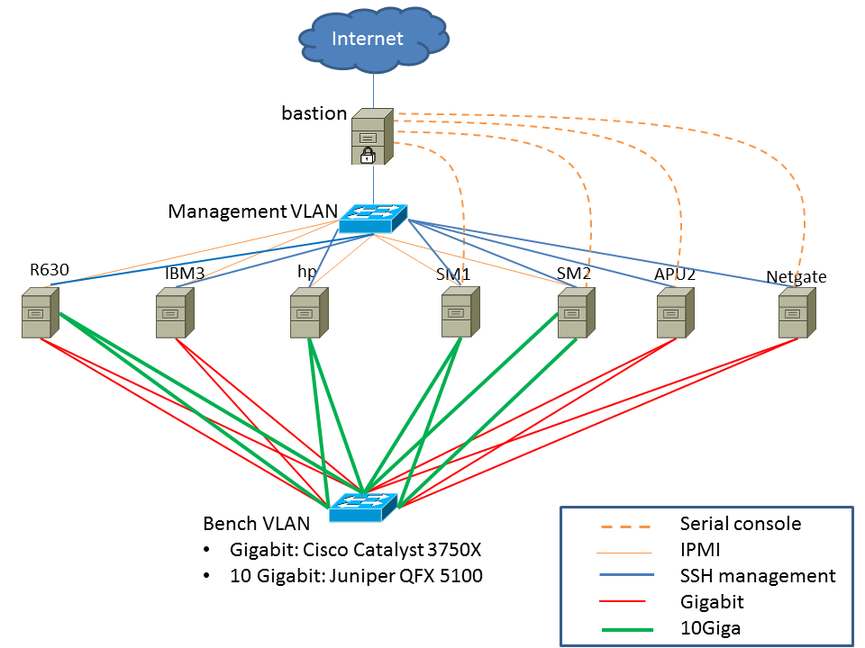

## Orange

### Diagrams



### Inventory

| Servers | CPU | cores | GHz | Network card (driver name) |
|----|----|----|----|----|
| Dell PowerEdge R630 | Intel E5-2650 v4 | 2x12x2 | 2.2 | 10G Intel 82599ES (ixgbe) |
| ::: | ::: | ::: | ::: | 10G Chelsio T520-CR (cxgbe) |
| ::: | ::: | ::: | ::: | 10-50G Mellanox ConnectX-4 LX (mlx5en) |
| HP ProLiant DL360p Gen8 | Intel E5-2650 v2 | 8x2 | 2.6 | 10G Chelsio T540-CR (cxgbe) |
| ::: | ::: | ::: | ::: | 10G Emulex OneConnect be3 (oce) |
| SuperMicro 5018A-FTN4 | Intel Atom C2758 | 8 | 2.4 | 10G Chelsio T540-CR (cxgbe) |
| ::: | ::: | ::: | ::: | Gigabit Intel i354 (igb) |
| SuperMicro 5018A-FTN4 | Intel Atom C2758 | 8 | 2.4 | 10G Intel 82599 (ixgbe) |
| ::: | ::: | ::: | ::: | Gigabit Intel i354 (igb) |
| Netgate RCC-VE 4860 | Intel Atom C2558 | 4 | 2.4 | Gigabit Intel i350 (igb) |
| ::: | ::: | ::: | ::: | Gigabit Intel i211 (igb) |
| PC Engines APU2 | AMD GX-412TC | 4 | 1 | Gigabit Intel i210AT (igb) |
| IBM System x3550 M3 | Intel L5630 | 4x2 | 2.13 | Gigabit Intel 82580 (igb) |

### Connectivity

| Server |  |  |  |  |  | Connected to |  |  |
|:--:|----|----|----|----|----|:--:|----|----|
| Description | Usage | Hostname | Interface | MAC | IP (/24) | Switch | Port | VLAN |
| Dell PowerEdge R630 | DUT | r630 | IPMI | 84:7b:eb:f6:03:5c | 192.168.1.12 | Catalyst-3750 | Gi1/0/3 | 3 |
| ::: | ::: | ::: | igb0 | 24:6e:96:5b:92:84 |  | Catalyst-3750 | Gi1/0/4 | 3 |
| ::: | ::: | ::: | igb1 | 24:6e:96:5b:92:85 | 192.168.1.2 | Catalyst-3750 | Gi1/0/16 | 3 |
| ::: | ::: | ::: | ix0 | 24:6e:96:5b:92:80 | 198.18.0.12 | Juniper-QFX | xe-0/0/13 | 2 |
| ::: | ::: | ::: | ix1 | 24:6e:96:5b:92:82 | 198.19.0.12 | Juniper-QFX | xe-0/0/12 | 2 |
| ::: | ::: | ::: | cxl0 | 00:07:43:2f:fe:b0 | 198.18.0.202 | Juniper-QFX | xe-0/0/15 | 2 |
| ::: | ::: | ::: | vcxl0 | 00:07:43:2f:fe:b2 | 198.18.0.2 | ::: | ::: | ::: |
| ::: | ::: | ::: | cxl1 | 00:07:43:2f:fe:b8 | 198.19.0.202 | Juniper-QFX | xe-0/0/14 | 2 |
| ::: | ::: | ::: | vcxl1 | 00:07:43:2f:fe:ba | 198.19.0.2 | ::: | ::: | ::: |
| ::: | ::: | ::: | mlxen0 | ec:0d:9a:21:aa:10 | 198.18.0.222 | Juniper-QFX | xe-0/0/17 | 2 |
| ::: | ::: | ::: | mlxen1 | ec:0d:9a:21:aa:11 | 198.19.0.222 | Juniper-QFX | xe-0/0/16 | 2 |
| ::: | ::: | ::: | mce0 | ec:0d:9a:9c:7a:e6 | 198.18.0.22 | Juniper-QFX | xe-0/0/18 | 2 |
| ::: | ::: | ::: | mce1 | ec:0d:9a:9c:7a:e7 | 198.19.0.22 | Juniper-QFX | xe-0/0/19 | 2 |
| ::: | ::: | ::: | uart1 |  | 115200 | bastion | /dev/cuaU4 |  |
| HP ProLiant DL360p Gen8 | DUT | HP | IPMI | fc:15:b4:1b:5b:b6 | 192.168.1.15 | Catalyst-3750 | Gi1/0/11 | 3 |
| ::: | ::: | ::: | igb0 | 38:ea:a7:38:4d:74 |  |  |  |  |
| ::: | ::: | ::: | igb1 | 38:ea:a7:38:4d:75 | 192.168.1.10 | Catalyst-3750 | Gi1/0/23 | 3 |
| ::: | ::: | ::: | oce0 | e8:39:35:c4:0f:c8 | 198.18.0.100 | Juniper-QFX | xe-0/0/3 | 2 |
| ::: | ::: | ::: | oce1 | e8:39:35:c4:0f:cc | 198.19.0.100 | Juniper-QFX | xe-0/0/2 | 2 |
| ::: | ::: | ::: | cxl0 | 00:07:43:2e:e4:70 | 198:18.0.110 | Juniper-QFX | xe-0/0/0 | 2 |
| ::: | ::: | ::: | vcxl0 | 00:07:43:2e:e4:71 | 198.18.0.10 | ::: | ::: | ::: |
| ::: | ::: | ::: | cxl1 | 00:07:43:2e:e4:78 | 198.19.0.110 | Juniper-QFX | xe-0/0/1 | 2 |
| ::: | ::: | ::: | vcxl1 | 00:07:43:2e:e4:79 | 198.19.0.10 | ::: | ::: | ::: |
| SuperMicro 5018A-FTN4 | DUT | SM1 | IPMI | 00:25:90:f1:b1:18 | 192.168.1.18 | Catalyst-3750 | Gi1/0/14 | 3 |
| ::: | ::: | ::: | igb0 | 00:25:90:f1:58:ee | 192.168.1.8 | Catalyst-3750 | Gi1/0/19 | 3 |
| ::: | ::: | ::: | igb1 | 00:25:90:f1:58:ef | 198.18.0.208 | Catalyst-3750 | Gi1/0/30 | 2 |
| ::: | ::: | ::: | igb2 | 00:25:90:f1:58:f0 | 198.19.0.208 | Catalyst-3750 | Gi1/0/21 | 2 |
| ::: | ::: | ::: | cxl0 | 00:07:43:2e:e5:90 | 198.18.0.8 | Juniper-QFX | xe-0/0/6 | 2 |
| ::: | ::: | ::: | vcxl0 | 00:07:43:2e:e5:91 | 198.18.0.108 | ::: | ::: | ::: |
| ::: | ::: | ::: | cxl1 | 00:07:43:2e:e5:98 | 198.19.0.8 | Juniper-QFX | xe-0/0/7 | 2 |
| ::: | ::: | ::: | vcxl1 | 00:07:43:2e:e5:99 | 198.19.0.108 | ::: | ::: | ::: |
| ::: | ::: | ::: | uart0 |  | 115200 | bastion | /dev/cuau5 |  |
| SuperMicro 5018A-FTN4 | DUT | SM2 | IPMI | 0c:c4:7a:de:44:81 | 192.168.1.11 | Catalyst-3750 | Gi1/0/2 | 3 |
| ::: | ::: | ::: | igb0 | 0c:c4:7a:da:3c:10 | 192.168.1.1 | Catalyst-3750 | Gi1/0/1 | 3 |
| ::: | ::: | ::: | igb1 | 0c:c4:7a:da:3c:11 | 198.18.0.201 | Catalyst-3750 | Gi1/0/14 | 2 |
| ::: | ::: | ::: | igb2 | 0c:c4:7a:da:3c:12 | 198.19.0.201 | Catalyst-3750 | Gi1/0/13 | 2 |
| ::: | ::: | ::: | ix0 | 90:e2:ba:84:20:38 | 198.18.0.1 | Juniper-QFX | xe-0/0/4 | 2 |
| ::: | ::: | ::: | ix1 | 90:e2:ba:84:20:39 | 198.19.0.1 | Juniper-QFX | xe-0/0/5 | 2 |
| ::: | ::: | ::: | uart0 |  | 115200 | bastion | /dev/cuau8 |  |
| Netgate RCC-VE 4860 | DUT | netgate | igb5 | 00:08:a2:09:33:dd | 192.168.1.9 | Catalyst-3750 | Gi1/0/7 | 3 |
| ::: | ::: | ::: | igb2 | 00:08:a2:09:33:da | 198.18.0.209 | Catalyst-3750 | Gi1/0/31 | 2 |
| ::: | ::: | ::: | igb3 | 00:08:a2:09:33:db | 198.19.0.209 | Catalyst-3750 | Gi1/0/32 | 2 |
| ::: | ::: | ::: | uart1 |  | 115200 | bastion | /dev/cuaU0 |  |
| PC Engines APU2 | DUT | APU2 | igb0 | 00:0d:b9:41:ca:3c | 192.168.1.5 | Catalyst-3750 | Gi1/0/08 | 3 |
| ::: | ::: | ::: | igb1 | 00:0d:b9:41:ca:3d | 198.18.0.205 | Catalyst-3750 | Gi1/0/33 | 2 |
| ::: | ::: | ::: | igb2 | 00:0d:b9:41:ca:3e | 198.19.0.205 | Catalyst-3750 | Gi1/0/34 | 2 |
| IBM x3550-M3 | pkt-gen | IBM3 | bce0 | 5cf3.fcdd.a4c1 | 192.168.1.13 | Catalyst-3750 | Gi1/0/6 | 3 |
| ::: | ::: | ::: | igb2 | 00:1b:21:c4:95:7a | 198.18.0.203 | Catalyst-3750 | Gi1/0/17 | 2 |
| ::: | ::: | ::: | igb3 | 00:1b:21:c4:95:7b | 198.19.0.203 | Catalyst-3750 | Gi1/0/18 | 2 |
| PowerEdge M630 | dev | Lame4 | bxe3 | 00:0e:1e:77:7d:12 | 192.168.1.24 | Catalyst-3750 | Gi1/0/35 | 3 |
| PowerEdge M630 | dev | Lame5 | bxe3 | 14:9e:cf:17:ad:50 | 192.168.1.25 | Catalyst-3750 | Gi1/0/38 | 3 |
| PC Engines APU1 | Management | bastion | re0 | 00:0d:b9:3c:a0:cc | Internet Access |  |  |  |
| ::: | ::: | ::: | re1 | 00:0d:b9:3c:a0:ce | 192.168.1.100 | Catalyst-3750 | Gi1/0/9 | 3 |

VLANs definition:

- 3: management
- 2: benches

### Devices access

Once logged into the management server (bastion), you can access the devices by

#### SSH

Simply type:

```
ssh root@HOSTNAME
```

#### Console or IPMI

| device hostname | command     | type   |
|-----------------|-------------|--------|
| hp              | tip hp      | serial |
| apu2            | tip apu     | serial |
| netgate         | tip netgate | serial |
| Catalyst-3750   | tip switch  | serial |

### Usage example

Objective: Start a traffic flow arccos the “netgate” device using “ibm3” as packet source&receiver:

1.  Open a tmux with 3 windows
2.  On the first window, ssh to ibm3 and start packet receiver
        ssh root@ibm3
        pkt-gen -N -f rx -i igb3 -w 4
3.  On the second window, ssh into ibm3 and start a packet generator
        ssh root@ibm3
        pkt-gen -N -f tx -w 4 -i igb2 -n 300000000 -l 60 -4 -U -S 00:1b:21:c4:95:7a -s 198.18.10.1:2000-198.18.10.20 -D 00:08:a2:09:33:da -d 198.19.10.1:2000-198.19.10.100
4.  On the third window, ssh or connect to console of netgate for checking throughput
        ssh root@netgate
        netstat -ihw 1
