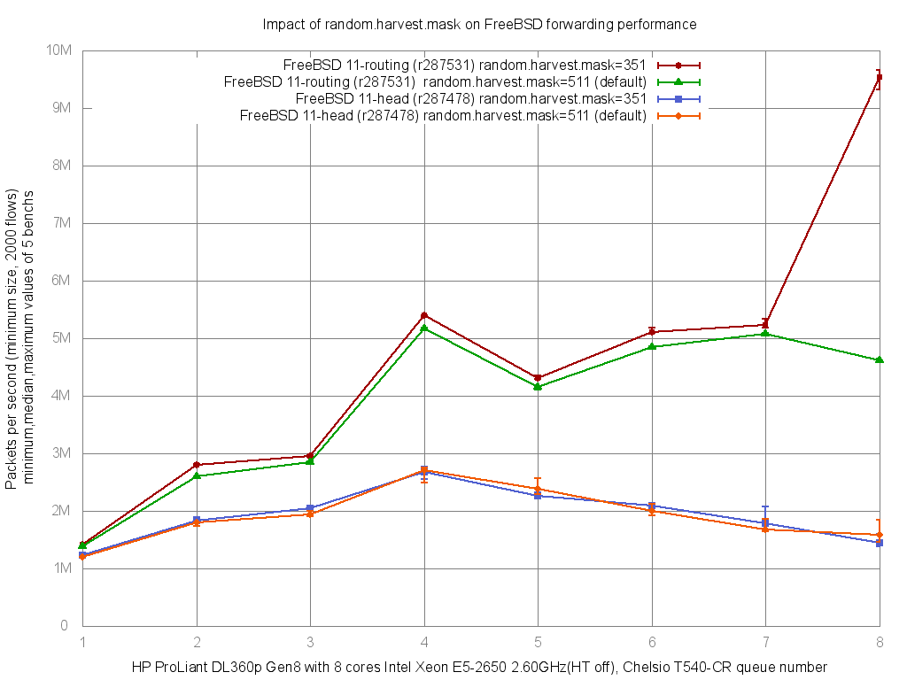

There are lots of guides about [tuning FreeBSD TCP performance](http://serverfault.com/questions/64356/freebsd-performance-tuning-sysctls-loader-conf-kernel) (where the FreeBSD host is an endpoint of the TCP session), but it’s not the same as tuning forwarding (where the FreeBSD host does not need to read the TCP information of the packets being forwarded) or firewalling performance.

## Concepts

### How to bench a router

Benchmarking a router **is not** about measuring the maximum bandwidth crossing the router; it’s about measuring the network throughput in packets-per-second (pps):

- [RFC1242: Benchmarking Terminology for Network Interconnection Devices](http://www.ietf.org/rfc/rfc1242.txt)
- [RFC2544: Benchmarking Methodology for Network Interconnect Devices](http://www.ietf.org/rfc/rfc2544.txt)
- [RFC3222: Terminology for Forwarding Information Base (FIB) based Router Performance](http://tools.ietf.org/html/rfc3222)
- [The Journal of Internet Test Methodologies](http://www.ixiacom.com/pdfs/test_plans/agilent_journal_of_internet_test_methodologies.pdf) (pdf)

### Definition

A clear definition of the relationship between bandwidth and frame rate is necessary:

- [Bandwidth, Packets Per Second, and Other Network Performance Metrics](http://www.cisco.com/web/about/security/intelligence/network_performance_metrics.html): The relationship of bandwidth and packet forwarding rate
- [LAN Ethernet Maximum Rates, Generation, Capturing & Monitoring](http://wiki.networksecuritytoolkit.org/nstwiki/index.php/LAN_Ethernet_Maximum_Rates,_Generation,_Capturing_%26_Monitoring) : Give another good explanation of the Ethernet maximum rates

## Benchmarks

### Cisco or Linux

- [Routing performance of Cisco routers](http://www.cisco.com/web/partners/downloads/765/tools/quickreference/routerperformance.pdf) (PDF)
- [Pushing the Limits of Kernel Networking](http://rhelblog.redhat.com/2015/09/29/pushing-the-limits-of-kernel-networking/) (2015, September) : Linux RedHat 7.2: 1.3Mpps/core and “Beyond the ninth CPU we see some gain but all results are pretty much fixed at 12.4Mpps as this is the limit of the PCIe bandwidth for the device.”
- [RFC2544 Performance Evaluation for a Linux Based Open Router](http://www.telematica.polito.it/oldsite/courmayeur06/papers/06-A.2.1.pdf) (2006, June)
- [Towards 10Gb/s open-source routing](http://data.guug.de/slides/lk2008/10G_preso_lk2008.pdf) (2008): Include an hardware comparison between a “real” router and a PC.
- [Performance consideration for packet processing on Intel Architecture (ppt)](https://wiki.fd.io/images/7/7b/Performance_Consideration_for_packet_processing_on_Intel_Architecture.pptx)

### FreeBSD

Here are some benchmarks regarding FreeBSD network forwarding performance, conducted by the BSDRP team:

- AsiaBSDCon 2018 - Tuning FreeBSD for routing and firewalling ([paper](https://people.freebsd.org/~olivier/talks/2018_AsiaBSDCon_Tuning_FreeBSD_for_routing_and_firewalling-Paper.pdf),[slides](https://people.freebsd.org/~olivier/talks/2018_AsiaBSDCon_Tuning_FreeBSD_for_routing_and_firewalling-Slides.pdf) and [video](https://www.youtube.com/watchv=SLlzep0IxVY))
- [Recipe for building a 10Mpps FreeBSD based router](http://blog.cochard.me/2015/09/receipt-for-building-10mpps-freebsd.html)
- [Impact of enabling ipfw or pf on fastforwarding performance with 8 cores Xeon E5-2650](https://github.com/ocochard/netbenches/blob/master/Xeon_E5-2650-8Cores-Chelsio_T540-CR/forwarding-pf-ipfw/results/fbsd11-routing.r287531/README.md): 9.5Mpps
- [Impact of enabling ipfw or pf on fastforwarding performance with 4 cores Xeon L5630](https://github.com/ocochard/netbenches/blob/master/Xeon_L5630-4Cores-Intel_82599EB/forwarding-pf-ipfw/results/fbsd11-routing.r287531/README.md) : Gigabit line-rate (1.48Mpps) even with few ipfw or pf rules enabled
- [Impact of enabling ipfw or pf on fastforwarding performance with 4 cores Atom C2558E (Netgate RCC-VE 4860)](https://github.com/ocochard/netbenches/blob/master/Atom_C2558_4Cores-Intel_i350/forwarding-pf-ipfw/results/fbsd11-routing.r287531/README.md) : Small device perfect for 1Gb/s of IMIX traffic
- [Impact of enabling ipfw or pf on fastforwarding performance with 2 cores AMD G-T40E (PC Engines APU)](https://github.com/ocochard/netbenches/blob/master/AMD_G-T40E_2Cores_RTL8111E/forwarding-pf-ipfw/results/fbsd11-routing.r287531/README.md): Another cheap router that reach about 400Mb/s of IMIX

## Bench lab

The [bench lab](bench-lab.md) should be set to measure pps. For obtaining accurate results the [RFC 2544 (Benchmarking Methodology for Network Interconnect Devices)](http://www.ietf.org/rfc/rfc2544.txt) is a good reference. If switches are used, they need to have proper configuration, refers to the [BSDRP performance lab](../examples/setting-up-a-forwarding-performance-benchmark-lab.md) for examples.

## Tuning

### Literature

Here is a list of sources for optimizing and analysis forwarding performance under FreeBSD.

How to benchmark or tune the network stack:

- [FreeBSD Network Performance Tuning](http://wiki.freebsd.org/NetworkPerformanceTuning): What need to be done to tune networking stack
- [Brendan Gregg's Performance analysis presentation](http://www.slideshare.net/brendangregg/meetbsd2014-performance-analysis): The “must read” HOW TO
- [FreeBSD Network Performance Project (netperf)](http://www.freebsd.org/projects/netperf/index.html)
- [Introduction to Multithreading and Multiprocessing in the FreeBSD SMPng Network Stack](http://www.watson.org/~robert/freebsd/netperf/20051027-eurobsdcon2005-netperf.pdf), EuroBSDCon 2005 (PDF)
- [man tuning](http://www.freebsd.org/cgi/man.cgiquery=tuning&apropos=0&sektion=0&manpath=FreeBSD+8.2-RELEASE&arch=default&format=html) : performance tuning under FreeBSD
- [Improving Memory and Interrupt Processing in FreeBSD Network Stack](http://wwwx.cs.unc.edu/~krishnan/classes/spring_07/os_impl/report.pdf) (PDF)
- [Optimizing the BSD Routing System for Parallel Processing](http://conferences.sigcomm.org/sigcomm/2009/workshops/presto/papers/p37.pdf) (PDF)
- [Using netstat and vmstat for performance analysis](https://people.sunyit.edu/~sengupta/CSC521/systemperformance.ppt) (Powerpoint))
- [polling man page](http://www.freebsd.org/cgi/man.cgiquery=polling&sektion=4) (Warning: enabling polling is not a good idea with the new generation of Ethernet controller that include interruption control)
- [Device Polling support for FreeBSD](http://info.iet.unipi.it/~luigi/polling/), the original presentation of polling implementation
- [Tuning Kernel Limits](http://www.freebsd.org/doc/en_US.ISO8859-1/books/handbook/configtuning-kernel-limits.html) on the FreeBSD Handbook

FreeBSD Experimental high-performance network stacks:

- [Netmap - memory mapping of network devices](http://info.iet.unipi.it/~luigi/netmap/) *“(…)a single core running at 1.33GHz can generate the 14.8Mpps that saturate a 10GigE interface.”*
- [Network Stack Specialization for Performance](http://conferences.sigcomm.org/hotnets/2013/papers/hotnets-final43.pdf) This paper presents Sandstorm, a clean-slate userspace network stack based on Netmap

### Multiple flows

Do not try to benchmark a router with only one flow (same source and destination address, and same source and destination port): You need to generate multiples flows. Multi-queue NIC uses feature like the [Toeplitz Hash Algorithm](https://en.wikipedia.org/wiki/Toeplitz_Hash_Algorithm) that balance multiples flows across all cores. Generating only one flow will use only a single NIC queue and core.

During your load test, check that each queue is used with sysctl or a [python script like this one](https://github.com/ocochard/BSDRP/blob/master/BSDRP/Files/usr/local/bin/nic-queue-usage) that displays real-time queue usage.

In this example, all flows are correctly shared between the 8 queues (about 340K paquets-per-seconds for each):


```
[root@router]~# nic-queue-usage cxl0
[Q0   346K/s] [Q1   343K/s] [Q2   339K/s] [Q3   338K/s] [Q4   338K/s] [Q5   338K/s] [Q6   343K/s] [Q7   346K/s] [QT  2734K/s  3269K/s ->     0K/s]
[Q0   347K/s] [Q1   344K/s] [Q2   339K/s] [Q3   339K/s] [Q4   338K/s] [Q5   338K/s] [Q6   343K/s] [Q7   346K/s] [QT  2735K/s  3277K/s ->     0K/s]
[Q0   344K/s] [Q1   341K/s] [Q2   338K/s] [Q3   338K/s] [Q4   337K/s] [Q5   337K/s] [Q6   342K/s] [Q7   345K/s] [QT  2727K/s  3262K/s ->     0K/s]
[Q0   355K/s] [Q1   352K/s] [Q2   348K/s] [Q3   349K/s] [Q4   348K/s] [Q5   347K/s] [Q6   352K/s] [Q7   355K/s] [QT  2809K/s  3381K/s ->     0K/s]
[Q0   351K/s] [Q1   348K/s] [Q2   344K/s] [Q3   343K/s] [Q4   342K/s] [Q5   344K/s] [Q6   349K/s] [Q7   352K/s] [QT  2776K/s  3288K/s ->     0K/s]
[Q0   344K/s] [Q1   341K/s] [Q2   338K/s] [Q3   339K/s] [Q4   338K/s] [Q5   338K/s] [Q6   343K/s] [Q7   346K/s] [QT  2731K/s  3261K/s ->     0K/s]
```


!!! warning
    Beware of configurations that prevent multi-queueing, such as GRE, GIF, and IPSec tunnels or PPPoE (which use the same source/destination address). If you must use PPPoE usage on your Gigabit Internet link, using small hardware like a 4-cores AMD GX (PC Engines APU2) will prevent you from reaching Gigabit speed.


### Choosing hardware

#### CPU

Avoid NUMA architecture and instead prefer a CPU in a single package with maximum number of cores. If you are using NUMA, you need to check that inbound and outbound NIC queues are correctly bound to their local domain to avoid unnecessary QPI crossing.

#### Network Interface Card

Mellanox or Chelsio, which combine good chipsets and excellent drivers, are an excellent choice.

Intel seems to have problems managing a large number of PPS (interrupts) and they developers team seems to lack FreeBSD developers.

Avoid “embedded” NICs on common Dell/HP servers, as they perform very poorly in terms of maximum packets-per-second performance:

- 10G Emulex OneConnect (be3)
- 10G Broadcom NetXtreme II BCM57810

### Choosing the right FreeBSD release

Before tuning, you need to use the good FreeBSD version, which mean a recent FreeBSD (main branch advised).

BSDRP follows the FreeBSD main branch to strike a balance between recent features and stability (yes, it is quiet stable).

### Disabling Hyper-Threading (on specific CPUs only)

By default, a multi-queue NIC drivers create one queue per core. However, on some older CPUs (like Xeon E5-2650 V1), these logical cores do not help at all with managing interrupts generated by a high-speed NIC.

HT can be disabled with this command:

```
echo 'machdep.hyperthreading_allowed="0"' >> /boot/loader.conf
```

Here is an example on a Xeon E5 2650 (8c,16t) with a 10G Chelsio NIC, where disabling HT improve performance:

```
x HT-enabled-8rxq(default): inet packets-per-second forwarded
+ HT-enabled-16rxq: inet packets-per-second forwarded
* HT-disabled-8rxq: inet packets-per-seconds forwarded
+--------------------------------------------------------------------------+
|                                                                        **|
|x      xx    x          +       + + +  +                               ***|
|   |____A_____|                                                           |
|                           |_____AM____|                                  |
|                                                                       |A||
+--------------------------------------------------------------------------+
    N           Min           Max        Median           Avg        Stddev
x   5       4500078       4735822       4648451     4648293.8     94545.404
+   5       4925106       5198632       5104512     5088362.1     102920.87
Difference at 95.0% confidence
        440068 +/- 144126
        9.46731% +/- 3.23827%
        (Student's t, pooled s = 98821.9)
*   5       5765684     5801231.5       5783115     5785004.7     13724.265
Difference at 95.0% confidence
        1.13671e+06 +/- 98524.2
        24.4544% +/- 2.62824%
        (Student's t, pooled s = 67554.4)
```

There is a benefit of about 24% to disable hyper threading on this old CPU.

However, here is another example on a Xeon E5 2650L (10c, 20t) where it is a beneficial to kept HT enabled and configure the NIC to use all threads:

```
x HT on, 8q (default): inet4 packets-per-second forwarded
+ HT off, 8q: inet4 packets-per-second forwarded
* HT on, 16q: inet4 packets-per-second forwarded
+--------------------------------------------------------------------------+
|x x              ++                                                   *  *|
|x xx            +++                                                 * *  *|
||AM|            |A_|                                                |_MA_||
+--------------------------------------------------------------------------+
    N           Min           Max        Median           Avg        Stddev
x   5       4265579     4433699.5     4409249.5     4359580.3       81559.4
+   5       5257621       5443012       5372493     5372693.5     73316.243
Difference at 95.0% confidence
        1.01311e+06 +/- 113098
        23.2388% +/- 2.94299%
        (Student's t, pooled s = 77547.4)
*   5       8566972       8917315     8734750.5     8769616.1     147186.74
Difference at 95.0% confidence
        4.41004e+06 +/- 173536
        101.157% +/- 5.21388%
        (Student's t, pooled s = 118987)
```

### fastforwarding

#### FreeBSD 12.0 or newer

You should enable tryforward by disabling ICMP redirect:

```
echo "net.inet.ip.redirect=0"  >> /etc/sysctl.conf
echo "net.inet6.ip6.redirect=0" >> /etc/sysctl.conf
service sysctl restart
```

### Entropy harvest impact

Many tuning guide suggest disabling:

- kern.random.sys.harvest.ethernet
- kern.random.sys.harvest.interrupt

By default the binary mask 511 select almost all these source as entropy sources:

```
kern.random.harvest.mask_symbolic: [UMA],[FS_ATIME],SWI,INTERRUPT,NET_NG,NET_ETHER,NET_TUN,MOUSE,KEYBOARD,ATTACH,CACHED
kern.random.harvest.mask_bin: 00111111111
kern.random.harvest.mask: 511
```

By replacing this mask by 351, we exclude INTERRUPT and NET_ETHER:

```
kern.random.harvest.mask_symbolic: [UMA],[FS_ATIME],SWI,[INTERRUPT],NET_NG,[NET_ETHER],NET_TUN,MOUSE,KEYBOARD,ATTACH,CACHED
kern.random.harvest.mask_bin: 00101011111
kern.random.harvest.mask: 351
```

On a FreeBSD 11.1, we can see the impact on forwarding performance:

```
x PC-Engines-APU2-igb, 511 (default): inet4 packets-per-second
+ PC-Engines-APU2-igb, 351: inet4 packets-per-second
+--------------------------------------------------------------------------+
|xx  x       xx                                 +      +    +    +        +|
||___M_A_____|                                                             |
|                                                  |________A_________|    |
+--------------------------------------------------------------------------+
    N           Min           Max        Median           Avg        Stddev
x   5        724811        730197        726304      727281.6     2522.9161
+   5        744832      755871.5        749956      750112.9     4208.7383
Difference at 95.0% confidence
        22831.3 +/- 5060.46
        3.13927% +/- 0.701645%
        (Student's t, pooled s = 3469.77
```

On a PC Engines APU2, there is +3% performance benefit

```
x Netgate-igb, 511 (default): inet4 packets-per-second
+ Netgate-igb, 351: inet4 packets-per-second
+--------------------------------------------------------------------------+
|x x    x          x     x                                   ++      +  + +|
||______M__A__________|                                                    |
|                                                             |_____AM___| |
+--------------------------------------------------------------------------+
    N           Min           Max        Median           Avg        Stddev
x   5      946426.5        965962        951906      954721.7     8435.4561
+   5        994839       1005327       1000935     1000098.2     4620.4263
Difference at 95.0% confidence
        45376.5 +/- 9918.76
        4.75285% +/- 1.0771%
        (Student's t, pooled s = 6800.93)
```

On a Netgate RCC-VE 4860 there is about 4.7% performance benefit.

Using the FreeBSD “projects/routing” branch, this impact is a lot’s more important:



### NIC drivers tuning

#### RX & TX descriptor (queue) size on igb

Received (hw.igb.rxd) and transmit (hw.igb.txd) internal buffer size of igb/em NIC can be increased, but it’s not a good idea.

Here are some examples that decrease performance when buffer increased:

```
x PC-Engine-APU2-igb, 1024 (default): inet4 packets-per-second
+ PC-Engine-APU2-igb, 2048: inet4 packets-per-second
* PC-Engine-APU2-igb, 4096: inet4 packets-per-second
+--------------------------------------------------------------------------+
|*                                                                         |
|* ***                  + +  +++                                      xx xx|
|                                                                      MA| |
|                        |__AM_|                                           |
||_A_|                                                                     |
+--------------------------------------------------------------------------+
    N           Min           Max        Median           Avg        Stddev
x   5        724024        731531        726058      727317.6     3006.2996
+   5        626546        640326        637463      634497.6     5856.2198
Difference at 95.0% confidence
        -92820 +/- 6788.67
        -12.762% +/- 0.909828%
        (Student's t, pooled s = 4654.74)
*   5        577830        585426        582886      581913.4     3413.6019
Difference at 95.0% confidence
        -145404 +/- 4690.94
        -19.9918% +/- 0.592106%
        (Student's t, pooled s = 3216.4)
```

On a PC Engines APU2, increasing rx&tx buffers badly impact forwarding perfomance to about 20%.

```
x Netgate-igb, 1024 (default): inet4 packets-per-second
+ Netgate-igb, 2048: inet4 packets-per-second
* Netaget-igb, 4096: inet4 packets-per-second
+--------------------------------------------------------------------------+
|*      *       *    *   *+   ++      +    +               x   x x      x x|
|                                                           |____MA______| |
|                          |___M__A______|                                 |
|   |_________A_M______|                                                   |
+--------------------------------------------------------------------------+
    N           Min           Max        Median           Avg        Stddev
x   5        943843        961431        950960      952699.4     7285.7808
+   5        907050        926520        912317      915489.3       7816.85
Difference at 95.0% confidence
        -37210.1 +/- 11020
        -3.90575% +/- 1.13593%
        (Student's t, pooled s = 7555.98)
*   5        877923        904869        894519      892616.2     10954.317
Difference at 95.0% confidence
        -60083.2 +/- 13567.4
        -6.30663% +/- 1.39717%
        (Student's t, pooled s = 9302.68)
```

On a Netgate RCC-VE 4860 performance decrease to about 6%.

#### Maximum number of received packets to process at a time (Intel)

By default Intel drivers (em\|igb) limit the maximum number of received packets to process at a time (hw.igb.rx_process_limit=100).

Disabling this limit can improve a little bit the overall performance:

```
x PC-Engines-APU2-igb, 100 (default): inet4 packets-per-second
+ PC-Engines-APU2-igb, disabled: inet4 packets-per-second
+--------------------------------------------------------------------------+
|x         x                   x   x     x               +        ++ +    +|
|      |________________A______M_________|                                 |
|                                                            |_____A_____| |
+--------------------------------------------------------------------------+
    N           Min           Max        Median           Avg        Stddev
x   5        721322        729817        727669      726175.8     3592.7624
+   5        733327        736835        735392      735283.4     1266.5036
Difference at 95.0% confidence
        9107.6 +/- 3928.6
        1.25419% +/- 0.547037%
        (Student's t, pooled s = 2693.69)
```

A small 1% improvement on a PC Engines APU2.

```
x Netgate-igb, 100 (default): inet4 packets-per-second
+ Netgate-igb, disabled: inet4 packets-per-second
+--------------------------------------------------------------------------+
|x    x         x                    x              x  +    + +        +  +|
||______________M_____A_____________________|                              |
|                                                       |_____M_A_______|  |
+--------------------------------------------------------------------------+
    N           Min           Max        Median           Avg        Stddev
x   5        943049        963053        948889      951350.1     8428.1046
+   5        964038        971603        966764      967747.4     3168.1615
Difference at 95.0% confidence
        16397.3 +/- 9285.49
        1.72358% +/- 0.990789%
        (Student's t, pooled s = 6366.72)
```

Almost same improvement, 1.7% on a Netgate.

#### Increasing maximum interrupts per second

By default igb\|em limit the maximum number of interrupts per second to 8000.

What result by increasing this number:

```
x PC-Engine-APU2-igb, max_interrupt_rate=8000 (default): inet4 pps
+ PC-Engine-APU2-igb, max_interrupt_rate=16000: inet4 pps
* PC-Engine-APU2-igb, max_interrupt_rate=32000: inet4 pps
+--------------------------------------------------------------------------+
|x           x              +   x*     *+*              *  x+x           +*|
|     |_________________________MA__________________________|              |
|                         |_____________M_____A___________________|        |
|                                |_______M_______A_______________|         |
+--------------------------------------------------------------------------+
    N           Min           Max        Median           Avg        Stddev
x   5        721191        730448        725919      726128.6     4137.1981
+   5        725281        732247        727142        728045     3083.0635
No difference proven at 95.0% confidence
*   5        726157        732417        727400        728554     2518.7778
No difference proven at 95.0% confidence
```

No benefit on a PC Engines APU2.

```
x Netgate-igb, max_interrupt_rate=8000 (default): inet4 pps
+ Netgate-igb, max_interrupt_rate=16000: inet4 pps
* Netgate-igb, max_interrupt_rate=32000: inet4 pps
+--------------------------------------------------------------------------+
|x              *   x    x*   +*   x       +       *       +   +    *     +|
|       |________________MA__________________|                             |
|                                    |________________A____M___________|   |
|                |_____________M_______A____________________|              |
+--------------------------------------------------------------------------+
    N           Min           Max        Median           Avg        Stddev
x   5      936969.5        954851        945631      946049.3      6595.479
+   5        947461        962965        957754        955782      6143.043
Difference at 95.0% confidence
        9732.7 +/- 9295.06
        1.02877% +/- 0.987938%
        (Student's t, pooled s = 6373.28)
*   5        942302        960913        947667      950327.4     7504.7836
No difference proven at 95.0% confidence
```

A little 1% benefit if doubled form the default (8000 to 16000), but no benefit after.

#### Disabling LRO and TSO

All modern NIC support [LRO](http://en.wikipedia.org/wiki/Large_receive_offload) and [TSO](http://en.wikipedia.org/wiki/Large_segment_offload) features that needs to be disabled on a router:

1.  By waiting to store multiple packets at the NIC level before to hand them up to the stack: This add latency, and because all packets need to be sending out again, the stack have to split in different packets again before to hand them down to the NIC. [Intel drivers readme](http://downloadmirror.intel.com/22919/eng/README.txt) include this note “The result of not disabling LRO when combined with ip forwarding or bridging can be low throughput or even a kernel panic.”
2.  This break the [End-to-end principle](http://en.wikipedia.org/wiki/End-to-end_principle)

There is no real impact of disabling these features on PPS performance:

```
x Xeon_E5-2650-8Cores-Chelsio_T540, TSO-LRO-enabled (default): inet4 packets-per-second
+ Xeon_E5-2650-8Cores-Chelsio_T540, TSO-LRO-disabled: inet4 packets-per-second
+--------------------------------------------------------------------------+
|x                    x     +x        +     x  +x                   +     +|
|         |__________________A__________________|                          |
|                              |_______________M___A__________________|    |
+--------------------------------------------------------------------------+
    N           Min           Max        Median           Avg        Stddev
x   5       5727360     5806270.5       5773573     5773454.5     31394.005
+   5       5771681       5848728       5803277     5810232.2     32556.338
No difference proven at 95.0% confidence
```

### Where is the bottleneck ?

Tools:

- [MeetBSD 2014 - Brendan Gregg's performance analysis presentation](http://www.slideshare.net/brendangregg/meetbsd2014-performance-analysis) : The ultimate guide for performance analysis on FreeBSD
- [netstat](http://www.freebsd.org/cgi/man.cgiquery=netstat): show network status
- [vmstat](http://www.freebsd.org/cgi/man.cgiquery=vmstat): report virtual memory statistics
- [top](http://www.freebsd.org/cgi/man.cgiquery=top): display and update information about the top cpu processes
- [pmcstat](https://www.freebsd.org/cgi/man.cgiquery=pmcstat): Measuring performance using hardward counter

#### Packets load

Display the information regarding packet traffic, with refresh each second.

Here is a first example:

```
[root@hp]~# netstat -ihw1
            input        (Total)           output
   packets  errs idrops      bytes    packets  errs      bytes colls
       14M     0  7.9M       836M       5.8M     0       353M     0
       14M     0  8.0M       841M       5.8M     0       352M     0
       14M     0  8.1M       849M       5.8M     0       353M     0
       14M     0  7.8M       833M       5.8M     0       352M     0
       14M     0  7.9M       837M       5.8M     0       352M     0
       14M     0  8.0M       843M       5.8M     0       353M     0
       14M     0  7.9M       838M       5.8M     0       352M     0
```

=\> This system is receiving 14Mpps (10G line-rate) and reach to forwarding only at 5.8Mpps rate then need to drop about 8Mpps.

#### Traffic distribution between each queues

Check the input queues are equally distributed. BSDRP include a sysctl parser script for that:

```
[root@hp]~# nic-queue-usage cxl0
[Q0   935K/s] [Q1   944K/s] [Q2   925K/s] [Q3   912K/s] [Q4   914K/s] [Q5   914K/s] [Q6   930K/s] [Q7   922K/s] [QT  7400K/s 17749K/s ->     2K/s]
[Q0   886K/s] [Q1   892K/s] [Q2   872K/s] [Q3   883K/s] [Q4   885K/s] [Q5   885K/s] [Q6   906K/s] [Q7   900K/s] [QT  7112K/s 16950K/s ->     1K/s]
[Q0   874K/s] [Q1   879K/s] [Q2   855K/s] [Q3   855K/s] [Q4   852K/s] [Q5   842K/s] [Q6   866K/s] [Q7   860K/s] [QT  6887K/s 16748K/s ->     1K/s]
[Q0   892K/s] [Q1   899K/s] [Q2   870K/s] [Q3   865K/s] [Q4   873K/s] [Q5   882K/s] [Q6   899K/s] [Q7   893K/s] [QT  7076K/s 17023K/s ->     1K/s]
[Q0   880K/s] [Q1   890K/s] [Q2   878K/s] [Q3   882K/s] [Q4   883K/s] [Q5   885K/s] [Q6   904K/s] [Q7   896K/s] [QT  7102K/s 16864K/s ->     1K/s]
[Q0   894K/s] [Q1   891K/s] [Q2   868K/s] [Q3   864K/s] [Q4   860K/s] [Q5   860K/s] [Q6   882K/s] [Q7   873K/s] [QT  6996K/s 17154K/s ->     1K/s]
[Q0   876K/s] [Q1   889K/s] [Q2   873K/s] [Q3   876K/s] [Q4   881K/s] [Q5   878K/s] [Q6   898K/s] [Q7   890K/s] [QT  7064K/s 16586K/s ->     1K/s]
[Q0   957K/s] [Q1   964K/s] [Q2   941K/s] [Q3   941K/s] [Q4   943K/s] [Q5   945K/s] [Q6   967K/s] [Q7   963K/s] [QT  7624K/s 18220K/s ->     1K/s]
[Q0   864K/s] [Q1   873K/s] [Q2   853K/s] [Q3   852K/s] [Q4   854K/s] [Q5   856K/s] [Q6   874K/s] [Q7   868K/s] [QT  6897K/s 16413K/s ->     1K/s]
```

=\> All 8 receive queues are correctly used here.

#### Interrupt usage

Report on the number of interrupts taken by each device since system startup,

Here is a first example:

```
[root@hp]~# vmstat -i
interrupt                          total       rate
irq1: atkbd0                           6          0
irq4: uart0                            3          0
irq20: ehci1                        3263          3
irq21: ehci0                       12612         10
cpu0:timer                        749022        583
cpu6:timer                        736682        573
cpu7:timer                        742555        578
cpu1:timer                        739964        576
cpu2:timer                        739621        575
cpu5:timer                        738796        575
cpu4:timer                        738756        575
cpu3:timer                        737954        574
irq273: igb1:que 0                  1291          1
irq274: igb1:que 1                  1245          1
irq275: igb1:que 2                  1245          1
irq276: igb1:que 3                  1246          1
irq277: igb1:que 4                  1245          1
irq278: igb1:que 5                  2435          2
irq279: igb1:que 6                  1245          1
irq280: igb1:que 7                  1245          1
irq281: igb1:link                      2          0
irq283: t5nex0:evt                     4          0
irq284: t5nex0:0a0                608689        474
irq285: t5nex0:0a1                281882        219
irq286: t5nex0:0a2                875179        681
irq287: t5nex0:0a3                813033        632
irq288: t5nex0:0a4                968845        754
irq289: t5nex0:0a5               1099491        855
irq290: t5nex0:0a6                 58210         45
irq291: t5nex0:0a7                638755        497
irq294: t5nex0:1a0                102669         80
irq295: t5nex0:1a1                136891        106
irq296: t5nex0:1a2                 51888         40
irq297: t5nex0:1a3                 59324         46
irq298: t5nex0:1a4                 61052         47
irq299: t5nex0:1a5                 80827         63
irq300: t5nex0:1a6                 88800         69
irq301: t5nex0:1a7                102177         79
Total                           11978149       9318
```

=\> There is no IRQ sharing here, and each queue have correctly their own IRQ (thanks MSI-X).

#### Memory Buffer

Show statistics recorded by the memory management routines. The network manages a private pool of memory buffers.

```
[root@hp]~# vmstat -z | head -1 ; vmstat -z | grep -i mbuf
ITEM                   SIZE  LIMIT     USED     FREE      REQ FAIL SLEEP
mbuf_packet:            256, 26137965,    8190,    1424,    9121,   0,   0
mbuf:                   256, 26137965,    3657,    4699,4372990387,   0,   0
mbuf_cluster:          2048, 4084056,    9614,      12,    9614,   0,   0
mbuf_jumbo_page:       4096, 2042027,   16192,     131,   16207,   0,   0
mbuf_jumbo_9k:         9216, 605045,       0,       0,       0,   0,   0
mbuf_jumbo_16k:       16384, 340337,     128,       0,     128,   0,   0
```

=\> No “failed” here.

#### CPU / NIC

top can give very useful information regarding the CPU/NIC affinity:

```
[root@hp]~# top -CHIPS
last pid:  1180;  load averages: 10.05,  8.86,  5.71                                                 up 0+00:23:58  12:05:19
187 processes: 15 running, 100 sleeping, 72 waiting
CPU 0:  0.0% user,  0.0% nice,  0.0% system, 96.9% interrupt,  3.1% idle
CPU 1:  0.0% user,  0.0% nice,  0.0% system, 99.2% interrupt,  0.8% idle
CPU 2:  0.0% user,  0.0% nice,  0.0% system, 99.6% interrupt,  0.4% idle
CPU 3:  0.0% user,  0.0% nice,  0.0% system, 97.7% interrupt,  2.3% idle
CPU 4:  0.0% user,  0.0% nice,  0.0% system, 98.1% interrupt,  1.9% idle
CPU 5:  0.0% user,  0.0% nice,  0.0% system, 97.3% interrupt,  2.7% idle
CPU 6:  0.0% user,  0.0% nice,  0.0% system, 97.7% interrupt,  2.3% idle
CPU 7:  0.0% user,  0.0% nice,  0.0% system, 97.3% interrupt,  2.7% idle
Mem: 16M Active, 16M Inact, 415M Wired, 7239K Buf, 62G Free
Swap:

  PID USERNAME   PRI NICE   SIZE    RES STATE   C   TIME     CPU COMMAND
   12 root       -92    -     0K  1248K CPU1    1  13:14 100.00% intr{irq285: t5nex0:0a1}
   12 root       -92    -     0K  1248K CPU7    7  13:09  98.54% intr{irq284: t5nex0:0a0}
   12 root       -92    -     0K  1248K WAIT    3  13:10  98.21% intr{irq291: t5nex0:0a7}
   12 root       -92    -     0K  1248K WAIT    6  13:02  97.33% intr{irq287: t5nex0:0a3}
   12 root       -92    -     0K  1248K CPU0    0  13:02  97.30% intr{irq286: t5nex0:0a2}
   12 root       -92    -     0K  1248K CPU5    5  13:01  97.26% intr{irq288: t5nex0:0a4}
   12 root       -92    -     0K  1248K WAIT    4  12:59  97.19% intr{irq289: t5nex0:0a5}
   12 root       -92    -     0K  1248K CPU2    2  13:17  11.43% intr{irq290: t5nex0:0a6}
   11 root       155 ki31     0K   128K RUN     5  11:02   2.86% idle{idle: cpu5}
   11 root       155 ki31     0K   128K RUN     6  10:58   2.31% idle{idle: cpu6}
   11 root       155 ki31     0K   128K RUN     3  10:52   2.11% idle{idle: cpu3}
   11 root       155 ki31     0K   128K CPU4    4  10:58   2.05% idle{idle: cpu4}
   11 root       155 ki31     0K   128K RUN     7  10:54   1.87% idle{idle: cpu7}
   11 root       155 ki31     0K   128K RUN     0  10:54   1.72% idle{idle: cpu0}
   11 root       155 ki31     0K   128K RUN     1  10:52   1.20% idle{idle: cpu1}
   15 root       -16    -     0K    16K -       7   0:02   0.24% rand_harvestq
    0 root       -92    -     0K   624K -       6   0:01   0.10% kernel{t5nex0 tq1}
   11 root       155 ki31     0K   128K RUN     2  10:44   0.09% idle{idle: cpu2}
 1180 root        20    0 20012K  3876K CPU4    4   0:00   0.06% top
   12 root       -92    -     0K  1248K WAIT    0   0:00   0.04% intr{irq301: t5nex0:1a7}
   12 root       -92    -     0K  1248K WAIT    6   0:00   0.03% intr{irq295: t5nex0:1a1}
   12 root       -92    -     0K  1248K WAIT    4   0:00   0.03% intr{irq300: t5nex0:1a6}
   12 root       -92    -     0K  1248K WAIT    7   0:00   0.03% intr{irq299: t5nex0:1a5}
   12 root       -92    -     0K  1248K WAIT    0   0:00   0.03% intr{irq294: t5nex0:1a0}
   12 root       -60    -     0K  1248K WAIT    1   0:00   0.02% intr{swi4: clock (0)}
   12 root       -92    -     0K  1248K WAIT    4   0:00   0.02% intr{irq296: t5nex0:1a2}
   12 root       -92    -     0K  1248K WAIT    0   0:00   0.02% intr{irq298: t5nex0:1a4}
   12 root       -92    -     0K  1248K WAIT    0   0:00   0.01% intr{irq297: t5nex0:1a3}
 1090 root        20    0 56296K  6384K select  3   0:00   0.00% sshd
   14 root       -68    -     0K   240K -       6   0:00   0.00% usb{usbus2}
   14 root       -68    -     0K   240K -       6   0:00   0.00% usb{usbus2}
   14 root       -68    -     0K   240K -       6   0:00   0.00% usb{usbus0}
   12 root       -88    -     0K  1248K WAIT    6   0:00   0.00% intr{irq20: ehci1}
   12 root       -92    -     0K  1248K WAIT    5   0:00   0.00% intr{irq278: igb1:que 5}
   14 root       -68    -     0K   240K -       6   0:00   0.00% usb{usbus0}
   12 root       -88    -     0K  1248K WAIT    6   0:00   0.00% intr{irq21: ehci0}
   14 root       -68    -     0K   240K -       1   0:00   0.00% usb{usbus1}
   18 root       -16    -     0K    48K psleep  5   0:00   0.00% pagedaemon{pagedaemon}
   24 root        16    -     0K    16K syncer  0   0:00   0.00% syncer
   21 root       -16    -     0K    16K -       5   0:00   0.00% bufspacedaemon
   23 root       -16    -     0K    16K vlruwt  7   0:00   0.00% vnlru
```

#### Drivers

Depending the NIC drivers used, there are some counters available:

```
[root@hp]~# sysctl dev.cxl.0.stats.
dev.cxl.0.stats.rx_ovflow2: 0
dev.cxl.0.stats.rx_ovflow1: 0
dev.cxl.0.stats.rx_ovflow0: 7301719197
dev.cxl.0.stats.rx_ppp7: 0
dev.cxl.0.stats.rx_ppp6: 0
dev.cxl.0.stats.rx_ppp5: 0
dev.cxl.0.stats.rx_ppp4: 0
dev.cxl.0.stats.rx_ppp3: 0
dev.cxl.0.stats.rx_ppp2: 0
dev.cxl.0.stats.rx_ppp1: 0
dev.cxl.0.stats.rx_ppp0: 0
dev.cxl.0.stats.rx_pause: 0
dev.cxl.0.stats.rx_frames_1519_max: 0
dev.cxl.0.stats.rx_frames_1024_1518: 0
dev.cxl.0.stats.rx_frames_512_1023: 0
dev.cxl.0.stats.rx_frames_256_511: 0
dev.cxl.0.stats.rx_frames_128_255: 0
dev.cxl.0.stats.rx_frames_65_127: 0
dev.cxl.0.stats.rx_frames_64: 12522860904
(...)
[root@hp]~# sysctl -d dev.cxl.0.stats.rx_ovflow0
dev.cxl.0.stats.rx_ovflow0: # drops due to buffer-group 0 overflows
```

=\> Notice the high level of “drops du to buffer-group 0 overflows”. It’s a problem regarding global performance of the system (on this example, the packet generator send smallest packet at a rate about 14Mpps).

#### pmcstat

During high-load of your router/firewall, load the [hwpmc(4)](https://www.freebsd.org/cgi/man.cgiquery=hwpmc&sektion=4) module:

```
kldload hwpmc
```

##### Time used by process

Now you can display the most time consumed process with:

- AMD: ls_not_halted_cyc
- Intel: cpu_clk_unhalted.thread_p
- ARM: CPU_CYCLES

<!-- -->

```
pmcstat -TS cpu_clk_unhalted.thread_p -w1
```

That will display this output:

```
PMC: [INSTR_RETIRED_ANY] Samples: 56877 (100.0%) , 0 unresolved

%SAMP IMAGE      FUNCTION             CALLERS
  7.2 kernel     bzero                m_pkthdr_init:2.4 ip_findroute:1.8 ip_tryforward:1.6 fib4_lookup_nh_basic:1.3
  6.1 if_cxgbe.k eth_tx               drain_ring
  5.9 kernel     bcopy                eth_tx:2.3 arpresolve:1.9 get_scatter_segment:1.7
  4.5 kernel     atomic_cmpset_long   mp_ring_enqueue:2.5 drain_ring:2.0
  3.7 kernel     __rw_rlock           arpresolve:2.7 fib4_lookup_nh_basic:1.0
  3.4 kernel     rn_match             fib4_lookup_nh_basic
  3.3 kernel     ip_tryforward        ip_input
  3.2 kernel     _rw_runlock_cookie   fib4_lookup_nh_basic:2.2 arpresolve:1.0
  2.9 if_cxgbe.k reclaim_tx_descs     eth_tx
  2.9 if_cxgbe.k service_iq           t4_intr
  2.9 kernel     ether_output         ip_tryforward
  2.8 kernel     ether_nh_input       netisr_dispatch_src
  2.8 if_cxgbe.k cxgbe_transmit       ether_output
  2.8 kernel     netisr_dispatch_src  ether_demux:1.7 ether_input:1.1
  2.7 kernel     uma_zalloc_arg       get_scatter_segment
  2.5 kernel     _rm_rlock            in_localip
  2.4 if_cxgbe.k t4_eth_rx            service_iq
  2.3 if_cxgbe.k parse_pkt            cxgbe_transmit
  2.3 kernel     memcpy               ether_output
  2.2 kernel     uma_zfree_arg        m_freem
  2.1 kernel     spinlock_exit        ether_nh_input
  2.0 kernel     fib4_lookup_nh_basic ip_findroute
  2.0 kernel     ip_input             netisr_dispatch_src
  2.0 if_cxgbe.k get_scatter_segment  service_iq
  1.9 kernel     __mtx_lock_flags     eth_tx
  1.8 kernel     __mtx_unlock_flags   eth_tx
  1.6 kernel     random_harvest_queue ether_nh_input
  1.4 if_cxgbe.k mp_ring_enqueue      cxgbe_transmit
  1.1 kernel     bcmp                 ether_nh_input
  1.1 kernel     critical_enter
  1.1 kernel     key_havesp           ipsec4_capability
  1.0 kernel     m_adj                ether_demux
  1.0 kernel     ipsec4_capability    ip_input
  1.0 kernel     in_localip           ip_tryforward
  0.9 kernel     pmap_kextract        parse_pkt
  0.7 kernel     ether_demux          ether_nh_input
  0.7 kernel     arpresolve           ether_output
  0.7 kernel     _rm_runlock          in_localip
  0.7 kernel     sglist_count         parse_pkt
  0.6 kernel     lock_delay           _mtx_lock_spin_cookie
  0.6 kernel     critical_exit
```

On this case the bootleneck is just the network stack (most of the time spend into function ip_findroute called by ip_tryforward).

##### CPU cycles spent

For displaying where the most cpu cycles are being spent with. We first need a partition with about 200MB that include the debug kernel:

```
system expand-data-slice
mount /data
```

Then, under high-load, start collecting during about 20 seconds:

```
pmcstat -z 50 -S cpu_clk_unhalted.thread -l 20 -O /data/pmc.out
pmcstat -R /data/pmc.out -z50 -G /data/pmc.stacks
less /data/pmc.stacks
```

#### Lock contention source

To identifying lock contention source (like if function lock_delay or __mtx_lock_sleep was quite high from the pcm output), you can try to search which lock is contended and why with lockstat.

You can generate 2 output:

- contented locks broken down by type:
      lockstat -x aggsize=4m sleep 10 > lock-type.txt
- stacks associated with the lock contention to identify the source:
      lockstat -x aggsize=4m -s 10 sleep 10 > lock-stacks.txt 
